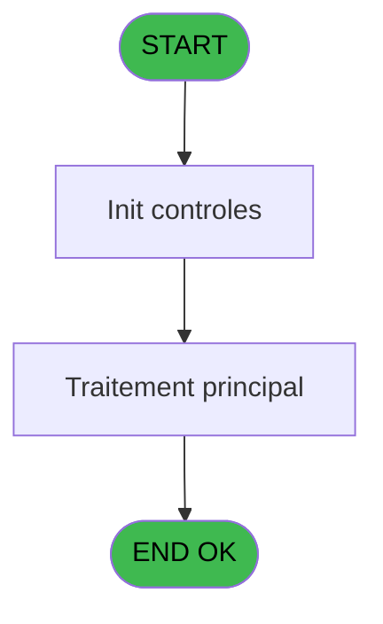
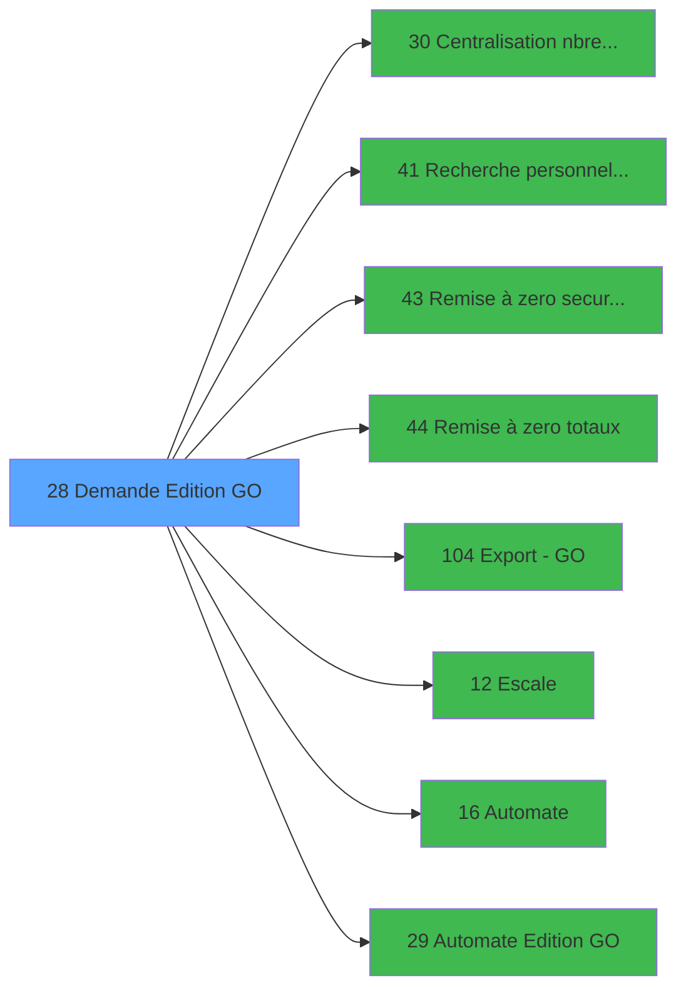

# PBP IDE 28 - Demande Edition GO

> **Analyse**: Phases 1-4 2026-02-03 01:15 -> 01:16 (38s) | Assemblage 01:16
> **Pipeline**: V7.2 Enrichi
> **Structure**: 4 onglets (Resume | Ecrans | Donnees | Connexions)

<!-- TAB:Resume -->

## 1. FICHE D'IDENTITE

| Attribut | Valeur |
|----------|--------|
| Projet | PBP |
| IDE Position | 28 |
| Nom Programme | Demande Edition GO |
| Fichier source | `Prg_28.xml` |
| Domaine metier | Impression |
| Taches | 2 (1 ecrans visibles) |
| Tables modifiees | 0 |
| Programmes appeles | 8 |
| :warning: Statut | **ORPHELIN_POTENTIEL** |

## 2. DESCRIPTION FONCTIONNELLE

**Demande Edition GO** assure la gestion complete de ce processus.

Le flux de traitement s'organise en **2 blocs fonctionnels** :

- **Consultation** (1 tache) : ecrans de recherche, selection et consultation
- **Traitement** (1 tache) : traitements metier divers

Detail : phases du traitement

#### Phase 1 : Traitement (1 tache)

- **28** - Passeport GO **[[ECRAN]](#ecran-t1)**

Delegue a : [   Remise à zero securite equi (IDE 43)](PBP-IDE-43.md), [   Remise à zero totaux (IDE 44)](PBP-IDE-44.md), [Export - GO (IDE 104)](PBP-IDE-104.md), [Escale (IDE 12)](PBP-IDE-12.md), [Automate (IDE 16)](PBP-IDE-16.md)

#### Phase 2 : Consultation (1 tache)

- **28.1** - Recherche du commandant

## 3. BLOCS FONCTIONNELS

### 3.1 Traitement (1 tache)

Traitements internes.

---

#### 28 - Passeport GO [[ECRAN]](#ecran-t1)

**Role** : Traitement : Passeport GO.
**Ecran** : 1026 x 253 DLU (MDI) | [Voir mockup](#ecran-t1)
**Delegue a** : [   Remise à zero securite equi (IDE 43)](PBP-IDE-43.md), [   Remise à zero totaux (IDE 44)](PBP-IDE-44.md), [Export - GO (IDE 104)](PBP-IDE-104.md)

### 3.2 Consultation (1 tache)

Ecrans de recherche et consultation.

---

#### 28.1 - Recherche du commandant

**Role** : Traitement : Recherche du commandant.
**Variables liees** : A (v. commandant)
**Delegue a** : [   Recherche personnel Valider (IDE 41)](PBP-IDE-41.md)

## 5. REGLES METIER

*(Aucune regle metier identifiee)*

## 6. CONTEXTE

- **Appele par**: (aucun)
- **Appelle**: 8 programmes | **Tables**: 3 (W:0 R:2 L:1) | **Taches**: 2 | **Expressions**: 61

<!-- TAB:Ecrans -->

## 8. ECRANS

### 8.1 Forms visibles (1 / 2)

| # | Position | Tache | Nom | Type | Largeur | Hauteur | Bloc |
|---|----------|-------|-----|------|---------|---------|------|
| 1 | 28 | 28 | Passeport GO | MDI | 1026 | 253 | Traitement |

### 8.2 Mockups Ecrans

---

#### 28 - Passeport GO
**Tache** : [28](#t1) | **Type** : MDI | **Dimensions** : 1026 x 253 DLU
**Bloc** : Traitement | **Titre IDE** : Passeport GO

<!-- FORM-DATA:
{
    "width":  1026,
    "vFactor":  8,
    "type":  "MDI",
    "hFactor":  8,
    "controls":  [
                     {
                         "x":  0,
                         "type":  "label",
                         "var":  "",
                         "y":  1,
                         "w":  1022,
                         "fmt":  "",
                         "name":  "",
                         "h":  19,
                         "color":  "1",
                         "text":  "",
                         "parent":  null
                     },
                     {
                         "x":  24,
                         "type":  "label",
                         "var":  "",
                         "y":  24,
                         "w":  772,
                         "fmt":  "",
                         "name":  "",
                         "h":  22,
                         "color":  "",
                         "text":  "",
                         "parent":  null
                     },
                     {
                         "x":  844,
                         "type":  "label",
                         "var":  "",
                         "y":  24,
                         "w":  178,
                         "fmt":  "",
                         "name":  "",
                         "h":  194,
                         "color":  "",
                         "text":  "",
                         "parent":  null
                     },
                     {
                         "x":  43,
                         "type":  "label",
                         "var":  "",
                         "y":  31,
                         "w":  128,
                         "fmt":  "",
                         "name":  "",
                         "h":  8,
                         "color":  "7",
                         "text":  "Commandant :",
                         "parent":  5
                     },
                     {
                         "x":  27,
                         "type":  "label",
                         "var":  "",
                         "y":  50,
                         "w":  772,
                         "fmt":  "",
                         "name":  "",
                         "h":  167,
                         "color":  "195",
                         "text":  "Paramètres",
                         "parent":  null
                     },
                     {
                         "x":  360,
                         "type":  "label",
                         "var":  "",
                         "y":  53,
                         "w":  439,
                         "fmt":  "",
                         "name":  "",
                         "h":  152,
                         "color":  "",
                         "text":  "",
                         "parent":  null
                     },
                     {
                         "x":  360,
                         "type":  "label",
                         "var":  "",
                         "y":  53,
                         "w":  439,
                         "fmt":  "",
                         "name":  "",
                         "h":  29,
                         "color":  "",
                         "text":  "",
                         "parent":  null
                     },
                     {
                         "x":  382,
                         "type":  "label",
                         "var":  "",
                         "y":  63,
                         "w":  45,
                         "fmt":  "",
                         "name":  "",
                         "h":  9,
                         "color":  "",
                         "text":  "Date",
                         "parent":  12
                     },
                     {
                         "x":  38,
                         "type":  "label",
                         "var":  "",
                         "y":  69,
                         "w":  230,
                         "fmt":  "",
                         "name":  "",
                         "h":  8,
                         "color":  "",
                         "text":  "C1 Embarquants",
                         "parent":  10
                     },
                     {
                         "x":  38,
                         "type":  "label",
                         "var":  "",
                         "y":  85,
                         "w":  210,
                         "fmt":  "",
                         "name":  "",
                         "h":  8,
                         "color":  "",
                         "text":  "C1 Débarquants",
                         "parent":  10
                     },
                     {
                         "x":  382,
                         "type":  "label",
                         "var":  "",
                         "y":  96,
                         "w":  74,
                         "fmt":  "",
                         "name":  "",
                         "h":  8,
                         "color":  "",
                         "text":  "Escale",
                         "parent":  11
                     },
                     {
                         "x":  38,
                         "type":  "label",
                         "var":  "",
                         "y":  99,
                         "w":  96,
                         "fmt":  "",
                         "name":  "",
                         "h":  8,
                         "color":  "",
                         "text":  "C1 Transit",
                         "parent":  10
                     },
                     {
                         "x":  848,
                         "type":  "line",
                         "var":  "",
                         "y":  111,
                         "w":  168,
                         "fmt":  "",
                         "name":  "",
                         "h":  0,
                         "color":  "",
                         "text":  "",
                         "parent":  6
                     },
                     {
                         "x":  38,
                         "type":  "label",
                         "var":  "",
                         "y":  112,
                         "w":  219,
                         "fmt":  "",
                         "name":  "",
                         "h":  8,
                         "color":  "",
                         "text":  "C1 Embarquants + Transit",
                         "parent":  10
                     },
                     {
                         "x":  382,
                         "type":  "label",
                         "var":  "",
                         "y":  112,
                         "w":  128,
                         "fmt":  "",
                         "name":  "",
                         "h":  8,
                         "color":  "",
                         "text":  "Heure d\u0027arrivée",
                         "parent":  11
                     },
                     {
                         "x":  38,
                         "type":  "label",
                         "var":  "",
                         "y":  127,
                         "w":  229,
                         "fmt":  "",
                         "name":  "",
                         "h":  8,
                         "color":  "",
                         "text":  "C1 Transit triée par nationalité",
                         "parent":  10
                     },
                     {
                         "x":  382,
                         "type":  "label",
                         "var":  "",
                         "y":  128,
                         "w":  133,
                         "fmt":  "",
                         "name":  "",
                         "h":  8,
                         "color":  "",
                         "text":  "Heure de départ",
                         "parent":  11
                     },
                     {
                         "x":  38,
                         "type":  "label",
                         "var":  "",
                         "y":  141,
                         "w":  96,
                         "fmt":  "",
                         "name":  "",
                         "h":  8,
                         "color":  "",
                         "text":  "C2",
                         "parent":  10
                     },
                     {
                         "x":  382,
                         "type":  "label",
                         "var":  "",
                         "y":  143,
                         "w":  112,
                         "fmt":  "",
                         "name":  "",
                         "h":  8,
                         "color":  "",
                         "text":  "Num. Croisière",
                         "parent":  11
                     },
                     {
                         "x":  38,
                         "type":  "label",
                         "var":  "",
                         "y":  156,
                         "w":  96,
                         "fmt":  "",
                         "name":  "",
                         "h":  8,
                         "color":  "",
                         "text":  "C3",
                         "parent":  10
                     },
                     {
                         "x":  382,
                         "type":  "label",
                         "var":  "",
                         "y":  160,
                         "w":  67,
                         "fmt":  "",
                         "name":  "",
                         "h":  8,
                         "color":  "",
                         "text":  "Notes",
                         "parent":  11
                     },
                     {
                         "x":  38,
                         "type":  "label",
                         "var":  "",
                         "y":  170,
                         "w":  96,
                         "fmt":  "",
                         "name":  "",
                         "h":  8,
                         "color":  "",
                         "text":  "C4",
                         "parent":  10
                     },
                     {
                         "x":  360,
                         "type":  "label",
                         "var":  "",
                         "y":  178,
                         "w":  439,
                         "fmt":  "",
                         "name":  "",
                         "h":  39,
                         "color":  "",
                         "text":  "",
                         "parent":  null
                     },
                     {
                         "x":  38,
                         "type":  "label",
                         "var":  "",
                         "y":  184,
                         "w":  96,
                         "fmt":  "",
                         "name":  "",
                         "h":  8,
                         "color":  "",
                         "text":  "C5",
                         "parent":  10
                     },
                     {
                         "x":  382,
                         "type":  "label",
                         "var":  "",
                         "y":  196,
                         "w":  96,
                         "fmt":  "",
                         "name":  "",
                         "h":  8,
                         "color":  "",
                         "text":  "Preview",
                         "parent":  42
                     },
                     {
                         "x":  38,
                         "type":  "label",
                         "var":  "",
                         "y":  199,
                         "w":  96,
                         "fmt":  "",
                         "name":  "",
                         "h":  8,
                         "color":  "",
                         "text":  "C6",
                         "parent":  10
                     },
                     {
                         "x":  0,
                         "type":  "label",
                         "var":  "",
                         "y":  227,
                         "w":  1022,
                         "fmt":  "",
                         "name":  "",
                         "h":  24,
                         "color":  "1",
                         "text":  "",
                         "parent":  null
                     },
                     {
                         "x":  189,
                         "type":  "edit",
                         "var":  "",
                         "y":  31,
                         "w":  568,
                         "fmt":  "",
                         "name":  "",
                         "h":  8,
                         "color":  "7",
                         "text":  "",
                         "parent":  5
                     },
                     {
                         "x":  267,
                         "type":  "checkbox",
                         "var":  "",
                         "y":  67,
                         "w":  32,
                         "fmt":  "",
                         "name":  "v. edit C1 E",
                         "h":  12,
                         "color":  "",
                         "text":  "",
                         "parent":  null
                     },
                     {
                         "x":  306,
                         "type":  "edit",
                         "var":  "",
                         "y":  68,
                         "w":  37,
                         "fmt":  "",
                         "name":  "v. nbre C1 E",
                         "h":  10,
                         "color":  "110",
                         "text":  "",
                         "parent":  10
                     },
                     {
                         "x":  267,
                         "type":  "checkbox",
                         "var":  "",
                         "y":  82,
                         "w":  32,
                         "fmt":  "",
                         "name":  "v. edit C1 D",
                         "h":  12,
                         "color":  "",
                         "text":  "",
                         "parent":  null
                     },
                     {
                         "x":  306,
                         "type":  "edit",
                         "var":  "",
                         "y":  83,
                         "w":  37,
                         "fmt":  "",
                         "name":  "v. nbre C1 D",
                         "h":  10,
                         "color":  "110",
                         "text":  "",
                         "parent":  10
                     },
                     {
                         "x":  267,
                         "type":  "checkbox",
                         "var":  "",
                         "y":  96,
                         "w":  32,
                         "fmt":  "",
                         "name":  "v. edit C1 T",
                         "h":  12,
                         "color":  "",
                         "text":  "",
                         "parent":  null
                     },
                     {
                         "x":  306,
                         "type":  "edit",
                         "var":  "",
                         "y":  97,
                         "w":  37,
                         "fmt":  "",
                         "name":  "v. nbre C1 T",
                         "h":  10,
                         "color":  "110",
                         "text":  "",
                         "parent":  10
                     },
                     {
                         "x":  267,
                         "type":  "checkbox",
                         "var":  "",
                         "y":  110,
                         "w":  32,
                         "fmt":  "",
                         "name":  "v. edit C1 L",
                         "h":  12,
                         "color":  "",
                         "text":  "",
                         "parent":  null
                     },
                     {
                         "x":  306,
                         "type":  "edit",
                         "var":  "",
                         "y":  111,
                         "w":  37,
                         "fmt":  "",
                         "name":  "v. nbre C1 L",
                         "h":  10,
                         "color":  "110",
                         "text":  "",
                         "parent":  10
                     },
                     {
                         "x":  267,
                         "type":  "checkbox",
                         "var":  "",
                         "y":  125,
                         "w":  32,
                         "fmt":  "",
                         "name":  "v. edit C1 S",
                         "h":  12,
                         "color":  "",
                         "text":  "",
                         "parent":  null
                     },
                     {
                         "x":  306,
                         "type":  "edit",
                         "var":  "",
                         "y":  126,
                         "w":  37,
                         "fmt":  "",
                         "name":  "v. nbre C1 S",
                         "h":  10,
                         "color":  "110",
                         "text":  "",
                         "parent":  10
                     },
                     {
                         "x":  267,
                         "type":  "checkbox",
                         "var":  "",
                         "y":  140,
                         "w":  32,
                         "fmt":  "",
                         "name":  "v. edit C2",
                         "h":  12,
                         "color":  "",
                         "text":  "",
                         "parent":  null
                     },
                     {
                         "x":  306,
                         "type":  "edit",
                         "var":  "",
                         "y":  141,
                         "w":  37,
                         "fmt":  "",
                         "name":  "v. nbre C2",
                         "h":  10,
                         "color":  "110",
                         "text":  "",
                         "parent":  10
                     },
                     {
                         "x":  267,
                         "type":  "checkbox",
                         "var":  "",
                         "y":  154,
                         "w":  32,
                         "fmt":  "",
                         "name":  "v. edit C3",
                         "h":  12,
                         "color":  "",
                         "text":  "",
                         "parent":  null
                     },
                     {
                         "x":  306,
                         "type":  "edit",
                         "var":  "",
                         "y":  155,
                         "w":  37,
                         "fmt":  "",
                         "name":  "v. nbre C3",
                         "h":  10,
                         "color":  "110",
                         "text":  "",
                         "parent":  10
                     },
                     {
                         "x":  267,
                         "type":  "checkbox",
                         "var":  "",
                         "y":  168,
                         "w":  32,
                         "fmt":  "",
                         "name":  "v. edit C4",
                         "h":  12,
                         "color":  "",
                         "text":  "",
                         "parent":  null
                     },
                     {
                         "x":  306,
                         "type":  "edit",
                         "var":  "",
                         "y":  169,
                         "w":  37,
                         "fmt":  "",
                         "name":  "v. nbre C4",
                         "h":  10,
                         "color":  "110",
                         "text":  "",
                         "parent":  10
                     },
                     {
                         "x":  267,
                         "type":  "checkbox",
                         "var":  "",
                         "y":  182,
                         "w":  32,
                         "fmt":  "",
                         "name":  "v. edit C5",
                         "h":  12,
                         "color":  "",
                         "text":  "",
                         "parent":  null
                     },
                     {
                         "x":  306,
                         "type":  "edit",
                         "var":  "",
                         "y":  183,
                         "w":  37,
                         "fmt":  "",
                         "name":  "v. nbre C5",
                         "h":  10,
                         "color":  "110",
                         "text":  "",
                         "parent":  10
                     },
                     {
                         "x":  267,
                         "type":  "checkbox",
                         "var":  "",
                         "y":  197,
                         "w":  32,
                         "fmt":  "",
                         "name":  "v. edit C6",
                         "h":  12,
                         "color":  "",
                         "text":  "",
                         "parent":  null
                     },
                     {
                         "x":  306,
                         "type":  "edit",
                         "var":  "",
                         "y":  198,
                         "w":  37,
                         "fmt":  "",
                         "name":  "v. nbre C6",
                         "h":  10,
                         "color":  "110",
                         "text":  "",
                         "parent":  10
                     },
                     {
                         "x":  522,
                         "type":  "edit",
                         "var":  "",
                         "y":  63,
                         "w":  126,
                         "fmt":  "",
                         "name":  "w0_Date",
                         "h":  10,
                         "color":  "6",
                         "text":  "",
                         "parent":  12
                     },
                     {
                         "x":  652,
                         "type":  "button",
                         "var":  "",
                         "y":  63,
                         "w":  25,
                         "fmt":  "...",
                         "name":  "b_Date",
                         "h":  10,
                         "color":  "",
                         "text":  "",
                         "parent":  null
                     },
                     {
                         "x":  466,
                         "type":  "checkbox",
                         "var":  "",
                         "y":  194,
                         "w":  32,
                         "fmt":  "",
                         "name":  "v. preview",
                         "h":  12,
                         "color":  "",
                         "text":  "",
                         "parent":  null
                     },
                     {
                         "x":  581,
                         "type":  "radio",
                         "var":  "",
                         "y":  184,
                         "w":  211,
                         "fmt":  "",
                         "name":  "v. choix orientation",
                         "h":  31,
                         "color":  "",
                         "text":  "",
                         "parent":  42
                     },
                     {
                         "x":  522,
                         "type":  "edit",
                         "var":  "",
                         "y":  97,
                         "w":  238,
                         "fmt":  "",
                         "name":  "",
                         "h":  10,
                         "color":  "",
                         "text":  "",
                         "parent":  11
                     },
                     {
                         "x":  522,
                         "type":  "edit",
                         "var":  "",
                         "y":  112,
                         "w":  104,
                         "fmt":  "",
                         "name":  "",
                         "h":  10,
                         "color":  "",
                         "text":  "",
                         "parent":  11
                     },
                     {
                         "x":  522,
                         "type":  "edit",
                         "var":  "",
                         "y":  128,
                         "w":  104,
                         "fmt":  "",
                         "name":  "",
                         "h":  10,
                         "color":  "",
                         "text":  "",
                         "parent":  11
                     },
                     {
                         "x":  522,
                         "type":  "edit",
                         "var":  "",
                         "y":  143,
                         "w":  126,
                         "fmt":  "",
                         "name":  "",
                         "h":  10,
                         "color":  "",
                         "text":  "",
                         "parent":  11
                     },
                     {
                         "x":  522,
                         "type":  "edit",
                         "var":  "",
                         "y":  158,
                         "w":  238,
                         "fmt":  "",
                         "name":  "",
                         "h":  10,
                         "color":  "",
                         "text":  "",
                         "parent":  11
                     },
                     {
                         "x":  857,
                         "type":  "button",
                         "var":  "",
                         "y":  120,
                         "w":  154,
                         "fmt":  "\u0026Imprimer",
                         "name":  "b_Edition_001",
                         "h":  18,
                         "color":  "",
                         "text":  "",
                         "parent":  6
                     },
                     {
                         "x":  857,
                         "type":  "button",
                         "var":  "",
                         "y":  144,
                         "w":  154,
                         "fmt":  "\u0026Prévisionnel",
                         "name":  "b_Edition",
                         "h":  18,
                         "color":  "",
                         "text":  "",
                         "parent":  6
                     },
                     {
                         "x":  858,
                         "type":  "button",
                         "var":  "",
                         "y":  168,
                         "w":  154,
                         "fmt":  "\u0026Automates",
                         "name":  "b_Edition Automate",
                         "h":  18,
                         "color":  "",
                         "text":  "",
                         "parent":  6
                     },
                     {
                         "x":  858,
                         "type":  "button",
                         "var":  "",
                         "y":  192,
                         "w":  154,
                         "fmt":  "\u0026Export",
                         "name":  "b_Export CREW",
                         "h":  18,
                         "color":  "",
                         "text":  "",
                         "parent":  6
                     },
                     {
                         "x":  6,
                         "type":  "edit",
                         "var":  "",
                         "y":  3,
                         "w":  267,
                         "fmt":  "20",
                         "name":  "",
                         "h":  8,
                         "color":  "",
                         "text":  "",
                         "parent":  1
                     },
                     {
                         "x":  809,
                         "type":  "edit",
                         "var":  "",
                         "y":  7,
                         "w":  203,
                         "fmt":  "WWW DD MMM YYYYT",
                         "name":  "",
                         "h":  8,
                         "color":  "",
                         "text":  "",
                         "parent":  1
                     },
                     {
                         "x":  6,
                         "type":  "edit",
                         "var":  "",
                         "y":  11,
                         "w":  325,
                         "fmt":  "30",
                         "name":  "",
                         "h":  8,
                         "color":  "",
                         "text":  "",
                         "parent":  1
                     },
                     {
                         "x":  851,
                         "type":  "image",
                         "var":  "",
                         "y":  27,
                         "w":  159,
                         "fmt":  "",
                         "name":  "",
                         "h":  53,
                         "color":  "",
                         "text":  "",
                         "parent":  6
                     },
                     {
                         "x":  857,
                         "type":  "button",
                         "var":  "",
                         "y":  86,
                         "w":  154,
                         "fmt":  "\u0026Escales",
                         "name":  "",
                         "h":  18,
                         "color":  "",
                         "text":  "",
                         "parent":  6
                     },
                     {
                         "x":  8,
                         "type":  "button",
                         "var":  "",
                         "y":  230,
                         "w":  154,
                         "fmt":  "\u0026Quitter",
                         "name":  "",
                         "h":  18,
                         "color":  "",
                         "text":  "",
                         "parent":  48
                     },
                     {
                         "x":  861,
                         "type":  "button",
                         "var":  "",
                         "y":  231,
                         "w":  154,
                         "fmt":  "\u0026Màj Automate",
                         "name":  "",
                         "h":  18,
                         "color":  "",
                         "text":  "",
                         "parent":  null
                     }
                 ],
    "taskId":  "28",
    "height":  253
}
-->

<strong>Champs : 31 champs</strong>

| Pos (x,y) | Nom | Variable | Type |
|-----------|-----|----------|------|
| 189,31 | (sans nom) | - | edit |
| 267,67 | v. edit C1 E | - | checkbox |
| 306,68 | v. nbre C1 E | - | edit |
| 267,82 | v. edit C1 D | - | checkbox |
| 306,83 | v. nbre C1 D | - | edit |
| 267,96 | v. edit C1 T | - | checkbox |
| 306,97 | v. nbre C1 T | - | edit |
| 267,110 | v. edit C1 L | - | checkbox |
| 306,111 | v. nbre C1 L | - | edit |
| 267,125 | v. edit C1 S | - | checkbox |
| 306,126 | v. nbre C1 S | - | edit |
| 267,140 | v. edit C2 | - | checkbox |
| 306,141 | v. nbre C2 | - | edit |
| 267,154 | v. edit C3 | - | checkbox |
| 306,155 | v. nbre C3 | - | edit |
| 267,168 | v. edit C4 | - | checkbox |
| 306,169 | v. nbre C4 | - | edit |
| 267,182 | v. edit C5 | - | checkbox |
| 306,183 | v. nbre C5 | - | edit |
| 267,197 | v. edit C6 | - | checkbox |
| 306,198 | v. nbre C6 | - | edit |
| 522,63 | w0_Date | - | edit |
| 466,194 | v. preview | - | checkbox |
| 522,97 | (sans nom) | - | edit |
| 522,112 | (sans nom) | - | edit |
| 522,128 | (sans nom) | - | edit |
| 522,143 | (sans nom) | - | edit |
| 522,158 | (sans nom) | - | edit |
| 6,3 | 20 | - | edit |
| 809,7 | WWW DD MMM YYYYT | - | edit |
| 6,11 | 30 | - | edit |

<strong>Boutons : 8 boutons</strong>

| Bouton | Pos (x,y) | Action |
|--------|-----------|--------|
| ... | 652,63 | Bouton fonctionnel |
| Imprimer | 857,120 | Lance l'impression |
| Prévisionnel | 857,144 | Bouton fonctionnel |
| Automates | 858,168 | Appel [Automate (IDE 16)](PBP-IDE-16.md) |
| Export | 858,192 | Appel [Export - GO (IDE 104)](PBP-IDE-104.md) |
| Escales | 857,86 | Appel [Escale (IDE 12)](PBP-IDE-12.md) |
| Quitter | 8,230 | Quitte le programme |
| Màj Automate | 861,231 | Bouton fonctionnel |

## 9. NAVIGATION

Ecran unique: **Passeport GO**

### 9.3 Structure hierarchique (2 taches)

| Position | Tache | Type | Dimensions | Bloc |
|----------|-------|------|------------|------|
| **28.1** | [**Passeport GO** (28)](#t1) [mockup](#ecran-t1) | MDI | 1026x253 | Traitement |
| **28.2** | [**Recherche du commandant** (28.1)](#t2) | MDI | - | Consultation |

### 9.4 Algorigramme

> **Legende**: Vert = START/END OK | Rouge = END KO | Bleu = Decisions
> *Algorigramme auto-genere. Utiliser `/algorigramme` pour une synthese metier detaillee.*

<!-- TAB:Donnees -->

## 10. TABLES

### Tables utilisees (3)

| ID | Nom | Description | Type | R | W | L | Usages |
|----|-----|-------------|------|---|---|---|--------|
| 35 | personnel_go______go |  | DB | R |   |   | 1 |
| 281 | crew |  | DB |   |   | L | 1 |
| 289 | escale |  | DB | R |   |   | 1 |

### Colonnes par table (2 / 2 tables avec colonnes identifiees)

Table 35 - personnel_go______go (R) - 1 usages

*Table utilisee uniquement en Link ou aucune colonne Real identifiee dans le DataView.*

Table 289 - escale (R) - 1 usages

| Lettre | Variable | Acces | Type |
|--------|----------|-------|------|
| A | v. commandant | R | Alpha |
| B | v. edit C1 E | R | Logical |
| C | v. nbre C1 E | R | Numeric |
| D | v. edit C1 D | R | Logical |
| E | v. nbre C1 D | R | Numeric |
| F | v. edit C1 T | R | Logical |
| G | v. nbre C1 T | R | Numeric |
| H | v. edit C1 L | R | Logical |
| I | v. nbre C1 L | R | Numeric |
| J | v. edit C1 S | R | Logical |
| K | v. nbre C1 S | R | Numeric |
| L | v. edit C2 | R | Logical |
| M | v. nbre C2 | R | Numeric |
| N | v. edit C3 | R | Logical |
| O | v. nbre C3 | R | Numeric |
| P | v. edit C4 | R | Logical |
| Q | v. nbre C4 | R | Numeric |
| R | v. edit C5 | R | Logical |
| S | v. nbre C5 | R | Numeric |
| T | v. edit C6 | R | Logical |
| U | v. nbre C6 | R | Numeric |
| V | w0_Date | R | Date |
| W | b_Date | R | Alpha |
| X | v. preview | R | Logical |
| Y | v. choix orientation | R | Alpha |
| Z | b_Edition | R | Alpha |
| BA | b_Edition Previsionnel | R | Alpha |
| BB | b_Edition Automate | R | Alpha |
| BC | b_Export CREW | R | Alpha |

## 11. VARIABLES

### 11.1 Variables de session (23)

Variables persistantes pendant toute la session.

| Lettre | Nom | Type | Usage dans |
|--------|-----|------|-----------|
| A | v. commandant | Alpha | - |
| B | v. edit C1 E | Logical | 2x session |
| C | v. nbre C1 E | Numeric | 5x session |
| D | v. edit C1 D | Logical | 2x session |
| E | v. nbre C1 D | Numeric | - |
| F | v. edit C1 T | Logical | 2x session |
| G | v. nbre C1 T | Numeric | - |
| H | v. edit C1 L | Logical | 2x session |
| I | v. nbre C1 L | Numeric | - |
| J | v. edit C1 S | Logical | 2x session |
| K | v. nbre C1 S | Numeric | - |
| L | v. edit C2 | Logical | 1x session |
| M | v. nbre C2 | Numeric | 1x session |
| N | v. edit C3 | Logical | 1x session |
| O | v. nbre C3 | Numeric | - |
| P | v. edit C4 | Logical | 1x session |
| Q | v. nbre C4 | Numeric | 1x session |
| R | v. edit C5 | Logical | 1x session |
| S | v. nbre C5 | Numeric | 1x session |
| T | v. edit C6 | Logical | 1x session |
| U | v. nbre C6 | Numeric | 1x session |
| X | v. preview | Logical | 1x session |
| Y | v. choix orientation | Alpha | - |

### 11.2 Autres (6)

Variables diverses.

| Lettre | Nom | Type | Usage dans |
|--------|-----|------|-----------|
| V | w0_Date | Date | 2x refs |
| W | b_Date | Alpha | - |
| Z | b_Edition | Alpha | - |
| BA | b_Edition Previsionnel | Alpha | - |
| BB | b_Edition Automate | Alpha | - |
| BC | b_Export CREW | Alpha | - |

Toutes les 29 variables (liste complete)

| Cat | Lettre | Nom Variable | Type |
|-----|--------|--------------|------|
| V. | **A** | v. commandant | Alpha |
| V. | **B** | v. edit C1 E | Logical |
| V. | **C** | v. nbre C1 E | Numeric |
| V. | **D** | v. edit C1 D | Logical |
| V. | **E** | v. nbre C1 D | Numeric |
| V. | **F** | v. edit C1 T | Logical |
| V. | **G** | v. nbre C1 T | Numeric |
| V. | **H** | v. edit C1 L | Logical |
| V. | **I** | v. nbre C1 L | Numeric |
| V. | **J** | v. edit C1 S | Logical |
| V. | **K** | v. nbre C1 S | Numeric |
| V. | **L** | v. edit C2 | Logical |
| V. | **M** | v. nbre C2 | Numeric |
| V. | **N** | v. edit C3 | Logical |
| V. | **O** | v. nbre C3 | Numeric |
| V. | **P** | v. edit C4 | Logical |
| V. | **Q** | v. nbre C4 | Numeric |
| V. | **R** | v. edit C5 | Logical |
| V. | **S** | v. nbre C5 | Numeric |
| V. | **T** | v. edit C6 | Logical |
| V. | **U** | v. nbre C6 | Numeric |
| V. | **X** | v. preview | Logical |
| V. | **Y** | v. choix orientation | Alpha |
| Autre | **V** | w0_Date | Date |
| Autre | **W** | b_Date | Alpha |
| Autre | **Z** | b_Edition | Alpha |
| Autre | **BA** | b_Edition Previsionnel | Alpha |
| Autre | **BB** | b_Edition Automate | Alpha |
| Autre | **BC** | b_Export CREW | Alpha |

## 12. EXPRESSIONS

**61 / 61 expressions decodees (100%)**

### 12.1 Repartition par type

| Type | Expressions | Regles |
|------|-------------|--------|
| CALCULATION | 1 | 0 |
| CONSTANTE | 19 | 0 |
| DATE | 1 | 0 |
| REFERENCE_VG | 1 | 0 |
| OTHER | 16 | 0 |
| CAST_LOGIQUE | 13 | 0 |
| STRING | 10 | 0 |

### 12.2 Expressions cles par type

#### CALCULATION (1 expressions)

| Type | IDE | Expression | Regle |
|------|-----|------------|-------|
| CALCULATION | 53 | `w0_Date [V]+1` | - |

#### CONSTANTE (19 expressions)

| Type | IDE | Expression | Regle |
|------|-----|------------|-------|
| CONSTANTE | 38 | `'C4'` | - |
| CONSTANTE | 39 | `'C5'` | - |
| CONSTANTE | 36 | `'C2'` | - |
| CONSTANTE | 37 | `'C3'` | - |
| CONSTANTE | 40 | `'C6'` | - |
| ... | | *+14 autres* | |

#### DATE (1 expressions)

| Type | IDE | Expression | Regle |
|------|-----|------------|-------|
| DATE | 3 | `Date ()` | - |

#### REFERENCE_VG (1 expressions)

| Type | IDE | Expression | Regle |
|------|-----|------------|-------|
| REFERENCE_VG | 2 | `VG2` | - |

#### OTHER (16 expressions)

| Type | IDE | Expression | Regle |
|------|-----|------------|-------|
| OTHER | 49 | `v. edit C5 [R]` | - |
| OTHER | 50 | `v. edit C6 [T]` | - |
| OTHER | 47 | `v. edit C2 [L]` | - |
| OTHER | 48 | `v. edit C4 [P]` | - |
| OTHER | 58 | `v. edit C1 E [B] OR v. edit C1 D [D] OR v. edit C1 T [F] OR v. edit C1 L [H] OR v. edit C1 S [J]` | - |
| ... | | *+11 autres* | |

#### CAST_LOGIQUE (13 expressions)

| Type | IDE | Expression | Regle |
|------|-----|------------|-------|
| CAST_LOGIQUE | 27 | `INIPut ('[BATEAU]EdtC5='&Str (v. nbre C5 [S],'2'),'FALSE'LOG)` | - |
| CAST_LOGIQUE | 25 | `INIPut ('[BATEAU]EdtC4='&Str (v. nbre C4 [Q],'2'),'FALSE'LOG)` | - |
| CAST_LOGIQUE | 23 | `INIPut ('[BATEAU]EdtC2='&Str (v. nbre C2 [M],'2'),'FALSE'LOG)` | - |
| CAST_LOGIQUE | 56 | `INIPut ('[PREVIEW]'&Trim (Str (VG85,'4'))&'view=N','FALSE'LOG)` | - |
| CAST_LOGIQUE | 55 | `INIPut ('[PREVIEW]'&Trim (Str (VG85,'4'))&'view='&IF (v. preview [X],'O','N'),'FALSE'LOG)` | - |
| ... | | *+8 autres* | |

#### STRING (10 expressions)

| Type | IDE | Expression | Regle |
|------|-----|------------|-------|
| STRING | 22 | `Val (INIGet ('[BATEAU]EdtC3'),'2')` | - |
| STRING | 21 | `Val (INIGet ('[BATEAU]EdtC2'),'2')` | - |
| STRING | 24 | `Val (INIGet ('[BATEAU]EdtC4'),'2')` | - |
| STRING | 28 | `Val (INIGet ('[BATEAU]EdtC6'),'2')` | - |
| STRING | 26 | `Val (INIGet ('[BATEAU]EdtC5'),'2')` | - |
| ... | | *+5 autres* | |

### 12.3 Toutes les expressions (61)

Voir les 61 expressions

#### CALCULATION (1)

| IDE | Expression Decodee |
|-----|-------------------|
| 53 | `w0_Date [V]+1` |

#### CONSTANTE (19)

| IDE | Expression Decodee |
|-----|-------------------|
| 1 | `'...'` |
| 4 | `'&Imprimer'` |
| 5 | `'&Previsionnel'` |
| 6 | `'&Automate'` |
| 7 | `'&Export'` |
| 31 | `'C1E'` |
| 32 | `'C1D'` |
| 33 | `'C1T'` |
| 34 | `'C1L'` |
| 35 | `'C1S'` |
| 36 | `'C2'` |
| 37 | `'C3'` |
| 38 | `'C4'` |
| 39 | `'C5'` |
| 40 | `'C6'` |
| 41 | `'P1G'` |
| 54 | `''` |
| 57 | `'C'` |
| 60 | `0` |

#### DATE (1)

| IDE | Expression Decodee |
|-----|-------------------|
| 3 | `Date ()` |

#### REFERENCE_VG (1)

| IDE | Expression Decodee |
|-----|-------------------|
| 2 | `VG2` |

#### OTHER (16)

| IDE | Expression Decodee |
|-----|-------------------|
| 8 | `GetParam ('VILLAGE')` |
| 9 | `SetCrsr (2)` |
| 10 | `SetCrsr (1)` |
| 42 | `v. edit C1 E [B]` |
| 43 | `v. edit C1 D [D]` |
| 44 | `v. edit C1 T [F]` |
| 45 | `v. edit C1 L [H]` |
| 46 | `v. edit C1 S [J]` |
| 47 | `v. edit C2 [L]` |
| 48 | `v. edit C4 [P]` |
| 49 | `v. edit C5 [R]` |
| 50 | `v. edit C6 [T]` |
| 51 | `v. edit C3 [N]` |
| 52 | `w0_Date [V]` |
| 58 | `v. edit C1 E [B] OR v. edit C1 D [D] OR v. edit C1 T [F] OR v. edit C1 L [H] OR v. edit C1 S [J]` |
| 61 | `GetParam ('SOCIETE')` |

#### CAST_LOGIQUE (13)

| IDE | Expression Decodee |
|-----|-------------------|
| 30 | `'TRUE'LOG` |
| 59 | `'FALSE'LOG` |
| 16 | `INIPut ('[BATEAU]EdtEC1='&Str (v. nbre C1 E [C],'2'),'FALSE'LOG)` |
| 17 | `INIPut ('[BATEAU]EdtDC1='&Str (v. nbre C1 E [C],'2'),'FALSE'LOG)` |
| 18 | `INIPut ('[BATEAU]EdtTC1='&Str (v. nbre C1 E [C],'2'),'FALSE'LOG)` |
| 19 | `INIPut ('[BATEAU]EdtLC1='&Str (v. nbre C1 E [C],'2'),'FALSE'LOG)` |
| 20 | `INIPut ('[BATEAU]EdtC3='&Str (v. nbre C1 E [C],'2'),'FALSE'LOG)` |
| 23 | `INIPut ('[BATEAU]EdtC2='&Str (v. nbre C2 [M],'2'),'FALSE'LOG)` |
| 25 | `INIPut ('[BATEAU]EdtC4='&Str (v. nbre C4 [Q],'2'),'FALSE'LOG)` |
| 27 | `INIPut ('[BATEAU]EdtC5='&Str (v. nbre C5 [S],'2'),'FALSE'LOG)` |
| 29 | `INIPut ('[BATEAU]EdtC6='&Str (v. nbre C6 [U],'2'),'FALSE'LOG)` |
| 55 | `INIPut ('[PREVIEW]'&Trim (Str (VG85,'4'))&'view='&IF (v. preview [X],'O','N'),'FALSE'LOG)` |
| 56 | `INIPut ('[PREVIEW]'&Trim (Str (VG85,'4'))&'view=N','FALSE'LOG)` |

#### STRING (10)

| IDE | Expression Decodee |
|-----|-------------------|
| 11 | `Val (INIGet ('[BATEAU]EdtEC1'),'2')` |
| 12 | `Val (INIGet ('[BATEAU]EdtDC1'),'2')` |
| 13 | `Val (INIGet ('[BATEAU]EdtTC1'),'2')` |
| 14 | `Val (INIGet ('[BATEAU]EdtLC1'),'2')` |
| 15 | `Val (INIGet ('[BATEAU]EdtSC1'),'2')` |
| 21 | `Val (INIGet ('[BATEAU]EdtC2'),'2')` |
| 22 | `Val (INIGet ('[BATEAU]EdtC3'),'2')` |
| 24 | `Val (INIGet ('[BATEAU]EdtC4'),'2')` |
| 26 | `Val (INIGet ('[BATEAU]EdtC5'),'2')` |
| 28 | `Val (INIGet ('[BATEAU]EdtC6'),'2')` |

<!-- TAB:Connexions -->

## 13. GRAPHE D'APPELS

### 13.1 Chaine depuis Main (Callers)

**Chemin**: (pas de callers directs)

### 13.2 Callers

| IDE | Nom Programme | Nb Appels |
|-----|---------------|-----------|
| - | (aucun) | - |

### 13.3 Callees (programmes appeles)

### 13.4 Detail Callees avec contexte

| IDE | Nom Programme | Appels | Contexte |
|-----|---------------|--------|----------|
| [30](PBP-IDE-30.md) | Centralisation nbre edition | 11 | Impression ticket/document |
| [41](PBP-IDE-41.md) |    Recherche personnel Valider | 4 | Sous-programme |
| [43](PBP-IDE-43.md) |    Remise à zero securite equi | 4 | Programme fidelite |
| [44](PBP-IDE-44.md) |    Remise à zero totaux | 4 | Programme fidelite |
| [104](PBP-IDE-104.md) | Export - GO | 3 | Sous-programme |
| [12](PBP-IDE-12.md) | Escale | 1 | Sous-programme |
| [16](PBP-IDE-16.md) | Automate | 1 | Sous-programme |
| [29](PBP-IDE-29.md) |    Automate Edition GO | 1 | Impression ticket/document |

## 14. RECOMMANDATIONS MIGRATION

### 14.1 Profil du programme

| Metrique | Valeur | Impact migration |
|----------|--------|-----------------|
| Lignes de logique | 155 | Programme compact |
| Expressions | 61 | Logique moderee |
| Tables WRITE | 0 | Impact faible |
| Sous-programmes | 8 | Dependances moderees |
| Ecrans visibles | 1 | Ecran unique ou traitement batch |
| Code desactive | 0% (0 / 155) | Code sain |
| Regles metier | 0 | Pas de regle identifiee |

### 14.2 Plan de migration par bloc

#### Traitement (1 tache: 1 ecran, 0 traitement)

- **Strategie** : 1 composant(s) UI (Razor/React) avec formulaires et validation.
- 8 sous-programme(s) a migrer ou a reutiliser depuis les services existants.
- Decomposer les taches en services unitaires testables.

#### Consultation (1 tache: 0 ecran, 1 traitement)

- **Strategie** : Composants de recherche/selection en modales.

### 14.3 Dependances critiques

| Dependance | Type | Appels | Impact |
|------------|------|--------|--------|
| [Centralisation nbre edition (IDE 30)](PBP-IDE-30.md) | Sous-programme | 11x | **CRITIQUE** - Impression ticket/document |
| [   Remise à zero totaux (IDE 44)](PBP-IDE-44.md) | Sous-programme | 4x | **CRITIQUE** - Programme fidelite |
| [   Remise à zero securite equi (IDE 43)](PBP-IDE-43.md) | Sous-programme | 4x | **CRITIQUE** - Programme fidelite |
| [   Recherche personnel Valider (IDE 41)](PBP-IDE-41.md) | Sous-programme | 4x | **CRITIQUE** - Sous-programme |
| [Export - GO (IDE 104)](PBP-IDE-104.md) | Sous-programme | 3x | **CRITIQUE** - Sous-programme |
| [   Automate Edition GO (IDE 29)](PBP-IDE-29.md) | Sous-programme | 1x | Normale - Impression ticket/document |
| [Automate (IDE 16)](PBP-IDE-16.md) | Sous-programme | 1x | Normale - Sous-programme |
| [Escale (IDE 12)](PBP-IDE-12.md) | Sous-programme | 1x | Normale - Sous-programme |

---
*Spec DETAILED generee par Pipeline V7.2 - 2026-02-03 01:16*
