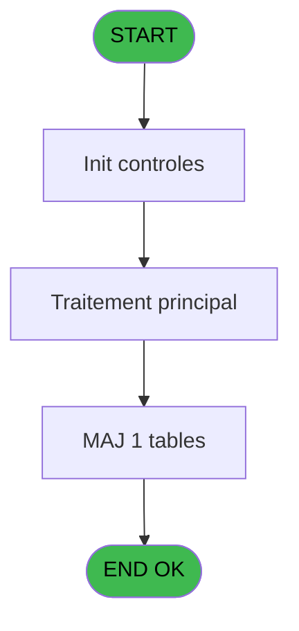
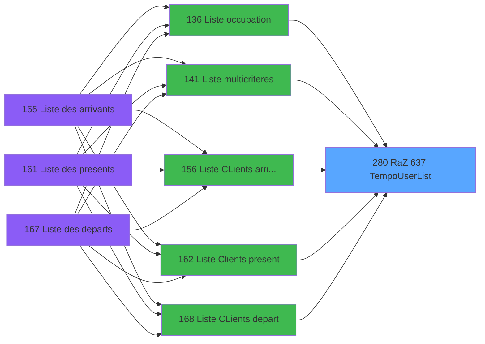

# PBP IDE 280 - RaZ 637 TempoUserList

> **Analyse**: Phases 1-4 2026-02-03 16:09 -> 16:09 (13s) | Assemblage 16:09
> **Pipeline**: V7.2 Enrichi
> **Structure**: 4 onglets (Resume | Ecrans | Donnees | Connexions)

<!-- TAB:Resume -->

## 1. FICHE D'IDENTITE

| Attribut | Valeur |
|----------|--------|
| Projet | PBP |
| IDE Position | 280 |
| Nom Programme | RaZ 637 TempoUserList |
| Fichier source | `Prg_280.xml` |
| Dossier IDE | RAZ |
| Taches | 1 (0 ecrans visibles) |
| Tables modifiees | 1 |
| Programmes appeles | 0 |

## 2. DESCRIPTION FONCTIONNELLE

**RaZ 637 TempoUserList** assure la gestion complete de ce processus, accessible depuis [Liste occupation (IDE 136)](PBP-IDE-136.md), [Liste multicriteres (IDE 141)](PBP-IDE-141.md), [Liste CLients AVPBDR (IDE 174)](PBP-IDE-174.md), [  Liste present personnel plan (IDE 227)](PBP-IDE-227.md), [  Liste personnels AVPBDR (IDE 234)](PBP-IDE-234.md), [  Liste CLients arrivant (IDE 156)](PBP-IDE-156.md), [  Liste Clients present (IDE 162)](PBP-IDE-162.md), [  Liste CLients depart (IDE 168)](PBP-IDE-168.md), [Liste des previsions (IDE 253)](PBP-IDE-253.md), [Liste des sejours (IDE 255)](PBP-IDE-255.md), [Liste des menages (IDE 257)](PBP-IDE-257.md), [Configuration Utilisateur (IDE 383)](PBP-IDE-383.md).

Le flux de traitement s'organise en **1 blocs fonctionnels** :

- **Initialisation** (1 tache) : reinitialisation d'etats et de variables de travail

**Donnees modifiees** : 1 tables en ecriture (tempo_zone_secteur).

## 3. BLOCS FONCTIONNELS

### 3.1 Initialisation (1 tache)

Reinitialisation d'etats et variables de travail.

---

#### 280 - RaZ TempoUserList [[ECRAN]](#ecran-t1)

**Role** : Reinitialisation : RaZ TempoUserList.
**Ecran** : 424 x 56 DLU (MDI) | [Voir mockup](#ecran-t1)

## 5. REGLES METIER

*(Aucune regle metier identifiee)*

## 6. CONTEXTE

- **Appele par**: [Liste occupation (IDE 136)](PBP-IDE-136.md), [Liste multicriteres (IDE 141)](PBP-IDE-141.md), [Liste CLients AVPBDR (IDE 174)](PBP-IDE-174.md), [  Liste present personnel plan (IDE 227)](PBP-IDE-227.md), [  Liste personnels AVPBDR (IDE 234)](PBP-IDE-234.md), [  Liste CLients arrivant (IDE 156)](PBP-IDE-156.md), [  Liste Clients present (IDE 162)](PBP-IDE-162.md), [  Liste CLients depart (IDE 168)](PBP-IDE-168.md), [Liste des previsions (IDE 253)](PBP-IDE-253.md), [Liste des sejours (IDE 255)](PBP-IDE-255.md), [Liste des menages (IDE 257)](PBP-IDE-257.md), [Configuration Utilisateur (IDE 383)](PBP-IDE-383.md)
- **Appelle**: 0 programmes | **Tables**: 1 (W:1 R:0 L:0) | **Taches**: 1 | **Expressions**: 3

<!-- TAB:Ecrans -->

## 8. ECRANS

*(Programme sans ecran visible)*

## 9. NAVIGATION

### 9.3 Structure hierarchique (1 tache)

| Position | Tache | Type | Dimensions | Bloc |
|----------|-------|------|------------|------|
| **280.1** | [**RaZ TempoUserList** (280)](#t1) [mockup](#ecran-t1) | MDI | 424x56 | Initialisation |

### 9.4 Algorigramme

> **Legende**: Vert = START/END OK | Rouge = END KO | Bleu = Decisions
> *Algorigramme auto-genere. Utiliser `/algorigramme` pour une synthese metier detaillee.*

<!-- TAB:Donnees -->

## 10. TABLES

### Tables utilisees (1)

| ID | Nom | Description | Type | R | W | L | Usages |
|----|-----|-------------|------|---|---|---|--------|
| 637 | tempo_zone_secteur | Table temporaire ecran | DB |   | **W** |   | 1 |

### Colonnes par table (1 / 1 tables avec colonnes identifiees)

Table 637 - tempo_zone_secteur (**W**) - 1 usages

| Lettre | Variable | Acces | Type |
|--------|----------|-------|------|
| A | >Categorie | W | Alpha |
| B | >NomTable | W | Alpha |

## 11. VARIABLES

### 11.1 Autres (2)

Variables diverses.

| Lettre | Nom | Type | Usage dans |
|--------|-----|------|-----------|
| A | >Categorie | Alpha | 1x refs |
| B | >NomTable | Alpha | 1x refs |

## 12. EXPRESSIONS

**3 / 3 expressions decodees (100%)**

### 12.1 Repartition par type

| Type | Expressions | Regles |
|------|-------------|--------|
| REFERENCE_VG | 1 | 0 |
| CONDITION | 2 | 0 |

### 12.2 Expressions cles par type

#### REFERENCE_VG (1 expressions)

| Type | IDE | Expression | Regle |
|------|-----|------------|-------|
| REFERENCE_VG | 1 | `VG1` | - |

#### CONDITION (2 expressions)

| Type | IDE | Expression | Regle |
|------|-----|------------|-------|
| CONDITION | 3 | `CndRange (>NomTable [B]>'',>NomTable [B])` | - |
| CONDITION | 2 | `CndRange (>Categorie [A]>'',>Categorie [A])` | - |

<!-- TAB:Connexions -->

## 13. GRAPHE D'APPELS

### 13.1 Chaine depuis Main (Callers)

Main -> ... -> [Liste occupation (IDE 136)](PBP-IDE-136.md) -> **RaZ 637 TempoUserList (IDE 280)**

Main -> ... -> [Liste multicriteres (IDE 141)](PBP-IDE-141.md) -> **RaZ 637 TempoUserList (IDE 280)**

Main -> ... -> [Liste CLients AVPBDR (IDE 174)](PBP-IDE-174.md) -> **RaZ 637 TempoUserList (IDE 280)**

Main -> ... -> [  Liste present personnel plan (IDE 227)](PBP-IDE-227.md) -> **RaZ 637 TempoUserList (IDE 280)**

Main -> ... -> [  Liste personnels AVPBDR (IDE 234)](PBP-IDE-234.md) -> **RaZ 637 TempoUserList (IDE 280)**

Main -> ... -> [  Liste CLients arrivant (IDE 156)](PBP-IDE-156.md) -> **RaZ 637 TempoUserList (IDE 280)**

Main -> ... -> [  Liste Clients present (IDE 162)](PBP-IDE-162.md) -> **RaZ 637 TempoUserList (IDE 280)**

Main -> ... -> [  Liste CLients depart (IDE 168)](PBP-IDE-168.md) -> **RaZ 637 TempoUserList (IDE 280)**

Main -> ... -> [Liste des previsions (IDE 253)](PBP-IDE-253.md) -> **RaZ 637 TempoUserList (IDE 280)**

Main -> ... -> [Liste des sejours (IDE 255)](PBP-IDE-255.md) -> **RaZ 637 TempoUserList (IDE 280)**

Main -> ... -> [Liste des menages (IDE 257)](PBP-IDE-257.md) -> **RaZ 637 TempoUserList (IDE 280)**

Main -> ... -> [Configuration Utilisateur (IDE 383)](PBP-IDE-383.md) -> **RaZ 637 TempoUserList (IDE 280)**

### 13.2 Callers

| IDE | Nom Programme | Nb Appels |
|-----|---------------|-----------|
| [136](PBP-IDE-136.md) | Liste occupation | 15 |
| [141](PBP-IDE-141.md) | Liste multicriteres | 10 |
| [174](PBP-IDE-174.md) | Liste CLients AVPBDR | 2 |
| [227](PBP-IDE-227.md) |   Liste present personnel plan | 2 |
| [234](PBP-IDE-234.md) |   Liste personnels AVPBDR | 2 |
| [156](PBP-IDE-156.md) |   Liste CLients arrivant | 1 |
| [162](PBP-IDE-162.md) |   Liste Clients present | 1 |
| [168](PBP-IDE-168.md) |   Liste CLients depart | 1 |
| [253](PBP-IDE-253.md) | Liste des previsions | 1 |
| [255](PBP-IDE-255.md) | Liste des sejours | 1 |
| [257](PBP-IDE-257.md) | Liste des menages | 1 |
| [383](PBP-IDE-383.md) | Configuration Utilisateur | 1 |

### 13.3 Callees (programmes appeles)

### 13.4 Detail Callees avec contexte

| IDE | Nom Programme | Appels | Contexte |
|-----|---------------|--------|----------|
| - | (aucun) | - | - |

## 14. RECOMMANDATIONS MIGRATION

### 14.1 Profil du programme

| Metrique | Valeur | Impact migration |
|----------|--------|-----------------|
| Lignes de logique | 7 | Programme compact |
| Expressions | 3 | Peu de logique |
| Tables WRITE | 1 | Impact faible |
| Sous-programmes | 0 | Peu de dependances |
| Ecrans visibles | 0 | Ecran unique ou traitement batch |
| Code desactive | 0% (0 / 7) | Code sain |
| Regles metier | 0 | Pas de regle identifiee |

### 14.2 Plan de migration par bloc

#### Initialisation (1 tache: 1 ecran, 0 traitement)

- **Strategie** : Constructeur/methode `InitAsync()` dans l'orchestrateur.

### 14.3 Dependances critiques

| Dependance | Type | Appels | Impact |
|------------|------|--------|--------|
| tempo_zone_secteur | Table WRITE (Database) | 1x | Schema + repository |

---
*Spec DETAILED generee par Pipeline V7.2 - 2026-02-03 16:09*
