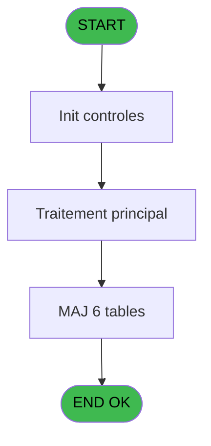
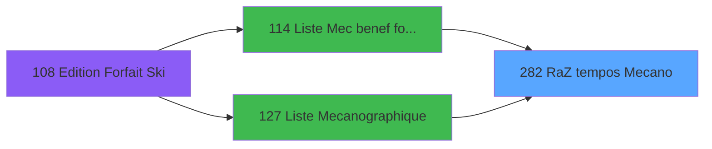

# PBP IDE 282 - RaZ tempos Mecano

> **Analyse**: Phases 1-4 2026-02-03 16:10 -> 16:10 (17s) | Assemblage 16:10
> **Pipeline**: V7.2 Enrichi
> **Structure**: 4 onglets (Resume | Ecrans | Donnees | Connexions)

<!-- TAB:Resume -->

## 1. FICHE D'IDENTITE

| Attribut | Valeur |
|----------|--------|
| Projet | PBP |
| IDE Position | 282 |
| Nom Programme | RaZ tempos Mecano |
| Fichier source | `Prg_282.xml` |
| Dossier IDE | RAZ |
| Taches | 7 (1 ecrans visibles) |
| Tables modifiees | 6 |
| Programmes appeles | 0 |

## 2. DESCRIPTION FONCTIONNELLE

**RaZ tempos Mecano** assure la gestion complete de ce processus, accessible depuis [Liste Mecanographique (IDE 127)](PBP-IDE-127.md), [Liste Mec benef forfait ski (IDE 114)](PBP-IDE-114.md).

Le flux de traitement s'organise en **2 blocs fonctionnels** :

- **Initialisation** (6 taches) : reinitialisation d'etats et de variables de travail
- **Traitement** (1 tache) : traitements metier divers

**Donnees modifiees** : 6 tables en ecriture (tempo_present_excel, tempo_zone_secteur, tempo_facturation, tempo_livre_de_porte_bresil, fichier_fictif_blocage_import, tempo_code_autocom).

Detail : phases du traitement

#### Phase 1 : Traitement (1 tache)

- **282** - Veuillez patienter ... **[[ECRAN]](#ecran-t1)**

#### Phase 2 : Initialisation (6 taches)

- **282.1** - RaZ 159
- **282.2** - RaZ 160
- **282.3** - RaZ 161
- **282.4** - RaZ Nombre
- **282.5** - RaZ Tempo ecran
- **282.6** - RaZ Tempo ecran

#### Tables impactees

| Table | Operations | Role metier |
|-------|-----------|-------------|
| tempo_facturation | **W** (1 usages) | Table temporaire ecran |
| fichier_fictif_blocage_import | **W** (1 usages) |  |
| tempo_livre_de_porte_bresil | **W** (1 usages) | Table temporaire ecran |
| tempo_code_autocom | **W** (1 usages) | Table temporaire ecran |
| tempo_zone_secteur | **W** (1 usages) | Table temporaire ecran |
| tempo_present_excel | **W** (1 usages) | Table temporaire ecran |

## 3. BLOCS FONCTIONNELS

### 3.1 Traitement (1 tache)

Traitements internes.

---

#### 282 - Veuillez patienter ... [[ECRAN]](#ecran-t1)

**Role** : Traitement : Veuillez patienter ....
**Ecran** : 424 x 56 DLU (MDI) | [Voir mockup](#ecran-t1)

### 3.2 Initialisation (6 taches)

Reinitialisation d'etats et variables de travail.

---

#### 282.1 - RaZ 159

**Role** : Reinitialisation : RaZ 159.

---

#### 282.2 - RaZ 160

**Role** : Reinitialisation : RaZ 160.

---

#### 282.3 - RaZ 161

**Role** : Reinitialisation : RaZ 161.

---

#### 282.4 - RaZ Nombre

**Role** : Calcul : RaZ Nombre.

---

#### 282.5 - RaZ Tempo ecran

**Role** : Reinitialisation : RaZ Tempo ecran.

---

#### 282.6 - RaZ Tempo ecran

**Role** : Reinitialisation : RaZ Tempo ecran.

## 5. REGLES METIER

*(Aucune regle metier identifiee)*

## 6. CONTEXTE

- **Appele par**: [Liste Mecanographique (IDE 127)](PBP-IDE-127.md), [Liste Mec benef forfait ski (IDE 114)](PBP-IDE-114.md)
- **Appelle**: 0 programmes | **Tables**: 6 (W:6 R:0 L:0) | **Taches**: 7 | **Expressions**: 1

<!-- TAB:Ecrans -->

## 8. ECRANS

### 8.1 Forms visibles (1 / 7)

| # | Position | Tache | Nom | Type | Largeur | Hauteur | Bloc |
|---|----------|-------|-----|------|---------|---------|------|
| 1 | 282 | 282 | Veuillez patienter ... | MDI | 424 | 56 | Traitement |

### 8.2 Mockups Ecrans

---

#### 282 - Veuillez patienter ...
**Tache** : [282](#t1) | **Type** : MDI | **Dimensions** : 424 x 56 DLU
**Bloc** : Traitement | **Titre IDE** : Veuillez patienter ...

<!-- FORM-DATA:
{
    "width":  424,
    "vFactor":  8,
    "type":  "MDI",
    "hFactor":  8,
    "controls":  [
                     {
                         "x":  0,
                         "type":  "label",
                         "var":  "",
                         "y":  0,
                         "w":  423,
                         "fmt":  "",
                         "name":  "",
                         "h":  29,
                         "color":  "",
                         "text":  "",
                         "parent":  null
                     },
                     {
                         "x":  120,
                         "type":  "label",
                         "var":  "",
                         "y":  10,
                         "w":  221,
                         "fmt":  "",
                         "name":  "",
                         "h":  8,
                         "color":  "7",
                         "text":  "Traitement en cours ...",
                         "parent":  null
                     },
                     {
                         "x":  0,
                         "type":  "label",
                         "var":  "",
                         "y":  29,
                         "w":  423,
                         "fmt":  "",
                         "name":  "",
                         "h":  27,
                         "color":  "",
                         "text":  "",
                         "parent":  null
                     },
                     {
                         "x":  72,
                         "type":  "label",
                         "var":  "",
                         "y":  38,
                         "w":  267,
                         "fmt":  "",
                         "name":  "",
                         "h":  8,
                         "color":  "",
                         "text":  "Preparation table temporaire",
                         "parent":  null
                     },
                     {
                         "x":  4,
                         "type":  "image",
                         "var":  "",
                         "y":  2,
                         "w":  72,
                         "fmt":  "",
                         "name":  "",
                         "h":  25,
                         "color":  "",
                         "text":  "",
                         "parent":  null
                     }
                 ],
    "taskId":  "282",
    "height":  56
}
-->

## 9. NAVIGATION

Ecran unique: **Veuillez patienter ...**

### 9.3 Structure hierarchique (7 taches)

| Position | Tache | Type | Dimensions | Bloc |
|----------|-------|------|------------|------|
| **282.1** | [**Veuillez patienter ...** (282)](#t1) [mockup](#ecran-t1) | MDI | 424x56 | Traitement |
| **282.2** | [**RaZ 159** (282.1)](#t2) | MDI | - | Initialisation |
| 282.2.1 | [RaZ 160 (282.2)](#t3) | MDI | - | |
| 282.2.2 | [RaZ 161 (282.3)](#t4) | MDI | - | |
| 282.2.3 | [RaZ Nombre (282.4)](#t5) | MDI | - | |
| 282.2.4 | [RaZ Tempo ecran (282.5)](#t6) | MDI | - | |
| 282.2.5 | [RaZ Tempo ecran (282.6)](#t7) | MDI | - | |

### 9.4 Algorigramme

> **Legende**: Vert = START/END OK | Rouge = END KO | Bleu = Decisions
> *Algorigramme auto-genere. Utiliser `/algorigramme` pour une synthese metier detaillee.*

<!-- TAB:Donnees -->

## 10. TABLES

### Tables utilisees (6)

| ID | Nom | Description | Type | R | W | L | Usages |
|----|-----|-------------|------|---|---|---|--------|
| 612 | tempo_present_excel | Table temporaire ecran | TMP |   | **W** |   | 1 |
| 622 | tempo_zone_secteur | Table temporaire ecran | TMP |   | **W** |   | 1 |
| 623 | tempo_facturation | Table temporaire ecran | TMP |   | **W** |   | 1 |
| 624 | tempo_livre_de_porte_bresil | Table temporaire ecran | TMP |   | **W** |   | 1 |
| 628 | fichier_fictif_blocage_import |  | DB |   | **W** |   | 1 |
| 639 | tempo_code_autocom | Table temporaire ecran | DB |   | **W** |   | 1 |

### Colonnes par table (0 / 6 tables avec colonnes identifiees)

Table 612 - tempo_present_excel (**W**) - 1 usages

*Table utilisee uniquement en Link ou aucune colonne Real identifiee dans le DataView.*

Table 622 - tempo_zone_secteur (**W**) - 1 usages

*Table utilisee uniquement en Link ou aucune colonne Real identifiee dans le DataView.*

Table 623 - tempo_facturation (**W**) - 1 usages

*Table utilisee uniquement en Link ou aucune colonne Real identifiee dans le DataView.*

Table 624 - tempo_livre_de_porte_bresil (**W**) - 1 usages

*Table utilisee uniquement en Link ou aucune colonne Real identifiee dans le DataView.*

Table 628 - fichier_fictif_blocage_import (**W**) - 1 usages

*Table utilisee uniquement en Link ou aucune colonne Real identifiee dans le DataView.*

Table 639 - tempo_code_autocom (**W**) - 1 usages

*Table utilisee uniquement en Link ou aucune colonne Real identifiee dans le DataView.*

## 11. VARIABLES

*(Programme sans variables locales mappees)*

## 12. EXPRESSIONS

**1 / 1 expressions decodees (100%)**

### 12.1 Repartition par type

| Type | Expressions | Regles |
|------|-------------|--------|
| REFERENCE_VG | 1 | 0 |

### 12.2 Expressions cles par type

#### REFERENCE_VG (1 expressions)

| Type | IDE | Expression | Regle |
|------|-----|------------|-------|
| REFERENCE_VG | 1 | `VG1` | - |

<!-- TAB:Connexions -->

## 13. GRAPHE D'APPELS

### 13.1 Chaine depuis Main (Callers)

Main -> ... -> [Liste Mecanographique (IDE 127)](PBP-IDE-127.md) -> **RaZ tempos Mecano (IDE 282)**

Main -> ... -> [Liste Mec benef forfait ski (IDE 114)](PBP-IDE-114.md) -> **RaZ tempos Mecano (IDE 282)**

### 13.2 Callers

| IDE | Nom Programme | Nb Appels |
|-----|---------------|-----------|
| [127](PBP-IDE-127.md) | Liste Mecanographique | 2 |
| [114](PBP-IDE-114.md) | Liste Mec benef forfait ski | 1 |

### 13.3 Callees (programmes appeles)

### 13.4 Detail Callees avec contexte

| IDE | Nom Programme | Appels | Contexte |
|-----|---------------|--------|----------|
| - | (aucun) | - | - |

## 14. RECOMMANDATIONS MIGRATION

### 14.1 Profil du programme

| Metrique | Valeur | Impact migration |
|----------|--------|-----------------|
| Lignes de logique | 21 | Programme compact |
| Expressions | 1 | Peu de logique |
| Tables WRITE | 6 | Fort impact donnees |
| Sous-programmes | 0 | Peu de dependances |
| Ecrans visibles | 1 | Ecran unique ou traitement batch |
| Code desactive | 0% (0 / 21) | Code sain |
| Regles metier | 0 | Pas de regle identifiee |

### 14.2 Plan de migration par bloc

#### Traitement (1 tache: 1 ecran, 0 traitement)

- **Strategie** : 1 composant(s) UI (Razor/React) avec formulaires et validation.
- Decomposer les taches en services unitaires testables.

#### Initialisation (6 taches: 0 ecran, 6 traitements)

- **Strategie** : Constructeur/methode `InitAsync()` dans l'orchestrateur.

### 14.3 Dependances critiques

| Dependance | Type | Appels | Impact |
|------------|------|--------|--------|
| tempo_present_excel | Table WRITE (Temp) | 1x | Schema + repository |
| tempo_zone_secteur | Table WRITE (Temp) | 1x | Schema + repository |
| tempo_facturation | Table WRITE (Temp) | 1x | Schema + repository |
| tempo_livre_de_porte_bresil | Table WRITE (Temp) | 1x | Schema + repository |
| fichier_fictif_blocage_import | Table WRITE (Database) | 1x | Schema + repository |
| tempo_code_autocom | Table WRITE (Database) | 1x | Schema + repository |

---
*Spec DETAILED generee par Pipeline V7.2 - 2026-02-03 16:10*
