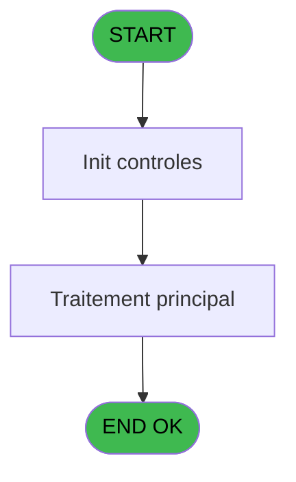
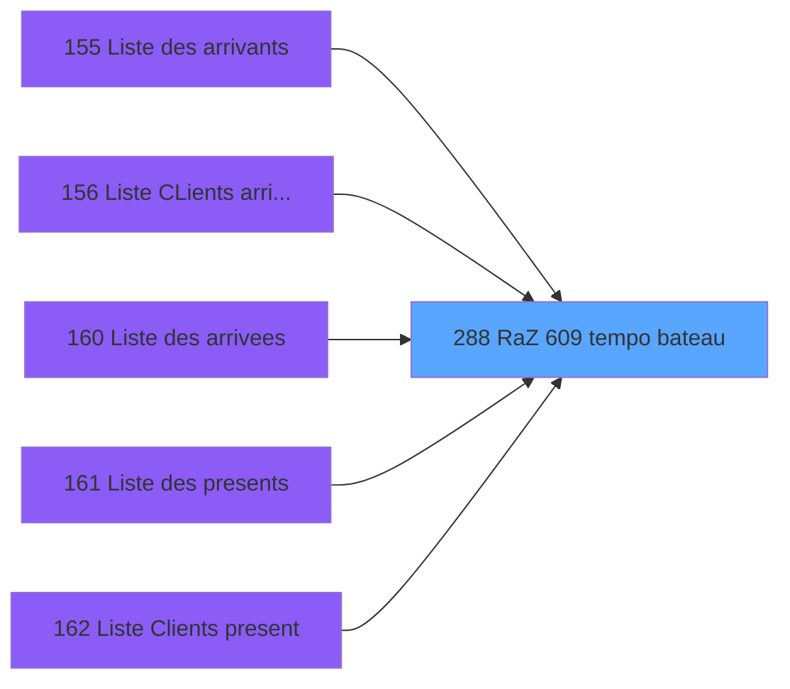

# PBP IDE 288 - RaZ 609 tempo bateau

> **Analyse**: Phases 1-4 2026-02-03 16:12 -> 16:12 (13s) | Assemblage 16:12
> **Pipeline**: V7.2 Enrichi
> **Structure**: 4 onglets (Resume | Ecrans | Donnees | Connexions)

<!-- TAB:Resume -->

## 1. FICHE D'IDENTITE

| Attribut | Valeur |
|----------|--------|
| Projet | PBP |
| IDE Position | 288 |
| Nom Programme | RaZ 609 tempo bateau |
| Fichier source | `Prg_288.xml` |
| Dossier IDE | RAZ |
| Taches | 1 (1 ecrans visibles) |
| Tables modifiees | 0 |
| Programmes appeles | 0 |

## 2. DESCRIPTION FONCTIONNELLE

**RaZ 609 tempo bateau** assure la gestion complete de ce processus, accessible depuis [Liste CLients AVPBDR (IDE 174)](PBP-IDE-174.md), [  Liste personnels AVPBDR (IDE 234)](PBP-IDE-234.md), [Liste des arrivants (IDE 155)](PBP-IDE-155.md), [  Liste CLients arrivant (IDE 156)](PBP-IDE-156.md), [Liste des arrivees (IDE 160)](PBP-IDE-160.md), [Liste des presents (IDE 161)](PBP-IDE-161.md), [  Liste Clients present (IDE 162)](PBP-IDE-162.md), [Liste des departs (IDE 167)](PBP-IDE-167.md), [  Liste CLients depart (IDE 168)](PBP-IDE-168.md), [Liste des partants (IDE 172)](PBP-IDE-172.md), [Liste des Absents (IDE 173)](PBP-IDE-173.md), [Liste des arrivants personnel (IDE 224)](PBP-IDE-224.md), [Liste des arrivees personnel (IDE 225)](PBP-IDE-225.md), [Liste des presents personnel (IDE 226)](PBP-IDE-226.md), [Liste des Absents personnel (IDE 231)](PBP-IDE-231.md), [Liste des departs personnel (IDE 232)](PBP-IDE-232.md), [Liste des partants personnel (IDE 233)](PBP-IDE-233.md).

Le flux de traitement s'organise en **1 blocs fonctionnels** :

- **Initialisation** (1 tache) : reinitialisation d'etats et de variables de travail

## 3. BLOCS FONCTIONNELS

### 3.1 Initialisation (1 tache)

Reinitialisation d'etats et variables de travail.

---

#### 288 - RaZ 179 tempo bateau [[ECRAN]](#ecran-t1)

**Role** : Reinitialisation : RaZ 179 tempo bateau.
**Ecran** : 424 x 56 DLU (MDI) | [Voir mockup](#ecran-t1)

## 5. REGLES METIER

*(Aucune regle metier identifiee)*

## 6. CONTEXTE

- **Appele par**: [Liste CLients AVPBDR (IDE 174)](PBP-IDE-174.md), [  Liste personnels AVPBDR (IDE 234)](PBP-IDE-234.md), [Liste des arrivants (IDE 155)](PBP-IDE-155.md), [  Liste CLients arrivant (IDE 156)](PBP-IDE-156.md), [Liste des arrivees (IDE 160)](PBP-IDE-160.md), [Liste des presents (IDE 161)](PBP-IDE-161.md), [  Liste Clients present (IDE 162)](PBP-IDE-162.md), [Liste des departs (IDE 167)](PBP-IDE-167.md), [  Liste CLients depart (IDE 168)](PBP-IDE-168.md), [Liste des partants (IDE 172)](PBP-IDE-172.md), [Liste des Absents (IDE 173)](PBP-IDE-173.md), [Liste des arrivants personnel (IDE 224)](PBP-IDE-224.md), [Liste des arrivees personnel (IDE 225)](PBP-IDE-225.md), [Liste des presents personnel (IDE 226)](PBP-IDE-226.md), [Liste des Absents personnel (IDE 231)](PBP-IDE-231.md), [Liste des departs personnel (IDE 232)](PBP-IDE-232.md), [Liste des partants personnel (IDE 233)](PBP-IDE-233.md)
- **Appelle**: 0 programmes | **Tables**: 0 (W:0 R:0 L:0) | **Taches**: 1 | **Expressions**: 1

<!-- TAB:Ecrans -->

## 8. ECRANS

### 8.1 Forms visibles (1 / 1)

| # | Position | Tache | Nom | Type | Largeur | Hauteur | Bloc |
|---|----------|-------|-----|------|---------|---------|------|
| 1 | 288 | 288 | RaZ 179 tempo bateau | MDI | 424 | 56 | Initialisation |

### 8.2 Mockups Ecrans

---

#### 288 - RaZ 179 tempo bateau
**Tache** : [288](#t1) | **Type** : MDI | **Dimensions** : 424 x 56 DLU
**Bloc** : Initialisation | **Titre IDE** : RaZ 179 tempo bateau

<!-- FORM-DATA:
{
    "width":  424,
    "vFactor":  8,
    "type":  "MDI",
    "hFactor":  8,
    "controls":  [
                     {
                         "x":  0,
                         "type":  "label",
                         "var":  "",
                         "y":  0,
                         "w":  423,
                         "fmt":  "",
                         "name":  "",
                         "h":  29,
                         "color":  "",
                         "text":  "",
                         "parent":  null
                     },
                     {
                         "x":  120,
                         "type":  "label",
                         "var":  "",
                         "y":  10,
                         "w":  221,
                         "fmt":  "",
                         "name":  "",
                         "h":  8,
                         "color":  "7",
                         "text":  "Traitement en cours ...",
                         "parent":  null
                     },
                     {
                         "x":  0,
                         "type":  "label",
                         "var":  "",
                         "y":  29,
                         "w":  423,
                         "fmt":  "",
                         "name":  "",
                         "h":  27,
                         "color":  "",
                         "text":  "",
                         "parent":  null
                     },
                     {
                         "x":  72,
                         "type":  "label",
                         "var":  "",
                         "y":  38,
                         "w":  267,
                         "fmt":  "",
                         "name":  "",
                         "h":  8,
                         "color":  "",
                         "text":  "Preparation table temporaire",
                         "parent":  null
                     },
                     {
                         "x":  4,
                         "type":  "image",
                         "var":  "",
                         "y":  2,
                         "w":  72,
                         "fmt":  "",
                         "name":  "",
                         "h":  25,
                         "color":  "",
                         "text":  "",
                         "parent":  null
                     }
                 ],
    "taskId":  "288",
    "height":  56
}
-->

## 9. NAVIGATION

Ecran unique: **RaZ 179 tempo bateau**

### 9.3 Structure hierarchique (1 tache)

| Position | Tache | Type | Dimensions | Bloc |
|----------|-------|------|------------|------|
| **288.1** | [**RaZ 179 tempo bateau** (288)](#t1) [mockup](#ecran-t1) | MDI | 424x56 | Initialisation |

### 9.4 Algorigramme

> **Legende**: Vert = START/END OK | Rouge = END KO | Bleu = Decisions
> *Algorigramme auto-genere. Utiliser `/algorigramme` pour une synthese metier detaillee.*

<!-- TAB:Donnees -->

## 10. TABLES

### Tables utilisees (0)

| ID | Nom | Description | Type | R | W | L | Usages |
|----|-----|-------------|------|---|---|---|--------|

### Colonnes par table (0 / 0 tables avec colonnes identifiees)

## 11. VARIABLES

*(Programme sans variables locales mappees)*

## 12. EXPRESSIONS

**1 / 1 expressions decodees (100%)**

### 12.1 Repartition par type

| Type | Expressions | Regles |
|------|-------------|--------|
| OTHER | 1 | 0 |

### 12.2 Expressions cles par type

#### OTHER (1 expressions)

| Type | IDE | Expression | Regle |
|------|-----|------------|-------|
| OTHER | 1 | `DbDel('{609,2}'DSOURCE,'')` | - |

<!-- TAB:Connexions -->

## 13. GRAPHE D'APPELS

### 13.1 Chaine depuis Main (Callers)

Main -> ... -> [Liste CLients AVPBDR (IDE 174)](PBP-IDE-174.md) -> **RaZ 609 tempo bateau (IDE 288)**

Main -> ... -> [  Liste personnels AVPBDR (IDE 234)](PBP-IDE-234.md) -> **RaZ 609 tempo bateau (IDE 288)**

Main -> ... -> [Liste des arrivants (IDE 155)](PBP-IDE-155.md) -> **RaZ 609 tempo bateau (IDE 288)**

Main -> ... -> [  Liste CLients arrivant (IDE 156)](PBP-IDE-156.md) -> **RaZ 609 tempo bateau (IDE 288)**

Main -> ... -> [Liste des arrivees (IDE 160)](PBP-IDE-160.md) -> **RaZ 609 tempo bateau (IDE 288)**

Main -> ... -> [Liste des presents (IDE 161)](PBP-IDE-161.md) -> **RaZ 609 tempo bateau (IDE 288)**

Main -> ... -> [  Liste Clients present (IDE 162)](PBP-IDE-162.md) -> **RaZ 609 tempo bateau (IDE 288)**

Main -> ... -> [Liste des departs (IDE 167)](PBP-IDE-167.md) -> **RaZ 609 tempo bateau (IDE 288)**

Main -> ... -> [  Liste CLients depart (IDE 168)](PBP-IDE-168.md) -> **RaZ 609 tempo bateau (IDE 288)**

Main -> ... -> [Liste des partants (IDE 172)](PBP-IDE-172.md) -> **RaZ 609 tempo bateau (IDE 288)**

Main -> ... -> [Liste des Absents (IDE 173)](PBP-IDE-173.md) -> **RaZ 609 tempo bateau (IDE 288)**

Main -> ... -> [Liste des arrivants personnel (IDE 224)](PBP-IDE-224.md) -> **RaZ 609 tempo bateau (IDE 288)**

Main -> ... -> [Liste des arrivees personnel (IDE 225)](PBP-IDE-225.md) -> **RaZ 609 tempo bateau (IDE 288)**

Main -> ... -> [Liste des presents personnel (IDE 226)](PBP-IDE-226.md) -> **RaZ 609 tempo bateau (IDE 288)**

Main -> ... -> [Liste des Absents personnel (IDE 231)](PBP-IDE-231.md) -> **RaZ 609 tempo bateau (IDE 288)**

Main -> ... -> [Liste des departs personnel (IDE 232)](PBP-IDE-232.md) -> **RaZ 609 tempo bateau (IDE 288)**

Main -> ... -> [Liste des partants personnel (IDE 233)](PBP-IDE-233.md) -> **RaZ 609 tempo bateau (IDE 288)**

### 13.2 Callers

| IDE | Nom Programme | Nb Appels |
|-----|---------------|-----------|
| [174](PBP-IDE-174.md) | Liste CLients AVPBDR | 3 |
| [234](PBP-IDE-234.md) |   Liste personnels AVPBDR | 3 |
| [155](PBP-IDE-155.md) | Liste des arrivants | 1 |
| [156](PBP-IDE-156.md) |   Liste CLients arrivant | 1 |
| [160](PBP-IDE-160.md) | Liste des arrivees | 1 |
| [161](PBP-IDE-161.md) | Liste des presents | 1 |
| [162](PBP-IDE-162.md) |   Liste Clients present | 1 |
| [167](PBP-IDE-167.md) | Liste des departs | 1 |
| [168](PBP-IDE-168.md) |   Liste CLients depart | 1 |
| [172](PBP-IDE-172.md) | Liste des partants | 1 |
| [173](PBP-IDE-173.md) | Liste des Absents | 1 |
| [224](PBP-IDE-224.md) | Liste des arrivants personnel | 1 |
| [225](PBP-IDE-225.md) | Liste des arrivees personnel | 1 |
| [226](PBP-IDE-226.md) | Liste des presents personnel | 1 |
| [231](PBP-IDE-231.md) | Liste des Absents personnel | 1 |
| [232](PBP-IDE-232.md) | Liste des departs personnel | 1 |
| [233](PBP-IDE-233.md) | Liste des partants personnel | 1 |

### 13.3 Callees (programmes appeles)

### 13.4 Detail Callees avec contexte

| IDE | Nom Programme | Appels | Contexte |
|-----|---------------|--------|----------|
| - | (aucun) | - | - |

## 14. RECOMMANDATIONS MIGRATION

### 14.1 Profil du programme

| Metrique | Valeur | Impact migration |
|----------|--------|-----------------|
| Lignes de logique | 2 | Programme compact |
| Expressions | 1 | Peu de logique |
| Tables WRITE | 0 | Impact faible |
| Sous-programmes | 0 | Peu de dependances |
| Ecrans visibles | 1 | Ecran unique ou traitement batch |
| Code desactive | 0% (0 / 2) | Code sain |
| Regles metier | 0 | Pas de regle identifiee |

### 14.2 Plan de migration par bloc

#### Initialisation (1 tache: 1 ecran, 0 traitement)

- **Strategie** : Constructeur/methode `InitAsync()` dans l'orchestrateur.

### 14.3 Dependances critiques

| Dependance | Type | Appels | Impact |
|------------|------|--------|--------|

---
*Spec DETAILED generee par Pipeline V7.2 - 2026-02-03 16:12*
