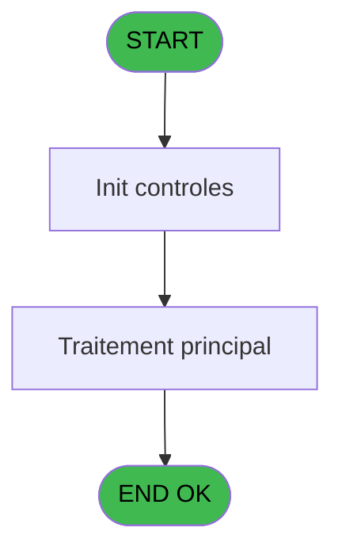
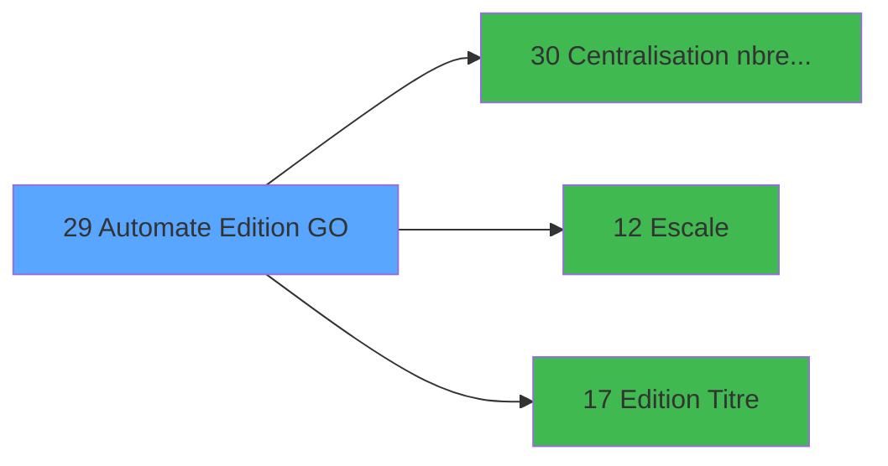

# PBP IDE 29 - Automate Edition GO

> **Analyse**: Phases 1-4 2026-02-03 01:16 -> 01:17 (35s) | Assemblage 01:17
> **Pipeline**: V7.2 Enrichi
> **Structure**: 4 onglets (Resume | Ecrans | Donnees | Connexions)

<!-- TAB:Resume -->

## 1. FICHE D'IDENTITE

| Attribut | Valeur |
|----------|--------|
| Projet | PBP |
| IDE Position | 29 |
| Nom Programme | Automate Edition GO |
| Fichier source | `Prg_29.xml` |
| Domaine metier | Impression |
| Taches | 1 (0 ecrans visibles) |
| Tables modifiees | 0 |
| Programmes appeles | 3 |

## 2. DESCRIPTION FONCTIONNELLE

**Automate Edition GO** assure la gestion complete de ce processus, accessible depuis [Demande Edition GO (IDE 28)](PBP-IDE-28.md).

Le flux de traitement s'organise en **1 blocs fonctionnels** :

- **Traitement** (1 tache) : traitements metier divers

## 3. BLOCS FONCTIONNELS

### 3.1 Traitement (1 tache)

Traitements internes.

---

#### 29 - Passeport GO [[ECRAN]](#ecran-t1)

**Role** : Traitement : Passeport GO.
**Ecran** : 1022 x 251 DLU (MDI) | [Voir mockup](#ecran-t1)
**Delegue a** : [Escale (IDE 12)](PBP-IDE-12.md)

## 5. REGLES METIER

*(Aucune regle metier identifiee)*

## 6. CONTEXTE

- **Appele par**: [Demande Edition GO (IDE 28)](PBP-IDE-28.md)
- **Appelle**: 3 programmes | **Tables**: 2 (W:0 R:1 L:1) | **Taches**: 1 | **Expressions**: 26

<!-- TAB:Ecrans -->

## 8. ECRANS

*(Programme sans ecran visible)*

## 9. NAVIGATION

### 9.3 Structure hierarchique (1 tache)

| Position | Tache | Type | Dimensions | Bloc |
|----------|-------|------|------------|------|
| **29.1** | [**Passeport GO** (29)](#t1) [mockup](#ecran-t1) | MDI | 1022x251 | Traitement |

### 9.4 Algorigramme

> **Legende**: Vert = START/END OK | Rouge = END KO | Bleu = Decisions
> *Algorigramme auto-genere. Utiliser `/algorigramme` pour une synthese metier detaillee.*

<!-- TAB:Donnees -->

## 10. TABLES

### Tables utilisees (2)

| ID | Nom | Description | Type | R | W | L | Usages |
|----|-----|-------------|------|---|---|---|--------|
| 13 | automate_autorite |  | DB |   |   | L | 1 |
| 289 | escale |  | DB | R |   |   | 1 |

### Colonnes par table (1 / 1 tables avec colonnes identifiees)

Table 289 - escale (R) - 1 usages

| Lettre | Variable | Acces | Type |
|--------|----------|-------|------|
| A | > Date | R | Date |
| B | > Commandant | R | Alpha |
| C | > type Pax/Crew | R | Alpha |

## 11. VARIABLES

### 11.1 Autres (3)

Variables diverses.

| Lettre | Nom | Type | Usage dans |
|--------|-----|------|-----------|
| A | > Date | Date | 2x refs |
| B | > Commandant | Alpha | - |
| C | > type Pax/Crew | Alpha | 1x refs |

## 12. EXPRESSIONS

**26 / 26 expressions decodees (100%)**

### 12.1 Repartition par type

| Type | Expressions | Regles |
|------|-------------|--------|
| CONDITION | 14 | 0 |
| CONSTANTE | 12 | 0 |

### 12.2 Expressions cles par type

#### CONDITION (14 expressions)

| Type | IDE | Expression | Regle |
|------|-----|------------|-------|
| CONDITION | 19 | `[F]='C5'` | - |
| CONDITION | 18 | `[F]='C4'` | - |
| CONDITION | 17 | `[F]='C2'` | - |
| CONDITION | 20 | `[F]='C6'` | - |
| CONDITION | 23 | `> Date [A]` | - |
| ... | | *+9 autres* | |

#### CONSTANTE (12 expressions)

| Type | IDE | Expression | Regle |
|------|-----|------------|-------|
| CONSTANTE | 10 | `'C5'` | - |
| CONSTANTE | 9 | `'C4'` | - |
| CONSTANTE | 8 | `'C3'` | - |
| CONSTANTE | 26 | `0` | - |
| CONSTANTE | 25 | `''` | - |
| ... | | *+7 autres* | |

### 12.3 Toutes les expressions (26)

Voir les 26 expressions

#### CONDITION (14)

| IDE | Expression Decodee |
|-----|-------------------|
| 24 | `> Date [A]+1` |
| 1 | `> type Pax/Crew [C]` |
| 12 | `[F]='C1E'` |
| 13 | `[F]='C1D'` |
| 14 | `[F]='C1T'` |
| 15 | `[F]='C1L'` |
| 16 | `[F]='C1S'` |
| 17 | `[F]='C2'` |
| 18 | `[F]='C4'` |
| 19 | `[F]='C5'` |
| 20 | `[F]='C6'` |
| 21 | `[F]='T'` |
| 22 | `[F]='C3'` |
| 23 | `> Date [A]` |

#### CONSTANTE (12)

| IDE | Expression Decodee |
|-----|-------------------|
| 2 | `'C1E'` |
| 3 | `'C1D'` |
| 4 | `'C1T'` |
| 5 | `'C1L'` |
| 6 | `'C1S'` |
| 7 | `'C2'` |
| 8 | `'C3'` |
| 9 | `'C4'` |
| 10 | `'C5'` |
| 11 | `'C6'` |
| 25 | `''` |
| 26 | `0` |

<!-- TAB:Connexions -->

## 13. GRAPHE D'APPELS

### 13.1 Chaine depuis Main (Callers)

Main -> ... -> [Demande Edition GO (IDE 28)](PBP-IDE-28.md) -> **Automate Edition GO (IDE 29)**

### 13.2 Callers

| IDE | Nom Programme | Nb Appels |
|-----|---------------|-----------|
| [28](PBP-IDE-28.md) | Demande Edition GO | 1 |

### 13.3 Callees (programmes appeles)

### 13.4 Detail Callees avec contexte

| IDE | Nom Programme | Appels | Contexte |
|-----|---------------|--------|----------|
| [30](PBP-IDE-30.md) | Centralisation nbre edition | 10 | Impression ticket/document |
| [12](PBP-IDE-12.md) | Escale | 1 | Sous-programme |
| [17](PBP-IDE-17.md) |   Edition Titre | 1 | Impression ticket/document |

## 14. RECOMMANDATIONS MIGRATION

### 14.1 Profil du programme

| Metrique | Valeur | Impact migration |
|----------|--------|-----------------|
| Lignes de logique | 41 | Programme compact |
| Expressions | 26 | Peu de logique |
| Tables WRITE | 0 | Impact faible |
| Sous-programmes | 3 | Peu de dependances |
| Ecrans visibles | 0 | Ecran unique ou traitement batch |
| Code desactive | 0% (0 / 41) | Code sain |
| Regles metier | 0 | Pas de regle identifiee |

### 14.2 Plan de migration par bloc

#### Traitement (1 tache: 1 ecran, 0 traitement)

- **Strategie** : 1 composant(s) UI (Razor/React) avec formulaires et validation.
- 3 sous-programme(s) a migrer ou a reutiliser depuis les services existants.
- Decomposer les taches en services unitaires testables.

### 14.3 Dependances critiques

| Dependance | Type | Appels | Impact |
|------------|------|--------|--------|
| [Centralisation nbre edition (IDE 30)](PBP-IDE-30.md) | Sous-programme | 10x | **CRITIQUE** - Impression ticket/document |
| [  Edition Titre (IDE 17)](PBP-IDE-17.md) | Sous-programme | 1x | Normale - Impression ticket/document |
| [Escale (IDE 12)](PBP-IDE-12.md) | Sous-programme | 1x | Normale - Sous-programme |

---
*Spec DETAILED generee par Pipeline V7.2 - 2026-02-03 01:17*
