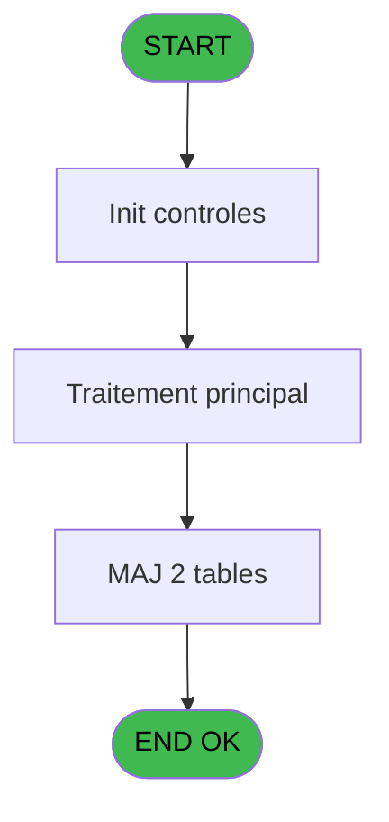
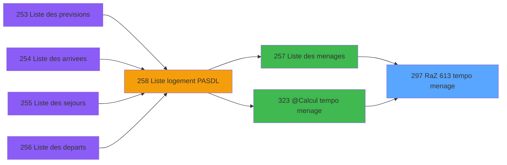

# PBP IDE 297 - RaZ 613 tempo menage

> **Analyse**: Phases 1-4 2026-02-03 16:15 -> 16:16 (16s) | Assemblage 16:16
> **Pipeline**: V7.2 Enrichi
> **Structure**: 4 onglets (Resume | Ecrans | Donnees | Connexions)

<!-- TAB:Resume -->

## 1. FICHE D'IDENTITE

| Attribut | Valeur |
|----------|--------|
| Projet | PBP |
| IDE Position | 297 |
| Nom Programme | RaZ 613 tempo menage |
| Fichier source | `Prg_297.xml` |
| Dossier IDE | RAZ |
| Taches | 2 (1 ecrans visibles) |
| Tables modifiees | 2 |
| Programmes appeles | 0 |

## 2. DESCRIPTION FONCTIONNELLE

**RaZ 613 tempo menage** assure la gestion complete de ce processus, accessible depuis [Liste des menages (IDE 257)](PBP-IDE-257.md), [@Calcul tempo menage (IDE 323)](PBP-IDE-323.md).

Le flux de traitement s'organise en **1 blocs fonctionnels** :

- **Initialisation** (2 taches) : reinitialisation d'etats et de variables de travail

**Donnees modifiees** : 2 tables en ecriture (tempo_reception, tempo_nombres).

## 3. BLOCS FONCTIONNELS

### 3.1 Initialisation (2 taches)

Reinitialisation d'etats et variables de travail.

---

#### 297 - RaZ 178 tempo menage [[ECRAN]](#ecran-t1)

**Role** : Reinitialisation : RaZ 178 tempo menage.
**Ecran** : 424 x 56 DLU (MDI) | [Voir mockup](#ecran-t1)

---

#### 297.1 - RaZ 247 tempo menage

**Role** : Reinitialisation : RaZ 247 tempo menage.

## 5. REGLES METIER

*(Aucune regle metier identifiee)*

## 6. CONTEXTE

- **Appele par**: [Liste des menages (IDE 257)](PBP-IDE-257.md), [@Calcul tempo menage (IDE 323)](PBP-IDE-323.md)
- **Appelle**: 0 programmes | **Tables**: 2 (W:2 R:0 L:0) | **Taches**: 2 | **Expressions**: 2

<!-- TAB:Ecrans -->

## 8. ECRANS

### 8.1 Forms visibles (1 / 2)

| # | Position | Tache | Nom | Type | Largeur | Hauteur | Bloc |
|---|----------|-------|-----|------|---------|---------|------|
| 1 | 297 | 297 | RaZ 178 tempo menage | MDI | 424 | 56 | Initialisation |

### 8.2 Mockups Ecrans

---

#### 297 - RaZ 178 tempo menage
**Tache** : [297](#t1) | **Type** : MDI | **Dimensions** : 424 x 56 DLU
**Bloc** : Initialisation | **Titre IDE** : RaZ 178 tempo menage

<!-- FORM-DATA:
{
    "width":  424,
    "vFactor":  8,
    "type":  "MDI",
    "hFactor":  8,
    "controls":  [
                     {
                         "x":  0,
                         "type":  "label",
                         "var":  "",
                         "y":  0,
                         "w":  423,
                         "fmt":  "",
                         "name":  "",
                         "h":  29,
                         "color":  "",
                         "text":  "",
                         "parent":  null
                     },
                     {
                         "x":  120,
                         "type":  "label",
                         "var":  "",
                         "y":  10,
                         "w":  221,
                         "fmt":  "",
                         "name":  "",
                         "h":  8,
                         "color":  "7",
                         "text":  "Traitement en cours ...",
                         "parent":  null
                     },
                     {
                         "x":  0,
                         "type":  "label",
                         "var":  "",
                         "y":  29,
                         "w":  423,
                         "fmt":  "",
                         "name":  "",
                         "h":  27,
                         "color":  "",
                         "text":  "",
                         "parent":  null
                     },
                     {
                         "x":  72,
                         "type":  "label",
                         "var":  "",
                         "y":  38,
                         "w":  267,
                         "fmt":  "",
                         "name":  "",
                         "h":  8,
                         "color":  "",
                         "text":  "Preparation table temporaire",
                         "parent":  null
                     },
                     {
                         "x":  4,
                         "type":  "image",
                         "var":  "",
                         "y":  2,
                         "w":  72,
                         "fmt":  "",
                         "name":  "",
                         "h":  25,
                         "color":  "",
                         "text":  "",
                         "parent":  null
                     }
                 ],
    "taskId":  "297",
    "height":  56
}
-->

## 9. NAVIGATION

Ecran unique: **RaZ 178 tempo menage**

### 9.3 Structure hierarchique (2 taches)

| Position | Tache | Type | Dimensions | Bloc |
|----------|-------|------|------------|------|
| **297.1** | [**RaZ 178 tempo menage** (297)](#t1) [mockup](#ecran-t1) | MDI | 424x56 | Initialisation |
| 297.1.1 | [RaZ 247 tempo menage (297.1)](#t2) | MDI | - | |

### 9.4 Algorigramme

> **Legende**: Vert = START/END OK | Rouge = END KO | Bleu = Decisions
> *Algorigramme auto-genere. Utiliser `/algorigramme` pour une synthese metier detaillee.*

<!-- TAB:Donnees -->

## 10. TABLES

### Tables utilisees (2)

| ID | Nom | Description | Type | R | W | L | Usages |
|----|-----|-------------|------|---|---|---|--------|
| 613 | tempo_reception | Table temporaire ecran | TMP |   | **W** |   | 1 |
| 638 | tempo_nombres | Table temporaire ecran | DB |   | **W** |   | 1 |

### Colonnes par table (0 / 2 tables avec colonnes identifiees)

Table 613 - tempo_reception (**W**) - 1 usages

*Table utilisee uniquement en Link ou aucune colonne Real identifiee dans le DataView.*

Table 638 - tempo_nombres (**W**) - 1 usages

*Table utilisee uniquement en Link ou aucune colonne Real identifiee dans le DataView.*

## 11. VARIABLES

*(Programme sans variables locales mappees)*

## 12. EXPRESSIONS

**2 / 2 expressions decodees (100%)**

### 12.1 Repartition par type

| Type | Expressions | Regles |
|------|-------------|--------|
| OTHER | 1 | 0 |
| REFERENCE_VG | 1 | 0 |

### 12.2 Expressions cles par type

#### OTHER (1 expressions)

| Type | IDE | Expression | Regle |
|------|-----|------------|-------|
| OTHER | 1 | `GetParam ('SOCIETE')` | - |

#### REFERENCE_VG (1 expressions)

| Type | IDE | Expression | Regle |
|------|-----|------------|-------|
| REFERENCE_VG | 2 | `VG1` | - |

<!-- TAB:Connexions -->

## 13. GRAPHE D'APPELS

### 13.1 Chaine depuis Main (Callers)

Main -> ... -> [Liste des menages (IDE 257)](PBP-IDE-257.md) -> **RaZ 613 tempo menage (IDE 297)**

Main -> ... -> [@Calcul tempo menage (IDE 323)](PBP-IDE-323.md) -> **RaZ 613 tempo menage (IDE 297)**

### 13.2 Callers

| IDE | Nom Programme | Nb Appels |
|-----|---------------|-----------|
| [257](PBP-IDE-257.md) | Liste des menages | 1 |
| [323](PBP-IDE-323.md) | @Calcul tempo menage | 1 |

### 13.3 Callees (programmes appeles)

### 13.4 Detail Callees avec contexte

| IDE | Nom Programme | Appels | Contexte |
|-----|---------------|--------|----------|
| - | (aucun) | - | - |

## 14. RECOMMANDATIONS MIGRATION

### 14.1 Profil du programme

| Metrique | Valeur | Impact migration |
|----------|--------|-----------------|
| Lignes de logique | 7 | Programme compact |
| Expressions | 2 | Peu de logique |
| Tables WRITE | 2 | Impact faible |
| Sous-programmes | 0 | Peu de dependances |
| Ecrans visibles | 1 | Ecran unique ou traitement batch |
| Code desactive | 0% (0 / 7) | Code sain |
| Regles metier | 0 | Pas de regle identifiee |

### 14.2 Plan de migration par bloc

#### Initialisation (2 taches: 1 ecran, 1 traitement)

- **Strategie** : Constructeur/methode `InitAsync()` dans l'orchestrateur.

### 14.3 Dependances critiques

| Dependance | Type | Appels | Impact |
|------------|------|--------|--------|
| tempo_reception | Table WRITE (Temp) | 1x | Schema + repository |
| tempo_nombres | Table WRITE (Database) | 1x | Schema + repository |

---
*Spec DETAILED generee par Pipeline V7.2 - 2026-02-03 16:16*
