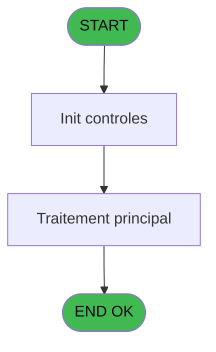
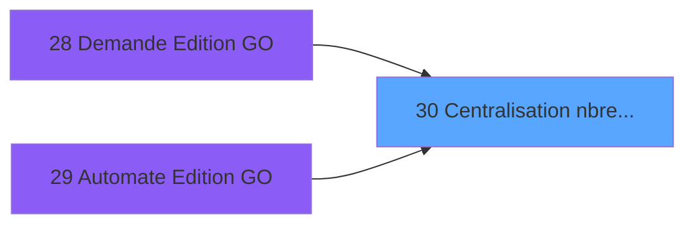
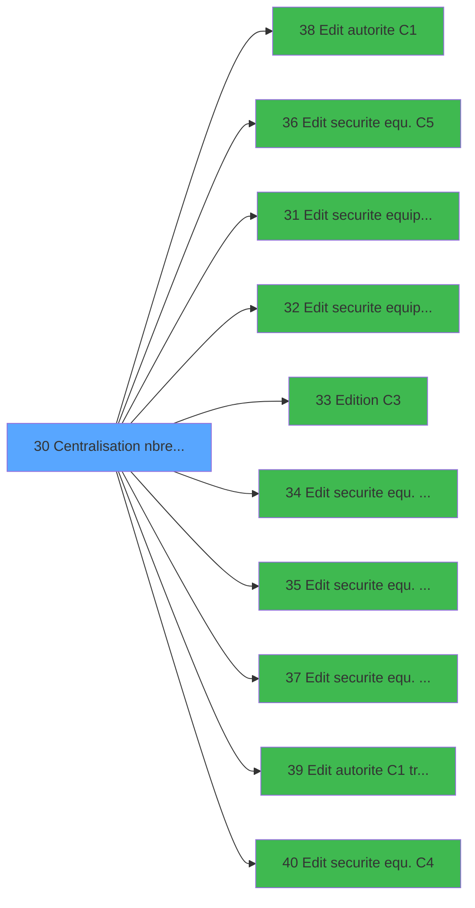

# PBP IDE 30 - Centralisation nbre edition

> **Analyse**: Phases 1-4 2026-02-03 01:17 -> 01:17 (36s) | Assemblage 01:17
> **Pipeline**: V7.2 Enrichi
> **Structure**: 4 onglets (Resume | Ecrans | Donnees | Connexions)

<!-- TAB:Resume -->

## 1. FICHE D'IDENTITE

| Attribut | Valeur |
|----------|--------|
| Projet | PBP |
| IDE Position | 30 |
| Nom Programme | Centralisation nbre edition |
| Fichier source | `Prg_30.xml` |
| Domaine metier | Impression |
| Taches | 1 (0 ecrans visibles) |
| Tables modifiees | 0 |
| Programmes appeles | 10 |

## 2. DESCRIPTION FONCTIONNELLE

**Centralisation nbre edition** assure la gestion complete de ce processus, accessible depuis [Demande Edition GO (IDE 28)](PBP-IDE-28.md), [   Automate Edition GO (IDE 29)](PBP-IDE-29.md).

Le flux de traitement s'organise en **1 blocs fonctionnels** :

- **Impression** (1 tache) : generation de tickets et documents

## 3. BLOCS FONCTIONNELS

### 3.1 Impression (1 tache)

Generation des documents et tickets.

---

#### 30 - Centralisation nbre edition

**Role** : Generation du document : Centralisation nbre edition.
**Variables liees** : A (> type edition), B (> nbre edition)
**Delegue a** : [Edition C3 (IDE 33)](PBP-IDE-33.md)

## 5. REGLES METIER

*(Aucune regle metier identifiee)*

## 6. CONTEXTE

- **Appele par**: [Demande Edition GO (IDE 28)](PBP-IDE-28.md), [   Automate Edition GO (IDE 29)](PBP-IDE-29.md)
- **Appelle**: 10 programmes | **Tables**: 0 (W:0 R:0 L:0) | **Taches**: 1 | **Expressions**: 21

<!-- TAB:Ecrans -->

## 8. ECRANS

*(Programme sans ecran visible)*

## 9. NAVIGATION

### 9.3 Structure hierarchique (1 tache)

| Position | Tache | Type | Dimensions | Bloc |
|----------|-------|------|------------|------|
| **30.1** | [**Centralisation nbre edition** (30)](#t1) | MDI | - | Impression |

### 9.4 Algorigramme

> **Legende**: Vert = START/END OK | Rouge = END KO | Bleu = Decisions
> *Algorigramme auto-genere. Utiliser `/algorigramme` pour une synthese metier detaillee.*

<!-- TAB:Donnees -->

## 10. TABLES

### Tables utilisees (0)

| ID | Nom | Description | Type | R | W | L | Usages |
|----|-----|-------------|------|---|---|---|--------|

### Colonnes par table (0 / 0 tables avec colonnes identifiees)

## 11. VARIABLES

### 11.1 Autres (7)

Variables diverses.

| Lettre | Nom | Type | Usage dans |
|--------|-----|------|-----------|
| A | > type edition | Alpha | [30](#t1) |
| B | > nbre edition | Numeric | [30](#t1) |
| C | > date traitement | Date | 1x refs |
| D | > Commandant | Alpha | - |
| E | > Cruize | Numeric | - |
| F | > Escale | Alpha | - |
| G | > Orientation | Alpha | - |

## 12. EXPRESSIONS

**21 / 21 expressions decodees (100%)**

### 12.1 Repartition par type

| Type | Expressions | Regles |
|------|-------------|--------|
| CONSTANTE | 7 | 0 |
| CONDITION | 14 | 0 |

### 12.2 Expressions cles par type

#### CONSTANTE (7 expressions)

| Type | IDE | Expression | Regle |
|------|-----|------------|-------|
| CONSTANTE | 18 | `'D'` | - |
| CONSTANTE | 19 | `'Z'` | - |
| CONSTANTE | 20 | `'P'` | - |
| CONSTANTE | 17 | `'A'` | - |
| CONSTANTE | 1 | `'A'` | - |
| ... | | *+2 autres* | |

#### CONDITION (14 expressions)

| Type | IDE | Expression | Regle |
|------|-----|------------|-------|
| CONDITION | 12 | `> type edition [A]='C5'` | - |
| CONDITION | 11 | `> type edition [A]='C4'` | - |
| CONDITION | 10 | `> type edition [A]='C6'` | - |
| CONDITION | 13 | `> type edition [A]='C3'` | - |
| CONDITION | 21 | `> nbre edition [B]>0` | - |
| ... | | *+9 autres* | |

### 12.3 Toutes les expressions (21)

Voir les 21 expressions

#### CONSTANTE (7)

| IDE | Expression Decodee |
|-----|-------------------|
| 1 | `'A'` |
| 2 | `'N'` |
| 16 | `'T'` |
| 17 | `'A'` |
| 18 | `'D'` |
| 19 | `'Z'` |
| 20 | `'P'` |

#### CONDITION (14)

| IDE | Expression Decodee |
|-----|-------------------|
| 3 | `> date traitement [C]` |
| 4 | `> type edition [A]='C1T'` |
| 5 | `> type edition [A]='C1E'` |
| 6 | `> type edition [A]='C1D'` |
| 7 | `> type edition [A]='C1L'` |
| 8 | `> type edition [A]='C1S'` |
| 9 | `> type edition [A]='C2'` |
| 10 | `> type edition [A]='C6'` |
| 11 | `> type edition [A]='C4'` |
| 12 | `> type edition [A]='C5'` |
| 13 | `> type edition [A]='C3'` |
| 14 | `> type edition [A]='P1G'` |
| 15 | `Counter (0)>=> nbre edition [B] OR > nbre edition [B]=0` |
| 21 | `> nbre edition [B]>0` |

<!-- TAB:Connexions -->

## 13. GRAPHE D'APPELS

### 13.1 Chaine depuis Main (Callers)

Main -> ... -> [Demande Edition GO (IDE 28)](PBP-IDE-28.md) -> **Centralisation nbre edition (IDE 30)**

Main -> ... -> [   Automate Edition GO (IDE 29)](PBP-IDE-29.md) -> **Centralisation nbre edition (IDE 30)**

### 13.2 Callers

| IDE | Nom Programme | Nb Appels |
|-----|---------------|-----------|
| [28](PBP-IDE-28.md) | Demande Edition GO | 11 |
| [29](PBP-IDE-29.md) |    Automate Edition GO | 10 |

### 13.3 Callees (programmes appeles)

### 13.4 Detail Callees avec contexte

| IDE | Nom Programme | Appels | Contexte |
|-----|---------------|--------|----------|
| [38](PBP-IDE-38.md) | Edit autorite C1 | 5 | Sous-programme |
| [36](PBP-IDE-36.md) | Edit securite equ. C5 | 2 | Sous-programme |
| [31](PBP-IDE-31.md) | Edit securite equipage must C2 | 1 | Sous-programme |
| [32](PBP-IDE-32.md) | Edit securite equipage name C2 | 1 | Sous-programme |
| [33](PBP-IDE-33.md) | Edition C3 | 1 | Impression ticket/document |
| [34](PBP-IDE-34.md) | Edit securite equ. Fonct. N C6 | 1 | Sous-programme |
| [35](PBP-IDE-35.md) | Edit securite equ. Fonct. A C6 | 1 | Sous-programme |
| [37](PBP-IDE-37.md) | Edit securite equ. libre C5 | 1 | Sous-programme |
| [39](PBP-IDE-39.md) | Edit autorite C1 trie national | 1 | Sous-programme |
| [40](PBP-IDE-40.md) | Edit securite equ. C4 | 1 | Sous-programme |

## 14. RECOMMANDATIONS MIGRATION

### 14.1 Profil du programme

| Metrique | Valeur | Impact migration |
|----------|--------|-----------------|
| Lignes de logique | 32 | Programme compact |
| Expressions | 21 | Peu de logique |
| Tables WRITE | 0 | Impact faible |
| Sous-programmes | 10 | Dependances moderees |
| Ecrans visibles | 0 | Ecran unique ou traitement batch |
| Code desactive | 0% (0 / 32) | Code sain |
| Regles metier | 0 | Pas de regle identifiee |

### 14.2 Plan de migration par bloc

#### Impression (1 tache: 0 ecran, 1 traitement)

- **Strategie** : Templates HTML -> PDF via wkhtmltopdf ou Puppeteer.
- `PrintService` injectable avec choix imprimante

### 14.3 Dependances critiques

| Dependance | Type | Appels | Impact |
|------------|------|--------|--------|
| [Edit autorite C1 (IDE 38)](PBP-IDE-38.md) | Sous-programme | 5x | **CRITIQUE** - Sous-programme |
| [Edit securite equ. C5 (IDE 36)](PBP-IDE-36.md) | Sous-programme | 2x | Haute - Sous-programme |
| [Edit securite equ. libre C5 (IDE 37)](PBP-IDE-37.md) | Sous-programme | 1x | Normale - Sous-programme |
| [Edit securite equ. Fonct. A C6 (IDE 35)](PBP-IDE-35.md) | Sous-programme | 1x | Normale - Sous-programme |
| [Edit securite equ. C4 (IDE 40)](PBP-IDE-40.md) | Sous-programme | 1x | Normale - Sous-programme |
| [Edit autorite C1 trie national (IDE 39)](PBP-IDE-39.md) | Sous-programme | 1x | Normale - Sous-programme |
| [Edit securite equipage name C2 (IDE 32)](PBP-IDE-32.md) | Sous-programme | 1x | Normale - Sous-programme |
| [Edit securite equipage must C2 (IDE 31)](PBP-IDE-31.md) | Sous-programme | 1x | Normale - Sous-programme |
| [Edit securite equ. Fonct. N C6 (IDE 34)](PBP-IDE-34.md) | Sous-programme | 1x | Normale - Sous-programme |
| [Edition C3 (IDE 33)](PBP-IDE-33.md) | Sous-programme | 1x | Normale - Impression ticket/document |

---
*Spec DETAILED generee par Pipeline V7.2 - 2026-02-03 01:17*
