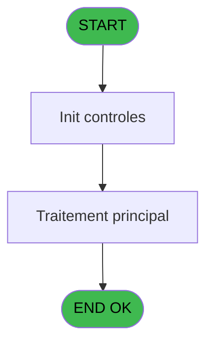
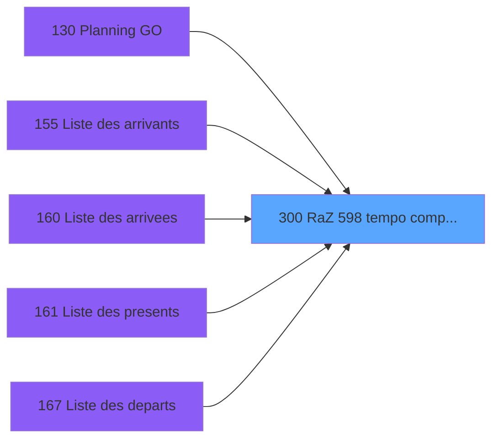

# PBP IDE 300 - RaZ 598 tempo comptage eff

> **Analyse**: Phases 1-4 2026-02-03 16:16 -> 16:17 (15s) | Assemblage 16:17
> **Pipeline**: V7.2 Enrichi
> **Structure**: 4 onglets (Resume | Ecrans | Donnees | Connexions)

<!-- TAB:Resume -->

## 1. FICHE D'IDENTITE

| Attribut | Valeur |
|----------|--------|
| Projet | PBP |
| IDE Position | 300 |
| Nom Programme | RaZ 598 tempo comptage eff |
| Fichier source | `Prg_300.xml` |
| Dossier IDE | Recup |
| Taches | 1 (0 ecrans visibles) |
| Tables modifiees | 0 |
| Programmes appeles | 0 |

## 2. DESCRIPTION FONCTIONNELLE

**RaZ 598 tempo comptage eff** assure la gestion complete de ce processus, accessible depuis [Planning GO (IDE 130)](PBP-IDE-130.md), [Liste des arrivants (IDE 155)](PBP-IDE-155.md), [Liste des arrivees (IDE 160)](PBP-IDE-160.md), [Liste des presents (IDE 161)](PBP-IDE-161.md), [Liste des departs (IDE 167)](PBP-IDE-167.md), [Liste des partants (IDE 172)](PBP-IDE-172.md), [Liste des Absents (IDE 173)](PBP-IDE-173.md), [Liste depart circuit (IDE 191)](PBP-IDE-191.md), [Liste des arrivants personnel (IDE 224)](PBP-IDE-224.md), [Liste des arrivees personnel (IDE 225)](PBP-IDE-225.md), [Liste des presents personnel (IDE 226)](PBP-IDE-226.md), [Liste des Absents personnel (IDE 231)](PBP-IDE-231.md), [Liste des departs personnel (IDE 232)](PBP-IDE-232.md), [Liste des partants personnel (IDE 233)](PBP-IDE-233.md).

Le flux de traitement s'organise en **1 blocs fonctionnels** :

- **Calcul** (1 tache) : calculs de montants, stocks ou compteurs

## 3. BLOCS FONCTIONNELS

### 3.1 Calcul (1 tache)

Calculs metier : montants, stocks, compteurs.

---

#### 300 - RaZ 203 tempo comptage

**Role** : Reinitialisation : RaZ 203 tempo comptage.

## 5. REGLES METIER

*(Aucune regle metier identifiee)*

## 6. CONTEXTE

- **Appele par**: [Planning GO (IDE 130)](PBP-IDE-130.md), [Liste des arrivants (IDE 155)](PBP-IDE-155.md), [Liste des arrivees (IDE 160)](PBP-IDE-160.md), [Liste des presents (IDE 161)](PBP-IDE-161.md), [Liste des departs (IDE 167)](PBP-IDE-167.md), [Liste des partants (IDE 172)](PBP-IDE-172.md), [Liste des Absents (IDE 173)](PBP-IDE-173.md), [Liste depart circuit (IDE 191)](PBP-IDE-191.md), [Liste des arrivants personnel (IDE 224)](PBP-IDE-224.md), [Liste des arrivees personnel (IDE 225)](PBP-IDE-225.md), [Liste des presents personnel (IDE 226)](PBP-IDE-226.md), [Liste des Absents personnel (IDE 231)](PBP-IDE-231.md), [Liste des departs personnel (IDE 232)](PBP-IDE-232.md), [Liste des partants personnel (IDE 233)](PBP-IDE-233.md)
- **Appelle**: 0 programmes | **Tables**: 0 (W:0 R:0 L:0) | **Taches**: 1 | **Expressions**: 1

<!-- TAB:Ecrans -->

## 8. ECRANS

*(Programme sans ecran visible)*

## 9. NAVIGATION

### 9.3 Structure hierarchique (1 tache)

| Position | Tache | Type | Dimensions | Bloc |
|----------|-------|------|------------|------|
| **300.1** | [**RaZ 203 tempo comptage** (300)](#t1) | MDI | - | Calcul |

### 9.4 Algorigramme

> **Legende**: Vert = START/END OK | Rouge = END KO | Bleu = Decisions
> *Algorigramme auto-genere. Utiliser `/algorigramme` pour une synthese metier detaillee.*

<!-- TAB:Donnees -->

## 10. TABLES

### Tables utilisees (0)

| ID | Nom | Description | Type | R | W | L | Usages |
|----|-----|-------------|------|---|---|---|--------|

### Colonnes par table (0 / 0 tables avec colonnes identifiees)

## 11. VARIABLES

*(Programme sans variables locales mappees)*

## 12. EXPRESSIONS

**1 / 1 expressions decodees (100%)**

### 12.1 Repartition par type

| Type | Expressions | Regles |
|------|-------------|--------|
| OTHER | 1 | 0 |

### 12.2 Expressions cles par type

#### OTHER (1 expressions)

| Type | IDE | Expression | Regle |
|------|-----|------------|-------|
| OTHER | 1 | `DbDel('{598,2}'DSOURCE,'')` | - |

<!-- TAB:Connexions -->

## 13. GRAPHE D'APPELS

### 13.1 Chaine depuis Main (Callers)

Main -> ... -> [Planning GO (IDE 130)](PBP-IDE-130.md) -> **RaZ 598 tempo comptage eff (IDE 300)**

Main -> ... -> [Liste des arrivants (IDE 155)](PBP-IDE-155.md) -> **RaZ 598 tempo comptage eff (IDE 300)**

Main -> ... -> [Liste des arrivees (IDE 160)](PBP-IDE-160.md) -> **RaZ 598 tempo comptage eff (IDE 300)**

Main -> ... -> [Liste des presents (IDE 161)](PBP-IDE-161.md) -> **RaZ 598 tempo comptage eff (IDE 300)**

Main -> ... -> [Liste des departs (IDE 167)](PBP-IDE-167.md) -> **RaZ 598 tempo comptage eff (IDE 300)**

Main -> ... -> [Liste des partants (IDE 172)](PBP-IDE-172.md) -> **RaZ 598 tempo comptage eff (IDE 300)**

Main -> ... -> [Liste des Absents (IDE 173)](PBP-IDE-173.md) -> **RaZ 598 tempo comptage eff (IDE 300)**

Main -> ... -> [Liste depart circuit (IDE 191)](PBP-IDE-191.md) -> **RaZ 598 tempo comptage eff (IDE 300)**

Main -> ... -> [Liste des arrivants personnel (IDE 224)](PBP-IDE-224.md) -> **RaZ 598 tempo comptage eff (IDE 300)**

Main -> ... -> [Liste des arrivees personnel (IDE 225)](PBP-IDE-225.md) -> **RaZ 598 tempo comptage eff (IDE 300)**

Main -> ... -> [Liste des presents personnel (IDE 226)](PBP-IDE-226.md) -> **RaZ 598 tempo comptage eff (IDE 300)**

Main -> ... -> [Liste des Absents personnel (IDE 231)](PBP-IDE-231.md) -> **RaZ 598 tempo comptage eff (IDE 300)**

Main -> ... -> [Liste des departs personnel (IDE 232)](PBP-IDE-232.md) -> **RaZ 598 tempo comptage eff (IDE 300)**

Main -> ... -> [Liste des partants personnel (IDE 233)](PBP-IDE-233.md) -> **RaZ 598 tempo comptage eff (IDE 300)**

### 13.2 Callers

| IDE | Nom Programme | Nb Appels |
|-----|---------------|-----------|
| [130](PBP-IDE-130.md) | Planning GO | 1 |
| [155](PBP-IDE-155.md) | Liste des arrivants | 1 |
| [160](PBP-IDE-160.md) | Liste des arrivees | 1 |
| [161](PBP-IDE-161.md) | Liste des presents | 1 |
| [167](PBP-IDE-167.md) | Liste des departs | 1 |
| [172](PBP-IDE-172.md) | Liste des partants | 1 |
| [173](PBP-IDE-173.md) | Liste des Absents | 1 |
| [191](PBP-IDE-191.md) | Liste depart circuit | 1 |
| [224](PBP-IDE-224.md) | Liste des arrivants personnel | 1 |
| [225](PBP-IDE-225.md) | Liste des arrivees personnel | 1 |
| [226](PBP-IDE-226.md) | Liste des presents personnel | 1 |
| [231](PBP-IDE-231.md) | Liste des Absents personnel | 1 |
| [232](PBP-IDE-232.md) | Liste des departs personnel | 1 |
| [233](PBP-IDE-233.md) | Liste des partants personnel | 1 |

### 13.3 Callees (programmes appeles)

### 13.4 Detail Callees avec contexte

| IDE | Nom Programme | Appels | Contexte |
|-----|---------------|--------|----------|
| - | (aucun) | - | - |

## 14. RECOMMANDATIONS MIGRATION

### 14.1 Profil du programme

| Metrique | Valeur | Impact migration |
|----------|--------|-----------------|
| Lignes de logique | 2 | Programme compact |
| Expressions | 1 | Peu de logique |
| Tables WRITE | 0 | Impact faible |
| Sous-programmes | 0 | Peu de dependances |
| Ecrans visibles | 0 | Ecran unique ou traitement batch |
| Code desactive | 0% (0 / 2) | Code sain |
| Regles metier | 0 | Pas de regle identifiee |

### 14.2 Plan de migration par bloc

#### Calcul (1 tache: 0 ecran, 1 traitement)

- **Strategie** : Services de calcul purs (Domain Services).
- Migrer la logique de calcul (stock, compteurs, montants)

### 14.3 Dependances critiques

| Dependance | Type | Appels | Impact |
|------------|------|--------|--------|

---
*Spec DETAILED generee par Pipeline V7.2 - 2026-02-03 16:17*
