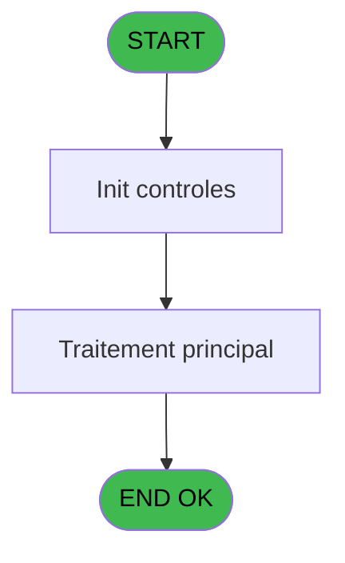
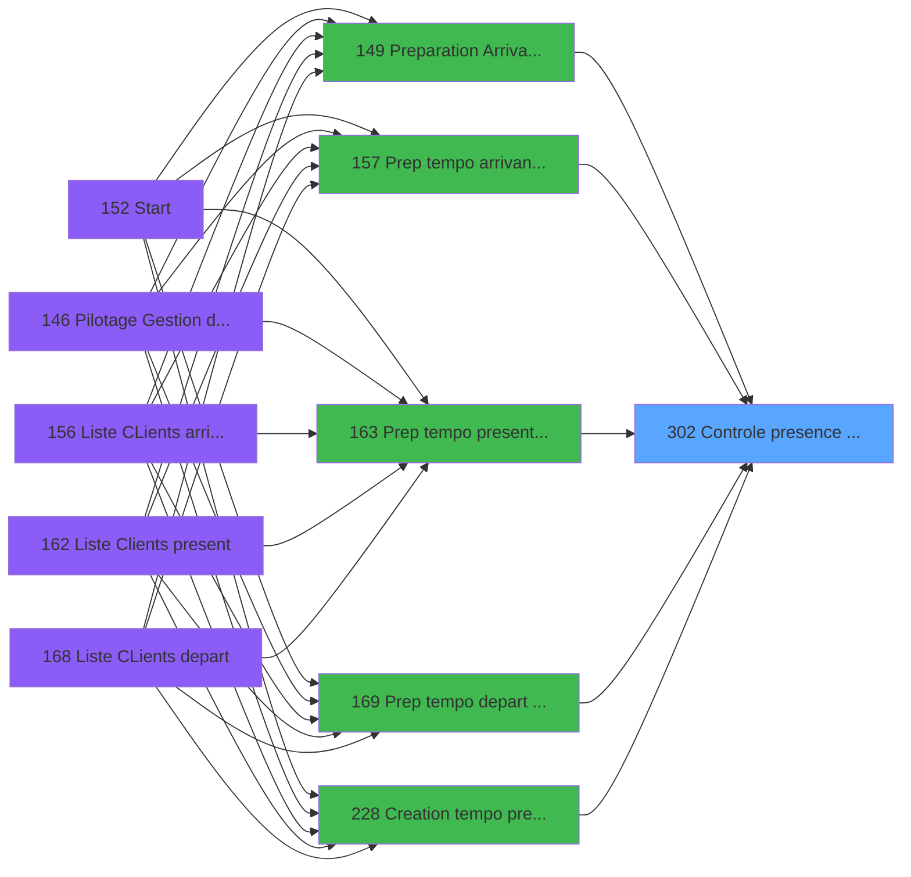

# PBP IDE 302 - Controle presence heberg

> **Analyse**: Phases 1-4 2026-02-03 16:17 -> 16:17 (13s) | Assemblage 16:17
> **Pipeline**: V7.2 Enrichi
> **Structure**: 4 onglets (Resume | Ecrans | Donnees | Connexions)

<!-- TAB:Resume -->

## 1. FICHE D'IDENTITE

| Attribut | Valeur |
|----------|--------|
| Projet | PBP |
| IDE Position | 302 |
| Nom Programme | Controle presence heberg |
| Fichier source | `Prg_302.xml` |
| Dossier IDE | Recup |
| Taches | 1 (0 ecrans visibles) |
| Tables modifiees | 0 |
| Programmes appeles | 0 |

## 2. DESCRIPTION FONCTIONNELLE

**Controle presence heberg** assure la gestion complete de ce processus, accessible depuis [Preparation Arrivants/Presents (IDE 149)](PBP-IDE-149.md), [  Prep tempo arrivant planning (IDE 157)](PBP-IDE-157.md), [  Prep tempo present planning (IDE 163)](PBP-IDE-163.md), [  Prep tempo depart comptage (IDE 169)](PBP-IDE-169.md), [  Creation tempo pres plan GO (IDE 228)](PBP-IDE-228.md), [Prep tempo present planning CL (IDE 249)](PBP-IDE-249.md), [Prepa tempo toutes GM CP SQL (IDE 327)](PBP-IDE-327.md), [Prepare tempo seminaire (IDE 328)](PBP-IDE-328.md), [Creation tempo toutes GO (IDE 335)](PBP-IDE-335.md), [Creation tempo abs GO (IDE 336)](PBP-IDE-336.md).

Le flux de traitement s'organise en **1 blocs fonctionnels** :

- **Traitement** (1 tache) : traitements metier divers

## 3. BLOCS FONCTIONNELS

### 3.1 Traitement (1 tache)

Traitements internes.

---

#### 302 - ...Contrôle Presence Heberge.

**Role** : Traitement : ...Contrôle Presence Heberge..
**Variables liees** : E (<RetPresence)

## 5. REGLES METIER

*(Aucune regle metier identifiee)*

## 6. CONTEXTE

- **Appele par**: [Preparation Arrivants/Presents (IDE 149)](PBP-IDE-149.md), [  Prep tempo arrivant planning (IDE 157)](PBP-IDE-157.md), [  Prep tempo present planning (IDE 163)](PBP-IDE-163.md), [  Prep tempo depart comptage (IDE 169)](PBP-IDE-169.md), [  Creation tempo pres plan GO (IDE 228)](PBP-IDE-228.md), [Prep tempo present planning CL (IDE 249)](PBP-IDE-249.md), [Prepa tempo toutes GM CP SQL (IDE 327)](PBP-IDE-327.md), [Prepare tempo seminaire (IDE 328)](PBP-IDE-328.md), [Creation tempo toutes GO (IDE 335)](PBP-IDE-335.md), [Creation tempo abs GO (IDE 336)](PBP-IDE-336.md)
- **Appelle**: 0 programmes | **Tables**: 1 (W:0 R:1 L:0) | **Taches**: 1 | **Expressions**: 15

<!-- TAB:Ecrans -->

## 8. ECRANS

*(Programme sans ecran visible)*

## 9. NAVIGATION

### 9.3 Structure hierarchique (1 tache)

| Position | Tache | Type | Dimensions | Bloc |
|----------|-------|------|------------|------|
| **302.1** | [**...Contrôle Presence Heberge.** (302)](#t1) | MDI | - | Traitement |

### 9.4 Algorigramme

> **Legende**: Vert = START/END OK | Rouge = END KO | Bleu = Decisions
> *Algorigramme auto-genere. Utiliser `/algorigramme` pour une synthese metier detaillee.*

<!-- TAB:Donnees -->

## 10. TABLES

### Tables utilisees (1)

| ID | Nom | Description | Type | R | W | L | Usages |
|----|-----|-------------|------|---|---|---|--------|
| 34 | hebergement______heb | Hebergement (chambres) | DB | R |   |   | 1 |

### Colonnes par table (1 / 1 tables avec colonnes identifiees)

Table 34 - hebergement______heb (R) - 1 usages

| Lettre | Variable | Acces | Type |
|--------|----------|-------|------|
| A | >Compte | R | Numeric |
| B | >Filiation | R | Numeric |
| C | >Date | R | Date |
| D | >Heure | R | Alpha |
| E | <RetPresence | R | Logical |
| F | v. date init | R | Numeric |
| G | v. chaine deb | R | Numeric |
| H | v. chaine fin | R | Numeric |

## 11. VARIABLES

### 11.1 Variables de session (3)

Variables persistantes pendant toute la session.

| Lettre | Nom | Type | Usage dans |
|--------|-----|------|-----------|
| F | v. date init | Numeric | - |
| G | v. chaine deb | Numeric | - |
| H | v. chaine fin | Numeric | - |

### 11.2 Autres (5)

Variables diverses.

| Lettre | Nom | Type | Usage dans |
|--------|-----|------|-----------|
| A | >Compte | Numeric | 1x refs |
| B | >Filiation | Numeric | 1x refs |
| C | >Date | Date | 3x refs |
| D | >Heure | Alpha | 4x refs |
| E | <RetPresence | Logical | 1x refs |

## 12. EXPRESSIONS

**15 / 15 expressions decodees (100%)**

### 12.1 Repartition par type

| Type | Expressions | Regles |
|------|-------------|--------|
| CONDITION | 8 | 0 |
| CONSTANTE | 2 | 0 |
| DATE | 2 | 0 |
| OTHER | 1 | 0 |
| CAST_LOGIQUE | 2 | 0 |

### 12.2 Expressions cles par type

#### CONDITION (8 expressions)

| Type | IDE | Expression | Regle |
|------|-----|------------|-------|
| CONDITION | 9 | `[N]<=>Date [C] AND [P]>=>Date [C]` | - |
| CONDITION | 8 | `>Heure [D]=''` | - |
| CONDITION | 11 | `<RetPresence [E]` | - |
| CONDITION | 10 | `>Heure [D]<>''` | - |
| CONDITION | 13 | `Val (DStr (>Date [C],'YYYY'),'4')*1000000+Val (DStr (>Date [C],'MM'),'2')*10000+Val (DStr (>Date [C],'DD'),'2')*100+Val (>Heure [D],'2')` | - |
| ... | | *+3 autres* | |

#### CONSTANTE (2 expressions)

| Type | IDE | Expression | Regle |
|------|-----|------------|-------|
| CONSTANTE | 7 | `'P'` | - |
| CONSTANTE | 6 | `'H'` | - |

#### DATE (2 expressions)

| Type | IDE | Expression | Regle |
|------|-----|------------|-------|
| DATE | 15 | `Val (DStr ([P],'YYYY'),'4')*1000000+Val (DStr ([P],'MM'),'2')*10000+Val (DStr ([P],'DD'),'2')*100+Val ([Q],'2')` | - |
| DATE | 14 | `Val (DStr ([N],'YYYY'),'4')*1000000+Val (DStr ([N],'MM'),'2')*10000+Val (DStr ([N],'DD'),'2')*100+Val ([O],'2')` | - |

#### OTHER (1 expressions)

| Type | IDE | Expression | Regle |
|------|-----|------------|-------|
| OTHER | 1 | `GetParam ('SOCIETE')` | - |

#### CAST_LOGIQUE (2 expressions)

| Type | IDE | Expression | Regle |
|------|-----|------------|-------|
| CAST_LOGIQUE | 5 | `'TRUE'LOG` | - |
| CAST_LOGIQUE | 4 | `'FALSE'LOG` | - |

<!-- TAB:Connexions -->

## 13. GRAPHE D'APPELS

### 13.1 Chaine depuis Main (Callers)

Main -> ... -> [Preparation Arrivants/Presents (IDE 149)](PBP-IDE-149.md) -> **Controle presence heberg (IDE 302)**

Main -> ... -> [  Prep tempo arrivant planning (IDE 157)](PBP-IDE-157.md) -> **Controle presence heberg (IDE 302)**

Main -> ... -> [  Prep tempo present planning (IDE 163)](PBP-IDE-163.md) -> **Controle presence heberg (IDE 302)**

Main -> ... -> [  Prep tempo depart comptage (IDE 169)](PBP-IDE-169.md) -> **Controle presence heberg (IDE 302)**

Main -> ... -> [  Creation tempo pres plan GO (IDE 228)](PBP-IDE-228.md) -> **Controle presence heberg (IDE 302)**

Main -> ... -> [Prep tempo present planning CL (IDE 249)](PBP-IDE-249.md) -> **Controle presence heberg (IDE 302)**

Main -> ... -> [Prepa tempo toutes GM CP SQL (IDE 327)](PBP-IDE-327.md) -> **Controle presence heberg (IDE 302)**

Main -> ... -> [Prepare tempo seminaire (IDE 328)](PBP-IDE-328.md) -> **Controle presence heberg (IDE 302)**

Main -> ... -> [Creation tempo toutes GO (IDE 335)](PBP-IDE-335.md) -> **Controle presence heberg (IDE 302)**

Main -> ... -> [Creation tempo abs GO (IDE 336)](PBP-IDE-336.md) -> **Controle presence heberg (IDE 302)**

### 13.2 Callers

| IDE | Nom Programme | Nb Appels |
|-----|---------------|-----------|
| [149](PBP-IDE-149.md) | Preparation Arrivants/Presents | 1 |
| [157](PBP-IDE-157.md) |   Prep tempo arrivant planning | 1 |
| [163](PBP-IDE-163.md) |   Prep tempo present planning | 1 |
| [169](PBP-IDE-169.md) |   Prep tempo depart comptage | 1 |
| [228](PBP-IDE-228.md) |   Creation tempo pres plan GO | 1 |
| [249](PBP-IDE-249.md) | Prep tempo present planning CL | 1 |
| [327](PBP-IDE-327.md) | Prepa tempo toutes GM CP SQL | 1 |
| [328](PBP-IDE-328.md) | Prepare tempo seminaire | 1 |
| [335](PBP-IDE-335.md) | Creation tempo toutes GO | 1 |
| [336](PBP-IDE-336.md) | Creation tempo abs GO | 1 |

### 13.3 Callees (programmes appeles)

### 13.4 Detail Callees avec contexte

| IDE | Nom Programme | Appels | Contexte |
|-----|---------------|--------|----------|
| - | (aucun) | - | - |

## 14. RECOMMANDATIONS MIGRATION

### 14.1 Profil du programme

| Metrique | Valeur | Impact migration |
|----------|--------|-----------------|
| Lignes de logique | 33 | Programme compact |
| Expressions | 15 | Peu de logique |
| Tables WRITE | 0 | Impact faible |
| Sous-programmes | 0 | Peu de dependances |
| Ecrans visibles | 0 | Ecran unique ou traitement batch |
| Code desactive | 0% (0 / 33) | Code sain |
| Regles metier | 0 | Pas de regle identifiee |

### 14.2 Plan de migration par bloc

#### Traitement (1 tache: 0 ecran, 1 traitement)

- **Strategie** : 1 service(s) backend injectable(s) (Domain Services).
- Decomposer les taches en services unitaires testables.

### 14.3 Dependances critiques

| Dependance | Type | Appels | Impact |
|------------|------|--------|--------|

---
*Spec DETAILED generee par Pipeline V7.2 - 2026-02-03 16:17*
