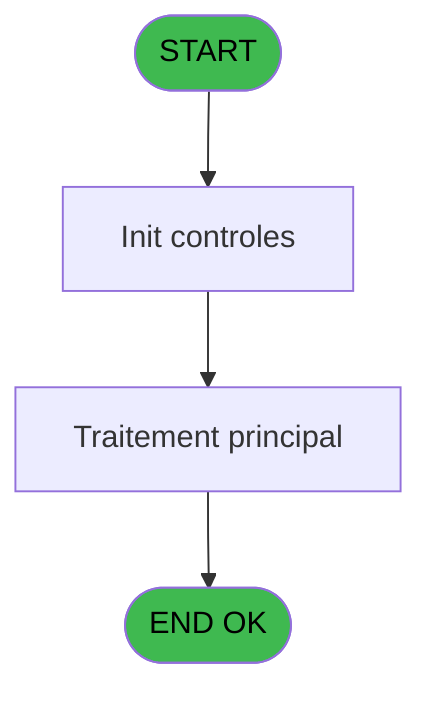
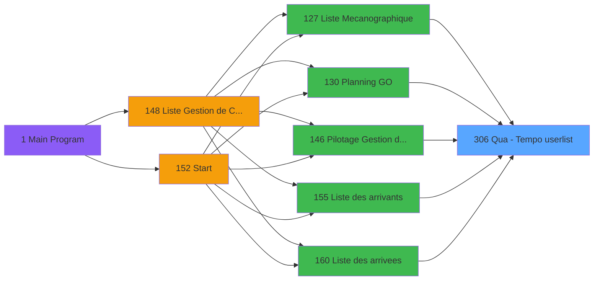

# PBP IDE 306 - Qua -> Tempo userlist

> **Analyse**: Phases 1-4 2026-02-03 16:18 -> 16:18 (13s) | Assemblage 16:18
> **Pipeline**: V7.2 Enrichi
> **Structure**: 4 onglets (Resume | Ecrans | Donnees | Connexions)

<!-- TAB:Resume -->

## 1. FICHE D'IDENTITE

| Attribut | Valeur |
|----------|--------|
| Projet | PBP |
| IDE Position | 306 |
| Nom Programme | Qua -> Tempo userlist |
| Fichier source | `Prg_306.xml` |
| Dossier IDE | Recup |
| Taches | 2 (0 ecrans visibles) |
| Tables modifiees | 0 |
| Programmes appeles | 0 |

## 2. DESCRIPTION FONCTIONNELLE

**Qua -> Tempo userlist** assure la gestion complete de ce processus, accessible depuis [Pilotage Gestion de Crise (IDE 146)](PBP-IDE-146.md), [Liste Mecanographique (IDE 127)](PBP-IDE-127.md), [Planning GO (IDE 130)](PBP-IDE-130.md), [Liste des arrivants (IDE 155)](PBP-IDE-155.md), [Liste des arrivees (IDE 160)](PBP-IDE-160.md), [Liste des presents (IDE 161)](PBP-IDE-161.md), [Liste des departs (IDE 167)](PBP-IDE-167.md), [Liste des partants (IDE 172)](PBP-IDE-172.md), [Liste des Absents (IDE 173)](PBP-IDE-173.md), [Liste des arrivants personnel (IDE 224)](PBP-IDE-224.md), [Liste des arrivees personnel (IDE 225)](PBP-IDE-225.md), [Liste des presents personnel (IDE 226)](PBP-IDE-226.md), [Liste des Absents personnel (IDE 231)](PBP-IDE-231.md), [Liste des departs personnel (IDE 232)](PBP-IDE-232.md), [Liste des partants personnel (IDE 233)](PBP-IDE-233.md).

Le flux de traitement s'organise en **1 blocs fonctionnels** :

- **Traitement** (2 taches) : traitements metier divers

## 3. BLOCS FONCTIONNELS

### 3.1 Traitement (2 taches)

Traitements internes.

---

#### 306 - Qua -> Tempo userlist

**Role** : Traitement : Qua -> Tempo userlist.

---

#### 306.1 - Code Log -> Tempo userlist

**Role** : Traitement : Code Log -> Tempo userlist.
**Variables liees** : A (>CodeSelect (QUA))

## 5. REGLES METIER

*(Aucune regle metier identifiee)*

## 6. CONTEXTE

- **Appele par**: [Pilotage Gestion de Crise (IDE 146)](PBP-IDE-146.md), [Liste Mecanographique (IDE 127)](PBP-IDE-127.md), [Planning GO (IDE 130)](PBP-IDE-130.md), [Liste des arrivants (IDE 155)](PBP-IDE-155.md), [Liste des arrivees (IDE 160)](PBP-IDE-160.md), [Liste des presents (IDE 161)](PBP-IDE-161.md), [Liste des departs (IDE 167)](PBP-IDE-167.md), [Liste des partants (IDE 172)](PBP-IDE-172.md), [Liste des Absents (IDE 173)](PBP-IDE-173.md), [Liste des arrivants personnel (IDE 224)](PBP-IDE-224.md), [Liste des arrivees personnel (IDE 225)](PBP-IDE-225.md), [Liste des presents personnel (IDE 226)](PBP-IDE-226.md), [Liste des Absents personnel (IDE 231)](PBP-IDE-231.md), [Liste des departs personnel (IDE 232)](PBP-IDE-232.md), [Liste des partants personnel (IDE 233)](PBP-IDE-233.md)
- **Appelle**: 0 programmes | **Tables**: 4 (W:0 R:2 L:2) | **Taches**: 2 | **Expressions**: 12

<!-- TAB:Ecrans -->

## 8. ECRANS

*(Programme sans ecran visible)*

## 9. NAVIGATION

### 9.3 Structure hierarchique (2 taches)

| Position | Tache | Type | Dimensions | Bloc |
|----------|-------|------|------------|------|
| **306.1** | [**Qua -> Tempo userlist** (306)](#t1) | MDI | - | Traitement |
| 306.1.1 | [Code Log -> Tempo userlist (306.1)](#t2) | MDI | - | |

### 9.4 Algorigramme

> **Legende**: Vert = START/END OK | Rouge = END KO | Bleu = Decisions
> *Algorigramme auto-genere. Utiliser `/algorigramme` pour une synthese metier detaillee.*

<!-- TAB:Donnees -->

## 10. TABLES

### Tables utilisees (4)

| ID | Nom | Description | Type | R | W | L | Usages |
|----|-----|-------------|------|---|---|---|--------|
| 108 | code_logement____clo |  | DB | R |   |   | 1 |
| 120 | tables_qualites__qua |  | DB | R |   |   | 1 |
| 598 | tempo_ecr_previsions | Table temporaire ecran | TMP |   |   | L | 1 |
| 637 | tempo_zone_secteur | Table temporaire ecran | DB |   |   | L | 2 |

### Colonnes par table (2 / 2 tables avec colonnes identifiees)

Table 108 - code_logement____clo (R) - 1 usages

| Lettre | Variable | Acces | Type |
|--------|----------|-------|------|
| A | >CodeSelect (QUA) | R | Alpha |

Table 120 - tables_qualites__qua (R) - 1 usages

| Lettre | Variable | Acces | Type |
|--------|----------|-------|------|
| A | >CodeSelect (QUA) | R | Alpha |
| B | >Categorie (TUL) | R | Alpha |
| C | >NomTable (TUL) | R | Alpha |
| D | >SiListeMecano | R | Alpha |

## 11. VARIABLES

### 11.1 Autres (4)

Variables diverses.

| Lettre | Nom | Type | Usage dans |
|--------|-----|------|-----------|
| A | >CodeSelect (QUA) | Alpha | 1x refs |
| B | >Categorie (TUL) | Alpha | 1x refs |
| C | >NomTable (TUL) | Alpha | 1x refs |
| D | >SiListeMecano | Alpha | 1x refs |

## 12. EXPRESSIONS

**12 / 12 expressions decodees (100%)**

### 12.1 Repartition par type

| Type | Expressions | Regles |
|------|-------------|--------|
| OTHER | 5 | 0 |
| CONDITION | 4 | 0 |
| REFERENCE_VG | 1 | 0 |
| CAST_LOGIQUE | 1 | 0 |
| CONCATENATION | 1 | 0 |

### 12.2 Expressions cles par type

#### OTHER (5 expressions)

| Type | IDE | Expression | Regle |
|------|-----|------------|-------|
| OTHER | 7 | `[G]` | - |
| OTHER | 11 | `[I]&[K]` | - |
| OTHER | 6 | `[J]` | - |
| OTHER | 1 | `GetParam ('SOCIETE')` | - |
| OTHER | 5 | `[I]` | - |

#### CONDITION (4 expressions)

| Type | IDE | Expression | Regle |
|------|-----|------------|-------|
| CONDITION | 8 | `>Categorie (TUL) [B]` | - |
| CONDITION | 9 | `>NomTable (TUL) [C]` | - |
| CONDITION | 2 | `CndRange(>CodeSelect (QUA) [A]<>'',>CodeSelect (QUA) [A])` | - |
| CONDITION | 3 | `CndRange (>SiListeMecano [D]<>'',>SiListeMecano [D])` | - |

#### REFERENCE_VG (1 expressions)

| Type | IDE | Expression | Regle |
|------|-----|------------|-------|
| REFERENCE_VG | 4 | `VG1` | - |

#### CAST_LOGIQUE (1 expressions)

| Type | IDE | Expression | Regle |
|------|-----|------------|-------|
| CAST_LOGIQUE | 10 | `'TRUE'LOG` | - |

#### CONCATENATION (1 expressions)

| Type | IDE | Expression | Regle |
|------|-----|------------|-------|
| CONCATENATION | 12 | `[G]&'   '&[I]&[J]` | - |

<!-- TAB:Connexions -->

## 13. GRAPHE D'APPELS

### 13.1 Chaine depuis Main (Callers)

Main -> ... -> [Pilotage Gestion de Crise (IDE 146)](PBP-IDE-146.md) -> **Qua -> Tempo userlist (IDE 306)**

Main -> ... -> [Liste Mecanographique (IDE 127)](PBP-IDE-127.md) -> **Qua -> Tempo userlist (IDE 306)**

Main -> ... -> [Planning GO (IDE 130)](PBP-IDE-130.md) -> **Qua -> Tempo userlist (IDE 306)**

Main -> ... -> [Liste des arrivants (IDE 155)](PBP-IDE-155.md) -> **Qua -> Tempo userlist (IDE 306)**

Main -> ... -> [Liste des arrivees (IDE 160)](PBP-IDE-160.md) -> **Qua -> Tempo userlist (IDE 306)**

Main -> ... -> [Liste des presents (IDE 161)](PBP-IDE-161.md) -> **Qua -> Tempo userlist (IDE 306)**

Main -> ... -> [Liste des departs (IDE 167)](PBP-IDE-167.md) -> **Qua -> Tempo userlist (IDE 306)**

Main -> ... -> [Liste des partants (IDE 172)](PBP-IDE-172.md) -> **Qua -> Tempo userlist (IDE 306)**

Main -> ... -> [Liste des Absents (IDE 173)](PBP-IDE-173.md) -> **Qua -> Tempo userlist (IDE 306)**

Main -> ... -> [Liste des arrivants personnel (IDE 224)](PBP-IDE-224.md) -> **Qua -> Tempo userlist (IDE 306)**

Main -> ... -> [Liste des arrivees personnel (IDE 225)](PBP-IDE-225.md) -> **Qua -> Tempo userlist (IDE 306)**

Main -> ... -> [Liste des presents personnel (IDE 226)](PBP-IDE-226.md) -> **Qua -> Tempo userlist (IDE 306)**

Main -> ... -> [Liste des Absents personnel (IDE 231)](PBP-IDE-231.md) -> **Qua -> Tempo userlist (IDE 306)**

Main -> ... -> [Liste des departs personnel (IDE 232)](PBP-IDE-232.md) -> **Qua -> Tempo userlist (IDE 306)**

Main -> ... -> [Liste des partants personnel (IDE 233)](PBP-IDE-233.md) -> **Qua -> Tempo userlist (IDE 306)**

### 13.2 Callers

| IDE | Nom Programme | Nb Appels |
|-----|---------------|-----------|
| [146](PBP-IDE-146.md) | Pilotage Gestion de Crise | 4 |
| [127](PBP-IDE-127.md) | Liste Mecanographique | 1 |
| [130](PBP-IDE-130.md) | Planning GO | 1 |
| [155](PBP-IDE-155.md) | Liste des arrivants | 1 |
| [160](PBP-IDE-160.md) | Liste des arrivees | 1 |
| [161](PBP-IDE-161.md) | Liste des presents | 1 |
| [167](PBP-IDE-167.md) | Liste des departs | 1 |
| [172](PBP-IDE-172.md) | Liste des partants | 1 |
| [173](PBP-IDE-173.md) | Liste des Absents | 1 |
| [224](PBP-IDE-224.md) | Liste des arrivants personnel | 1 |
| [225](PBP-IDE-225.md) | Liste des arrivees personnel | 1 |
| [226](PBP-IDE-226.md) | Liste des presents personnel | 1 |
| [231](PBP-IDE-231.md) | Liste des Absents personnel | 1 |
| [232](PBP-IDE-232.md) | Liste des departs personnel | 1 |
| [233](PBP-IDE-233.md) | Liste des partants personnel | 1 |

### 13.3 Callees (programmes appeles)

### 13.4 Detail Callees avec contexte

| IDE | Nom Programme | Appels | Contexte |
|-----|---------------|--------|----------|
| - | (aucun) | - | - |

## 14. RECOMMANDATIONS MIGRATION

### 14.1 Profil du programme

| Metrique | Valeur | Impact migration |
|----------|--------|-----------------|
| Lignes de logique | 49 | Programme compact |
| Expressions | 12 | Peu de logique |
| Tables WRITE | 0 | Impact faible |
| Sous-programmes | 0 | Peu de dependances |
| Ecrans visibles | 0 | Ecran unique ou traitement batch |
| Code desactive | 0% (0 / 49) | Code sain |
| Regles metier | 0 | Pas de regle identifiee |

### 14.2 Plan de migration par bloc

#### Traitement (2 taches: 0 ecran, 2 traitements)

- **Strategie** : 2 service(s) backend injectable(s) (Domain Services).
- Decomposer les taches en services unitaires testables.

### 14.3 Dependances critiques

| Dependance | Type | Appels | Impact |
|------------|------|--------|--------|

---
*Spec DETAILED generee par Pipeline V7.2 - 2026-02-03 16:19*
