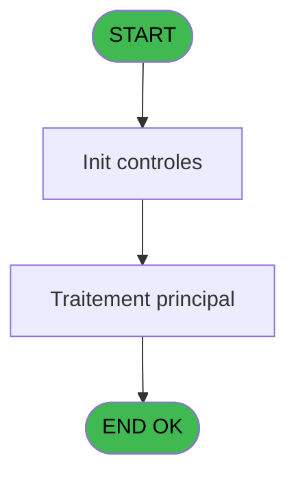
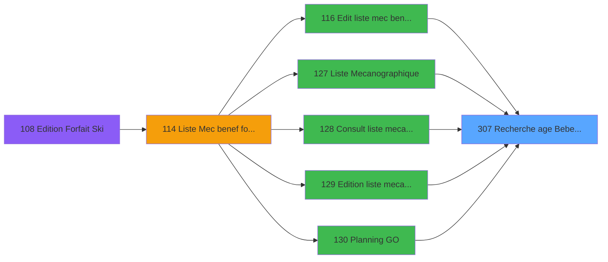

# PBP IDE 307 - Recherche age Bebe_Enfant

> **Analyse**: Phases 1-4 2026-02-03 16:19 -> 16:19 (16s) | Assemblage 16:19
> **Pipeline**: V7.2 Enrichi
> **Structure**: 4 onglets (Resume | Ecrans | Donnees | Connexions)

<!-- TAB:Resume -->

## 1. FICHE D'IDENTITE

| Attribut | Valeur |
|----------|--------|
| Projet | PBP |
| IDE Position | 307 |
| Nom Programme | Recherche age Bebe_Enfant |
| Fichier source | `Prg_307.xml` |
| Dossier IDE | Recup |
| Taches | 1 (0 ecrans visibles) |
| Tables modifiees | 0 |
| Programmes appeles | 0 |

## 2. DESCRIPTION FONCTIONNELLE

**Recherche age Bebe_Enfant** assure la gestion complete de ce processus, accessible depuis [Service GO (IDE 133)](PBP-IDE-133.md), [Edit liste mec benef forf ski (IDE 116)](PBP-IDE-116.md), [Liste Mecanographique (IDE 127)](PBP-IDE-127.md), [  Edition liste mecano AL (IDE 129)](PBP-IDE-129.md), [Planning GO (IDE 130)](PBP-IDE-130.md), [  Calcul recherche multicrite (IDE 145)](PBP-IDE-145.md), [  Liste CLients arrivant (IDE 156)](PBP-IDE-156.md), [  Prep tempo arrivant planning (IDE 157)](PBP-IDE-157.md), [  Liste Clients present (IDE 162)](PBP-IDE-162.md), [  Prep tempo present planning (IDE 163)](PBP-IDE-163.md), [  Liste CLients depart (IDE 168)](PBP-IDE-168.md), [  Prep tempo depart comptage (IDE 169)](PBP-IDE-169.md), [Liste CLients AVPBDR (IDE 174)](PBP-IDE-174.md), [Liste depart circuit (IDE 191)](PBP-IDE-191.md), [  Liste present personnel plan (IDE 227)](PBP-IDE-227.md), [  Creation tempo pres plan GO (IDE 228)](PBP-IDE-228.md), [  Liste personnels AVPBDR (IDE 234)](PBP-IDE-234.md), [Prep tempo present planning CL (IDE 249)](PBP-IDE-249.md), [Creation tempo ecran par nom (IDE 270)](PBP-IDE-270.md), [Creation tempo ecran par doss (IDE 271)](PBP-IDE-271.md).

Le flux de traitement s'organise en **1 blocs fonctionnels** :

- **Consultation** (1 tache) : ecrans de recherche, selection et consultation

**Logique metier** : 1 regles identifiees couvrant conditions metier.

## 3. BLOCS FONCTIONNELS

### 3.1 Consultation (1 tache)

Ecrans de recherche et consultation.

---

#### 307 - Recherche age Bebe_Enfant

**Role** : Traitement : Recherche age Bebe_Enfant.

## 5. REGLES METIER

1 regles identifiees:

### Autres (1 regles)

#### [RM-001] Si >Nomtable [A]='VBEBE' alors IF ([G]=0 sinon 2,[G]),IF ([G]=0,12,[G]))

| Element | Detail |
|---------|--------|
| **Condition** | `>Nomtable [A]='VBEBE'` |
| **Si vrai** | IF ([G]=0 |
| **Si faux** | 2,[G]),IF ([G]=0,12,[G])) |
| **Variables** | A (>Nomtable) |
| **Expression source** | Expression 5 : `IF (>Nomtable [A]='VBEBE',IF ([G]=0,2,[G]),IF ([G]=0,12,[G])` |
| **Exemple** | Si >Nomtable [A]='VBEBE' → IF ([G]=0. Sinon → 2,[G]),IF ([G]=0,12,[G])) |

## 6. CONTEXTE

- **Appele par**: [Service GO (IDE 133)](PBP-IDE-133.md), [Edit liste mec benef forf ski (IDE 116)](PBP-IDE-116.md), [Liste Mecanographique (IDE 127)](PBP-IDE-127.md), [  Edition liste mecano AL (IDE 129)](PBP-IDE-129.md), [Planning GO (IDE 130)](PBP-IDE-130.md), [  Calcul recherche multicrite (IDE 145)](PBP-IDE-145.md), [  Liste CLients arrivant (IDE 156)](PBP-IDE-156.md), [  Prep tempo arrivant planning (IDE 157)](PBP-IDE-157.md), [  Liste Clients present (IDE 162)](PBP-IDE-162.md), [  Prep tempo present planning (IDE 163)](PBP-IDE-163.md), [  Liste CLients depart (IDE 168)](PBP-IDE-168.md), [  Prep tempo depart comptage (IDE 169)](PBP-IDE-169.md), [Liste CLients AVPBDR (IDE 174)](PBP-IDE-174.md), [Liste depart circuit (IDE 191)](PBP-IDE-191.md), [  Liste present personnel plan (IDE 227)](PBP-IDE-227.md), [  Creation tempo pres plan GO (IDE 228)](PBP-IDE-228.md), [  Liste personnels AVPBDR (IDE 234)](PBP-IDE-234.md), [Prep tempo present planning CL (IDE 249)](PBP-IDE-249.md), [Creation tempo ecran par nom (IDE 270)](PBP-IDE-270.md), [Creation tempo ecran par doss (IDE 271)](PBP-IDE-271.md)
- **Appelle**: 0 programmes | **Tables**: 1 (W:0 R:1 L:0) | **Taches**: 1 | **Expressions**: 5

<!-- TAB:Ecrans -->

## 8. ECRANS

*(Programme sans ecran visible)*

## 9. NAVIGATION

### 9.3 Structure hierarchique (1 tache)

| Position | Tache | Type | Dimensions | Bloc |
|----------|-------|------|------------|------|
| **307.1** | [**Recherche age Bebe_Enfant** (307)](#t1) | MDI | - | Consultation |

### 9.4 Algorigramme

> **Legende**: Vert = START/END OK | Rouge = END KO | Bleu = Decisions
> *Algorigramme auto-genere. Utiliser `/algorigramme` pour une synthese metier detaillee.*

<!-- TAB:Donnees -->

## 10. TABLES

### Tables utilisees (1)

| ID | Nom | Description | Type | R | W | L | Usages |
|----|-----|-------------|------|---|---|---|--------|
| 113 | tables_village |  | DB | R |   |   | 1 |

### Colonnes par table (1 / 1 tables avec colonnes identifiees)

Table 113 - tables_village (R) - 1 usages

| Lettre | Variable | Acces | Type |
|--------|----------|-------|------|
| A | >Nomtable | R | Alpha |
| B | <Age | R | Numeric |

## 11. VARIABLES

### 11.1 Autres (2)

Variables diverses.

| Lettre | Nom | Type | Usage dans |
|--------|-----|------|-----------|
| A | >Nomtable | Alpha | 2x refs |
| B | <Age | Numeric | - |

## 12. EXPRESSIONS

**5 / 5 expressions decodees (100%)**

### 12.1 Repartition par type

| Type | Expressions | Regles |
|------|-------------|--------|
| CONDITION | 2 | 5 |
| CONSTANTE | 1 | 0 |
| OTHER | 2 | 0 |

### 12.2 Expressions cles par type

#### CONDITION (2 expressions)

| Type | IDE | Expression | Regle |
|------|-----|------------|-------|
| CONDITION | 5 | `IF (>Nomtable [A]='VBEBE',IF ([G]=0,2,[G]),IF ([G]=0,12,[G]))` | [RM-001](#rm-RM-001) |
| CONDITION | 2 | `>Nomtable [A]` | - |

#### CONSTANTE (1 expressions)

| Type | IDE | Expression | Regle |
|------|-----|------------|-------|
| CONSTANTE | 4 | `'PL'` | - |

#### OTHER (2 expressions)

| Type | IDE | Expression | Regle |
|------|-----|------------|-------|
| OTHER | 3 | `GetParam ('LANGUE')` | - |
| OTHER | 1 | `GetParam ('SOCIETE')` | - |

<!-- TAB:Connexions -->

## 13. GRAPHE D'APPELS

### 13.1 Chaine depuis Main (Callers)

Main -> ... -> [Service GO (IDE 133)](PBP-IDE-133.md) -> **Recherche age Bebe_Enfant (IDE 307)**

Main -> ... -> [Edit liste mec benef forf ski (IDE 116)](PBP-IDE-116.md) -> **Recherche age Bebe_Enfant (IDE 307)**

Main -> ... -> [Liste Mecanographique (IDE 127)](PBP-IDE-127.md) -> **Recherche age Bebe_Enfant (IDE 307)**

Main -> ... -> [  Edition liste mecano AL (IDE 129)](PBP-IDE-129.md) -> **Recherche age Bebe_Enfant (IDE 307)**

Main -> ... -> [Planning GO (IDE 130)](PBP-IDE-130.md) -> **Recherche age Bebe_Enfant (IDE 307)**

Main -> ... -> [  Calcul recherche multicrite (IDE 145)](PBP-IDE-145.md) -> **Recherche age Bebe_Enfant (IDE 307)**

Main -> ... -> [  Liste CLients arrivant (IDE 156)](PBP-IDE-156.md) -> **Recherche age Bebe_Enfant (IDE 307)**

Main -> ... -> [  Prep tempo arrivant planning (IDE 157)](PBP-IDE-157.md) -> **Recherche age Bebe_Enfant (IDE 307)**

Main -> ... -> [  Liste Clients present (IDE 162)](PBP-IDE-162.md) -> **Recherche age Bebe_Enfant (IDE 307)**

Main -> ... -> [  Prep tempo present planning (IDE 163)](PBP-IDE-163.md) -> **Recherche age Bebe_Enfant (IDE 307)**

Main -> ... -> [  Liste CLients depart (IDE 168)](PBP-IDE-168.md) -> **Recherche age Bebe_Enfant (IDE 307)**

Main -> ... -> [  Prep tempo depart comptage (IDE 169)](PBP-IDE-169.md) -> **Recherche age Bebe_Enfant (IDE 307)**

Main -> ... -> [Liste CLients AVPBDR (IDE 174)](PBP-IDE-174.md) -> **Recherche age Bebe_Enfant (IDE 307)**

Main -> ... -> [Liste depart circuit (IDE 191)](PBP-IDE-191.md) -> **Recherche age Bebe_Enfant (IDE 307)**

Main -> ... -> [  Liste present personnel plan (IDE 227)](PBP-IDE-227.md) -> **Recherche age Bebe_Enfant (IDE 307)**

Main -> ... -> [  Creation tempo pres plan GO (IDE 228)](PBP-IDE-228.md) -> **Recherche age Bebe_Enfant (IDE 307)**

Main -> ... -> [  Liste personnels AVPBDR (IDE 234)](PBP-IDE-234.md) -> **Recherche age Bebe_Enfant (IDE 307)**

Main -> ... -> [Prep tempo present planning CL (IDE 249)](PBP-IDE-249.md) -> **Recherche age Bebe_Enfant (IDE 307)**

Main -> ... -> [Creation tempo ecran par nom (IDE 270)](PBP-IDE-270.md) -> **Recherche age Bebe_Enfant (IDE 307)**

Main -> ... -> [Creation tempo ecran par doss (IDE 271)](PBP-IDE-271.md) -> **Recherche age Bebe_Enfant (IDE 307)**

### 13.2 Callers

| IDE | Nom Programme | Nb Appels |
|-----|---------------|-----------|
| [133](PBP-IDE-133.md) | Service GO | 4 |
| [116](PBP-IDE-116.md) | Edit liste mec benef forf ski | 2 |
| [127](PBP-IDE-127.md) | Liste Mecanographique | 2 |
| [129](PBP-IDE-129.md) |   Edition liste mecano AL | 2 |
| [130](PBP-IDE-130.md) | Planning GO | 2 |
| [145](PBP-IDE-145.md) |   Calcul recherche multicrite | 2 |
| [156](PBP-IDE-156.md) |   Liste CLients arrivant | 2 |
| [157](PBP-IDE-157.md) |   Prep tempo arrivant planning | 2 |
| [162](PBP-IDE-162.md) |   Liste Clients present | 2 |
| [163](PBP-IDE-163.md) |   Prep tempo present planning | 2 |
| [168](PBP-IDE-168.md) |   Liste CLients depart | 2 |
| [169](PBP-IDE-169.md) |   Prep tempo depart comptage | 2 |
| [174](PBP-IDE-174.md) | Liste CLients AVPBDR | 2 |
| [191](PBP-IDE-191.md) | Liste depart circuit | 2 |
| [227](PBP-IDE-227.md) |   Liste present personnel plan | 2 |
| [228](PBP-IDE-228.md) |   Creation tempo pres plan GO | 2 |
| [234](PBP-IDE-234.md) |   Liste personnels AVPBDR | 2 |
| [249](PBP-IDE-249.md) | Prep tempo present planning CL | 2 |
| [270](PBP-IDE-270.md) | Creation tempo ecran par nom | 2 |
| [271](PBP-IDE-271.md) | Creation tempo ecran par doss | 2 |

### 13.3 Callees (programmes appeles)

### 13.4 Detail Callees avec contexte

| IDE | Nom Programme | Appels | Contexte |
|-----|---------------|--------|----------|
| - | (aucun) | - | - |

## 14. RECOMMANDATIONS MIGRATION

### 14.1 Profil du programme

| Metrique | Valeur | Impact migration |
|----------|--------|-----------------|
| Lignes de logique | 10 | Programme compact |
| Expressions | 5 | Peu de logique |
| Tables WRITE | 0 | Impact faible |
| Sous-programmes | 0 | Peu de dependances |
| Ecrans visibles | 0 | Ecran unique ou traitement batch |
| Code desactive | 0% (0 / 10) | Code sain |
| Regles metier | 1 | Quelques regles a preserver |

### 14.2 Plan de migration par bloc

#### Consultation (1 tache: 0 ecran, 1 traitement)

- **Strategie** : Composants de recherche/selection en modales.

### 14.3 Dependances critiques

| Dependance | Type | Appels | Impact |
|------------|------|--------|--------|

---
*Spec DETAILED generee par Pipeline V7.2 - 2026-02-03 16:19*
