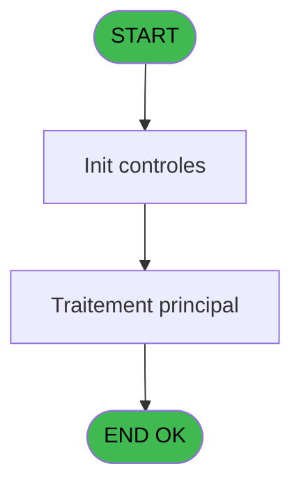
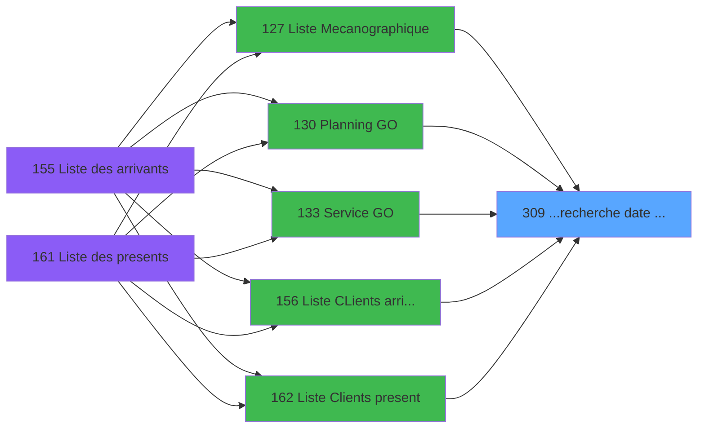

# PBP IDE 309 - ...recherche date minimum

> **Analyse**: Phases 1-4 2026-02-03 16:19 -> 16:19 (12s) | Assemblage 16:19
> **Pipeline**: V7.2 Enrichi
> **Structure**: 4 onglets (Resume | Ecrans | Donnees | Connexions)

<!-- TAB:Resume -->

## 1. FICHE D'IDENTITE

| Attribut | Valeur |
|----------|--------|
| Projet | PBP |
| IDE Position | 309 |
| Nom Programme | ...recherche date minimum |
| Fichier source | `Prg_309.xml` |
| Dossier IDE | Remplissage |
| Taches | 1 (0 ecrans visibles) |
| Tables modifiees | 0 |
| Programmes appeles | 0 |

## 2. DESCRIPTION FONCTIONNELLE

**...recherche date minimum** assure la gestion complete de ce processus, accessible depuis [Service GO (IDE 133)](PBP-IDE-133.md), [Liste Mecanographique (IDE 127)](PBP-IDE-127.md), [Planning GO (IDE 130)](PBP-IDE-130.md), [  Liste CLients arrivant (IDE 156)](PBP-IDE-156.md), [  Liste Clients present (IDE 162)](PBP-IDE-162.md), [  Liste CLients depart (IDE 168)](PBP-IDE-168.md), [Liste CLients AVPBDR (IDE 174)](PBP-IDE-174.md), [Liste depart circuit (IDE 191)](PBP-IDE-191.md), [  Liste present personnel plan (IDE 227)](PBP-IDE-227.md), [  Liste personnels AVPBDR (IDE 234)](PBP-IDE-234.md), [  Liste logement PASDL (IDE 258)](PBP-IDE-258.md).

Le flux de traitement s'organise en **1 blocs fonctionnels** :

- **Consultation** (1 tache) : ecrans de recherche, selection et consultation

## 3. BLOCS FONCTIONNELS

### 3.1 Consultation (1 tache)

Ecrans de recherche et consultation.

---

#### 309 - ...recherche date minimum

**Role** : Traitement : ...recherche date minimum.
**Variables liees** : B (> date minimum)

## 5. REGLES METIER

*(Aucune regle metier identifiee)*

## 6. CONTEXTE

- **Appele par**: [Service GO (IDE 133)](PBP-IDE-133.md), [Liste Mecanographique (IDE 127)](PBP-IDE-127.md), [Planning GO (IDE 130)](PBP-IDE-130.md), [  Liste CLients arrivant (IDE 156)](PBP-IDE-156.md), [  Liste Clients present (IDE 162)](PBP-IDE-162.md), [  Liste CLients depart (IDE 168)](PBP-IDE-168.md), [Liste CLients AVPBDR (IDE 174)](PBP-IDE-174.md), [Liste depart circuit (IDE 191)](PBP-IDE-191.md), [  Liste present personnel plan (IDE 227)](PBP-IDE-227.md), [  Liste personnels AVPBDR (IDE 234)](PBP-IDE-234.md), [  Liste logement PASDL (IDE 258)](PBP-IDE-258.md)
- **Appelle**: 0 programmes | **Tables**: 1 (W:0 R:1 L:0) | **Taches**: 1 | **Expressions**: 2

<!-- TAB:Ecrans -->

## 8. ECRANS

*(Programme sans ecran visible)*

## 9. NAVIGATION

### 9.3 Structure hierarchique (1 tache)

| Position | Tache | Type | Dimensions | Bloc |
|----------|-------|------|------------|------|
| **309.1** | [**...recherche date minimum** (309)](#t1) | MDI | - | Consultation |

### 9.4 Algorigramme

> **Legende**: Vert = START/END OK | Rouge = END KO | Bleu = Decisions
> *Algorigramme auto-genere. Utiliser `/algorigramme` pour une synthese metier detaillee.*

<!-- TAB:Donnees -->

## 10. TABLES

### Tables utilisees (1)

| ID | Nom | Description | Type | R | W | L | Usages |
|----|-----|-------------|------|---|---|---|--------|
| 71 | derniere_purge___pur |  | DB | R |   |   | 1 |

### Colonnes par table (1 / 1 tables avec colonnes identifiees)

Table 71 - derniere_purge___pur (R) - 1 usages

| Lettre | Variable | Acces | Type |
|--------|----------|-------|------|
| A | >CodeSociete | R | Alpha |
| B | > date minimum | R | Date |

## 11. VARIABLES

### 11.1 Autres (2)

Variables diverses.

| Lettre | Nom | Type | Usage dans |
|--------|-----|------|-----------|
| A | >CodeSociete | Alpha | 1x refs |
| B | > date minimum | Date | - |

## 12. EXPRESSIONS

**2 / 2 expressions decodees (100%)**

### 12.1 Repartition par type

| Type | Expressions | Regles |
|------|-------------|--------|
| OTHER | 1 | 0 |
| CONDITION | 1 | 0 |

### 12.2 Expressions cles par type

#### OTHER (1 expressions)

| Type | IDE | Expression | Regle |
|------|-----|------------|-------|
| OTHER | 1 | `[D]` | - |

#### CONDITION (1 expressions)

| Type | IDE | Expression | Regle |
|------|-----|------------|-------|
| CONDITION | 2 | `>CodeSociete [A]` | - |

<!-- TAB:Connexions -->

## 13. GRAPHE D'APPELS

### 13.1 Chaine depuis Main (Callers)

Main -> ... -> [Service GO (IDE 133)](PBP-IDE-133.md) -> **...recherche date minimum (IDE 309)**

Main -> ... -> [Liste Mecanographique (IDE 127)](PBP-IDE-127.md) -> **...recherche date minimum (IDE 309)**

Main -> ... -> [Planning GO (IDE 130)](PBP-IDE-130.md) -> **...recherche date minimum (IDE 309)**

Main -> ... -> [  Liste CLients arrivant (IDE 156)](PBP-IDE-156.md) -> **...recherche date minimum (IDE 309)**

Main -> ... -> [  Liste Clients present (IDE 162)](PBP-IDE-162.md) -> **...recherche date minimum (IDE 309)**

Main -> ... -> [  Liste CLients depart (IDE 168)](PBP-IDE-168.md) -> **...recherche date minimum (IDE 309)**

Main -> ... -> [Liste CLients AVPBDR (IDE 174)](PBP-IDE-174.md) -> **...recherche date minimum (IDE 309)**

Main -> ... -> [Liste depart circuit (IDE 191)](PBP-IDE-191.md) -> **...recherche date minimum (IDE 309)**

Main -> ... -> [  Liste present personnel plan (IDE 227)](PBP-IDE-227.md) -> **...recherche date minimum (IDE 309)**

Main -> ... -> [  Liste personnels AVPBDR (IDE 234)](PBP-IDE-234.md) -> **...recherche date minimum (IDE 309)**

Main -> ... -> [  Liste logement PASDL (IDE 258)](PBP-IDE-258.md) -> **...recherche date minimum (IDE 309)**

### 13.2 Callers

| IDE | Nom Programme | Nb Appels |
|-----|---------------|-----------|
| [133](PBP-IDE-133.md) | Service GO | 2 |
| [127](PBP-IDE-127.md) | Liste Mecanographique | 1 |
| [130](PBP-IDE-130.md) | Planning GO | 1 |
| [156](PBP-IDE-156.md) |   Liste CLients arrivant | 1 |
| [162](PBP-IDE-162.md) |   Liste Clients present | 1 |
| [168](PBP-IDE-168.md) |   Liste CLients depart | 1 |
| [174](PBP-IDE-174.md) | Liste CLients AVPBDR | 1 |
| [191](PBP-IDE-191.md) | Liste depart circuit | 1 |
| [227](PBP-IDE-227.md) |   Liste present personnel plan | 1 |
| [234](PBP-IDE-234.md) |   Liste personnels AVPBDR | 1 |
| [258](PBP-IDE-258.md) |   Liste logement PASDL | 1 |

### 13.3 Callees (programmes appeles)

### 13.4 Detail Callees avec contexte

| IDE | Nom Programme | Appels | Contexte |
|-----|---------------|--------|----------|
| - | (aucun) | - | - |

## 14. RECOMMANDATIONS MIGRATION

### 14.1 Profil du programme

| Metrique | Valeur | Impact migration |
|----------|--------|-----------------|
| Lignes de logique | 7 | Programme compact |
| Expressions | 2 | Peu de logique |
| Tables WRITE | 0 | Impact faible |
| Sous-programmes | 0 | Peu de dependances |
| Ecrans visibles | 0 | Ecran unique ou traitement batch |
| Code desactive | 0% (0 / 7) | Code sain |
| Regles metier | 0 | Pas de regle identifiee |

### 14.2 Plan de migration par bloc

#### Consultation (1 tache: 0 ecran, 1 traitement)

- **Strategie** : Composants de recherche/selection en modales.

### 14.3 Dependances critiques

| Dependance | Type | Appels | Impact |
|------------|------|--------|--------|

---
*Spec DETAILED generee par Pipeline V7.2 - 2026-02-03 16:20*
