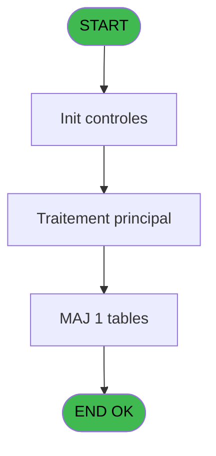
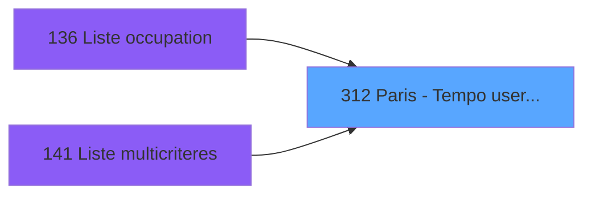

# PBP IDE 312 - Paris -> Tempo userlist

> **Analyse**: Phases 1-4 2026-02-03 16:20 -> 16:21 (16s) | Assemblage 16:21
> **Pipeline**: V7.2 Enrichi
> **Structure**: 4 onglets (Resume | Ecrans | Donnees | Connexions)

<!-- TAB:Resume -->

## 1. FICHE D'IDENTITE

| Attribut | Valeur |
|----------|--------|
| Projet | PBP |
| IDE Position | 312 |
| Nom Programme | Paris -> Tempo userlist |
| Fichier source | `Prg_312.xml` |
| Dossier IDE | Remplissage |
| Taches | 2 (0 ecrans visibles) |
| Tables modifiees | 1 |
| Programmes appeles | 0 |

## 2. DESCRIPTION FONCTIONNELLE

**Paris -> Tempo userlist** assure la gestion complete de ce processus, accessible depuis [Liste occupation (IDE 136)](PBP-IDE-136.md), [Liste multicriteres (IDE 141)](PBP-IDE-141.md).

Le flux de traitement s'organise en **1 blocs fonctionnels** :

- **Traitement** (2 taches) : traitements metier divers

**Donnees modifiees** : 1 tables en ecriture (tempo_zone_secteur).

## 3. BLOCS FONCTIONNELS

### 3.1 Traitement (2 taches)

Traitements internes.

---

#### 312 - Veuillez patienter ... [[ECRAN]](#ecran-t1)

**Role** : Traitement : Veuillez patienter ....
**Ecran** : 424 x 56 DLU (MDI) | [Voir mockup](#ecran-t1)

---

#### 312.1 - Mise à jour temporaire

**Role** : Traitement : Mise à jour temporaire.

## 5. REGLES METIER

*(Aucune regle metier identifiee)*

## 6. CONTEXTE

- **Appele par**: [Liste occupation (IDE 136)](PBP-IDE-136.md), [Liste multicriteres (IDE 141)](PBP-IDE-141.md)
- **Appelle**: 0 programmes | **Tables**: 2 (W:1 R:1 L:1) | **Taches**: 2 | **Expressions**: 4

<!-- TAB:Ecrans -->

## 8. ECRANS

*(Programme sans ecran visible)*

## 9. NAVIGATION

### 9.3 Structure hierarchique (2 taches)

| Position | Tache | Type | Dimensions | Bloc |
|----------|-------|------|------------|------|
| **312.1** | [**Veuillez patienter ...** (312)](#t1) [mockup](#ecran-t1) | MDI | 424x56 | Traitement |
| 312.1.1 | [Mise à jour temporaire (312.1)](#t2) | MDI | - | |

### 9.4 Algorigramme

> **Legende**: Vert = START/END OK | Rouge = END KO | Bleu = Decisions
> *Algorigramme auto-genere. Utiliser `/algorigramme` pour une synthese metier detaillee.*

<!-- TAB:Donnees -->

## 10. TABLES

### Tables utilisees (2)

| ID | Nom | Description | Type | R | W | L | Usages |
|----|-----|-------------|------|---|---|---|--------|
| 112 | tables_paris |  | DB | R |   |   | 1 |
| 637 | tempo_zone_secteur | Table temporaire ecran | DB |   | **W** | L | 2 |

### Colonnes par table (1 / 2 tables avec colonnes identifiees)

Table 112 - tables_paris (R) - 1 usages

| Lettre | Variable | Acces | Type |
|--------|----------|-------|------|
| A | >Categoorie | R | Alpha |
| B | >NomTable | R | Alpha |
| C | >CodeLangue | R | Alpha |

Table 637 - tempo_zone_secteur (**W**/L) - 2 usages

*Table utilisee uniquement en Link ou aucune colonne Real identifiee dans le DataView.*

## 11. VARIABLES

### 11.1 Autres (3)

Variables diverses.

| Lettre | Nom | Type | Usage dans |
|--------|-----|------|-----------|
| A | >Categoorie | Alpha | 2x refs |
| B | >NomTable | Alpha | 3x refs |
| C | >CodeLangue | Alpha | 1x refs |

## 12. EXPRESSIONS

**4 / 4 expressions decodees (100%)**

### 12.1 Repartition par type

| Type | Expressions | Regles |
|------|-------------|--------|
| CONDITION | 4 | 0 |

### 12.2 Expressions cles par type

#### CONDITION (4 expressions)

| Type | IDE | Expression | Regle |
|------|-----|------------|-------|
| CONDITION | 3 | `>NomTable [B]='TMIVI' AND >Categoorie [A]='M' AND [F]<>'01' OR >NomTable [B]<>'TMIVI'` | - |
| CONDITION | 4 | `>NomTable [B]='TMIVI' AND >Categoorie [A]='M' AND [F]<>'08' OR >NomTable [B]<>'TMIVI'` | - |
| CONDITION | 1 | `>NomTable [B]` | - |
| CONDITION | 2 | `CndRange (>CodeLangue [C]>'',>CodeLangue [C])` | - |

<!-- TAB:Connexions -->

## 13. GRAPHE D'APPELS

### 13.1 Chaine depuis Main (Callers)

Main -> ... -> [Liste occupation (IDE 136)](PBP-IDE-136.md) -> **Paris -> Tempo userlist (IDE 312)**

Main -> ... -> [Liste multicriteres (IDE 141)](PBP-IDE-141.md) -> **Paris -> Tempo userlist (IDE 312)**

### 13.2 Callers

| IDE | Nom Programme | Nb Appels |
|-----|---------------|-----------|
| [136](PBP-IDE-136.md) | Liste occupation | 6 |
| [141](PBP-IDE-141.md) | Liste multicriteres | 4 |

### 13.3 Callees (programmes appeles)

### 13.4 Detail Callees avec contexte

| IDE | Nom Programme | Appels | Contexte |
|-----|---------------|--------|----------|
| - | (aucun) | - | - |

## 14. RECOMMANDATIONS MIGRATION

### 14.1 Profil du programme

| Metrique | Valeur | Impact migration |
|----------|--------|-----------------|
| Lignes de logique | 27 | Programme compact |
| Expressions | 4 | Peu de logique |
| Tables WRITE | 1 | Impact faible |
| Sous-programmes | 0 | Peu de dependances |
| Ecrans visibles | 0 | Ecran unique ou traitement batch |
| Code desactive | 0% (0 / 27) | Code sain |
| Regles metier | 0 | Pas de regle identifiee |

### 14.2 Plan de migration par bloc

#### Traitement (2 taches: 1 ecran, 1 traitement)

- **Strategie** : Orchestrateur avec 1 ecrans (Razor/React) et 1 traitements backend (services).
- Les ecrans deviennent des composants UI, les traitements invisibles deviennent des services injectables.
- Decomposer les taches en services unitaires testables.

### 14.3 Dependances critiques

| Dependance | Type | Appels | Impact |
|------------|------|--------|--------|
| tempo_zone_secteur | Table WRITE (Database) | 1x | Schema + repository |

---
*Spec DETAILED generee par Pipeline V7.2 - 2026-02-03 16:21*
