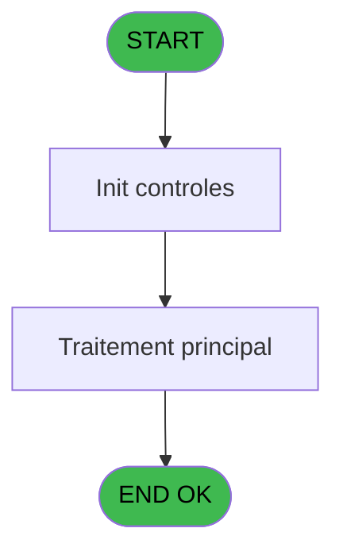
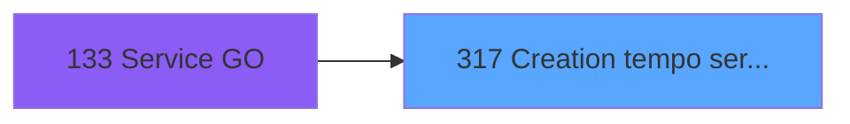

# PBP IDE 317 - Creation tempo service

> **Analyse**: Phases 1-4 2026-02-03 16:23 -> 16:23 (14s) | Assemblage 16:23
> **Pipeline**: V7.2 Enrichi
> **Structure**: 4 onglets (Resume | Ecrans | Donnees | Connexions)

<!-- TAB:Resume -->

## 1. FICHE D'IDENTITE

| Attribut | Valeur |
|----------|--------|
| Projet | PBP |
| IDE Position | 317 |
| Nom Programme | Creation tempo service |
| Fichier source | `Prg_317.xml` |
| Dossier IDE | Remplissage |
| Taches | 1 (0 ecrans visibles) |
| Tables modifiees | 0 |
| Programmes appeles | 0 |

## 2. DESCRIPTION FONCTIONNELLE

**Creation tempo service** assure la gestion complete de ce processus, accessible depuis [Service GO (IDE 133)](PBP-IDE-133.md).

Le flux de traitement s'organise en **1 blocs fonctionnels** :

- **Creation** (1 tache) : insertion d'enregistrements en base (mouvements, prestations)

**Logique metier** : 3 regles identifiees couvrant conditions metier.

## 3. BLOCS FONCTIONNELS

### 3.1 Creation (1 tache)

Insertion de nouveaux enregistrements en base.

---

#### 317 - Creation tempo service

**Role** : Creation d'enregistrement : Creation tempo service.

## 5. REGLES METIER

3 regles identifiees:

### Autres (3 regles)

#### [RM-001] Si [X] AND [AI]='P' AND [Y] alors GetParam ('SOCIETE') sinon '')

| Element | Detail |
|---------|--------|
| **Condition** | `[X] AND [AI]='P' AND [Y]` |
| **Si vrai** | GetParam ('SOCIETE') |
| **Si faux** | '') |
| **Expression source** | Expression 8 : `IF ([X] AND [AI]='P' AND [Y],GetParam ('SOCIETE'),'')` |
| **Exemple** | Si [X] AND [AI]='P' AND [Y] → GetParam ('SOCIETE'). Sinon → '') |

#### [RM-002] Si [K]='F' alors 'Me' sinon 'M')

| Element | Detail |
|---------|--------|
| **Condition** | `[K]='F'` |
| **Si vrai** | 'Me' |
| **Si faux** | 'M') |
| **Expression source** | Expression 15 : `IF ([K]='F','Me','M')` |
| **Exemple** | Si [K]='F' → 'Me'. Sinon → 'M') |

#### [RM-003] Si [L]>0 alors [M] sinon 0)

| Element | Detail |
|---------|--------|
| **Condition** | `[L]>0` |
| **Si vrai** | [M] |
| **Si faux** | 0) |
| **Expression source** | Expression 18 : `IF ([L]>0,[M],0)` |
| **Exemple** | Si [L]>0 → [M]. Sinon → 0) |

## 6. CONTEXTE

- **Appele par**: [Service GO (IDE 133)](PBP-IDE-133.md)
- **Appelle**: 0 programmes | **Tables**: 6 (W:0 R:1 L:5) | **Taches**: 1 | **Expressions**: 30

<!-- TAB:Ecrans -->

## 8. ECRANS

*(Programme sans ecran visible)*

## 9. NAVIGATION

### 9.3 Structure hierarchique (1 tache)

| Position | Tache | Type | Dimensions | Bloc |
|----------|-------|------|------------|------|
| **317.1** | [**Creation tempo service** (317)](#t1) | MDI | - | Creation |

### 9.4 Algorigramme

> **Legende**: Vert = START/END OK | Rouge = END KO | Bleu = Decisions
> *Algorigramme auto-genere. Utiliser `/algorigramme` pour une synthese metier detaillee.*

<!-- TAB:Donnees -->

## 10. TABLES

### Tables utilisees (6)

| ID | Nom | Description | Type | R | W | L | Usages |
|----|-----|-------------|------|---|---|---|--------|
| 34 | hebergement______heb | Hebergement (chambres) | DB | R |   |   | 1 |
| 35 | personnel_go______go |  | DB |   |   | L | 1 |
| 104 | fichier_menage |  | DB |   |   | L | 1 |
| 598 | tempo_ecr_previsions | Table temporaire ecran | TMP |   |   | L | 1 |
| 620 | zip_chambre |  | TMP |   |   | L | 1 |
| 637 | tempo_zone_secteur | Table temporaire ecran | DB |   |   | L | 1 |

### Colonnes par table (1 / 1 tables avec colonnes identifiees)

Table 34 - hebergement______heb (R) - 1 usages

| Lettre | Variable | Acces | Type |
|--------|----------|-------|------|
| A | >DateCalcul | R | Date |
| B | >Categorie(TUL) | R | Alpha |
| C | >NomTable(TUL) | R | Alpha |
| D | >Total | R | Numeric |
| E | >NbSelect | R | Numeric |
| F | w0_RetPresent | R | Logical |

## 11. VARIABLES

### 11.1 Autres (6)

Variables diverses.

| Lettre | Nom | Type | Usage dans |
|--------|-----|------|-----------|
| A | >DateCalcul | Date | 1x refs |
| B | >Categorie(TUL) | Alpha | 1x refs |
| C | >NomTable(TUL) | Alpha | 1x refs |
| D | >Total | Numeric | 1x refs |
| E | >NbSelect | Numeric | 1x refs |
| F | w0_RetPresent | Logical | - |

## 12. EXPRESSIONS

**30 / 30 expressions decodees (100%)**

### 12.1 Repartition par type

| Type | Expressions | Regles |
|------|-------------|--------|
| CONDITION | 12 | 3 |
| CALCULATION | 1 | 0 |
| CONSTANTE | 1 | 0 |
| OTHER | 14 | 0 |
| REFERENCE_VG | 1 | 0 |
| CONCATENATION | 1 | 0 |

### 12.2 Expressions cles par type

#### CONDITION (12 expressions)

| Type | IDE | Expression | Regle |
|------|-----|------------|-------|
| CONDITION | 8 | `IF ([X] AND [AI]='P' AND [Y],GetParam ('SOCIETE'),'')` | [RM-001](#rm-RM-001) |
| CONDITION | 18 | `IF ([L]>0,[M],0)` | [RM-003](#rm-RM-003) |
| CONDITION | 15 | `IF ([K]='F','Me','M')` | [RM-002](#rm-RM-002) |
| CONDITION | 30 | `[X] AND [AI]='P' AND [Y]` | - |
| CONDITION | 5 | `>Categorie(TUL) [B]` | - |
| ... | | *+7 autres* | |

#### CALCULATION (1 expressions)

| Type | IDE | Expression | Regle |
|------|-----|------------|-------|
| CALCULATION | 29 | `[BT]+1` | - |

#### CONSTANTE (1 expressions)

| Type | IDE | Expression | Regle |
|------|-----|------------|-------|
| CONSTANTE | 14 | `'H'` | - |

#### OTHER (14 expressions)

| Type | IDE | Expression | Regle |
|------|-----|------------|-------|
| OTHER | 23 | `[P]` | - |
| OTHER | 22 | `[N]` | - |
| OTHER | 21 | `Fix ([AY],4,0)` | - |
| OTHER | 24 | `[AM]` | - |
| OTHER | 27 | `[AV]` | - |
| ... | | *+9 autres* | |

#### REFERENCE_VG (1 expressions)

| Type | IDE | Expression | Regle |
|------|-----|------------|-------|
| REFERENCE_VG | 4 | `VG1` | - |

#### CONCATENATION (1 expressions)

| Type | IDE | Expression | Regle |
|------|-----|------------|-------|
| CONCATENATION | 17 | `MID ([W],1,2)&'   '&Left ([AF],3)&[AG]` | - |

### 12.3 Toutes les expressions (30)

Voir les 30 expressions

#### CONDITION (12)

| IDE | Expression Decodee |
|-----|-------------------|
| 9 | `>Total [D]+1` |
| 28 | `>NbSelect [E]+1` |
| 8 | `IF ([X] AND [AI]='P' AND [Y],GetParam ('SOCIETE'),'')` |
| 10 | `IF ([X] AND [AI]='P' AND [Y],VG1,'')` |
| 11 | `IF ([X] AND [AI]='P' AND [Y],[I],'')` |
| 12 | `IF ([X] AND [AI]='P' AND [Y],[J],'')` |
| 15 | `IF ([K]='F','Me','M')` |
| 18 | `IF ([L]>0,[M],0)` |
| 5 | `>Categorie(TUL) [B]` |
| 6 | `>NomTable(TUL) [C]` |
| 13 | `>DateCalcul [A]` |
| 30 | `[X] AND [AI]='P' AND [Y]` |

#### CALCULATION (1)

| IDE | Expression Decodee |
|-----|-------------------|
| 29 | `[BT]+1` |

#### CONSTANTE (1)

| IDE | Expression Decodee |
|-----|-------------------|
| 14 | `'H'` |

#### OTHER (14)

| IDE | Expression Decodee |
|-----|-------------------|
| 1 | `GetParam ('SOCIETE')` |
| 2 | `[G]` |
| 3 | `[H]` |
| 7 | `[Q]` |
| 16 | `Left ([AF],3)&[AG]` |
| 19 | `[L]` |
| 20 | `[AH]` |
| 21 | `Fix ([AY],4,0)` |
| 22 | `[N]` |
| 23 | `[P]` |
| 24 | `[AM]` |
| 25 | `[AN]` |
| 26 | `[AU]` |
| 27 | `[AV]` |

#### REFERENCE_VG (1)

| IDE | Expression Decodee |
|-----|-------------------|
| 4 | `VG1` |

#### CONCATENATION (1)

| IDE | Expression Decodee |
|-----|-------------------|
| 17 | `MID ([W],1,2)&'   '&Left ([AF],3)&[AG]` |

<!-- TAB:Connexions -->

## 13. GRAPHE D'APPELS

### 13.1 Chaine depuis Main (Callers)

Main -> ... -> [Service GO (IDE 133)](PBP-IDE-133.md) -> **Creation tempo service (IDE 317)**

### 13.2 Callers

| IDE | Nom Programme | Nb Appels |
|-----|---------------|-----------|
| [133](PBP-IDE-133.md) | Service GO | 2 |

### 13.3 Callees (programmes appeles)

### 13.4 Detail Callees avec contexte

| IDE | Nom Programme | Appels | Contexte |
|-----|---------------|--------|----------|
| - | (aucun) | - | - |

## 14. RECOMMANDATIONS MIGRATION

### 14.1 Profil du programme

| Metrique | Valeur | Impact migration |
|----------|--------|-----------------|
| Lignes de logique | 103 | Programme compact |
| Expressions | 30 | Peu de logique |
| Tables WRITE | 0 | Impact faible |
| Sous-programmes | 0 | Peu de dependances |
| Ecrans visibles | 0 | Ecran unique ou traitement batch |
| Code desactive | 0% (0 / 103) | Code sain |
| Regles metier | 3 | Quelques regles a preserver |

### 14.2 Plan de migration par bloc

#### Creation (1 tache: 0 ecran, 1 traitement)

- **Strategie** : Repository pattern avec Entity Framework Core.
- Insertion via `IRepository<T>.CreateAsync()`

### 14.3 Dependances critiques

| Dependance | Type | Appels | Impact |
|------------|------|--------|--------|

---
*Spec DETAILED generee par Pipeline V7.2 - 2026-02-03 16:23*
