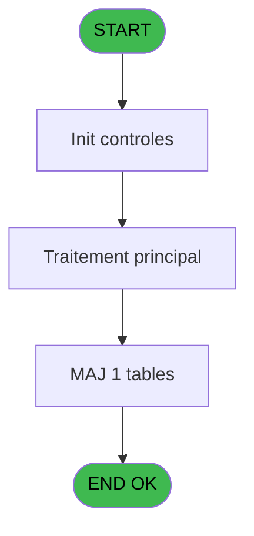
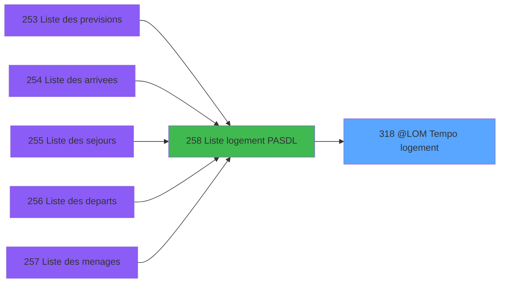

# PBP IDE 318 - @LOM > Tempo logement

> **Analyse**: Phases 1-4 2026-02-03 16:23 -> 16:23 (13s) | Assemblage 16:23
> **Pipeline**: V7.2 Enrichi
> **Structure**: 4 onglets (Resume | Ecrans | Donnees | Connexions)

<!-- TAB:Resume -->

## 1. FICHE D'IDENTITE

| Attribut | Valeur |
|----------|--------|
| Projet | PBP |
| IDE Position | 318 |
| Nom Programme | @LOM > Tempo logement |
| Fichier source | `Prg_318.xml` |
| Dossier IDE | Remplissage |
| Taches | 3 (1 ecrans visibles) |
| Tables modifiees | 1 |
| Programmes appeles | 1 |

## 2. DESCRIPTION FONCTIONNELLE

**@LOM > Tempo logement** assure la gestion complete de ce processus, accessible depuis [  Liste logement PASDL (IDE 258)](PBP-IDE-258.md).

Le flux de traitement s'organise en **2 blocs fonctionnels** :

- **Traitement** (2 taches) : traitements metier divers
- **Creation** (1 tache) : insertion d'enregistrements en base (mouvements, prestations)

**Donnees modifiees** : 1 tables en ecriture (tempo_synthese).

**Logique metier** : 1 regles identifiees couvrant conditions metier.

Detail : phases du traitement

#### Phase 1 : Traitement (2 taches)

- **318** - Veuillez patienter ... **[[ECRAN]](#ecran-t1)**
- **318.1** - Lecture hebergement

#### Phase 2 : Creation (1 tache)

- **318.1.1** - Creation

#### Tables impactees

| Table | Operations | Role metier |
|-------|-----------|-------------|
| tempo_synthese | **W**/L (2 usages) | Table temporaire ecran |

## 3. BLOCS FONCTIONNELS

### 3.1 Traitement (2 taches)

Traitements internes.

---

#### 318 - Veuillez patienter ... [[ECRAN]](#ecran-t1)

**Role** : Traitement : Veuillez patienter ....
**Ecran** : 424 x 56 DLU (MDI) | [Voir mockup](#ecran-t1)

---

#### 318.1 - Lecture hebergement

**Role** : Traitement : Lecture hebergement.

### 3.2 Creation (1 tache)

Insertion de nouveaux enregistrements en base.

---

#### 318.1.1 - Creation

**Role** : Creation d'enregistrement : Creation.

## 5. REGLES METIER

1 regles identifiees:

### Autres (1 regles)

#### [RM-001] Si >Zone/Secteur [A]='Z' alors 2 sinon 3)

| Element | Detail |
|---------|--------|
| **Condition** | `>Zone/Secteur [A]='Z'` |
| **Si vrai** | 2 |
| **Si faux** | 3) |
| **Variables** | A (>Zone/Secteur) |
| **Expression source** | Expression 1 : `IF (>Zone/Secteur [A]='Z',2,3)` |
| **Exemple** | Si >Zone/Secteur [A]='Z' → 2. Sinon → 3) |

## 6. CONTEXTE

- **Appele par**: [  Liste logement PASDL (IDE 258)](PBP-IDE-258.md)
- **Appelle**: 1 programmes | **Tables**: 14 (W:1 R:2 L:12) | **Taches**: 3 | **Expressions**: 21

<!-- TAB:Ecrans -->

## 8. ECRANS

### 8.1 Forms visibles (1 / 3)

| # | Position | Tache | Nom | Type | Largeur | Hauteur | Bloc |
|---|----------|-------|-----|------|---------|---------|------|
| 1 | 318 | 318 | Veuillez patienter ... | MDI | 424 | 56 | Traitement |

### 8.2 Mockups Ecrans

---

#### 318 - Veuillez patienter ...
**Tache** : [318](#t1) | **Type** : MDI | **Dimensions** : 424 x 56 DLU
**Bloc** : Traitement | **Titre IDE** : Veuillez patienter ...

<!-- FORM-DATA:
{
    "width":  424,
    "vFactor":  8,
    "type":  "MDI",
    "hFactor":  8,
    "controls":  [
                     {
                         "x":  0,
                         "type":  "label",
                         "var":  "",
                         "y":  0,
                         "w":  423,
                         "fmt":  "",
                         "name":  "",
                         "h":  29,
                         "color":  "",
                         "text":  "",
                         "parent":  null
                     },
                     {
                         "x":  120,
                         "type":  "label",
                         "var":  "",
                         "y":  10,
                         "w":  221,
                         "fmt":  "",
                         "name":  "",
                         "h":  8,
                         "color":  "7",
                         "text":  "Traitement en cours ...",
                         "parent":  null
                     },
                     {
                         "x":  0,
                         "type":  "label",
                         "var":  "",
                         "y":  29,
                         "w":  423,
                         "fmt":  "",
                         "name":  "",
                         "h":  27,
                         "color":  "",
                         "text":  "",
                         "parent":  null
                     },
                     {
                         "x":  110,
                         "type":  "label",
                         "var":  "",
                         "y":  32,
                         "w":  114,
                         "fmt":  "",
                         "name":  "",
                         "h":  8,
                         "color":  "",
                         "text":  "Analyses :",
                         "parent":  4
                     },
                     {
                         "x":  110,
                         "type":  "label",
                         "var":  "",
                         "y":  44,
                         "w":  139,
                         "fmt":  "",
                         "name":  "",
                         "h":  8,
                         "color":  "",
                         "text":  "Selectiones :",
                         "parent":  4
                     },
                     {
                         "x":  259,
                         "type":  "edit",
                         "var":  "",
                         "y":  32,
                         "w":  56,
                         "fmt":  "",
                         "name":  "",
                         "h":  9,
                         "color":  "",
                         "text":  "",
                         "parent":  4
                     },
                     {
                         "x":  259,
                         "type":  "edit",
                         "var":  "",
                         "y":  44,
                         "w":  56,
                         "fmt":  "",
                         "name":  "",
                         "h":  9,
                         "color":  "",
                         "text":  "",
                         "parent":  4
                     },
                     {
                         "x":  4,
                         "type":  "image",
                         "var":  "",
                         "y":  2,
                         "w":  72,
                         "fmt":  "",
                         "name":  "",
                         "h":  25,
                         "color":  "",
                         "text":  "",
                         "parent":  null
                     }
                 ],
    "taskId":  "318",
    "height":  56
}
-->

<strong>Champs : 2 champs</strong>

| Pos (x,y) | Nom | Variable | Type |
|-----------|-----|----------|------|
| 259,32 | (sans nom) | - | edit |
| 259,44 | (sans nom) | - | edit |

## 9. NAVIGATION

Ecran unique: **Veuillez patienter ...**

### 9.3 Structure hierarchique (3 taches)

| Position | Tache | Type | Dimensions | Bloc |
|----------|-------|------|------------|------|
| **318.1** | [**Veuillez patienter ...** (318)](#t1) [mockup](#ecran-t1) | MDI | 424x56 | Traitement |
| 318.1.1 | [Lecture hebergement (318.1)](#t2) | MDI | - | |
| **318.2** | [**Creation** (318.1.1)](#t3) | MDI | - | Creation |

### 9.4 Algorigramme

> **Legende**: Vert = START/END OK | Rouge = END KO | Bleu = Decisions
> *Algorigramme auto-genere. Utiliser `/algorigramme` pour une synthese metier detaillee.*

<!-- TAB:Donnees -->

## 10. TABLES

### Tables utilisees (14)

| ID | Nom | Description | Type | R | W | L | Usages |
|----|-----|-------------|------|---|---|---|--------|
| 34 | hebergement______heb | Hebergement (chambres) | DB | R |   |   | 1 |
| 35 | personnel_go______go |  | DB |   |   | L | 1 |
| 36 | client_gm |  | DB |   |   | L | 1 |
| 102 | logement_go______lop |  | DB | R |   |   | 1 |
| 103 | logement_client__loc |  | DB |   |   | L | 1 |
| 104 | fichier_menage |  | DB |   |   | L | 1 |
| 108 | code_logement____clo |  | DB |   |   | L | 1 |
| 112 | tables_paris |  | DB |   |   | L | 1 |
| 167 | troncon__________tro |  | DB |   |   | L | 1 |
| 358 | import_mod |  | DB |   |   | L | 1 |
| 616 | tempo_synthese | Table temporaire ecran | TMP |   | **W** | L | 2 |
| 637 | tempo_zone_secteur | Table temporaire ecran | DB |   |   | L | 1 |
| 806 | sale_channel |  | DB |   |   | L | 1 |
| 1032 | Table_1032 |  | MEM |   |   | L | 1 |

### Colonnes par table (9 / 3 tables avec colonnes identifiees)

Table 34 - hebergement______heb (R) - 1 usages

| Lettre | Variable | Acces | Type |
|--------|----------|-------|------|
| A | w1_CompteurClient | R | Numeric |
| B | w1_CompteurPerso | R | Numeric |
| C | RetHebAvant-------------------- | R | Logical |
| D | RetHebApres-------------------- | R | Logical |
| E | RetGM-------------------------- | R | Logical |
| F | RetGO-------------------------- | R | Logical |
| G | v.ret. facilitate your arrival | R | Logical |
| H | v.TronconRetour | R | Logical |
| I | v.DureeTransfert | R | Numeric |
| J | v.HeureArriveVlg | R | Time |
| K | CondDatePerso | R | Logical |
| L | CondDateClient | R | Logical |
| M | CondNumCompte | R | Logical |
| N | w1_NomLog | R | Alpha |
| O | w1_ChgtNom | R | Logical |

Table 102 - logement_go______lop (R) - 1 usages

| Lettre | Variable | Acces | Type |
|--------|----------|-------|------|
| A | >Zone/Secteur | R | Alpha |
| B | >DateCalcul | R | Date |
| C | >TypListe | R | Alpha |
| D | >Categorie | R | Alpha |
| E | >NomTable | R | Alpha |
| F | <Total | R | Numeric |
| G | <NbSelect | R | Numeric |
| H | < lieu de sejour | R | Alpha |
| I | < seminiare | R | Alpha |
| J | w0_Sequence | R | Numeric |
| K | w0_RetourTempo | R | Logical |
| L | w0_RetPersonnel | R | Logical |
| M | w0_RetClient | R | Logical |
| N | w0_AgeBebe | R | Numeric |
| O | w0_NomLog | R | Alpha |

Table 616 - tempo_synthese (**W**/L) - 2 usages

| Lettre | Variable | Acces | Type |
|--------|----------|-------|------|
| K | w0_RetourTempo | W | Logical |

## 11. VARIABLES

### 11.1 Autres (15)

Variables diverses.

| Lettre | Nom | Type | Usage dans |
|--------|-----|------|-----------|
| A | >Zone/Secteur | Alpha | 4x refs |
| B | >DateCalcul | Date | - |
| C | >TypListe | Alpha | - |
| D | >Categorie | Alpha | 1x refs |
| E | >NomTable | Alpha | 1x refs |
| F | <Total | Numeric | - |
| G | <NbSelect | Numeric | - |
| H | < lieu de sejour | Alpha | 1x refs |
| I | < seminiare | Alpha | - |
| J | w0_Sequence | Numeric | - |
| K | w0_RetourTempo | Logical | 1x refs |
| L | w0_RetPersonnel | Logical | 2x refs |
| M | w0_RetClient | Logical | 2x refs |
| N | w0_AgeBebe | Numeric | 2x refs |
| O | w0_NomLog | Alpha | 1x refs |

## 12. EXPRESSIONS

**21 / 21 expressions decodees (100%)**

### 12.1 Repartition par type

| Type | Expressions | Regles |
|------|-------------|--------|
| CONDITION | 7 | 5 |
| CONSTANTE | 2 | 0 |
| OTHER | 9 | 0 |
| REFERENCE_VG | 1 | 0 |
| CAST_LOGIQUE | 1 | 0 |
| FORMAT | 1 | 0 |

### 12.2 Expressions cles par type

#### CONDITION (7 expressions)

| Type | IDE | Expression | Regle |
|------|-----|------------|-------|
| CONDITION | 1 | `IF (>Zone/Secteur [A]='Z',2,3)` | [RM-001](#rm-RM-001) |
| CONDITION | 8 | `>NomTable [E]` | - |
| CONDITION | 10 | `>Zone/Secteur [A]=IF (>Zone/Secteur [A]='Z',Left (w0_RetPersonnel [L],1),Left (w0_AgeBebe [N],1))` | - |
| CONDITION | 15 | `< lieu de sejour [H]='' OR Trim (< lieu de sejour [H])=Trim ([AN]) OR [V]` | - |
| CONDITION | 9 | `IF (>Zone/Secteur [A]='Z',Right (w0_RetPersonnel [L],2),Right (w0_AgeBebe [N],2))` | - |
| ... | | *+2 autres* | |

#### CONSTANTE (2 expressions)

| Type | IDE | Expression | Regle |
|------|-----|------------|-------|
| CONSTANTE | 21 | `'VLOGE'` | - |
| CONSTANTE | 13 | `'VBEBE'` | - |

#### OTHER (9 expressions)

| Type | IDE | Expression | Regle |
|------|-----|------------|-------|
| OTHER | 17 | `[CM]` | - |
| OTHER | 16 | `[AN]` | - |
| OTHER | 20 | `[AF]` | - |
| OTHER | 18 | `GetParam ('LANGUE')` | - |
| OTHER | 14 | `w0_RetClient [M]` | - |
| ... | | *+4 autres* | |

#### REFERENCE_VG (1 expressions)

| Type | IDE | Expression | Regle |
|------|-----|------------|-------|
| REFERENCE_VG | 6 | `VG1` | - |

#### CAST_LOGIQUE (1 expressions)

| Type | IDE | Expression | Regle |
|------|-----|------------|-------|
| CAST_LOGIQUE | 11 | `'TRUE'LOG` | - |

#### FORMAT (1 expressions)

| Type | IDE | Expression | Regle |
|------|-----|------------|-------|
| FORMAT | 19 | `Str([CQ],'1')` | - |

### 12.3 Toutes les expressions (21)

Voir les 21 expressions

#### CONDITION (7)

| IDE | Expression Decodee |
|-----|-------------------|
| 1 | `IF (>Zone/Secteur [A]='Z',2,3)` |
| 9 | `IF (>Zone/Secteur [A]='Z',Right (w0_RetPersonnel [L],2),Right (w0_AgeBebe [N],2))` |
| 4 | `>Zone/Secteur [A]` |
| 7 | `>Categorie [D]` |
| 8 | `>NomTable [E]` |
| 10 | `>Zone/Secteur [A]=IF (>Zone/Secteur [A]='Z',Left (w0_RetPersonnel [L],1),Left (w0_AgeBebe [N],1))` |
| 15 | `< lieu de sejour [H]='' OR Trim (< lieu de sejour [H])=Trim ([AN]) OR [V]` |

#### CONSTANTE (2)

| IDE | Expression Decodee |
|-----|-------------------|
| 13 | `'VBEBE'` |
| 21 | `'VLOGE'` |

#### OTHER (9)

| IDE | Expression Decodee |
|-----|-------------------|
| 2 | `GetParam ('SOCIETE')` |
| 3 | `w0_RetourTempo [K]` |
| 5 | `w0_RetClient [M]` |
| 12 | `w0_NomLog [O]` |
| 14 | `w0_RetClient [M]` |
| 16 | `[AN]` |
| 17 | `[CM]` |
| 18 | `GetParam ('LANGUE')` |
| 20 | `[AF]` |

#### REFERENCE_VG (1)

| IDE | Expression Decodee |
|-----|-------------------|
| 6 | `VG1` |

#### CAST_LOGIQUE (1)

| IDE | Expression Decodee |
|-----|-------------------|
| 11 | `'TRUE'LOG` |

#### FORMAT (1)

| IDE | Expression Decodee |
|-----|-------------------|
| 19 | `Str([CQ],'1')` |

<!-- TAB:Connexions -->

## 13. GRAPHE D'APPELS

### 13.1 Chaine depuis Main (Callers)

Main -> ... -> [  Liste logement PASDL (IDE 258)](PBP-IDE-258.md) -> **@LOM > Tempo logement (IDE 318)**

### 13.2 Callers

| IDE | Nom Programme | Nb Appels |
|-----|---------------|-----------|
| [258](PBP-IDE-258.md) |   Liste logement PASDL | 2 |

### 13.3 Callees (programmes appeles)

### 13.4 Detail Callees avec contexte

| IDE | Nom Programme | Appels | Contexte |
|-----|---------------|--------|----------|
| [307](PBP-IDE-307.md) | Recherche age Bebe_Enfant | 1 | Sous-programme |

## 14. RECOMMANDATIONS MIGRATION

### 14.1 Profil du programme

| Metrique | Valeur | Impact migration |
|----------|--------|-----------------|
| Lignes de logique | 250 | Taille moyenne |
| Expressions | 21 | Peu de logique |
| Tables WRITE | 1 | Impact faible |
| Sous-programmes | 1 | Peu de dependances |
| Ecrans visibles | 1 | Ecran unique ou traitement batch |
| Code desactive | 0% (0 / 250) | Code sain |
| Regles metier | 1 | Quelques regles a preserver |

### 14.2 Plan de migration par bloc

#### Traitement (2 taches: 1 ecran, 1 traitement)

- **Strategie** : Orchestrateur avec 1 ecrans (Razor/React) et 1 traitements backend (services).
- Les ecrans deviennent des composants UI, les traitements invisibles deviennent des services injectables.
- 1 sous-programme(s) a migrer ou a reutiliser depuis les services existants.
- Decomposer les taches en services unitaires testables.

#### Creation (1 tache: 0 ecran, 1 traitement)

- **Strategie** : Repository pattern avec Entity Framework Core.
- Insertion via `IRepository<T>.CreateAsync()`

### 14.3 Dependances critiques

| Dependance | Type | Appels | Impact |
|------------|------|--------|--------|
| tempo_synthese | Table WRITE (Temp) | 1x | Schema + repository |
| [Recherche age Bebe_Enfant (IDE 307)](PBP-IDE-307.md) | Sous-programme | 1x | Normale - Sous-programme |

---
*Spec DETAILED generee par Pipeline V7.2 - 2026-02-03 16:23*
