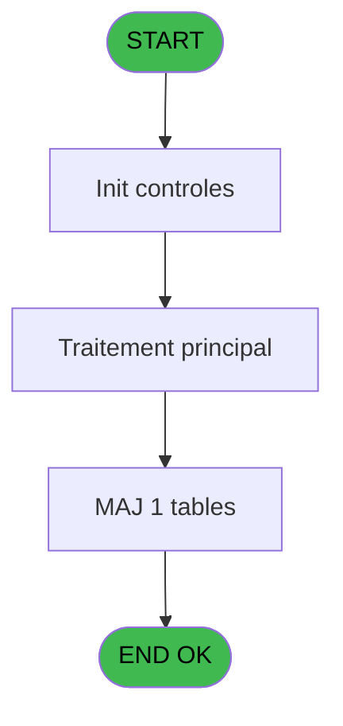
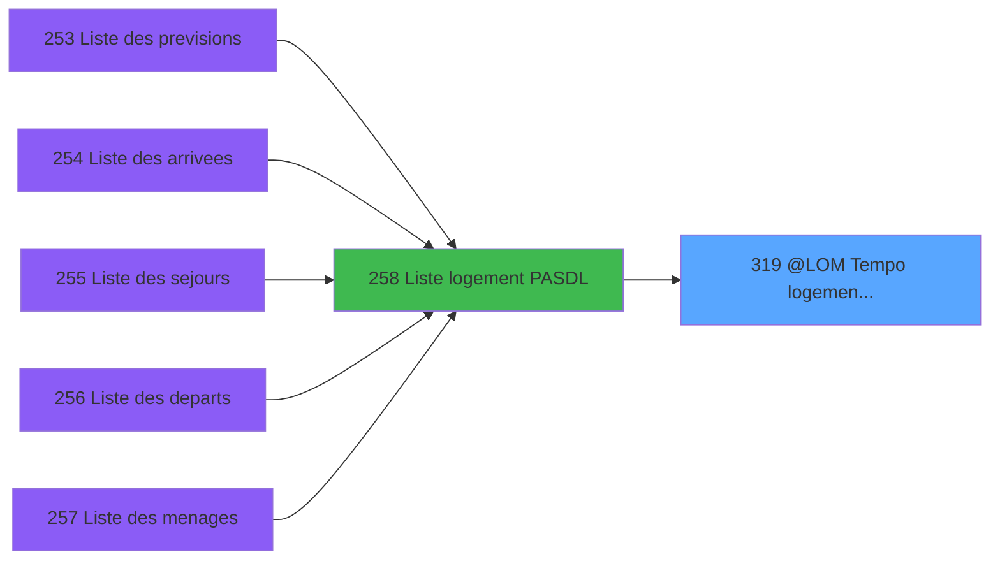

# PBP IDE 319 - @LOM > Tempo logement libe

> **Analyse**: Phases 1-4 2026-02-03 16:23 -> 16:23 (13s) | Assemblage 16:23
> **Pipeline**: V7.2 Enrichi
> **Structure**: 4 onglets (Resume | Ecrans | Donnees | Connexions)

<!-- TAB:Resume -->

## 1. FICHE D'IDENTITE

| Attribut | Valeur |
|----------|--------|
| Projet | PBP |
| IDE Position | 319 |
| Nom Programme | @LOM > Tempo logement libe |
| Fichier source | `Prg_319.xml` |
| Dossier IDE | Remplissage |
| Taches | 4 (1 ecrans visibles) |
| Tables modifiees | 1 |
| Programmes appeles | 1 |

## 2. DESCRIPTION FONCTIONNELLE

**@LOM > Tempo logement libe** assure la gestion complete de ce processus, accessible depuis [  Liste logement PASDL (IDE 258)](PBP-IDE-258.md).

Le flux de traitement s'organise en **1 blocs fonctionnels** :

- **Traitement** (4 taches) : traitements metier divers

**Donnees modifiees** : 1 tables en ecriture (hebergement______heb).

**Logique metier** : 1 regles identifiees couvrant conditions metier.

Detail : phases du traitement

#### Phase 1 : Traitement (4 taches)

- **319** - Veuillez patienter ... **[[ECRAN]](#ecran-t1)**
- **319.1** - Lecture hebergement
- **319.1.1** - Libe logement
- **319.1.2** - Efface bloquage

#### Tables impactees

| Table | Operations | Role metier |
|-------|-----------|-------------|
| hebergement______heb | R/**W** (3 usages) | Hebergement (chambres) |

## 3. BLOCS FONCTIONNELS

### 3.1 Traitement (4 taches)

Traitements internes.

---

#### 319 - Veuillez patienter ... [[ECRAN]](#ecran-t1)

**Role** : Traitement : Veuillez patienter ....
**Ecran** : 424 x 56 DLU (MDI) | [Voir mockup](#ecran-t1)

3 sous-taches directes

| Tache | Nom | Bloc |
|-------|-----|------|
| [319.1](#t2) | Lecture hebergement | Traitement |
| [319.1.1](#t3) | Libe logement | Traitement |
| [319.1.2](#t4) | Efface bloquage | Traitement |

---

#### 319.1 - Lecture hebergement

**Role** : Traitement : Lecture hebergement.

---

#### 319.1.1 - Libe logement

**Role** : Traitement : Libe logement.

---

#### 319.1.2 - Efface bloquage

**Role** : Traitement : Efface bloquage.

## 5. REGLES METIER

1 regles identifiees:

### Autres (1 regles)

#### [RM-001] Si >Zone/Secteur [A]='Z' alors 2 sinon 3)

| Element | Detail |
|---------|--------|
| **Condition** | `>Zone/Secteur [A]='Z'` |
| **Si vrai** | 2 |
| **Si faux** | 3) |
| **Variables** | A (>Zone/Secteur) |
| **Expression source** | Expression 1 : `IF (>Zone/Secteur [A]='Z',2,3)` |
| **Exemple** | Si >Zone/Secteur [A]='Z' → 2. Sinon → 3) |

## 6. CONTEXTE

- **Appele par**: [  Liste logement PASDL (IDE 258)](PBP-IDE-258.md)
- **Appelle**: 1 programmes | **Tables**: 9 (W:1 R:2 L:7) | **Taches**: 4 | **Expressions**: 13

<!-- TAB:Ecrans -->

## 8. ECRANS

### 8.1 Forms visibles (1 / 4)

| # | Position | Tache | Nom | Type | Largeur | Hauteur | Bloc |
|---|----------|-------|-----|------|---------|---------|------|
| 1 | 319 | 319 | Veuillez patienter ... | MDI | 424 | 56 | Traitement |

### 8.2 Mockups Ecrans

---

#### 319 - Veuillez patienter ...
**Tache** : [319](#t1) | **Type** : MDI | **Dimensions** : 424 x 56 DLU
**Bloc** : Traitement | **Titre IDE** : Veuillez patienter ...

<!-- FORM-DATA:
{
    "width":  424,
    "vFactor":  8,
    "type":  "MDI",
    "hFactor":  8,
    "controls":  [
                     {
                         "x":  0,
                         "type":  "label",
                         "var":  "",
                         "y":  0,
                         "w":  423,
                         "fmt":  "",
                         "name":  "",
                         "h":  29,
                         "color":  "",
                         "text":  "",
                         "parent":  null
                     },
                     {
                         "x":  120,
                         "type":  "label",
                         "var":  "",
                         "y":  10,
                         "w":  221,
                         "fmt":  "",
                         "name":  "",
                         "h":  8,
                         "color":  "7",
                         "text":  "Traitement en cours ...",
                         "parent":  null
                     },
                     {
                         "x":  0,
                         "type":  "label",
                         "var":  "",
                         "y":  29,
                         "w":  423,
                         "fmt":  "",
                         "name":  "",
                         "h":  27,
                         "color":  "",
                         "text":  "",
                         "parent":  null
                     },
                     {
                         "x":  103,
                         "type":  "label",
                         "var":  "",
                         "y":  31,
                         "w":  114,
                         "fmt":  "",
                         "name":  "",
                         "h":  8,
                         "color":  "",
                         "text":  "Analyses :",
                         "parent":  4
                     },
                     {
                         "x":  105,
                         "type":  "label",
                         "var":  "",
                         "y":  44,
                         "w":  150,
                         "fmt":  "",
                         "name":  "",
                         "h":  8,
                         "color":  "",
                         "text":  "Selectionnes :",
                         "parent":  4
                     },
                     {
                         "x":  265,
                         "type":  "edit",
                         "var":  "",
                         "y":  31,
                         "w":  56,
                         "fmt":  "",
                         "name":  "",
                         "h":  9,
                         "color":  "",
                         "text":  "",
                         "parent":  4
                     },
                     {
                         "x":  265,
                         "type":  "edit",
                         "var":  "",
                         "y":  44,
                         "w":  56,
                         "fmt":  "",
                         "name":  "",
                         "h":  9,
                         "color":  "",
                         "text":  "",
                         "parent":  4
                     },
                     {
                         "x":  4,
                         "type":  "image",
                         "var":  "",
                         "y":  2,
                         "w":  72,
                         "fmt":  "",
                         "name":  "",
                         "h":  25,
                         "color":  "",
                         "text":  "",
                         "parent":  null
                     }
                 ],
    "taskId":  "319",
    "height":  56
}
-->

<strong>Champs : 2 champs</strong>

| Pos (x,y) | Nom | Variable | Type |
|-----------|-----|----------|------|
| 265,31 | (sans nom) | - | edit |
| 265,44 | (sans nom) | - | edit |

## 9. NAVIGATION

Ecran unique: **Veuillez patienter ...**

### 9.3 Structure hierarchique (4 taches)

| Position | Tache | Type | Dimensions | Bloc |
|----------|-------|------|------------|------|
| **319.1** | [**Veuillez patienter ...** (319)](#t1) [mockup](#ecran-t1) | MDI | 424x56 | Traitement |
| 319.1.1 | [Lecture hebergement (319.1)](#t2) | MDI | - | |
| 319.1.2 | [Libe logement (319.1.1)](#t3) | MDI | - | |
| 319.1.3 | [Efface bloquage (319.1.2)](#t4) | MDI | - | |

### 9.4 Algorigramme

> **Legende**: Vert = START/END OK | Rouge = END KO | Bleu = Decisions
> *Algorigramme auto-genere. Utiliser `/algorigramme` pour une synthese metier detaillee.*

<!-- TAB:Donnees -->

## 10. TABLES

### Tables utilisees (9)

| ID | Nom | Description | Type | R | W | L | Usages |
|----|-----|-------------|------|---|---|---|--------|
| 34 | hebergement______heb | Hebergement (chambres) | DB | R | **W** |   | 3 |
| 35 | personnel_go______go |  | DB |   |   | L | 1 |
| 36 | client_gm |  | DB |   |   | L | 1 |
| 102 | logement_go______lop |  | DB | R |   |   | 1 |
| 103 | logement_client__loc |  | DB |   |   | L | 1 |
| 104 | fichier_menage |  | DB |   |   | L | 1 |
| 106 | logement_exterieurs |  | DB |   |   | L | 1 |
| 616 | tempo_synthese | Table temporaire ecran | TMP |   |   | L | 2 |
| 637 | tempo_zone_secteur | Table temporaire ecran | DB |   |   | L | 1 |

### Colonnes par table (7 / 2 tables avec colonnes identifiees)

Table 34 - hebergement______heb (R/**W**) - 3 usages

| Lettre | Variable | Acces | Type |
|--------|----------|-------|------|
| A | w1_CompteurClient | W | Numeric |
| B | w1_CompteurPerso | W | Numeric |
| C | RetGM-------------------------- | W | Logical |
| D | RetGO-------------------------- | W | Logical |
| E | CondDate | W | Logical |
| F | CondNumCompte | W | Logical |

Table 102 - logement_go______lop (R) - 1 usages

| Lettre | Variable | Acces | Type |
|--------|----------|-------|------|
| A | >Zone/Secteur | R | Alpha |
| B | >DateCalcul | R | Date |
| C | >HeureCalcul | R | Alpha |
| D | >TypListe | R | Alpha |
| E | >Categorie | R | Alpha |
| F | >NomTable | R | Alpha |
| G | <Total | R | Numeric |
| H | <Select | R | Numeric |
| I | < lieu de sejour | R | Alpha |
| J | w0_RetourTempo | R | Logical |
| K | w0_RetPersonnel | R | Logical |
| L | w0_RetClient | R | Logical |
| M | w0_RetExterieur | R | Logical |
| N | w0_AgeBebe | R | Numeric |
| O | w0_AgeEnfant | R | Numeric |

## 11. VARIABLES

### 11.1 Autres (15)

Variables diverses.

| Lettre | Nom | Type | Usage dans |
|--------|-----|------|-----------|
| A | >Zone/Secteur | Alpha | 3x refs |
| B | >DateCalcul | Date | - |
| C | >HeureCalcul | Alpha | - |
| D | >TypListe | Alpha | - |
| E | >Categorie | Alpha | 1x refs |
| F | >NomTable | Alpha | 1x refs |
| G | <Total | Numeric | - |
| H | <Select | Numeric | - |
| I | < lieu de sejour | Alpha | 1x refs |
| J | w0_RetourTempo | Logical | 1x refs |
| K | w0_RetPersonnel | Logical | 1x refs |
| L | w0_RetClient | Logical | 1x refs |
| M | w0_RetExterieur | Logical | 1x refs |
| N | w0_AgeBebe | Numeric | 1x refs |
| O | w0_AgeEnfant | Numeric | - |

## 12. EXPRESSIONS

**13 / 13 expressions decodees (100%)**

### 12.1 Repartition par type

| Type | Expressions | Regles |
|------|-------------|--------|
| CONDITION | 6 | 5 |
| CONSTANTE | 2 | 0 |
| OTHER | 3 | 0 |
| REFERENCE_VG | 1 | 0 |
| CAST_LOGIQUE | 1 | 0 |

### 12.2 Expressions cles par type

#### CONDITION (6 expressions)

| Type | IDE | Expression | Regle |
|------|-----|------------|-------|
| CONDITION | 1 | `IF (>Zone/Secteur [A]='Z',2,3)` | [RM-001](#rm-RM-001) |
| CONDITION | 8 | `>NomTable [F]` | - |
| CONDITION | 11 | `w0_AgeBebe [N] AND (< lieu de sejour [I]='' OR Trim (< lieu de sejour [I])=Trim ([AM]) OR [U])` | - |
| CONDITION | 7 | `>Categorie [E]` | - |
| CONDITION | 9 | `IF (>Zone/Secteur [A]='Z',Right (w0_RetPersonnel [K],2),Right (w0_RetExterieur [M],2))` | - |
| ... | | *+1 autres* | |

#### CONSTANTE (2 expressions)

| Type | IDE | Expression | Regle |
|------|-----|------------|-------|
| CONSTANTE | 13 | `'VENFA'` | - |
| CONSTANTE | 12 | `'VBEBE'` | - |

#### OTHER (3 expressions)

| Type | IDE | Expression | Regle |
|------|-----|------------|-------|
| OTHER | 5 | `w0_RetClient [L]` | - |
| OTHER | 3 | `w0_RetourTempo [J]` | - |
| OTHER | 2 | `GetParam ('SOCIETE')` | - |

#### REFERENCE_VG (1 expressions)

| Type | IDE | Expression | Regle |
|------|-----|------------|-------|
| REFERENCE_VG | 6 | `VG1` | - |

#### CAST_LOGIQUE (1 expressions)

| Type | IDE | Expression | Regle |
|------|-----|------------|-------|
| CAST_LOGIQUE | 10 | `'TRUE'LOG` | - |

<!-- TAB:Connexions -->

## 13. GRAPHE D'APPELS

### 13.1 Chaine depuis Main (Callers)

Main -> ... -> [  Liste logement PASDL (IDE 258)](PBP-IDE-258.md) -> **@LOM > Tempo logement libe (IDE 319)**

### 13.2 Callers

| IDE | Nom Programme | Nb Appels |
|-----|---------------|-----------|
| [258](PBP-IDE-258.md) |   Liste logement PASDL | 2 |

### 13.3 Callees (programmes appeles)

### 13.4 Detail Callees avec contexte

| IDE | Nom Programme | Appels | Contexte |
|-----|---------------|--------|----------|
| [307](PBP-IDE-307.md) | Recherche age Bebe_Enfant | 2 | Sous-programme |

## 14. RECOMMANDATIONS MIGRATION

### 14.1 Profil du programme

| Metrique | Valeur | Impact migration |
|----------|--------|-----------------|
| Lignes de logique | 181 | Programme compact |
| Expressions | 13 | Peu de logique |
| Tables WRITE | 1 | Impact faible |
| Sous-programmes | 1 | Peu de dependances |
| Ecrans visibles | 1 | Ecran unique ou traitement batch |
| Code desactive | 0% (0 / 181) | Code sain |
| Regles metier | 1 | Quelques regles a preserver |

### 14.2 Plan de migration par bloc

#### Traitement (4 taches: 1 ecran, 3 traitements)

- **Strategie** : Orchestrateur avec 1 ecrans (Razor/React) et 3 traitements backend (services).
- Les ecrans deviennent des composants UI, les traitements invisibles deviennent des services injectables.
- 1 sous-programme(s) a migrer ou a reutiliser depuis les services existants.
- Decomposer les taches en services unitaires testables.

### 14.3 Dependances critiques

| Dependance | Type | Appels | Impact |
|------------|------|--------|--------|
| hebergement______heb | Table WRITE (Database) | 2x | Schema + repository |
| [Recherche age Bebe_Enfant (IDE 307)](PBP-IDE-307.md) | Sous-programme | 2x | Haute - Sous-programme |

---
*Spec DETAILED generee par Pipeline V7.2 - 2026-02-03 16:23*
