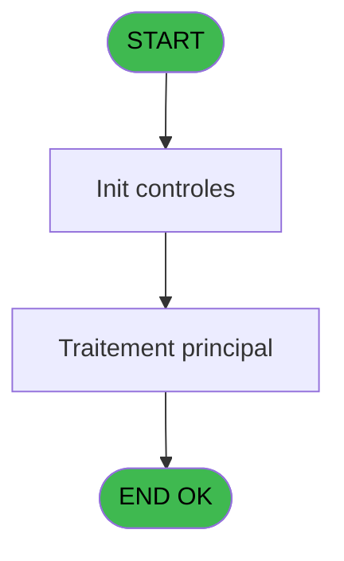

# PBP IDE 322 - VOL -> Tempo userlist

> **Analyse**: Phases 1-4 2026-02-03 16:24 -> 16:25 (17s) | Assemblage 16:25
> **Pipeline**: V7.2 Enrichi
> **Structure**: 4 onglets (Resume | Ecrans | Donnees | Connexions)

<!-- TAB:Resume -->

## 1. FICHE D'IDENTITE

| Attribut | Valeur |
|----------|--------|
| Projet | PBP |
| IDE Position | 322 |
| Nom Programme | VOL -> Tempo userlist |
| Fichier source | `Prg_322.xml` |
| Dossier IDE | Remplissage |
| Taches | 1 (0 ecrans visibles) |
| Tables modifiees | 0 |
| Programmes appeles | 0 |

## 2. DESCRIPTION FONCTIONNELLE

**VOL -> Tempo userlist** assure la gestion complete de ce processus, accessible depuis [Liste multicriteres (IDE 141)](PBP-IDE-141.md).

Le flux de traitement s'organise en **1 blocs fonctionnels** :

- **Traitement** (1 tache) : traitements metier divers

## 3. BLOCS FONCTIONNELS

### 3.1 Traitement (1 tache)

Traitements internes.

---

#### 322 - VOL -> Tempo userlist

**Role** : Selection par l'operateur : VOL -> Tempo userlist.

## 5. REGLES METIER

*(Aucune regle metier identifiee)*

## 6. CONTEXTE

- **Appele par**: [Liste multicriteres (IDE 141)](PBP-IDE-141.md)
- **Appelle**: 0 programmes | **Tables**: 3 (W:0 R:1 L:2) | **Taches**: 1 | **Expressions**: 18

<!-- TAB:Ecrans -->

## 8. ECRANS

*(Programme sans ecran visible)*

## 9. NAVIGATION

### 9.3 Structure hierarchique (1 tache)

| Position | Tache | Type | Dimensions | Bloc |
|----------|-------|------|------------|------|
| **322.1** | [**VOL -> Tempo userlist** (322)](#t1) | MDI | - | Traitement |

### 9.4 Algorigramme

> **Legende**: Vert = START/END OK | Rouge = END KO | Bleu = Decisions
> *Algorigramme auto-genere. Utiliser `/algorigramme` pour une synthese metier detaillee.*

<!-- TAB:Donnees -->

## 10. TABLES

### Tables utilisees (3)

| ID | Nom | Description | Type | R | W | L | Usages |
|----|-----|-------------|------|---|---|---|--------|
| 132 | code_vol_________vot |  | DB | R |   |   | 1 |
| 134 | groupe_arr_dep___vol |  | DB |   |   | L | 1 |
| 637 | tempo_zone_secteur | Table temporaire ecran | DB |   |   | L | 1 |

### Colonnes par table (1 / 1 tables avec colonnes identifiees)

Table 132 - code_vol_________vot (R) - 1 usages

| Lettre | Variable | Acces | Type |
|--------|----------|-------|------|
| A | >Categorie | R | Alpha |
| B | >NomTable | R | Alpha |
| C | >date deb | R | Date |
| D | >time deb | R | Numeric |
| E | >date fin | R | Date |
| F | >time fin | R | Numeric |
| G | v.dateheure | R | Numeric |
| H | time deb | R | Time |
| I | time fin | R | Time |

## 11. VARIABLES

### 11.1 Variables de session (1)

Variables persistantes pendant toute la session.

| Lettre | Nom | Type | Usage dans |
|--------|-----|------|-----------|
| G | v.dateheure | Numeric | - |

### 11.2 Autres (8)

Variables diverses.

| Lettre | Nom | Type | Usage dans |
|--------|-----|------|-----------|
| A | >Categorie | Alpha | 1x refs |
| B | >NomTable | Alpha | 1x refs |
| C | >date deb | Date | 1x refs |
| D | >time deb | Numeric | 4x refs |
| E | >date fin | Date | 3x refs |
| F | >time fin | Numeric | 1x refs |
| H | time deb | Time | 4x refs |
| I | time fin | Time | 1x refs |

## 12. EXPRESSIONS

**18 / 18 expressions decodees (100%)**

### 12.1 Repartition par type

| Type | Expressions | Regles |
|------|-------------|--------|
| CALCULATION | 1 | 0 |
| OTHER | 4 | 0 |
| REFERENCE_VG | 1 | 0 |
| CONDITION | 8 | 0 |
| CAST_LOGIQUE | 2 | 0 |
| CONCATENATION | 2 | 0 |

### 12.2 Expressions cles par type

#### CALCULATION (1 expressions)

| Type | IDE | Expression | Regle |
|------|-----|------------|-------|
| CALCULATION | 18 | `[AK]*100+[AL]` | - |

#### OTHER (4 expressions)

| Type | IDE | Expression | Regle |
|------|-----|------------|-------|
| OTHER | 15 | `Heure_vol_Min([AL])` | - |
| OTHER | 16 | `Heure_vol_Max([AL])` | - |
| OTHER | 1 | `GetParam ('SOCIETE')` | - |
| OTHER | 12 | `[AK]` | - |

#### REFERENCE_VG (1 expressions)

| Type | IDE | Expression | Regle |
|------|-----|------------|-------|
| REFERENCE_VG | 2 | `VG1` | - |

#### CONDITION (8 expressions)

| Type | IDE | Expression | Regle |
|------|-----|------------|-------|
| CONDITION | 11 | `>date fin [E]` | - |
| CONDITION | 10 | `>date deb [C]` | - |
| CONDITION | 14 | `>time deb [D]` | - |
| CONDITION | 13 | `>time fin [F]` | - |
| CONDITION | 4 | `>NomTable [B]` | - |
| ... | | *+3 autres* | |

#### CAST_LOGIQUE (2 expressions)

| Type | IDE | Expression | Regle |
|------|-----|------------|-------|
| CAST_LOGIQUE | 17 | `'TRUE'LOG` | - |
| CAST_LOGIQUE | 8 | `'FALSE'LOG` | - |

#### CONCATENATION (2 expressions)

| Type | IDE | Expression | Regle |
|------|-----|------------|-------|
| CONCATENATION | 9 | `Trim([AC])&Trim(>time deb [D])&' '&IF (>date fin [E]='A',MlsTrans ('Aller'),MlsTrans ('Retour'))` | - |
| CONCATENATION | 7 | `Trim([AC])&Trim(>time deb [D])` | - |

<!-- TAB:Connexions -->

## 13. GRAPHE D'APPELS

### 13.1 Chaine depuis Main (Callers)

Main -> ... -> [Liste multicriteres (IDE 141)](PBP-IDE-141.md) -> **VOL -> Tempo userlist (IDE 322)**

### 13.2 Callers

| IDE | Nom Programme | Nb Appels |
|-----|---------------|-----------|
| [141](PBP-IDE-141.md) | Liste multicriteres | 1 |

### 13.3 Callees (programmes appeles)

### 13.4 Detail Callees avec contexte

| IDE | Nom Programme | Appels | Contexte |
|-----|---------------|--------|----------|
| - | (aucun) | - | - |

## 14. RECOMMANDATIONS MIGRATION

### 14.1 Profil du programme

| Metrique | Valeur | Impact migration |
|----------|--------|-----------------|
| Lignes de logique | 39 | Programme compact |
| Expressions | 18 | Peu de logique |
| Tables WRITE | 0 | Impact faible |
| Sous-programmes | 0 | Peu de dependances |
| Ecrans visibles | 0 | Ecran unique ou traitement batch |
| Code desactive | 0% (0 / 39) | Code sain |
| Regles metier | 0 | Pas de regle identifiee |

### 14.2 Plan de migration par bloc

#### Traitement (1 tache: 0 ecran, 1 traitement)

- **Strategie** : 1 service(s) backend injectable(s) (Domain Services).
- Decomposer les taches en services unitaires testables.

### 14.3 Dependances critiques

| Dependance | Type | Appels | Impact |
|------------|------|--------|--------|

---
*Spec DETAILED generee par Pipeline V7.2 - 2026-02-03 16:25*
