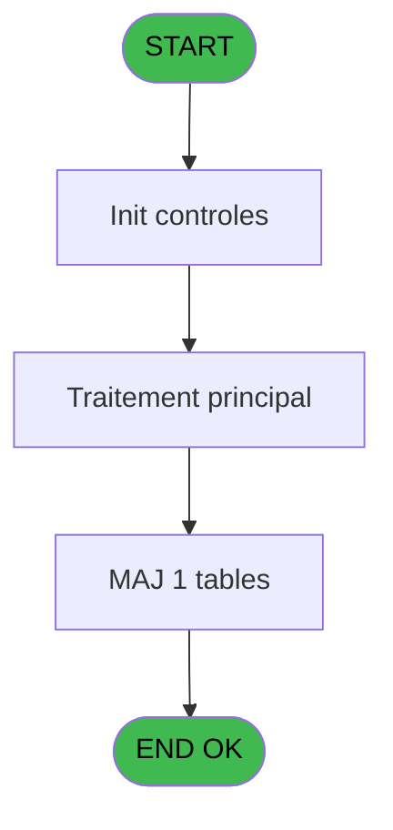
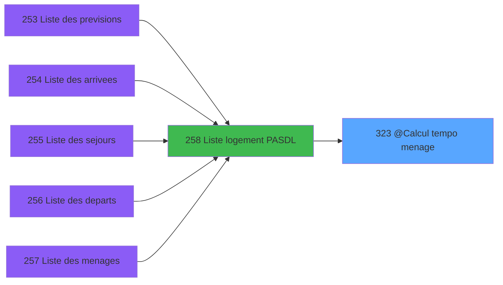
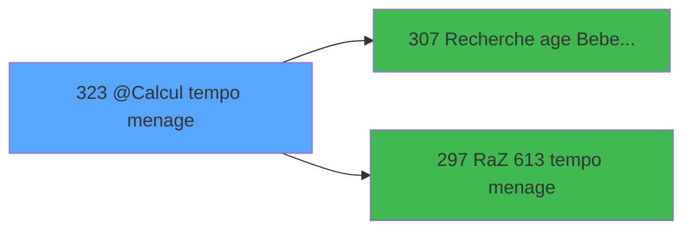

# PBP IDE 323 - @Calcul tempo menage

> **Analyse**: Phases 1-4 2026-02-03 16:25 -> 16:25 (19s) | Assemblage 16:25
> **Pipeline**: V7.2 Enrichi
> **Structure**: 4 onglets (Resume | Ecrans | Donnees | Connexions)

<!-- TAB:Resume -->

## 1. FICHE D'IDENTITE

| Attribut | Valeur |
|----------|--------|
| Projet | PBP |
| IDE Position | 323 |
| Nom Programme | @Calcul tempo menage |
| Fichier source | `Prg_323.xml` |
| Dossier IDE | Remplissage |
| Taches | 6 (1 ecrans visibles) |
| Tables modifiees | 1 |
| Programmes appeles | 2 |

## 2. DESCRIPTION FONCTIONNELLE

**@Calcul tempo menage** assure la gestion complete de ce processus, accessible depuis [  Liste logement PASDL (IDE 258)](PBP-IDE-258.md).

Le flux de traitement s'organise en **3 blocs fonctionnels** :

- **Traitement** (3 taches) : traitements metier divers
- **Creation** (2 taches) : insertion d'enregistrements en base (mouvements, prestations)
- **Calcul** (1 tache) : calculs de montants, stocks ou compteurs

**Donnees modifiees** : 1 tables en ecriture (tempo_reception).

Detail : phases du traitement

#### Phase 1 : Traitement (3 taches)

- **323** - Veuillez patienter ... **[[ECRAN]](#ecran-t1)**
- **323.1** - Logements
- **323.1.3** - Vérification si lit Zippable

#### Phase 2 : Calcul (1 tache)

- **323.1.1** - Calcul occupation

#### Phase 3 : Creation (2 taches)

- **323.1.1.1** - Creation
- **323.1.2** - Creation

#### Tables impactees

| Table | Operations | Role metier |
|-------|-----------|-------------|
| tempo_reception | **W**/L (3 usages) | Table temporaire ecran |

## 3. BLOCS FONCTIONNELS

### 3.1 Traitement (3 taches)

Traitements internes.

---

#### 323 - Veuillez patienter ... [[ECRAN]](#ecran-t1)

**Role** : Traitement : Veuillez patienter ....
**Ecran** : 424 x 56 DLU (MDI) | [Voir mockup](#ecran-t1)

---

#### 323.1 - Logements

**Role** : Traitement : Logements.

---

#### 323.1.3 - Vérification si lit Zippable

**Role** : Traitement : Vérification si lit Zippable.

### 3.2 Calcul (1 tache)

Calculs metier : montants, stocks, compteurs.

---

#### 323.1.1 - Calcul occupation

**Role** : Calcul : Calcul occupation.
**Variables liees** : A (>DateCalcul)

### 3.3 Creation (2 taches)

Insertion de nouveaux enregistrements en base.

---

#### 323.1.1.1 - Creation

**Role** : Creation d'enregistrement : Creation.

---

#### 323.1.2 - Creation

**Role** : Creation d'enregistrement : Creation.

## 5. REGLES METIER

*(Aucune regle metier identifiee)*

## 6. CONTEXTE

- **Appele par**: [  Liste logement PASDL (IDE 258)](PBP-IDE-258.md)
- **Appelle**: 2 programmes | **Tables**: 19 (W:1 R:3 L:16) | **Taches**: 6 | **Expressions**: 9

<!-- TAB:Ecrans -->

## 8. ECRANS

### 8.1 Forms visibles (1 / 6)

| # | Position | Tache | Nom | Type | Largeur | Hauteur | Bloc |
|---|----------|-------|-----|------|---------|---------|------|
| 1 | 323 | 323 | Veuillez patienter ... | MDI | 424 | 56 | Traitement |

### 8.2 Mockups Ecrans

---

#### 323 - Veuillez patienter ...
**Tache** : [323](#t1) | **Type** : MDI | **Dimensions** : 424 x 56 DLU
**Bloc** : Traitement | **Titre IDE** : Veuillez patienter ...

<!-- FORM-DATA:
{
    "width":  424,
    "vFactor":  8,
    "type":  "MDI",
    "hFactor":  8,
    "controls":  [
                     {
                         "x":  0,
                         "type":  "label",
                         "var":  "",
                         "y":  0,
                         "w":  423,
                         "fmt":  "",
                         "name":  "",
                         "h":  29,
                         "color":  "",
                         "text":  "",
                         "parent":  null
                     },
                     {
                         "x":  120,
                         "type":  "label",
                         "var":  "",
                         "y":  10,
                         "w":  221,
                         "fmt":  "",
                         "name":  "",
                         "h":  8,
                         "color":  "7",
                         "text":  "Traitement en cours ...",
                         "parent":  null
                     },
                     {
                         "x":  0,
                         "type":  "label",
                         "var":  "",
                         "y":  29,
                         "w":  423,
                         "fmt":  "",
                         "name":  "",
                         "h":  27,
                         "color":  "",
                         "text":  "",
                         "parent":  null
                     },
                     {
                         "x":  110,
                         "type":  "label",
                         "var":  "",
                         "y":  32,
                         "w":  114,
                         "fmt":  "",
                         "name":  "",
                         "h":  8,
                         "color":  "",
                         "text":  "Analyses :",
                         "parent":  4
                     },
                     {
                         "x":  110,
                         "type":  "label",
                         "var":  "",
                         "y":  44,
                         "w":  139,
                         "fmt":  "",
                         "name":  "",
                         "h":  8,
                         "color":  "",
                         "text":  "Selectiones :",
                         "parent":  4
                     },
                     {
                         "x":  4,
                         "type":  "image",
                         "var":  "",
                         "y":  2,
                         "w":  72,
                         "fmt":  "",
                         "name":  "",
                         "h":  25,
                         "color":  "",
                         "text":  "",
                         "parent":  null
                     },
                     {
                         "x":  259,
                         "type":  "edit",
                         "var":  "",
                         "y":  32,
                         "w":  56,
                         "fmt":  "",
                         "name":  "",
                         "h":  9,
                         "color":  "",
                         "text":  "",
                         "parent":  4
                     },
                     {
                         "x":  259,
                         "type":  "edit",
                         "var":  "",
                         "y":  44,
                         "w":  56,
                         "fmt":  "",
                         "name":  "",
                         "h":  9,
                         "color":  "",
                         "text":  "",
                         "parent":  4
                     }
                 ],
    "taskId":  "323",
    "height":  56
}
-->

<strong>Champs : 2 champs</strong>

| Pos (x,y) | Nom | Variable | Type |
|-----------|-----|----------|------|
| 259,32 | (sans nom) | - | edit |
| 259,44 | (sans nom) | - | edit |

## 9. NAVIGATION

Ecran unique: **Veuillez patienter ...**

### 9.3 Structure hierarchique (6 taches)

| Position | Tache | Type | Dimensions | Bloc |
|----------|-------|------|------------|------|
| **323.1** | [**Veuillez patienter ...** (323)](#t1) [mockup](#ecran-t1) | MDI | 424x56 | Traitement |
| 323.1.1 | [Logements (323.1)](#t2) | MDI | - | |
| 323.1.2 | [Vérification si lit Zippable (323.1.3)](#t13) | - | - | |
| **323.2** | [**Calcul occupation** (323.1.1)](#t3) | MDI | - | Calcul |
| **323.3** | [**Creation** (323.1.1.1)](#t4) | MDI | - | Creation |
| 323.3.1 | [Creation (323.1.2)](#t6) | MDI | - | |

### 9.4 Algorigramme

> **Legende**: Vert = START/END OK | Rouge = END KO | Bleu = Decisions
> *Algorigramme auto-genere. Utiliser `/algorigramme` pour une synthese metier detaillee.*

<!-- TAB:Donnees -->

## 10. TABLES

### Tables utilisees (19)

| ID | Nom | Description | Type | R | W | L | Usages |
|----|-----|-------------|------|---|---|---|--------|
| 30 | gm-recherche_____gmr | Index de recherche | DB | R |   |   | 1 |
| 31 | gm-complet_______gmc |  | DB |   |   | L | 1 |
| 33 | prestations______pre | Prestations/services vendus | DB |   |   | L | 1 |
| 34 | hebergement______heb | Hebergement (chambres) | DB |   |   | L | 1 |
| 81 | societe__________soc |  | DB | R |   |   | 1 |
| 103 | logement_client__loc |  | DB | R |   |   | 1 |
| 104 | fichier_menage |  | DB |   |   | L | 1 |
| 108 | code_logement____clo |  | DB |   |   | L | 1 |
| 112 | tables_paris |  | DB |   |   | L | 1 |
| 120 | tables_qualites__qua |  | DB |   |   | L | 1 |
| 167 | troncon__________tro |  | DB |   |   | L | 1 |
| 347 | intervalle_menage |  | DB |   |   | L | 1 |
| 358 | import_mod |  | DB |   |   | L | 1 |
| 479 | gestion_devise_session | Sessions de caisse | TMP |   |   | L | 1 |
| 613 | tempo_reception | Table temporaire ecran | TMP |   | **W** | L | 3 |
| 637 | tempo_zone_secteur | Table temporaire ecran | DB |   |   | L | 1 |
| 638 | tempo_nombres | Table temporaire ecran | DB |   |   | L | 1 |
| 806 | sale_channel |  | DB |   |   | L | 1 |
| 1032 | Table_1032 |  | MEM |   |   | L | 1 |

### Colonnes par table (9 / 4 tables avec colonnes identifiees)

Table 30 - gm-recherche_____gmr (R) - 1 usages

| Lettre | Variable | Acces | Type |
|--------|----------|-------|------|
| A | RetHEBDepart------------------- | R | Logical |
| B | RetHEBArrive------------------- | R | Logical |
| C | v.retourTroncon | R | Logical |
| D | v.DureeTransfert | R | Numeric |
| E | v.HeureArriveeVillage | R | Time |
| F | v.ret.facilitate your arrival | R | Logical |
| G | Cond_liste_menage_OK_? | R | Logical |
| H | w2_SubTotalDep | R | Numeric |
| I | w2_SubTotalArr | R | Numeric |
| J | w2_SubTotalSej | R | Numeric |
| K | w2_DepA | R | Numeric |
| L | w2_DepE | R | Numeric |
| M | w2_DepB | R | Numeric |
| N | w2_TotalDepA | R | Numeric |
| O | w2_TotalDepE | R | Numeric |
| P | w2_TotalDepB | R | Numeric |
| Q | w2_HeureDep | R | Alpha |
| R | w2_Heure libération | R | Time |
| S | W2_MillDep | R | Alpha |
| T | w2_VipDep | R | Alpha |
| U | w2_HoneyDep | R | Alpha |
| V | w2_SingleDep | R | Alpha |
| W | w2_ArrA | R | Numeric |
| X | w2_ArrE | R | Numeric |
| Y | w2_ArrB | R | Numeric |
| Z | w2_TotalArrA | R | Numeric |
| BA | w2_TotalArrE | R | Numeric |
| BB | w2_TotalArrB | R | Numeric |
| BC | w2_HeureArr | R | Alpha |
| BD | W2_MillArr | R | Alpha |
| BE | w2_VipArr | R | Alpha |
| BF | w2_HoneyArr | R | Alpha |
| BG | w2_SingleArr | R | Alpha |
| BH | w2_SejA | R | Numeric |
| BI | w2_SejE | R | Numeric |
| BJ | w2_SejB | R | Numeric |
| BK | w2_TotalSejA | R | Numeric |
| BL | w2_TotalSejE | R | Numeric |
| BM | w2_TotalSejB | R | Numeric |
| BN | w2_DateDebSej | R | Date |
| BO | w2_DateFinSej | R | Date |
| BP | W2_MillSej | R | Alpha |
| BQ | w2_VipSej | R | Alpha |
| BR | w2_HoneySej | R | Alpha |
| BS | w2_SingleSej | R | Alpha |
| BT | w2_FlagGO | R | Alpha |
| BU | w2_DateDebBloq | R | Date |
| BV | w2_DateFinBloq | R | Date |
| BW | w2_LibBlock1 | R | Alpha |
| BX | w2_LibBlock2 | R | Alpha |
| BY | w2_SiDepart | R | Logical |
| BZ | w2_SiArrivee | R | Logical |
| CA | w2_SiSejour | R | Logical |
| CB | ExisteZip ? | R | Logical |

Table 81 - societe__________soc (R) - 1 usages

| Lettre | Variable | Acces | Type |
|--------|----------|-------|------|
| A | >DateCalcul | R | Date |
| B | >Categorie | R | Alpha |
| C | >NomTable | R | Alpha |
| D | >ZoneSecteur | R | Alpha |
| E | <Total | R | Numeric |
| F | <NbSelect | R | Numeric |
| G | < lieu de sejour | R | Alpha |
| H | e.zipbed_code? | R | Logical |
| I | w0_AgeEnfant | R | Numeric |
| J | w0_AgeBebe | R | Numeric |
| K | w0_Sequence | R | Numeric |
| L | w0_CodeZIP | R | Alpha |

Table 103 - logement_client__loc (R) - 1 usages

| Lettre | Variable | Acces | Type |
|--------|----------|-------|------|
| A | w1_crt log client | R | Logical |
| B | w1_Traitement | R | Alpha |
| C | w1_TotalDep | R | Numeric |
| D | w1_TotalArr | R | Numeric |
| E | w1_TotalSejour | R | Numeric |
| F | w1_Select | R | Logical |
| G | w1_Bloque | R | Logical |
| H | w1_matrimonial | R | Unicode |

Table 613 - tempo_reception (**W**/L) - 3 usages

*Table utilisee uniquement en Link ou aucune colonne Real identifiee dans le DataView.*

## 11. VARIABLES

### 11.1 Autres (54)

Variables diverses.

| Lettre | Nom | Type | Usage dans |
|--------|-----|------|-----------|
| A | >DateCalcul | Date | - |
| B | >Categorie | Alpha | 1x refs |
| C | >NomTable | Alpha | 1x refs |
| D | >ZoneSecteur | Alpha | 1x refs |
| E | <Total | Numeric | - |
| F | <NbSelect | Numeric | - |
| G | < lieu de sejour | Alpha | - |
| H | e.zipbed_code? | Logical | - |
| I | w0_AgeEnfant | Numeric | - |
| J | w0_AgeBebe | Numeric | - |
| K | w0_Sequence | Numeric | - |
| L | w0_CodeZIP | Alpha | - |
| M | w2_DepB | Numeric | - |
| N | w2_TotalDepA | Numeric | - |
| O | w2_TotalDepE | Numeric | - |
| P | w2_TotalDepB | Numeric | - |
| Q | w2_HeureDep | Alpha | - |
| R | w2_Heure libération | Time | - |
| S | W2_MillDep | Alpha | - |
| T | w2_VipDep | Alpha | - |
| U | w2_HoneyDep | Alpha | - |
| V | w2_SingleDep | Alpha | - |
| W | w2_ArrA | Numeric | - |
| X | w2_ArrE | Numeric | - |
| Y | w2_ArrB | Numeric | - |
| Z | w2_TotalArrA | Numeric | - |
| BA | w2_TotalArrE | Numeric | - |
| BB | w2_TotalArrB | Numeric | - |
| BC | w2_HeureArr | Alpha | - |
| BD | W2_MillArr | Alpha | - |
| BE | w2_VipArr | Alpha | - |
| BF | w2_HoneyArr | Alpha | - |
| BG | w2_SingleArr | Alpha | - |
| BH | w2_SejA | Numeric | - |
| BI | w2_SejE | Numeric | - |
| BJ | w2_SejB | Numeric | - |
| BK | w2_TotalSejA | Numeric | - |
| BL | w2_TotalSejE | Numeric | - |
| BM | w2_TotalSejB | Numeric | - |
| BN | w2_DateDebSej | Date | - |
| BO | w2_DateFinSej | Date | - |
| BP | W2_MillSej | Alpha | - |
| BQ | w2_VipSej | Alpha | - |
| BR | w2_HoneySej | Alpha | - |
| BS | w2_SingleSej | Alpha | - |
| BT | w2_FlagGO | Alpha | - |
| BU | w2_DateDebBloq | Date | - |
| BV | w2_DateFinBloq | Date | - |
| BW | w2_LibBlock1 | Alpha | - |
| BX | w2_LibBlock2 | Alpha | - |
| BY | w2_SiDepart | Logical | - |
| BZ | w2_SiArrivee | Logical | - |
| CA | w2_SiSejour | Logical | - |
| CB | ExisteZip ? | Logical | - |

Toutes les 54 variables (liste complete)

| Cat | Lettre | Nom Variable | Type |
|-----|--------|--------------|------|
| Autre | **A** | >DateCalcul | Date |
| Autre | **B** | >Categorie | Alpha |
| Autre | **C** | >NomTable | Alpha |
| Autre | **D** | >ZoneSecteur | Alpha |
| Autre | **E** | <Total | Numeric |
| Autre | **F** | <NbSelect | Numeric |
| Autre | **G** | < lieu de sejour | Alpha |
| Autre | **H** | e.zipbed_code? | Logical |
| Autre | **I** | w0_AgeEnfant | Numeric |
| Autre | **J** | w0_AgeBebe | Numeric |
| Autre | **K** | w0_Sequence | Numeric |
| Autre | **L** | w0_CodeZIP | Alpha |
| Autre | **M** | w2_DepB | Numeric |
| Autre | **N** | w2_TotalDepA | Numeric |
| Autre | **O** | w2_TotalDepE | Numeric |
| Autre | **P** | w2_TotalDepB | Numeric |
| Autre | **Q** | w2_HeureDep | Alpha |
| Autre | **R** | w2_Heure libération | Time |
| Autre | **S** | W2_MillDep | Alpha |
| Autre | **T** | w2_VipDep | Alpha |
| Autre | **U** | w2_HoneyDep | Alpha |
| Autre | **V** | w2_SingleDep | Alpha |
| Autre | **W** | w2_ArrA | Numeric |
| Autre | **X** | w2_ArrE | Numeric |
| Autre | **Y** | w2_ArrB | Numeric |
| Autre | **Z** | w2_TotalArrA | Numeric |
| Autre | **BA** | w2_TotalArrE | Numeric |
| Autre | **BB** | w2_TotalArrB | Numeric |
| Autre | **BC** | w2_HeureArr | Alpha |
| Autre | **BD** | W2_MillArr | Alpha |
| Autre | **BE** | w2_VipArr | Alpha |
| Autre | **BF** | w2_HoneyArr | Alpha |
| Autre | **BG** | w2_SingleArr | Alpha |
| Autre | **BH** | w2_SejA | Numeric |
| Autre | **BI** | w2_SejE | Numeric |
| Autre | **BJ** | w2_SejB | Numeric |
| Autre | **BK** | w2_TotalSejA | Numeric |
| Autre | **BL** | w2_TotalSejE | Numeric |
| Autre | **BM** | w2_TotalSejB | Numeric |
| Autre | **BN** | w2_DateDebSej | Date |
| Autre | **BO** | w2_DateFinSej | Date |
| Autre | **BP** | W2_MillSej | Alpha |
| Autre | **BQ** | w2_VipSej | Alpha |
| Autre | **BR** | w2_HoneySej | Alpha |
| Autre | **BS** | w2_SingleSej | Alpha |
| Autre | **BT** | w2_FlagGO | Alpha |
| Autre | **BU** | w2_DateDebBloq | Date |
| Autre | **BV** | w2_DateFinBloq | Date |
| Autre | **BW** | w2_LibBlock1 | Alpha |
| Autre | **BX** | w2_LibBlock2 | Alpha |
| Autre | **BY** | w2_SiDepart | Logical |
| Autre | **BZ** | w2_SiArrivee | Logical |
| Autre | **CA** | w2_SiSejour | Logical |
| Autre | **CB** | ExisteZip ? | Logical |

## 12. EXPRESSIONS

**9 / 9 expressions decodees (100%)**

### 12.1 Repartition par type

| Type | Expressions | Regles |
|------|-------------|--------|
| CONSTANTE | 2 | 0 |
| REFERENCE_VG | 1 | 0 |
| CONDITION | 3 | 0 |
| CAST_LOGIQUE | 1 | 0 |
| OTHER | 2 | 0 |

### 12.2 Expressions cles par type

#### CONSTANTE (2 expressions)

| Type | IDE | Expression | Regle |
|------|-----|------------|-------|
| CONSTANTE | 8 | `'VBEBE'` | - |
| CONSTANTE | 7 | `'VENFA'` | - |

#### REFERENCE_VG (1 expressions)

| Type | IDE | Expression | Regle |
|------|-----|------------|-------|
| REFERENCE_VG | 1 | `VG1` | - |

#### CONDITION (3 expressions)

| Type | IDE | Expression | Regle |
|------|-----|------------|-------|
| CONDITION | 4 | `>ZoneSecteur [D]` | - |
| CONDITION | 3 | `>NomTable [C]` | - |
| CONDITION | 2 | `>Categorie [B]` | - |

#### CAST_LOGIQUE (1 expressions)

| Type | IDE | Expression | Regle |
|------|-----|------------|-------|
| CAST_LOGIQUE | 5 | `'TRUE'LOG` | - |

#### OTHER (2 expressions)

| Type | IDE | Expression | Regle |
|------|-----|------------|-------|
| OTHER | 9 | `[AQ]` | - |
| OTHER | 6 | `GetParam ('SOCIETE')` | - |

<!-- TAB:Connexions -->

## 13. GRAPHE D'APPELS

### 13.1 Chaine depuis Main (Callers)

Main -> ... -> [  Liste logement PASDL (IDE 258)](PBP-IDE-258.md) -> **@Calcul tempo menage (IDE 323)**

### 13.2 Callers

| IDE | Nom Programme | Nb Appels |
|-----|---------------|-----------|
| [258](PBP-IDE-258.md) |   Liste logement PASDL | 2 |

### 13.3 Callees (programmes appeles)

### 13.4 Detail Callees avec contexte

| IDE | Nom Programme | Appels | Contexte |
|-----|---------------|--------|----------|
| [307](PBP-IDE-307.md) | Recherche age Bebe_Enfant | 2 | Sous-programme |
| [297](PBP-IDE-297.md) | RaZ 613 tempo menage | 1 | Reinitialisation |

## 14. RECOMMANDATIONS MIGRATION

### 14.1 Profil du programme

| Metrique | Valeur | Impact migration |
|----------|--------|-----------------|
| Lignes de logique | 542 | Programme volumineux |
| Expressions | 9 | Peu de logique |
| Tables WRITE | 1 | Impact faible |
| Sous-programmes | 2 | Peu de dependances |
| Ecrans visibles | 1 | Ecran unique ou traitement batch |
| Code desactive | 0.7% (4 / 542) | Code sain |
| Regles metier | 0 | Pas de regle identifiee |

### 14.2 Plan de migration par bloc

#### Traitement (3 taches: 1 ecran, 2 traitements)

- **Strategie** : Orchestrateur avec 1 ecrans (Razor/React) et 2 traitements backend (services).
- Les ecrans deviennent des composants UI, les traitements invisibles deviennent des services injectables.
- 2 sous-programme(s) a migrer ou a reutiliser depuis les services existants.
- Decomposer les taches en services unitaires testables.

#### Calcul (1 tache: 0 ecran, 1 traitement)

- **Strategie** : Services de calcul purs (Domain Services).
- Migrer la logique de calcul (stock, compteurs, montants)

#### Creation (2 taches: 0 ecran, 2 traitements)

- **Strategie** : Repository pattern avec Entity Framework Core.
- Insertion via `IRepository<T>.CreateAsync()`

### 14.3 Dependances critiques

| Dependance | Type | Appels | Impact |
|------------|------|--------|--------|
| tempo_reception | Table WRITE (Temp) | 2x | Schema + repository |
| [Recherche age Bebe_Enfant (IDE 307)](PBP-IDE-307.md) | Sous-programme | 2x | Haute - Sous-programme |
| [RaZ 613 tempo menage (IDE 297)](PBP-IDE-297.md) | Sous-programme | 1x | Normale - Reinitialisation |

---
*Spec DETAILED generee par Pipeline V7.2 - 2026-02-03 16:25*
