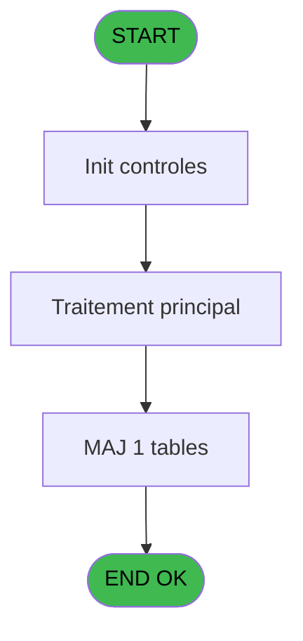
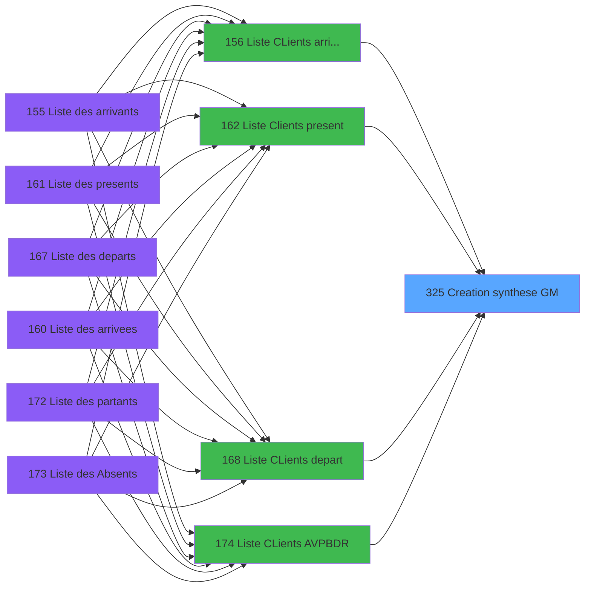
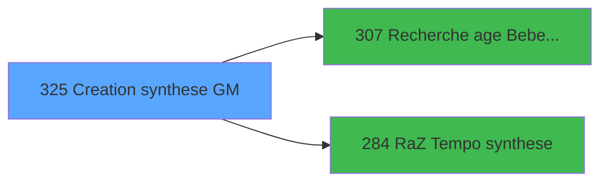

# PBP IDE 325 - Creation synthese GM

> **Analyse**: Phases 1-4 2026-02-03 16:25 -> 16:26 (14s) | Assemblage 16:26
> **Pipeline**: V7.2 Enrichi
> **Structure**: 4 onglets (Resume | Ecrans | Donnees | Connexions)

<!-- TAB:Resume -->

## 1. FICHE D'IDENTITE

| Attribut | Valeur |
|----------|--------|
| Projet | PBP |
| IDE Position | 325 |
| Nom Programme | Creation synthese GM |
| Fichier source | `Prg_325.xml` |
| Dossier IDE | Remplissage |
| Taches | 2 (1 ecrans visibles) |
| Tables modifiees | 1 |
| Programmes appeles | 2 |

## 2. DESCRIPTION FONCTIONNELLE

**Creation synthese GM** assure la gestion complete de ce processus, accessible depuis [  Liste Clients present (IDE 162)](PBP-IDE-162.md), [Liste CLients AVPBDR (IDE 174)](PBP-IDE-174.md), [  Liste CLients arrivant (IDE 156)](PBP-IDE-156.md), [  Liste CLients depart (IDE 168)](PBP-IDE-168.md).

Le flux de traitement s'organise en **2 blocs fonctionnels** :

- **Creation** (1 tache) : insertion d'enregistrements en base (mouvements, prestations)
- **Traitement** (1 tache) : traitements metier divers

**Donnees modifiees** : 1 tables en ecriture (tempo_users).

**Logique metier** : 3 regles identifiees couvrant conditions metier.

Detail : phases du traitement

#### Phase 1 : Traitement (1 tache)

- **325** - Veuillez patienter ... **[[ECRAN]](#ecran-t1)**

#### Phase 2 : Creation (1 tache)

- **325.1** - Creation tempo

#### Tables impactees

| Table | Operations | Role metier |
|-------|-----------|-------------|
| tempo_users | **W**/L (2 usages) | Table temporaire ecran |

## 3. BLOCS FONCTIONNELS

### 3.1 Traitement (1 tache)

Traitements internes.

---

#### 325 - Veuillez patienter ... [[ECRAN]](#ecran-t1)

**Role** : Traitement : Veuillez patienter ....
**Ecran** : 424 x 56 DLU (MDI) | [Voir mockup](#ecran-t1)

### 3.2 Creation (1 tache)

Insertion de nouveaux enregistrements en base.

---

#### 325.1 - Creation tempo

**Role** : Creation d'enregistrement : Creation tempo.

## 5. REGLES METIER

3 regles identifiees:

### Autres (3 regles)

#### [RM-001] Si >Index [A]=5 alors >DateMaxDebut [D]+14 sinon >DateMaxDebut [D])

| Element | Detail |
|---------|--------|
| **Condition** | `>Index [A]=5` |
| **Si vrai** | >DateMaxDebut [D]+14 |
| **Si faux** | >DateMaxDebut [D]) |
| **Variables** | A (>Index), D (>DateMaxDebut) |
| **Expression source** | Expression 19 : `IF (>Index [A]=5,>DateMaxDebut [D]+14,>DateMaxDebut [D])` |
| **Exemple** | Si >Index [A]=5 → >DateMaxDebut [D]+14. Sinon → >DateMaxDebut [D]) |

#### [RM-002] Si >Index [A]=6 alors >DateMaxFin [F]+14 sinon >DateMaxFin [F])

| Element | Detail |
|---------|--------|
| **Condition** | `>Index [A]=6` |
| **Si vrai** | >DateMaxFin [F]+14 |
| **Si faux** | >DateMaxFin [F]) |
| **Variables** | A (>Index), F (>DateMaxFin) |
| **Expression source** | Expression 20 : `IF (>Index [A]=6,>DateMaxFin [F]+14,>DateMaxFin [F])` |
| **Exemple** | Si >Index [A]=6 → >DateMaxFin [F]+14. Sinon → >DateMaxFin [F]) |

#### [RM-003] Condition toujours vraie (flag actif)

| Element | Detail |
|---------|--------|
| **Condition** | `[BB]>0` |
| **Si vrai** | w0_DateMaxDebut [R]<=[BB] |
| **Si faux** | 'TRUE'LOG) AND IF ([BC]>0,w0_DateMaxFin [S]<=[BC],'TRUE'LOG) |
| **Variables** | R (w0_DateMaxDebut), S (w0_DateMaxFin) |
| **Expression source** | Expression 21 : `IF ([BB]>0,w0_DateMaxDebut [R]<=[BB],'TRUE'LOG) AND IF ([BC]` |
| **Exemple** | Si [BB]>0 → w0_DateMaxDebut [R]<=[BB] |

## 6. CONTEXTE

- **Appele par**: [  Liste Clients present (IDE 162)](PBP-IDE-162.md), [Liste CLients AVPBDR (IDE 174)](PBP-IDE-174.md), [  Liste CLients arrivant (IDE 156)](PBP-IDE-156.md), [  Liste CLients depart (IDE 168)](PBP-IDE-168.md)
- **Appelle**: 2 programmes | **Tables**: 7 (W:1 R:1 L:6) | **Taches**: 2 | **Expressions**: 49

<!-- TAB:Ecrans -->

## 8. ECRANS

### 8.1 Forms visibles (1 / 2)

| # | Position | Tache | Nom | Type | Largeur | Hauteur | Bloc |
|---|----------|-------|-----|------|---------|---------|------|
| 1 | 325 | 325 | Veuillez patienter ... | MDI | 424 | 56 | Traitement |

### 8.2 Mockups Ecrans

---

#### 325 - Veuillez patienter ...
**Tache** : [325](#t1) | **Type** : MDI | **Dimensions** : 424 x 56 DLU
**Bloc** : Traitement | **Titre IDE** : Veuillez patienter ...

<!-- FORM-DATA:
{
    "width":  424,
    "vFactor":  8,
    "type":  "MDI",
    "hFactor":  8,
    "controls":  [
                     {
                         "x":  0,
                         "type":  "label",
                         "var":  "",
                         "y":  0,
                         "w":  423,
                         "fmt":  "",
                         "name":  "",
                         "h":  29,
                         "color":  "",
                         "text":  "",
                         "parent":  null
                     },
                     {
                         "x":  120,
                         "type":  "label",
                         "var":  "",
                         "y":  10,
                         "w":  221,
                         "fmt":  "",
                         "name":  "",
                         "h":  8,
                         "color":  "7",
                         "text":  "Traitement en cours ...",
                         "parent":  null
                     },
                     {
                         "x":  0,
                         "type":  "label",
                         "var":  "",
                         "y":  29,
                         "w":  423,
                         "fmt":  "",
                         "name":  "",
                         "h":  27,
                         "color":  "",
                         "text":  "",
                         "parent":  null
                     },
                     {
                         "x":  110,
                         "type":  "label",
                         "var":  "",
                         "y":  32,
                         "w":  114,
                         "fmt":  "",
                         "name":  "",
                         "h":  8,
                         "color":  "",
                         "text":  "Analyses :",
                         "parent":  4
                     },
                     {
                         "x":  110,
                         "type":  "label",
                         "var":  "",
                         "y":  44,
                         "w":  139,
                         "fmt":  "",
                         "name":  "",
                         "h":  8,
                         "color":  "",
                         "text":  "Selectiones :",
                         "parent":  4
                     },
                     {
                         "x":  259,
                         "type":  "edit",
                         "var":  "",
                         "y":  32,
                         "w":  56,
                         "fmt":  "",
                         "name":  "",
                         "h":  9,
                         "color":  "",
                         "text":  "",
                         "parent":  4
                     },
                     {
                         "x":  259,
                         "type":  "edit",
                         "var":  "",
                         "y":  44,
                         "w":  56,
                         "fmt":  "",
                         "name":  "",
                         "h":  9,
                         "color":  "",
                         "text":  "",
                         "parent":  4
                     },
                     {
                         "x":  4,
                         "type":  "image",
                         "var":  "",
                         "y":  2,
                         "w":  72,
                         "fmt":  "",
                         "name":  "",
                         "h":  25,
                         "color":  "",
                         "text":  "",
                         "parent":  null
                     }
                 ],
    "taskId":  "325",
    "height":  56
}
-->

<strong>Champs : 2 champs</strong>

| Pos (x,y) | Nom | Variable | Type |
|-----------|-----|----------|------|
| 259,32 | (sans nom) | - | edit |
| 259,44 | (sans nom) | - | edit |

## 9. NAVIGATION

Ecran unique: **Veuillez patienter ...**

### 9.3 Structure hierarchique (2 taches)

| Position | Tache | Type | Dimensions | Bloc |
|----------|-------|------|------------|------|
| **325.1** | [**Veuillez patienter ...** (325)](#t1) [mockup](#ecran-t1) | MDI | 424x56 | Traitement |
| **325.2** | [**Creation tempo** (325.1)](#t2) | MDI | - | Creation |

### 9.4 Algorigramme

> **Legende**: Vert = START/END OK | Rouge = END KO | Bleu = Decisions
> *Algorigramme auto-genere. Utiliser `/algorigramme` pour une synthese metier detaillee.*

<!-- TAB:Donnees -->

## 10. TABLES

### Tables utilisees (7)

| ID | Nom | Description | Type | R | W | L | Usages |
|----|-----|-------------|------|---|---|---|--------|
| 31 | gm-complet_______gmc |  | DB | R |   |   | 1 |
| 34 | hebergement______heb | Hebergement (chambres) | DB |   |   | L | 1 |
| 36 | client_gm |  | DB |   |   | L | 1 |
| 119 | tables_pays_tel_ |  | DB |   |   | L | 1 |
| 598 | tempo_ecr_previsions | Table temporaire ecran | TMP |   |   | L | 2 |
| 634 | tempo_users | Table temporaire ecran | DB |   | **W** | L | 2 |
| 637 | tempo_zone_secteur | Table temporaire ecran | DB |   |   | L | 1 |

### Colonnes par table (3 / 2 tables avec colonnes identifiees)

Table 31 - gm-complet_______gmc (R) - 1 usages

| Lettre | Variable | Acces | Type |
|--------|----------|-------|------|
| A | >Index | R | Numeric |
| B | >DateCalcul | R | Date |
| C | >DateMinDebut | R | Date |
| D | >DateMaxDebut | R | Date |
| E | >DateMinFin | R | Date |
| F | >DateMaxFin | R | Date |
| G | >CodeListe | R | Alpha |
| H | >TopListe | R | Alpha |
| I | >Logement | R | Alpha |
| J | >TypeHebergement | R | Alpha |
| K | <Total | R | Numeric |
| L | <Selection | R | Numeric |
| M | >CodePays | R | Alpha |
| N | >Categorie(TUL) | R | Alpha |
| O | >NomTable | R | Alpha |
| P | >sejour | R | Alpha |
| Q | w0_Type | R | Alpha |
| R | w0_DateMaxDebut | R | Date |
| S | w0_DateMaxFin | R | Date |
| T | w0_AgeBebe | R | Numeric |
| U | w0_AgeEnfant | R | Numeric |

Table 634 - tempo_users (**W**/L) - 2 usages

*Table utilisee uniquement en Link ou aucune colonne Real identifiee dans le DataView.*

## 11. VARIABLES

### 11.1 Autres (21)

Variables diverses.

| Lettre | Nom | Type | Usage dans |
|--------|-----|------|-----------|
| A | >Index | Numeric | 3x refs |
| B | >DateCalcul | Date | - |
| C | >DateMinDebut | Date | 1x refs |
| D | >DateMaxDebut | Date | 1x refs |
| E | >DateMinFin | Date | 1x refs |
| F | >DateMaxFin | Date | 1x refs |
| G | >CodeListe | Alpha | 2x refs |
| H | >TopListe | Alpha | - |
| I | >Logement | Alpha | 1x refs |
| J | >TypeHebergement | Alpha | 2x refs |
| K | <Total | Numeric | 1x refs |
| L | <Selection | Numeric | 1x refs |
| M | >CodePays | Alpha | - |
| N | >Categorie(TUL) | Alpha | 1x refs |
| O | >NomTable | Alpha | 1x refs |
| P | >sejour | Alpha | 1x refs |
| Q | w0_Type | Alpha | 1x refs |
| R | w0_DateMaxDebut | Date | 2x refs |
| S | w0_DateMaxFin | Date | 1x refs |
| T | w0_AgeBebe | Numeric | 1x refs |
| U | w0_AgeEnfant | Numeric | 1x refs |

Toutes les 21 variables (liste complete)

| Cat | Lettre | Nom Variable | Type |
|-----|--------|--------------|------|
| Autre | **A** | >Index | Numeric |
| Autre | **B** | >DateCalcul | Date |
| Autre | **C** | >DateMinDebut | Date |
| Autre | **D** | >DateMaxDebut | Date |
| Autre | **E** | >DateMinFin | Date |
| Autre | **F** | >DateMaxFin | Date |
| Autre | **G** | >CodeListe | Alpha |
| Autre | **H** | >TopListe | Alpha |
| Autre | **I** | >Logement | Alpha |
| Autre | **J** | >TypeHebergement | Alpha |
| Autre | **K** | <Total | Numeric |
| Autre | **L** | <Selection | Numeric |
| Autre | **M** | >CodePays | Alpha |
| Autre | **N** | >Categorie(TUL) | Alpha |
| Autre | **O** | >NomTable | Alpha |
| Autre | **P** | >sejour | Alpha |
| Autre | **Q** | w0_Type | Alpha |
| Autre | **R** | w0_DateMaxDebut | Date |
| Autre | **S** | w0_DateMaxFin | Date |
| Autre | **T** | w0_AgeBebe | Numeric |
| Autre | **U** | w0_AgeEnfant | Numeric |

## 12. EXPRESSIONS

**49 / 49 expressions decodees (100%)**

### 12.1 Repartition par type

| Type | Expressions | Regles |
|------|-------------|--------|
| CONDITION | 24 | 2 |
| CAST_LOGIQUE | 1 | 5 |
| CONSTANTE | 6 | 0 |
| OTHER | 15 | 0 |
| REFERENCE_VG | 1 | 0 |
| CONCATENATION | 2 | 0 |

### 12.2 Expressions cles par type

#### CONDITION (24 expressions)

| Type | IDE | Expression | Regle |
|------|-----|------------|-------|
| CONDITION | 19 | `IF (>Index [A]=5,>DateMaxDebut [D]+14,>DateMaxDebut [D])` | [RM-001](#rm-RM-001) |
| CONDITION | 20 | `IF (>Index [A]=6,>DateMaxFin [F]+14,>DateMaxFin [F])` | [RM-002](#rm-RM-002) |
| CONDITION | 43 | `[AC]<>ASCIIChr (64)&ASCIIChr (64)` | - |
| CONDITION | 45 | `[AC]=ASCIIChr (64)&ASCIIChr (64)` | - |
| CONDITION | 35 | `[AE]='O'` | - |
| ... | | *+19 autres* | |

#### CAST_LOGIQUE (1 expressions)

| Type | IDE | Expression | Regle |
|------|-----|------------|-------|
| CAST_LOGIQUE | 21 | `IF ([BB]>0,w0_DateMaxDebut [R]<=[BB],'TRUE'LOG) AND IF ([BC]>0,w0_DateMaxFin [S]<=[BC],'TRUE'LOG)` | [RM-003](#rm-RM-003) |

#### CONSTANTE (6 expressions)

| Type | IDE | Expression | Regle |
|------|-----|------------|-------|
| CONSTANTE | 36 | `'B Honey Moon'` | - |
| CONSTANTE | 40 | `'C Singles'` | - |
| CONSTANTE | 42 | `'C Non Singles'` | - |
| CONSTANTE | 2 | `'VBEBE'` | - |
| CONSTANTE | 3 | `'VENFA'` | - |
| ... | | *+1 autres* | |

#### OTHER (15 expressions)

| Type | IDE | Expression | Regle |
|------|-----|------------|-------|
| OTHER | 32 | `MlsTrans ('G Adultes')` | - |
| OTHER | 30 | `MlsTrans ('G Enfants')` | - |
| OTHER | 28 | `MlsTrans ('G Bebes')` | - |
| OTHER | 34 | `MlsTrans ('B Millesias')` | - |
| OTHER | 47 | `'T '&[AQ]` | - |
| ... | | *+10 autres* | |

#### REFERENCE_VG (1 expressions)

| Type | IDE | Expression | Regle |
|------|-----|------------|-------|
| REFERENCE_VG | 14 | `VG1` | - |

#### CONCATENATION (2 expressions)

| Type | IDE | Expression | Regle |
|------|-----|------------|-------|
| CONCATENATION | 26 | `MlsTrans ('A Total')&' '&Trim (>TypeHebergement [J])` | - |
| CONCATENATION | 38 | `'B '&IF ([W]='O',MlsTrans ('Liste Blanche'),'Vip '&[W])` | - |

### 12.3 Toutes les expressions (49)

Voir les 49 expressions

#### CONDITION (24)

| IDE | Expression Decodee |
|-----|-------------------|
| 25 | `<Total [K]+1` |
| 48 | `<Selection [L]+1` |
| 19 | `IF (>Index [A]=5,>DateMaxDebut [D]+14,>DateMaxDebut [D])` |
| 20 | `IF (>Index [A]=6,>DateMaxFin [F]+14,>DateMaxFin [F])` |
| 1 | `>Index [A]` |
| 6 | `>DateMinDebut [C]` |
| 7 | `>DateMinFin [E]` |
| 15 | `>Categorie(TUL) [N]` |
| 16 | `>NomTable [O]` |
| 23 | `>Logement [I]='' OR >Logement [I]=[AP]` |
| 24 | `>TypeHebergement [J]=[AM]` |
| 27 | `[Y]>0 AND [X]<=[BD] AND ([DL]>0 OR [DM]>0)` |
| 29 | `[Y]>0 AND [X]>[BD] AND [X]<=[BE] AND ([DL]>0 OR [DM]>0)` |
| 31 | `[Y]>0 AND [X]>[BE] OR ([DL]=0 AND [DM]=0)` |
| 33 | `[AD]='M'` |
| 35 | `[AE]='O'` |
| 43 | `[AC]<>ASCIIChr (64)&ASCIIChr (64)` |
| 45 | `[AC]=ASCIIChr (64)&ASCIIChr (64)` |
| 10 | `CndRange (InStr ('AVB',>CodeListe [G])>0,w0_DateMaxDebut [R])` |
| 22 | `[AK]='P' AND InStr ('VD',>CodeListe [G])>0 OR [AK]<>'P' AND >CodeListe [G]='B' OR >CodeListe [G]='R' OR >CodeListe [G]='A'` |
| 37 | `InStr ('12345',[W])>0` |
| 39 | `Trim(MID([AL],2,2))='1'` |
| 41 | `Trim(MID ([AL],2,2))<>'1'` |
| 49 | `>sejour [P]='' OR Trim (>sejour [P])=Trim ([AP])` |

#### CAST_LOGIQUE (1)

| IDE | Expression Decodee |
|-----|-------------------|
| 21 | `IF ([BB]>0,w0_DateMaxDebut [R]<=[BB],'TRUE'LOG) AND IF ([BC]>0,w0_DateMaxFin [S]<=[BC],'TRUE'LOG)` |

#### CONSTANTE (6)

| IDE | Expression Decodee |
|-----|-------------------|
| 2 | `'VBEBE'` |
| 3 | `'VENFA'` |
| 11 | `'H'` |
| 36 | `'B Honey Moon'` |
| 40 | `'C Singles'` |
| 42 | `'C Non Singles'` |

#### OTHER (15)

| IDE | Expression Decodee |
|-----|-------------------|
| 4 | `GetParam('SOCIETE')` |
| 5 | `w0_Type [Q]` |
| 8 | `w0_AgeBebe [T]` |
| 9 | `w0_AgeEnfant [U]` |
| 12 | `GetParam ('LANGUE')` |
| 13 | `[AC]` |
| 17 | `[AM]` |
| 18 | `[AN]` |
| 28 | `MlsTrans ('G Bebes')` |
| 30 | `MlsTrans ('G Enfants')` |
| 32 | `MlsTrans ('G Adultes')` |
| 34 | `MlsTrans ('B Millesias')` |
| 44 | `'P '&[AT]` |
| 46 | `MlsTrans ('P Non Renseigne')` |
| 47 | `'T '&[AQ]` |

#### REFERENCE_VG (1)

| IDE | Expression Decodee |
|-----|-------------------|
| 14 | `VG1` |

#### CONCATENATION (2)

| IDE | Expression Decodee |
|-----|-------------------|
| 38 | `'B '&IF ([W]='O',MlsTrans ('Liste Blanche'),'Vip '&[W])` |
| 26 | `MlsTrans ('A Total')&' '&Trim (>TypeHebergement [J])` |

<!-- TAB:Connexions -->

## 13. GRAPHE D'APPELS

### 13.1 Chaine depuis Main (Callers)

Main -> ... -> [  Liste Clients present (IDE 162)](PBP-IDE-162.md) -> **Creation synthese GM (IDE 325)**

Main -> ... -> [Liste CLients AVPBDR (IDE 174)](PBP-IDE-174.md) -> **Creation synthese GM (IDE 325)**

Main -> ... -> [  Liste CLients arrivant (IDE 156)](PBP-IDE-156.md) -> **Creation synthese GM (IDE 325)**

Main -> ... -> [  Liste CLients depart (IDE 168)](PBP-IDE-168.md) -> **Creation synthese GM (IDE 325)**

### 13.2 Callers

| IDE | Nom Programme | Nb Appels |
|-----|---------------|-----------|
| [162](PBP-IDE-162.md) |   Liste Clients present | 3 |
| [174](PBP-IDE-174.md) | Liste CLients AVPBDR | 3 |
| [156](PBP-IDE-156.md) |   Liste CLients arrivant | 2 |
| [168](PBP-IDE-168.md) |   Liste CLients depart | 2 |

### 13.3 Callees (programmes appeles)

### 13.4 Detail Callees avec contexte

| IDE | Nom Programme | Appels | Contexte |
|-----|---------------|--------|----------|
| [307](PBP-IDE-307.md) | Recherche age Bebe_Enfant | 2 | Sous-programme |
| [284](PBP-IDE-284.md) | RaZ Tempo synthese | 1 | Reinitialisation |

## 14. RECOMMANDATIONS MIGRATION

### 14.1 Profil du programme

| Metrique | Valeur | Impact migration |
|----------|--------|-----------------|
| Lignes de logique | 207 | Taille moyenne |
| Expressions | 49 | Peu de logique |
| Tables WRITE | 1 | Impact faible |
| Sous-programmes | 2 | Peu de dependances |
| Ecrans visibles | 1 | Ecran unique ou traitement batch |
| Code desactive | 0% (0 / 207) | Code sain |
| Regles metier | 3 | Quelques regles a preserver |

### 14.2 Plan de migration par bloc

#### Traitement (1 tache: 1 ecran, 0 traitement)

- **Strategie** : 1 composant(s) UI (Razor/React) avec formulaires et validation.
- 2 sous-programme(s) a migrer ou a reutiliser depuis les services existants.
- Decomposer les taches en services unitaires testables.

#### Creation (1 tache: 0 ecran, 1 traitement)

- **Strategie** : Repository pattern avec Entity Framework Core.
- Insertion via `IRepository<T>.CreateAsync()`

### 14.3 Dependances critiques

| Dependance | Type | Appels | Impact |
|------------|------|--------|--------|
| tempo_users | Table WRITE (Database) | 1x | Schema + repository |
| [Recherche age Bebe_Enfant (IDE 307)](PBP-IDE-307.md) | Sous-programme | 2x | Haute - Sous-programme |
| [RaZ Tempo synthese (IDE 284)](PBP-IDE-284.md) | Sous-programme | 1x | Normale - Reinitialisation |

---
*Spec DETAILED generee par Pipeline V7.2 - 2026-02-03 16:26*
