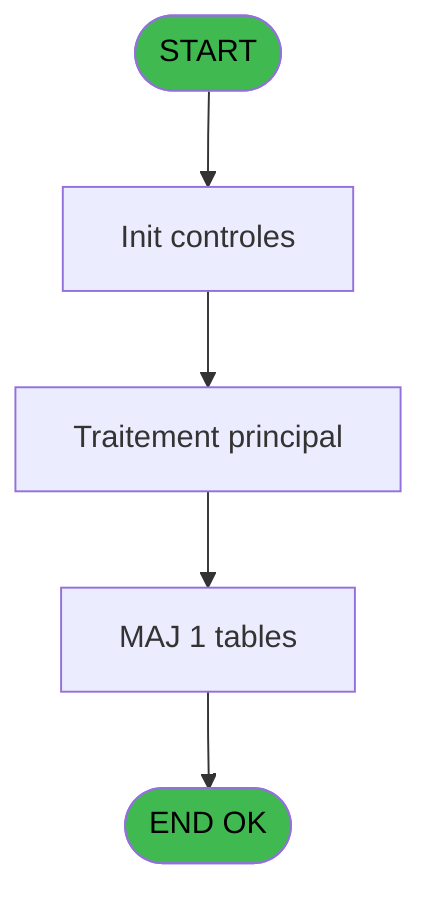
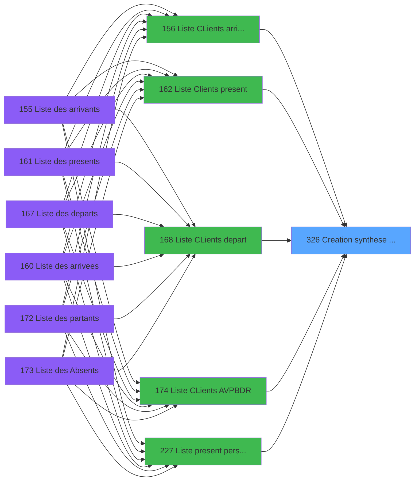
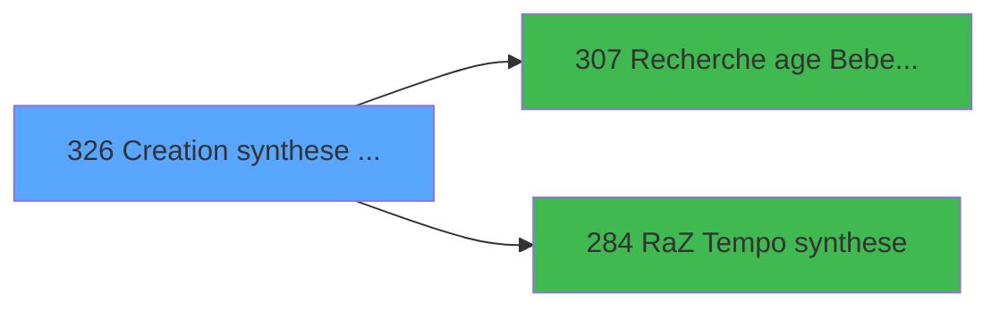

# PBP IDE 326 - Creation synthese present reel

> **Analyse**: Phases 1-4 2026-02-03 16:26 -> 16:26 (12s) | Assemblage 16:26
> **Pipeline**: V7.2 Enrichi
> **Structure**: 4 onglets (Resume | Ecrans | Donnees | Connexions)

<!-- TAB:Resume -->

## 1. FICHE D'IDENTITE

| Attribut | Valeur |
|----------|--------|
| Projet | PBP |
| IDE Position | 326 |
| Nom Programme | Creation synthese present reel |
| Fichier source | `Prg_326.xml` |
| Dossier IDE | Remplissage |
| Taches | 3 (1 ecrans visibles) |
| Tables modifiees | 1 |
| Programmes appeles | 2 |

## 2. DESCRIPTION FONCTIONNELLE

**Creation synthese present reel** assure la gestion complete de ce processus, accessible depuis [  Liste Clients present (IDE 162)](PBP-IDE-162.md), [Liste CLients AVPBDR (IDE 174)](PBP-IDE-174.md), [  Liste present personnel plan (IDE 227)](PBP-IDE-227.md), [  Liste personnels AVPBDR (IDE 234)](PBP-IDE-234.md), [  Liste CLients arrivant (IDE 156)](PBP-IDE-156.md), [  Liste CLients depart (IDE 168)](PBP-IDE-168.md).

Le flux de traitement s'organise en **2 blocs fonctionnels** :

- **Traitement** (2 taches) : traitements metier divers
- **Creation** (1 tache) : insertion d'enregistrements en base (mouvements, prestations)

**Donnees modifiees** : 1 tables en ecriture (tempo_users).

**Logique metier** : 1 regles identifiees couvrant conditions metier.

Detail : phases du traitement

#### Phase 1 : Traitement (2 taches)

- **326** - Veuillez patienter ... **[[ECRAN]](#ecran-t1)**
- **326.2** - Coche Jours

#### Phase 2 : Creation (1 tache)

- **326.1** - Creation Tempo

#### Tables impactees

| Table | Operations | Role metier |
|-------|-----------|-------------|
| tempo_users | **W**/L (2 usages) | Table temporaire ecran |

## 3. BLOCS FONCTIONNELS

### 3.1 Traitement (2 taches)

Traitements internes.

---

#### 326 - Veuillez patienter ... [[ECRAN]](#ecran-t1)

**Role** : Traitement : Veuillez patienter ....
**Ecran** : 424 x 56 DLU (MDI) | [Voir mockup](#ecran-t1)

---

#### 326.2 - Coche Jours

**Role** : Traitement : Coche Jours.

### 3.2 Creation (1 tache)

Insertion de nouveaux enregistrements en base.

---

#### 326.1 - Creation Tempo

**Role** : Creation d'enregistrement : Creation Tempo.

## 5. REGLES METIER

1 regles identifiees:

### Autres (1 regles)

#### [RM-001] Si [AC] alors [AI] sinon [AS])

| Element | Detail |
|---------|--------|
| **Condition** | `[AC]` |
| **Si vrai** | [AI] |
| **Si faux** | [AS]) |
| **Expression source** | Expression 50 : `IF ([AC],[AI],[AS])` |
| **Exemple** | Si [AC] → [AI]. Sinon → [AS]) |

## 6. CONTEXTE

- **Appele par**: [  Liste Clients present (IDE 162)](PBP-IDE-162.md), [Liste CLients AVPBDR (IDE 174)](PBP-IDE-174.md), [  Liste present personnel plan (IDE 227)](PBP-IDE-227.md), [  Liste personnels AVPBDR (IDE 234)](PBP-IDE-234.md), [  Liste CLients arrivant (IDE 156)](PBP-IDE-156.md), [  Liste CLients depart (IDE 168)](PBP-IDE-168.md)
- **Appelle**: 2 programmes | **Tables**: 9 (W:1 R:2 L:8) | **Taches**: 3 | **Expressions**: 58

<!-- TAB:Ecrans -->

## 8. ECRANS

### 8.1 Forms visibles (1 / 3)

| # | Position | Tache | Nom | Type | Largeur | Hauteur | Bloc |
|---|----------|-------|-----|------|---------|---------|------|
| 1 | 326 | 326 | Veuillez patienter ... | MDI | 424 | 56 | Traitement |

### 8.2 Mockups Ecrans

---

#### 326 - Veuillez patienter ...
**Tache** : [326](#t1) | **Type** : MDI | **Dimensions** : 424 x 56 DLU
**Bloc** : Traitement | **Titre IDE** : Veuillez patienter ...

<!-- FORM-DATA:
{
    "width":  424,
    "vFactor":  8,
    "type":  "MDI",
    "hFactor":  8,
    "controls":  [
                     {
                         "x":  0,
                         "type":  "label",
                         "var":  "",
                         "y":  0,
                         "w":  423,
                         "fmt":  "",
                         "name":  "",
                         "h":  29,
                         "color":  "",
                         "text":  "",
                         "parent":  null
                     },
                     {
                         "x":  120,
                         "type":  "label",
                         "var":  "",
                         "y":  10,
                         "w":  221,
                         "fmt":  "",
                         "name":  "",
                         "h":  8,
                         "color":  "7",
                         "text":  "Traitement en cours ...",
                         "parent":  null
                     },
                     {
                         "x":  0,
                         "type":  "label",
                         "var":  "",
                         "y":  29,
                         "w":  423,
                         "fmt":  "",
                         "name":  "",
                         "h":  27,
                         "color":  "",
                         "text":  "",
                         "parent":  null
                     },
                     {
                         "x":  110,
                         "type":  "label",
                         "var":  "",
                         "y":  32,
                         "w":  114,
                         "fmt":  "",
                         "name":  "",
                         "h":  8,
                         "color":  "",
                         "text":  "Analyses :",
                         "parent":  4
                     },
                     {
                         "x":  110,
                         "type":  "label",
                         "var":  "",
                         "y":  44,
                         "w":  139,
                         "fmt":  "",
                         "name":  "",
                         "h":  8,
                         "color":  "",
                         "text":  "Selectiones :",
                         "parent":  4
                     },
                     {
                         "x":  259,
                         "type":  "edit",
                         "var":  "",
                         "y":  32,
                         "w":  56,
                         "fmt":  "",
                         "name":  "",
                         "h":  9,
                         "color":  "",
                         "text":  "",
                         "parent":  4
                     },
                     {
                         "x":  259,
                         "type":  "edit",
                         "var":  "",
                         "y":  44,
                         "w":  56,
                         "fmt":  "",
                         "name":  "",
                         "h":  9,
                         "color":  "",
                         "text":  "",
                         "parent":  4
                     },
                     {
                         "x":  4,
                         "type":  "image",
                         "var":  "",
                         "y":  2,
                         "w":  72,
                         "fmt":  "",
                         "name":  "",
                         "h":  25,
                         "color":  "",
                         "text":  "",
                         "parent":  null
                     }
                 ],
    "taskId":  "326",
    "height":  56
}
-->

<strong>Champs : 2 champs</strong>

| Pos (x,y) | Nom | Variable | Type |
|-----------|-----|----------|------|
| 259,32 | (sans nom) | - | edit |
| 259,44 | (sans nom) | - | edit |

## 9. NAVIGATION

Ecran unique: **Veuillez patienter ...**

### 9.3 Structure hierarchique (3 taches)

| Position | Tache | Type | Dimensions | Bloc |
|----------|-------|------|------------|------|
| **326.1** | [**Veuillez patienter ...** (326)](#t1) [mockup](#ecran-t1) | MDI | 424x56 | Traitement |
| 326.1.1 | [Coche Jours (326.2)](#t3) | MDI | - | |
| **326.2** | [**Creation Tempo** (326.1)](#t2) | MDI | - | Creation |

### 9.4 Algorigramme

> **Legende**: Vert = START/END OK | Rouge = END KO | Bleu = Decisions
> *Algorigramme auto-genere. Utiliser `/algorigramme` pour une synthese metier detaillee.*

<!-- TAB:Donnees -->

## 10. TABLES

### Tables utilisees (9)

| ID | Nom | Description | Type | R | W | L | Usages |
|----|-----|-------------|------|---|---|---|--------|
| 31 | gm-complet_______gmc |  | DB |   |   | L | 1 |
| 34 | hebergement______heb | Hebergement (chambres) | DB |   |   | L | 1 |
| 35 | personnel_go______go |  | DB |   |   | L | 1 |
| 36 | client_gm |  | DB | R |   |   | 1 |
| 119 | tables_pays_tel_ |  | DB |   |   | L | 1 |
| 366 | pms_print_param |  | DB | R |   | L | 2 |
| 598 | tempo_ecr_previsions | Table temporaire ecran | TMP |   |   | L | 2 |
| 634 | tempo_users | Table temporaire ecran | DB |   | **W** | L | 2 |
| 637 | tempo_zone_secteur | Table temporaire ecran | DB |   |   | L | 1 |

### Colonnes par table (4 / 3 tables avec colonnes identifiees)

Table 36 - client_gm (R) - 1 usages

| Lettre | Variable | Acces | Type |
|--------|----------|-------|------|
| A | >DateCalcul | R | Date |
| B | >TypeHebergement | R | Alpha |
| C | >CodeListe | R | Alpha |
| D | >TopListe | R | Alpha |
| E | >Logement | R | Alpha |
| F | >HeurePresent | R | Alpha |
| G | >AgeMini | R | Numeric |
| H | >AgeMaxi | R | Numeric |
| I | <Total | R | Numeric |
| J | <NbSelect | R | Numeric |
| K | >Categorie(TUL) | R | Alpha |
| L | >NomTable | R | Alpha |
| M | > sejour | R | Alpha |
| N | > Lieu de sejour | R | Alpha |
| O | P.I.Enlever abs personnel | R | Logical |
| P | w0_RetGM----------------------- | R | Logical |
| Q | w0_RetGO----------------------- | R | Logical |
| R | w0_Vip_Blanche | R | Alpha |
| S | w0_Nationalite | R | Alpha |
| T | w0_DateDebut | R | Date |
| U | w0_DateFin | R | Date |
| V | w0RetCircuit | R | Logical |
| W | W0_Type | R | Alpha |
| X | w0_J | R | Logical |
| Y | w0_J+1 | R | Logical |
| Z | w0_J+2 | R | Logical |
| BA | w0_J+3 | R | Logical |
| BB | w0_J+4 | R | Logical |
| BC | w0_J+5 | R | Logical |
| BD | w0_J+6 | R | Logical |
| BE | w0_J+7 | R | Logical |
| BF | w0_J+8 | R | Logical |
| BG | w0_J+9 | R | Logical |
| BH | w0_J+10 | R | Logical |
| BI | w0_J+11 | R | Logical |
| BJ | w0_J+12 | R | Logical |
| BK | w0_J+13 | R | Logical |
| BL | w0_J+14 | R | Logical |
| BM | w0_AgeBebe | R | Numeric |
| BN | w0_AgeEnfant | R | Numeric |
| BO | w0_Total | R | Numeric |
| BP | w0_Select | R | Numeric |
| BQ | w0_Compteur_trace | R | Numeric |

Table 366 - pms_print_param (R/L) - 2 usages

| Lettre | Variable | Acces | Type |
|--------|----------|-------|------|
| A | W3-Date A | R | Date |
| B | W3-Date B | R | Date |
| C | n | R | Numeric |
| D | Message Oui NOn | R | Alpha |
| E | v.Retour abs personnel | R | Logical |
| F | v.Date/heure abs personnel | R | Numeric |
| G | v.Date/heure abs personnel | R | Numeric |

Table 634 - tempo_users (**W**/L) - 2 usages

*Table utilisee uniquement en Link ou aucune colonne Real identifiee dans le DataView.*

## 11. VARIABLES

### 11.1 Parametres entrants (1)

Variables recues du programme appelant ([  Liste Clients present (IDE 162)](PBP-IDE-162.md)).

| Lettre | Nom | Type | Usage dans |
|--------|-----|------|-----------|
| O | P.I.Enlever abs personnel | Logical | 1x parametre entrant |

### 11.2 Autres (42)

Variables diverses.

| Lettre | Nom | Type | Usage dans |
|--------|-----|------|-----------|
| A | >DateCalcul | Date | 1x refs |
| B | >TypeHebergement | Alpha | 2x refs |
| C | >CodeListe | Alpha | 2x refs |
| D | >TopListe | Alpha | 2x refs |
| E | >Logement | Alpha | 1x refs |
| F | >HeurePresent | Alpha | - |
| G | >AgeMini | Numeric | 1x refs |
| H | >AgeMaxi | Numeric | 1x refs |
| I | <Total | Numeric | 1x refs |
| J | <NbSelect | Numeric | 1x refs |
| K | >Categorie(TUL) | Alpha | 1x refs |
| L | >NomTable | Alpha | 1x refs |
| M | > sejour | Alpha | 1x refs |
| N | > Lieu de sejour | Alpha | 1x refs |
| P | w0_RetGM----------------------- | Logical | - |
| Q | w0_RetGO----------------------- | Logical | - |
| R | w0_Vip_Blanche | Alpha | - |
| S | w0_Nationalite | Alpha | - |
| T | w0_DateDebut | Date | - |
| U | w0_DateFin | Date | - |
| V | w0RetCircuit | Logical | 1x refs |
| W | W0_Type | Alpha | 2x refs |
| X | w0_J | Logical | 9x refs |
| Y | w0_J+1 | Logical | 1x refs |
| Z | w0_J+2 | Logical | - |
| BA | w0_J+3 | Logical | - |
| BB | w0_J+4 | Logical | - |
| BC | w0_J+5 | Logical | - |
| BD | w0_J+6 | Logical | 3x refs |
| BE | w0_J+7 | Logical | 1x refs |
| BF | w0_J+8 | Logical | 1x refs |
| BG | w0_J+9 | Logical | 1x refs |
| BH | w0_J+10 | Logical | - |
| BI | w0_J+11 | Logical | - |
| BJ | w0_J+12 | Logical | - |
| BK | w0_J+13 | Logical | - |
| BL | w0_J+14 | Logical | - |
| BM | w0_AgeBebe | Numeric | - |
| BN | w0_AgeEnfant | Numeric | - |
| BO | w0_Total | Numeric | 1x refs |
| BP | w0_Select | Numeric | - |
| BQ | w0_Compteur_trace | Numeric | - |

Toutes les 43 variables (liste complete)

| Cat | Lettre | Nom Variable | Type |
|-----|--------|--------------|------|
| P0 | **O** | P.I.Enlever abs personnel | Logical |
| Autre | **A** | >DateCalcul | Date |
| Autre | **B** | >TypeHebergement | Alpha |
| Autre | **C** | >CodeListe | Alpha |
| Autre | **D** | >TopListe | Alpha |
| Autre | **E** | >Logement | Alpha |
| Autre | **F** | >HeurePresent | Alpha |
| Autre | **G** | >AgeMini | Numeric |
| Autre | **H** | >AgeMaxi | Numeric |
| Autre | **I** | <Total | Numeric |
| Autre | **J** | <NbSelect | Numeric |
| Autre | **K** | >Categorie(TUL) | Alpha |
| Autre | **L** | >NomTable | Alpha |
| Autre | **M** | > sejour | Alpha |
| Autre | **N** | > Lieu de sejour | Alpha |
| Autre | **P** | w0_RetGM----------------------- | Logical |
| Autre | **Q** | w0_RetGO----------------------- | Logical |
| Autre | **R** | w0_Vip_Blanche | Alpha |
| Autre | **S** | w0_Nationalite | Alpha |
| Autre | **T** | w0_DateDebut | Date |
| Autre | **U** | w0_DateFin | Date |
| Autre | **V** | w0RetCircuit | Logical |
| Autre | **W** | W0_Type | Alpha |
| Autre | **X** | w0_J | Logical |
| Autre | **Y** | w0_J+1 | Logical |
| Autre | **Z** | w0_J+2 | Logical |
| Autre | **BA** | w0_J+3 | Logical |
| Autre | **BB** | w0_J+4 | Logical |
| Autre | **BC** | w0_J+5 | Logical |
| Autre | **BD** | w0_J+6 | Logical |
| Autre | **BE** | w0_J+7 | Logical |
| Autre | **BF** | w0_J+8 | Logical |
| Autre | **BG** | w0_J+9 | Logical |
| Autre | **BH** | w0_J+10 | Logical |
| Autre | **BI** | w0_J+11 | Logical |
| Autre | **BJ** | w0_J+12 | Logical |
| Autre | **BK** | w0_J+13 | Logical |
| Autre | **BL** | w0_J+14 | Logical |
| Autre | **BM** | w0_AgeBebe | Numeric |
| Autre | **BN** | w0_AgeEnfant | Numeric |
| Autre | **BO** | w0_Total | Numeric |
| Autre | **BP** | w0_Select | Numeric |
| Autre | **BQ** | w0_Compteur_trace | Numeric |

## 12. EXPRESSIONS

**58 / 58 expressions decodees (100%)**

### 12.1 Repartition par type

| Type | Expressions | Regles |
|------|-------------|--------|
| CALCULATION | 1 | 0 |
| CONDITION | 27 | 5 |
| CONSTANTE | 8 | 0 |
| OTHER | 18 | 0 |
| CAST_LOGIQUE | 2 | 0 |
| REFERENCE_VG | 1 | 0 |
| CONCATENATION | 1 | 0 |

### 12.2 Expressions cles par type

#### CALCULATION (1 expressions)

| Type | IDE | Expression | Regle |
|------|-----|------------|-------|
| CALCULATION | 14 | `[CN]+1` | - |

#### CONDITION (27 expressions)

| Type | IDE | Expression | Regle |
|------|-----|------------|-------|
| CONDITION | 50 | `IF ([AC],[AI],[AS])` | [RM-001](#rm-RM-001) |
| CONDITION | 37 | `[AM]>0 AND [AN]>[CM] OR ([GG]=0  AND [GH]=0)` | - |
| CONDITION | 39 | `w0_J+8 [BF]='O'` | - |
| CONDITION | 38 | `w0_J+7 [BE]='M'` | - |
| CONDITION | 23 | `>NomTable [L]` | - |
| ... | | *+22 autres* | |

#### CONSTANTE (8 expressions)

| Type | IDE | Expression | Regle |
|------|-----|------------|-------|
| CONSTANTE | 31 | `'C Singles'` | - |
| CONSTANTE | 30 | `'C Non Singles'` | - |
| CONSTANTE | 48 | `'C'` | - |
| CONSTANTE | 45 | `'E Circuits'` | - |
| CONSTANTE | 4 | `'VENFA'` | - |
| ... | | *+3 autres* | |

#### OTHER (18 expressions)

| Type | IDE | Expression | Regle |
|------|-----|------------|-------|
| OTHER | 32 | `MlsTrans ('G Bebes')` | - |
| OTHER | 33 | `MlsTrans ('G Enfants')` | - |
| OTHER | 25 | `w0_J+1 [Y]` | - |
| OTHER | 27 | `MlsTrans ('B Millesias')` | - |
| OTHER | 34 | `MlsTrans ('G Adultes')` | - |
| ... | | *+13 autres* | |

#### CAST_LOGIQUE (2 expressions)

| Type | IDE | Expression | Regle |
|------|-----|------------|-------|
| CAST_LOGIQUE | 56 | `'FALSE'LOG` | - |
| CAST_LOGIQUE | 5 | `'FALSE'LOG` | - |

#### REFERENCE_VG (1 expressions)

| Type | IDE | Expression | Regle |
|------|-----|------------|-------|
| REFERENCE_VG | 21 | `VG1` | - |

#### CONCATENATION (1 expressions)

| Type | IDE | Expression | Regle |
|------|-----|------------|-------|
| CONCATENATION | 29 | `'B '&IF ([AI]='O',MlsTrans ('Liste Blanche'),'Vip '&[AI])` | - |

### 12.3 Toutes les expressions (58)

Voir les 58 expressions

#### CALCULATION (1)

| IDE | Expression Decodee |
|-----|-------------------|
| 14 | `[CN]+1` |

#### CONDITION (27)

| IDE | Expression Decodee |
|-----|-------------------|
| 54 | `<Total [I]+1` |
| 55 | `<NbSelect [J]+1` |
| 50 | `IF ([AC],[AI],[AS])` |
| 51 | `IF ([AC],[AJ],[AT])` |
| 52 | `IF ([AC],[AK],[AU])` |
| 53 | `IF ([AC],[AL],[AV])` |
| 1 | `> Lieu de sejour [N]` |
| 6 | `>TopListe [D]='SY' AND >CodeListe [C]='P'` |
| 7 | `>TopListe [D]='SA' OR >CodeListe [C]<>'P'` |
| 8 | `w0_J [X]=>TypeHebergement [B] AND (w0RetCircuit [V]='P' AND [AK]<>DateCalcul [A] OR [AK]>=>DateCalcul [A])` |
| 13 | `>Logement [E]='' OR >Logement [E]=[AA]` |
| 16 | `w0_J+6 [BD]<>ASCIIChr (64)&ASCIIChr (64)` |
| 17 | `w0_J+6 [BD]=ASCIIChr (64)&ASCIIChr (64)` |
| 22 | `>Categorie(TUL) [K]` |
| 23 | `>NomTable [L]` |
| 35 | `[AM]>0 AND [AN]<=[CL] AND ([GG]>0 OR [GH]>0)` |
| 36 | `[AN]<=[CM] AND [AN]>[CL]` |
| 37 | `[AM]>0 AND [AN]>[CM] OR ([GG]=0  AND [GH]=0)` |
| 38 | `w0_J+7 [BE]='M'` |
| 39 | `w0_J+8 [BF]='O'` |
| 49 | `[GG]<=>AgeMaxi [H] AND (>AgeMini [G]<>0 AND [GG]>=>AgeMini [G] OR >AgeMini [G]=0 AND ([GG]>0 OR [GH]>0))` |
| 58 | `CndRange([GI]<>'',[GI])` |
| 26 | `'A Total '&Trim (>TypeHebergement [B])` |
| 40 | `InStr ('O12345',[AW])>0` |
| 41 | `Trim(MID (W0_Type [W],2,2))='1'` |
| 42 | `Trim (MID(W0_Type [W],2,2))<>'1'` |
| 57 | `> sejour [M]='' OR Trim (> sejour [M])=Trim ([AA])` |

#### CONSTANTE (8)

| IDE | Expression Decodee |
|-----|-------------------|
| 3 | `'VBEBE'` |
| 4 | `'VENFA'` |
| 12 | `'H'` |
| 28 | `'B Honey Moon'` |
| 30 | `'C Non Singles'` |
| 31 | `'C Singles'` |
| 45 | `'E Circuits'` |
| 48 | `'C'` |

#### OTHER (18)

| IDE | Expression Decodee |
|-----|-------------------|
| 2 | `GetParam('SOCIETE')` |
| 9 | `[BW] OR [BX] OR [BY] OR [BZ] OR [CA] OR [CB] OR [CC] OR [CD] OR [CE] OR [CF] OR [CG] OR [CH] OR [CI] OR [CJ] OR [CK]` |
| 10 | `P.I.Enlever abs personnel [O]` |
| 11 | `w0_RetGM--------------... [P]` |
| 15 | `GetParam ('LANGUE')` |
| 18 | `w0_J+9 [BG] AND [AC]` |
| 19 | `[AC]` |
| 20 | `w0_J+6 [BD]` |
| 24 | `w0_J [X]` |
| 25 | `w0_J+1 [Y]` |
| 27 | `MlsTrans ('B Millesias')` |
| 32 | `MlsTrans ('G Bebes')` |
| 33 | `MlsTrans ('G Enfants')` |
| 34 | `MlsTrans ('G Adultes')` |
| 43 | `'P '&w0_Total [BO]` |
| 44 | `MlsTrans ('P Non Renseigne')` |
| 46 | `'T '&[AB]` |
| 47 | `[AK]` |

#### CAST_LOGIQUE (2)

| IDE | Expression Decodee |
|-----|-------------------|
| 5 | `'FALSE'LOG` |
| 56 | `'FALSE'LOG` |

#### REFERENCE_VG (1)

| IDE | Expression Decodee |
|-----|-------------------|
| 21 | `VG1` |

#### CONCATENATION (1)

| IDE | Expression Decodee |
|-----|-------------------|
| 29 | `'B '&IF ([AI]='O',MlsTrans ('Liste Blanche'),'Vip '&[AI])` |

<!-- TAB:Connexions -->

## 13. GRAPHE D'APPELS

### 13.1 Chaine depuis Main (Callers)

Main -> ... -> [  Liste Clients present (IDE 162)](PBP-IDE-162.md) -> **Creation synthese present reel (IDE 326)**

Main -> ... -> [Liste CLients AVPBDR (IDE 174)](PBP-IDE-174.md) -> **Creation synthese present reel (IDE 326)**

Main -> ... -> [  Liste present personnel plan (IDE 227)](PBP-IDE-227.md) -> **Creation synthese present reel (IDE 326)**

Main -> ... -> [  Liste personnels AVPBDR (IDE 234)](PBP-IDE-234.md) -> **Creation synthese present reel (IDE 326)**

Main -> ... -> [  Liste CLients arrivant (IDE 156)](PBP-IDE-156.md) -> **Creation synthese present reel (IDE 326)**

Main -> ... -> [  Liste CLients depart (IDE 168)](PBP-IDE-168.md) -> **Creation synthese present reel (IDE 326)**

### 13.2 Callers

| IDE | Nom Programme | Nb Appels |
|-----|---------------|-----------|
| [162](PBP-IDE-162.md) |   Liste Clients present | 3 |
| [174](PBP-IDE-174.md) | Liste CLients AVPBDR | 3 |
| [227](PBP-IDE-227.md) |   Liste present personnel plan | 3 |
| [234](PBP-IDE-234.md) |   Liste personnels AVPBDR | 3 |
| [156](PBP-IDE-156.md) |   Liste CLients arrivant | 2 |
| [168](PBP-IDE-168.md) |   Liste CLients depart | 2 |

### 13.3 Callees (programmes appeles)

### 13.4 Detail Callees avec contexte

| IDE | Nom Programme | Appels | Contexte |
|-----|---------------|--------|----------|
| [307](PBP-IDE-307.md) | Recherche age Bebe_Enfant | 2 | Sous-programme |
| [284](PBP-IDE-284.md) | RaZ Tempo synthese | 1 | Reinitialisation |

## 14. RECOMMANDATIONS MIGRATION

### 14.1 Profil du programme

| Metrique | Valeur | Impact migration |
|----------|--------|-----------------|
| Lignes de logique | 383 | Taille moyenne |
| Expressions | 58 | Logique moderee |
| Tables WRITE | 1 | Impact faible |
| Sous-programmes | 2 | Peu de dependances |
| Ecrans visibles | 1 | Ecran unique ou traitement batch |
| Code desactive | 0% (0 / 383) | Code sain |
| Regles metier | 1 | Quelques regles a preserver |

### 14.2 Plan de migration par bloc

#### Traitement (2 taches: 1 ecran, 1 traitement)

- **Strategie** : Orchestrateur avec 1 ecrans (Razor/React) et 1 traitements backend (services).
- Les ecrans deviennent des composants UI, les traitements invisibles deviennent des services injectables.
- 2 sous-programme(s) a migrer ou a reutiliser depuis les services existants.
- Decomposer les taches en services unitaires testables.

#### Creation (1 tache: 0 ecran, 1 traitement)

- **Strategie** : Repository pattern avec Entity Framework Core.
- Insertion via `IRepository<T>.CreateAsync()`

### 14.3 Dependances critiques

| Dependance | Type | Appels | Impact |
|------------|------|--------|--------|
| tempo_users | Table WRITE (Database) | 1x | Schema + repository |
| [Recherche age Bebe_Enfant (IDE 307)](PBP-IDE-307.md) | Sous-programme | 2x | Haute - Sous-programme |
| [RaZ Tempo synthese (IDE 284)](PBP-IDE-284.md) | Sous-programme | 1x | Normale - Reinitialisation |

---
*Spec DETAILED generee par Pipeline V7.2 - 2026-02-03 16:26*
