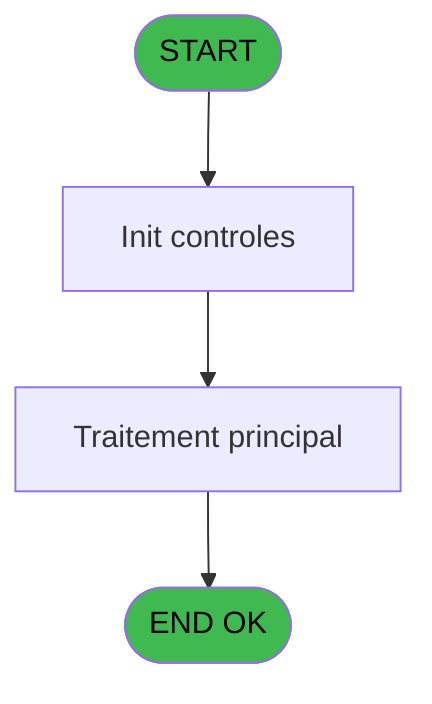
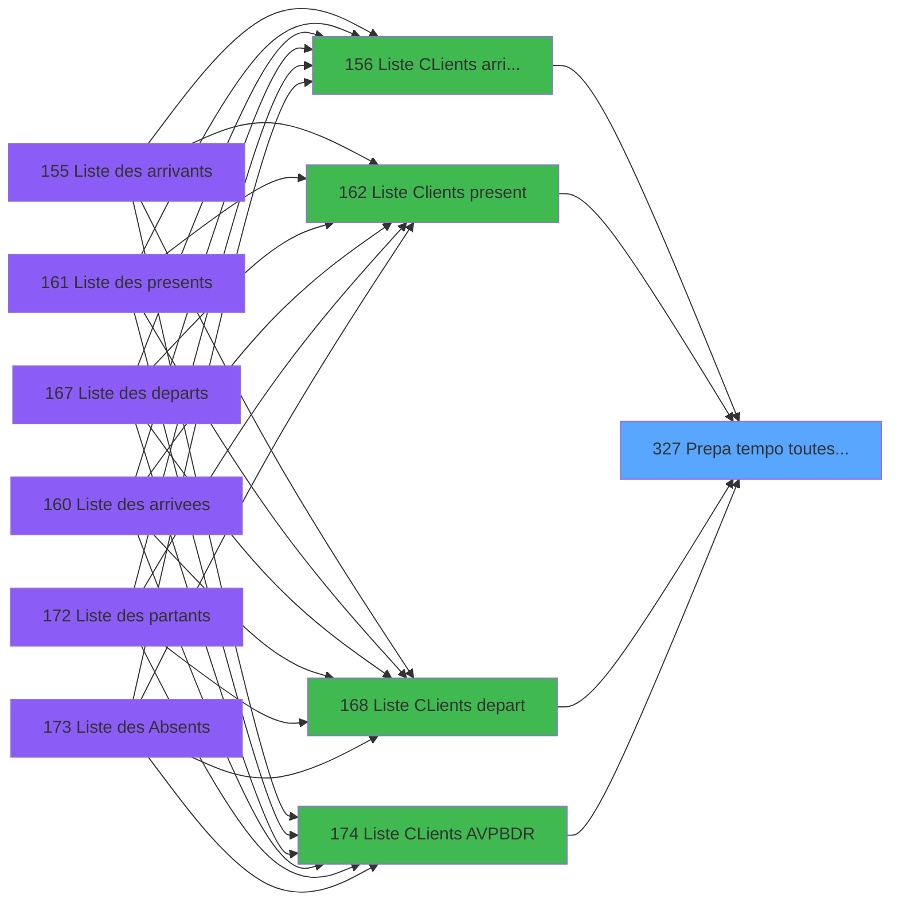
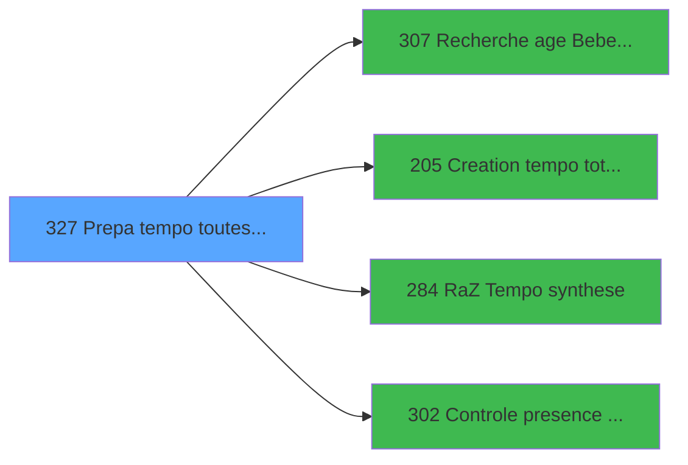

# PBP IDE 327 - Prepa tempo toutes GM CP SQL

> **Analyse**: Phases 1-4 2026-02-03 16:26 -> 16:26 (19s) | Assemblage 16:26
> **Pipeline**: V7.2 Enrichi
> **Structure**: 4 onglets (Resume | Ecrans | Donnees | Connexions)

<!-- TAB:Resume -->

## 1. FICHE D'IDENTITE

| Attribut | Valeur |
|----------|--------|
| Projet | PBP |
| IDE Position | 327 |
| Nom Programme | Prepa tempo toutes GM CP SQL |
| Fichier source | `Prg_327.xml` |
| Dossier IDE | Remplissage |
| Taches | 4 (1 ecrans visibles) |
| Tables modifiees | 0 |
| Programmes appeles | 4 |

## 2. DESCRIPTION FONCTIONNELLE

**Prepa tempo toutes GM CP SQL** assure la gestion complete de ce processus, accessible depuis [  Liste Clients present (IDE 162)](PBP-IDE-162.md), [  Liste CLients depart (IDE 168)](PBP-IDE-168.md), [Liste CLients AVPBDR (IDE 174)](PBP-IDE-174.md), [  Liste CLients arrivant (IDE 156)](PBP-IDE-156.md).

Le flux de traitement s'organise en **2 blocs fonctionnels** :

- **Creation** (2 taches) : insertion d'enregistrements en base (mouvements, prestations)
- **Traitement** (2 taches) : traitements metier divers

**Logique metier** : 5 regles identifiees couvrant conditions metier.

Detail : phases du traitement

#### Phase 1 : Traitement (2 taches)

- **327** - Veuillez patienter .... **[[ECRAN]](#ecran-t1)**
- **327.1** - Veuillez patienter .... **[[ECRAN]](#ecran-t2)**

#### Phase 2 : Creation (2 taches)

- **327.1.1** - Creation Tempo gene
- **327.1.2** - Creation tempo bateaux police

Delegue a : [Creation tempo total qualite (IDE 205)](PBP-IDE-205.md)

## 3. BLOCS FONCTIONNELS

### 3.1 Traitement (2 taches)

Traitements internes.

---

#### 327 - Veuillez patienter .... [[ECRAN]](#ecran-t1)

**Role** : Traitement : Veuillez patienter .....
**Ecran** : 424 x 56 DLU (MDI) | [Voir mockup](#ecran-t1)

---

#### 327.1 - Veuillez patienter .... [[ECRAN]](#ecran-t2)

**Role** : Traitement : Veuillez patienter .....
**Ecran** : 424 x 56 DLU (MDI) | [Voir mockup](#ecran-t2)

### 3.2 Creation (2 taches)

Insertion de nouveaux enregistrements en base.

---

#### 327.1.1 - Creation Tempo gene

**Role** : Creation d'enregistrement : Creation Tempo gene.
**Delegue a** : [Creation tempo total qualite (IDE 205)](PBP-IDE-205.md)

---

#### 327.1.2 - Creation tempo bateaux police

**Role** : Creation d'enregistrement : Creation tempo bateaux police.
**Delegue a** : [Creation tempo total qualite (IDE 205)](PBP-IDE-205.md)

## 5. REGLES METIER

5 regles identifiees:

### Autres (5 regles)

#### [RM-001] Si >DateMinDebut [D]>0 alors ' and [gm_date_debut]>='&''''&DStr(>DateMinDebut [D] sinon 'YYYYMMDD')&'''','')

| Element | Detail |
|---------|--------|
| **Condition** | `>DateMinDebut [D]>0` |
| **Si vrai** | ' and [gm_date_debut]>='&''''&DStr(>DateMinDebut [D] |
| **Si faux** | 'YYYYMMDD')&'''','') |
| **Variables** | D (>DateMinDebut), BB (gm_date_debut) |
| **Expression source** | Expression 12 : `IF(>DateMinDebut [D]>0,' and [gm_date_debut]>='&''''&DStr(>D` |
| **Exemple** | Si >DateMinDebut [D]>0 → ' and [gm_date_debut]>='&''''&DStr(>DateMinDebut [D]. Sinon → 'YYYYMMDD')&'''','') |

#### [RM-002] Si >DateMaxDebut [E]>0 alors ' and [gm_date_debut]<='&''''&DStr(>DateMaxDebut [E] sinon 'YYYYMMDD')&'''','')

| Element | Detail |
|---------|--------|
| **Condition** | `>DateMaxDebut [E]>0` |
| **Si vrai** | ' and [gm_date_debut]<='&''''&DStr(>DateMaxDebut [E] |
| **Si faux** | 'YYYYMMDD')&'''','') |
| **Variables** | E (>DateMaxDebut), BB (gm_date_debut) |
| **Expression source** | Expression 13 : `IF(>DateMaxDebut [E]>0,' and [gm_date_debut]<='&''''&DStr(>D` |
| **Exemple** | Si >DateMaxDebut [E]>0 → ' and [gm_date_debut]<='&''''&DStr(>DateMaxDebut [E]. Sinon → 'YYYYMMDD')&'''','') |

#### [RM-003] Si >DateMinFin [F]>0 alors ' and [gm_date_fin]>='&''''&DStr(>DateMinFin [F] sinon 'YYYYMMDD')&'''','')

| Element | Detail |
|---------|--------|
| **Condition** | `>DateMinFin [F]>0` |
| **Si vrai** | ' and [gm_date_fin]>='&''''&DStr(>DateMinFin [F] |
| **Si faux** | 'YYYYMMDD')&'''','') |
| **Variables** | F (>DateMinFin), BC (gm_date_fin) |
| **Expression source** | Expression 14 : `IF(>DateMinFin [F]>0,' and [gm_date_fin]>='&''''&DStr(>DateM` |
| **Exemple** | Si >DateMinFin [F]>0 → ' and [gm_date_fin]>='&''''&DStr(>DateMinFin [F]. Sinon → 'YYYYMMDD')&'''','') |

#### [RM-004] Si >DateMaxFin [G]>0 alors ' and [gm_date_fin]<='&''''&DStr(>DateMaxFin [G] sinon 'YYYYMMDD')&'''','')

| Element | Detail |
|---------|--------|
| **Condition** | `>DateMaxFin [G]>0` |
| **Si vrai** | ' and [gm_date_fin]<='&''''&DStr(>DateMaxFin [G] |
| **Si faux** | 'YYYYMMDD')&'''','') |
| **Variables** | G (>DateMaxFin), BC (gm_date_fin) |
| **Expression source** | Expression 15 : `IF(>DateMaxFin [G]>0,' and [gm_date_fin]<='&''''&DStr(>DateM` |
| **Exemple** | Si >DateMaxFin [G]>0 → ' and [gm_date_fin]<='&''''&DStr(>DateMaxFin [G]. Sinon → 'YYYYMMDD')&'''','') |

#### [RM-005] Si VG96 alors 'gmc_immatriculation' sinon '''''')

| Element | Detail |
|---------|--------|
| **Condition** | `VG96` |
| **Si vrai** | 'gmc_immatriculation' |
| **Si faux** | '''''') |
| **Variables** | CL (gmc_immatriculation) |
| **Expression source** | Expression 23 : `IF(VG96, 'gmc_immatriculation', '''''')` |
| **Exemple** | Si VG96 → 'gmc_immatriculation'. Sinon → '''''') |

## 6. CONTEXTE

- **Appele par**: [  Liste Clients present (IDE 162)](PBP-IDE-162.md), [  Liste CLients depart (IDE 168)](PBP-IDE-168.md), [Liste CLients AVPBDR (IDE 174)](PBP-IDE-174.md), [  Liste CLients arrivant (IDE 156)](PBP-IDE-156.md)
- **Appelle**: 4 programmes | **Tables**: 12 (W:0 R:4 L:8) | **Taches**: 4 | **Expressions**: 24

<!-- TAB:Ecrans -->

## 8. ECRANS

### 8.1 Forms visibles (1 / 4)

| # | Position | Tache | Nom | Type | Largeur | Hauteur | Bloc |
|---|----------|-------|-----|------|---------|---------|------|
| 1 | 327 | 327 | Veuillez patienter .... | MDI | 424 | 56 | Traitement |

### 8.2 Mockups Ecrans

---

#### 327 - Veuillez patienter ....
**Tache** : [327](#t1) | **Type** : MDI | **Dimensions** : 424 x 56 DLU
**Bloc** : Traitement | **Titre IDE** : Veuillez patienter ....

<!-- FORM-DATA:
{
    "width":  424,
    "vFactor":  8,
    "type":  "MDI",
    "hFactor":  8,
    "controls":  [
                     {
                         "x":  0,
                         "type":  "label",
                         "var":  "",
                         "y":  0,
                         "w":  423,
                         "fmt":  "",
                         "name":  "",
                         "h":  29,
                         "color":  "",
                         "text":  "",
                         "parent":  null
                     },
                     {
                         "x":  120,
                         "type":  "label",
                         "var":  "",
                         "y":  10,
                         "w":  221,
                         "fmt":  "",
                         "name":  "",
                         "h":  8,
                         "color":  "7",
                         "text":  "Traitement en cours ...",
                         "parent":  null
                     },
                     {
                         "x":  0,
                         "type":  "label",
                         "var":  "",
                         "y":  29,
                         "w":  423,
                         "fmt":  "",
                         "name":  "",
                         "h":  27,
                         "color":  "",
                         "text":  "",
                         "parent":  null
                     },
                     {
                         "x":  103,
                         "type":  "label",
                         "var":  "",
                         "y":  33,
                         "w":  114,
                         "fmt":  "",
                         "name":  "",
                         "h":  8,
                         "color":  "",
                         "text":  "Analyses :",
                         "parent":  4
                     },
                     {
                         "x":  103,
                         "type":  "label",
                         "var":  "",
                         "y":  44,
                         "w":  150,
                         "fmt":  "",
                         "name":  "",
                         "h":  8,
                         "color":  "",
                         "text":  "Selectionnes :",
                         "parent":  4
                     },
                     {
                         "x":  4,
                         "type":  "image",
                         "var":  "",
                         "y":  2,
                         "w":  72,
                         "fmt":  "",
                         "name":  "",
                         "h":  25,
                         "color":  "",
                         "text":  "",
                         "parent":  null
                     },
                     {
                         "x":  265,
                         "type":  "edit",
                         "var":  "",
                         "y":  31,
                         "w":  56,
                         "fmt":  "",
                         "name":  "",
                         "h":  9,
                         "color":  "",
                         "text":  "",
                         "parent":  4
                     },
                     {
                         "x":  265,
                         "type":  "edit",
                         "var":  "",
                         "y":  43,
                         "w":  56,
                         "fmt":  "",
                         "name":  "",
                         "h":  9,
                         "color":  "",
                         "text":  "",
                         "parent":  4
                     }
                 ],
    "taskId":  "327",
    "height":  56
}
-->

<strong>Champs : 2 champs</strong>

| Pos (x,y) | Nom | Variable | Type |
|-----------|-----|----------|------|
| 265,31 | (sans nom) | - | edit |
| 265,43 | (sans nom) | - | edit |

## 9. NAVIGATION

Ecran unique: **Veuillez patienter ....**

### 9.3 Structure hierarchique (4 taches)

| Position | Tache | Type | Dimensions | Bloc |
|----------|-------|------|------------|------|
| **327.1** | [**Veuillez patienter ....** (327)](#t1) [mockup](#ecran-t1) | MDI | 424x56 | Traitement |
| 327.1.1 | [Veuillez patienter .... (327.1)](#t2) [mockup](#ecran-t2) | MDI | 424x56 | |
| **327.2** | [**Creation Tempo gene** (327.1.1)](#t3) | MDI | - | Creation |
| 327.2.1 | [Creation tempo bateaux police (327.1.2)](#t4) | MDI | - | |

### 9.4 Algorigramme

> **Legende**: Vert = START/END OK | Rouge = END KO | Bleu = Decisions
> *Algorigramme auto-genere. Utiliser `/algorigramme` pour une synthese metier detaillee.*

<!-- TAB:Donnees -->

## 10. TABLES

### Tables utilisees (12)

| ID | Nom | Description | Type | R | W | L | Usages |
|----|-----|-------------|------|---|---|---|--------|
| 34 | hebergement______heb | Hebergement (chambres) | DB |   |   | L | 1 |
| 36 | client_gm |  | DB | R |   |   | 1 |
| 47 | compte_gm________cgm | Comptes GM (generaux) | DB |   |   | L | 1 |
| 104 | fichier_menage |  | DB |   |   | L | 1 |
| 167 | troncon__________tro |  | DB | R |   |   | 1 |
| 168 | heb_circuit______hci | Hebergement (chambres) | DB |   |   | L | 1 |
| 171 | commentaire______com |  | DB | R |   |   | 1 |
| 364 | pms_footer_comment |  | DB | R |   |   | 1 |
| 609 | tempo_mecano_dossier_grou | Table temporaire ecran | TMP |   |   | L | 2 |
| 619 | tempo_userlist | Table temporaire ecran | TMP |   |   | L | 2 |
| 637 | tempo_zone_secteur | Table temporaire ecran | DB |   |   | L | 2 |
| 806 | sale_channel |  | DB |   |   | L | 1 |

### Colonnes par table (10 / 4 tables avec colonnes identifiees)

Table 36 - client_gm (R) - 1 usages

| Lettre | Variable | Acces | Type |
|--------|----------|-------|------|
| A | v. cdrt | R | Logical |
| B | Ret Link 36 | R | Logical |
| C | e.Reponse? | R | Logical |

Table 167 - troncon__________tro (R) - 1 usages

| Lettre | Variable | Acces | Type |
|--------|----------|-------|------|
| A | v.Code vol aller A | R | Unicode |
| B | v.RetourTroncon? | R | Logical |
| C | v.DureeTransfert | R | Numeric |
| D | v.HeureArrivéVlg | R | Time |
| E | v.Code vol retour Z | R | Unicode |
| F | w0_Circuit--------------------- | R | Logical |
| G | w0_DepCircuit------------------ | R | Logical |
| H | w0_RetCircuit------------------ | R | Logical |
| I | W0_PresenceAv------------------ | R | Logical |
| J | w0_RetHebPreced---------------- | R | Logical |
| K | w0_RetHebSuiv------------------ | R | Logical |
| L | V.PYR ? | R | Logical |
| M | w0_Type | R | Alpha |
| N | w0_DateMaxDebut | R | Date |
| O | w0_DateMaxFin | R | Date |
| P | w0_Total | R | Numeric |
| Q | w0_NbSelect | R | Numeric |
| R | w0_RetCtlHeb | R | Logical |
| S | w0_TelInt | R | Numeric |
| T | w0_TelExt_Commune | R | Alpha |
| U | w0_FaxVille | R | Alpha |
| V | w0_TypeEcran | R | Alpha |
| W | w0_NumAdherent | R | Alpha |
| X | w0_Age | R | Numeric |
| Y | w0_Cabine | R | Alpha |
| Z | W0_RetourCircuit | R | Alpha |
| BA | w0_CondArrivant | R | Logical |
| BB | w0_CondArrive | R | Logical |
| BC | W0_CondPresent | R | Logical |
| BD | w0_CondDepart | R | Logical |
| BE | w0_CondAbsent | R | Logical |
| BF | w0_CondPartant | R | Logical |
| BG | v.Condition création tempo ? | R | Logical |

Table 171 - commentaire______com (R) - 1 usages

| Lettre | Variable | Acces | Type |
|--------|----------|-------|------|
| BB | gm_date_debut | R | Date |
| BC | gm_date_fin | R | Date |

Table 364 - pms_footer_comment (R) - 1 usages

| Lettre | Variable | Acces | Type |
|--------|----------|-------|------|
| CI | w0_RetCommentaire | R | Logical |

## 11. VARIABLES

### 11.1 Autres (68)

Variables diverses.

| Lettre | Nom | Type | Usage dans |
|--------|-----|------|-----------|
| A | >Index | Numeric | - |
| B | >DateCalcul | Date | - |
| C | >HeureCalcul | Alpha | - |
| D | >DateMinDebut | Date | 1x refs |
| E | >DateMaxDebut | Date | 1x refs |
| F | >DateMinFin | Date | 1x refs |
| G | >DateMaxFin | Date | 1x refs |
| H | >w0_HeureMin | Numeric | - |
| I | >w0_HeureMax | Numeric | - |
| J | >CodeListe | Alpha | - |
| K | >Logement | Alpha | - |
| L | >TypeHebergement | Alpha | - |
| M | >TopListe | Alpha | 2x refs |
| N | >CodeVol | Alpha | - |
| O | >DateVillage | Date | - |
| P | >HeureVillage | Alpha | - |
| Q | >AgeMini | Numeric | - |
| R | >AgeMaxi | Numeric | - |
| S | <Total | Numeric | - |
| T | <NbSelect | Numeric | - |
| U | >TULCategorie | Alpha | - |
| V | >TULNomTable | Alpha | - |
| W | >sejour | Alpha | - |
| X | >Soldé,Non_soldé,Tous | Unicode | 1x refs |
| Y | gm_societe | Unicode | - |
| Z | SQL date debut | Alpha | - |
| BA | SQL date fin | Alpha | - |
| BB | gm_date_debut | Date | 2x refs |
| BC | gm_date_fin | Date | 2x refs |
| BD | gm_nom | Unicode | - |
| BE | gm_prenom | Unicode | 1x refs |
| BF | gm_sexe | Unicode | - |
| BG | gm_type_client | Unicode | - |
| BH | gm_num_club | Numeric | - |
| BI | gm_lettre_controle | Unicode | - |
| BJ | gm_filiation_club | Numeric | - |
| BK | gm_code_fidelite | Unicode | - |
| BL | gm_liste_blanche | Unicode | - |
| BM | gm_age | Numeric | - |
| BN | SQL date naissance | Alpha | - |
| BO | gm_date_naissance | Date | - |
| BP | gm_nationalite | Alpha | - |
| BQ | gm_compte | Numeric | - |
| BR | gm_filiation | Numeric | - |
| BS | gmc_code_nationalite | Unicode | - |
| BT | gmc_profession | Unicode | - |
| BU | gmc_numero_piece | Unicode | - |
| BV | SQL date delivrance | Alpha | - |
| BW | gmc_date_delivrance | Date | - |
| BX | gmc_ville_delivrance | Unicode | - |
| BY | gmc_honey | Unicode | - |
| BZ | gmc_nom_commune | Unicode | - |
| CA | gmc_ville_bureau_dis | Unicode | - |
| CB | gmc_code_postal | Unicode | - |
| CC | gmc_etat_province | Unicode | - |
| CD | gmc_num_dans_la_rue | Unicode | - |
| CE | gmc_nom_de_la_rue | Unicode | - |
| CF | gmc_code_inscription | Unicode | - |
| CG | gmc_code_vente | Unicode | - |
| CH | pay_code_nationalite | Unicode | - |
| CI | w0_RetCommentaire | Logical | - |
| CJ | libelle nationnalié | Unicode | - |
| CK | gmc_pays_naissance | Unicode | - |
| CL | gmc_immatriculation | Unicode | 1x refs |
| CM | gmc_cni | Unicode | - |
| CN | w0_NationSelect | Alpha | - |
| CO | w0_AgeBebe | Numeric | - |
| CP | w0_AgeEnfant | Numeric | - |

Toutes les 68 variables (liste complete)

| Cat | Lettre | Nom Variable | Type |
|-----|--------|--------------|------|
| Autre | **A** | >Index | Numeric |
| Autre | **B** | >DateCalcul | Date |
| Autre | **C** | >HeureCalcul | Alpha |
| Autre | **D** | >DateMinDebut | Date |
| Autre | **E** | >DateMaxDebut | Date |
| Autre | **F** | >DateMinFin | Date |
| Autre | **G** | >DateMaxFin | Date |
| Autre | **H** | >w0_HeureMin | Numeric |
| Autre | **I** | >w0_HeureMax | Numeric |
| Autre | **J** | >CodeListe | Alpha |
| Autre | **K** | >Logement | Alpha |
| Autre | **L** | >TypeHebergement | Alpha |
| Autre | **M** | >TopListe | Alpha |
| Autre | **N** | >CodeVol | Alpha |
| Autre | **O** | >DateVillage | Date |
| Autre | **P** | >HeureVillage | Alpha |
| Autre | **Q** | >AgeMini | Numeric |
| Autre | **R** | >AgeMaxi | Numeric |
| Autre | **S** | <Total | Numeric |
| Autre | **T** | <NbSelect | Numeric |
| Autre | **U** | >TULCategorie | Alpha |
| Autre | **V** | >TULNomTable | Alpha |
| Autre | **W** | >sejour | Alpha |
| Autre | **X** | >Soldé,Non_soldé,Tous | Unicode |
| Autre | **Y** | gm_societe | Unicode |
| Autre | **Z** | SQL date debut | Alpha |
| Autre | **BA** | SQL date fin | Alpha |
| Autre | **BB** | gm_date_debut | Date |
| Autre | **BC** | gm_date_fin | Date |
| Autre | **BD** | gm_nom | Unicode |
| Autre | **BE** | gm_prenom | Unicode |
| Autre | **BF** | gm_sexe | Unicode |
| Autre | **BG** | gm_type_client | Unicode |
| Autre | **BH** | gm_num_club | Numeric |
| Autre | **BI** | gm_lettre_controle | Unicode |
| Autre | **BJ** | gm_filiation_club | Numeric |
| Autre | **BK** | gm_code_fidelite | Unicode |
| Autre | **BL** | gm_liste_blanche | Unicode |
| Autre | **BM** | gm_age | Numeric |
| Autre | **BN** | SQL date naissance | Alpha |
| Autre | **BO** | gm_date_naissance | Date |
| Autre | **BP** | gm_nationalite | Alpha |
| Autre | **BQ** | gm_compte | Numeric |
| Autre | **BR** | gm_filiation | Numeric |
| Autre | **BS** | gmc_code_nationalite | Unicode |
| Autre | **BT** | gmc_profession | Unicode |
| Autre | **BU** | gmc_numero_piece | Unicode |
| Autre | **BV** | SQL date delivrance | Alpha |
| Autre | **BW** | gmc_date_delivrance | Date |
| Autre | **BX** | gmc_ville_delivrance | Unicode |
| Autre | **BY** | gmc_honey | Unicode |
| Autre | **BZ** | gmc_nom_commune | Unicode |
| Autre | **CA** | gmc_ville_bureau_dis | Unicode |
| Autre | **CB** | gmc_code_postal | Unicode |
| Autre | **CC** | gmc_etat_province | Unicode |
| Autre | **CD** | gmc_num_dans_la_rue | Unicode |
| Autre | **CE** | gmc_nom_de_la_rue | Unicode |
| Autre | **CF** | gmc_code_inscription | Unicode |
| Autre | **CG** | gmc_code_vente | Unicode |
| Autre | **CH** | pay_code_nationalite | Unicode |
| Autre | **CI** | w0_RetCommentaire | Logical |
| Autre | **CJ** | libelle nationnalié | Unicode |
| Autre | **CK** | gmc_pays_naissance | Unicode |
| Autre | **CL** | gmc_immatriculation | Unicode |
| Autre | **CM** | gmc_cni | Unicode |
| Autre | **CN** | w0_NationSelect | Alpha |
| Autre | **CO** | w0_AgeBebe | Numeric |
| Autre | **CP** | w0_AgeEnfant | Numeric |

## 12. EXPRESSIONS

**24 / 24 expressions decodees (100%)**

### 12.1 Repartition par type

| Type | Expressions | Regles |
|------|-------------|--------|
| CONDITION | 8 | 5 |
| CONSTANTE | 5 | 0 |
| DATE | 4 | 0 |
| OTHER | 6 | 0 |
| REFERENCE_VG | 1 | 0 |

### 12.2 Expressions cles par type

#### CONDITION (8 expressions)

| Type | IDE | Expression | Regle |
|------|-----|------------|-------|
| CONDITION | 15 | `IF(>DateMaxFin [G]>0,' and [gm_date_fin]<='&''''&DStr(>DateMaxFin [G],'YYYYMMDD')&'''','')` | [RM-004](#rm-RM-004) |
| CONDITION | 23 | `IF(VG96, 'gmc_immatriculation', '''''')` | [RM-005](#rm-RM-005) |
| CONDITION | 14 | `IF(>DateMinFin [F]>0,' and [gm_date_fin]>='&''''&DStr(>DateMinFin [F],'YYYYMMDD')&'''','')` | [RM-003](#rm-RM-003) |
| CONDITION | 12 | `IF(>DateMinDebut [D]>0,' and [gm_date_debut]>='&''''&DStr(>DateMinDebut [D],'YYYYMMDD')&'''','')` | [RM-001](#rm-RM-001) |
| CONDITION | 13 | `IF(>DateMaxDebut [E]>0,' and [gm_date_debut]<='&''''&DStr(>DateMaxDebut [E],'YYYYMMDD')&'''','')` | [RM-002](#rm-RM-002) |
| ... | | *+3 autres* | |

#### CONSTANTE (5 expressions)

| Type | IDE | Expression | Regle |
|------|-----|------------|-------|
| CONSTANTE | 6 | `'TNATI'` | - |
| CONSTANTE | 7 | `0` | - |
| CONSTANTE | 5 | `'M'` | - |
| CONSTANTE | 1 | `'VBEBE'` | - |
| CONSTANTE | 2 | `'VENFA'` | - |

#### DATE (4 expressions)

| Type | IDE | Expression | Regle |
|------|-----|------------|-------|
| DATE | 18 | `DVal([FR],'YYYYMMDD')` | - |
| DATE | 19 | `DVal([FT],'YYYYMMDD')` | - |
| DATE | 16 | `DVal([FP],'YYYYMMDD')` | - |
| DATE | 17 | `DVal([FQ],'YYYYMMDD')` | - |

#### OTHER (6 expressions)

| Type | IDE | Expression | Regle |
|------|-----|------------|-------|
| OTHER | 20 | `[AM]` | - |
| OTHER | 21 | `[AN]` | - |
| OTHER | 24 | `{1,24}` | - |
| OTHER | 3 | `gm_prenom [BE]` | - |
| OTHER | 10 | `GetParam('SOCIETE')` | - |
| ... | | *+1 autres* | |

#### REFERENCE_VG (1 expressions)

| Type | IDE | Expression | Regle |
|------|-----|------------|-------|
| REFERENCE_VG | 4 | `VG1` | - |

### 12.3 Toutes les expressions (24)

Voir les 24 expressions

#### CONDITION (8)

| IDE | Expression Decodee |
|-----|-------------------|
| 12 | `IF(>DateMinDebut [D]>0,' and [gm_date_debut]>='&''''&DStr(>DateMinDebut [D],'YYYYMMDD')&'''','')` |
| 13 | `IF(>DateMaxDebut [E]>0,' and [gm_date_debut]<='&''''&DStr(>DateMaxDebut [E],'YYYYMMDD')&'''','')` |
| 14 | `IF(>DateMinFin [F]>0,' and [gm_date_fin]>='&''''&DStr(>DateMinFin [F],'YYYYMMDD')&'''','')` |
| 15 | `IF(>DateMaxFin [G]>0,' and [gm_date_fin]<='&''''&DStr(>DateMaxFin [G],'YYYYMMDD')&'''','')` |
| 23 | `IF(VG96, 'gmc_immatriculation', '''''')` |
| 8 | `>Soldé,Non_soldé,Tous [X]` |
| 9 | `>TopListe [M]='ST'` |
| 22 | `>TopListe [M]='CO'` |

#### CONSTANTE (5)

| IDE | Expression Decodee |
|-----|-------------------|
| 1 | `'VBEBE'` |
| 2 | `'VENFA'` |
| 5 | `'M'` |
| 6 | `'TNATI'` |
| 7 | `0` |

#### DATE (4)

| IDE | Expression Decodee |
|-----|-------------------|
| 16 | `DVal([FP],'YYYYMMDD')` |
| 17 | `DVal([FQ],'YYYYMMDD')` |
| 18 | `DVal([FR],'YYYYMMDD')` |
| 19 | `DVal([FT],'YYYYMMDD')` |

#### OTHER (6)

| IDE | Expression Decodee |
|-----|-------------------|
| 3 | `gm_prenom [BE]` |
| 10 | `GetParam('SOCIETE')` |
| 11 | `Left(GetParam('LANGUE'),1)` |
| 20 | `[AM]` |
| 21 | `[AN]` |
| 24 | `{1,24}` |

#### REFERENCE_VG (1)

| IDE | Expression Decodee |
|-----|-------------------|
| 4 | `VG1` |

<!-- TAB:Connexions -->

## 13. GRAPHE D'APPELS

### 13.1 Chaine depuis Main (Callers)

Main -> ... -> [  Liste Clients present (IDE 162)](PBP-IDE-162.md) -> **Prepa tempo toutes GM CP SQL (IDE 327)**

Main -> ... -> [  Liste CLients depart (IDE 168)](PBP-IDE-168.md) -> **Prepa tempo toutes GM CP SQL (IDE 327)**

Main -> ... -> [Liste CLients AVPBDR (IDE 174)](PBP-IDE-174.md) -> **Prepa tempo toutes GM CP SQL (IDE 327)**

Main -> ... -> [  Liste CLients arrivant (IDE 156)](PBP-IDE-156.md) -> **Prepa tempo toutes GM CP SQL (IDE 327)**

### 13.2 Callers

| IDE | Nom Programme | Nb Appels |
|-----|---------------|-----------|
| [162](PBP-IDE-162.md) |   Liste Clients present | 3 |
| [168](PBP-IDE-168.md) |   Liste CLients depart | 3 |
| [174](PBP-IDE-174.md) | Liste CLients AVPBDR | 3 |
| [156](PBP-IDE-156.md) |   Liste CLients arrivant | 2 |

### 13.3 Callees (programmes appeles)

### 13.4 Detail Callees avec contexte

| IDE | Nom Programme | Appels | Contexte |
|-----|---------------|--------|----------|
| [307](PBP-IDE-307.md) | Recherche age Bebe_Enfant | 2 | Sous-programme |
| [205](PBP-IDE-205.md) | Creation tempo total qualite | 1 | Sous-programme |
| [284](PBP-IDE-284.md) | RaZ Tempo synthese | 1 | Reinitialisation |
| [302](PBP-IDE-302.md) | Controle presence heberg | 1 | Controle/validation |

## 14. RECOMMANDATIONS MIGRATION

### 14.1 Profil du programme

| Metrique | Valeur | Impact migration |
|----------|--------|-----------------|
| Lignes de logique | 790 | Programme volumineux |
| Expressions | 24 | Peu de logique |
| Tables WRITE | 0 | Impact faible |
| Sous-programmes | 4 | Peu de dependances |
| Ecrans visibles | 1 | Ecran unique ou traitement batch |
| Code desactive | 0% (0 / 790) | Code sain |
| Regles metier | 5 | Quelques regles a preserver |

### 14.2 Plan de migration par bloc

#### Traitement (2 taches: 2 ecrans, 0 traitement)

- **Strategie** : 2 composant(s) UI (Razor/React) avec formulaires et validation.
- 4 sous-programme(s) a migrer ou a reutiliser depuis les services existants.
- Decomposer les taches en services unitaires testables.

#### Creation (2 taches: 0 ecran, 2 traitements)

- **Strategie** : Repository pattern avec Entity Framework Core.
- Insertion via `IRepository<T>.CreateAsync()`

### 14.3 Dependances critiques

| Dependance | Type | Appels | Impact |
|------------|------|--------|--------|
| [Recherche age Bebe_Enfant (IDE 307)](PBP-IDE-307.md) | Sous-programme | 2x | Haute - Sous-programme |
| [Controle presence heberg (IDE 302)](PBP-IDE-302.md) | Sous-programme | 1x | Normale - Controle/validation |
| [RaZ Tempo synthese (IDE 284)](PBP-IDE-284.md) | Sous-programme | 1x | Normale - Reinitialisation |
| [Creation tempo total qualite (IDE 205)](PBP-IDE-205.md) | Sous-programme | 1x | Normale - Sous-programme |

---
*Spec DETAILED generee par Pipeline V7.2 - 2026-02-03 16:26*
