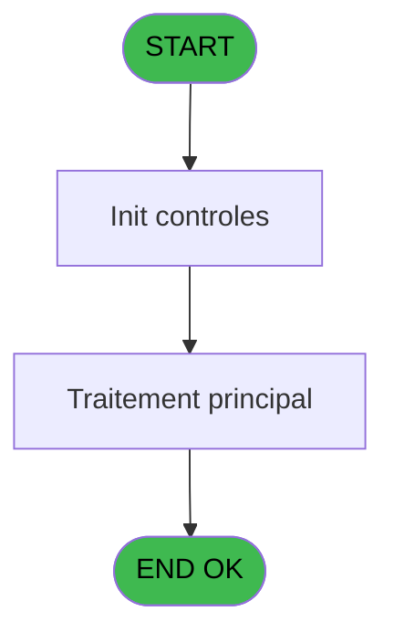
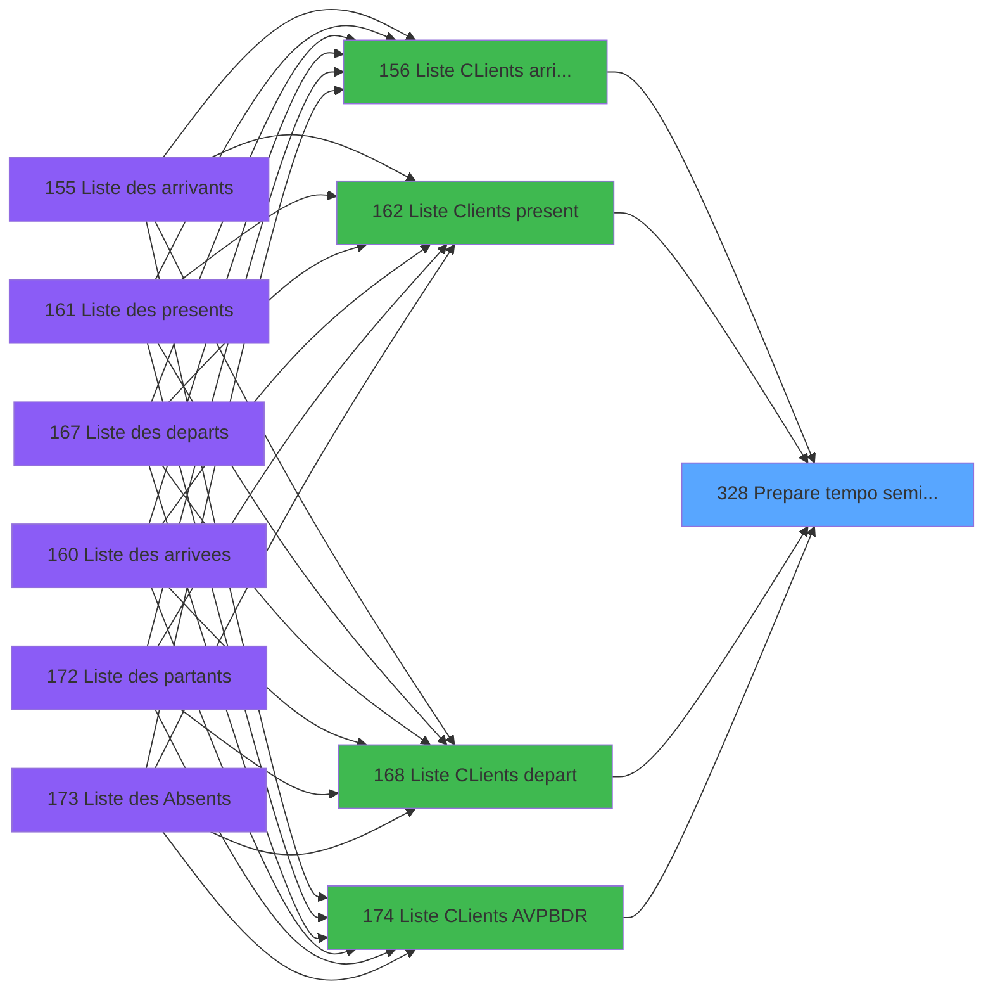
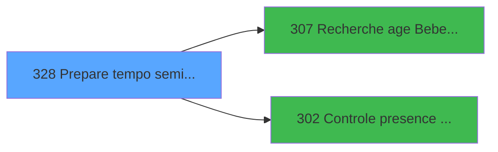

# PBP IDE 328 - Prepare tempo seminaire

> **Analyse**: Phases 1-4 2026-02-03 16:27 -> 16:27 (19s) | Assemblage 16:27
> **Pipeline**: V7.2 Enrichi
> **Structure**: 4 onglets (Resume | Ecrans | Donnees | Connexions)

<!-- TAB:Resume -->

## 1. FICHE D'IDENTITE

| Attribut | Valeur |
|----------|--------|
| Projet | PBP |
| IDE Position | 328 |
| Nom Programme | Prepare tempo seminaire |
| Fichier source | `Prg_328.xml` |
| Dossier IDE | Remplissage |
| Taches | 2 (0 ecrans visibles) |
| Tables modifiees | 0 |
| Programmes appeles | 2 |

## 2. DESCRIPTION FONCTIONNELLE

**Prepare tempo seminaire** assure la gestion complete de ce processus, accessible depuis [  Liste Clients present (IDE 162)](PBP-IDE-162.md), [  Liste CLients depart (IDE 168)](PBP-IDE-168.md), [Liste CLients AVPBDR (IDE 174)](PBP-IDE-174.md), [  Liste CLients arrivant (IDE 156)](PBP-IDE-156.md).

Le flux de traitement s'organise en **2 blocs fonctionnels** :

- **Creation** (1 tache) : insertion d'enregistrements en base (mouvements, prestations)
- **Traitement** (1 tache) : traitements metier divers

**Logique metier** : 2 regles identifiees couvrant conditions metier.

Detail : phases du traitement

#### Phase 1 : Traitement (1 tache)

- **328** - Impression Planning **[[ECRAN]](#ecran-t1)**

#### Phase 2 : Creation (1 tache)

- **328.1** - Creation Tempo gene

## 3. BLOCS FONCTIONNELS

### 3.1 Traitement (1 tache)

Traitements internes.

---

#### 328 - Impression Planning [[ECRAN]](#ecran-t1)

**Role** : Generation du document : Impression Planning.
**Ecran** : 424 x 56 DLU (MDI) | [Voir mockup](#ecran-t1)

### 3.2 Creation (1 tache)

Insertion de nouveaux enregistrements en base.

---

#### 328.1 - Creation Tempo gene

**Role** : Creation d'enregistrement : Creation Tempo gene.

## 5. REGLES METIER

2 regles identifiees:

### Autres (2 regles)

#### [RM-001] Si >DateDebSeminaire [D]<>'01/01/1901'DATE alors >DateDebSeminaire [D] sinon [GT])

| Element | Detail |
|---------|--------|
| **Condition** | `>DateDebSeminaire [D]<>'01/01/1901'DATE` |
| **Si vrai** | >DateDebSeminaire [D] |
| **Si faux** | [GT]) |
| **Variables** | D (>DateDebSeminaire) |
| **Expression source** | Expression 4 : `IF(>DateDebSeminaire [D]<>'01/01/1901'DATE,>DateDebSeminaire` |
| **Exemple** | Si >DateDebSeminaire [D]<>'01/01/1901'DATE → >DateDebSeminaire [D]. Sinon → [GT]) |

#### [RM-002] Si InStr ('AVB' alors >DatePresSeminaire [E])>0 sinon [AS],IF (>DatePresSeminaire [E]='P',[BH],[BU]))

| Element | Detail |
|---------|--------|
| **Condition** | `InStr ('AVB'` |
| **Si vrai** | >DatePresSeminaire [E])>0 |
| **Si faux** | [AS],IF (>DatePresSeminaire [E]='P',[BH],[BU])) |
| **Variables** | E (>DatePresSeminaire) |
| **Expression source** | Expression 23 : `IF (InStr ('AVB',>DatePresSeminaire [E])>0,[AS],IF (>DatePre` |
| **Exemple** | Si InStr ('AVB' → >DatePresSeminaire [E])>0. Sinon → [AS],IF (>DatePresSeminaire [E]='P',[BH],[BU])) |

## 6. CONTEXTE

- **Appele par**: [  Liste Clients present (IDE 162)](PBP-IDE-162.md), [  Liste CLients depart (IDE 168)](PBP-IDE-168.md), [Liste CLients AVPBDR (IDE 174)](PBP-IDE-174.md), [  Liste CLients arrivant (IDE 156)](PBP-IDE-156.md)
- **Appelle**: 2 programmes | **Tables**: 7 (W:0 R:2 L:6) | **Taches**: 2 | **Expressions**: 40

<!-- TAB:Ecrans -->

## 8. ECRANS

*(Programme sans ecran visible)*

## 9. NAVIGATION

### 9.3 Structure hierarchique (2 taches)

| Position | Tache | Type | Dimensions | Bloc |
|----------|-------|------|------------|------|
| **328.1** | [**Impression Planning** (328)](#t1) [mockup](#ecran-t1) | MDI | 424x56 | Traitement |
| **328.2** | [**Creation Tempo gene** (328.1)](#t2) | MDI | - | Creation |

### 9.4 Algorigramme

> **Legende**: Vert = START/END OK | Rouge = END KO | Bleu = Decisions
> *Algorigramme auto-genere. Utiliser `/algorigramme` pour une synthese metier detaillee.*

<!-- TAB:Donnees -->

## 10. TABLES

### Tables utilisees (7)

| ID | Nom | Description | Type | R | W | L | Usages |
|----|-----|-------------|------|---|---|---|--------|
| 34 | hebergement______heb | Hebergement (chambres) | DB | R |   |   | 1 |
| 36 | client_gm |  | DB | R |   | L | 2 |
| 47 | compte_gm________cgm | Comptes GM (generaux) | DB |   |   | L | 1 |
| 131 | fichier_validation |  | DB |   |   | L | 1 |
| 598 | tempo_ecr_previsions | Table temporaire ecran | TMP |   |   | L | 2 |
| 619 | tempo_userlist | Table temporaire ecran | TMP |   |   | L | 2 |
| 637 | tempo_zone_secteur | Table temporaire ecran | DB |   |   | L | 1 |

### Colonnes par table (1 / 2 tables avec colonnes identifiees)

Table 34 - hebergement______heb (R) - 1 usages

| Lettre | Variable | Acces | Type |
|--------|----------|-------|------|
| A | >NomSeminaire | R | Alpha |
| B | >DateCalcul | R | Date |
| C | >Heure de calcul | R | Alpha |
| D | >DateDebSeminaire | R | Date |
| E | >DatePresSeminaire | R | Date |
| F | >CodeListe | R | Alpha |
| G | >CodeLogement | R | Alpha |
| H | >Categorie(TUL) | R | Alpha |
| I | >NomTable(TUL) | R | Alpha |
| J | >Soldé,Non_soldé,Tous | R | Unicode |
| K | <Total | R | Numeric |
| L | <NbSelect | R | Numeric |
| M | > sejour | R | Alpha |
| N | w0_VariaDate | R | Numeric |
| O | W2-Nom Import | R | Alpha |
| P | PremierLogement--------------- | R | Alpha |
| Q | HebMilieu---------------------- | R | Alpha |
| R | DernLogement------------------- | R | Alpha |
| S | W2-Retour Circuit-------------- | R | Logical |
| T | w0RetSelect | R | Logical |
| U | w0RetcodelogeSelect | R | Logical |
| V | w0_AgeBebe | R | Numeric |
| W | w0_AgeEnfant | R | Numeric |
| X | W0-Presence | R | Logical |

Table 36 - client_gm (R/L) - 2 usages

*Table utilisee uniquement en Link ou aucune colonne Real identifiee dans le DataView.*

## 11. VARIABLES

### 11.1 Autres (24)

Variables diverses.

| Lettre | Nom | Type | Usage dans |
|--------|-----|------|-----------|
| A | >NomSeminaire | Alpha | 1x refs |
| B | >DateCalcul | Date | 4x refs |
| C | >Heure de calcul | Alpha | 2x refs |
| D | >DateDebSeminaire | Date | 2x refs |
| E | >DatePresSeminaire | Date | 7x refs |
| F | >CodeListe | Alpha | 1x refs |
| G | >CodeLogement | Alpha | 1x refs |
| H | >Categorie(TUL) | Alpha | 1x refs |
| I | >NomTable(TUL) | Alpha | 1x refs |
| J | >Soldé,Non_soldé,Tous | Unicode | - |
| K | <Total | Numeric | 2x refs |
| L | <NbSelect | Numeric | 2x refs |
| M | > sejour | Alpha | - |
| N | w0_VariaDate | Numeric | 3x refs |
| O | W2-Nom Import | Alpha | - |
| P | PremierLogement--------------- | Alpha | - |
| Q | HebMilieu---------------------- | Alpha | - |
| R | DernLogement------------------- | Alpha | - |
| S | W2-Retour Circuit-------------- | Logical | - |
| T | w0RetSelect | Logical | - |
| U | w0RetcodelogeSelect | Logical | - |
| V | w0_AgeBebe | Numeric | - |
| W | w0_AgeEnfant | Numeric | - |
| X | W0-Presence | Logical | - |

Toutes les 24 variables (liste complete)

| Cat | Lettre | Nom Variable | Type |
|-----|--------|--------------|------|
| Autre | **A** | >NomSeminaire | Alpha |
| Autre | **B** | >DateCalcul | Date |
| Autre | **C** | >Heure de calcul | Alpha |
| Autre | **D** | >DateDebSeminaire | Date |
| Autre | **E** | >DatePresSeminaire | Date |
| Autre | **F** | >CodeListe | Alpha |
| Autre | **G** | >CodeLogement | Alpha |
| Autre | **H** | >Categorie(TUL) | Alpha |
| Autre | **I** | >NomTable(TUL) | Alpha |
| Autre | **J** | >Soldé,Non_soldé,Tous | Unicode |
| Autre | **K** | <Total | Numeric |
| Autre | **L** | <NbSelect | Numeric |
| Autre | **M** | > sejour | Alpha |
| Autre | **N** | w0_VariaDate | Numeric |
| Autre | **O** | W2-Nom Import | Alpha |
| Autre | **P** | PremierLogement--------------- | Alpha |
| Autre | **Q** | HebMilieu---------------------- | Alpha |
| Autre | **R** | DernLogement------------------- | Alpha |
| Autre | **S** | W2-Retour Circuit-------------- | Logical |
| Autre | **T** | w0RetSelect | Logical |
| Autre | **U** | w0RetcodelogeSelect | Logical |
| Autre | **V** | w0_AgeBebe | Numeric |
| Autre | **W** | w0_AgeEnfant | Numeric |
| Autre | **X** | W0-Presence | Logical |

## 12. EXPRESSIONS

**40 / 40 expressions decodees (100%)**

### 12.1 Repartition par type

| Type | Expressions | Regles |
|------|-------------|--------|
| CONDITION | 20 | 2 |
| CONSTANTE | 6 | 0 |
| CAST_LOGIQUE | 2 | 0 |
| OTHER | 10 | 0 |
| REFERENCE_VG | 1 | 0 |
| STRING | 1 | 0 |

### 12.2 Expressions cles par type

#### CONDITION (20 expressions)

| Type | IDE | Expression | Regle |
|------|-----|------------|-------|
| CONDITION | 23 | `IF (InStr ('AVB',>DatePresSeminaire [E])>0,[AS],IF (>DatePresSeminaire [E]='P',[BH],[BU]))` | [RM-002](#rm-RM-002) |
| CONDITION | 4 | `IF(>DateDebSeminaire [D]<>'01/01/1901'DATE,>DateDebSeminaire [D],[GT])` | [RM-001](#rm-RM-001) |
| CONDITION | 28 | `[AN]='P' AND (>DatePresSeminaire [E]='V' OR >DatePresSeminaire [E]='P' AND [CQ]) OR [AD]=>DateCalcul [B] AND (>DatePresSeminaire [E]='D' AND [BR]='P' OR >DatePresSeminaire [E]='R') OR >DatePresSeminaire [E]='B' AND [AN]<>'P' OR >DatePresSeminaire [E]='A'` | - |
| CONDITION | 21 | `>CodeLogement [G]` | - |
| CONDITION | 15 | `>DateCalcul [B]` | - |
| ... | | *+15 autres* | |

#### CONSTANTE (6 expressions)

| Type | IDE | Expression | Regle |
|------|-----|------------|-------|
| CONSTANTE | 9 | `'H'` | - |
| CONSTANTE | 35 | `'D'` | - |
| CONSTANTE | 36 | `'TCLME'` | - |
| CONSTANTE | 1 | `'VBEBE'` | - |
| CONSTANTE | 2 | `'VENFA'` | - |
| ... | | *+1 autres* | |

#### CAST_LOGIQUE (2 expressions)

| Type | IDE | Expression | Regle |
|------|-----|------------|-------|
| CAST_LOGIQUE | 25 | `'TRUE'LOG` | - |
| CAST_LOGIQUE | 6 | `'FALSE'LOG` | - |

#### OTHER (10 expressions)

| Type | IDE | Expression | Regle |
|------|-----|------------|-------|
| OTHER | 18 | `PremierLogement-------... [P]` | - |
| OTHER | 17 | `w0_VariaDate [N]` | - |
| OTHER | 19 | `HebMilieu-------------... [Q]` | - |
| OTHER | 39 | `[GO]` | - |
| OTHER | 26 | `[CF]` | - |
| ... | | *+5 autres* | |

#### REFERENCE_VG (1 expressions)

| Type | IDE | Expression | Regle |
|------|-----|------------|-------|
| REFERENCE_VG | 20 | `VG1` | - |

#### STRING (1 expressions)

| Type | IDE | Expression | Regle |
|------|-----|------------|-------|
| STRING | 30 | `Val (INIGet ('(MAGIC_LOGICAL_NAMES)VarDate'),'2')` | - |

### 12.3 Toutes les expressions (40)

Voir les 40 expressions

#### CONDITION (20)

| IDE | Expression Decodee |
|-----|-------------------|
| 3 | `CndRange(>DateDebSeminaire [D]<>'01/01/1901'DATE,>DateDebSeminaire [D])` |
| 5 | `CndRange([GT]<>'01/01/1901'DATE,[GT])` |
| 29 | `>NomTable(TUL) [I]+1` |
| 31 | `Range ([AO]+Val ([AP],'2'),(>DateCalcul [B]-<NbSelect [L])*100+Val (>Heure de calcul [C],'2'),(>DateCalcul [B]+<NbSelect [L])*100+IF (<NbSelect [L]=0,Val (>Heure de calcul [C],'2'),24)) AND [AN]='P'` |
| 32 | `Range ([AQ]+Val ([AR],'2'),(>DateCalcul [B]-<NbSelect [L])*100+Val (>Heure de calcul [C],'2'),(>DateCalcul [B]+<NbSelect [L])*100+Val (>Heure de calcul [C],'2'))` |
| 4 | `IF(>DateDebSeminaire [D]<>'01/01/1901'DATE,>DateDebSeminaire [D],[GT])` |
| 23 | `IF (InStr ('AVB',>DatePresSeminaire [E])>0,[AS],IF (>DatePresSeminaire [E]='P',[BH],[BU]))` |
| 24 | `IF (InStr ('AVB',>DatePresSeminaire [E])>0,[AT],IF (>DatePresSeminaire [E]='P',[BI],[BV]))` |
| 38 | `IF (InStr ('AVB',>DatePresSeminaire [E])>0,[AW],IF (>DatePresSeminaire [E]='P',[BL],[BY]))` |
| 7 | `>DatePresSeminaire [E]='P'` |
| 13 | `>NomSeminaire [A]` |
| 15 | `>DateCalcul [B]` |
| 21 | `>CodeLogement [G]` |
| 22 | `>Categorie(TUL) [H]` |
| 28 | `[AN]='P' AND (>DatePresSeminaire [E]='V' OR >DatePresSeminaire [E]='P' AND [CQ]) OR [AD]=>DateCalcul [B] AND (>DatePresSeminaire [E]='D' AND [BR]='P' OR >DatePresSeminaire [E]='R') OR >DatePresSeminaire [E]='B' AND [AN]<>'P' OR >DatePresSeminaire [E]='A'` |
| 33 | `>DatePresSeminaire [E]='P' AND NOT ([CQ])` |
| 40 | `([GZ]='S' AND [GW]=0) OR ([GZ]='N' AND [GW]<>0) OR [GZ]='T' OR [GZ]=''` |
| 27 | `>CodeListe [F]='' OR >CodeListe [F]=IF (InStr ('AVB',>DatePresSeminaire [E])>0,[AV],IF (>DatePresSeminaire [E]='P',[BK],[BX]))` |
| 34 | `<Total [K]='' OR Trim (<Total [K])=Trim ([AV])` |
| 37 | `CndRange(Trim(<Total [K])<>'',<Total [K])` |

#### CONSTANTE (6)

| IDE | Expression Decodee |
|-----|-------------------|
| 1 | `'VBEBE'` |
| 2 | `'VENFA'` |
| 8 | `'C'` |
| 9 | `'H'` |
| 35 | `'D'` |
| 36 | `'TCLME'` |

#### CAST_LOGIQUE (2)

| IDE | Expression Decodee |
|-----|-------------------|
| 6 | `'FALSE'LOG` |
| 25 | `'TRUE'LOG` |

#### OTHER (10)

| IDE | Expression Decodee |
|-----|-------------------|
| 10 | `GetParam('SOCIETE')` |
| 11 | `w0_VariaDate [N]` |
| 12 | `w0_VariaDate [N]` |
| 14 | `[AC]` |
| 16 | `[AD]` |
| 17 | `w0_VariaDate [N]` |
| 18 | `PremierLogement-------... [P]` |
| 19 | `HebMilieu-------------... [Q]` |
| 26 | `[CF]` |
| 39 | `[GO]` |

#### REFERENCE_VG (1)

| IDE | Expression Decodee |
|-----|-------------------|
| 20 | `VG1` |

#### STRING (1)

| IDE | Expression Decodee |
|-----|-------------------|
| 30 | `Val (INIGet ('(MAGIC_LOGICAL_NAMES)VarDate'),'2')` |

<!-- TAB:Connexions -->

## 13. GRAPHE D'APPELS

### 13.1 Chaine depuis Main (Callers)

Main -> ... -> [  Liste Clients present (IDE 162)](PBP-IDE-162.md) -> **Prepare tempo seminaire (IDE 328)**

Main -> ... -> [  Liste CLients depart (IDE 168)](PBP-IDE-168.md) -> **Prepare tempo seminaire (IDE 328)**

Main -> ... -> [Liste CLients AVPBDR (IDE 174)](PBP-IDE-174.md) -> **Prepare tempo seminaire (IDE 328)**

Main -> ... -> [  Liste CLients arrivant (IDE 156)](PBP-IDE-156.md) -> **Prepare tempo seminaire (IDE 328)**

### 13.2 Callers

| IDE | Nom Programme | Nb Appels |
|-----|---------------|-----------|
| [162](PBP-IDE-162.md) |   Liste Clients present | 3 |
| [168](PBP-IDE-168.md) |   Liste CLients depart | 3 |
| [174](PBP-IDE-174.md) | Liste CLients AVPBDR | 3 |
| [156](PBP-IDE-156.md) |   Liste CLients arrivant | 2 |

### 13.3 Callees (programmes appeles)

### 13.4 Detail Callees avec contexte

| IDE | Nom Programme | Appels | Contexte |
|-----|---------------|--------|----------|
| [307](PBP-IDE-307.md) | Recherche age Bebe_Enfant | 2 | Sous-programme |
| [302](PBP-IDE-302.md) | Controle presence heberg | 1 | Controle/validation |

## 14. RECOMMANDATIONS MIGRATION

### 14.1 Profil du programme

| Metrique | Valeur | Impact migration |
|----------|--------|-----------------|
| Lignes de logique | 222 | Taille moyenne |
| Expressions | 40 | Peu de logique |
| Tables WRITE | 0 | Impact faible |
| Sous-programmes | 2 | Peu de dependances |
| Ecrans visibles | 0 | Ecran unique ou traitement batch |
| Code desactive | 0% (0 / 222) | Code sain |
| Regles metier | 2 | Quelques regles a preserver |

### 14.2 Plan de migration par bloc

#### Traitement (1 tache: 1 ecran, 0 traitement)

- **Strategie** : 1 composant(s) UI (Razor/React) avec formulaires et validation.
- 2 sous-programme(s) a migrer ou a reutiliser depuis les services existants.
- Decomposer les taches en services unitaires testables.

#### Creation (1 tache: 0 ecran, 1 traitement)

- **Strategie** : Repository pattern avec Entity Framework Core.
- Insertion via `IRepository<T>.CreateAsync()`

### 14.3 Dependances critiques

| Dependance | Type | Appels | Impact |
|------------|------|--------|--------|
| [Recherche age Bebe_Enfant (IDE 307)](PBP-IDE-307.md) | Sous-programme | 2x | Haute - Sous-programme |
| [Controle presence heberg (IDE 302)](PBP-IDE-302.md) | Sous-programme | 1x | Normale - Controle/validation |

---
*Spec DETAILED generee par Pipeline V7.2 - 2026-02-03 16:27*
