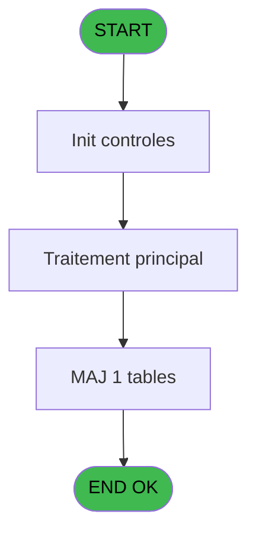

# PBP IDE 329 - Creation tempo circuit

> **Analyse**: Phases 1-4 2026-02-03 16:27 -> 16:27 (20s) | Assemblage 16:27
> **Pipeline**: V7.2 Enrichi
> **Structure**: 4 onglets (Resume | Ecrans | Donnees | Connexions)

<!-- TAB:Resume -->

## 1. FICHE D'IDENTITE

| Attribut | Valeur |
|----------|--------|
| Projet | PBP |
| IDE Position | 329 |
| Nom Programme | Creation tempo circuit |
| Fichier source | `Prg_329.xml` |
| Dossier IDE | Remplissage |
| Taches | 3 (1 ecrans visibles) |
| Tables modifiees | 1 |
| Programmes appeles | 1 |

## 2. DESCRIPTION FONCTIONNELLE

**Creation tempo circuit** assure la gestion complete de ce processus, accessible depuis [Liste depart circuit (IDE 191)](PBP-IDE-191.md).

Le flux de traitement s'organise en **1 blocs fonctionnels** :

- **Traitement** (3 taches) : traitements metier divers

**Donnees modifiees** : 1 tables en ecriture (tempo_nombres).

## 3. BLOCS FONCTIONNELS

### 3.1 Traitement (3 taches)

Traitements internes.

---

#### 329 - Veuillez patienter ... [[ECRAN]](#ecran-t1)

**Role** : Traitement : Veuillez patienter ....
**Ecran** : 424 x 56 DLU (MDI) | [Voir mockup](#ecran-t1)

---

#### 329.1 - Impression Planning [[ECRAN]](#ecran-t2)

**Role** : Generation du document : Impression Planning.
**Ecran** : 128 x 64 DLU (Modal) | [Voir mockup](#ecran-t2)

---

#### 329.1.1 - Creartion

**Role** : Traitement : Creartion.

## 5. REGLES METIER

*(Aucune regle metier identifiee)*

## 6. CONTEXTE

- **Appele par**: [Liste depart circuit (IDE 191)](PBP-IDE-191.md)
- **Appelle**: 1 programmes | **Tables**: 5 (W:1 R:2 L:3) | **Taches**: 3 | **Expressions**: 5

<!-- TAB:Ecrans -->

## 8. ECRANS

### 8.1 Forms visibles (1 / 3)

| # | Position | Tache | Nom | Type | Largeur | Hauteur | Bloc |
|---|----------|-------|-----|------|---------|---------|------|
| 1 | 329 | 329 | Veuillez patienter ... | MDI | 424 | 56 | Traitement |

### 8.2 Mockups Ecrans

---

#### 329 - Veuillez patienter ...
**Tache** : [329](#t1) | **Type** : MDI | **Dimensions** : 424 x 56 DLU
**Bloc** : Traitement | **Titre IDE** : Veuillez patienter ...

<!-- FORM-DATA:
{
    "width":  424,
    "vFactor":  8,
    "type":  "MDI",
    "hFactor":  8,
    "controls":  [
                     {
                         "x":  0,
                         "type":  "label",
                         "var":  "",
                         "y":  0,
                         "w":  423,
                         "fmt":  "",
                         "name":  "",
                         "h":  29,
                         "color":  "",
                         "text":  "",
                         "parent":  null
                     },
                     {
                         "x":  120,
                         "type":  "label",
                         "var":  "",
                         "y":  10,
                         "w":  221,
                         "fmt":  "",
                         "name":  "",
                         "h":  8,
                         "color":  "7",
                         "text":  "Traitement en cours ...",
                         "parent":  null
                     },
                     {
                         "x":  0,
                         "type":  "label",
                         "var":  "",
                         "y":  29,
                         "w":  423,
                         "fmt":  "",
                         "name":  "",
                         "h":  27,
                         "color":  "",
                         "text":  "",
                         "parent":  null
                     },
                     {
                         "x":  72,
                         "type":  "label",
                         "var":  "",
                         "y":  38,
                         "w":  267,
                         "fmt":  "",
                         "name":  "",
                         "h":  8,
                         "color":  "",
                         "text":  "Preparation table temporaire",
                         "parent":  null
                     },
                     {
                         "x":  4,
                         "type":  "image",
                         "var":  "",
                         "y":  2,
                         "w":  72,
                         "fmt":  "",
                         "name":  "",
                         "h":  25,
                         "color":  "",
                         "text":  "",
                         "parent":  null
                     }
                 ],
    "taskId":  "329",
    "height":  56
}
-->

## 9. NAVIGATION

Ecran unique: **Veuillez patienter ...**

### 9.3 Structure hierarchique (3 taches)

| Position | Tache | Type | Dimensions | Bloc |
|----------|-------|------|------------|------|
| **329.1** | [**Veuillez patienter ...** (329)](#t1) [mockup](#ecran-t1) | MDI | 424x56 | Traitement |
| 329.1.1 | [Impression Planning (329.1)](#t2) [mockup](#ecran-t2) | Modal | 128x64 | |
| 329.1.2 | [Creartion (329.1.1)](#t3) | MDI | - | |

### 9.4 Algorigramme

> **Legende**: Vert = START/END OK | Rouge = END KO | Bleu = Decisions
> *Algorigramme auto-genere. Utiliser `/algorigramme` pour une synthese metier detaillee.*

<!-- TAB:Donnees -->

## 10. TABLES

### Tables utilisees (5)

| ID | Nom | Description | Type | R | W | L | Usages |
|----|-----|-------------|------|---|---|---|--------|
| 34 | hebergement______heb | Hebergement (chambres) | DB |   |   | L | 1 |
| 36 | client_gm |  | DB | R |   |   | 1 |
| 127 | code_circuit |  | DB | R |   |   | 1 |
| 168 | heb_circuit______hci | Hebergement (chambres) | DB |   |   | L | 1 |
| 610 | tempo_nombres | Table temporaire ecran | TMP |   | **W** | L | 2 |

### Colonnes par table (3 / 3 tables avec colonnes identifiees)

Table 36 - client_gm (R) - 1 usages

| Lettre | Variable | Acces | Type |
|--------|----------|-------|------|
| A | w0_RetGM | R | Logical |
| B | w1_RetStatutHeb---------------- | R | Logical |
| C | w1_Arrivee--------------------- | R | Alpha |
| D | w1_Depart---------------------- | R | Alpha |
| E | w1_Nom | R | Alpha |
| F | w1_Prenom | R | Alpha |
| G | w1_Sexe | R | Alpha |
| H | w1_Qualite | R | Alpha |
| I | w1_Logement | R | Alpha |
| J | w1_NumAdherent | R | Alpha |
| K | w1_Bebe | R | Alpha |
| L | w1_Millesia | R | Alpha |
| M | w1_Liste Blanche | R | Alpha |
| N | w1_TypeEcran | R | Alpha |
| O | w1_DateArrive | R | Date |
| P | w1_HeureArrive | R | Alpha |
| Q | w1_DateDepart | R | Date |
| R | w1_HeureDepart | R | Alpha |

Table 127 - code_circuit (R) - 1 usages

| Lettre | Variable | Acces | Type |
|--------|----------|-------|------|
| A | >DateCalcul | R | Date |
| B | >CodeCircuit | R | Alpha |
| C | <Total | R | Numeric |
| D | <Select | R | Numeric |
| E | w0_AgeBebe | R | Numeric |
| F | w0_AgeEnfant | R | Numeric |
| G | w0_Sequence | R | Numeric |

Table 610 - tempo_nombres (**W**/L) - 2 usages

*Table utilisee uniquement en Link ou aucune colonne Real identifiee dans le DataView.*

## 11. VARIABLES

### 11.1 Autres (18)

Variables diverses.

| Lettre | Nom | Type | Usage dans |
|--------|-----|------|-----------|
| A | >DateCalcul | Date | 1x refs |
| B | >CodeCircuit | Alpha | 1x refs |
| C | <Total | Numeric | - |
| D | <Select | Numeric | - |
| E | w0_AgeBebe | Numeric | - |
| F | w0_AgeEnfant | Numeric | 1x refs |
| G | w0_Sequence | Numeric | - |
| H | w1_Qualite | Alpha | - |
| I | w1_Logement | Alpha | - |
| J | w1_NumAdherent | Alpha | - |
| K | w1_Bebe | Alpha | - |
| L | w1_Millesia | Alpha | - |
| M | w1_Liste Blanche | Alpha | - |
| N | w1_TypeEcran | Alpha | - |
| O | w1_DateArrive | Date | - |
| P | w1_HeureArrive | Alpha | - |
| Q | w1_DateDepart | Date | - |
| R | w1_HeureDepart | Alpha | - |

Toutes les 18 variables (liste complete)

| Cat | Lettre | Nom Variable | Type |
|-----|--------|--------------|------|
| Autre | **A** | >DateCalcul | Date |
| Autre | **B** | >CodeCircuit | Alpha |
| Autre | **C** | <Total | Numeric |
| Autre | **D** | <Select | Numeric |
| Autre | **E** | w0_AgeBebe | Numeric |
| Autre | **F** | w0_AgeEnfant | Numeric |
| Autre | **G** | w0_Sequence | Numeric |
| Autre | **H** | w1_Qualite | Alpha |
| Autre | **I** | w1_Logement | Alpha |
| Autre | **J** | w1_NumAdherent | Alpha |
| Autre | **K** | w1_Bebe | Alpha |
| Autre | **L** | w1_Millesia | Alpha |
| Autre | **M** | w1_Liste Blanche | Alpha |
| Autre | **N** | w1_TypeEcran | Alpha |
| Autre | **O** | w1_DateArrive | Date |
| Autre | **P** | w1_HeureArrive | Alpha |
| Autre | **Q** | w1_DateDepart | Date |
| Autre | **R** | w1_HeureDepart | Alpha |

## 12. EXPRESSIONS

**5 / 5 expressions decodees (100%)**

### 12.1 Repartition par type

| Type | Expressions | Regles |
|------|-------------|--------|
| CONSTANTE | 2 | 0 |
| OTHER | 1 | 0 |
| CONDITION | 2 | 0 |

### 12.2 Expressions cles par type

#### CONSTANTE (2 expressions)

| Type | IDE | Expression | Regle |
|------|-----|------------|-------|
| CONSTANTE | 4 | `'VENFA'` | - |
| CONSTANTE | 3 | `'VBEBE'` | - |

#### OTHER (1 expressions)

| Type | IDE | Expression | Regle |
|------|-----|------------|-------|
| OTHER | 1 | `GetParam ('SOCIETE')` | - |

#### CONDITION (2 expressions)

| Type | IDE | Expression | Regle |
|------|-----|------------|-------|
| CONDITION | 5 | `>CodeCircuit [B]=w0_AgeEnfant [F] OR >CodeCircuit [B]=''` | - |
| CONDITION | 2 | `>DateCalcul [A]` | - |

<!-- TAB:Connexions -->

## 13. GRAPHE D'APPELS

### 13.1 Chaine depuis Main (Callers)

Main -> ... -> [Liste depart circuit (IDE 191)](PBP-IDE-191.md) -> **Creation tempo circuit (IDE 329)**

### 13.2 Callers

| IDE | Nom Programme | Nb Appels |
|-----|---------------|-----------|
| [191](PBP-IDE-191.md) | Liste depart circuit | 2 |

### 13.3 Callees (programmes appeles)

### 13.4 Detail Callees avec contexte

| IDE | Nom Programme | Appels | Contexte |
|-----|---------------|--------|----------|
| [307](PBP-IDE-307.md) | Recherche age Bebe_Enfant | 2 | Sous-programme |

## 14. RECOMMANDATIONS MIGRATION

### 14.1 Profil du programme

| Metrique | Valeur | Impact migration |
|----------|--------|-----------------|
| Lignes de logique | 179 | Programme compact |
| Expressions | 5 | Peu de logique |
| Tables WRITE | 1 | Impact faible |
| Sous-programmes | 1 | Peu de dependances |
| Ecrans visibles | 1 | Ecran unique ou traitement batch |
| Code desactive | 0% (0 / 179) | Code sain |
| Regles metier | 0 | Pas de regle identifiee |

### 14.2 Plan de migration par bloc

#### Traitement (3 taches: 2 ecrans, 1 traitement)

- **Strategie** : Orchestrateur avec 2 ecrans (Razor/React) et 1 traitements backend (services).
- Les ecrans deviennent des composants UI, les traitements invisibles deviennent des services injectables.
- 1 sous-programme(s) a migrer ou a reutiliser depuis les services existants.
- Decomposer les taches en services unitaires testables.

### 14.3 Dependances critiques

| Dependance | Type | Appels | Impact |
|------------|------|--------|--------|
| tempo_nombres | Table WRITE (Temp) | 1x | Schema + repository |
| [Recherche age Bebe_Enfant (IDE 307)](PBP-IDE-307.md) | Sous-programme | 2x | Haute - Sous-programme |

---
*Spec DETAILED generee par Pipeline V7.2 - 2026-02-03 16:27*
