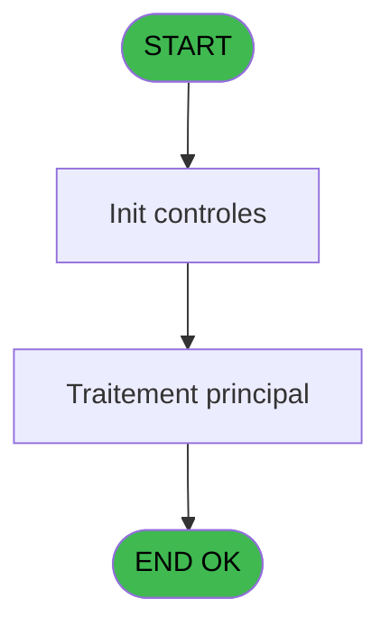
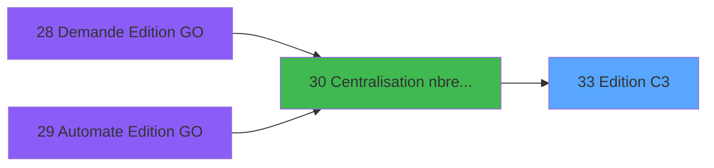

# PBP IDE 33 - Edition C3

> **Analyse**: Phases 1-4 2026-02-03 01:20 -> 01:20 (35s) | Assemblage 01:20
> **Pipeline**: V7.2 Enrichi
> **Structure**: 4 onglets (Resume | Ecrans | Donnees | Connexions)

<!-- TAB:Resume -->

## 1. FICHE D'IDENTITE

| Attribut | Valeur |
|----------|--------|
| Projet | PBP |
| IDE Position | 33 |
| Nom Programme | Edition C3 |
| Fichier source | `Prg_33.xml` |
| Domaine metier | Impression |
| Taches | 1 (1 ecrans visibles) |
| Tables modifiees | 0 |
| Programmes appeles | 0 |

## 2. DESCRIPTION FONCTIONNELLE

**Edition C3** assure la gestion complete de ce processus, accessible depuis [Centralisation nbre edition (IDE 30)](PBP-IDE-30.md).

Le flux de traitement s'organise en **1 blocs fonctionnels** :

- **Traitement** (1 tache) : traitements metier divers

**Logique metier** : 8 regles identifiees couvrant conditions metier.

## 3. BLOCS FONCTIONNELS

### 3.1 Traitement (1 tache)

Traitements internes.

---

#### 33 - Veuillez patienter... [[ECRAN]](#ecran-t1)

**Role** : Traitement : Veuillez patienter....
**Ecran** : 427 x 59 DLU (MDI) | [Voir mockup](#ecran-t1)

## 5. REGLES METIER

8 regles identifiees:

### Autres (8 regles)

#### [RM-001] Si [N]<>'-' alors [V]+Val ([N] sinon '4'),[V]+0)

| Element | Detail |
|---------|--------|
| **Condition** | `[N]<>'-'` |
| **Si vrai** | [V]+Val ([N] |
| **Si faux** | '4'),[V]+0) |
| **Expression source** | Expression 8 : `IF ([N]<>'-',[V]+Val ([N],'4'),[V]+0)` |
| **Exemple** | Si [N]<>'-' → [V]+Val ([N]. Sinon → '4'),[V]+0) |

#### [RM-002] Si [O]<>'-' alors [W]+Val ([O] sinon '4'),[W]+0)

| Element | Detail |
|---------|--------|
| **Condition** | `[O]<>'-'` |
| **Si vrai** | [W]+Val ([O] |
| **Si faux** | '4'),[W]+0) |
| **Expression source** | Expression 9 : `IF ([O]<>'-',[W]+Val ([O],'4'),[W]+0)` |
| **Exemple** | Si [O]<>'-' → [W]+Val ([O]. Sinon → '4'),[W]+0) |

#### [RM-003] Si [P]<>'-' alors [X]+Val ([P] sinon '4'),[X]+0)

| Element | Detail |
|---------|--------|
| **Condition** | `[P]<>'-'` |
| **Si vrai** | [X]+Val ([P] |
| **Si faux** | '4'),[X]+0) |
| **Expression source** | Expression 10 : `IF ([P]<>'-',[X]+Val ([P],'4'),[X]+0)` |
| **Exemple** | Si [P]<>'-' → [X]+Val ([P]. Sinon → '4'),[X]+0) |

#### [RM-004] Si [Q]<>'-' alors [Y]+Val ([Q] sinon '4'),[Y]+0)

| Element | Detail |
|---------|--------|
| **Condition** | `[Q]<>'-'` |
| **Si vrai** | [Y]+Val ([Q] |
| **Si faux** | '4'),[Y]+0) |
| **Expression source** | Expression 11 : `IF ([Q]<>'-',[Y]+Val ([Q],'4'),[Y]+0)` |
| **Exemple** | Si [Q]<>'-' → [Y]+Val ([Q]. Sinon → '4'),[Y]+0) |

#### [RM-005] Si [R]<>'-' alors [Z]+Val ([R] sinon '4'),[Z]+0)

| Element | Detail |
|---------|--------|
| **Condition** | `[R]<>'-'` |
| **Si vrai** | [Z]+Val ([R] |
| **Si faux** | '4'),[Z]+0) |
| **Expression source** | Expression 12 : `IF ([R]<>'-',[Z]+Val ([R],'4'),[Z]+0)` |
| **Exemple** | Si [R]<>'-' → [Z]+Val ([R]. Sinon → '4'),[Z]+0) |

#### [RM-006] Si [S]<>'-' alors [AA]+Val ([S] sinon '4'),[AA]+0)

| Element | Detail |
|---------|--------|
| **Condition** | `[S]<>'-'` |
| **Si vrai** | [AA]+Val ([S] |
| **Si faux** | '4'),[AA]+0) |
| **Expression source** | Expression 13 : `IF ([S]<>'-',[AA]+Val ([S],'4'),[AA]+0)` |
| **Exemple** | Si [S]<>'-' → [AA]+Val ([S]. Sinon → '4'),[AA]+0) |

#### [RM-007] Si [T]<>'-' alors [AB]+Val ([T] sinon '4'),[AB]+0)

| Element | Detail |
|---------|--------|
| **Condition** | `[T]<>'-'` |
| **Si vrai** | [AB]+Val ([T] |
| **Si faux** | '4'),[AB]+0) |
| **Expression source** | Expression 14 : `IF ([T]<>'-',[AB]+Val ([T],'4'),[AB]+0)` |
| **Exemple** | Si [T]<>'-' → [AB]+Val ([T]. Sinon → '4'),[AB]+0) |

#### [RM-008] Si [U]<>'-' alors 'YES' sinon 'NO')

| Element | Detail |
|---------|--------|
| **Condition** | `[U]<>'-'` |
| **Si vrai** | 'YES' |
| **Si faux** | 'NO') |
| **Expression source** | Expression 15 : `IF ([U]<>'-','YES','NO')` |
| **Exemple** | Si [U]<>'-' → 'YES'. Sinon → 'NO') |

## 6. CONTEXTE

- **Appele par**: [Centralisation nbre edition (IDE 30)](PBP-IDE-30.md)
- **Appelle**: 0 programmes | **Tables**: 2 (W:0 R:1 L:1) | **Taches**: 1 | **Expressions**: 17

<!-- TAB:Ecrans -->

## 8. ECRANS

### 8.1 Forms visibles (1 / 1)

| # | Position | Tache | Nom | Type | Largeur | Hauteur | Bloc |
|---|----------|-------|-----|------|---------|---------|------|
| 1 | 33 | 33 | Veuillez patienter... | MDI | 427 | 59 | Traitement |

### 8.2 Mockups Ecrans

---

#### 33 - Veuillez patienter...
**Tache** : [33](#t1) | **Type** : MDI | **Dimensions** : 427 x 59 DLU
**Bloc** : Traitement | **Titre IDE** : Veuillez patienter...

<!-- FORM-DATA:
{
    "width":  427,
    "vFactor":  8,
    "type":  "MDI",
    "hFactor":  8,
    "controls":  [
                     {
                         "x":  0,
                         "type":  "label",
                         "var":  "",
                         "y":  0,
                         "w":  423,
                         "fmt":  "",
                         "name":  "",
                         "h":  29,
                         "color":  "",
                         "text":  "",
                         "parent":  null
                     },
                     {
                         "x":  120,
                         "type":  "label",
                         "var":  "",
                         "y":  10,
                         "w":  221,
                         "fmt":  "",
                         "name":  "",
                         "h":  8,
                         "color":  "7",
                         "text":  "Traitement en cours ...",
                         "parent":  null
                     },
                     {
                         "x":  0,
                         "type":  "label",
                         "var":  "",
                         "y":  29,
                         "w":  423,
                         "fmt":  "",
                         "name":  "",
                         "h":  27,
                         "color":  "",
                         "text":  "",
                         "parent":  null
                     },
                     {
                         "x":  16,
                         "type":  "label",
                         "var":  "",
                         "y":  38,
                         "w":  393,
                         "fmt":  "",
                         "name":  "",
                         "h":  8,
                         "color":  "",
                         "text":  "Edition Autorite Douane Equipage (C3)",
                         "parent":  null
                     },
                     {
                         "x":  4,
                         "type":  "image",
                         "var":  "",
                         "y":  2,
                         "w":  72,
                         "fmt":  "",
                         "name":  "",
                         "h":  25,
                         "color":  "",
                         "text":  "",
                         "parent":  null
                     }
                 ],
    "taskId":  "33",
    "height":  59
}
-->

## 9. NAVIGATION

Ecran unique: **Veuillez patienter...**

### 9.3 Structure hierarchique (1 tache)

| Position | Tache | Type | Dimensions | Bloc |
|----------|-------|------|------------|------|
| **33.1** | [**Veuillez patienter...** (33)](#t1) [mockup](#ecran-t1) | MDI | 427x59 | Traitement |

### 9.4 Algorigramme

> **Legende**: Vert = START/END OK | Rouge = END KO | Bleu = Decisions
> *Algorigramme auto-genere. Utiliser `/algorigramme` pour une synthese metier detaillee.*

<!-- TAB:Donnees -->

## 10. TABLES

### Tables utilisees (2)

| ID | Nom | Description | Type | R | W | L | Usages |
|----|-----|-------------|------|---|---|---|--------|
| 281 | crew |  | DB |   |   | L | 1 |
| 632 | tempo_selection | Table temporaire ecran | DB | R |   |   | 1 |

### Colonnes par table (2 / 1 tables avec colonnes identifiees)

Table 632 - tempo_selection (R) - 1 usages

| Lettre | Variable | Acces | Type |
|--------|----------|-------|------|
| A | > escale | R | Alpha |
| B | > date | R | Date |
| C | v. nbre TV | R | Numeric |
| D | v. nbre radio | R | Numeric |
| E | v. nbre Walkman | R | Numeric |
| F | v. nbre Camera | R | Numeric |
| G | v. nbre Video | R | Numeric |
| H | v. nbre Cigarette | R | Numeric |
| I | v. nbre Alcool | R | Numeric |
| J | v. passage | R | Logical |
| K | v. nbre crew | R | Numeric |

## 11. VARIABLES

### 11.1 Variables de session (9)

Variables persistantes pendant toute la session.

| Lettre | Nom | Type | Usage dans |
|--------|-----|------|-----------|
| C | v. nbre TV | Numeric | - |
| D | v. nbre radio | Numeric | 1x session |
| E | v. nbre Walkman | Numeric | - |
| F | v. nbre Camera | Numeric | - |
| G | v. nbre Video | Numeric | - |
| H | v. nbre Cigarette | Numeric | - |
| I | v. nbre Alcool | Numeric | - |
| J | v. passage | Logical | 1x session |
| K | v. nbre crew | Numeric | 1x session |

### 11.2 Autres (2)

Variables diverses.

| Lettre | Nom | Type | Usage dans |
|--------|-----|------|-----------|
| A | > escale | Alpha | - |
| B | > date | Date | 1x refs |

## 12. EXPRESSIONS

**17 / 17 expressions decodees (100%)**

### 12.1 Repartition par type

| Type | Expressions | Regles |
|------|-------------|--------|
| CONCATENATION | 3 | 0 |
| CALCULATION | 1 | 0 |
| CONDITION | 9 | 8 |
| REFERENCE_VG | 1 | 0 |
| OTHER | 3 | 0 |

### 12.2 Expressions cles par type

#### CONCATENATION (3 expressions)

| Type | IDE | Expression | Regle |
|------|-----|------------|-------|
| CONCATENATION | 5 | `INIGet ('[MAGIC_LOGICAL_NAMES]preview')='O' OR INIGet ('[PREVIEW]'&Trim (Str (VG85,'4'))&'view')='O'` | - |
| CONCATENATION | 3 | `MlsTrans ('Edition du')&' '&DStr (Date (),'DD/MM/YYYY')&' '&MlsTrans ('à')&' '&TStr (Time (),'HH:MM:SS')` | - |
| CONCATENATION | 4 | `'- '&Str (Page (0,1),'3P0Z0')&' -'` | - |

#### CALCULATION (1 expressions)

| Type | IDE | Expression | Regle |
|------|-----|------------|-------|
| CALCULATION | 16 | `[AD]+1` | - |

#### CONDITION (9 expressions)

| Type | IDE | Expression | Regle |
|------|-----|------------|-------|
| CONDITION | 13 | `IF ([S]<>'-',[AA]+Val ([S],'4'),[AA]+0)` | [RM-006](#rm-RM-006) |
| CONDITION | 12 | `IF ([R]<>'-',[Z]+Val ([R],'4'),[Z]+0)` | [RM-005](#rm-RM-005) |
| CONDITION | 15 | `IF ([U]<>'-','YES','NO')` | [RM-008](#rm-RM-008) |
| CONDITION | 14 | `IF ([T]<>'-',[AB]+Val ([T],'4'),[AB]+0)` | [RM-007](#rm-RM-007) |
| CONDITION | 9 | `IF ([O]<>'-',[W]+Val ([O],'4'),[W]+0)` | [RM-002](#rm-RM-002) |
| ... | | *+4 autres* | |

#### REFERENCE_VG (1 expressions)

| Type | IDE | Expression | Regle |
|------|-----|------------|-------|
| REFERENCE_VG | 1 | `VG1` | - |

#### OTHER (3 expressions)

| Type | IDE | Expression | Regle |
|------|-----|------------|-------|
| OTHER | 7 | `v. nbre radio [D]` | - |
| OTHER | 6 | `GetParam ('SOCIETE')` | - |
| OTHER | 2 | `'Village '&GetParam ('VILLAGE')` | - |

<!-- TAB:Connexions -->

## 13. GRAPHE D'APPELS

### 13.1 Chaine depuis Main (Callers)

Main -> ... -> [Centralisation nbre edition (IDE 30)](PBP-IDE-30.md) -> **Edition C3 (IDE 33)**

### 13.2 Callers

| IDE | Nom Programme | Nb Appels |
|-----|---------------|-----------|
| [30](PBP-IDE-30.md) | Centralisation nbre edition | 1 |

### 13.3 Callees (programmes appeles)

### 13.4 Detail Callees avec contexte

| IDE | Nom Programme | Appels | Contexte |
|-----|---------------|--------|----------|
| - | (aucun) | - | - |

## 14. RECOMMANDATIONS MIGRATION

### 14.1 Profil du programme

| Metrique | Valeur | Impact migration |
|----------|--------|-----------------|
| Lignes de logique | 53 | Programme compact |
| Expressions | 17 | Peu de logique |
| Tables WRITE | 0 | Impact faible |
| Sous-programmes | 0 | Peu de dependances |
| Ecrans visibles | 1 | Ecran unique ou traitement batch |
| Code desactive | 0% (0 / 53) | Code sain |
| Regles metier | 8 | Quelques regles a preserver |

### 14.2 Plan de migration par bloc

#### Traitement (1 tache: 1 ecran, 0 traitement)

- **Strategie** : 1 composant(s) UI (Razor/React) avec formulaires et validation.
- Decomposer les taches en services unitaires testables.

### 14.3 Dependances critiques

| Dependance | Type | Appels | Impact |
|------------|------|--------|--------|

---
*Spec DETAILED generee par Pipeline V7.2 - 2026-02-03 01:20*
