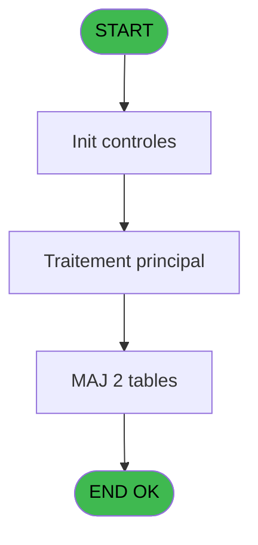
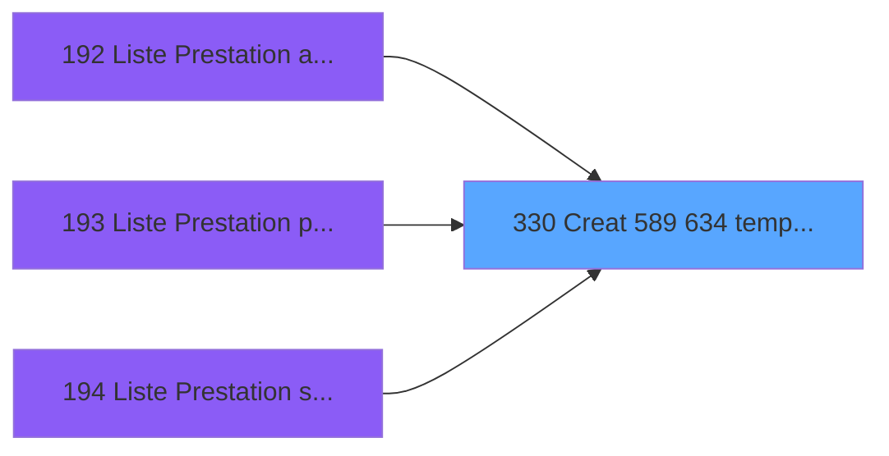

# PBP IDE 330 - Creat 589 634 tempo prestation

> **Analyse**: Phases 1-4 2026-02-03 16:27 -> 16:28 (17s) | Assemblage 16:28
> **Pipeline**: V7.2 Enrichi
> **Structure**: 4 onglets (Resume | Ecrans | Donnees | Connexions)

<!-- TAB:Resume -->

## 1. FICHE D'IDENTITE

| Attribut | Valeur |
|----------|--------|
| Projet | PBP |
| IDE Position | 330 |
| Nom Programme | Creat 589 634 tempo prestation |
| Fichier source | `Prg_330.xml` |
| Dossier IDE | Remplissage |
| Taches | 3 (1 ecrans visibles) |
| Tables modifiees | 2 |
| Programmes appeles | 0 |

## 2. DESCRIPTION FONCTIONNELLE

**Creat 589 634 tempo prestation** assure la gestion complete de ce processus, accessible depuis [Liste Prestation arrivants (IDE 192)](PBP-IDE-192.md), [Liste Prestation presents (IDE 193)](PBP-IDE-193.md), [Liste Prestation stock (IDE 194)](PBP-IDE-194.md).

Le flux de traitement s'organise en **2 blocs fonctionnels** :

- **Traitement** (2 taches) : traitements metier divers
- **Creation** (1 tache) : insertion d'enregistrements en base (mouvements, prestations)

**Donnees modifiees** : 2 tables en ecriture (tempo_chambre_client, tempo_users).

**Logique metier** : 4 regles identifiees couvrant conditions metier, valeurs par defaut.

Detail : phases du traitement

#### Phase 1 : Traitement (2 taches)

- **330** - Veuillez patienter ... **[[ECRAN]](#ecran-t1)**
- **330.1** - Honey moon

#### Phase 2 : Creation (1 tache)

- **330.2** - Creation tempo

#### Tables impactees

| Table | Operations | Role metier |
|-------|-----------|-------------|
| tempo_users | **W**/L (2 usages) | Table temporaire ecran |
| tempo_chambre_client | **W**/L (2 usages) | Table temporaire ecran |

## 3. BLOCS FONCTIONNELS

### 3.1 Traitement (2 taches)

Traitements internes.

---

#### 330 - Veuillez patienter ... [[ECRAN]](#ecran-t1)

**Role** : Traitement : Veuillez patienter ....
**Ecran** : 424 x 56 DLU (MDI) | [Voir mockup](#ecran-t1)

---

#### 330.1 - Honey moon

**Role** : Traitement : Honey moon.

### 3.2 Creation (1 tache)

Insertion de nouveaux enregistrements en base.

---

#### 330.2 - Creation tempo

**Role** : Creation d'enregistrement : Creation tempo.

## 5. REGLES METIER

4 regles identifiees:

### Autres (4 regles)

#### [RM-001] Valeur par defaut si Trim([AF]) est vide

| Element | Detail |
|---------|--------|
| **Condition** | `Trim([AF])=''` |
| **Si vrai** | [Q] |
| **Si faux** | [AF]) |
| **Expression source** | Expression 16 : `IF(Trim([AF])='',[Q],[AF])` |
| **Exemple** | Si Trim([AF])='' → [Q]. Sinon → [AF]) |

#### [RM-002] Valeur par defaut si Trim([AG]) est vide

| Element | Detail |
|---------|--------|
| **Condition** | `Trim([AG])=''` |
| **Si vrai** | [R] |
| **Si faux** | [AG]) |
| **Expression source** | Expression 17 : `IF(Trim([AG])='',[R],[AG])` |
| **Exemple** | Si Trim([AG])='' → [R]. Sinon → [AG]) |

#### [RM-003] Valeur par defaut si Trim([AH]) est vide

| Element | Detail |
|---------|--------|
| **Condition** | `Trim([AH])=''` |
| **Si vrai** | IF ([S]='H' |
| **Si faux** | 'M','Me'),[AH]) |
| **Expression source** | Expression 18 : `IF(Trim([AH])='',IF ([S]='H','M','Me'),[AH])` |
| **Exemple** | Si Trim([AH])='' → IF ([S]='H'. Sinon → 'M','Me'),[AH]) |

#### [RM-004] Si [S]='H' alors 'M' sinon 'Me')

| Element | Detail |
|---------|--------|
| **Condition** | `[S]='H'` |
| **Si vrai** | 'M' |
| **Si faux** | 'Me') |
| **Expression source** | Expression 23 : `IF ([S]='H','M','Me')` |
| **Exemple** | Si [S]='H' → 'M'. Sinon → 'Me') |

## 6. CONTEXTE

- **Appele par**: [Liste Prestation arrivants (IDE 192)](PBP-IDE-192.md), [Liste Prestation presents (IDE 193)](PBP-IDE-193.md), [Liste Prestation stock (IDE 194)](PBP-IDE-194.md)
- **Appelle**: 0 programmes | **Tables**: 8 (W:2 R:1 L:7) | **Taches**: 3 | **Expressions**: 33

<!-- TAB:Ecrans -->

## 8. ECRANS

### 8.1 Forms visibles (1 / 3)

| # | Position | Tache | Nom | Type | Largeur | Hauteur | Bloc |
|---|----------|-------|-----|------|---------|---------|------|
| 1 | 330 | 330 | Veuillez patienter ... | MDI | 424 | 56 | Traitement |

### 8.2 Mockups Ecrans

---

#### 330 - Veuillez patienter ...
**Tache** : [330](#t1) | **Type** : MDI | **Dimensions** : 424 x 56 DLU
**Bloc** : Traitement | **Titre IDE** : Veuillez patienter ...

<!-- FORM-DATA:
{
    "width":  424,
    "vFactor":  8,
    "type":  "MDI",
    "hFactor":  8,
    "controls":  [
                     {
                         "x":  0,
                         "type":  "label",
                         "var":  "",
                         "y":  0,
                         "w":  423,
                         "fmt":  "",
                         "name":  "",
                         "h":  29,
                         "color":  "",
                         "text":  "",
                         "parent":  null
                     },
                     {
                         "x":  120,
                         "type":  "label",
                         "var":  "",
                         "y":  10,
                         "w":  221,
                         "fmt":  "",
                         "name":  "",
                         "h":  8,
                         "color":  "7",
                         "text":  "Traitement en cours ...",
                         "parent":  null
                     },
                     {
                         "x":  0,
                         "type":  "label",
                         "var":  "",
                         "y":  29,
                         "w":  423,
                         "fmt":  "",
                         "name":  "",
                         "h":  27,
                         "color":  "",
                         "text":  "",
                         "parent":  null
                     },
                     {
                         "x":  107,
                         "type":  "label",
                         "var":  "",
                         "y":  34,
                         "w":  114,
                         "fmt":  "",
                         "name":  "",
                         "h":  8,
                         "color":  "",
                         "text":  "Analyses :",
                         "parent":  4
                     },
                     {
                         "x":  107,
                         "type":  "label",
                         "var":  "",
                         "y":  45,
                         "w":  139,
                         "fmt":  "",
                         "name":  "",
                         "h":  8,
                         "color":  "",
                         "text":  "Selectiones :",
                         "parent":  4
                     },
                     {
                         "x":  4,
                         "type":  "image",
                         "var":  "",
                         "y":  2,
                         "w":  72,
                         "fmt":  "",
                         "name":  "",
                         "h":  25,
                         "color":  "",
                         "text":  "",
                         "parent":  null
                     },
                     {
                         "x":  261,
                         "type":  "edit",
                         "var":  "",
                         "y":  33,
                         "w":  56,
                         "fmt":  "",
                         "name":  "",
                         "h":  9,
                         "color":  "",
                         "text":  "",
                         "parent":  4
                     },
                     {
                         "x":  261,
                         "type":  "edit",
                         "var":  "",
                         "y":  44,
                         "w":  56,
                         "fmt":  "",
                         "name":  "",
                         "h":  9,
                         "color":  "",
                         "text":  "",
                         "parent":  4
                     }
                 ],
    "taskId":  "330",
    "height":  56
}
-->

<strong>Champs : 2 champs</strong>

| Pos (x,y) | Nom | Variable | Type |
|-----------|-----|----------|------|
| 261,33 | (sans nom) | - | edit |
| 261,44 | (sans nom) | - | edit |

## 9. NAVIGATION

Ecran unique: **Veuillez patienter ...**

### 9.3 Structure hierarchique (3 taches)

| Position | Tache | Type | Dimensions | Bloc |
|----------|-------|------|------------|------|
| **330.1** | [**Veuillez patienter ...** (330)](#t1) [mockup](#ecran-t1) | MDI | 424x56 | Traitement |
| 330.1.1 | [Honey moon (330.1)](#t2) | MDI | - | |
| **330.2** | [**Creation tempo** (330.2)](#t3) | MDI | - | Creation |

### 9.4 Algorigramme

> **Legende**: Vert = START/END OK | Rouge = END KO | Bleu = Decisions
> *Algorigramme auto-genere. Utiliser `/algorigramme` pour une synthese metier detaillee.*

<!-- TAB:Donnees -->

## 10. TABLES

### Tables utilisees (8)

| ID | Nom | Description | Type | R | W | L | Usages |
|----|-----|-------------|------|---|---|---|--------|
| 30 | gm-recherche_____gmr | Index de recherche | DB | R |   |   | 1 |
| 31 | gm-complet_______gmc |  | DB |   |   | L | 1 |
| 33 | prestations______pre | Prestations/services vendus | DB |   |   | L | 1 |
| 34 | hebergement______heb | Hebergement (chambres) | DB |   |   | L | 1 |
| 36 | client_gm |  | DB |   |   | L | 1 |
| 119 | tables_pays_tel_ |  | DB |   |   | L | 1 |
| 589 | tempo_chambre_client | Table temporaire ecran | TMP |   | **W** | L | 2 |
| 634 | tempo_users | Table temporaire ecran | DB |   | **W** | L | 2 |

### Colonnes par table (1 / 3 tables avec colonnes identifiees)

Table 30 - gm-recherche_____gmr (R) - 1 usages

| Lettre | Variable | Acces | Type |
|--------|----------|-------|------|
| A | >Circuit | R | Alpha |
| B | >DateMin | R | Date |
| C | >DateMax | R | Date |
| D | >TypeTraitement | R | Alpha |
| E | <Total | R | Numeric |
| F | <Select | R | Numeric |
| G | w0_Nom | R | Alpha |
| H | w0_Prenom | R | Alpha |
| I | w0_Titre | R | Alpha |
| J | w0_DateSejDeb | R | Date |
| K | w0_DateSejFin | R | Date |
| L | w0_Type | R | Alpha |

Table 589 - tempo_chambre_client (**W**/L) - 2 usages

*Table utilisee uniquement en Link ou aucune colonne Real identifiee dans le DataView.*

Table 634 - tempo_users (**W**/L) - 2 usages

*Table utilisee uniquement en Link ou aucune colonne Real identifiee dans le DataView.*

## 11. VARIABLES

### 11.1 Autres (12)

Variables diverses.

| Lettre | Nom | Type | Usage dans |
|--------|-----|------|-----------|
| A | >Circuit | Alpha | 2x refs |
| B | >DateMin | Date | 6x refs |
| C | >DateMax | Date | 2x refs |
| D | >TypeTraitement | Alpha | 7x refs |
| E | <Total | Numeric | 1x refs |
| F | <Select | Numeric | 1x refs |
| G | w0_Nom | Alpha | 1x refs |
| H | w0_Prenom | Alpha | 1x refs |
| I | w0_Titre | Alpha | 2x refs |
| J | w0_DateSejDeb | Date | 1x refs |
| K | w0_DateSejFin | Date | 1x refs |
| L | w0_Type | Alpha | 2x refs |

## 12. EXPRESSIONS

**33 / 33 expressions decodees (100%)**

### 12.1 Repartition par type

| Type | Expressions | Regles |
|------|-------------|--------|
| CONDITION | 19 | 4 |
| CONSTANTE | 2 | 0 |
| OTHER | 12 | 0 |

### 12.2 Expressions cles par type

#### CONDITION (19 expressions)

| Type | IDE | Expression | Regle |
|------|-----|------------|-------|
| CONDITION | 23 | `IF ([S]='H','M','Me')` | [RM-004](#rm-RM-004) |
| CONDITION | 18 | `IF(Trim([AH])='',IF ([S]='H','M','Me'),[AH])` | [RM-003](#rm-RM-003) |
| CONDITION | 16 | `IF(Trim([AF])='',[Q],[AF])` | [RM-001](#rm-RM-001) |
| CONDITION | 17 | `IF(Trim([AG])='',[R],[AG])` | [RM-002](#rm-RM-002) |
| CONDITION | 6 | `CndRange (>TypeTraitement [D]='P' AND >DateMin [B]>0,>DateMin [B])` | - |
| ... | | *+14 autres* | |

#### CONSTANTE (2 expressions)

| Type | IDE | Expression | Regle |
|------|-----|------------|-------|
| CONSTANTE | 28 | `'A Total GM'` | - |
| CONSTANTE | 12 | `'H'` | - |

#### OTHER (12 expressions)

| Type | IDE | Expression | Regle |
|------|-----|------------|-------|
| OTHER | 24 | `[T]` | - |
| OTHER | 22 | `[R]` | - |
| OTHER | 21 | `[Q]` | - |
| OTHER | 32 | `'P '&[AQ]` | - |
| OTHER | 30 | `MlsTrans ('P Non Renseigne')` | - |
| ... | | *+7 autres* | |

### 12.3 Toutes les expressions (33)

Voir les 33 expressions

#### CONDITION (19)

| IDE | Expression Decodee |
|-----|-------------------|
| 26 | `<Total [E]+1` |
| 33 | `<Select [F]+1` |
| 16 | `IF(Trim([AF])='',[Q],[AF])` |
| 17 | `IF(Trim([AG])='',[R],[AG])` |
| 18 | `IF(Trim([AH])='',IF ([S]='H','M','Me'),[AH])` |
| 19 | `IF(Trim([AF])='',[T],[AI])` |
| 20 | `IF(Trim([AF])='',[U],[AJ])` |
| 23 | `IF ([S]='H','M','Me')` |
| 15 | `>TypeTraitement [D]='P' AND >DateMin [B]>=w0_Titre [I] AND >DateMin [B]<=w0_Type [L] AND (>DateMin [B]<Date () AND [P]='O' OR >DateMin [B]>=Date ())` |
| 3 | `CndRange (>Circuit [A]<>'',>Circuit [A])` |
| 4 | `CndRange (>DateMin [B]>0 AND >TypeTraitement [D]='A',>DateMin [B])` |
| 5 | `CndRange (IF (>TypeTraitement [D]='A',>DateMax [C]>0,>DateMin [B]>0) AND >TypeTraitement [D]<>'S',IF (>TypeTraitement [D]='A',>DateMax [C],>DateMin [B]))` |
| 6 | `CndRange (>TypeTraitement [D]='P' AND >DateMin [B]>0,>DateMin [B])` |
| 11 | `>DateMin [B]` |
| 13 | `>TypeTraitement [D]<>'S'` |
| 14 | `>TypeTraitement [D]='A' AND (>Circuit [A]='' OR >Circuit [A]=w0_Prenom [H])` |
| 27 | `>TypeTraitement [D]='S' AND (>DateMin [B]<=w0_Titre [I] AND >DateMax [C]>=w0_Titre [I] OR w0_Type [L]>=>DateMin [B] AND w0_Type [L]<=>DateMax [C] OR w0_Titre [I]<>DateMin [B] AND w0_Type [L]>>DateMax [C])` |
| 29 | `[AN]<>ASCIIChr (64)&ASCIIChr (64)` |
| 31 | `[AN]=ASCIIChr (64)&ASCIIChr (64)` |

#### CONSTANTE (2)

| IDE | Expression Decodee |
|-----|-------------------|
| 12 | `'H'` |
| 28 | `'A Total GM'` |

#### OTHER (12)

| IDE | Expression Decodee |
|-----|-------------------|
| 1 | `w0_Nom [G]` |
| 2 | `GetParam('SOCIETE')` |
| 7 | `w0_DateSejDeb [J]` |
| 8 | `w0_DateSejFin [K]` |
| 9 | `GetParam ('LANGUE')` |
| 10 | `[AN]` |
| 21 | `[Q]` |
| 22 | `[R]` |
| 24 | `[T]` |
| 25 | `[U]` |
| 30 | `MlsTrans ('P Non Renseigne')` |
| 32 | `'P '&[AQ]` |

<!-- TAB:Connexions -->

## 13. GRAPHE D'APPELS

### 13.1 Chaine depuis Main (Callers)

Main -> ... -> [Liste Prestation arrivants (IDE 192)](PBP-IDE-192.md) -> **Creat 589 634 tempo prestation (IDE 330)**

Main -> ... -> [Liste Prestation presents (IDE 193)](PBP-IDE-193.md) -> **Creat 589 634 tempo prestation (IDE 330)**

Main -> ... -> [Liste Prestation stock (IDE 194)](PBP-IDE-194.md) -> **Creat 589 634 tempo prestation (IDE 330)**

### 13.2 Callers

| IDE | Nom Programme | Nb Appels |
|-----|---------------|-----------|
| [192](PBP-IDE-192.md) | Liste Prestation arrivants | 2 |
| [193](PBP-IDE-193.md) | Liste Prestation presents | 2 |
| [194](PBP-IDE-194.md) | Liste Prestation stock | 2 |

### 13.3 Callees (programmes appeles)

### 13.4 Detail Callees avec contexte

| IDE | Nom Programme | Appels | Contexte |
|-----|---------------|--------|----------|
| - | (aucun) | - | - |

## 14. RECOMMANDATIONS MIGRATION

### 14.1 Profil du programme

| Metrique | Valeur | Impact migration |
|----------|--------|-----------------|
| Lignes de logique | 164 | Programme compact |
| Expressions | 33 | Peu de logique |
| Tables WRITE | 2 | Impact faible |
| Sous-programmes | 0 | Peu de dependances |
| Ecrans visibles | 1 | Ecran unique ou traitement batch |
| Code desactive | 0% (0 / 164) | Code sain |
| Regles metier | 4 | Quelques regles a preserver |

### 14.2 Plan de migration par bloc

#### Traitement (2 taches: 1 ecran, 1 traitement)

- **Strategie** : Orchestrateur avec 1 ecrans (Razor/React) et 1 traitements backend (services).
- Les ecrans deviennent des composants UI, les traitements invisibles deviennent des services injectables.
- Decomposer les taches en services unitaires testables.

#### Creation (1 tache: 0 ecran, 1 traitement)

- **Strategie** : Repository pattern avec Entity Framework Core.
- Insertion via `IRepository<T>.CreateAsync()`

### 14.3 Dependances critiques

| Dependance | Type | Appels | Impact |
|------------|------|--------|--------|
| tempo_chambre_client | Table WRITE (Temp) | 1x | Schema + repository |
| tempo_users | Table WRITE (Database) | 1x | Schema + repository |

---
*Spec DETAILED generee par Pipeline V7.2 - 2026-02-03 16:28*
