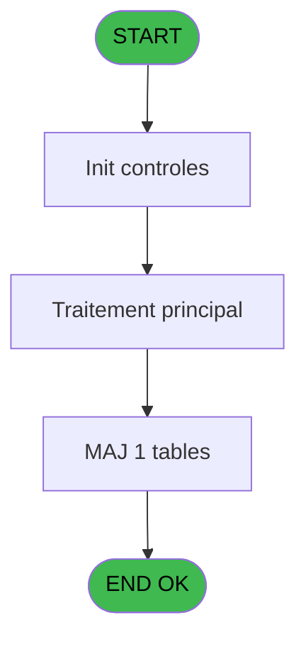
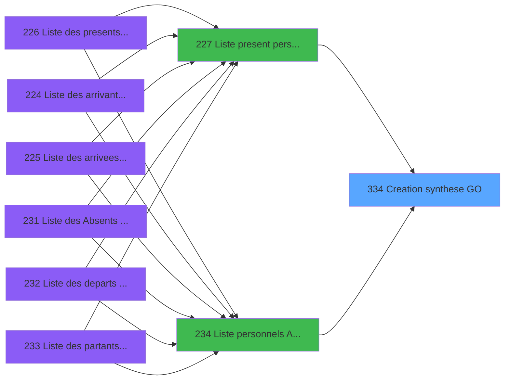
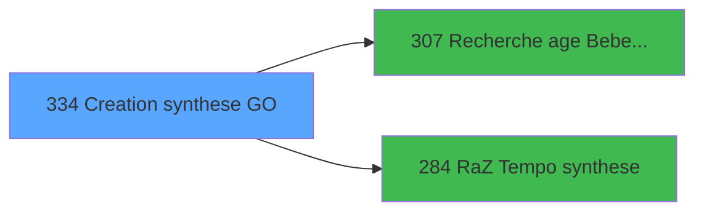

# PBP IDE 334 - Creation synthese GO

> **Analyse**: Phases 1-4 2026-02-03 16:29 -> 16:29 (13s) | Assemblage 16:29
> **Pipeline**: V7.2 Enrichi
> **Structure**: 4 onglets (Resume | Ecrans | Donnees | Connexions)

<!-- TAB:Resume -->

## 1. FICHE D'IDENTITE

| Attribut | Valeur |
|----------|--------|
| Projet | PBP |
| IDE Position | 334 |
| Nom Programme | Creation synthese GO |
| Fichier source | `Prg_334.xml` |
| Dossier IDE | Remplissage |
| Taches | 2 (1 ecrans visibles) |
| Tables modifiees | 1 |
| Programmes appeles | 2 |

## 2. DESCRIPTION FONCTIONNELLE

**Creation synthese GO** assure la gestion complete de ce processus, accessible depuis [  Liste present personnel plan (IDE 227)](PBP-IDE-227.md), [  Liste personnels AVPBDR (IDE 234)](PBP-IDE-234.md).

Le flux de traitement s'organise en **2 blocs fonctionnels** :

- **Creation** (1 tache) : insertion d'enregistrements en base (mouvements, prestations)
- **Traitement** (1 tache) : traitements metier divers

**Donnees modifiees** : 1 tables en ecriture (tempo_users).

**Logique metier** : 2 regles identifiees couvrant conditions metier.

Detail : phases du traitement

#### Phase 1 : Traitement (1 tache)

- **334** - Veuillez patienter ... **[[ECRAN]](#ecran-t1)**

#### Phase 2 : Creation (1 tache)

- **334.1** - Creation tempo

#### Tables impactees

| Table | Operations | Role metier |
|-------|-----------|-------------|
| tempo_users | **W**/L (2 usages) | Table temporaire ecran |

## 3. BLOCS FONCTIONNELS

### 3.1 Traitement (1 tache)

Traitements internes.

---

#### 334 - Veuillez patienter ... [[ECRAN]](#ecran-t1)

**Role** : Traitement : Veuillez patienter ....
**Ecran** : 424 x 56 DLU (MDI) | [Voir mockup](#ecran-t1)

### 3.2 Creation (1 tache)

Insertion de nouveaux enregistrements en base.

---

#### 334.1 - Creation tempo

**Role** : Creation d'enregistrement : Creation tempo.

## 5. REGLES METIER

2 regles identifiees:

### Autres (2 regles)

#### [RM-001] Si >Index [A]=5 alors >DateMaxDebut [D]+14 sinon >DateMaxDebut [D])

| Element | Detail |
|---------|--------|
| **Condition** | `>Index [A]=5` |
| **Si vrai** | >DateMaxDebut [D]+14 |
| **Si faux** | >DateMaxDebut [D]) |
| **Variables** | A (>Index), D (>DateMaxDebut) |
| **Expression source** | Expression 19 : `IF (>Index [A]=5,>DateMaxDebut [D]+14,>DateMaxDebut [D])` |
| **Exemple** | Si >Index [A]=5 → >DateMaxDebut [D]+14. Sinon → >DateMaxDebut [D]) |

#### [RM-002] Si >Index [A]=6 alors >DateMaxFin [F]+14 sinon >DateMaxFin [F])

| Element | Detail |
|---------|--------|
| **Condition** | `>Index [A]=6` |
| **Si vrai** | >DateMaxFin [F]+14 |
| **Si faux** | >DateMaxFin [F]) |
| **Variables** | A (>Index), F (>DateMaxFin) |
| **Expression source** | Expression 20 : `IF (>Index [A]=6,>DateMaxFin [F]+14,>DateMaxFin [F])` |
| **Exemple** | Si >Index [A]=6 → >DateMaxFin [F]+14. Sinon → >DateMaxFin [F]) |

## 6. CONTEXTE

- **Appele par**: [  Liste present personnel plan (IDE 227)](PBP-IDE-227.md), [  Liste personnels AVPBDR (IDE 234)](PBP-IDE-234.md)
- **Appelle**: 2 programmes | **Tables**: 8 (W:1 R:1 L:7) | **Taches**: 2 | **Expressions**: 54

<!-- TAB:Ecrans -->

## 8. ECRANS

### 8.1 Forms visibles (1 / 2)

| # | Position | Tache | Nom | Type | Largeur | Hauteur | Bloc |
|---|----------|-------|-----|------|---------|---------|------|
| 1 | 334 | 334 | Veuillez patienter ... | MDI | 424 | 56 | Traitement |

### 8.2 Mockups Ecrans

---

#### 334 - Veuillez patienter ...
**Tache** : [334](#t1) | **Type** : MDI | **Dimensions** : 424 x 56 DLU
**Bloc** : Traitement | **Titre IDE** : Veuillez patienter ...

<!-- FORM-DATA:
{
    "width":  424,
    "vFactor":  8,
    "type":  "MDI",
    "hFactor":  8,
    "controls":  [
                     {
                         "x":  0,
                         "type":  "label",
                         "var":  "",
                         "y":  0,
                         "w":  423,
                         "fmt":  "",
                         "name":  "",
                         "h":  29,
                         "color":  "",
                         "text":  "",
                         "parent":  null
                     },
                     {
                         "x":  120,
                         "type":  "label",
                         "var":  "",
                         "y":  10,
                         "w":  221,
                         "fmt":  "",
                         "name":  "",
                         "h":  8,
                         "color":  "7",
                         "text":  "Traitement en cours ...",
                         "parent":  null
                     },
                     {
                         "x":  0,
                         "type":  "label",
                         "var":  "",
                         "y":  29,
                         "w":  423,
                         "fmt":  "",
                         "name":  "",
                         "h":  27,
                         "color":  "",
                         "text":  "",
                         "parent":  null
                     },
                     {
                         "x":  110,
                         "type":  "label",
                         "var":  "",
                         "y":  32,
                         "w":  114,
                         "fmt":  "",
                         "name":  "",
                         "h":  8,
                         "color":  "",
                         "text":  "Analyses :",
                         "parent":  4
                     },
                     {
                         "x":  110,
                         "type":  "label",
                         "var":  "",
                         "y":  44,
                         "w":  139,
                         "fmt":  "",
                         "name":  "",
                         "h":  8,
                         "color":  "",
                         "text":  "Selectiones :",
                         "parent":  4
                     },
                     {
                         "x":  4,
                         "type":  "image",
                         "var":  "",
                         "y":  2,
                         "w":  72,
                         "fmt":  "",
                         "name":  "",
                         "h":  25,
                         "color":  "",
                         "text":  "",
                         "parent":  null
                     },
                     {
                         "x":  259,
                         "type":  "edit",
                         "var":  "",
                         "y":  32,
                         "w":  56,
                         "fmt":  "",
                         "name":  "",
                         "h":  9,
                         "color":  "",
                         "text":  "",
                         "parent":  4
                     },
                     {
                         "x":  259,
                         "type":  "edit",
                         "var":  "",
                         "y":  44,
                         "w":  56,
                         "fmt":  "",
                         "name":  "",
                         "h":  9,
                         "color":  "",
                         "text":  "",
                         "parent":  4
                     }
                 ],
    "taskId":  "334",
    "height":  56
}
-->

<strong>Champs : 2 champs</strong>

| Pos (x,y) | Nom | Variable | Type |
|-----------|-----|----------|------|
| 259,32 | (sans nom) | - | edit |
| 259,44 | (sans nom) | - | edit |

## 9. NAVIGATION

Ecran unique: **Veuillez patienter ...**

### 9.3 Structure hierarchique (2 taches)

| Position | Tache | Type | Dimensions | Bloc |
|----------|-------|------|------------|------|
| **334.1** | [**Veuillez patienter ...** (334)](#t1) [mockup](#ecran-t1) | MDI | 424x56 | Traitement |
| **334.2** | [**Creation tempo** (334.1)](#t2) | MDI | - | Creation |

### 9.4 Algorigramme

> **Legende**: Vert = START/END OK | Rouge = END KO | Bleu = Decisions
> *Algorigramme auto-genere. Utiliser `/algorigramme` pour une synthese metier detaillee.*

<!-- TAB:Donnees -->

## 10. TABLES

### Tables utilisees (8)

| ID | Nom | Description | Type | R | W | L | Usages |
|----|-----|-------------|------|---|---|---|--------|
| 31 | gm-complet_______gmc |  | DB | R |   |   | 1 |
| 34 | hebergement______heb | Hebergement (chambres) | DB |   |   | L | 1 |
| 35 | personnel_go______go |  | DB |   |   | L | 1 |
| 119 | tables_pays_tel_ |  | DB |   |   | L | 1 |
| 366 | pms_print_param |  | DB |   |   | L | 1 |
| 598 | tempo_ecr_previsions | Table temporaire ecran | TMP |   |   | L | 2 |
| 634 | tempo_users | Table temporaire ecran | DB |   | **W** | L | 2 |
| 637 | tempo_zone_secteur | Table temporaire ecran | DB |   |   | L | 1 |

### Colonnes par table (3 / 2 tables avec colonnes identifiees)

Table 31 - gm-complet_______gmc (R) - 1 usages

| Lettre | Variable | Acces | Type |
|--------|----------|-------|------|
| A | >Index | R | Numeric |
| B | >DateCalcul | R | Date |
| C | >DateMinDebut | R | Date |
| D | >DateMaxDebut | R | Date |
| E | >DateMinFin | R | Date |
| F | >DateMaxFin | R | Date |
| G | >CodeListe | R | Alpha |
| H | >TopListe | R | Alpha |
| I | >Logement | R | Alpha |
| J | >TypeHebergement | R | Alpha |
| K | <Total | R | Numeric |
| L | <NbSelect | R | Numeric |
| M | >Categorie(TUL) | R | Alpha |
| N | >NomTable | R | Alpha |
| O | >LieuSejour | R | Alpha |
| P | P.I.Enlever les absences | R | Logical |
| Q | w0_DateMaxDebut | R | Date |
| R | w0_DateMaxFin | R | Date |
| S | v.Date min | R | Date |
| T | v.Date max | R | Date |
| U | v.Test retour abs personnel | R | Logical |
| V | w0_Type | R | Alpha |
| W | w0_Total | R | Numeric |
| X | w0_NbSelect | R | Numeric |
| Y | w0_AgeBebe | R | Numeric |
| Z | w0_AgeEnfant | R | Numeric |

Table 634 - tempo_users (**W**/L) - 2 usages

*Table utilisee uniquement en Link ou aucune colonne Real identifiee dans le DataView.*

## 11. VARIABLES

### 11.1 Parametres entrants (1)

Variables recues du programme appelant ([  Liste present personnel plan (IDE 227)](PBP-IDE-227.md)).

| Lettre | Nom | Type | Usage dans |
|--------|-----|------|-----------|
| P | P.I.Enlever les absences | Logical | 1x parametre entrant |

### 11.2 Variables de session (3)

Variables persistantes pendant toute la session.

| Lettre | Nom | Type | Usage dans |
|--------|-----|------|-----------|
| S | v.Date min | Date | 1x session |
| T | v.Date max | Date | - |
| U | v.Test retour abs personnel | Logical | - |

### 11.3 Autres (22)

Variables diverses.

| Lettre | Nom | Type | Usage dans |
|--------|-----|------|-----------|
| A | >Index | Numeric | 3x refs |
| B | >DateCalcul | Date | 1x refs |
| C | >DateMinDebut | Date | 2x refs |
| D | >DateMaxDebut | Date | 2x refs |
| E | >DateMinFin | Date | 2x refs |
| F | >DateMaxFin | Date | 2x refs |
| G | >CodeListe | Alpha | 2x refs |
| H | >TopListe | Alpha | - |
| I | >Logement | Alpha | 1x refs |
| J | >TypeHebergement | Alpha | 2x refs |
| K | <Total | Numeric | 1x refs |
| L | <NbSelect | Numeric | 1x refs |
| M | >Categorie(TUL) | Alpha | 1x refs |
| N | >NomTable | Alpha | 1x refs |
| O | >LieuSejour | Alpha | 1x refs |
| Q | w0_DateMaxDebut | Date | - |
| R | w0_DateMaxFin | Date | 1x refs |
| V | w0_Type | Alpha | - |
| W | w0_Total | Numeric | 3x refs |
| X | w0_NbSelect | Numeric | - |
| Y | w0_AgeBebe | Numeric | - |
| Z | w0_AgeEnfant | Numeric | - |

Toutes les 26 variables (liste complete)

| Cat | Lettre | Nom Variable | Type |
|-----|--------|--------------|------|
| P0 | **P** | P.I.Enlever les absences | Logical |
| V. | **S** | v.Date min | Date |
| V. | **T** | v.Date max | Date |
| V. | **U** | v.Test retour abs personnel | Logical |
| Autre | **A** | >Index | Numeric |
| Autre | **B** | >DateCalcul | Date |
| Autre | **C** | >DateMinDebut | Date |
| Autre | **D** | >DateMaxDebut | Date |
| Autre | **E** | >DateMinFin | Date |
| Autre | **F** | >DateMaxFin | Date |
| Autre | **G** | >CodeListe | Alpha |
| Autre | **H** | >TopListe | Alpha |
| Autre | **I** | >Logement | Alpha |
| Autre | **J** | >TypeHebergement | Alpha |
| Autre | **K** | <Total | Numeric |
| Autre | **L** | <NbSelect | Numeric |
| Autre | **M** | >Categorie(TUL) | Alpha |
| Autre | **N** | >NomTable | Alpha |
| Autre | **O** | >LieuSejour | Alpha |
| Autre | **Q** | w0_DateMaxDebut | Date |
| Autre | **R** | w0_DateMaxFin | Date |
| Autre | **V** | w0_Type | Alpha |
| Autre | **W** | w0_Total | Numeric |
| Autre | **X** | w0_NbSelect | Numeric |
| Autre | **Y** | w0_AgeBebe | Numeric |
| Autre | **Z** | w0_AgeEnfant | Numeric |

## 12. EXPRESSIONS

**54 / 54 expressions decodees (100%)**

### 12.1 Repartition par type

| Type | Expressions | Regles |
|------|-------------|--------|
| CONDITION | 29 | 2 |
| CONSTANTE | 6 | 0 |
| OTHER | 16 | 0 |
| REFERENCE_VG | 1 | 0 |
| CONCATENATION | 1 | 0 |
| NEGATION | 1 | 0 |

### 12.2 Expressions cles par type

#### CONDITION (29 expressions)

| Type | IDE | Expression | Regle |
|------|-----|------------|-------|
| CONDITION | 19 | `IF (>Index [A]=5,>DateMaxDebut [D]+14,>DateMaxDebut [D])` | [RM-001](#rm-RM-001) |
| CONDITION | 20 | `IF (>Index [A]=6,>DateMaxFin [F]+14,>DateMaxFin [F])` | [RM-002](#rm-RM-002) |
| CONDITION | 44 | `[AA]=ASCIIChr (64)&ASCIIChr (64)` | - |
| CONDITION | 49 | `CndRange([DP]<>'',[DP])` | - |
| CONDITION | 50 | `MIN(>DateMinDebut [C],>DateMaxDebut [D])` | - |
| ... | | *+24 autres* | |

#### CONSTANTE (6 expressions)

| Type | IDE | Expression | Regle |
|------|-----|------------|-------|
| CONSTANTE | 35 | `'B Honey Moon'` | - |
| CONSTANTE | 39 | `'C Singles'` | - |
| CONSTANTE | 41 | `'C Non Singles'` | - |
| CONSTANTE | 2 | `'VBEBE'` | - |
| CONSTANTE | 3 | `'VENFA'` | - |
| ... | | *+1 autres* | |

#### OTHER (16 expressions)

| Type | IDE | Expression | Regle |
|------|-----|------------|-------|
| OTHER | 33 | `MlsTrans ('B Millesias')` | - |
| OTHER | 43 | `'P '&[AS]` | - |
| OTHER | 29 | `MlsTrans ('G Enfants')` | - |
| OTHER | 31 | `MlsTrans ('G Adultes')` | - |
| OTHER | 52 | `[EF]` | - |
| ... | | *+11 autres* | |

#### REFERENCE_VG (1 expressions)

| Type | IDE | Expression | Regle |
|------|-----|------------|-------|
| REFERENCE_VG | 14 | `VG1` | - |

#### CONCATENATION (1 expressions)

| Type | IDE | Expression | Regle |
|------|-----|------------|-------|
| CONCATENATION | 37 | `'B '&IF (v.Test retour abs pers... [U]='O',MlsTrans ('Liste Blanche'),'Vip '&v.Test retour abs pers... [U])` | - |

#### NEGATION (1 expressions)

| Type | IDE | Expression | Regle |
|------|-----|------------|-------|
| NEGATION | 54 | `NOT [EG] OR NOT [DW]` | - |

### 12.3 Toutes les expressions (54)

Voir les 54 expressions

#### CONDITION (29)

| IDE | Expression Decodee |
|-----|-------------------|
| 47 | `<Total [K]+1` |
| 48 | `<NbSelect [L]+1` |
| 19 | `IF (>Index [A]=5,>DateMaxDebut [D]+14,>DateMaxDebut [D])` |
| 20 | `IF (>Index [A]=6,>DateMaxFin [F]+14,>DateMaxFin [F])` |
| 1 | `>Index [A]` |
| 5 | `>LieuSejour [O]` |
| 6 | `>DateMinDebut [C]` |
| 7 | `>DateMinFin [E]` |
| 15 | `>Categorie(TUL) [M]` |
| 16 | `>NomTable [N]` |
| 21 | `[AG]<=>DateCalcul [B] AND [AI]>=>DateCalcul [B]` |
| 23 | `>Logement [I]='' OR >Logement [I]=[AO]` |
| 24 | `>TypeHebergement [J]=[AL]` |
| 26 | `w0_Total [W]<=[BE] AND ([DM]>0 OR [DN]>0)` |
| 28 | `w0_Total [W]>[BE] AND w0_Total [W]<=[BF]` |
| 30 | `w0_Total [W]>=[BF] OR ([DM]=0 AND [DN]=0)` |
| 32 | `[AB]='M'` |
| 34 | `[AC]='O'` |
| 42 | `[AA]<>ASCIIChr (64)&ASCIIChr (64)` |
| 44 | `[AA]=ASCIIChr (64)&ASCIIChr (64)` |
| 49 | `CndRange([DP]<>'',[DP])` |
| 50 | `MIN(>DateMinDebut [C],>DateMaxDebut [D])` |
| 51 | `MAX(>DateMinFin [E],>DateMaxFin [F])` |
| 10 | `CndRange (InStr ('AVB',>CodeListe [G])>0,P.I.Enlever les absences [P])` |
| 22 | `[AJ]='P' AND InStr ('VD',>CodeListe [G])>0 OR [AJ]<>'P' AND >CodeListe [G]='B' OR >CodeListe [G]='R' OR >CodeListe [G]='A'` |
| 25 | `'A Total '&Trim (>TypeHebergement [J])` |
| 36 | `InStr ('12345',v.Test retour abs pers... [U])>0` |
| 38 | `Trim(MID([AK],2,2))='1'` |
| 40 | `Trim (MID([AK],2,2))<>'1'` |

#### CONSTANTE (6)

| IDE | Expression Decodee |
|-----|-------------------|
| 2 | `'VBEBE'` |
| 3 | `'VENFA'` |
| 11 | `'H'` |
| 35 | `'B Honey Moon'` |
| 39 | `'C Singles'` |
| 41 | `'C Non Singles'` |

#### OTHER (16)

| IDE | Expression Decodee |
|-----|-------------------|
| 4 | `GetParam ('SOCIETE')` |
| 8 | `w0_DateMaxFin [R]` |
| 9 | `v.Date min [S]` |
| 12 | `GetParam ('LANGUE')` |
| 13 | `[AA]` |
| 17 | `[AL]` |
| 18 | `[AM]` |
| 27 | `MlsTrans ('G Bebes')` |
| 29 | `MlsTrans ('G Enfants')` |
| 31 | `MlsTrans ('G Adultes')` |
| 33 | `MlsTrans ('B Millesias')` |
| 43 | `'P '&[AS]` |
| 45 | `MlsTrans ('P Non Renseigne')` |
| 46 | `'T '&[AP]` |
| 52 | `[EF]` |
| 53 | `[EE]` |

#### REFERENCE_VG (1)

| IDE | Expression Decodee |
|-----|-------------------|
| 14 | `VG1` |

#### CONCATENATION (1)

| IDE | Expression Decodee |
|-----|-------------------|
| 37 | `'B '&IF (v.Test retour abs pers... [U]='O',MlsTrans ('Liste Blanche'),'Vip '&v.Test retour abs pers... [U])` |

#### NEGATION (1)

| IDE | Expression Decodee |
|-----|-------------------|
| 54 | `NOT [EG] OR NOT [DW]` |

<!-- TAB:Connexions -->

## 13. GRAPHE D'APPELS

### 13.1 Chaine depuis Main (Callers)

Main -> ... -> [  Liste present personnel plan (IDE 227)](PBP-IDE-227.md) -> **Creation synthese GO (IDE 334)**

Main -> ... -> [  Liste personnels AVPBDR (IDE 234)](PBP-IDE-234.md) -> **Creation synthese GO (IDE 334)**

### 13.2 Callers

| IDE | Nom Programme | Nb Appels |
|-----|---------------|-----------|
| [227](PBP-IDE-227.md) |   Liste present personnel plan | 3 |
| [234](PBP-IDE-234.md) |   Liste personnels AVPBDR | 3 |

### 13.3 Callees (programmes appeles)

### 13.4 Detail Callees avec contexte

| IDE | Nom Programme | Appels | Contexte |
|-----|---------------|--------|----------|
| [307](PBP-IDE-307.md) | Recherche age Bebe_Enfant | 2 | Sous-programme |
| [284](PBP-IDE-284.md) | RaZ Tempo synthese | 1 | Reinitialisation |

## 14. RECOMMANDATIONS MIGRATION

### 14.1 Profil du programme

| Metrique | Valeur | Impact migration |
|----------|--------|-----------------|
| Lignes de logique | 215 | Taille moyenne |
| Expressions | 54 | Logique moderee |
| Tables WRITE | 1 | Impact faible |
| Sous-programmes | 2 | Peu de dependances |
| Ecrans visibles | 1 | Ecran unique ou traitement batch |
| Code desactive | 0% (0 / 215) | Code sain |
| Regles metier | 2 | Quelques regles a preserver |

### 14.2 Plan de migration par bloc

#### Traitement (1 tache: 1 ecran, 0 traitement)

- **Strategie** : 1 composant(s) UI (Razor/React) avec formulaires et validation.
- 2 sous-programme(s) a migrer ou a reutiliser depuis les services existants.
- Decomposer les taches en services unitaires testables.

#### Creation (1 tache: 0 ecran, 1 traitement)

- **Strategie** : Repository pattern avec Entity Framework Core.
- Insertion via `IRepository<T>.CreateAsync()`

### 14.3 Dependances critiques

| Dependance | Type | Appels | Impact |
|------------|------|--------|--------|
| tempo_users | Table WRITE (Database) | 1x | Schema + repository |
| [Recherche age Bebe_Enfant (IDE 307)](PBP-IDE-307.md) | Sous-programme | 2x | Haute - Sous-programme |
| [RaZ Tempo synthese (IDE 284)](PBP-IDE-284.md) | Sous-programme | 1x | Normale - Reinitialisation |

---
*Spec DETAILED generee par Pipeline V7.2 - 2026-02-03 16:29*
