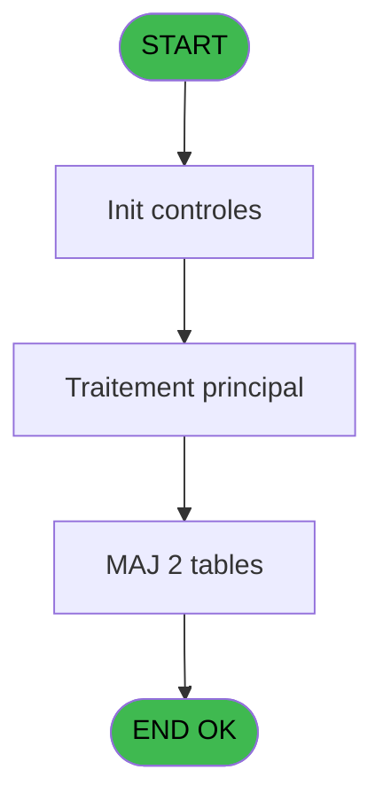
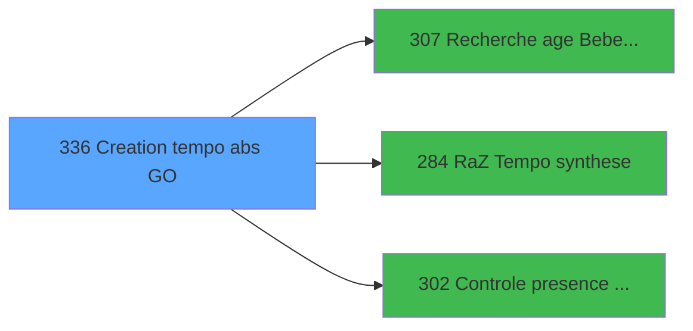

# PBP IDE 336 - Creation tempo abs GO

> **Analyse**: Phases 1-4 2026-02-03 16:30 -> 16:30 (19s) | Assemblage 16:30
> **Pipeline**: V7.2 Enrichi
> **Structure**: 4 onglets (Resume | Ecrans | Donnees | Connexions)

<!-- TAB:Resume -->

## 1. FICHE D'IDENTITE

| Attribut | Valeur |
|----------|--------|
| Projet | PBP |
| IDE Position | 336 |
| Nom Programme | Creation tempo abs GO |
| Fichier source | `Prg_336.xml` |
| Dossier IDE | Specif |
| Taches | 4 (1 ecrans visibles) |
| Tables modifiees | 2 |
| Programmes appeles | 3 |
| :warning: Statut | **ORPHELIN_POTENTIEL** |

## 2. DESCRIPTION FONCTIONNELLE

**Creation tempo abs GO** assure la gestion complete de ce processus.

Le flux de traitement s'organise en **3 blocs fonctionnels** :

- **Creation** (2 taches) : insertion d'enregistrements en base (mouvements, prestations)
- **Consultation** (1 tache) : ecrans de recherche, selection et consultation
- **Traitement** (1 tache) : traitements metier divers

**Donnees modifiees** : 2 tables en ecriture (tempo_mecano_dossier_grou, tempo_userlist).

**Logique metier** : 7 regles identifiees couvrant conditions metier, valeurs par defaut.

Detail : phases du traitement

#### Phase 1 : Traitement (1 tache)

- **336** - Veuillez patienter ... **[[ECRAN]](#ecran-t1)**

#### Phase 2 : Creation (2 taches)

- **336.1** - Creation Tempo gene
- **336.2** - Creation tempo bateaux police

#### Phase 3 : Consultation (1 tache)

- **336.3** - Recherche Code Village

Delegue a : [Recherche age Bebe_Enfant (IDE 307)](PBP-IDE-307.md)

#### Tables impactees

| Table | Operations | Role metier |
|-------|-----------|-------------|
| tempo_mecano_dossier_grou | **W**/L (2 usages) | Table temporaire ecran |
| tempo_userlist | **W**/L (2 usages) | Table temporaire ecran |

## 3. BLOCS FONCTIONNELS

### 3.1 Traitement (1 tache)

Traitements internes.

---

#### 336 - Veuillez patienter ... [[ECRAN]](#ecran-t1)

**Role** : Traitement : Veuillez patienter ....
**Ecran** : 424 x 57 DLU (MDI) | [Voir mockup](#ecran-t1)

### 3.2 Creation (2 taches)

Insertion de nouveaux enregistrements en base.

---

#### 336.1 - Creation Tempo gene

**Role** : Creation d'enregistrement : Creation Tempo gene.

---

#### 336.2 - Creation tempo bateaux police

**Role** : Creation d'enregistrement : Creation tempo bateaux police.

### 3.3 Consultation (1 tache)

Ecrans de recherche et consultation.

---

#### 336.3 - Recherche Code Village

**Role** : Traitement : Recherche Code Village.
**Variables liees** : BB (v.Code vol aller A), BD (v.Code vol retour Z), J (>CodeListe), N (>CodeVol), O (>DateVillage)
**Delegue a** : [Recherche age Bebe_Enfant (IDE 307)](PBP-IDE-307.md)

## 5. REGLES METIER

7 regles identifiees:

### Autres (7 regles)

#### [RM-001] Si >CodeListe [J]='P' alors >DateCalcul [B] sinon w0_RetCommentaire [Y])

| Element | Detail |
|---------|--------|
| **Condition** | `>CodeListe [J]='P'` |
| **Si vrai** | >DateCalcul [B] |
| **Si faux** | w0_RetCommentaire [Y]) |
| **Variables** | B (>DateCalcul), J (>CodeListe), Y (w0_RetCommentaire) |
| **Expression source** | Expression 17 : `IF (>CodeListe [J]='P',>DateCalcul [B],w0_RetCommentaire [Y]` |
| **Exemple** | Si >CodeListe [J]='P' → >DateCalcul [B]. Sinon → w0_RetCommentaire [Y]) |

#### [RM-002] Si >Index [A]=5 alors >DateMaxDebut [E]+14 sinon >DateMaxDebut [E])

| Element | Detail |
|---------|--------|
| **Condition** | `>Index [A]=5` |
| **Si vrai** | >DateMaxDebut [E]+14 |
| **Si faux** | >DateMaxDebut [E]) |
| **Variables** | A (>Index), E (>DateMaxDebut) |
| **Expression source** | Expression 29 : `IF (>Index [A]=5,>DateMaxDebut [E]+14,>DateMaxDebut [E])` |
| **Exemple** | Si >Index [A]=5 → >DateMaxDebut [E]+14. Sinon → >DateMaxDebut [E]) |

#### [RM-003] Si >Index [A]=6 alors >DateMaxFin [G]+14 sinon >DateMaxFin [G])

| Element | Detail |
|---------|--------|
| **Condition** | `>Index [A]=6` |
| **Si vrai** | >DateMaxFin [G]+14 |
| **Si faux** | >DateMaxFin [G]) |
| **Variables** | A (>Index), G (>DateMaxFin) |
| **Expression source** | Expression 30 : `IF (>Index [A]=6,>DateMaxFin [G]+14,>DateMaxFin [G])` |
| **Exemple** | Si >Index [A]=6 → >DateMaxFin [G]+14. Sinon → >DateMaxFin [G]) |

#### [RM-004] Si [OQ]>0 alors [OQ] sinon 0)

| Element | Detail |
|---------|--------|
| **Condition** | `[OQ]>0` |
| **Si vrai** | [OQ] |
| **Si faux** | 0) |
| **Expression source** | Expression 41 : `IF ([OQ]>0,[OQ],0)` |
| **Exemple** | Si [OQ]>0 → [OQ]. Sinon → 0) |

#### [RM-005] Si >CodeListe [J]<>'P' alors w0_Age [CA]=>TypeHebergement [L] AND Trim(MID (w0_NumAdherent [BZ] sinon 2,2))='1',[EL]=>TypeHebergement [L] AND Trim(MID ([EQ],2,2))='1')

| Element | Detail |
|---------|--------|
| **Condition** | `>CodeListe [J]<>'P'` |
| **Si vrai** | w0_Age [CA]=>TypeHebergement [L] AND Trim(MID (w0_NumAdherent [BZ] |
| **Si faux** | 2,2))='1',[EL]=>TypeHebergement [L] AND Trim(MID ([EQ],2,2))='1') |
| **Variables** | J (>CodeListe), L (>TypeHebergement), BZ (w0_NumAdherent), CA (w0_Age) |
| **Expression source** | Expression 73 : `IF (>CodeListe [J]<>'P',w0_Age [CA]=>TypeHebergement [L] AND` |
| **Exemple** | Si >CodeListe [J]<>'P' → w0_Age [CA]=>TypeHebergement [L] AND Trim(MID (w0_NumAdherent [BZ] |

#### [RM-006] Valeur par defaut si W0_CondPresent [CE] est vide

| Element | Detail |
|---------|--------|
| **Condition** | `W0_CondPresent [CE]='' OR W0_CondPresent [CE]='*'` |
| **Si vrai** | [PH] |
| **Si faux** | W0_CondPresent [CE]) |
| **Variables** | CE (W0_CondPresent) |
| **Expression source** | Expression 123 : `IF(W0_CondPresent [CE]='' OR W0_CondPresent [CE]='*',[PH],W0` |
| **Exemple** | Si W0_CondPresent [CE]='' OR W0_CondPresent [CE]='*' → [PH]. Sinon → W0_CondPresent [CE]) |

#### [RM-007] Si VG88 alors CodeVolAller([AA] sinon [AB]), [PN])

| Element | Detail |
|---------|--------|
| **Condition** | `VG88` |
| **Si vrai** | CodeVolAller([AA] |
| **Si faux** | [AB]), [PN]) |
| **Expression source** | Expression 124 : `IF(VG88, CodeVolAller([AA], [AB]), [PN])` |
| **Exemple** | Si VG88 → CodeVolAller([AA]. Sinon → [AB]), [PN]) |

## 6. CONTEXTE

- **Appele par**: (aucun)
- **Appelle**: 3 programmes | **Tables**: 16 (W:2 R:2 L:14) | **Taches**: 4 | **Expressions**: 134

<!-- TAB:Ecrans -->

## 8. ECRANS

### 8.1 Forms visibles (1 / 4)

| # | Position | Tache | Nom | Type | Largeur | Hauteur | Bloc |
|---|----------|-------|-----|------|---------|---------|------|
| 1 | 336 | 336 | Veuillez patienter ... | MDI | 424 | 57 | Traitement |

### 8.2 Mockups Ecrans

---

#### 336 - Veuillez patienter ...
**Tache** : [336](#t1) | **Type** : MDI | **Dimensions** : 424 x 57 DLU
**Bloc** : Traitement | **Titre IDE** : Veuillez patienter ...

<!-- FORM-DATA:
{
    "width":  424,
    "vFactor":  8,
    "type":  "MDI",
    "hFactor":  8,
    "controls":  [
                     {
                         "x":  0,
                         "type":  "label",
                         "var":  "",
                         "y":  0,
                         "w":  423,
                         "fmt":  "",
                         "name":  "",
                         "h":  29,
                         "color":  "",
                         "text":  "",
                         "parent":  null
                     },
                     {
                         "x":  101,
                         "type":  "label",
                         "var":  "",
                         "y":  10,
                         "w":  277,
                         "fmt":  "",
                         "name":  "",
                         "h":  8,
                         "color":  "7",
                         "text":  "Traitement GO en cours ...",
                         "parent":  null
                     },
                     {
                         "x":  0,
                         "type":  "label",
                         "var":  "",
                         "y":  29,
                         "w":  423,
                         "fmt":  "",
                         "name":  "",
                         "h":  27,
                         "color":  "",
                         "text":  "",
                         "parent":  null
                     },
                     {
                         "x":  103,
                         "type":  "label",
                         "var":  "",
                         "y":  33,
                         "w":  114,
                         "fmt":  "",
                         "name":  "",
                         "h":  8,
                         "color":  "",
                         "text":  "Analyses :",
                         "parent":  4
                     },
                     {
                         "x":  103,
                         "type":  "label",
                         "var":  "",
                         "y":  44,
                         "w":  150,
                         "fmt":  "",
                         "name":  "",
                         "h":  8,
                         "color":  "",
                         "text":  "Selectionnes :",
                         "parent":  4
                     },
                     {
                         "x":  4,
                         "type":  "image",
                         "var":  "",
                         "y":  2,
                         "w":  72,
                         "fmt":  "",
                         "name":  "",
                         "h":  25,
                         "color":  "",
                         "text":  "",
                         "parent":  null
                     },
                     {
                         "x":  265,
                         "type":  "edit",
                         "var":  "",
                         "y":  31,
                         "w":  56,
                         "fmt":  "",
                         "name":  "",
                         "h":  9,
                         "color":  "",
                         "text":  "",
                         "parent":  4
                     },
                     {
                         "x":  265,
                         "type":  "edit",
                         "var":  "",
                         "y":  43,
                         "w":  56,
                         "fmt":  "",
                         "name":  "",
                         "h":  9,
                         "color":  "",
                         "text":  "",
                         "parent":  4
                     }
                 ],
    "taskId":  "336",
    "height":  57
}
-->

<strong>Champs : 2 champs</strong>

| Pos (x,y) | Nom | Variable | Type |
|-----------|-----|----------|------|
| 265,31 | (sans nom) | - | edit |
| 265,43 | (sans nom) | - | edit |

## 9. NAVIGATION

Ecran unique: **Veuillez patienter ...**

### 9.3 Structure hierarchique (4 taches)

| Position | Tache | Type | Dimensions | Bloc |
|----------|-------|------|------------|------|
| **336.1** | [**Veuillez patienter ...** (336)](#t1) [mockup](#ecran-t1) | MDI | 424x57 | Traitement |
| **336.2** | [**Creation Tempo gene** (336.1)](#t2) | MDI | - | Creation |
| 336.2.1 | [Creation tempo bateaux police (336.2)](#t3) | MDI | - | |
| **336.3** | [**Recherche Code Village** (336.3)](#t4) | - | - | Consultation |

### 9.4 Algorigramme

> **Legende**: Vert = START/END OK | Rouge = END KO | Bleu = Decisions
> *Algorigramme auto-genere. Utiliser `/algorigramme` pour une synthese metier detaillee.*

<!-- TAB:Donnees -->

## 10. TABLES

### Tables utilisees (16)

| ID | Nom | Description | Type | R | W | L | Usages |
|----|-----|-------------|------|---|---|---|--------|
| 31 | gm-complet_______gmc |  | DB | R |   |   | 1 |
| 34 | hebergement______heb | Hebergement (chambres) | DB |   |   | L | 1 |
| 35 | personnel_go______go |  | DB |   |   | L | 1 |
| 47 | compte_gm________cgm | Comptes GM (generaux) | DB |   |   | L | 1 |
| 81 | societe__________soc |  | DB |   |   | L | 1 |
| 104 | fichier_menage |  | DB |   |   | L | 1 |
| 118 | tables_imports |  | DB |   |   | L | 1 |
| 119 | tables_pays_tel_ |  | DB |   |   | L | 1 |
| 171 | commentaire______com |  | DB |   |   | L | 1 |
| 285 | email |  | DB |   |   | L | 1 |
| 366 | pms_print_param |  | DB |   |   | L | 1 |
| 372 | pv_budget |  | DB | R |   |   | 1 |
| 598 | tempo_ecr_previsions | Table temporaire ecran | TMP |   |   | L | 3 |
| 609 | tempo_mecano_dossier_grou | Table temporaire ecran | TMP |   | **W** | L | 2 |
| 619 | tempo_userlist | Table temporaire ecran | TMP |   | **W** | L | 2 |
| 637 | tempo_zone_secteur | Table temporaire ecran | DB |   |   | L | 1 |

### Colonnes par table (4 / 4 tables avec colonnes identifiees)

Table 31 - gm-complet_______gmc (R) - 1 usages

| Lettre | Variable | Acces | Type |
|--------|----------|-------|------|
| A | >Index | R | Numeric |
| B | >DateCalcul | R | Date |
| C | >HeureCalcul | R | Alpha |
| D | >DateMinDebut | R | Date |
| E | >DateMaxDebut | R | Date |
| F | >DateMinFin | R | Date |
| G | >DateMaxFin | R | Date |
| H | >w0_HeureMin | R | Numeric |
| I | >w0_HeureMax | R | Numeric |
| J | >CodeListe | R | Alpha |
| K | >Logement | R | Alpha |
| L | >TypeHebergement | R | Alpha |
| M | >TopListe | R | Alpha |
| N | >CodeVol | R | Alpha |
| O | >DateVillage | R | Date |
| P | >HeureVillage | R | Alpha |
| Q | >AgeMini | R | Numeric |
| R | >AgeMaxi | R | Numeric |
| S | <Total | R | Numeric |
| T | <NbSelect | R | Numeric |
| U | >TULCategorie | R | Alpha |
| V | >TULNomTable | R | Alpha |
| W | >Gestion Crise | R | Logical |
| X | >Lieu Séjour | R | Alpha |
| Y | w0_RetCommentaire | R | Logical |
| Z | w0_Age------------------------- | R | Alpha |
| BA | w0_Arrivee--------------------- | R | Alpha |
| BB | v.Code vol aller A | R | Unicode |
| BC | w0_Depart---------------------- | R | Alpha |
| BD | v.Code vol retour Z | R | Unicode |
| BE | w0_RetSelect | R | Logical |
| BF | w0_Circuit--------------------- | R | Logical |
| BG | W0_PresenceAv------------------ | R | Logical |
| BH | w0_NationSelect | R | Alpha |
| BI | w0_RetHebPreced---------------- | R | Logical |
| BJ | w0_RetHebSuiv------------------ | R | Logical |
| BK | v.Date début | R | Date |
| BL | v.Date fin | R | Date |
| BM | v.Retour abs personnel | R | Logical |
| BN | w0_Type | R | Alpha |
| BO | w0_DateMaxDebut | R | Date |
| BP | w0_DateMaxFin | R | Date |
| BQ | w0_Total | R | Numeric |
| BR | w0_NbSelect | R | Numeric |
| BS | w0_AgeBebe | R | Numeric |
| BT | w0_AgeEnfant | R | Numeric |
| BU | w0_RetCtlHeb | R | Logical |
| BV | w0_TelInt | R | Numeric |
| BW | w0_TelExt_Commune | R | Alpha |
| BX | w0_FaxVille | R | Alpha |
| BY | w0_TypeEcran | R | Alpha |
| BZ | w0_NumAdherent | R | Alpha |
| CA | w0_Age | R | Numeric |
| CB | w0_Cabine | R | Alpha |
| CC | w0_CondArrivant | R | Logical |
| CD | w0_CondArrive | R | Logical |
| CE | W0_CondPresent | R | Logical |
| CF | w0_CondDepart | R | Logical |
| CG | w0_CondAbsent | R | Logical |
| CH | w0_CondPartant | R | Logical |
| CI | w0_Code_Village | R | Alpha |
| CJ | v.Date/Heure début | R | Numeric |
| CK | v.Date/Heure fin | R | Numeric |

Table 372 - pv_budget (R) - 1 usages

*Table utilisee uniquement en Link ou aucune colonne Real identifiee dans le DataView.*

Table 609 - tempo_mecano_dossier_grou (**W**/L) - 2 usages

*Table utilisee uniquement en Link ou aucune colonne Real identifiee dans le DataView.*

Table 619 - tempo_userlist (**W**/L) - 2 usages

*Table utilisee uniquement en Link ou aucune colonne Real identifiee dans le DataView.*

## 11. VARIABLES

### 11.1 Variables de session (7)

Variables persistantes pendant toute la session.

| Lettre | Nom | Type | Usage dans |
|--------|-----|------|-----------|
| BB | v.Code vol aller A | Unicode | - |
| BD | v.Code vol retour Z | Unicode | - |
| BK | v.Date début | Date | - |
| BL | v.Date fin | Date | - |
| BM | v.Retour abs personnel | Logical | - |
| CJ | v.Date/Heure début | Numeric | - |
| CK | v.Date/Heure fin | Numeric | - |

### 11.2 Autres (56)

Variables diverses.

| Lettre | Nom | Type | Usage dans |
|--------|-----|------|-----------|
| A | >Index | Numeric | 2x refs |
| B | >DateCalcul | Date | 3x refs |
| C | >HeureCalcul | Alpha | - |
| D | >DateMinDebut | Date | 2x refs |
| E | >DateMaxDebut | Date | 4x refs |
| F | >DateMinFin | Date | 2x refs |
| G | >DateMaxFin | Date | 2x refs |
| H | >w0_HeureMin | Numeric | 9x refs |
| I | >w0_HeureMax | Numeric | 9x refs |
| J | >CodeListe | Alpha | 30x refs |
| K | >Logement | Alpha | 1x refs |
| L | >TypeHebergement | Alpha | 15x refs |
| M | >TopListe | Alpha | 22x refs |
| N | >CodeVol | Alpha | 14x refs |
| O | >DateVillage | Date | 1x refs |
| P | >HeureVillage | Alpha | 1x refs |
| Q | >AgeMini | Numeric | 1x refs |
| R | >AgeMaxi | Numeric | 1x refs |
| S | <Total | Numeric | 1x refs |
| T | <NbSelect | Numeric | - |
| U | >TULCategorie | Alpha | 1x refs |
| V | >TULNomTable | Alpha | 1x refs |
| W | >Gestion Crise | Logical | 2x refs |
| X | >Lieu Séjour | Alpha | 1x refs |
| Y | w0_RetCommentaire | Logical | 5x refs |
| Z | w0_Age------------------------- | Alpha | - |
| BA | w0_Arrivee--------------------- | Alpha | - |
| BC | w0_Depart---------------------- | Alpha | - |
| BE | w0_RetSelect | Logical | - |
| BF | w0_Circuit--------------------- | Logical | - |
| BG | W0_PresenceAv------------------ | Logical | - |
| BH | w0_NationSelect | Alpha | - |
| BI | w0_RetHebPreced---------------- | Logical | - |
| BJ | w0_RetHebSuiv------------------ | Logical | - |
| BN | w0_Type | Alpha | 4x refs |
| BO | w0_DateMaxDebut | Date | - |
| BP | w0_DateMaxFin | Date | - |
| BQ | w0_Total | Numeric | - |
| BR | w0_NbSelect | Numeric | - |
| BS | w0_AgeBebe | Numeric | - |
| BT | w0_AgeEnfant | Numeric | 6x refs |
| BU | w0_RetCtlHeb | Logical | - |
| BV | w0_TelInt | Numeric | 5x refs |
| BW | w0_TelExt_Commune | Alpha | 5x refs |
| BX | w0_FaxVille | Alpha | 4x refs |
| BY | w0_TypeEcran | Alpha | 4x refs |
| BZ | w0_NumAdherent | Alpha | 2x refs |
| CA | w0_Age | Numeric | 25x refs |
| CB | w0_Cabine | Alpha | 5x refs |
| CC | w0_CondArrivant | Logical | - |
| CD | w0_CondArrive | Logical | 1x refs |
| CE | W0_CondPresent | Logical | 2x refs |
| CF | w0_CondDepart | Logical | 2x refs |
| CG | w0_CondAbsent | Logical | - |
| CH | w0_CondPartant | Logical | - |
| CI | w0_Code_Village | Alpha | - |

Toutes les 63 variables (liste complete)

| Cat | Lettre | Nom Variable | Type |
|-----|--------|--------------|------|
| V. | **BB** | v.Code vol aller A | Unicode |
| V. | **BD** | v.Code vol retour Z | Unicode |
| V. | **BK** | v.Date début | Date |
| V. | **BL** | v.Date fin | Date |
| V. | **BM** | v.Retour abs personnel | Logical |
| V. | **CJ** | v.Date/Heure début | Numeric |
| V. | **CK** | v.Date/Heure fin | Numeric |
| Autre | **A** | >Index | Numeric |
| Autre | **B** | >DateCalcul | Date |
| Autre | **C** | >HeureCalcul | Alpha |
| Autre | **D** | >DateMinDebut | Date |
| Autre | **E** | >DateMaxDebut | Date |
| Autre | **F** | >DateMinFin | Date |
| Autre | **G** | >DateMaxFin | Date |
| Autre | **H** | >w0_HeureMin | Numeric |
| Autre | **I** | >w0_HeureMax | Numeric |
| Autre | **J** | >CodeListe | Alpha |
| Autre | **K** | >Logement | Alpha |
| Autre | **L** | >TypeHebergement | Alpha |
| Autre | **M** | >TopListe | Alpha |
| Autre | **N** | >CodeVol | Alpha |
| Autre | **O** | >DateVillage | Date |
| Autre | **P** | >HeureVillage | Alpha |
| Autre | **Q** | >AgeMini | Numeric |
| Autre | **R** | >AgeMaxi | Numeric |
| Autre | **S** | <Total | Numeric |
| Autre | **T** | <NbSelect | Numeric |
| Autre | **U** | >TULCategorie | Alpha |
| Autre | **V** | >TULNomTable | Alpha |
| Autre | **W** | >Gestion Crise | Logical |
| Autre | **X** | >Lieu Séjour | Alpha |
| Autre | **Y** | w0_RetCommentaire | Logical |
| Autre | **Z** | w0_Age------------------------- | Alpha |
| Autre | **BA** | w0_Arrivee--------------------- | Alpha |
| Autre | **BC** | w0_Depart---------------------- | Alpha |
| Autre | **BE** | w0_RetSelect | Logical |
| Autre | **BF** | w0_Circuit--------------------- | Logical |
| Autre | **BG** | W0_PresenceAv------------------ | Logical |
| Autre | **BH** | w0_NationSelect | Alpha |
| Autre | **BI** | w0_RetHebPreced---------------- | Logical |
| Autre | **BJ** | w0_RetHebSuiv------------------ | Logical |
| Autre | **BN** | w0_Type | Alpha |
| Autre | **BO** | w0_DateMaxDebut | Date |
| Autre | **BP** | w0_DateMaxFin | Date |
| Autre | **BQ** | w0_Total | Numeric |
| Autre | **BR** | w0_NbSelect | Numeric |
| Autre | **BS** | w0_AgeBebe | Numeric |
| Autre | **BT** | w0_AgeEnfant | Numeric |
| Autre | **BU** | w0_RetCtlHeb | Logical |
| Autre | **BV** | w0_TelInt | Numeric |
| Autre | **BW** | w0_TelExt_Commune | Alpha |
| Autre | **BX** | w0_FaxVille | Alpha |
| Autre | **BY** | w0_TypeEcran | Alpha |
| Autre | **BZ** | w0_NumAdherent | Alpha |
| Autre | **CA** | w0_Age | Numeric |
| Autre | **CB** | w0_Cabine | Alpha |
| Autre | **CC** | w0_CondArrivant | Logical |
| Autre | **CD** | w0_CondArrive | Logical |
| Autre | **CE** | W0_CondPresent | Logical |
| Autre | **CF** | w0_CondDepart | Logical |
| Autre | **CG** | w0_CondAbsent | Logical |
| Autre | **CH** | w0_CondPartant | Logical |
| Autre | **CI** | w0_Code_Village | Alpha |

## 12. EXPRESSIONS

**134 / 134 expressions decodees (100%)**

### 12.1 Repartition par type

| Type | Expressions | Regles |
|------|-------------|--------|
| CONDITION | 83 | 7 |
| CONSTANTE | 13 | 0 |
| OTHER | 28 | 0 |
| REFERENCE_VG | 1 | 0 |
| CAST_LOGIQUE | 2 | 0 |
| NEGATION | 1 | 0 |
| CONCATENATION | 6 | 0 |

### 12.2 Expressions cles par type

#### CONDITION (83 expressions)

| Type | IDE | Expression | Regle |
|------|-----|------------|-------|
| CONDITION | 41 | `IF ([OQ]>0,[OQ],0)` | [RM-004](#rm-RM-004) |
| CONDITION | 30 | `IF (>Index [A]=6,>DateMaxFin [G]+14,>DateMaxFin [G])` | [RM-003](#rm-RM-003) |
| CONDITION | 124 | `IF(VG88, CodeVolAller([AA], [AB]), [PN])` | [RM-007](#rm-RM-007) |
| CONDITION | 123 | `IF(W0_CondPresent [CE]='' OR W0_CondPresent [CE]='*',[PH],W0_CondPresent [CE])` | [RM-006](#rm-RM-006) |
| CONDITION | 29 | `IF (>Index [A]=5,>DateMaxDebut [E]+14,>DateMaxDebut [E])` | [RM-002](#rm-RM-002) |
| ... | | *+78 autres* | |

#### CONSTANTE (13 expressions)

| Type | IDE | Expression | Regle |
|------|-----|------------|-------|
| CONSTANTE | 83 | `0` | - |
| CONSTANTE | 35 | `'P'` | - |
| CONSTANTE | 34 | `'C'` | - |
| CONSTANTE | 119 | `'TCLME'` | - |
| CONSTANTE | 118 | `'D'` | - |
| ... | | *+8 autres* | |

#### OTHER (28 expressions)

| Type | IDE | Expression | Regle |
|------|-----|------------|-------|
| OTHER | 84 | `[AY]` | - |
| OTHER | 85 | `[AZ]` | - |
| OTHER | 86 | `w0_Arrivee------------... [BA]` | - |
| OTHER | 82 | `[FY]` | - |
| OTHER | 40 | `[AO]` | - |
| ... | | *+23 autres* | |

#### REFERENCE_VG (1 expressions)

| Type | IDE | Expression | Regle |
|------|-----|------------|-------|
| REFERENCE_VG | 21 | `VG1` | - |

#### CAST_LOGIQUE (2 expressions)

| Type | IDE | Expression | Regle |
|------|-----|------------|-------|
| CAST_LOGIQUE | 42 | `[DM] AND (IF(NOT >Gestion Crise [W],[PA] OR w0_CondDepart [CF]='','TRUE'LOG))` | - |
| CAST_LOGIQUE | 28 | `'TRUE'LOG` | - |

#### NEGATION (1 expressions)

| Type | IDE | Expression | Regle |
|------|-----|------------|-------|
| NEGATION | 122 | `NOT >Gestion Crise [W]` | - |

#### CONCATENATION (6 expressions)

| Type | IDE | Expression | Regle |
|------|-----|------------|-------|
| CONCATENATION | 100 | `[GP] OR >CodeListe [J]='A' AND Trim (w0_Age [CA])&w0_Cabine [CB]<>Trim ([FH])&[FI] AND [EY] OR >CodeListe [J]='A' AND NOT ([EY]) AND w0_TypeEcran [BY]='P'` | - |
| CONCATENATION | 101 | `[GR] OR >CodeListe [J]='D' AND Trim (w0_Age [CA])&w0_Cabine [CB]<>Trim ([FS])&[FT] AND [FJ] OR >CodeListe [J]='D' AND NOT ([FJ]) AND w0_TypeEcran [BY]='P'` | - |
| CONCATENATION | 102 | `[GT] OR >CodeListe [J]='R' AND Trim (w0_Age [CA])&w0_Cabine [CB]<>Trim ([FS])&[FT] AND [FJ] OR >CodeListe [J]='R' AND NOT ([FJ])` | - |
| CONCATENATION | 37 | `[AK]&Str ([AL],'10P0Z0')&[AM]&Str ([AN],'3L')` | - |
| CONCATENATION | 38 | `[AK]&Str ([AL],'10P0Z0')&' '&Str ([AN],'3L')` | - |
| ... | | *+1 autres* | |

### 12.3 Toutes les expressions (134)

Voir les 134 expressions

#### CONDITION (83)

| IDE | Expression Decodee |
|-----|-------------------|
| 36 | `<Total [S]+1` |
| 128 | `[PX]*86400+>w0_HeureMin [H]*3600` |
| 129 | `[PY]*86400+>w0_HeureMax [I]*3600` |
| 17 | `IF (>CodeListe [J]='P',>DateCalcul [B],w0_RetCommentaire [Y])` |
| 29 | `IF (>Index [A]=5,>DateMaxDebut [E]+14,>DateMaxDebut [E])` |
| 30 | `IF (>Index [A]=6,>DateMaxFin [G]+14,>DateMaxFin [G])` |
| 41 | `IF ([OQ]>0,[OQ],0)` |
| 73 | `IF (>CodeListe [J]<>'P',w0_Age [CA]=>TypeHebergement [L] AND Trim(MID (w0_NumAdherent [BZ],2,2))='1',[EL]=>TypeHebergement [L] AND Trim(MID ([EQ],2,2))='1')` |
| 74 | `IF (>CodeListe [J]<>'P',w0_Age [CA]=>TypeHebergement [L] AND Trim(MID(w0_NumAdherent [BZ],2,2))<>'1',[EL]=>TypeHebergement [L] AND Trim(MID ([EQ],2,2))<>'1')` |
| 123 | `IF(W0_CondPresent [CE]='' OR W0_CondPresent [CE]='*',[PH],W0_CondPresent [CE])` |
| 124 | `IF(VG88, CodeVolAller([AA], [AB]), [PN])` |
| 125 | `IF(VG88, CodeVolRetour([AA], [AB]), [PM])` |
| 6 | `>Lieu Séjour [X]` |
| 7 | `CndRange (>DateMaxDebut [E]>0,>DateMaxDebut [E])` |
| 8 | `CndRange (>DateMinFin [F]>0,>DateMinFin [F])` |
| 16 | `CndRange (>CodeListe [J]='P',w0_RetCommentaire [Y])` |
| 22 | `>TULCategorie [U]` |
| 23 | `>TULNomTable [V]` |
| 43 | `>CodeListe [J]='P'` |
| 44 | `>Logement [K]=W0_CondPresent [CE] OR >Logement [K]=''` |
| 45 | `>TopListe [M]='PL'` |
| 46 | `>TopListe [M]='GR'` |
| 47 | `>TopListe [M]='RE'` |
| 48 | `>TopListe [M]='CA'` |
| 49 | `>TopListe [M]='MI'` |
| 50 | `>TopListe [M]='BB'` |
| 51 | `>TopListe [M]='EN'` |
| 52 | `>TopListe [M]='SI'` |
| 53 | `>TopListe [M]='NS'` |
| 54 | `>TopListe [M]='PY'` |
| 55 | `>TopListe [M]='HM'` |
| 56 | `>TopListe [M]='VV'` |
| 57 | `>TopListe [M]='NV'` |
| 58 | `>TopListe [M]='ST'` |
| 59 | `>TopListe [M]='SE'` |
| 60 | `>TopListe [M]='AG'` |
| 61 | `>TopListe [M]='CO'` |
| 62 | `>TopListe [M]='PO'` |
| 63 | `>TopListe [M]='BA'` |
| 64 | `>TopListe [M]='CP'` |
| 65 | `>TypeHebergement [L]=IF (>CodeListe [J]='P',[EL],w0_Age [CA])` |
| 66 | `>TypeHebergement [L]=IF (>CodeListe [J]='P',[EL],w0_Age [CA]) AND [AB]=0` |
| 67 | `>TypeHebergement [L]=IF (>CodeListe [J]='P',[EL],w0_Age [CA]) AND [AN]=0 AND [AX]='O'` |
| 68 | `>CodeVol [N]='' OR >CodeVol [N]=IF (>CodeListe [J]='D' OR >CodeListe [J]='R',[DL],[DD]) AND >TypeHebergement [L]=IF (>CodeListe [J]='P',[EL],w0_Age [CA])` |
| 69 | `(w0_AgeEnfant [BT]=>DateCalcul [B] AND w0_AgeEnfant [BT]=>DateVillage [O] AND w0_TelInt [BV]=>HeureVillage [P] OR w0_AgeEnfant [BT]=0 AND w0_TelInt [BV]='') AND >TypeHebergement [L]=IF (>CodeListe [J]<>'P',[EL],w0_Age [CA])` |
| 70 | `>TypeHebergement [L]=IF (>CodeListe [J]='P',[EL],w0_Age [CA]) AND [AH]='M'` |
| 71 | `>TypeHebergement [L]=IF (>CodeListe [J]='P',[EL],w0_Age [CA]) AND ([AG]<=[GE] AND ([OO])>0 OR [OP]>0)` |
| 72 | `>TypeHebergement [L]=IF (>CodeListe [J]='P',[EL],w0_Age [CA]) AND ([AG]<=[GF] AND [AG]>[GE])` |
| 75 | `>TypeHebergement [L]=IF (>CodeListe [J]='P',[EL],w0_Age [CA]) AND [EX]` |
| 78 | `>AgeMini [Q]>0 AND [OQ]<=>AgeMaxi [R] AND [OQ]>=>AgeMini [Q] OR >AgeMini [Q]=0 AND [OQ]<=>AgeMaxi [R] AND ([OQ]>0 OR [OR]>0) AND >TypeHebergement [L]=IF (>CodeListe [J]='P',[EL],w0_Age [CA])` |
| 79 | `w0_Age [CA]=>TypeHebergement [L]` |
| 89 | `>CodeListe [J]='A'` |
| 90 | `>CodeListe [J]='V' AND w0_TypeEcran [BY]='P'` |
| 91 | `>CodeListe [J]='P' AND [EH]='P' AND [GG]` |
| 92 | `>CodeListe [J]='D' AND w0_TypeEcran [BY]='P'` |
| 93 | `>CodeListe [J]='B' AND [EH]<>'P'` |
| 94 | `>CodeListe [J]='R'` |
| 96 | `>CodeListe [J]='P' AND [EH]='P'` |
| 98 | `>CodeVol [N]=''` |
| 104 | `[GO] OR >CodeVol [N]<>'' AND NOT ([EY]) AND w0_AgeEnfant [BT]<>[DA] AND [DD]=>CodeVol [N]` |
| 107 | `[GP] OR >CodeVol [N]<>'' AND NOT ([EY]) AND w0_AgeEnfant [BT]<>[DA] AND [DD]=>CodeVol [N]` |
| 110 | `[GR] OR >CodeVol [N]<>'' AND NOT ([FJ]) AND w0_TelExt_Commune [BW]<>[DI] AND [DL]=>CodeVol [N]` |
| 113 | `[GT] OR >CodeVol [N]<>'' AND NOT ([FJ]) AND w0_TelExt_Commune [BW]<>[DI] AND [DL]=>CodeVol [N]` |
| 115 | `CndRange([OS]<>'',[OS])` |
| 116 | `>TopListe [M]='CO'` |
| 117 | `>TopListe [M]='ST'` |
| 120 | `CndRange([OS]<>'',[OS])` |
| 126 | `MIN(>DateMinDebut [D],>DateMaxDebut [E])` |
| 127 | `MAX(>DateMinFin [F],>DateMaxFin [G])` |
| 132 | `CndRange(>DateMaxDebut [E]<>0,>DateMaxDebut [E])` |
| 133 | `CndRange(>DateMinDebut [D]<>0,>DateMinDebut [D])` |
| 14 | `CndRange (InStr ('PDR',>CodeListe [J])=0,w0_RetCommentaire [Y])` |
| 15 | `CndRange (InStr ('PAVB',>CodeListe [J])>0,IF (>CodeListe [J]='P',>DateCalcul [B],w0_RetCommentaire [Y]))` |
| 76 | `>TypeHebergement [L]=IF (>CodeListe [J]='P',[EL],w0_Age [CA]) AND InStr ('VV',IF (>CodeListe [J]='D' OR >CodeListe [J]='R',Left ([DL],2),Left ([DD],2)))>0` |
| 77 | `>TypeHebergement [L]=IF (>CodeListe [J]='P',[EL],w0_Age [CA]) AND InStr ('VV',IF (>CodeListe [J]='D' OR >CodeListe [J]='R',Left ([DL],2),Left ([DD],2)))=0` |
| 103 | `[GO] OR >CodeVol [N]<>'' AND [EY] AND >w0_HeureMin [H]<Val (w0_TelInt [BV],'2') AND >w0_HeureMax [I]>=Val (w0_TelInt [BV],'2')` |
| 105 | `[GO] OR >CodeVol [N]<>'' AND NOT ([EY]) AND w0_AgeEnfant [BT]<>[DA] AND >w0_HeureMin [H]<Val (w0_TelInt [BV],'2') AND >w0_HeureMax [I]>=Val (w0_TelInt [BV],'2')` |
| 106 | `[GP] OR >CodeVol [N]<>'' AND [EY] AND >w0_HeureMin [H]<Val (w0_TelInt [BV],'2') AND >w0_HeureMax [I]>=Val (w0_TelInt [BV],'2')` |
| 108 | `[GP] OR >CodeVol [N]<>'' AND NOT ([EY]) AND w0_AgeEnfant [BT]<>[DA] AND >w0_HeureMin [H]<Val (w0_TelInt [BV],'2') AND >w0_HeureMax [I]>=Val (w0_TelInt [BV],'2')` |
| 109 | `[GR] OR >CodeVol [N]<>'' AND [FJ] AND >w0_HeureMin [H]<Val (w0_FaxVille [BX],'2') AND >w0_HeureMax [I]>=Val (w0_FaxVille [BX],'2')` |
| 111 | `[GR] OR >CodeVol [N]<>'' AND NOT ([FJ]) AND w0_TelExt_Commune [BW]<>[DI] AND >w0_HeureMin [H]<Val (w0_FaxVille [BX],'2') AND >w0_HeureMax [I]>=Val (w0_FaxVille [BX],'2')` |
| 112 | `[GT] OR >CodeVol [N]<>'' AND [FJ] AND >w0_HeureMin [H]<Val (w0_FaxVille [BX],'2') AND >w0_HeureMax [I]>=Val (w0_FaxVille [BX],'2')` |
| 114 | `[GT] OR >CodeVol [N]<>'' AND NOT ([FJ]) AND w0_TelExt_Commune [BW]<>[DI] AND >w0_HeureMin [H]<Val (w0_FaxVille [BX],'2') AND >w0_HeureMax [I]>=Val (w0_FaxVille [BX],'2')` |

#### CONSTANTE (13)

| IDE | Expression Decodee |
|-----|-------------------|
| 1 | `'VBEBE'` |
| 2 | `'VENFA'` |
| 20 | `'H'` |
| 24 | `'M'` |
| 25 | `'TNATI'` |
| 31 | `'A'` |
| 32 | `'Z'` |
| 34 | `'C'` |
| 35 | `'P'` |
| 83 | `0` |
| 87 | `''` |
| 118 | `'D'` |
| 119 | `'TCLME'` |

#### OTHER (28)

| IDE | Expression Decodee |
|-----|-------------------|
| 3 | `[AS]` |
| 4 | `GetParam('SOCIETE')` |
| 5 | `[QK]` |
| 9 | `[AA]` |
| 10 | `[AB]` |
| 11 | `GetParam ('LANGUE')` |
| 12 | `[AS]` |
| 13 | `[AL]` |
| 18 | `w0_AgeEnfant [BT]` |
| 19 | `w0_TelExt_Commune [BW]` |
| 26 | `Left (w0_Age [CA],3)` |
| 27 | `w0_Cabine [CB]` |
| 33 | `w0_RetCommentaire [Y]` |
| 39 | `[AG]` |
| 40 | `[AO]` |
| 80 | `[FW]` |
| 81 | `[FX]` |
| 82 | `[FY]` |
| 84 | `[AY]` |
| 85 | `[AZ]` |
| 86 | `w0_Arrivee------------... [BA]` |
| 88 | `w0_CondArrive [CD]` |
| 95 | `[GQ] AND [GG]` |
| 97 | `w0_RetHebPreced-------... [BI]` |
| 121 | `w0_CondDepart [CF]` |
| 130 | `[QL]` |
| 131 | `[QM]` |
| 134 | `GetParam ('SOCIETE')` |

#### REFERENCE_VG (1)

| IDE | Expression Decodee |
|-----|-------------------|
| 21 | `VG1` |

#### CAST_LOGIQUE (2)

| IDE | Expression Decodee |
|-----|-------------------|
| 28 | `'TRUE'LOG` |
| 42 | `[DM] AND (IF(NOT >Gestion Crise [W],[PA] OR w0_CondDepart [CF]='','TRUE'LOG))` |

#### NEGATION (1)

| IDE | Expression Decodee |
|-----|-------------------|
| 122 | `NOT >Gestion Crise [W]` |

#### CONCATENATION (6)

| IDE | Expression Decodee |
|-----|-------------------|
| 37 | `[AK]&Str ([AL],'10P0Z0')&[AM]&Str ([AN],'3L')` |
| 38 | `[AK]&Str ([AL],'10P0Z0')&' '&Str ([AN],'3L')` |
| 99 | `[GO] OR >CodeListe [J]='V' AND Trim (w0_Age [CA])&w0_Cabine [CB]<>Trim ([FH])&[FI] AND [EY] OR >CodeListe [J]='V' AND NOT ([EY])` |
| 100 | `[GP] OR >CodeListe [J]='A' AND Trim (w0_Age [CA])&w0_Cabine [CB]<>Trim ([FH])&[FI] AND [EY] OR >CodeListe [J]='A' AND NOT ([EY]) AND w0_TypeEcran [BY]='P'` |
| 101 | `[GR] OR >CodeListe [J]='D' AND Trim (w0_Age [CA])&w0_Cabine [CB]<>Trim ([FS])&[FT] AND [FJ] OR >CodeListe [J]='D' AND NOT ([FJ]) AND w0_TypeEcran [BY]='P'` |
| 102 | `[GT] OR >CodeListe [J]='R' AND Trim (w0_Age [CA])&w0_Cabine [CB]<>Trim ([FS])&[FT] AND [FJ] OR >CodeListe [J]='R' AND NOT ([FJ])` |

<!-- TAB:Connexions -->

## 13. GRAPHE D'APPELS

### 13.1 Chaine depuis Main (Callers)

**Chemin**: (pas de callers directs)

### 13.2 Callers

| IDE | Nom Programme | Nb Appels |
|-----|---------------|-----------|
| - | (aucun) | - |

### 13.3 Callees (programmes appeles)

### 13.4 Detail Callees avec contexte

| IDE | Nom Programme | Appels | Contexte |
|-----|---------------|--------|----------|
| [307](PBP-IDE-307.md) | Recherche age Bebe_Enfant | 2 | Sous-programme |
| [284](PBP-IDE-284.md) | RaZ Tempo synthese | 1 | Reinitialisation |
| [302](PBP-IDE-302.md) | Controle presence heberg | 1 | Controle/validation |

## 14. RECOMMANDATIONS MIGRATION

### 14.1 Profil du programme

| Metrique | Valeur | Impact migration |
|----------|--------|-----------------|
| Lignes de logique | 573 | Programme volumineux |
| Expressions | 134 | Logique moderee |
| Tables WRITE | 2 | Impact faible |
| Sous-programmes | 3 | Peu de dependances |
| Ecrans visibles | 1 | Ecran unique ou traitement batch |
| Code desactive | 0.2% (1 / 573) | Code sain |
| Regles metier | 7 | Quelques regles a preserver |

### 14.2 Plan de migration par bloc

#### Traitement (1 tache: 1 ecran, 0 traitement)

- **Strategie** : 1 composant(s) UI (Razor/React) avec formulaires et validation.
- 3 sous-programme(s) a migrer ou a reutiliser depuis les services existants.
- Decomposer les taches en services unitaires testables.

#### Creation (2 taches: 0 ecran, 2 traitements)

- **Strategie** : Repository pattern avec Entity Framework Core.
- Insertion via `IRepository<T>.CreateAsync()`

#### Consultation (1 tache: 0 ecran, 1 traitement)

- **Strategie** : Composants de recherche/selection en modales.

### 14.3 Dependances critiques

| Dependance | Type | Appels | Impact |
|------------|------|--------|--------|
| tempo_mecano_dossier_grou | Table WRITE (Temp) | 1x | Schema + repository |
| tempo_userlist | Table WRITE (Temp) | 1x | Schema + repository |
| [Recherche age Bebe_Enfant (IDE 307)](PBP-IDE-307.md) | Sous-programme | 2x | Haute - Sous-programme |
| [Controle presence heberg (IDE 302)](PBP-IDE-302.md) | Sous-programme | 1x | Normale - Controle/validation |
| [RaZ Tempo synthese (IDE 284)](PBP-IDE-284.md) | Sous-programme | 1x | Normale - Reinitialisation |

---
*Spec DETAILED generee par Pipeline V7.2 - 2026-02-03 16:30*
