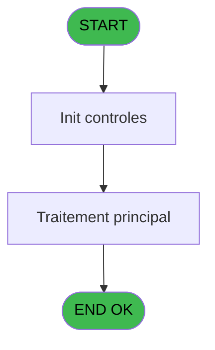
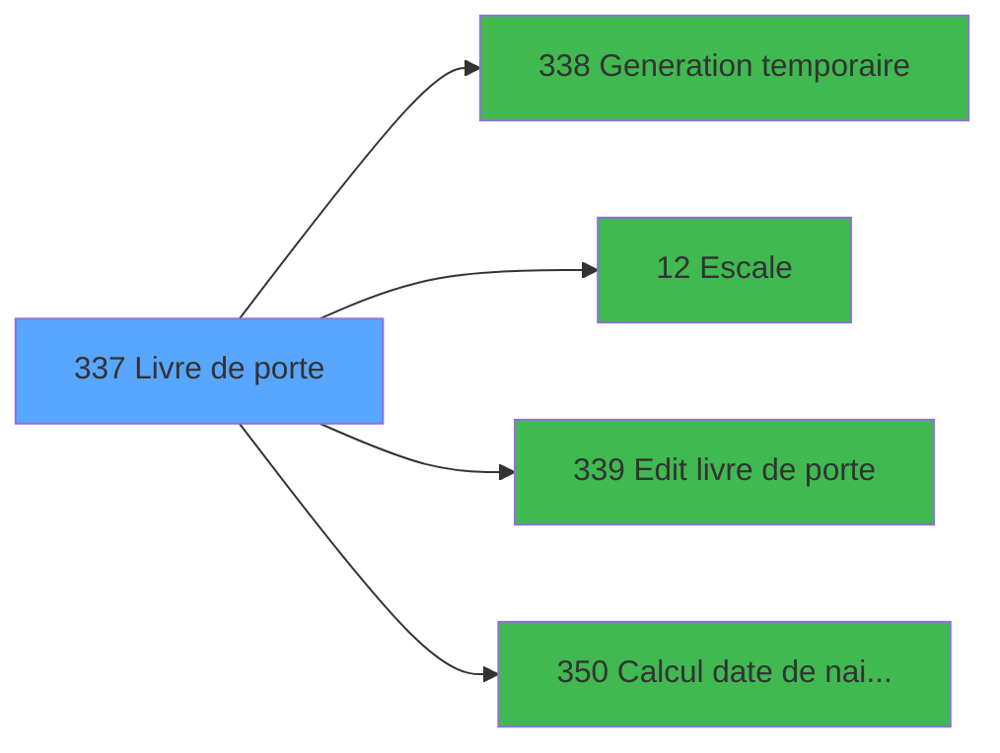

# PBP IDE 337 - Livre de porte

> **Analyse**: Phases 1-4 2026-02-03 16:30 -> 16:30 (15s) | Assemblage 16:30
> **Pipeline**: V7.2 Enrichi
> **Structure**: 4 onglets (Resume | Ecrans | Donnees | Connexions)

<!-- TAB:Resume -->

## 1. FICHE D'IDENTITE

| Attribut | Valeur |
|----------|--------|
| Projet | PBP |
| IDE Position | 337 |
| Nom Programme | Livre de porte |
| Fichier source | `Prg_337.xml` |
| Dossier IDE | Specif |
| Taches | 1 (1 ecrans visibles) |
| Tables modifiees | 0 |
| Programmes appeles | 4 |
| :warning: Statut | **ORPHELIN_POTENTIEL** |

## 2. DESCRIPTION FONCTIONNELLE

**Livre de porte** assure la gestion complete de ce processus.

Le flux de traitement s'organise en **1 blocs fonctionnels** :

- **Traitement** (1 tache) : traitements metier divers

## 3. BLOCS FONCTIONNELS

### 3.1 Traitement (1 tache)

Traitements internes.

---

#### 337 - Livre de Porte [[ECRAN]](#ecran-t1)

**Role** : Traitement : Livre de Porte.
**Ecran** : 730 x 164 DLU (MDI) | [Voir mockup](#ecran-t1)
**Delegue a** : [   Generation temporaire (IDE 338)](PBP-IDE-338.md), [Escale (IDE 12)](PBP-IDE-12.md), [   Edit livre de porte (IDE 339)](PBP-IDE-339.md)

## 5. REGLES METIER

*(Aucune regle metier identifiee)*

## 6. CONTEXTE

- **Appele par**: (aucun)
- **Appelle**: 4 programmes | **Tables**: 0 (W:0 R:0 L:0) | **Taches**: 1 | **Expressions**: 16

<!-- TAB:Ecrans -->

## 8. ECRANS

### 8.1 Forms visibles (1 / 1)

| # | Position | Tache | Nom | Type | Largeur | Hauteur | Bloc |
|---|----------|-------|-----|------|---------|---------|------|
| 1 | 337 | 337 | Livre de Porte | MDI | 730 | 164 | Traitement |

### 8.2 Mockups Ecrans

---

#### 337 - Livre de Porte
**Tache** : [337](#t1) | **Type** : MDI | **Dimensions** : 730 x 164 DLU
**Bloc** : Traitement | **Titre IDE** : Livre de Porte

<!-- FORM-DATA:
{
    "width":  730,
    "vFactor":  8,
    "type":  "MDI",
    "hFactor":  8,
    "controls":  [
                     {
                         "x":  0,
                         "type":  "label",
                         "var":  "",
                         "y":  0,
                         "w":  729,
                         "fmt":  "",
                         "name":  "",
                         "h":  20,
                         "color":  "1",
                         "text":  "",
                         "parent":  null
                     },
                     {
                         "x":  40,
                         "type":  "label",
                         "var":  "",
                         "y":  34,
                         "w":  380,
                         "fmt":  "",
                         "name":  "",
                         "h":  24,
                         "color":  "",
                         "text":  "",
                         "parent":  null
                     },
                     {
                         "x":  539,
                         "type":  "label",
                         "var":  "",
                         "y":  34,
                         "w":  178,
                         "fmt":  "",
                         "name":  "",
                         "h":  91,
                         "color":  "",
                         "text":  "",
                         "parent":  null
                     },
                     {
                         "x":  131,
                         "type":  "label",
                         "var":  "",
                         "y":  44,
                         "w":  45,
                         "fmt":  "",
                         "name":  "",
                         "h":  9,
                         "color":  "",
                         "text":  "Date",
                         "parent":  5
                     },
                     {
                         "x":  40,
                         "type":  "label",
                         "var":  "",
                         "y":  62,
                         "w":  380,
                         "fmt":  "",
                         "name":  "",
                         "h":  25,
                         "color":  "",
                         "text":  "",
                         "parent":  null
                     },
                     {
                         "x":  320,
                         "type":  "label",
                         "var":  "",
                         "y":  74,
                         "w":  64,
                         "fmt":  "",
                         "name":  "",
                         "h":  9,
                         "color":  "",
                         "text":  "Preview",
                         "parent":  10
                     },
                     {
                         "x":  543,
                         "type":  "line",
                         "var":  "",
                         "y":  94,
                         "w":  168,
                         "fmt":  "",
                         "name":  "",
                         "h":  0,
                         "color":  "",
                         "text":  "",
                         "parent":  null
                     },
                     {
                         "x":  0,
                         "type":  "label",
                         "var":  "",
                         "y":  138,
                         "w":  727,
                         "fmt":  "",
                         "name":  "",
                         "h":  24,
                         "color":  "1",
                         "text":  "",
                         "parent":  null
                     },
                     {
                         "x":  202,
                         "type":  "edit",
                         "var":  "",
                         "y":  43,
                         "w":  126,
                         "fmt":  "",
                         "name":  "w0_Date",
                         "h":  10,
                         "color":  "110",
                         "text":  "",
                         "parent":  5
                     },
                     {
                         "x":  330,
                         "type":  "button",
                         "var":  "",
                         "y":  43,
                         "w":  25,
                         "fmt":  "...",
                         "name":  "b_Date",
                         "h":  10,
                         "color":  "",
                         "text":  "",
                         "parent":  null
                     },
                     {
                         "x":  283,
                         "type":  "checkbox",
                         "var":  "",
                         "y":  74,
                         "w":  24,
                         "fmt":  "",
                         "name":  "v. preview",
                         "h":  9,
                         "color":  "",
                         "text":  "",
                         "parent":  null
                     },
                     {
                         "x":  552,
                         "type":  "button",
                         "var":  "",
                         "y":  101,
                         "w":  154,
                         "fmt":  "\u0026Imprimer",
                         "name":  "b_Edition",
                         "h":  18,
                         "color":  "",
                         "text":  "",
                         "parent":  null
                     },
                     {
                         "x":  6,
                         "type":  "edit",
                         "var":  "",
                         "y":  2,
                         "w":  267,
                         "fmt":  "20",
                         "name":  "",
                         "h":  8,
                         "color":  "",
                         "text":  "",
                         "parent":  1
                     },
                     {
                         "x":  397,
                         "type":  "edit",
                         "var":  "",
                         "y":  7,
                         "w":  325,
                         "fmt":  "WWW DD MMM YYYYT",
                         "name":  "",
                         "h":  8,
                         "color":  "",
                         "text":  "",
                         "parent":  1
                     },
                     {
                         "x":  6,
                         "type":  "edit",
                         "var":  "",
                         "y":  11,
                         "w":  325,
                         "fmt":  "30",
                         "name":  "",
                         "h":  8,
                         "color":  "",
                         "text":  "",
                         "parent":  1
                     },
                     {
                         "x":  548,
                         "type":  "image",
                         "var":  "",
                         "y":  39,
                         "w":  159,
                         "fmt":  "",
                         "name":  "",
                         "h":  53,
                         "color":  "",
                         "text":  "",
                         "parent":  6
                     },
                     {
                         "x":  8,
                         "type":  "button",
                         "var":  "",
                         "y":  141,
                         "w":  154,
                         "fmt":  "\u0026Quitter",
                         "name":  "",
                         "h":  18,
                         "color":  "",
                         "text":  "",
                         "parent":  13
                     },
                     {
                         "x":  62,
                         "type":  "radio",
                         "var":  "",
                         "y":  69,
                         "w":  214,
                         "fmt":  "",
                         "name":  "v.Edition/XLS",
                         "h":  15,
                         "color":  "",
                         "text":  "C,E",
                         "parent":  null
                     }
                 ],
    "taskId":  "337",
    "height":  164
}
-->

<strong>Champs : 5 champs</strong>

| Pos (x,y) | Nom | Variable | Type |
|-----------|-----|----------|------|
| 202,43 | w0_Date | - | edit |
| 283,74 | v. preview | - | checkbox |
| 6,2 | 20 | - | edit |
| 397,7 | WWW DD MMM YYYYT | - | edit |
| 6,11 | 30 | - | edit |

<strong>Boutons : 3 boutons</strong>

| Bouton | Pos (x,y) | Action |
|--------|-----------|--------|
| ... | 330,43 | Bouton fonctionnel |
| Imprimer | 552,101 | Lance l'impression |
| Quitter | 8,141 | Quitte le programme |

## 9. NAVIGATION

Ecran unique: **Livre de Porte**

### 9.3 Structure hierarchique (1 tache)

| Position | Tache | Type | Dimensions | Bloc |
|----------|-------|------|------------|------|
| **337.1** | [**Livre de Porte** (337)](#t1) [mockup](#ecran-t1) | MDI | 730x164 | Traitement |

### 9.4 Algorigramme

> **Legende**: Vert = START/END OK | Rouge = END KO | Bleu = Decisions
> *Algorigramme auto-genere. Utiliser `/algorigramme` pour une synthese metier detaillee.*

<!-- TAB:Donnees -->

## 10. TABLES

### Tables utilisees (0)

| ID | Nom | Description | Type | R | W | L | Usages |
|----|-----|-------------|------|---|---|---|--------|

### Colonnes par table (0 / 0 tables avec colonnes identifiees)

## 11. VARIABLES

### 11.1 Variables de session (2)

Variables persistantes pendant toute la session.

| Lettre | Nom | Type | Usage dans |
|--------|-----|------|-----------|
| C | v.CSV/Edition | Alpha | - |
| D | v. preview | Logical | - |

### 11.2 Autres (3)

Variables diverses.

| Lettre | Nom | Type | Usage dans |
|--------|-----|------|-----------|
| A | w0_Date | Date | - |
| B | b_Date | Alpha | 1x refs |
| E | b_Edition | Alpha | 1x refs |

## 12. EXPRESSIONS

**16 / 16 expressions decodees (100%)**

### 12.1 Repartition par type

| Type | Expressions | Regles |
|------|-------------|--------|
| CONSTANTE | 5 | 0 |
| DATE | 1 | 0 |
| FORMAT | 1 | 0 |
| REFERENCE_VG | 1 | 0 |
| OTHER | 4 | 0 |
| CONDITION | 2 | 0 |
| CAST_LOGIQUE | 2 | 0 |

### 12.2 Expressions cles par type

#### CONSTANTE (5 expressions)

| Type | IDE | Expression | Regle |
|------|-----|------------|-------|
| CONSTANTE | 11 | `'D'` | - |
| CONSTANTE | 14 | `'E'` | - |
| CONSTANTE | 10 | `'A'` | - |
| CONSTANTE | 1 | `'...'` | - |
| CONSTANTE | 4 | `'&Imprimer'` | - |

#### DATE (1 expressions)

| Type | IDE | Expression | Regle |
|------|-----|------------|-------|
| DATE | 3 | `Date ()` | - |

#### FORMAT (1 expressions)

| Type | IDE | Expression | Regle |
|------|-----|------------|-------|
| FORMAT | 15 | `Translate('%club_exportdata%')&'Livre_de_Porte_'&DStr(b_Date [B],'YYYYMMDD')&'.csv'` | - |

#### REFERENCE_VG (1 expressions)

| Type | IDE | Expression | Regle |
|------|-----|------------|-------|
| REFERENCE_VG | 2 | `VG2` | - |

#### OTHER (4 expressions)

| Type | IDE | Expression | Regle |
|------|-----|------------|-------|
| OTHER | 7 | `SetCrsr (1)` | - |
| OTHER | 12 | `DbDel ('{643,2}'DSOURCE,'')` | - |
| OTHER | 5 | `GetParam ('VILLAGE')` | - |
| OTHER | 6 | `SetCrsr (2)` | - |

#### CONDITION (2 expressions)

| Type | IDE | Expression | Regle |
|------|-----|------------|-------|
| CONDITION | 16 | `[N]='C'` | - |
| CONDITION | 13 | `[N]='E'` | - |

#### CAST_LOGIQUE (2 expressions)

| Type | IDE | Expression | Regle |
|------|-----|------------|-------|
| CAST_LOGIQUE | 9 | `INIPut ('[PREVIEW]'&Trim (Str (VG85,'4'))&'pview=N','FALSE'LOG)` | - |
| CAST_LOGIQUE | 8 | `INIPut ('[PREVIEW]'&Trim (Str (VG85,'4'))&'pview='&IF (b_Edition [E],'O','N'),'FALSE'LOG)` | - |

<!-- TAB:Connexions -->

## 13. GRAPHE D'APPELS

### 13.1 Chaine depuis Main (Callers)

**Chemin**: (pas de callers directs)

### 13.2 Callers

| IDE | Nom Programme | Nb Appels |
|-----|---------------|-----------|
| - | (aucun) | - |

### 13.3 Callees (programmes appeles)

### 13.4 Detail Callees avec contexte

| IDE | Nom Programme | Appels | Contexte |
|-----|---------------|--------|----------|
| [338](PBP-IDE-338.md) |    Generation temporaire | 2 | Sous-programme |
| [12](PBP-IDE-12.md) | Escale | 1 | Sous-programme |
| [339](PBP-IDE-339.md) |    Edit livre de porte | 1 | Sous-programme |
| [350](PBP-IDE-350.md) | Calcul date de naisssance | 1 | Calcul de donnees |

## 14. RECOMMANDATIONS MIGRATION

### 14.1 Profil du programme

| Metrique | Valeur | Impact migration |
|----------|--------|-----------------|
| Lignes de logique | 35 | Programme compact |
| Expressions | 16 | Peu de logique |
| Tables WRITE | 0 | Impact faible |
| Sous-programmes | 4 | Peu de dependances |
| Ecrans visibles | 1 | Ecran unique ou traitement batch |
| Code desactive | 0% (0 / 35) | Code sain |
| Regles metier | 0 | Pas de regle identifiee |

### 14.2 Plan de migration par bloc

#### Traitement (1 tache: 1 ecran, 0 traitement)

- **Strategie** : 1 composant(s) UI (Razor/React) avec formulaires et validation.
- 4 sous-programme(s) a migrer ou a reutiliser depuis les services existants.
- Decomposer les taches en services unitaires testables.

### 14.3 Dependances critiques

| Dependance | Type | Appels | Impact |
|------------|------|--------|--------|
| [   Generation temporaire (IDE 338)](PBP-IDE-338.md) | Sous-programme | 2x | Haute - Sous-programme |
| [Calcul date de naisssance (IDE 350)](PBP-IDE-350.md) | Sous-programme | 1x | Normale - Calcul de donnees |
| [   Edit livre de porte (IDE 339)](PBP-IDE-339.md) | Sous-programme | 1x | Normale - Sous-programme |
| [Escale (IDE 12)](PBP-IDE-12.md) | Sous-programme | 1x | Normale - Sous-programme |

---
*Spec DETAILED generee par Pipeline V7.2 - 2026-02-03 16:30*
