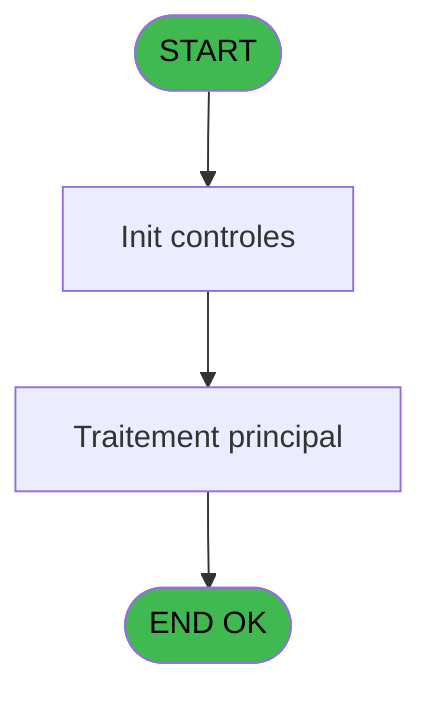
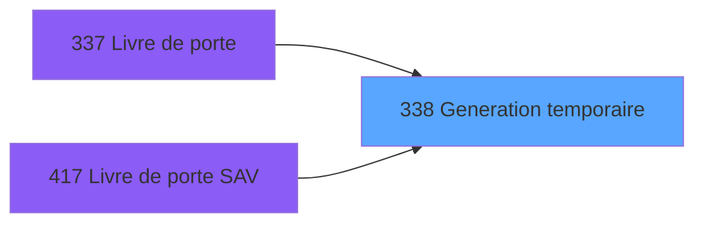

# PBP IDE 338 - Generation temporaire

> **Analyse**: Phases 1-4 2026-02-03 16:30 -> 16:31 (14s) | Assemblage 16:31
> **Pipeline**: V7.2 Enrichi
> **Structure**: 4 onglets (Resume | Ecrans | Donnees | Connexions)

<!-- TAB:Resume -->

## 1. FICHE D'IDENTITE

| Attribut | Valeur |
|----------|--------|
| Projet | PBP |
| IDE Position | 338 |
| Nom Programme | Generation temporaire |
| Fichier source | `Prg_338.xml` |
| Dossier IDE | Specif |
| Taches | 1 (1 ecrans visibles) |
| Tables modifiees | 0 |
| Programmes appeles | 0 |

## 2. DESCRIPTION FONCTIONNELLE

**Generation temporaire** assure la gestion complete de ce processus, accessible depuis [Livre de porte (IDE 337)](PBP-IDE-337.md), [Livre de porte SAV (IDE 417)](PBP-IDE-417.md).

Le flux de traitement s'organise en **1 blocs fonctionnels** :

- **Traitement** (1 tache) : traitements metier divers

**Logique metier** : 5 regles identifiees couvrant conditions metier.

## 3. BLOCS FONCTIONNELS

### 3.1 Traitement (1 tache)

Traitements internes.

---

#### 338 - Generation temporaire [[ECRAN]](#ecran-t1)

**Role** : Traitement : Generation temporaire.
**Ecran** : 429 x 58 DLU (MDI) | [Voir mockup](#ecran-t1)

## 5. REGLES METIER

5 regles identifiees:

### Autres (5 regles)

#### [RM-001] Si > Arrivee / Depart [B]='A' alors > Date pris en compte [A] sinon '01/01/0001'DATE)

| Element | Detail |
|---------|--------|
| **Condition** | `> Arrivee / Depart [B]='A'` |
| **Si vrai** | > Date pris en compte [A] |
| **Si faux** | '01/01/0001'DATE) |
| **Variables** | A (> Date pris en compte), B (> Arrivee / Depart) |
| **Expression source** | Expression 1 : `IF (> Arrivee / Depart [B]='A',> Date pris en compte [A],'01` |
| **Exemple** | Si > Arrivee / Depart [B]='A' → > Date pris en compte [A]. Sinon → '01/01/0001'DATE) |

#### [RM-002] Si > Arrivee / Depart [B]='D' alors > Date pris en compte [A] sinon '01/01/0001'DATE)

| Element | Detail |
|---------|--------|
| **Condition** | `> Arrivee / Depart [B]='D'` |
| **Si vrai** | > Date pris en compte [A] |
| **Si faux** | '01/01/0001'DATE) |
| **Variables** | A (> Date pris en compte), B (> Arrivee / Depart) |
| **Expression source** | Expression 3 : `IF (> Arrivee / Depart [B]='D',> Date pris en compte [A],'01` |
| **Exemple** | Si > Arrivee / Depart [B]='D' → > Date pris en compte [A]. Sinon → '01/01/0001'DATE) |

#### [RM-003] Si [L]='270' alors 'CM HELLAS' sinon 'CMSA')

| Element | Detail |
|---------|--------|
| **Condition** | `[L]='270'` |
| **Si vrai** | 'CM HELLAS' |
| **Si faux** | 'CMSA') |
| **Expression source** | Expression 12 : `IF ([L]='270','CM HELLAS','CMSA')` |
| **Exemple** | Si [L]='270' → 'CM HELLAS'. Sinon → 'CMSA') |

#### [RM-004] Si [M]='GM' AND [N]='TIME' alors 'GT' sinon [M])

| Element | Detail |
|---------|--------|
| **Condition** | `[M]='GM' AND [N]='TIME'` |
| **Si vrai** | 'GT' |
| **Si faux** | [M]) |
| **Expression source** | Expression 13 : `IF ([M]='GM' AND [N]='TIME','GT',[M])` |
| **Exemple** | Si [M]='GM' AND [N]='TIME' → 'GT'. Sinon → [M]) |

#### [RM-005] Si [O] alors [U] sinon '')

| Element | Detail |
|---------|--------|
| **Condition** | `[O]` |
| **Si vrai** | [U] |
| **Si faux** | '') |
| **Expression source** | Expression 14 : `IF ([O],[U],'')` |
| **Exemple** | Si [O] → [U]. Sinon → '') |

## 6. CONTEXTE

- **Appele par**: [Livre de porte (IDE 337)](PBP-IDE-337.md), [Livre de porte SAV (IDE 417)](PBP-IDE-417.md)
- **Appelle**: 0 programmes | **Tables**: 4 (W:0 R:1 L:3) | **Taches**: 1 | **Expressions**: 19

<!-- TAB:Ecrans -->

## 8. ECRANS

### 8.1 Forms visibles (1 / 1)

| # | Position | Tache | Nom | Type | Largeur | Hauteur | Bloc |
|---|----------|-------|-----|------|---------|---------|------|
| 1 | 338 | 338 | Generation temporaire | MDI | 429 | 58 | Traitement |

### 8.2 Mockups Ecrans

---

#### 338 - Generation temporaire
**Tache** : [338](#t1) | **Type** : MDI | **Dimensions** : 429 x 58 DLU
**Bloc** : Traitement | **Titre IDE** : Generation temporaire

<!-- FORM-DATA:
{
    "width":  429,
    "vFactor":  8,
    "type":  "MDI",
    "hFactor":  8,
    "controls":  [
                     {
                         "x":  0,
                         "type":  "label",
                         "var":  "",
                         "y":  0,
                         "w":  423,
                         "fmt":  "",
                         "name":  "",
                         "h":  29,
                         "color":  "",
                         "text":  "",
                         "parent":  null
                     },
                     {
                         "x":  120,
                         "type":  "label",
                         "var":  "",
                         "y":  10,
                         "w":  240,
                         "fmt":  "",
                         "name":  "",
                         "h":  8,
                         "color":  "7",
                         "text":  "Traitement en cours ...",
                         "parent":  null
                     },
                     {
                         "x":  0,
                         "type":  "label",
                         "var":  "",
                         "y":  29,
                         "w":  423,
                         "fmt":  "",
                         "name":  "",
                         "h":  27,
                         "color":  "",
                         "text":  "",
                         "parent":  null
                     },
                     {
                         "x":  52,
                         "type":  "label",
                         "var":  "",
                         "y":  38,
                         "w":  321,
                         "fmt":  "",
                         "name":  "",
                         "h":  8,
                         "color":  "",
                         "text":  "Preparation table temporaire",
                         "parent":  null
                     },
                     {
                         "x":  4,
                         "type":  "image",
                         "var":  "",
                         "y":  2,
                         "w":  72,
                         "fmt":  "",
                         "name":  "",
                         "h":  25,
                         "color":  "",
                         "text":  "",
                         "parent":  null
                     }
                 ],
    "taskId":  "338",
    "height":  58
}
-->

## 9. NAVIGATION

Ecran unique: **   Generation temporaire**

### 9.3 Structure hierarchique (1 tache)

| Position | Tache | Type | Dimensions | Bloc |
|----------|-------|------|------------|------|
| **338.1** | [**Generation temporaire** (338)](#t1) [mockup](#ecran-t1) | MDI | 429x58 | Traitement |

### 9.4 Algorigramme

> **Legende**: Vert = START/END OK | Rouge = END KO | Bleu = Decisions
> *Algorigramme auto-genere. Utiliser `/algorigramme` pour une synthese metier detaillee.*

<!-- TAB:Donnees -->

## 10. TABLES

### Tables utilisees (4)

| ID | Nom | Description | Type | R | W | L | Usages |
|----|-----|-------------|------|---|---|---|--------|
| 30 | gm-recherche_____gmr | Index de recherche | DB | R |   |   | 1 |
| 315 | fi_complet_______gm_go |  | DB |   |   | L | 1 |
| 463 | heure_de_passage |  | DB |   |   | L | 1 |
| 643 | tempo_chambre_client | Table temporaire ecran | DB |   |   | L | 1 |

### Colonnes par table (1 / 1 tables avec colonnes identifiees)

Table 30 - gm-recherche_____gmr (R) - 1 usages

| Lettre | Variable | Acces | Type |
|--------|----------|-------|------|
| A | > Date pris en compte | R | Date |
| B | > Arrivee / Depart | R | Alpha |
| C | Existe Forfait TAI | R | Logical |

## 11. VARIABLES

### 11.1 Autres (3)

Variables diverses.

| Lettre | Nom | Type | Usage dans |
|--------|-----|------|-----------|
| A | > Date pris en compte | Date | 6x refs |
| B | > Arrivee / Depart | Alpha | 7x refs |
| C | Existe Forfait TAI | Logical | - |

## 12. EXPRESSIONS

**19 / 19 expressions decodees (100%)**

### 12.1 Repartition par type

| Type | Expressions | Regles |
|------|-------------|--------|
| CONDITION | 10 | 5 |
| OTHER | 9 | 0 |

### 12.2 Expressions cles par type

#### CONDITION (10 expressions)

| Type | IDE | Expression | Regle |
|------|-----|------------|-------|
| CONDITION | 12 | `IF ([L]='270','CM HELLAS','CMSA')` | [RM-003](#rm-RM-003) |
| CONDITION | 13 | `IF ([M]='GM' AND [N]='TIME','GT',[M])` | [RM-004](#rm-RM-004) |
| CONDITION | 14 | `IF ([O],[U],'')` | [RM-005](#rm-RM-005) |
| CONDITION | 3 | `IF (> Arrivee / Depart [B]='D',> Date pris en compte [A],'01/01/0001'DATE)` | [RM-002](#rm-RM-002) |
| CONDITION | 1 | `IF (> Arrivee / Depart [B]='A',> Date pris en compte [A],'01/01/0001'DATE)` | [RM-001](#rm-RM-001) |
| ... | | *+5 autres* | |

#### OTHER (9 expressions)

| Type | IDE | Expression | Regle |
|------|-----|------------|-------|
| OTHER | 15 | `[E]` | - |
| OTHER | 11 | `[K]` | - |
| OTHER | 17 | `[G]` | - |
| OTHER | 16 | `[F]` | - |
| OTHER | 10 | `[BO]` | - |
| ... | | *+4 autres* | |

<!-- TAB:Connexions -->

## 13. GRAPHE D'APPELS

### 13.1 Chaine depuis Main (Callers)

Main -> ... -> [Livre de porte (IDE 337)](PBP-IDE-337.md) -> **Generation temporaire (IDE 338)**

Main -> ... -> [Livre de porte SAV (IDE 417)](PBP-IDE-417.md) -> **Generation temporaire (IDE 338)**

### 13.2 Callers

| IDE | Nom Programme | Nb Appels |
|-----|---------------|-----------|
| [337](PBP-IDE-337.md) | Livre de porte | 2 |
| [417](PBP-IDE-417.md) | Livre de porte SAV | 2 |

### 13.3 Callees (programmes appeles)

### 13.4 Detail Callees avec contexte

| IDE | Nom Programme | Appels | Contexte |
|-----|---------------|--------|----------|
| - | (aucun) | - | - |

## 14. RECOMMANDATIONS MIGRATION

### 14.1 Profil du programme

| Metrique | Valeur | Impact migration |
|----------|--------|-----------------|
| Lignes de logique | 50 | Programme compact |
| Expressions | 19 | Peu de logique |
| Tables WRITE | 0 | Impact faible |
| Sous-programmes | 0 | Peu de dependances |
| Ecrans visibles | 1 | Ecran unique ou traitement batch |
| Code desactive | 0% (0 / 50) | Code sain |
| Regles metier | 5 | Quelques regles a preserver |

### 14.2 Plan de migration par bloc

#### Traitement (1 tache: 1 ecran, 0 traitement)

- **Strategie** : 1 composant(s) UI (Razor/React) avec formulaires et validation.
- Decomposer les taches en services unitaires testables.

### 14.3 Dependances critiques

| Dependance | Type | Appels | Impact |
|------------|------|--------|--------|

---
*Spec DETAILED generee par Pipeline V7.2 - 2026-02-03 16:31*
