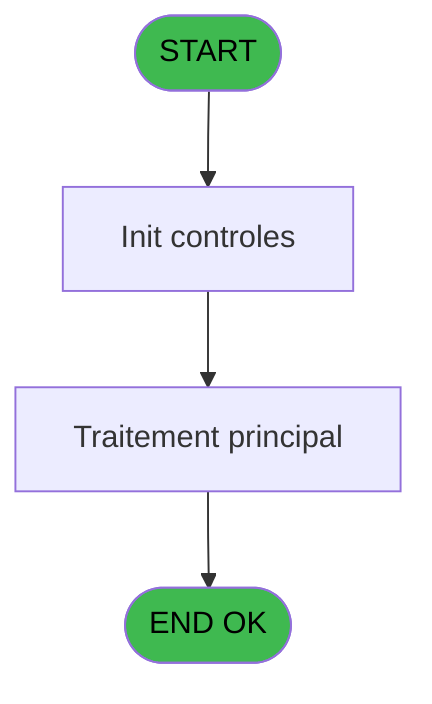
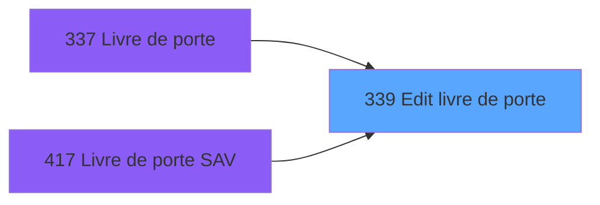

# PBP IDE 339 - Edit livre de porte

> **Analyse**: Phases 1-4 2026-02-03 16:31 -> 16:31 (13s) | Assemblage 16:31
> **Pipeline**: V7.2 Enrichi
> **Structure**: 4 onglets (Resume | Ecrans | Donnees | Connexions)

<!-- TAB:Resume -->

## 1. FICHE D'IDENTITE

| Attribut | Valeur |
|----------|--------|
| Projet | PBP |
| IDE Position | 339 |
| Nom Programme | Edit livre de porte |
| Fichier source | `Prg_339.xml` |
| Dossier IDE | Specif |
| Taches | 1 (1 ecrans visibles) |
| Tables modifiees | 0 |
| Programmes appeles | 0 |

## 2. DESCRIPTION FONCTIONNELLE

**Edit livre de porte** assure la gestion complete de ce processus, accessible depuis [Livre de porte (IDE 337)](PBP-IDE-337.md), [Livre de porte SAV (IDE 417)](PBP-IDE-417.md).

Le flux de traitement s'organise en **1 blocs fonctionnels** :

- **Traitement** (1 tache) : traitements metier divers

**Logique metier** : 2 regles identifiees couvrant conditions metier.

## 3. BLOCS FONCTIONNELS

### 3.1 Traitement (1 tache)

Traitements internes.

---

#### 339 - Veuillez patienter... [[ECRAN]](#ecran-t1)

**Role** : Traitement : Veuillez patienter....
**Ecran** : 426 x 58 DLU (MDI) | [Voir mockup](#ecran-t1)

## 5. REGLES METIER

2 regles identifiees:

### Autres (2 regles)

#### [RM-001] Si Pi.Csv/Edition [B]='A' alors 'Arrival' sinon 'Departure')

| Element | Detail |
|---------|--------|
| **Condition** | `Pi.Csv/Edition [B]='A'` |
| **Si vrai** | 'Arrival' |
| **Si faux** | 'Departure') |
| **Variables** | B (Pi.Csv/Edition) |
| **Expression source** | Expression 1 : `IF (Pi.Csv/Edition [B]='A','Arrival','Departure')` |
| **Exemple** | Si Pi.Csv/Edition [B]='A' → 'Arrival'. Sinon → 'Departure') |

#### [RM-002] Si [J]='GO' alors 'Staff' sinon IF ([J]='GM','Full Pension','Time Sharing'))

| Element | Detail |
|---------|--------|
| **Condition** | `[J]='GO'` |
| **Si vrai** | 'Staff' |
| **Si faux** | IF ([J]='GM','Full Pension','Time Sharing')) |
| **Expression source** | Expression 3 : `IF ([J]='GO','Staff',IF ([J]='GM','Full Pension','Time Shari` |
| **Exemple** | Si [J]='GO' → 'Staff'. Sinon → IF ([J]='GM','Full Pension','Time Sharing')) |

## 6. CONTEXTE

- **Appele par**: [Livre de porte (IDE 337)](PBP-IDE-337.md), [Livre de porte SAV (IDE 417)](PBP-IDE-417.md)
- **Appelle**: 0 programmes | **Tables**: 1 (W:0 R:1 L:0) | **Taches**: 1 | **Expressions**: 7

<!-- TAB:Ecrans -->

## 8. ECRANS

### 8.1 Forms visibles (1 / 1)

| # | Position | Tache | Nom | Type | Largeur | Hauteur | Bloc |
|---|----------|-------|-----|------|---------|---------|------|
| 1 | 339 | 339 | Veuillez patienter... | MDI | 426 | 58 | Traitement |

### 8.2 Mockups Ecrans

---

#### 339 - Veuillez patienter...
**Tache** : [339](#t1) | **Type** : MDI | **Dimensions** : 426 x 58 DLU
**Bloc** : Traitement | **Titre IDE** : Veuillez patienter...

<!-- FORM-DATA:
{
    "width":  426,
    "vFactor":  8,
    "type":  "MDI",
    "hFactor":  8,
    "controls":  [
                     {
                         "x":  0,
                         "type":  "label",
                         "var":  "",
                         "y":  0,
                         "w":  423,
                         "fmt":  "",
                         "name":  "",
                         "h":  29,
                         "color":  "",
                         "text":  "",
                         "parent":  null
                     },
                     {
                         "x":  120,
                         "type":  "label",
                         "var":  "",
                         "y":  10,
                         "w":  242,
                         "fmt":  "",
                         "name":  "",
                         "h":  8,
                         "color":  "7",
                         "text":  "Traitement en cours ...",
                         "parent":  null
                     },
                     {
                         "x":  0,
                         "type":  "label",
                         "var":  "",
                         "y":  29,
                         "w":  423,
                         "fmt":  "",
                         "name":  "",
                         "h":  27,
                         "color":  "",
                         "text":  "",
                         "parent":  null
                     },
                     {
                         "x":  44,
                         "type":  "label",
                         "var":  "",
                         "y":  38,
                         "w":  336,
                         "fmt":  "",
                         "name":  "",
                         "h":  8,
                         "color":  "",
                         "text":  "Edition Livre de Porte",
                         "parent":  null
                     },
                     {
                         "x":  4,
                         "type":  "image",
                         "var":  "",
                         "y":  2,
                         "w":  72,
                         "fmt":  "",
                         "name":  "",
                         "h":  25,
                         "color":  "",
                         "text":  "",
                         "parent":  null
                     }
                 ],
    "taskId":  "339",
    "height":  58
}
-->

## 9. NAVIGATION

Ecran unique: **Veuillez patienter...**

### 9.3 Structure hierarchique (1 tache)

| Position | Tache | Type | Dimensions | Bloc |
|----------|-------|------|------------|------|
| **339.1** | [**Veuillez patienter...** (339)](#t1) [mockup](#ecran-t1) | MDI | 426x58 | Traitement |

### 9.4 Algorigramme

> **Legende**: Vert = START/END OK | Rouge = END KO | Bleu = Decisions
> *Algorigramme auto-genere. Utiliser `/algorigramme` pour une synthese metier detaillee.*

<!-- TAB:Donnees -->

## 10. TABLES

### Tables utilisees (1)

| ID | Nom | Description | Type | R | W | L | Usages |
|----|-----|-------------|------|---|---|---|--------|
| 643 | tempo_chambre_client | Table temporaire ecran | DB | R |   |   | 1 |

### Colonnes par table (1 / 1 tables avec colonnes identifiees)

Table 643 - tempo_chambre_client (R) - 1 usages

| Lettre | Variable | Acces | Type |
|--------|----------|-------|------|
| A | > date | R | Date |
| B | Pi.Csv/Edition | R | Unicode |
| C | v. passage | R | Logical |

## 11. VARIABLES

### 11.1 Parametres entrants (1)

Variables recues du programme appelant ([Livre de porte (IDE 337)](PBP-IDE-337.md)).

| Lettre | Nom | Type | Usage dans |
|--------|-----|------|-----------|
| B | Pi.Csv/Edition | Unicode | 1x parametre entrant |

### 11.2 Variables de session (1)

Variables persistantes pendant toute la session.

| Lettre | Nom | Type | Usage dans |
|--------|-----|------|-----------|
| C | v. passage | Logical | - |

### 11.3 Autres (1)

Variables diverses.

| Lettre | Nom | Type | Usage dans |
|--------|-----|------|-----------|
| A | > date | Date | 1x refs |

## 12. EXPRESSIONS

**7 / 7 expressions decodees (100%)**

### 12.1 Repartition par type

| Type | Expressions | Regles |
|------|-------------|--------|
| CONCATENATION | 2 | 0 |
| CONDITION | 3 | 2 |
| FORMAT | 1 | 0 |
| REFERENCE_VG | 1 | 0 |

### 12.2 Expressions cles par type

#### CONCATENATION (2 expressions)

| Type | IDE | Expression | Regle |
|------|-----|------------|-------|
| CONCATENATION | 2 | `INIGet ('[MAGIC_LOGICAL_NAMES]preview')='O' OR INIGet ('[PREVIEW]'&Trim (Str (VG85,'4'))&'pview')='O'` | - |
| CONCATENATION | 7 | `'Arr/Dep'&VG36&'Name'&VG36&'Surname'&VG36&'Passport number'&VG36&'Arr date'&VG36&'Dep date'&VG36&'Room num'&VG36&'Quality'&VG36&'Amenity'` | - |

#### CONDITION (3 expressions)

| Type | IDE | Expression | Regle |
|------|-----|------------|-------|
| CONDITION | 3 | `IF ([J]='GO','Staff',IF ([J]='GM','Full Pension','Time Sharing'))` | [RM-002](#rm-RM-002) |
| CONDITION | 1 | `IF (Pi.Csv/Edition [B]='A','Arrival','Departure')` | [RM-001](#rm-RM-001) |
| CONDITION | 4 | `[Z]='C'` | - |

#### FORMAT (1 expressions)

| Type | IDE | Expression | Regle |
|------|-----|------------|-------|
| FORMAT | 5 | `Translate('%club_exportdata%')&'Livre_de_Porte_'&DStr(> date [A],'YYYYMMDD')&'.csv'` | - |

#### REFERENCE_VG (1 expressions)

| Type | IDE | Expression | Regle |
|------|-----|------------|-------|
| REFERENCE_VG | 6 | `VG36` | - |

<!-- TAB:Connexions -->

## 13. GRAPHE D'APPELS

### 13.1 Chaine depuis Main (Callers)

Main -> ... -> [Livre de porte (IDE 337)](PBP-IDE-337.md) -> **Edit livre de porte (IDE 339)**

Main -> ... -> [Livre de porte SAV (IDE 417)](PBP-IDE-417.md) -> **Edit livre de porte (IDE 339)**

### 13.2 Callers

| IDE | Nom Programme | Nb Appels |
|-----|---------------|-----------|
| [337](PBP-IDE-337.md) | Livre de porte | 1 |
| [417](PBP-IDE-417.md) | Livre de porte SAV | 1 |

### 13.3 Callees (programmes appeles)

### 13.4 Detail Callees avec contexte

| IDE | Nom Programme | Appels | Contexte |
|-----|---------------|--------|----------|
| - | (aucun) | - | - |

## 14. RECOMMANDATIONS MIGRATION

### 14.1 Profil du programme

| Metrique | Valeur | Impact migration |
|----------|--------|-----------------|
| Lignes de logique | 30 | Programme compact |
| Expressions | 7 | Peu de logique |
| Tables WRITE | 0 | Impact faible |
| Sous-programmes | 0 | Peu de dependances |
| Ecrans visibles | 1 | Ecran unique ou traitement batch |
| Code desactive | 0% (0 / 30) | Code sain |
| Regles metier | 2 | Quelques regles a preserver |

### 14.2 Plan de migration par bloc

#### Traitement (1 tache: 1 ecran, 0 traitement)

- **Strategie** : 1 composant(s) UI (Razor/React) avec formulaires et validation.
- Decomposer les taches en services unitaires testables.

### 14.3 Dependances critiques

| Dependance | Type | Appels | Impact |
|------------|------|--------|--------|

---
*Spec DETAILED generee par Pipeline V7.2 - 2026-02-03 16:31*
