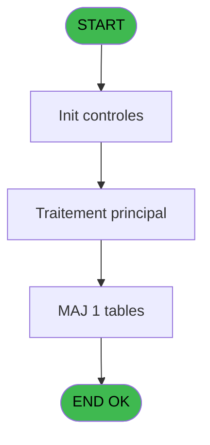
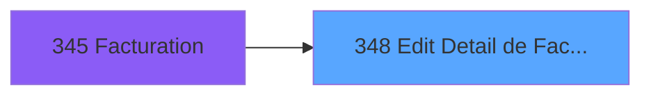

# PBP IDE 348 - Edit Detail de Facture

> **Analyse**: Phases 1-4 2026-02-03 16:34 -> 16:34 (14s) | Assemblage 16:34
> **Pipeline**: V7.2 Enrichi
> **Structure**: 4 onglets (Resume | Ecrans | Donnees | Connexions)

<!-- TAB:Resume -->

## 1. FICHE D'IDENTITE

| Attribut | Valeur |
|----------|--------|
| Projet | PBP |
| IDE Position | 348 |
| Nom Programme | Edit Detail de Facture |
| Fichier source | `Prg_348.xml` |
| Dossier IDE | Specif |
| Taches | 1 (1 ecrans visibles) |
| Tables modifiees | 1 |
| Programmes appeles | 0 |

## 2. DESCRIPTION FONCTIONNELLE

**Edit Detail de Facture** assure la gestion complete de ce processus, accessible depuis [Facturation (IDE 345)](PBP-IDE-345.md).

Le flux de traitement s'organise en **1 blocs fonctionnels** :

- **Traitement** (1 tache) : traitements metier divers

**Donnees modifiees** : 1 tables en ecriture (tempo_ecran_logement).

**Logique metier** : 2 regles identifiees couvrant conditions metier.

## 3. BLOCS FONCTIONNELS

### 3.1 Traitement (1 tache)

Traitements internes.

---

#### 348 - Veuillez patienter... [[ECRAN]](#ecran-t1)

**Role** : Traitement : Veuillez patienter....
**Ecran** : 427 x 57 DLU (MDI) | [Voir mockup](#ecran-t1)

## 5. REGLES METIER

2 regles identifiees:

### Autres (2 regles)

#### [RM-001] Si v. nbre total age [C]+5=6 alors [K] sinon IF (v. nbre total age [C]+5=7,[O],IF (v. nbre total age [C]+5=8,[S],[W])))

| Element | Detail |
|---------|--------|
| **Condition** | `v. nbre total age [C]+5=6` |
| **Si vrai** | [K] |
| **Si faux** | IF (v. nbre total age [C]+5=7,[O],IF (v. nbre total age [C]+5=8,[S],[W]))) |
| **Variables** | C (v. nbre total age) |
| **Expression source** | Expression 11 : `IF (v. nbre total age [C]+5=6,[K],IF (v. nbre total age [C]+` |
| **Exemple** | Si v. nbre total age [C]+5=6 → [K] |

#### [RM-002] Si v. nbre total zone [B]='2' alors 'FOREIGNER GM' sinon 'GREEK GM')

| Element | Detail |
|---------|--------|
| **Condition** | `v. nbre total zone [B]='2'` |
| **Si vrai** | 'FOREIGNER GM' |
| **Si faux** | 'GREEK GM') |
| **Variables** | B (v. nbre total zone) |
| **Expression source** | Expression 17 : `IF (v. nbre total zone [B]='2','FOREIGNER GM','GREEK GM')` |
| **Exemple** | Si v. nbre total zone [B]='2' → 'FOREIGNER GM'. Sinon → 'GREEK GM') |

## 6. CONTEXTE

- **Appele par**: [Facturation (IDE 345)](PBP-IDE-345.md)
- **Appelle**: 0 programmes | **Tables**: 1 (W:1 R:0 L:0) | **Taches**: 1 | **Expressions**: 17

<!-- TAB:Ecrans -->

## 8. ECRANS

### 8.1 Forms visibles (1 / 1)

| # | Position | Tache | Nom | Type | Largeur | Hauteur | Bloc |
|---|----------|-------|-----|------|---------|---------|------|
| 1 | 348 | 348 | Veuillez patienter... | MDI | 427 | 57 | Traitement |

### 8.2 Mockups Ecrans

---

#### 348 - Veuillez patienter...
**Tache** : [348](#t1) | **Type** : MDI | **Dimensions** : 427 x 57 DLU
**Bloc** : Traitement | **Titre IDE** : Veuillez patienter...

<!-- FORM-DATA:
{
    "width":  427,
    "vFactor":  8,
    "type":  "MDI",
    "hFactor":  8,
    "controls":  [
                     {
                         "x":  0,
                         "type":  "label",
                         "var":  "",
                         "y":  0,
                         "w":  423,
                         "fmt":  "",
                         "name":  "",
                         "h":  29,
                         "color":  "",
                         "text":  "",
                         "parent":  null
                     },
                     {
                         "x":  120,
                         "type":  "label",
                         "var":  "",
                         "y":  10,
                         "w":  242,
                         "fmt":  "",
                         "name":  "",
                         "h":  8,
                         "color":  "7",
                         "text":  "Traitement en cours ...",
                         "parent":  null
                     },
                     {
                         "x":  0,
                         "type":  "label",
                         "var":  "",
                         "y":  29,
                         "w":  423,
                         "fmt":  "",
                         "name":  "",
                         "h":  27,
                         "color":  "",
                         "text":  "",
                         "parent":  null
                     },
                     {
                         "x":  44,
                         "type":  "label",
                         "var":  "",
                         "y":  38,
                         "w":  336,
                         "fmt":  "",
                         "name":  "",
                         "h":  8,
                         "color":  "",
                         "text":  "Edition Livre de Porte",
                         "parent":  null
                     },
                     {
                         "x":  4,
                         "type":  "image",
                         "var":  "",
                         "y":  2,
                         "w":  72,
                         "fmt":  "",
                         "name":  "",
                         "h":  25,
                         "color":  "",
                         "text":  "",
                         "parent":  null
                     }
                 ],
    "taskId":  "348",
    "height":  57
}
-->

## 9. NAVIGATION

Ecran unique: **Veuillez patienter...**

### 9.3 Structure hierarchique (1 tache)

| Position | Tache | Type | Dimensions | Bloc |
|----------|-------|------|------------|------|
| **348.1** | [**Veuillez patienter...** (348)](#t1) [mockup](#ecran-t1) | MDI | 427x57 | Traitement |

### 9.4 Algorigramme

> **Legende**: Vert = START/END OK | Rouge = END KO | Bleu = Decisions
> *Algorigramme auto-genere. Utiliser `/algorigramme` pour une synthese metier detaillee.*

<!-- TAB:Donnees -->

## 10. TABLES

### Tables utilisees (1)

| ID | Nom | Description | Type | R | W | L | Usages |
|----|-----|-------------|------|---|---|---|--------|
| 641 | tempo_ecran_logement | Table temporaire ecran | DB |   | **W** |   | 1 |

### Colonnes par table (1 / 1 tables avec colonnes identifiees)

Table 641 - tempo_ecran_logement (**W**) - 1 usages

| Lettre | Variable | Acces | Type |
|--------|----------|-------|------|
| A | > date | W | Date |
| B | v. nbre total zone | W | Numeric |
| C | v. nbre total age | W | Numeric |
| D | v. passage | W | Logical |

## 11. VARIABLES

### 11.1 Variables de session (3)

Variables persistantes pendant toute la session.

| Lettre | Nom | Type | Usage dans |
|--------|-----|------|-----------|
| B | v. nbre total zone | Numeric | 3x session |
| C | v. nbre total age | Numeric | 2x session |
| D | v. passage | Logical | - |

### 11.2 Autres (1)

Variables diverses.

| Lettre | Nom | Type | Usage dans |
|--------|-----|------|-----------|
| A | > date | Date | - |

## 12. EXPRESSIONS

**17 / 17 expressions decodees (100%)**

### 12.1 Repartition par type

| Type | Expressions | Regles |
|------|-------------|--------|
| CONCATENATION | 3 | 0 |
| CONDITION | 4 | 2 |
| CALCULATION | 2 | 0 |
| CONSTANTE | 6 | 0 |
| OTHER | 2 | 0 |

### 12.2 Expressions cles par type

#### CONCATENATION (3 expressions)

| Type | IDE | Expression | Regle |
|------|-----|------------|-------|
| CONCATENATION | 4 | `INIGet ('[MAGIC_LOGICAL_NAMES]preview')='O' OR INIGet ('[PREVIEW]'&Trim (Str (VG85,'4'))&'pview')='O'` | - |
| CONCATENATION | 2 | `MlsTrans ('Edition du')&' '&DStr (Date (),'DD/MM/YYYY')&' '&MlsTrans ('à')&' '&TStr (Time (),'HH:MM:SS')` | - |
| CONCATENATION | 3 | `'- '&Str (Page (0,1),'3P0Z0')&' -'` | - |

#### CONDITION (4 expressions)

| Type | IDE | Expression | Regle |
|------|-----|------------|-------|
| CONDITION | 17 | `IF (v. nbre total zone [B]='2','FOREIGNER GM','GREEK GM')` | [RM-002](#rm-RM-002) |
| CONDITION | 11 | `IF (v. nbre total age [C]+5=6,[K],IF (v. nbre total age [C]+5=7,[O],IF (v. nbre total age [C]+5=8,[S],[W])))` | [RM-001](#rm-RM-001) |
| CONDITION | 13 | `'Total '&IF (v. nbre total zone [B]='2','FOREIGNER GM','GREEK GM')` | - |
| CONDITION | 12 | `'Total '&IF (v. nbre total age [C]+5=6,[K],IF (v. nbre total age [C]+5=7,[O],IF (v. nbre total age [C]+5=8,[S],[W])))` | - |

#### CALCULATION (2 expressions)

| Type | IDE | Expression | Regle |
|------|-----|------------|-------|
| CALCULATION | 15 | `[Z]+[H]` | - |
| CALCULATION | 14 | `[Y]+[H]` | - |

#### CONSTANTE (6 expressions)

| Type | IDE | Expression | Regle |
|------|-----|------------|-------|
| CONSTANTE | 9 | `8` | - |
| CONSTANTE | 10 | `9` | - |
| CONSTANTE | 16 | `0` | - |
| CONSTANTE | 6 | `5` | - |
| CONSTANTE | 7 | `6` | - |
| ... | | *+1 autres* | |

#### OTHER (2 expressions)

| Type | IDE | Expression | Regle |
|------|-----|------------|-------|
| OTHER | 5 | `v. nbre total zone [B]` | - |
| OTHER | 1 | `'Village '&GetParam ('VILLAGE')` | - |

<!-- TAB:Connexions -->

## 13. GRAPHE D'APPELS

### 13.1 Chaine depuis Main (Callers)

Main -> ... -> [Facturation (IDE 345)](PBP-IDE-345.md) -> **Edit Detail de Facture (IDE 348)**

### 13.2 Callers

| IDE | Nom Programme | Nb Appels |
|-----|---------------|-----------|
| [345](PBP-IDE-345.md) | Facturation | 1 |

### 13.3 Callees (programmes appeles)

### 13.4 Detail Callees avec contexte

| IDE | Nom Programme | Appels | Contexte |
|-----|---------------|--------|----------|
| - | (aucun) | - | - |

## 14. RECOMMANDATIONS MIGRATION

### 14.1 Profil du programme

| Metrique | Valeur | Impact migration |
|----------|--------|-----------------|
| Lignes de logique | 64 | Programme compact |
| Expressions | 17 | Peu de logique |
| Tables WRITE | 1 | Impact faible |
| Sous-programmes | 0 | Peu de dependances |
| Ecrans visibles | 1 | Ecran unique ou traitement batch |
| Code desactive | 0% (0 / 64) | Code sain |
| Regles metier | 2 | Quelques regles a preserver |

### 14.2 Plan de migration par bloc

#### Traitement (1 tache: 1 ecran, 0 traitement)

- **Strategie** : 1 composant(s) UI (Razor/React) avec formulaires et validation.
- Decomposer les taches en services unitaires testables.

### 14.3 Dependances critiques

| Dependance | Type | Appels | Impact |
|------------|------|--------|--------|
| tempo_ecran_logement | Table WRITE (Database) | 1x | Schema + repository |

---
*Spec DETAILED generee par Pipeline V7.2 - 2026-02-03 16:34*
