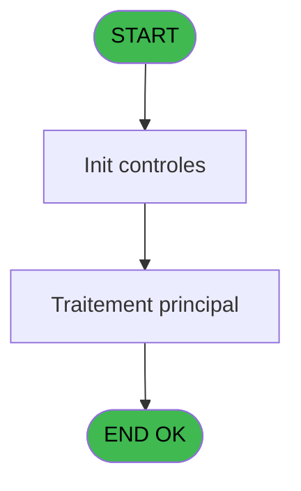
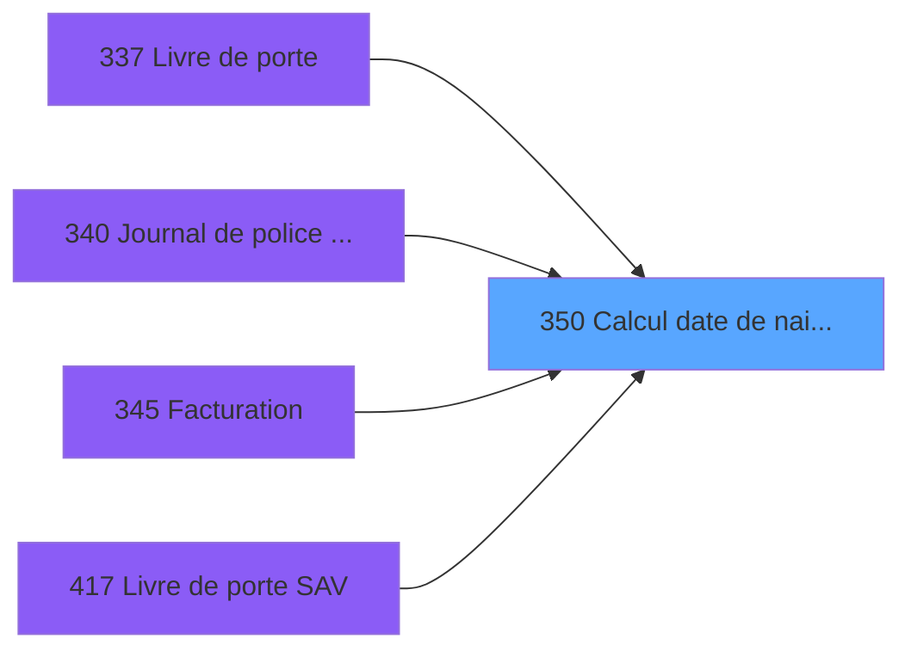

# PBP IDE 350 - Calcul date de naisssance

> **Analyse**: Phases 1-4 2026-02-03 16:34 -> 16:35 (14s) | Assemblage 16:35
> **Pipeline**: V7.2 Enrichi
> **Structure**: 4 onglets (Resume | Ecrans | Donnees | Connexions)

<!-- TAB:Resume -->

## 1. FICHE D'IDENTITE

| Attribut | Valeur |
|----------|--------|
| Projet | PBP |
| IDE Position | 350 |
| Nom Programme | Calcul date de naisssance |
| Fichier source | `Prg_350.xml` |
| Dossier IDE | Specif |
| Taches | 1 (1 ecrans visibles) |
| Tables modifiees | 0 |
| Programmes appeles | 0 |

## 2. DESCRIPTION FONCTIONNELLE

**Calcul date de naisssance** assure la gestion complete de ce processus, accessible depuis [Journal de police / Stat EOT (IDE 340)](PBP-IDE-340.md), [Facturation (IDE 345)](PBP-IDE-345.md), [Livre de porte (IDE 337)](PBP-IDE-337.md), [Livre de porte SAV (IDE 417)](PBP-IDE-417.md).

Le flux de traitement s'organise en **1 blocs fonctionnels** :

- **Traitement** (1 tache) : traitements metier divers

**Logique metier** : 1 regles identifiees couvrant conditions metier.

## 3. BLOCS FONCTIONNELS

### 3.1 Traitement (1 tache)

Traitements internes.

---

#### 350 - Veuillez patienter ... [[ECRAN]](#ecran-t1)

**Role** : Traitement : Veuillez patienter ....
**Ecran** : 426 x 58 DLU (MDI) | [Voir mockup](#ecran-t1)

## 5. REGLES METIER

1 regles identifiees:

### Autres (1 regles)

#### [RM-001] Si [H] alors [L] sinon IF ([N],[R],'00/00/0000'DATE))

| Element | Detail |
|---------|--------|
| **Condition** | `[H]` |
| **Si vrai** | [L] |
| **Si faux** | IF ([N],[R],'00/00/0000'DATE)) |
| **Expression source** | Expression 4 : `IF ([H],[L],IF ([N],[R],'00/00/0000'DATE))` |
| **Exemple** | Si [H] → [L]. Sinon → IF ([N],[R],'00/00/0000'DATE)) |

## 6. CONTEXTE

- **Appele par**: [Journal de police / Stat EOT (IDE 340)](PBP-IDE-340.md), [Facturation (IDE 345)](PBP-IDE-345.md), [Livre de porte (IDE 337)](PBP-IDE-337.md), [Livre de porte SAV (IDE 417)](PBP-IDE-417.md)
- **Appelle**: 0 programmes | **Tables**: 3 (W:0 R:1 L:2) | **Taches**: 1 | **Expressions**: 7

<!-- TAB:Ecrans -->

## 8. ECRANS

### 8.1 Forms visibles (1 / 1)

| # | Position | Tache | Nom | Type | Largeur | Hauteur | Bloc |
|---|----------|-------|-----|------|---------|---------|------|
| 1 | 350 | 350 | Veuillez patienter ... | MDI | 426 | 58 | Traitement |

### 8.2 Mockups Ecrans

---

#### 350 - Veuillez patienter ...
**Tache** : [350](#t1) | **Type** : MDI | **Dimensions** : 426 x 58 DLU
**Bloc** : Traitement | **Titre IDE** : Veuillez patienter ...

<!-- FORM-DATA:
{
    "width":  426,
    "vFactor":  8,
    "type":  "MDI",
    "hFactor":  8,
    "controls":  [
                     {
                         "x":  0,
                         "type":  "label",
                         "var":  "",
                         "y":  0,
                         "w":  423,
                         "fmt":  "",
                         "name":  "",
                         "h":  29,
                         "color":  "",
                         "text":  "",
                         "parent":  null
                     },
                     {
                         "x":  120,
                         "type":  "label",
                         "var":  "",
                         "y":  10,
                         "w":  221,
                         "fmt":  "",
                         "name":  "",
                         "h":  8,
                         "color":  "7",
                         "text":  "Traitement en cours ...",
                         "parent":  null
                     },
                     {
                         "x":  0,
                         "type":  "label",
                         "var":  "",
                         "y":  29,
                         "w":  423,
                         "fmt":  "",
                         "name":  "",
                         "h":  27,
                         "color":  "",
                         "text":  "",
                         "parent":  null
                     },
                     {
                         "x":  39,
                         "type":  "label",
                         "var":  "",
                         "y":  38,
                         "w":  347,
                         "fmt":  "",
                         "name":  "",
                         "h":  8,
                         "color":  "",
                         "text":  "Verification date de naissance",
                         "parent":  null
                     },
                     {
                         "x":  4,
                         "type":  "image",
                         "var":  "",
                         "y":  2,
                         "w":  72,
                         "fmt":  "",
                         "name":  "",
                         "h":  25,
                         "color":  "",
                         "text":  "",
                         "parent":  null
                     }
                 ],
    "taskId":  "350",
    "height":  58
}
-->

## 9. NAVIGATION

Ecran unique: **Veuillez patienter ...**

### 9.3 Structure hierarchique (1 tache)

| Position | Tache | Type | Dimensions | Bloc |
|----------|-------|------|------------|------|
| **350.1** | [**Veuillez patienter ...** (350)](#t1) [mockup](#ecran-t1) | MDI | 426x58 | Traitement |

### 9.4 Algorigramme

> **Legende**: Vert = START/END OK | Rouge = END KO | Bleu = Decisions
> *Algorigramme auto-genere. Utiliser `/algorigramme` pour une synthese metier detaillee.*

<!-- TAB:Donnees -->

## 10. TABLES

### Tables utilisees (3)

| ID | Nom | Description | Type | R | W | L | Usages |
|----|-----|-------------|------|---|---|---|--------|
| 35 | personnel_go______go |  | DB | R |   |   | 1 |
| 36 | client_gm |  | DB |   |   | L | 1 |
| 315 | fi_complet_______gm_go |  | DB |   |   | L | 1 |

### Colonnes par table (1 / 1 tables avec colonnes identifiees)

Table 35 - personnel_go______go (R) - 1 usages

| Lettre | Variable | Acces | Type |
|--------|----------|-------|------|
| A | v. cdrt gm | R | Logical |
| B | v. cdrt go | R | Logical |

## 11. VARIABLES

### 11.1 Variables de session (2)

Variables persistantes pendant toute la session.

| Lettre | Nom | Type | Usage dans |
|--------|-----|------|-----------|
| A | v. cdrt gm | Logical | 1x session |
| B | v. cdrt go | Logical | 1x session |

## 12. EXPRESSIONS

**7 / 7 expressions decodees (100%)**

### 12.1 Repartition par type

| Type | Expressions | Regles |
|------|-------------|--------|
| CONDITION | 4 | 5 |
| OTHER | 3 | 0 |

### 12.2 Expressions cles par type

#### CONDITION (4 expressions)

| Type | IDE | Expression | Regle |
|------|-----|------------|-------|
| CONDITION | 4 | `IF ([H],[L],IF ([N],[R],'00/00/0000'DATE))` | [RM-001](#rm-RM-001) |
| CONDITION | 7 | `[G]=0` | - |
| CONDITION | 5 | `IF ([H],[M],IF ([N],[S],0))` | - |
| CONDITION | 6 | `[F]='00/00/0000'DATE` | - |

#### OTHER (3 expressions)

| Type | IDE | Expression | Regle |
|------|-----|------------|-------|
| OTHER | 3 | `[C]` | - |
| OTHER | 2 | `v. cdrt go [B]` | - |
| OTHER | 1 | `v. cdrt gm [A]` | - |

<!-- TAB:Connexions -->

## 13. GRAPHE D'APPELS

### 13.1 Chaine depuis Main (Callers)

Main -> ... -> [Journal de police / Stat EOT (IDE 340)](PBP-IDE-340.md) -> **Calcul date de naisssance (IDE 350)**

Main -> ... -> [Facturation (IDE 345)](PBP-IDE-345.md) -> **Calcul date de naisssance (IDE 350)**

Main -> ... -> [Livre de porte (IDE 337)](PBP-IDE-337.md) -> **Calcul date de naisssance (IDE 350)**

Main -> ... -> [Livre de porte SAV (IDE 417)](PBP-IDE-417.md) -> **Calcul date de naisssance (IDE 350)**

### 13.2 Callers

| IDE | Nom Programme | Nb Appels |
|-----|---------------|-----------|
| [340](PBP-IDE-340.md) | Journal de police / Stat EOT | 2 |
| [345](PBP-IDE-345.md) | Facturation | 2 |
| [337](PBP-IDE-337.md) | Livre de porte | 1 |
| [417](PBP-IDE-417.md) | Livre de porte SAV | 1 |

### 13.3 Callees (programmes appeles)

### 13.4 Detail Callees avec contexte

| IDE | Nom Programme | Appels | Contexte |
|-----|---------------|--------|----------|
| - | (aucun) | - | - |

## 14. RECOMMANDATIONS MIGRATION

### 14.1 Profil du programme

| Metrique | Valeur | Impact migration |
|----------|--------|-----------------|
| Lignes de logique | 31 | Programme compact |
| Expressions | 7 | Peu de logique |
| Tables WRITE | 0 | Impact faible |
| Sous-programmes | 0 | Peu de dependances |
| Ecrans visibles | 1 | Ecran unique ou traitement batch |
| Code desactive | 0% (0 / 31) | Code sain |
| Regles metier | 1 | Quelques regles a preserver |

### 14.2 Plan de migration par bloc

#### Traitement (1 tache: 1 ecran, 0 traitement)

- **Strategie** : 1 composant(s) UI (Razor/React) avec formulaires et validation.
- Decomposer les taches en services unitaires testables.

### 14.3 Dependances critiques

| Dependance | Type | Appels | Impact |
|------------|------|--------|--------|

---
*Spec DETAILED generee par Pipeline V7.2 - 2026-02-03 16:35*
