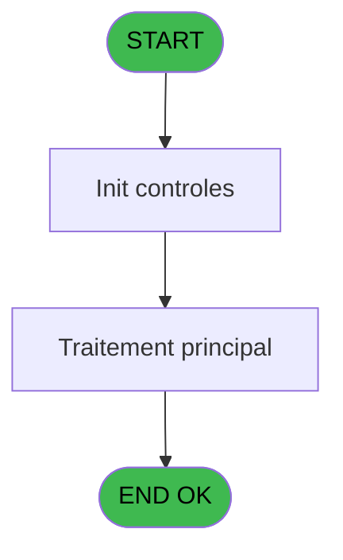

# PBP IDE 352 - Determination Age Debut Sejour

> **Analyse**: Phases 1-4 2026-02-03 16:35 -> 16:35 (17s) | Assemblage 16:35
> **Pipeline**: V7.2 Enrichi
> **Structure**: 4 onglets (Resume | Ecrans | Donnees | Connexions)

<!-- TAB:Resume -->

## 1. FICHE D'IDENTITE

| Attribut | Valeur |
|----------|--------|
| Projet | PBP |
| IDE Position | 352 |
| Nom Programme | Determination Age Debut Sejour |
| Fichier source | `Prg_352.xml` |
| Dossier IDE | Statistiques |
| Taches | 1 (0 ecrans visibles) |
| Tables modifiees | 0 |
| Programmes appeles | 0 |

## 2. DESCRIPTION FONCTIONNELLE

**Determination Age Debut Sejour** assure la gestion complete de ce processus, accessible depuis [Maj Date de naissance (IDE 351)](PBP-IDE-351.md).

Le flux de traitement s'organise en **1 blocs fonctionnels** :

- **Traitement** (1 tache) : traitements metier divers

**Logique metier** : 3 regles identifiees couvrant conditions metier.

## 3. BLOCS FONCTIONNELS

### 3.1 Traitement (1 tache)

Traitements internes.

---

#### 352 - Determination Age

**Role** : Traitement : Determination Age.

## 5. REGLES METIER

3 regles identifiees:

### Autres (3 regles)

#### [RM-001] Si P0-Date debut Sejour [B]='00/00/0000'DATE alors Date () sinon P0-Date debut Sejour [B])

| Element | Detail |
|---------|--------|
| **Condition** | `P0-Date debut Sejour [B]='00/00/0000'DATE` |
| **Si vrai** | Date () |
| **Si faux** | P0-Date debut Sejour [B]) |
| **Variables** | B (P0-Date debut Sejour) |
| **Expression source** | Expression 1 : `IF (P0-Date debut Sejour [B]='00/00/0000'DATE,Date (),P0-Dat` |
| **Exemple** | Si P0-Date debut Sejour [B]='00/00/0000'DATE → Date (). Sinon → P0-Date debut Sejour [B]) |

#### [RM-002] Si P0-Age [C]>100 alors ASCIIChr (200) sinon ASCIIChr (P0-Age [C]+100))

| Element | Detail |
|---------|--------|
| **Condition** | `P0-Age [C]>100` |
| **Si vrai** | ASCIIChr (200) |
| **Si faux** | ASCIIChr (P0-Age [C]+100)) |
| **Variables** | C (P0-Age) |
| **Expression source** | Expression 8 : `IF (P0-Age [C]>100,ASCIIChr (200),ASCIIChr (P0-Age [C]+100))` |
| **Exemple** | Si P0-Age [C]>100 → ASCIIChr (200). Sinon → ASCIIChr (P0-Age [C]+100)) |

#### [RM-003] Si Month (W0 Date debut sejour [E])<=Month (P0-Date de Naissance [A]) alors Month (W0 Date debut sejour [E])+12-Month (P0-Date de Naissance [A]) sinon Month (W0 Date debut sejour [E])-Month (P0-Date de Naissance [A]))

| Element | Detail |
|---------|--------|
| **Condition** | `Month (W0 Date debut sejour [E])<=Month (P0-Date de Naissance [A])` |
| **Si vrai** | Month (W0 Date debut sejour [E])+12-Month (P0-Date de Naissance [A]) |
| **Si faux** | Month (W0 Date debut sejour [E])-Month (P0-Date de Naissance [A])) |
| **Variables** | E (W0 Date debut sejour), A (P0-Date de Naissance) |
| **Expression source** | Expression 10 : `IF (Month (W0 Date debut sejour [E])<=Month (P0-Date de Nais` |
| **Exemple** | Si Month (W0 Date debut sejour [E])<=Month (P0-Date de Naissance [A]) → Month (W0 Date debut sejour [E])+12-Month (P0-Date de Naissance [A]) |

## 6. CONTEXTE

- **Appele par**: [Maj Date de naissance (IDE 351)](PBP-IDE-351.md)
- **Appelle**: 0 programmes | **Tables**: 0 (W:0 R:0 L:0) | **Taches**: 1 | **Expressions**: 20

<!-- TAB:Ecrans -->

## 8. ECRANS

*(Programme sans ecran visible)*

## 9. NAVIGATION

### 9.3 Structure hierarchique (1 tache)

| Position | Tache | Type | Dimensions | Bloc |
|----------|-------|------|------------|------|
| **352.1** | [**Determination Age** (352)](#t1) | MDI | - | Traitement |

### 9.4 Algorigramme

> **Legende**: Vert = START/END OK | Rouge = END KO | Bleu = Decisions
> *Algorigramme auto-genere. Utiliser `/algorigramme` pour une synthese metier detaillee.*

<!-- TAB:Donnees -->

## 10. TABLES

### Tables utilisees (0)

| ID | Nom | Description | Type | R | W | L | Usages |
|----|-----|-------------|------|---|---|---|--------|

### Colonnes par table (0 / 0 tables avec colonnes identifiees)

## 11. VARIABLES

### 11.1 Variables de travail (2)

Variables internes au programme.

| Lettre | Nom | Type | Usage dans |
|--------|-----|------|-----------|
| E | W0 Date debut sejour | Date | 5x calcul interne |
| F | W0 Nb de Mois | Numeric | 3x calcul interne |

### 11.2 Autres (5)

Variables diverses.

| Lettre | Nom | Type | Usage dans |
|--------|-----|------|-----------|
| A | P0-Date de Naissance | Date | 7x refs |
| B | P0-Date debut Sejour | Date | 1x refs |
| C | P0-Age | Numeric | 4x refs |
| D | P0-Age Codifie | Alpha | - |
| G | W0-Fin de Tache | Alpha | 1x refs |

## 12. EXPRESSIONS

**20 / 20 expressions decodees (100%)**

### 12.1 Repartition par type

| Type | Expressions | Regles |
|------|-------------|--------|
| CALCULATION | 4 | 0 |
| CONDITION | 12 | 3 |
| CONSTANTE | 3 | 0 |
| OTHER | 1 | 0 |

### 12.2 Expressions cles par type

#### CALCULATION (4 expressions)

| Type | IDE | Expression | Regle |
|------|-----|------------|-------|
| CALCULATION | 12 | `W0 Nb de Mois [F]-1` | - |
| CALCULATION | 15 | `ASCIIChr (80+W0 Nb de Mois [F])` | - |
| CALCULATION | 3 | `Year (W0 Date debut sejour [E])-Year (P0-Date de Naissance [A])` | - |
| CALCULATION | 5 | `P0-Age [C]-1` | - |

#### CONDITION (12 expressions)

| Type | IDE | Expression | Regle |
|------|-----|------------|-------|
| CONDITION | 10 | `IF (Month (W0 Date debut sejour [E])<=Month (P0-Date de Naissance [A]),Month (W0 Date debut sejour [E])+12-Month (P0-Date de Naissance [A]),Month (W0 Date debut sejour [E])-Month (P0-Date de Naissance [A]))` | [RM-003](#rm-RM-003) |
| CONDITION | 8 | `IF (P0-Age [C]>100,ASCIIChr (200),ASCIIChr (P0-Age [C]+100))` | [RM-002](#rm-RM-002) |
| CONDITION | 1 | `IF (P0-Date debut Sejour [B]='00/00/0000'DATE,Date (),P0-Date debut Sejour [B])` | [RM-001](#rm-RM-001) |
| CONDITION | 13 | `W0 Nb de Mois [F]=0 OR W0 Nb de Mois [F]=12` | - |
| CONDITION | 11 | `Day (W0 Date debut sejour [E])<Day (P0-Date de Naissance [A])` | - |
| ... | | *+7 autres* | |

#### CONSTANTE (3 expressions)

| Type | IDE | Expression | Regle |
|------|-----|------------|-------|
| CONSTANTE | 19 | `'F'` | - |
| CONSTANTE | 17 | `0` | - |
| CONSTANTE | 14 | `1` | - |

#### OTHER (1 expressions)

| Type | IDE | Expression | Regle |
|------|-----|------------|-------|
| OTHER | 18 | `ASCIIChr (80)` | - |

<!-- TAB:Connexions -->

## 13. GRAPHE D'APPELS

### 13.1 Chaine depuis Main (Callers)

Main -> ... -> [Maj Date de naissance (IDE 351)](PBP-IDE-351.md) -> **Determination Age Debut Sejour (IDE 352)**

### 13.2 Callers

| IDE | Nom Programme | Nb Appels |
|-----|---------------|-----------|
| [351](PBP-IDE-351.md) | Maj Date de naissance | 1 |

### 13.3 Callees (programmes appeles)

### 13.4 Detail Callees avec contexte

| IDE | Nom Programme | Appels | Contexte |
|-----|---------------|--------|----------|
| - | (aucun) | - | - |

## 14. RECOMMANDATIONS MIGRATION

### 14.1 Profil du programme

| Metrique | Valeur | Impact migration |
|----------|--------|-----------------|
| Lignes de logique | 34 | Programme compact |
| Expressions | 20 | Peu de logique |
| Tables WRITE | 0 | Impact faible |
| Sous-programmes | 0 | Peu de dependances |
| Ecrans visibles | 0 | Ecran unique ou traitement batch |
| Code desactive | 0% (0 / 34) | Code sain |
| Regles metier | 3 | Quelques regles a preserver |

### 14.2 Plan de migration par bloc

#### Traitement (1 tache: 0 ecran, 1 traitement)

- **Strategie** : 1 service(s) backend injectable(s) (Domain Services).
- Decomposer les taches en services unitaires testables.

### 14.3 Dependances critiques

| Dependance | Type | Appels | Impact |
|------------|------|--------|--------|

---
*Spec DETAILED generee par Pipeline V7.2 - 2026-02-03 16:35*
