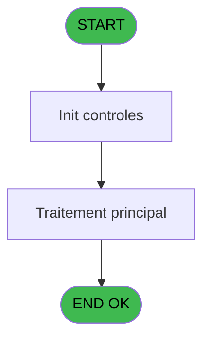
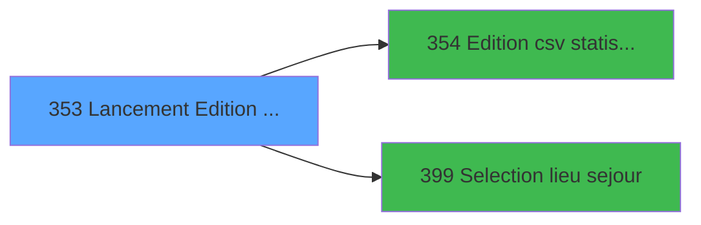

# PBP IDE 353 - Lancement Edition statistiques

> **Analyse**: Phases 1-4 2026-02-03 16:35 -> 16:36 (16s) | Assemblage 16:36
> **Pipeline**: V7.2 Enrichi
> **Structure**: 4 onglets (Resume | Ecrans | Donnees | Connexions)

<!-- TAB:Resume -->

## 1. FICHE D'IDENTITE

| Attribut | Valeur |
|----------|--------|
| Projet | PBP |
| IDE Position | 353 |
| Nom Programme | Lancement Edition statistiques |
| Fichier source | `Prg_353.xml` |
| Dossier IDE | Statistiques |
| Taches | 2 (1 ecrans visibles) |
| Tables modifiees | 0 |
| Programmes appeles | 2 |
| :warning: Statut | **ORPHELIN_POTENTIEL** |

## 2. DESCRIPTION FONCTIONNELLE

**Lancement Edition statistiques** assure la gestion complete de ce processus.

Le flux de traitement s'organise en **2 blocs fonctionnels** :

- **Traitement** (1 tache) : traitements metier divers
- **Impression** (1 tache) : generation de tickets et documents

Detail : phases du traitement

#### Phase 1 : Impression (1 tache)

- **353** - Edition des statistiques **[[ECRAN]](#ecran-t1)**

Delegue a : [Edition csv statistiques (IDE 354)](PBP-IDE-354.md)

#### Phase 2 : Traitement (1 tache)

- **353.1** - Recup info village

## 3. BLOCS FONCTIONNELS

### 3.1 Impression (1 tache)

Generation des documents et tickets.

---

#### 353 - Edition des statistiques [[ECRAN]](#ecran-t1)

**Role** : Generation du document : Edition des statistiques.
**Ecran** : 626 x 191 DLU (MDI) | [Voir mockup](#ecran-t1)
**Variables liees** : E (b_Edition)
**Delegue a** : [Edition csv statistiques (IDE 354)](PBP-IDE-354.md)

### 3.2 Traitement (1 tache)

Traitements internes.

---

#### 353.1 - Recup info village

**Role** : Consultation/chargement : Recup info village.
**Variables liees** : K (V.Date ouverture village)

## 5. REGLES METIER

*(Aucune regle metier identifiee)*

## 6. CONTEXTE

- **Appele par**: (aucun)
- **Appelle**: 2 programmes | **Tables**: 2 (W:0 R:2 L:0) | **Taches**: 2 | **Expressions**: 23

<!-- TAB:Ecrans -->

## 8. ECRANS

### 8.1 Forms visibles (1 / 2)

| # | Position | Tache | Nom | Type | Largeur | Hauteur | Bloc |
|---|----------|-------|-----|------|---------|---------|------|
| 1 | 353 | 353 | Edition des statistiques | MDI | 626 | 191 | Impression |

### 8.2 Mockups Ecrans

---

#### 353 - Edition des statistiques
**Tache** : [353](#t1) | **Type** : MDI | **Dimensions** : 626 x 191 DLU
**Bloc** : Impression | **Titre IDE** : Edition des statistiques

<!-- FORM-DATA:
{
    "width":  626,
    "vFactor":  8,
    "type":  "MDI",
    "hFactor":  8,
    "controls":  [
                     {
                         "x":  1,
                         "type":  "label",
                         "var":  "",
                         "y":  0,
                         "w":  617,
                         "fmt":  "",
                         "name":  "",
                         "h":  20,
                         "color":  "1",
                         "text":  "",
                         "parent":  null
                     },
                     {
                         "x":  8,
                         "type":  "label",
                         "var":  "",
                         "y":  24,
                         "w":  409,
                         "fmt":  "",
                         "name":  "",
                         "h":  137,
                         "color":  "195",
                         "text":  "Paramètres",
                         "parent":  null
                     },
                     {
                         "x":  430,
                         "type":  "label",
                         "var":  "",
                         "y":  24,
                         "w":  186,
                         "fmt":  "",
                         "name":  "",
                         "h":  137,
                         "color":  "",
                         "text":  "",
                         "parent":  null
                     },
                     {
                         "x":  17,
                         "type":  "label",
                         "var":  "",
                         "y":  82,
                         "w":  98,
                         "fmt":  "",
                         "name":  "",
                         "h":  10,
                         "color":  "",
                         "text":  "Date début",
                         "parent":  5
                     },
                     {
                         "x":  0,
                         "type":  "label",
                         "var":  "",
                         "y":  166,
                         "w":  617,
                         "fmt":  "",
                         "name":  "",
                         "h":  24,
                         "color":  "1",
                         "text":  "",
                         "parent":  null
                     },
                     {
                         "x":  17,
                         "type":  "label",
                         "var":  "",
                         "y":  99,
                         "w":  98,
                         "fmt":  "",
                         "name":  "",
                         "h":  10,
                         "color":  "",
                         "text":  "Date fin",
                         "parent":  5
                     },
                     {
                         "x":  17,
                         "type":  "label",
                         "var":  "",
                         "y":  114,
                         "w":  106,
                         "fmt":  "",
                         "name":  "",
                         "h":  10,
                         "color":  "",
                         "text":  "Lieu de séjour",
                         "parent":  5
                     },
                     {
                         "x":  6,
                         "type":  "edit",
                         "var":  "",
                         "y":  2,
                         "w":  267,
                         "fmt":  "20",
                         "name":  "",
                         "h":  8,
                         "color":  "",
                         "text":  "",
                         "parent":  null
                     },
                     {
                         "x":  332,
                         "type":  "edit",
                         "var":  "",
                         "y":  6,
                         "w":  267,
                         "fmt":  "WWW DD MMM YYYYT",
                         "name":  "",
                         "h":  8,
                         "color":  "",
                         "text":  "",
                         "parent":  null
                     },
                     {
                         "x":  6,
                         "type":  "edit",
                         "var":  "",
                         "y":  11,
                         "w":  326,
                         "fmt":  "25",
                         "name":  "VG.NOM VILLAGE",
                         "h":  8,
                         "color":  "",
                         "text":  "",
                         "parent":  null
                     },
                     {
                         "x":  440,
                         "type":  "image",
                         "var":  "",
                         "y":  46,
                         "w":  162,
                         "fmt":  "",
                         "name":  "",
                         "h":  53,
                         "color":  "",
                         "text":  "",
                         "parent":  8
                     },
                     {
                         "x":  158,
                         "type":  "edit",
                         "var":  "",
                         "y":  82,
                         "w":  126,
                         "fmt":  "",
                         "name":  "w0_Date_debut",
                         "h":  10,
                         "color":  "110",
                         "text":  "",
                         "parent":  5
                     },
                     {
                         "x":  289,
                         "type":  "button",
                         "var":  "",
                         "y":  82,
                         "w":  25,
                         "fmt":  "...",
                         "name":  "b_Date_debut",
                         "h":  10,
                         "color":  "",
                         "text":  "",
                         "parent":  5
                     },
                     {
                         "x":  158,
                         "type":  "edit",
                         "var":  "",
                         "y":  99,
                         "w":  126,
                         "fmt":  "",
                         "name":  "w0_Date_fin",
                         "h":  10,
                         "color":  "110",
                         "text":  "",
                         "parent":  5
                     },
                     {
                         "x":  290,
                         "type":  "button",
                         "var":  "",
                         "y":  99,
                         "w":  25,
                         "fmt":  "...",
                         "name":  "b_Date_fin",
                         "h":  10,
                         "color":  "",
                         "text":  "",
                         "parent":  5
                     },
                     {
                         "x":  158,
                         "type":  "edit",
                         "var":  "",
                         "y":  114,
                         "w":  33,
                         "fmt":  "",
                         "name":  "v_lieu de séjour",
                         "h":  10,
                         "color":  "110",
                         "text":  "",
                         "parent":  5
                     },
                     {
                         "x":  197,
                         "type":  "button",
                         "var":  "",
                         "y":  114,
                         "w":  25,
                         "fmt":  "...",
                         "name":  "b_lieu_sejour",
                         "h":  10,
                         "color":  "",
                         "text":  "",
                         "parent":  5
                     },
                     {
                         "x":  232,
                         "type":  "edit",
                         "var":  "",
                         "y":  114,
                         "w":  173,
                         "fmt":  "",
                         "name":  "nom_import",
                         "h":  10,
                         "color":  "",
                         "text":  "",
                         "parent":  5
                     },
                     {
                         "x":  446,
                         "type":  "button",
                         "var":  "",
                         "y":  135,
                         "w":  154,
                         "fmt":  "\u0026Impression",
                         "name":  "b_Edition",
                         "h":  18,
                         "color":  "",
                         "text":  "",
                         "parent":  8
                     },
                     {
                         "x":  8,
                         "type":  "button",
                         "var":  "",
                         "y":  169,
                         "w":  154,
                         "fmt":  "\u0026Quitter",
                         "name":  "",
                         "h":  18,
                         "color":  "",
                         "text":  "",
                         "parent":  22
                     }
                 ],
    "taskId":  "353",
    "height":  191
}
-->

<strong>Champs : 7 champs</strong>

| Pos (x,y) | Nom | Variable | Type |
|-----------|-----|----------|------|
| 6,2 | 20 | - | edit |
| 332,6 | WWW DD MMM YYYYT | - | edit |
| 6,11 | VG.NOM VILLAGE | - | edit |
| 158,82 | w0_Date_debut | - | edit |
| 158,99 | w0_Date_fin | - | edit |
| 158,114 | v_lieu de séjour | - | edit |
| 232,114 | nom_import | - | edit |

<strong>Boutons : 5 boutons</strong>

| Bouton | Pos (x,y) | Action |
|--------|-----------|--------|
| ... | 289,82 | Bouton fonctionnel |
| ... | 290,99 | Bouton fonctionnel |
| ... | 197,114 | Bouton fonctionnel |
| Impression | 446,135 | Bouton fonctionnel |
| Quitter | 8,169 | Quitte le programme |

## 9. NAVIGATION

Ecran unique: **Edition des statistiques**

### 9.3 Structure hierarchique (2 taches)

| Position | Tache | Type | Dimensions | Bloc |
|----------|-------|------|------------|------|
| **353.1** | [**Edition des statistiques** (353)](#t1) [mockup](#ecran-t1) | MDI | 626x191 | Impression |
| **353.2** | [**Recup info village** (353.1)](#t6) | - | - | Traitement |

### 9.4 Algorigramme

> **Legende**: Vert = START/END OK | Rouge = END KO | Bleu = Decisions
> *Algorigramme auto-genere. Utiliser `/algorigramme` pour une synthese metier detaillee.*

<!-- TAB:Donnees -->

## 10. TABLES

### Tables utilisees (2)

| ID | Nom | Description | Type | R | W | L | Usages |
|----|-----|-------------|------|---|---|---|--------|
| 118 | tables_imports |  | DB | R |   |   | 1 |
| 372 | pv_budget |  | DB | R |   |   | 1 |

### Colonnes par table (1 / 2 tables avec colonnes identifiees)

Table 118 - tables_imports (R) - 1 usages

| Lettre | Variable | Acces | Type |
|--------|----------|-------|------|
| A | w0_Date_debut | R | Date |
| B | b_Date_debut | R | Alpha |
| C | w0_Date_fin | R | Date |
| D | b_Date_fin | R | Alpha |
| E | b_Edition | R | Alpha |
| F | v_lieu de séjour | R | Alpha |
| G | b_lieu_sejour | R | Alpha |
| H | V.Date debut ete | R | Date |
| I | V.Date debut hiver | R | Date |
| J | V.Saisonnier | R | Alpha |
| K | V.Date ouverture village | R | Date |

Table 372 - pv_budget (R) - 1 usages

*Table utilisee uniquement en Link ou aucune colonne Real identifiee dans le DataView.*

## 11. VARIABLES

### 11.1 Variables de session (4)

Variables persistantes pendant toute la session.

| Lettre | Nom | Type | Usage dans |
|--------|-----|------|-----------|
| H | V.Date debut ete | Date | - |
| I | V.Date debut hiver | Date | - |
| J | V.Saisonnier | Alpha | - |
| K | V.Date ouverture village | Date | - |

### 11.2 Autres (7)

Variables diverses.

| Lettre | Nom | Type | Usage dans |
|--------|-----|------|-----------|
| A | w0_Date_debut | Date | - |
| B | b_Date_debut | Alpha | 1x refs |
| C | w0_Date_fin | Date | 3x refs |
| D | b_Date_fin | Alpha | - |
| E | b_Edition | Alpha | - |
| F | v_lieu de séjour | Alpha | - |
| G | b_lieu_sejour | Alpha | - |

## 12. EXPRESSIONS

**23 / 23 expressions decodees (100%)**

### 12.1 Repartition par type

| Type | Expressions | Regles |
|------|-------------|--------|
| CONSTANTE | 1 | 0 |
| DATE | 1 | 0 |
| FORMAT | 2 | 0 |
| CONDITION | 8 | 0 |
| OTHER | 10 | 0 |
| STRING | 1 | 0 |

### 12.2 Expressions cles par type

#### CONSTANTE (1 expressions)

| Type | IDE | Expression | Regle |
|------|-----|------------|-------|
| CONSTANTE | 1 | `'...'` | - |

#### DATE (1 expressions)

| Type | IDE | Expression | Regle |
|------|-----|------------|-------|
| DATE | 4 | `Date ()-1` | - |

#### FORMAT (2 expressions)

| Type | IDE | Expression | Regle |
|------|-----|------------|-------|
| FORMAT | 8 | `DVal('01/11/'&Str(IF(Range(Month(Date()),5,12),Year(Date()),Year(Date())-1),'4'),'DD/MM/YYYY')` | - |
| FORMAT | 7 | `DVal('01/05/'&Str(Year(Date()),'4'),'DD/MM/YYYY')` | - |

#### CONDITION (8 expressions)

| Type | IDE | Expression | Regle |
|------|-----|------------|-------|
| CONDITION | 17 | `w0_Date_fin [C]=0` | - |
| CONDITION | 16 | `w0_Date_fin [C] > [DJ]` | - |
| CONDITION | 19 | `VG44>1 AND VG45='O'` | - |
| CONDITION | 18 | `[DJ]=0` | - |
| CONDITION | 15 | `Date()>=[DP]` | - |
| ... | | *+3 autres* | |

#### OTHER (10 expressions)

| Type | IDE | Expression | Regle |
|------|-----|------------|-------|
| OTHER | 20 | `GetParam('SOCIETE')` | - |
| OTHER | 13 | `[DP]` | - |
| OTHER | 21 | `[DV]` | - |
| OTHER | 23 | `w0_Date_fin [C]` | - |
| OTHER | 22 | `b_Date_debut [B]` | - |
| ... | | *+5 autres* | |

#### STRING (1 expressions)

| Type | IDE | Expression | Regle |
|------|-----|------------|-------|
| STRING | 3 | `Trim(VG2)` | - |

### 12.3 Toutes les expressions (23)

Voir les 23 expressions

#### CONSTANTE (1)

| IDE | Expression Decodee |
|-----|-------------------|
| 1 | `'...'` |

#### DATE (1)

| IDE | Expression Decodee |
|-----|-------------------|
| 4 | `Date ()-1` |

#### FORMAT (2)

| IDE | Expression Decodee |
|-----|-------------------|
| 7 | `DVal('01/05/'&Str(Year(Date()),'4'),'DD/MM/YYYY')` |
| 8 | `DVal('01/11/'&Str(IF(Range(Month(Date()),5,12),Year(Date()),Year(Date())-1),'4'),'DD/MM/YYYY')` |

#### CONDITION (8)

| IDE | Expression Decodee |
|-----|-------------------|
| 14 | `Date()>=[DO]` |
| 15 | `Date()>=[DP]` |
| 9 | `[DS]<>'O'` |
| 10 | `[DS]='O'` |
| 16 | `w0_Date_fin [C] > [DJ]` |
| 17 | `w0_Date_fin [C]=0` |
| 18 | `[DJ]=0` |
| 19 | `VG44>1 AND VG45='O'` |

#### OTHER (10)

| IDE | Expression Decodee |
|-----|-------------------|
| 2 | `MlsTrans('Edition des états statistiques')` |
| 5 | `SetCrsr (2)` |
| 6 | `SetCrsr (1)` |
| 11 | `[DT]` |
| 12 | `[DO]` |
| 13 | `[DP]` |
| 20 | `GetParam('SOCIETE')` |
| 21 | `[DV]` |
| 22 | `b_Date_debut [B]` |
| 23 | `w0_Date_fin [C]` |

#### STRING (1)

| IDE | Expression Decodee |
|-----|-------------------|
| 3 | `Trim(VG2)` |

<!-- TAB:Connexions -->

## 13. GRAPHE D'APPELS

### 13.1 Chaine depuis Main (Callers)

**Chemin**: (pas de callers directs)

### 13.2 Callers

| IDE | Nom Programme | Nb Appels |
|-----|---------------|-----------|
| - | (aucun) | - |

### 13.3 Callees (programmes appeles)

### 13.4 Detail Callees avec contexte

| IDE | Nom Programme | Appels | Contexte |
|-----|---------------|--------|----------|
| [354](PBP-IDE-354.md) | Edition csv statistiques | 1 | Impression ticket/document |
| [399](PBP-IDE-399.md) | Selection lieu sejour | 1 | Selection/consultation |

## 14. RECOMMANDATIONS MIGRATION

### 14.1 Profil du programme

| Metrique | Valeur | Impact migration |
|----------|--------|-----------------|
| Lignes de logique | 68 | Programme compact |
| Expressions | 23 | Peu de logique |
| Tables WRITE | 0 | Impact faible |
| Sous-programmes | 2 | Peu de dependances |
| Ecrans visibles | 1 | Ecran unique ou traitement batch |
| Code desactive | 0% (0 / 68) | Code sain |
| Regles metier | 0 | Pas de regle identifiee |

### 14.2 Plan de migration par bloc

#### Impression (1 tache: 1 ecran, 0 traitement)

- **Strategie** : Templates HTML -> PDF via wkhtmltopdf ou Puppeteer.
- `PrintService` injectable avec choix imprimante

#### Traitement (1 tache: 0 ecran, 1 traitement)

- **Strategie** : 1 service(s) backend injectable(s) (Domain Services).
- 2 sous-programme(s) a migrer ou a reutiliser depuis les services existants.
- Decomposer les taches en services unitaires testables.

### 14.3 Dependances critiques

| Dependance | Type | Appels | Impact |
|------------|------|--------|--------|
| [Selection lieu sejour (IDE 399)](PBP-IDE-399.md) | Sous-programme | 1x | Normale - Selection/consultation |
| [Edition csv statistiques (IDE 354)](PBP-IDE-354.md) | Sous-programme | 1x | Normale - Impression ticket/document |

---
*Spec DETAILED generee par Pipeline V7.2 - 2026-02-03 16:36*
