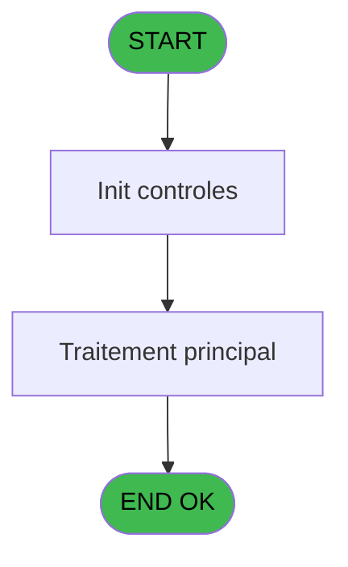

# PBP IDE 355 - Genere csv

> **Analyse**: Phases 1-4 2026-02-03 16:36 -> 16:37 (16s) | Assemblage 16:37
> **Pipeline**: V7.2 Enrichi
> **Structure**: 4 onglets (Resume | Ecrans | Donnees | Connexions)

<!-- TAB:Resume -->

## 1. FICHE D'IDENTITE

| Attribut | Valeur |
|----------|--------|
| Projet | PBP |
| IDE Position | 355 |
| Nom Programme | Genere csv |
| Fichier source | `Prg_355.xml` |
| Dossier IDE | Statistiques |
| Taches | 5 (0 ecrans visibles) |
| Tables modifiees | 0 |
| Programmes appeles | 0 |

## 2. DESCRIPTION FONCTIONNELLE

**Genere csv** assure la gestion complete de ce processus, accessible depuis [Edition csv statistiques (IDE 354)](PBP-IDE-354.md).

Le flux de traitement s'organise en **1 blocs fonctionnels** :

- **Traitement** (5 taches) : traitements metier divers

Detail : phases du traitement

#### Phase 1 : Traitement (5 taches)

- **355.1** - SQL Detail **[[ECRAN]](#ecran-t1)**
- **355** - Genere csv
- **355.2** - SQL Entete **[[ECRAN]](#ecran-t7)**
- **355.3** - SQL Pied **[[ECRAN]](#ecran-t14)**
- **355.1.1** - SQL Detail **[[ECRAN]](#ecran-t20)**

## 3. BLOCS FONCTIONNELS

### 3.1 Traitement (5 taches)

Traitements internes.

---

#### 355.1 - SQL Detail [[ECRAN]](#ecran-t1)

**Role** : Traitement : SQL Detail.
**Ecran** : 215 x 195 DLU | [Voir mockup](#ecran-t1)

4 sous-taches directes

| Tache | Nom | Bloc |
|-------|-----|------|
| [355](#t3) | Genere csv | Traitement |
| [355.2](#t7) | SQL Entete **[[ECRAN]](#ecran-t7)** | Traitement |
| [355.3](#t14) | SQL Pied **[[ECRAN]](#ecran-t14)** | Traitement |
| [355.1.1](#t20) | SQL Detail **[[ECRAN]](#ecran-t20)** | Traitement |

---

#### 355 - Genere csv

**Role** : Traitement : Genere csv.

---

#### 355.2 - SQL Entete [[ECRAN]](#ecran-t7)

**Role** : Traitement : SQL Entete.
**Ecran** : 215 x 195 DLU | [Voir mockup](#ecran-t7)

---

#### 355.3 - SQL Pied [[ECRAN]](#ecran-t14)

**Role** : Traitement : SQL Pied.
**Ecran** : 215 x 195 DLU | [Voir mockup](#ecran-t14)

---

#### 355.1.1 - SQL Detail [[ECRAN]](#ecran-t20)

**Role** : Traitement : SQL Detail.
**Ecran** : 215 x 195 DLU | [Voir mockup](#ecran-t20)

## 5. REGLES METIER

*(Aucune regle metier identifiee)*

## 6. CONTEXTE

- **Appele par**: [Edition csv statistiques (IDE 354)](PBP-IDE-354.md)
- **Appelle**: 0 programmes | **Tables**: 0 (W:0 R:0 L:0) | **Taches**: 5 | **Expressions**: 17

<!-- TAB:Ecrans -->

## 8. ECRANS

*(Programme sans ecran visible)*

## 9. NAVIGATION

### 9.3 Structure hierarchique (5 taches)

| Position | Tache | Type | Dimensions | Bloc |
|----------|-------|------|------------|------|
| **355.1** | [**SQL Detail** (355.1)](#t1) [mockup](#ecran-t1) | - | 215x195 | Traitement |
| 355.1.1 | [Genere csv (355)](#t3) | - | - | |
| 355.1.2 | [SQL Entete (355.2)](#t7) [mockup](#ecran-t7) | - | 215x195 | |
| 355.1.3 | [SQL Pied (355.3)](#t14) [mockup](#ecran-t14) | - | 215x195 | |
| 355.1.4 | [SQL Detail (355.1.1)](#t20) [mockup](#ecran-t20) | - | 215x195 | |

### 9.4 Algorigramme

> **Legende**: Vert = START/END OK | Rouge = END KO | Bleu = Decisions
> *Algorigramme auto-genere. Utiliser `/algorigramme` pour une synthese metier detaillee.*

<!-- TAB:Donnees -->

## 10. TABLES

### Tables utilisees (0)

| ID | Nom | Description | Type | R | W | L | Usages |
|----|-----|-------------|------|---|---|---|--------|

### Colonnes par table (0 / 0 tables avec colonnes identifiees)

## 11. VARIABLES

### 11.1 Parametres entrants (5)

Variables recues du programme appelant ([Edition csv statistiques (IDE 354)](PBP-IDE-354.md)).

| Lettre | Nom | Type | Usage dans |
|--------|-----|------|-----------|
| C | P.Statut | Alpha | 1x parametre entrant |
| D | P.Code etat | Alpha | 1x parametre entrant |
| E | P.Nom etat | Alpha | 1x parametre entrant |
| F | P.Code Lieu séjour | Alpha | 3x parametre entrant |
| G | P.Libellé Lieu séjour | Alpha | 2x parametre entrant |

### 11.2 Variables de session (5)

Variables persistantes pendant toute la session.

| Lettre | Nom | Type | Usage dans |
|--------|-----|------|-----------|
| B | V.Total par nationalite | Numeric | 3x session |
| H | V.Chaine csv | Alpha | - |
| I | V.Jour | Date | - |
| J | V.Requete statut | Alpha | 3x session |
| K | V.Requete lieu de sejour | Alpha | - |

### 11.3 Autres (1)

Variables diverses.

| Lettre | Nom | Type | Usage dans |
|--------|-----|------|-----------|
| A | rech_nationalite | Unicode | - |

## 12. EXPRESSIONS

**17 / 17 expressions decodees (100%)**

### 12.1 Repartition par type

| Type | Expressions | Regles |
|------|-------------|--------|
| CALCULATION | 1 | 0 |
| CONSTANTE | 3 | 0 |
| FORMAT | 2 | 0 |
| CAST_LOGIQUE | 2 | 0 |
| OTHER | 1 | 0 |
| CONDITION | 5 | 0 |
| CONCATENATION | 1 | 0 |
| STRING | 2 | 0 |

### 12.2 Expressions cles par type

#### CALCULATION (1 expressions)

| Type | IDE | Expression | Regle |
|------|-----|------------|-------|
| CALCULATION | 8 | `P.Libellé Lieu séjour [G]+1` | - |

#### CONSTANTE (3 expressions)

| Type | IDE | Expression | Regle |
|------|-----|------------|-------|
| CONSTANTE | 15 | `' and sta_date_debut_sejour<=sta_date and sta_date_fin_sejour>sta_date'` | - |
| CONSTANTE | 14 | `' and sta_date=sta_date_fin_sejour'` | - |
| CONSTANTE | 13 | `' and sta_date=sta_date_debut_sejour'` | - |

#### FORMAT (2 expressions)

| Type | IDE | Expression | Regle |
|------|-----|------------|-------|
| FORMAT | 2 | `Trim(VG37)&' '&DStr(V.Total par nationalite [B],'YYYYMM')` | - |
| FORMAT | 1 | `'c:\temp\'&Trim(VG33)&IF(V.Requete statut [J]<>'','_'&Trim([L]),'')&'_'&Trim(P.Code etat [D])&'_'&DStr(V.Total par nationalite [B],'YYYYMM')&'.csv'` | - |

#### CAST_LOGIQUE (2 expressions)

| Type | IDE | Expression | Regle |
|------|-----|------------|-------|
| CAST_LOGIQUE | 6 | `'FALSE'LOG` | - |
| CAST_LOGIQUE | 5 | `'TRUE'LOG` | - |

#### OTHER (1 expressions)

| Type | IDE | Expression | Regle |
|------|-----|------------|-------|
| OTHER | 7 | `V.Total par nationalite [B]` | - |

#### CONDITION (5 expressions)

| Type | IDE | Expression | Regle |
|------|-----|------------|-------|
| CONDITION | 12 | `P.Code Lieu séjour [F]='P'` | - |
| CONDITION | 17 | `V.Requete statut [J]<>''` | - |
| CONDITION | 11 | `P.Code Lieu séjour [F]='A'` | - |
| CONDITION | 9 | `P.Libellé Lieu séjour [G]<=P.Statut [C]` | - |
| CONDITION | 10 | `P.Code Lieu séjour [F]='S'` | - |

#### CONCATENATION (1 expressions)

| Type | IDE | Expression | Regle |
|------|-----|------------|-------|
| CONCATENATION | 16 | `' and  sta_lieu_sejour = '&''''&V.Requete statut [J]&''''` | - |

#### STRING (2 expressions)

| Type | IDE | Expression | Regle |
|------|-----|------------|-------|
| STRING | 4 | `Trim(P.Nom etat [E])` | - |
| STRING | 3 | `'Lieu de sejour : ' &Trim([L])` | - |

<!-- TAB:Connexions -->

## 13. GRAPHE D'APPELS

### 13.1 Chaine depuis Main (Callers)

Main -> ... -> [Edition csv statistiques (IDE 354)](PBP-IDE-354.md) -> **Genere csv (IDE 355)**

### 13.2 Callers

| IDE | Nom Programme | Nb Appels |
|-----|---------------|-----------|
| [354](PBP-IDE-354.md) | Edition csv statistiques | 1 |

### 13.3 Callees (programmes appeles)

### 13.4 Detail Callees avec contexte

| IDE | Nom Programme | Appels | Contexte |
|-----|---------------|--------|----------|
| - | (aucun) | - | - |

## 14. RECOMMANDATIONS MIGRATION

### 14.1 Profil du programme

| Metrique | Valeur | Impact migration |
|----------|--------|-----------------|
| Lignes de logique | 65 | Programme compact |
| Expressions | 17 | Peu de logique |
| Tables WRITE | 0 | Impact faible |
| Sous-programmes | 0 | Peu de dependances |
| Ecrans visibles | 0 | Ecran unique ou traitement batch |
| Code desactive | 0% (0 / 65) | Code sain |
| Regles metier | 0 | Pas de regle identifiee |

### 14.2 Plan de migration par bloc

#### Traitement (5 taches: 4 ecrans, 1 traitement)

- **Strategie** : Orchestrateur avec 4 ecrans (Razor/React) et 1 traitements backend (services).
- Les ecrans deviennent des composants UI, les traitements invisibles deviennent des services injectables.
- Decomposer les taches en services unitaires testables.

### 14.3 Dependances critiques

| Dependance | Type | Appels | Impact |
|------------|------|--------|--------|

---
*Spec DETAILED generee par Pipeline V7.2 - 2026-02-03 16:37*
