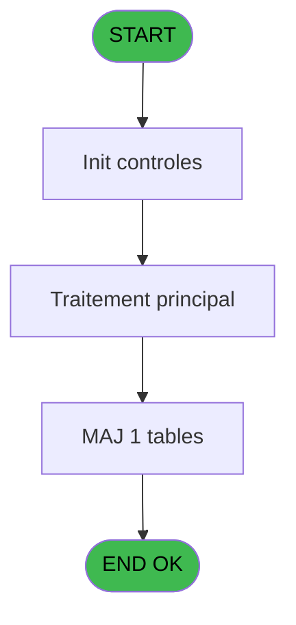
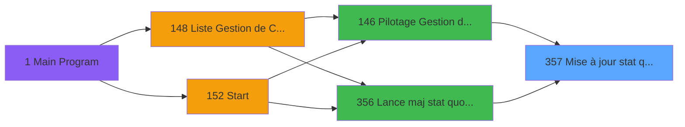

# PBP IDE 357 - Mise à jour stat quotidienne

> **Analyse**: Phases 1-4 2026-02-03 16:37 -> 16:37 (15s) | Assemblage 16:37
> **Pipeline**: V7.2 Enrichi
> **Structure**: 4 onglets (Resume | Ecrans | Donnees | Connexions)

<!-- TAB:Resume -->

## 1. FICHE D'IDENTITE

| Attribut | Valeur |
|----------|--------|
| Projet | PBP |
| IDE Position | 357 |
| Nom Programme | Mise à jour stat quotidienne |
| Fichier source | `Prg_357.xml` |
| Dossier IDE | Statistiques |
| Taches | 5 (0 ecrans visibles) |
| Tables modifiees | 1 |
| Programmes appeles | 0 |

## 2. DESCRIPTION FONCTIONNELLE

**Mise à jour stat quotidienne** assure la gestion complete de ce processus, accessible depuis [Pilotage Gestion de Crise (IDE 146)](PBP-IDE-146.md), [Lance maj stat quot pour test (IDE 356)](PBP-IDE-356.md).

Le flux de traitement s'organise en **1 blocs fonctionnels** :

- **Traitement** (5 taches) : traitements metier divers

**Donnees modifiees** : 1 tables en ecriture (##_pv_customer_dat).

Detail : phases du traitement

#### Phase 1 : Traitement (5 taches)

- **357** - Mise à jour stat quotidienne
- **357.1** - Realise
- **357.1.1** - Mise a jour stat
- **357.2** - suppression statistique
- **357.3** - Maj Lieu de sejour Statistique

#### Tables impactees

| Table | Operations | Role metier |
|-------|-----------|-------------|
| ##_pv_customer_dat | **W**/L (2 usages) |  |

## 3. BLOCS FONCTIONNELS

### 3.1 Traitement (5 taches)

Traitements internes.

---

#### 357 - Mise à jour stat quotidienne

**Role** : Traitement : Mise à jour stat quotidienne.

4 sous-taches directes

| Tache | Nom | Bloc |
|-------|-----|------|
| [357.1](#t45) | Realise | Traitement |
| [357.1.1](#t58) | Mise a jour stat | Traitement |
| [357.2](#t61) | suppression statistique | Traitement |
| [357.3](#t62) | Maj Lieu de sejour Statistique | Traitement |

**Variables liees** : B (P.Nb lieu sejour)

---

#### 357.1 - Realise

**Role** : Traitement : Realise.

---

#### 357.1.1 - Mise a jour stat

**Role** : Traitement : Mise a jour stat.
**Variables liees** : B (P.Nb lieu sejour)

---

#### 357.2 - suppression statistique

**Role** : Traitement : suppression statistique.

---

#### 357.3 - Maj Lieu de sejour Statistique

**Role** : Traitement : Maj Lieu de sejour Statistique.
**Variables liees** : B (P.Nb lieu sejour)

## 5. REGLES METIER

*(Aucune regle metier identifiee)*

## 6. CONTEXTE

- **Appele par**: [Pilotage Gestion de Crise (IDE 146)](PBP-IDE-146.md), [Lance maj stat quot pour test (IDE 356)](PBP-IDE-356.md)
- **Appelle**: 0 programmes | **Tables**: 8 (W:1 R:3 L:6) | **Taches**: 5 | **Expressions**: 3

<!-- TAB:Ecrans -->

## 8. ECRANS

*(Programme sans ecran visible)*

## 9. NAVIGATION

### 9.3 Structure hierarchique (5 taches)

| Position | Tache | Type | Dimensions | Bloc |
|----------|-------|------|------------|------|
| **357.1** | [**Mise à jour stat quotidienne** (357)](#t1) | - | - | Traitement |
| 357.1.1 | [Realise (357.1)](#t45) | MDI | - | |
| 357.1.2 | [Mise a jour stat (357.1.1)](#t58) | - | - | |
| 357.1.3 | [suppression statistique (357.2)](#t61) | - | - | |
| 357.1.4 | [Maj Lieu de sejour Statistique (357.3)](#t62) | - | - | |

### 9.4 Algorigramme

> **Legende**: Vert = START/END OK | Rouge = END KO | Bleu = Decisions
> *Algorigramme auto-genere. Utiliser `/algorigramme` pour une synthese metier detaillee.*

<!-- TAB:Donnees -->

## 10. TABLES

### Tables utilisees (8)

| ID | Nom | Description | Type | R | W | L | Usages |
|----|-----|-------------|------|---|---|---|--------|
| 30 | gm-recherche_____gmr | Index de recherche | DB | R |   |   | 1 |
| 34 | hebergement______heb | Hebergement (chambres) | DB | R |   | L | 2 |
| 36 | client_gm |  | DB |   |   | L | 1 |
| 81 | societe__________soc |  | DB |   |   | L | 2 |
| 120 | tables_qualites__qua |  | DB | R |   |   | 1 |
| 131 | fichier_validation |  | DB |   |   | L | 1 |
| 325 | gm_handicap |  | DB |   |   | L | 1 |
| 837 | ##_pv_customer_dat |  | DB |   | **W** | L | 2 |

### Colonnes par table (4 / 4 tables avec colonnes identifiees)

Table 30 - gm-recherche_____gmr (R) - 1 usages

| Lettre | Variable | Acces | Type |
|--------|----------|-------|------|
| A | V.Existe handicap ? | R | Logical |
| B | V.Jour | R | Date |

Table 34 - hebergement______heb (R/L) - 2 usages

| Lettre | Variable | Acces | Type |
|--------|----------|-------|------|
| A | v lien hebergement | R | Logical |

Table 120 - tables_qualites__qua (R) - 1 usages

| Lettre | Variable | Acces | Type |
|--------|----------|-------|------|
| A | P.Date | R | Date |
| B | P.Nb lieu sejour | R | Numeric |

Table 837 - ##_pv_customer_dat (**W**/L) - 2 usages

*Table utilisee uniquement en Link ou aucune colonne Real identifiee dans le DataView.*

## 11. VARIABLES

### 11.1 Parametres entrants (2)

Variables recues du programme appelant ([Pilotage Gestion de Crise (IDE 146)](PBP-IDE-146.md)).

| Lettre | Nom | Type | Usage dans |
|--------|-----|------|-----------|
| A | P.Date | Date | - |
| B | P.Nb lieu sejour | Numeric | - |

## 12. EXPRESSIONS

**3 / 3 expressions decodees (100%)**

### 12.1 Repartition par type

| Type | Expressions | Regles |
|------|-------------|--------|
| OTHER | 1 | 0 |
| CAST_LOGIQUE | 1 | 0 |
| CONDITION | 1 | 0 |

### 12.2 Expressions cles par type

#### OTHER (1 expressions)

| Type | IDE | Expression | Regle |
|------|-----|------------|-------|
| OTHER | 1 | `GetParam('SOCIETE')` | - |

#### CAST_LOGIQUE (1 expressions)

| Type | IDE | Expression | Regle |
|------|-----|------------|-------|
| CAST_LOGIQUE | 2 | `'TRUE'LOG` | - |

#### CONDITION (1 expressions)

| Type | IDE | Expression | Regle |
|------|-----|------------|-------|
| CONDITION | 3 | `[I]>1` | - |

<!-- TAB:Connexions -->

## 13. GRAPHE D'APPELS

### 13.1 Chaine depuis Main (Callers)

Main -> ... -> [Pilotage Gestion de Crise (IDE 146)](PBP-IDE-146.md) -> **Mise à jour stat quotidienne (IDE 357)**

Main -> ... -> [Lance maj stat quot pour test (IDE 356)](PBP-IDE-356.md) -> **Mise à jour stat quotidienne (IDE 357)**

### 13.2 Callers

| IDE | Nom Programme | Nb Appels |
|-----|---------------|-----------|
| [146](PBP-IDE-146.md) | Pilotage Gestion de Crise | 1 |
| [356](PBP-IDE-356.md) | Lance maj stat quot pour test | 1 |

### 13.3 Callees (programmes appeles)

### 13.4 Detail Callees avec contexte

| IDE | Nom Programme | Appels | Contexte |
|-----|---------------|--------|----------|
| - | (aucun) | - | - |

## 14. RECOMMANDATIONS MIGRATION

### 14.1 Profil du programme

| Metrique | Valeur | Impact migration |
|----------|--------|-----------------|
| Lignes de logique | 121 | Programme compact |
| Expressions | 3 | Peu de logique |
| Tables WRITE | 1 | Impact faible |
| Sous-programmes | 0 | Peu de dependances |
| Ecrans visibles | 0 | Ecran unique ou traitement batch |
| Code desactive | 0% (0 / 121) | Code sain |
| Regles metier | 0 | Pas de regle identifiee |

### 14.2 Plan de migration par bloc

#### Traitement (5 taches: 0 ecran, 5 traitements)

- **Strategie** : 5 service(s) backend injectable(s) (Domain Services).
- Decomposer les taches en services unitaires testables.

### 14.3 Dependances critiques

| Dependance | Type | Appels | Impact |
|------------|------|--------|--------|
| ##_pv_customer_dat | Table WRITE (Database) | 1x | Schema + repository |

---
*Spec DETAILED generee par Pipeline V7.2 - 2026-02-03 16:37*
