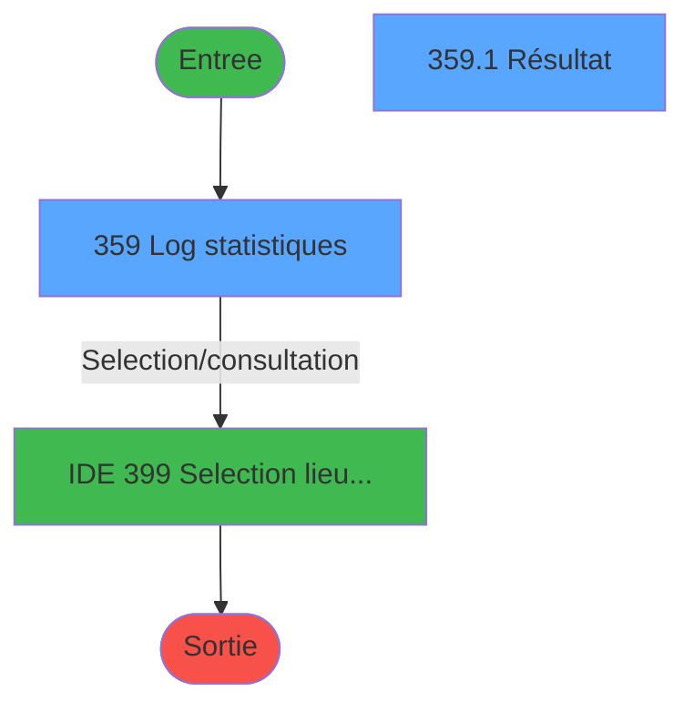
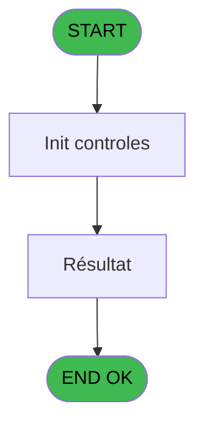
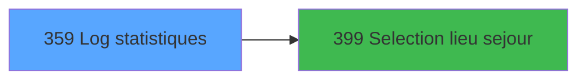

# PBP IDE 359 - Log statistiques

> **Analyse**: Phases 1-4 2026-02-03 16:38 -> 16:38 (14s) | Assemblage 16:38
> **Pipeline**: V7.2 Enrichi
> **Structure**: 4 onglets (Resume | Ecrans | Donnees | Connexions)

<!-- TAB:Resume -->

## 1. FICHE D'IDENTITE

| Attribut | Valeur |
|----------|--------|
| Projet | PBP |
| IDE Position | 359 |
| Nom Programme | Log statistiques |
| Fichier source | `Prg_359.xml` |
| Dossier IDE | Statistiques |
| Taches | 2 (2 ecrans visibles) |
| Tables modifiees | 0 |
| Programmes appeles | 1 |

## 2. DESCRIPTION FONCTIONNELLE

**Log statistiques** assure la gestion complete de ce processus, accessible depuis [Main Program (IDE 1)](PBP-IDE-1.md).

Le flux de traitement s'organise en **1 blocs fonctionnels** :

- **Traitement** (2 taches) : traitements metier divers

## 3. BLOCS FONCTIONNELS

### 3.1 Traitement (2 taches)

Traitements internes.

---

#### 359 - Log statistiques [[ECRAN]](#ecran-t1)

**Role** : Traitement : Log statistiques.
**Ecran** : 1773 x 358 DLU (MDI) | [Voir mockup](#ecran-t1)

---

#### 359.1 - Résultat [[ECRAN]](#ecran-t2)

**Role** : Traitement : Résultat.
**Ecran** : 874 x 246 DLU (Modal) | [Voir mockup](#ecran-t2)

## 5. REGLES METIER

*(Aucune regle metier identifiee)*

## 6. CONTEXTE

- **Appele par**: [Main Program (IDE 1)](PBP-IDE-1.md)
- **Appelle**: 1 programmes | **Tables**: 3 (W:0 R:1 L:2) | **Taches**: 2 | **Expressions**: 21

<!-- TAB:Ecrans -->

## 8. ECRANS

### 8.1 Forms visibles (2 / 2)

| # | Position | Tache | Nom | Type | Largeur | Hauteur | Bloc |
|---|----------|-------|-----|------|---------|---------|------|
| 1 | 359 | 359 | Log statistiques | MDI | 1773 | 358 | Traitement |
| 2 | 359.1 | 359.1 | Résultat | Modal | 874 | 246 | Traitement |

### 8.2 Mockups Ecrans

---

#### 359 - Log statistiques
**Tache** : [359](#t1) | **Type** : MDI | **Dimensions** : 1773 x 358 DLU
**Bloc** : Traitement | **Titre IDE** : Log statistiques

<!-- FORM-DATA:
{
    "width":  1773,
    "vFactor":  8,
    "type":  "MDI",
    "hFactor":  8,
    "controls":  [
                     {
                         "x":  1,
                         "type":  "label",
                         "var":  "",
                         "y":  0,
                         "w":  1758,
                         "fmt":  "",
                         "name":  "",
                         "h":  20,
                         "color":  "1",
                         "text":  "",
                         "parent":  null
                     },
                     {
                         "x":  10,
                         "type":  "label",
                         "var":  "",
                         "y":  25,
                         "w":  1751,
                         "fmt":  "",
                         "name":  "",
                         "h":  76,
                         "color":  "195",
                         "text":  "Critères",
                         "parent":  null
                     },
                     {
                         "x":  26,
                         "type":  "label",
                         "var":  "",
                         "y":  37,
                         "w":  99,
                         "fmt":  "",
                         "name":  "",
                         "h":  9,
                         "color":  "",
                         "text":  "Date",
                         "parent":  5
                     },
                     {
                         "x":  288,
                         "type":  "label",
                         "var":  "",
                         "y":  36,
                         "w":  29,
                         "fmt":  "",
                         "name":  "",
                         "h":  9,
                         "color":  "",
                         "text":  "au",
                         "parent":  5
                     },
                     {
                         "x":  26,
                         "type":  "label",
                         "var":  "",
                         "y":  70,
                         "w":  83,
                         "fmt":  "",
                         "name":  "",
                         "h":  12,
                         "color":  "",
                         "text":  "Nationalité",
                         "parent":  5
                     },
                     {
                         "x":  27,
                         "type":  "label",
                         "var":  "",
                         "y":  52,
                         "w":  94,
                         "fmt":  "",
                         "name":  "",
                         "h":  12,
                         "color":  "",
                         "text":  "Lieu séjour",
                         "parent":  5
                     },
                     {
                         "x":  6,
                         "type":  "edit",
                         "var":  "",
                         "y":  2,
                         "w":  267,
                         "fmt":  "20",
                         "name":  "",
                         "h":  8,
                         "color":  "",
                         "text":  "",
                         "parent":  1
                     },
                     {
                         "x":  1472,
                         "type":  "edit",
                         "var":  "",
                         "y":  5,
                         "w":  267,
                         "fmt":  "WWW DD MMM YYYYT",
                         "name":  "",
                         "h":  8,
                         "color":  "",
                         "text":  "",
                         "parent":  1
                     },
                     {
                         "x":  6,
                         "type":  "edit",
                         "var":  "",
                         "y":  11,
                         "w":  331,
                         "fmt":  "25",
                         "name":  "",
                         "h":  8,
                         "color":  "",
                         "text":  "",
                         "parent":  1
                     },
                     {
                         "x":  131,
                         "type":  "edit",
                         "var":  "",
                         "y":  36,
                         "w":  126,
                         "fmt":  "##/##/####Z",
                         "name":  "w0_Date_debut",
                         "h":  10,
                         "color":  "110",
                         "text":  "",
                         "parent":  5
                     },
                     {
                         "x":  257,
                         "type":  "button",
                         "var":  "",
                         "y":  36,
                         "w":  25,
                         "fmt":  "...",
                         "name":  "b_Date_deb",
                         "h":  10,
                         "color":  "",
                         "text":  "",
                         "parent":  5
                     },
                     {
                         "x":  325,
                         "type":  "edit",
                         "var":  "",
                         "y":  36,
                         "w":  126,
                         "fmt":  "##/##/####Z",
                         "name":  "w0_date_fin",
                         "h":  10,
                         "color":  "110",
                         "text":  "",
                         "parent":  5
                     },
                     {
                         "x":  451,
                         "type":  "button",
                         "var":  "",
                         "y":  36,
                         "w":  25,
                         "fmt":  "...",
                         "name":  "b_Date_fin",
                         "h":  10,
                         "color":  "",
                         "text":  "",
                         "parent":  5
                     },
                     {
                         "x":  1429,
                         "type":  "button",
                         "var":  "",
                         "y":  78,
                         "w":  154,
                         "fmt":  "Rechercher",
                         "name":  "",
                         "h":  18,
                         "color":  "",
                         "text":  "",
                         "parent":  5
                     },
                     {
                         "x":  1594,
                         "type":  "button",
                         "var":  "",
                         "y":  78,
                         "w":  154,
                         "fmt":  "Quitter",
                         "name":  "",
                         "h":  18,
                         "color":  "",
                         "text":  "",
                         "parent":  5
                     },
                     {
                         "x":  5,
                         "type":  "subform",
                         "var":  "",
                         "y":  104,
                         "w":  1765,
                         "fmt":  "",
                         "name":  "RESULTAT",
                         "h":  250,
                         "color":  "",
                         "text":  "",
                         "parent":  null
                     },
                     {
                         "x":  128,
                         "type":  "combobox",
                         "var":  "",
                         "y":  71,
                         "w":  216,
                         "fmt":  "",
                         "name":  "Nationalite",
                         "h":  12,
                         "color":  "110",
                         "text":  "",
                         "parent":  5
                     },
                     {
                         "x":  1261,
                         "type":  "button",
                         "var":  "",
                         "y":  78,
                         "w":  154,
                         "fmt":  "Effacer",
                         "name":  "",
                         "h":  18,
                         "color":  "",
                         "text":  "",
                         "parent":  5
                     },
                     {
                         "x":  191,
                         "type":  "button",
                         "var":  "",
                         "y":  52,
                         "w":  25,
                         "fmt":  "...",
                         "name":  "b_Lieu",
                         "h":  12,
                         "color":  "",
                         "text":  "",
                         "parent":  5
                     },
                     {
                         "x":  133,
                         "type":  "edit",
                         "var":  "",
                         "y":  53,
                         "w":  51,
                         "fmt":  "",
                         "name":  "v.Lieu de séjour",
                         "h":  12,
                         "color":  "6",
                         "text":  "",
                         "parent":  5
                     },
                     {
                         "x":  232,
                         "type":  "edit",
                         "var":  "",
                         "y":  53,
                         "w":  241,
                         "fmt":  "",
                         "name":  "nom_import",
                         "h":  12,
                         "color":  "",
                         "text":  "",
                         "parent":  5
                     }
                 ],
    "taskId":  "359",
    "height":  358
}
-->

<strong>Champs : 8 champs</strong>

| Pos (x,y) | Nom | Variable | Type |
|-----------|-----|----------|------|
| 6,2 | 20 | - | edit |
| 1472,5 | WWW DD MMM YYYYT | - | edit |
| 6,11 | 25 | - | edit |
| 131,36 | w0_Date_debut | - | edit |
| 325,36 | w0_date_fin | - | edit |
| 128,71 | Nationalite | - | combobox |
| 133,53 | v.Lieu de séjour | - | edit |
| 232,53 | nom_import | - | edit |

<strong>Boutons : 6 boutons</strong>

| Bouton | Pos (x,y) | Action |
|--------|-----------|--------|
| ... | 257,36 | Bouton fonctionnel |
| ... | 451,36 | Bouton fonctionnel |
| Rechercher | 1429,78 | Ouvre la selection |
| Quitter | 1594,78 | Quitte le programme |
| Effacer | 1261,78 | Supprime l'element selectionne |
| ... | 191,52 | Bouton fonctionnel |

---

#### 359.1 - Résultat
**Tache** : [359.1](#t2) | **Type** : Modal | **Dimensions** : 874 x 246 DLU
**Bloc** : Traitement | **Titre IDE** : Résultat

<!-- FORM-DATA:
{
    "width":  874,
    "vFactor":  8,
    "type":  "Modal",
    "hFactor":  4,
    "controls":  [
                     {
                         "x":  17,
                         "type":  "table",
                         "var":  "",
                         "name":  "",
                         "titleH":  12,
                         "color":  "110",
                         "w":  850,
                         "y":  8,
                         "fmt":  "",
                         "parent":  null,
                         "text":  "",
                         "rowH":  13,
                         "h":  224,
                         "cols":  [
                                      {
                                          "title":  "Date",
                                          "layer":  1,
                                          "w":  68
                                      },
                                      {
                                          "title":  "Nationalité",
                                          "layer":  2,
                                          "w":  58
                                      },
                                      {
                                          "title":  "Age",
                                          "layer":  3,
                                          "w":  34
                                      },
                                      {
                                          "title":  "PMR",
                                          "layer":  4,
                                          "w":  23
                                      },
                                      {
                                          "title":  "Nom",
                                          "layer":  5,
                                          "w":  178
                                      },
                                      {
                                          "title":  "Prénom",
                                          "layer":  6,
                                          "w":  66
                                      },
                                      {
                                          "title":  "Début séjour",
                                          "layer":  7,
                                          "w":  69
                                      },
                                      {
                                          "title":  "Fin séjour",
                                          "layer":  8,
                                          "w":  57
                                      },
                                      {
                                          "title":  "Qualité",
                                          "layer":  9,
                                          "w":  44
                                      },
                                      {
                                          "title":  "Qualité comp",
                                          "layer":  10,
                                          "w":  53
                                      },
                                      {
                                          "title":  "Compte",
                                          "layer":  11,
                                          "w":  58
                                      },
                                      {
                                          "title":  "Filiation",
                                          "layer":  12,
                                          "w":  35
                                      },
                                      {
                                          "title":  "Lieu de séjour",
                                          "layer":  13,
                                          "w":  90
                                      }
                                  ],
                         "rows":  13
                     },
                     {
                         "x":  22,
                         "type":  "edit",
                         "var":  "",
                         "y":  23,
                         "w":  61,
                         "fmt":  "",
                         "name":  "sta_date",
                         "h":  10,
                         "color":  "110",
                         "text":  "",
                         "parent":  69
                     },
                     {
                         "x":  90,
                         "type":  "edit",
                         "var":  "",
                         "y":  23,
                         "w":  14,
                         "fmt":  "",
                         "name":  "sta_nationalite",
                         "h":  10,
                         "color":  "110",
                         "text":  "",
                         "parent":  69
                     },
                     {
                         "x":  146,
                         "type":  "edit",
                         "var":  "",
                         "y":  23,
                         "w":  18,
                         "fmt":  "",
                         "name":  "sta_age",
                         "h":  10,
                         "color":  "110",
                         "text":  "",
                         "parent":  69
                     },
                     {
                         "x":  181,
                         "type":  "checkbox",
                         "var":  "",
                         "y":  23,
                         "w":  16,
                         "fmt":  "",
                         "name":  "sta_handicap_0001",
                         "h":  9,
                         "color":  "110",
                         "text":  "",
                         "parent":  69
                     },
                     {
                         "x":  205,
                         "type":  "edit",
                         "var":  "",
                         "y":  23,
                         "w":  171,
                         "fmt":  "",
                         "name":  "sta_nom",
                         "h":  10,
                         "color":  "110",
                         "text":  "",
                         "parent":  69
                     },
                     {
                         "x":  382,
                         "type":  "edit",
                         "var":  "",
                         "y":  23,
                         "w":  59,
                         "fmt":  "",
                         "name":  "sta_prenom",
                         "h":  10,
                         "color":  "110",
                         "text":  "",
                         "parent":  69
                     },
                     {
                         "x":  449,
                         "type":  "edit",
                         "var":  "",
                         "y":  23,
                         "w":  61,
                         "fmt":  "",
                         "name":  "sta_date_debut_sejour",
                         "h":  10,
                         "color":  "110",
                         "text":  "",
                         "parent":  69
                     },
                     {
                         "x":  517,
                         "type":  "edit",
                         "var":  "",
                         "y":  23,
                         "w":  61,
                         "fmt":  "",
                         "name":  "sta_date_fin_sejour",
                         "h":  10,
                         "color":  "110",
                         "text":  "",
                         "parent":  69
                     },
                     {
                         "x":  573,
                         "type":  "edit",
                         "var":  "",
                         "y":  23,
                         "w":  20,
                         "fmt":  "",
                         "name":  "sta_qualite",
                         "h":  10,
                         "color":  "110",
                         "text":  "",
                         "parent":  69
                     },
                     {
                         "x":  617,
                         "type":  "edit",
                         "var":  "",
                         "y":  23,
                         "w":  26,
                         "fmt":  "",
                         "name":  "sta_qualite_comp",
                         "h":  10,
                         "color":  "110",
                         "text":  "",
                         "parent":  69
                     },
                     {
                         "x":  672,
                         "type":  "edit",
                         "var":  "",
                         "y":  23,
                         "w":  42,
                         "fmt":  "",
                         "name":  "sta_num_compte",
                         "h":  10,
                         "color":  "110",
                         "text":  "",
                         "parent":  69
                     },
                     {
                         "x":  730,
                         "type":  "edit",
                         "var":  "",
                         "y":  23,
                         "w":  18,
                         "fmt":  "",
                         "name":  "sta_filiation",
                         "h":  10,
                         "color":  "110",
                         "text":  "",
                         "parent":  69
                     },
                     {
                         "x":  764,
                         "type":  "edit",
                         "var":  "",
                         "y":  23,
                         "w":  84,
                         "fmt":  "",
                         "name":  "sta_lieu_sejour",
                         "h":  10,
                         "color":  "110",
                         "text":  "",
                         "parent":  69
                     }
                 ],
    "taskId":  "359.1",
    "height":  246
}
-->

<strong>Champs : 13 champs</strong>

| Pos (x,y) | Nom | Variable | Type |
|-----------|-----|----------|------|
| 22,23 | sta_date | - | edit |
| 90,23 | sta_nationalite | - | edit |
| 146,23 | sta_age | - | edit |
| 181,23 | sta_handicap_0001 | - | checkbox |
| 205,23 | sta_nom | - | edit |
| 382,23 | sta_prenom | - | edit |
| 449,23 | sta_date_debut_sejour | - | edit |
| 517,23 | sta_date_fin_sejour | - | edit |
| 573,23 | sta_qualite | - | edit |
| 617,23 | sta_qualite_comp | - | edit |
| 672,23 | sta_num_compte | - | edit |
| 730,23 | sta_filiation | - | edit |
| 764,23 | sta_lieu_sejour | - | edit |

## 9. NAVIGATION

### 9.1 Enchainement des ecrans

**Detail par enchainement :**

| Depuis | Action | Vers | Retour |
|--------|--------|------|--------|
| Log statistiques | Selection/consultation | [Selection lieu sejour (IDE 399)](PBP-IDE-399.md) | Retour ecran |

### 9.3 Structure hierarchique (2 taches)

| Position | Tache | Type | Dimensions | Bloc |
|----------|-------|------|------------|------|
| **359.1** | [**Log statistiques** (359)](#t1) [mockup](#ecran-t1) | MDI | 1773x358 | Traitement |
| 359.1.1 | [Résultat (359.1)](#t2) [mockup](#ecran-t2) | Modal | 874x246 | |

### 9.4 Algorigramme

> **Legende**: Vert = START/END OK | Rouge = END KO | Bleu = Decisions
> *Algorigramme auto-genere. Utiliser `/algorigramme` pour une synthese metier detaillee.*

<!-- TAB:Donnees -->

## 10. TABLES

### Tables utilisees (3)

| ID | Nom | Description | Type | R | W | L | Usages |
|----|-----|-------------|------|---|---|---|--------|
| 118 | tables_imports |  | DB | R |   |   | 2 |
| 120 | tables_qualites__qua |  | DB |   |   | L | 1 |
| 837 | ##_pv_customer_dat |  | DB |   |   | L | 1 |

### Colonnes par table (1 / 1 tables avec colonnes identifiees)

Table 118 - tables_imports (R) - 2 usages

| Lettre | Variable | Acces | Type |
|--------|----------|-------|------|
| A | w0_Date debut | R | Date |
| B | b_Date debut | R | Alpha |
| C | w0_Date fin | R | Date |
| D | b_Date fin | R | Alpha |
| E | v.Nationalite | R | Alpha |
| F | b_Lieu | R | Alpha |
| G | v.Lieu de séjour | R | Alpha |
| H | b_Quitter | R | Alpha |

## 11. VARIABLES

### 11.1 Variables de session (2)

Variables persistantes pendant toute la session.

| Lettre | Nom | Type | Usage dans |
|--------|-----|------|-----------|
| E | v.Nationalite | Alpha | - |
| G | v.Lieu de séjour | Alpha | - |

### 11.2 Autres (6)

Variables diverses.

| Lettre | Nom | Type | Usage dans |
|--------|-----|------|-----------|
| A | w0_Date debut | Date | - |
| B | b_Date debut | Alpha | 1x refs |
| C | w0_Date fin | Date | - |
| D | b_Date fin | Alpha | - |
| F | b_Lieu | Alpha | - |
| H | b_Quitter | Alpha | - |

## 12. EXPRESSIONS

**21 / 21 expressions decodees (100%)**

### 12.1 Repartition par type

| Type | Expressions | Regles |
|------|-------------|--------|
| CONSTANTE | 5 | 0 |
| DATE | 3 | 0 |
| REFERENCE_VG | 1 | 0 |
| OTHER | 5 | 0 |
| CONDITION | 7 | 0 |

### 12.2 Expressions cles par type

#### CONSTANTE (5 expressions)

| Type | IDE | Expression | Regle |
|------|-----|------------|-------|
| CONSTANTE | 10 | `''` | - |
| CONSTANTE | 11 | `'1'` | - |
| CONSTANTE | 9 | `'F'` | - |
| CONSTANTE | 1 | `'...'` | - |
| CONSTANTE | 6 | `'RESULTAT'` | - |

#### DATE (3 expressions)

| Type | IDE | Expression | Regle |
|------|-----|------------|-------|
| DATE | 8 | `Date()-1` | - |
| DATE | 7 | `BOM(Date())` | - |
| DATE | 3 | `Date ()` | - |

#### REFERENCE_VG (1 expressions)

| Type | IDE | Expression | Regle |
|------|-----|------------|-------|
| REFERENCE_VG | 2 | `VG2` | - |

#### OTHER (5 expressions)

| Type | IDE | Expression | Regle |
|------|-----|------------|-------|
| OTHER | 20 | `GetParam('SOCIETE')` | - |
| OTHER | 21 | `[FV]` | - |
| OTHER | 12 | `[DJ]` | - |
| OTHER | 4 | `GetParam ('VILLAGE')` | - |
| OTHER | 5 | `GetParam('SOCIETE')` | - |

#### CONDITION (7 expressions)

| Type | IDE | Expression | Regle |
|------|-----|------------|-------|
| CONDITION | 17 | `CndRange({1,113}<>'',{1,113})` | - |
| CONDITION | 18 | `[FO]>b_Date debut [B]` | - |
| CONDITION | 19 | `CndRange({1,114}<>'',{1,114})` | - |
| CONDITION | 16 | `CndRange({1,105}<>0,{1,105})` | - |
| CONDITION | 13 | `VG44>1` | - |
| ... | | *+2 autres* | |

### 12.3 Toutes les expressions (21)

Voir les 21 expressions

#### CONSTANTE (5)

| IDE | Expression Decodee |
|-----|-------------------|
| 1 | `'...'` |
| 6 | `'RESULTAT'` |
| 9 | `'F'` |
| 10 | `''` |
| 11 | `'1'` |

#### DATE (3)

| IDE | Expression Decodee |
|-----|-------------------|
| 3 | `Date ()` |
| 7 | `BOM(Date())` |
| 8 | `Date()-1` |

#### REFERENCE_VG (1)

| IDE | Expression Decodee |
|-----|-------------------|
| 2 | `VG2` |

#### OTHER (5)

| IDE | Expression Decodee |
|-----|-------------------|
| 4 | `GetParam ('VILLAGE')` |
| 5 | `GetParam('SOCIETE')` |
| 12 | `[DJ]` |
| 20 | `GetParam('SOCIETE')` |
| 21 | `[FV]` |

#### CONDITION (7)

| IDE | Expression Decodee |
|-----|-------------------|
| 13 | `VG44>1` |
| 14 | `VG44>1 AND VG45='O'` |
| 15 | `CndRange({1,1}<>0,{1,1})` |
| 16 | `CndRange({1,105}<>0,{1,105})` |
| 17 | `CndRange({1,113}<>'',{1,113})` |
| 18 | `[FO]>b_Date debut [B]` |
| 19 | `CndRange({1,114}<>'',{1,114})` |

<!-- TAB:Connexions -->

## 13. GRAPHE D'APPELS

### 13.1 Chaine depuis Main (Callers)

Main -> ... -> [Main Program (IDE 1)](PBP-IDE-1.md) -> **Log statistiques (IDE 359)**

### 13.2 Callers

| IDE | Nom Programme | Nb Appels |
|-----|---------------|-----------|
| [1](PBP-IDE-1.md) | Main Program | 1 |

### 13.3 Callees (programmes appeles)

### 13.4 Detail Callees avec contexte

| IDE | Nom Programme | Appels | Contexte |
|-----|---------------|--------|----------|
| [399](PBP-IDE-399.md) | Selection lieu sejour | 1 | Selection/consultation |

## 14. RECOMMANDATIONS MIGRATION

### 14.1 Profil du programme

| Metrique | Valeur | Impact migration |
|----------|--------|-----------------|
| Lignes de logique | 67 | Programme compact |
| Expressions | 21 | Peu de logique |
| Tables WRITE | 0 | Impact faible |
| Sous-programmes | 1 | Peu de dependances |
| Ecrans visibles | 2 | Quelques ecrans |
| Code desactive | 0% (0 / 67) | Code sain |
| Regles metier | 0 | Pas de regle identifiee |

### 14.2 Plan de migration par bloc

#### Traitement (2 taches: 2 ecrans, 0 traitement)

- **Strategie** : 2 composant(s) UI (Razor/React) avec formulaires et validation.
- 1 sous-programme(s) a migrer ou a reutiliser depuis les services existants.
- Decomposer les taches en services unitaires testables.

### 14.3 Dependances critiques

| Dependance | Type | Appels | Impact |
|------------|------|--------|--------|
| [Selection lieu sejour (IDE 399)](PBP-IDE-399.md) | Sous-programme | 1x | Normale - Selection/consultation |

---
*Spec DETAILED generee par Pipeline V7.2 - 2026-02-03 16:38*
