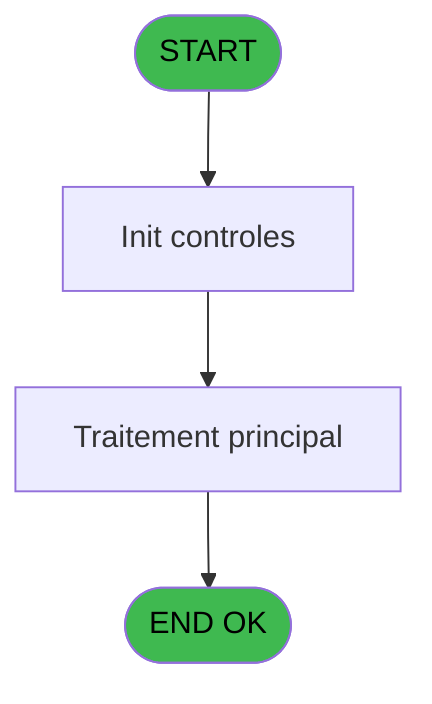
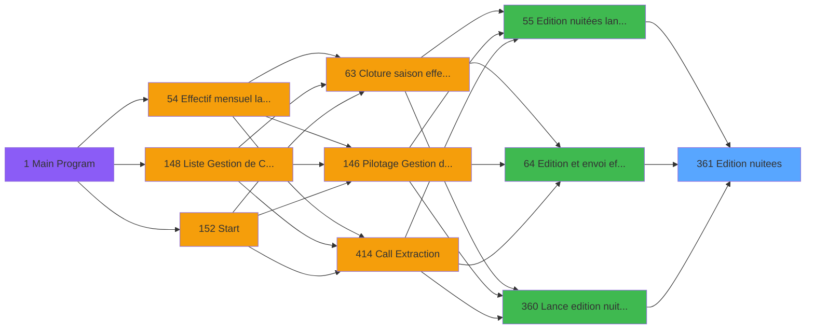
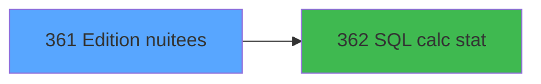

# PBP IDE 361 - Edition nuitees

> **Analyse**: Phases 1-4 2026-02-03 16:38 -> 16:39 (14s) | Assemblage 16:39
> **Pipeline**: V7.2 Enrichi
> **Structure**: 4 onglets (Resume | Ecrans | Donnees | Connexions)

<!-- TAB:Resume -->

## 1. FICHE D'IDENTITE

| Attribut | Valeur |
|----------|--------|
| Projet | PBP |
| IDE Position | 361 |
| Nom Programme | Edition nuitees |
| Fichier source | `Prg_361.xml` |
| Dossier IDE | Statistiques |
| Taches | 11 (0 ecrans visibles) |
| Tables modifiees | 0 |
| Programmes appeles | 1 |

## 2. DESCRIPTION FONCTIONNELLE

**Edition nuitees** assure la gestion complete de ce processus, accessible depuis [Edition nuitées lancement (IDE 55)](PBP-IDE-55.md), [Edition et envoi effectif (IDE 64)](PBP-IDE-64.md), [Lance edition nuitee pour test (IDE 360)](PBP-IDE-360.md).

Le flux de traitement s'organise en **2 blocs fonctionnels** :

- **Traitement** (10 taches) : traitements metier divers
- **Impression** (1 tache) : generation de tickets et documents

**Logique metier** : 1 regles identifiees couvrant conditions metier.

Detail : phases du traitement

#### Phase 1 : Traitement (10 taches)

- **361.1** - Boucle mois
- **361.2** - Recup info village
- **361.1.1** - Lecture date jour
- **361.1.1.1** - Parcourt tranche
- **361.1.2** - Mois
- **361.1.2.1** - col total mois
- **361.1.3** - Mois
- **361.1.3.1** - col total mois
- **361.1.4** - col total mois
- **361.3** - Boucle Lieu de séjour **[[ECRAN]](#ecran-t46)**

Delegue a : [SQL calc stat (IDE 362)](PBP-IDE-362.md)

#### Phase 2 : Impression (1 tache)

- **361** - Edition nuitees

## 3. BLOCS FONCTIONNELS

### 3.1 Traitement (10 taches)

Traitements internes.

---

#### 361.1 - Boucle mois

**Role** : Traitement : Boucle mois.
**Delegue a** : [SQL calc stat (IDE 362)](PBP-IDE-362.md)

---

#### 361.2 - Recup info village

**Role** : Consultation/chargement : Recup info village.
**Variables liees** : G (V.Date ouverture village), H (V.Date fermeture village)
**Delegue a** : [SQL calc stat (IDE 362)](PBP-IDE-362.md)

---

#### 361.1.1 - Lecture date jour

**Role** : Traitement : Lecture date jour.
**Variables liees** : BB (P Lieu de Sejour), B (V.Date debut calc), C (V.Date fin calc), D (V.Date debut cumul), E (V.Date debut)
**Delegue a** : [SQL calc stat (IDE 362)](PBP-IDE-362.md)

---

#### 361.1.1.1 - Parcourt tranche

**Role** : Traitement : Parcourt tranche.
**Delegue a** : [SQL calc stat (IDE 362)](PBP-IDE-362.md)

---

#### 361.1.2 - Mois

**Role** : Traitement : Mois.
**Delegue a** : [SQL calc stat (IDE 362)](PBP-IDE-362.md)

---

#### 361.1.2.1 - col total mois

**Role** : Traitement : col total mois.
**Variables liees** : S (V.TotalTaxeSejour)
**Delegue a** : [SQL calc stat (IDE 362)](PBP-IDE-362.md)

---

#### 361.1.3 - Mois

**Role** : Traitement : Mois.
**Delegue a** : [SQL calc stat (IDE 362)](PBP-IDE-362.md)

---

#### 361.1.3.1 - col total mois

**Role** : Traitement : col total mois.
**Variables liees** : S (V.TotalTaxeSejour)
**Delegue a** : [SQL calc stat (IDE 362)](PBP-IDE-362.md)

---

#### 361.1.4 - col total mois

**Role** : Traitement : col total mois.
**Variables liees** : S (V.TotalTaxeSejour)
**Delegue a** : [SQL calc stat (IDE 362)](PBP-IDE-362.md)

---

#### 361.3 - Boucle Lieu de séjour [[ECRAN]](#ecran-t46)

**Role** : Traitement : Boucle Lieu de séjour.
**Ecran** : 324 x 44 DLU | [Voir mockup](#ecran-t46)
**Variables liees** : BB (P Lieu de Sejour), W (V.Requete Lieu de sejour), X (V.Code Lieu sejour), Y (v.Libellé Lieu sejour), BA (v. Nbre Lit / Lieu sejour)
**Delegue a** : [SQL calc stat (IDE 362)](PBP-IDE-362.md)

### 3.2 Impression (1 tache)

Generation des documents et tickets.

---

#### 361 - Edition nuitees

**Role** : Generation du document : Edition nuitees.

## 5. REGLES METIER

1 regles identifiees:

### Autres (1 regles)

#### [RM-001] Si V.Nb jour exo [P] alors ' and sta_handicap=0' sinon '')

| Element | Detail |
|---------|--------|
| **Condition** | `V.Nb jour exo [P]` |
| **Si vrai** | ' and sta_handicap=0' |
| **Si faux** | '') |
| **Variables** | P (V.Nb jour exo) |
| **Expression source** | Expression 12 : `IF(V.Nb jour exo [P],' and sta_handicap=0','')` |
| **Exemple** | Si V.Nb jour exo [P] → ' and sta_handicap=0'. Sinon → '') |

## 6. CONTEXTE

- **Appele par**: [Edition nuitées lancement (IDE 55)](PBP-IDE-55.md), [Edition et envoi effectif (IDE 64)](PBP-IDE-64.md), [Lance edition nuitee pour test (IDE 360)](PBP-IDE-360.md)
- **Appelle**: 1 programmes | **Tables**: 6 (W:0 R:4 L:3) | **Taches**: 11 | **Expressions**: 28

<!-- TAB:Ecrans -->

## 8. ECRANS

*(Programme sans ecran visible)*

## 9. NAVIGATION

### 9.3 Structure hierarchique (11 taches)

| Position | Tache | Type | Dimensions | Bloc |
|----------|-------|------|------------|------|
| **361.1** | [**Boucle mois** (361.1)](#t4) | - | - | Traitement |
| 361.1.1 | [Recup info village (361.2)](#t14) | - | - | |
| 361.1.2 | [Lecture date jour (361.1.1)](#t16) | - | - | |
| 361.1.3 | [Parcourt tranche (361.1.1.1)](#t18) | - | - | |
| 361.1.4 | [Mois (361.1.2)](#t36) | - | - | |
| 361.1.5 | [col total mois (361.1.2.1)](#t37) | - | - | |
| 361.1.6 | [Mois (361.1.3)](#t41) | - | - | |
| 361.1.7 | [col total mois (361.1.3.1)](#t42) | - | - | |
| 361.1.8 | [col total mois (361.1.4)](#t45) | - | - | |
| 361.1.9 | [Boucle Lieu de séjour (361.3)](#t46) [mockup](#ecran-t46) | - | 324x44 | |
| **361.2** | [**Edition nuitees** (361)](#t10) | - | - | Impression |

### 9.4 Algorigramme

> **Legende**: Vert = START/END OK | Rouge = END KO | Bleu = Decisions
> *Algorigramme auto-genere. Utiliser `/algorigramme` pour une synthese metier detaillee.*

<!-- TAB:Donnees -->

## 10. TABLES

### Tables utilisees (6)

| ID | Nom | Description | Type | R | W | L | Usages |
|----|-----|-------------|------|---|---|---|--------|
| 81 | societe__________soc |  | DB | R |   |   | 1 |
| 118 | tables_imports |  | DB | R |   |   | 1 |
| 372 | pv_budget |  | DB | R |   | L | 2 |
| 836 | param_easy_arrival |  | DB | R |   |   | 4 |
| 837 | ##_pv_customer_dat |  | DB |   |   | L | 1 |
| 979 | Table_979 |  | MEM |   |   | L | 1 |

### Colonnes par table (2 / 4 tables avec colonnes identifiees)

Table 81 - societe__________soc (R) - 1 usages

*Table utilisee uniquement en Link ou aucune colonne Real identifiee dans le DataView.*

Table 118 - tables_imports (R) - 1 usages

*Table utilisee uniquement en Link ou aucune colonne Real identifiee dans le DataView.*

Table 372 - pv_budget (R/L) - 2 usages

| Lettre | Variable | Acces | Type |
|--------|----------|-------|------|
| A | V.Nb exoneres | R | Numeric |
| B | V.requete tranche | R | Alpha |
| C | V.Totjournuitee | R | Numeric |
| D | V.Col tranche | R | Alpha |

Table 836 - param_easy_arrival (R) - 4 usages

| Lettre | Variable | Acces | Type |
|--------|----------|-------|------|
| A | V.Col entete mois | R | Alpha |
| B | V.Col entete mois2 | R | Alpha |

## 11. VARIABLES

### 11.1 Parametres entrants (1)

Variables recues du programme appelant ([Edition nuitées lancement (IDE 55)](PBP-IDE-55.md)).

| Lettre | Nom | Type | Usage dans |
|--------|-----|------|-----------|
| BB | P Lieu de Sejour | Unicode | - |

### 11.2 Variables de session (27)

Variables persistantes pendant toute la session.

| Lettre | Nom | Type | Usage dans |
|--------|-----|------|-----------|
| A | V.fin | Logical | 1x session |
| B | V.Date debut calc | Date | 1x session |
| C | V.Date fin calc | Date | - |
| D | V.Date debut cumul | Date | - |
| E | V.Date debut | Date | 5x session |
| F | V.Date fin | Date | 1x session |
| G | V.Date ouverture village | Date | - |
| H | V.Date fermeture village | Date | - |
| I | V.Nb lit | Numeric | 3x session |
| J | V.Nb jour d exploitation | Numeric | [361.1.1](#t16), [361.3](#t46) |
| K | V.Date debut ete | Date | 3x session |
| L | V.Date fin ete | Date | 1x session |
| M | V.Date debut hiver | Date | 1x session |
| N | V.Date fin hiver | Date | - |
| O | V.Exo sejour ? | Logical | 2x session |
| P | V.Nb jour exo | Numeric | [361.1.1](#t16), [361.3](#t46) |
| Q | V.Exo PMR ? | Logical | - |
| R | V.Prix jour taxe | Numeric | - |
| S | V.TotalTaxeSejour | Numeric | - |
| T | V.Requete handicap | Alpha | - |
| U | V.Requete nb exonere | Alpha | - |
| V | V.Requete nb non exonere | Alpha | - |
| W | V.Requete Lieu de sejour | Alpha | - |
| X | V.Code Lieu sejour | Alpha | [361.3](#t46) |
| Y | v.Libellé Lieu sejour | Alpha | - |
| Z | v Nbre Lit cumulé | Numeric | - |
| BA | v. Nbre Lit / Lieu sejour | Numeric | - |

Toutes les 28 variables (liste complete)

| Cat | Lettre | Nom Variable | Type |
|-----|--------|--------------|------|
| P0 | **BB** | P Lieu de Sejour | Unicode |
| V. | **A** | V.fin | Logical |
| V. | **B** | V.Date debut calc | Date |
| V. | **C** | V.Date fin calc | Date |
| V. | **D** | V.Date debut cumul | Date |
| V. | **E** | V.Date debut | Date |
| V. | **F** | V.Date fin | Date |
| V. | **G** | V.Date ouverture village | Date |
| V. | **H** | V.Date fermeture village | Date |
| V. | **I** | V.Nb lit | Numeric |
| V. | **J** | V.Nb jour d exploitation | Numeric |
| V. | **K** | V.Date debut ete | Date |
| V. | **L** | V.Date fin ete | Date |
| V. | **M** | V.Date debut hiver | Date |
| V. | **N** | V.Date fin hiver | Date |
| V. | **O** | V.Exo sejour ? | Logical |
| V. | **P** | V.Nb jour exo | Numeric |
| V. | **Q** | V.Exo PMR ? | Logical |
| V. | **R** | V.Prix jour taxe | Numeric |
| V. | **S** | V.TotalTaxeSejour | Numeric |
| V. | **T** | V.Requete handicap | Alpha |
| V. | **U** | V.Requete nb exonere | Alpha |
| V. | **V** | V.Requete nb non exonere | Alpha |
| V. | **W** | V.Requete Lieu de sejour | Alpha |
| V. | **X** | V.Code Lieu sejour | Alpha |
| V. | **Y** | v.Libellé Lieu sejour | Alpha |
| V. | **Z** | v Nbre Lit cumulé | Numeric |
| V. | **BA** | v. Nbre Lit / Lieu sejour | Numeric |

## 12. EXPRESSIONS

**28 / 28 expressions decodees (100%)**

### 12.1 Repartition par type

| Type | Expressions | Regles |
|------|-------------|--------|
| CALCULATION | 2 | 0 |
| FORMAT | 7 | 0 |
| CONDITION | 7 | 5 |
| CONSTANTE | 3 | 0 |
| NEGATION | 2 | 0 |
| DATE | 1 | 0 |
| OTHER | 6 | 0 |

### 12.2 Expressions cles par type

#### CALCULATION (2 expressions)

| Type | IDE | Expression | Regle |
|------|-----|------------|-------|
| CALCULATION | 11 | `(V.Date fin ete [L]-V.Date debut ete [K])+1` | - |
| CALCULATION | 10 | `(V.Nb jour d exploitation [J]-V.Nb lit [I])+1` | - |

#### FORMAT (7 expressions)

| Type | IDE | Expression | Regle |
|------|-----|------------|-------|
| FORMAT | 3 | `DVal('31/10/'&Str(Year([AD]),'4'),'DD/MM/YYYY')` | - |
| FORMAT | 4 | `DVal('30/04/'&Str(IF(Range(Month([AD]),5,12),Year([AD])+1,Year([AD])),'4'),'DD/MM/YYYY')` | - |
| FORMAT | 18 | `'%club_exportdata%trsft\'&Trim(VG33)&'_EFF_Releves_nuitees_'&Trim(V.Code Lieu sejour [X])&IF(Trim(V.Code Lieu sejour [X])<>'','_','')&DStr([AD],'YYYYMM')&'.htm'` | - |
| FORMAT | 2 | `DVal('01/11/'&Str(IF(Range(Month([AE]),5,12),Year([AE]),Year([AE])-1),'4'),'DD/MM/YYYY')` | - |
| FORMAT | 13 | `' and convert(datetime, sta_date_debut_sejour,112) + '&Trim(Str(V.Exo sejour ? [O],'2'))&' >= convert(datetime,sta_date,112)'` | - |
| ... | | *+2 autres* | |

#### CONDITION (7 expressions)

| Type | IDE | Expression | Regle |
|------|-----|------------|-------|
| CONDITION | 12 | `IF(V.Nb jour exo [P],' and sta_handicap=0','')` | [RM-001](#rm-RM-001) |
| CONDITION | 21 | `VG44>1 AND VG43` | - |
| CONDITION | 26 | `[AD]=0` | - |
| CONDITION | 27 | `[AE]=0` | - |
| CONDITION | 5 | `V.Date debut calc [B]<>'O'` | - |
| ... | | *+2 autres* | |

#### CONSTANTE (3 expressions)

| Type | IDE | Expression | Regle |
|------|-----|------------|-------|
| CONSTANTE | 28 | `0` | - |
| CONSTANTE | 22 | `''` | - |
| CONSTANTE | 15 | `''` | - |

#### NEGATION (2 expressions)

| Type | IDE | Expression | Regle |
|------|-----|------------|-------|
| NEGATION | 16 | `NOT V.Date debut hiver [M]` | - |
| NEGATION | 17 | `NOT V.fin [A] AND FileExist('%club_exportdata%trsft\'&Trim(VG33)&'_EFF_Releves_nuitees_'&Trim(V.Code Lieu sejour [X])&IF(Trim(V.Code Lieu sejour [X])<>'','_','')&DStr([AD],'YYYYMM')&'.htm')` | - |

#### DATE (1 expressions)

| Type | IDE | Expression | Regle |
|------|-----|------------|-------|
| DATE | 24 | `Date()` | - |

#### OTHER (6 expressions)

| Type | IDE | Expression | Regle |
|------|-----|------------|-------|
| OTHER | 20 | `SetCrsr(1)` | - |
| OTHER | 23 | `[AC]` | - |
| OTHER | 25 | `[AD]` | - |
| OTHER | 6 | `V.Nb lit [I]` | - |
| OTHER | 7 | `V.Date debut ete [K]` | - |
| ... | | *+1 autres* | |

### 12.3 Toutes les expressions (28)

Voir les 28 expressions

#### CALCULATION (2)

| IDE | Expression Decodee |
|-----|-------------------|
| 10 | `(V.Nb jour d exploitation [J]-V.Nb lit [I])+1` |
| 11 | `(V.Date fin ete [L]-V.Date debut ete [K])+1` |

#### FORMAT (7)

| IDE | Expression Decodee |
|-----|-------------------|
| 13 | `' and convert(datetime, sta_date_debut_sejour,112) + '&Trim(Str(V.Exo sejour ? [O],'2'))&' >= convert(datetime,sta_date,112)'` |
| 14 | `' and convert(datetime, sta_date_debut_sejour,112) + '&Trim(Str(V.Exo sejour ? [O],'2'))&' < convert(datetime,sta_date,112)'` |
| 1 | `DVal('01/05/'&Str(Year([AE]),'4'),'DD/MM/YYYY')` |
| 2 | `DVal('01/11/'&Str(IF(Range(Month([AE]),5,12),Year([AE]),Year([AE])-1),'4'),'DD/MM/YYYY')` |
| 3 | `DVal('31/10/'&Str(Year([AD]),'4'),'DD/MM/YYYY')` |
| 4 | `DVal('30/04/'&Str(IF(Range(Month([AD]),5,12),Year([AD])+1,Year([AD])),'4'),'DD/MM/YYYY')` |
| 18 | `'%club_exportdata%trsft\'&Trim(VG33)&'_EFF_Releves_nuitees_'&Trim(V.Code Lieu sejour [X])&IF(Trim(V.Code Lieu sejour [X])<>'','_','')&DStr([AD],'YYYYMM')&'.htm'` |

#### CONDITION (7)

| IDE | Expression Decodee |
|-----|-------------------|
| 12 | `IF(V.Nb jour exo [P],' and sta_handicap=0','')` |
| 5 | `V.Date debut calc [B]<>'O'` |
| 8 | `[AD]>=V.Nb lit [I]` |
| 9 | `[AD]>=V.Date debut ete [K]` |
| 21 | `VG44>1 AND VG43` |
| 26 | `[AD]=0` |
| 27 | `[AE]=0` |

#### CONSTANTE (3)

| IDE | Expression Decodee |
|-----|-------------------|
| 15 | `''` |
| 22 | `''` |
| 28 | `0` |

#### NEGATION (2)

| IDE | Expression Decodee |
|-----|-------------------|
| 17 | `NOT V.fin [A] AND FileExist('%club_exportdata%trsft\'&Trim(VG33)&'_EFF_Releves_nuitees_'&Trim(V.Code Lieu sejour [X])&IF(Trim(V.Code Lieu sejour [X])<>'','_','')&DStr([AD],'YYYYMM')&'.htm')` |
| 16 | `NOT V.Date debut hiver [M]` |

#### DATE (1)

| IDE | Expression Decodee |
|-----|-------------------|
| 24 | `Date()` |

#### OTHER (6)

| IDE | Expression Decodee |
|-----|-------------------|
| 6 | `V.Nb lit [I]` |
| 7 | `V.Date debut ete [K]` |
| 19 | `SetCrsr(2)` |
| 20 | `SetCrsr(1)` |
| 23 | `[AC]` |
| 25 | `[AD]` |

<!-- TAB:Connexions -->

## 13. GRAPHE D'APPELS

### 13.1 Chaine depuis Main (Callers)

Main -> ... -> [Edition nuitées lancement (IDE 55)](PBP-IDE-55.md) -> **Edition nuitees (IDE 361)**

Main -> ... -> [Edition et envoi effectif (IDE 64)](PBP-IDE-64.md) -> **Edition nuitees (IDE 361)**

Main -> ... -> [Lance edition nuitee pour test (IDE 360)](PBP-IDE-360.md) -> **Edition nuitees (IDE 361)**

### 13.2 Callers

| IDE | Nom Programme | Nb Appels |
|-----|---------------|-----------|
| [55](PBP-IDE-55.md) | Edition nuitées lancement | 1 |
| [64](PBP-IDE-64.md) | Edition et envoi effectif | 1 |
| [360](PBP-IDE-360.md) | Lance edition nuitee pour test | 1 |

### 13.3 Callees (programmes appeles)

### 13.4 Detail Callees avec contexte

| IDE | Nom Programme | Appels | Contexte |
|-----|---------------|--------|----------|
| [362](PBP-IDE-362.md) | SQL calc stat | 6 | Calcul de donnees |

## 14. RECOMMANDATIONS MIGRATION

### 14.1 Profil du programme

| Metrique | Valeur | Impact migration |
|----------|--------|-----------------|
| Lignes de logique | 236 | Taille moyenne |
| Expressions | 28 | Peu de logique |
| Tables WRITE | 0 | Impact faible |
| Sous-programmes | 1 | Peu de dependances |
| Ecrans visibles | 0 | Ecran unique ou traitement batch |
| Code desactive | 1.7% (4 / 236) | Code sain |
| Regles metier | 1 | Quelques regles a preserver |

### 14.2 Plan de migration par bloc

#### Traitement (10 taches: 1 ecran, 9 traitements)

- **Strategie** : Orchestrateur avec 1 ecrans (Razor/React) et 9 traitements backend (services).
- Les ecrans deviennent des composants UI, les traitements invisibles deviennent des services injectables.
- 1 sous-programme(s) a migrer ou a reutiliser depuis les services existants.
- Decomposer les taches en services unitaires testables.

#### Impression (1 tache: 0 ecran, 1 traitement)

- **Strategie** : Templates HTML -> PDF via wkhtmltopdf ou Puppeteer.
- `PrintService` injectable avec choix imprimante

### 14.3 Dependances critiques

| Dependance | Type | Appels | Impact |
|------------|------|--------|--------|
| [SQL calc stat (IDE 362)](PBP-IDE-362.md) | Sous-programme | 6x | **CRITIQUE** - Calcul de donnees |

---
*Spec DETAILED generee par Pipeline V7.2 - 2026-02-03 16:39*
