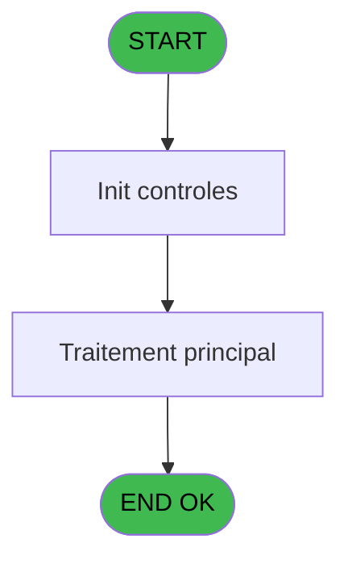

# PBP IDE 372 - Impression Incentives

> **Analyse**: Phases 1-4 2026-02-03 16:39 -> 16:39 (16s) | Assemblage 16:39
> **Pipeline**: V7.2 Enrichi
> **Structure**: 4 onglets (Resume | Ecrans | Donnees | Connexions)

<!-- TAB:Resume -->

## 1. FICHE D'IDENTITE

| Attribut | Valeur |
|----------|--------|
| Projet | PBP |
| IDE Position | 372 |
| Nom Programme | Impression Incentives |
| Fichier source | `Prg_372.xml` |
| Dossier IDE | Synchro |
| Taches | 3 (0 ecrans visibles) |
| Tables modifiees | 0 |
| Programmes appeles | 0 |

## 2. DESCRIPTION FONCTIONNELLE

**Impression Incentives** assure la gestion complete de ce processus, accessible depuis [Edition Incentives (IDE 370)](PBP-IDE-370.md).

Le flux de traitement s'organise en **2 blocs fonctionnels** :

- **Traitement** (2 taches) : traitements metier divers
- **Calcul** (1 tache) : calculs de montants, stocks ou compteurs

**Logique metier** : 1 regles identifiees couvrant conditions metier.

Detail : phases du traitement

#### Phase 1 : Traitement (2 taches)

- **372** - Impression Incentives **[[ECRAN]](#ecran-t1)**
- **372.1** - Impression **[[ECRAN]](#ecran-t10)**

#### Phase 2 : Calcul (1 tache)

- **372.2** - CalculeDebutPeriode

## 3. BLOCS FONCTIONNELS

### 3.1 Traitement (2 taches)

Traitements internes.

---

#### 372 - Impression Incentives [[ECRAN]](#ecran-t1)

**Role** : Generation du document : Impression Incentives.
**Ecran** : 846 x 548 DLU | [Voir mockup](#ecran-t1)

---

#### 372.1 - Impression [[ECRAN]](#ecran-t10)

**Role** : Generation du document : Impression.
**Ecran** : 846 x 548 DLU | [Voir mockup](#ecran-t10)

### 3.2 Calcul (1 tache)

Calculs metier : montants, stocks, compteurs.

---

#### 372.2 - CalculeDebutPeriode

**Role** : Calcul : CalculeDebutPeriode.

## 5. REGLES METIER

1 regles identifiees:

### Autres (1 regles)

#### [RM-001] Si [CQ]='VRL' alors MlsTrans('SUIVI JOURNALIER DU CA VRL TTC') sinon IF([CQ]='VSL',MlsTrans('SUIVI JOURNALIER DU CA VSL TTC'),''))

| Element | Detail |
|---------|--------|
| **Condition** | `[CQ]='VRL'` |
| **Si vrai** | MlsTrans('SUIVI JOURNALIER DU CA VRL TTC') |
| **Si faux** | IF([CQ]='VSL',MlsTrans('SUIVI JOURNALIER DU CA VSL TTC'),'')) |
| **Expression source** | Expression 1 : `IF([CQ]='VRL', MlsTrans('SUIVI JOURNALIER DU CA VRL TTC'), I` |
| **Exemple** | Si [CQ]='VRL' → MlsTrans('SUIVI JOURNALIER DU CA VRL TTC') |

## 6. CONTEXTE

- **Appele par**: [Edition Incentives (IDE 370)](PBP-IDE-370.md)
- **Appelle**: 0 programmes | **Tables**: 9 (W:0 R:2 L:8) | **Taches**: 3 | **Expressions**: 76

<!-- TAB:Ecrans -->

## 8. ECRANS

*(Programme sans ecran visible)*

## 9. NAVIGATION

### 9.3 Structure hierarchique (3 taches)

| Position | Tache | Type | Dimensions | Bloc |
|----------|-------|------|------------|------|
| **372.1** | [**Impression Incentives** (372)](#t1) [mockup](#ecran-t1) | - | 846x548 | Traitement |
| 372.1.1 | [Impression (372.1)](#t10) [mockup](#ecran-t10) | - | 846x548 | |
| **372.2** | [**CalculeDebutPeriode** (372.2)](#t31) | - | - | Calcul |

### 9.4 Algorigramme

> **Legende**: Vert = START/END OK | Rouge = END KO | Bleu = Decisions
> *Algorigramme auto-genere. Utiliser `/algorigramme` pour une synthese metier detaillee.*

<!-- TAB:Donnees -->

## 10. TABLES

### Tables utilisees (9)

| ID | Nom | Description | Type | R | W | L | Usages |
|----|-----|-------------|------|---|---|---|--------|
| 27 | donnees_village__dvi |  | DB | R |   |   | 1 |
| 30 | gm-recherche_____gmr | Index de recherche | DB |   |   | L | 1 |
| 67 | tables___________tab |  | DB |   |   | L | 1 |
| 77 | articles_________art | Articles et stock | DB |   |   | L | 1 |
| 372 | pv_budget |  | DB | R |   | L | 2 |
| 740 | pv_stock_movements | Articles et stock | DB |   |   | L | 1 |
| 802 | type_prestation | Prestations/services vendus | DB |   |   | L | 1 |
| 813 | Hébergement         supprime |  | DB |   |   | L | 1 |
| 839 | ##_pv_compta_dat |  | DB |   |   | L | 1 |

### Colonnes par table (3 / 2 tables avec colonnes identifiees)

Table 27 - donnees_village__dvi (R) - 1 usages

| Lettre | Variable | Acces | Type |
|--------|----------|-------|------|
| A | P.Date debut | R | Date |
| B | P.Date fin | R | Date |
| C | P.Responsable reception | R | Alpha |
| D | P.Nb selection | R | Numeric |
| E | P.Type article | R | Alpha |
| F | P.Gratuité | R | Logical |
| G | P.Tri par receptionniste | R | Logical |
| H | P.Type VSL (1Tout,2NA,3HorsNA | R | Alpha |
| I | P.Lieu Sejour | R | Alpha |
| J | DebutPeriode | R | Date |
| K | VillageCodeName | R | Alpha |
| L | Local Sales | R | Unicode |
| M | V.Budget | R | Numeric |
| N | V.DeviseUtilise | R | Unicode |
| O | V.Service | R | Unicode |
| P | V.Ouverture | R | Date |
| Q | V.Fermeture | R | Date |
| R | MatriculeHelios | R | Unicode |
| S | Login | R | Unicode |
| T | Nom | R | Unicode |
| U | Poste | R | Unicode |
| V | V.Mois1 | R | Numeric |
| W | V.Mois2 | R | Numeric |
| X | V.Mois3 | R | Numeric |
| Y | V.Mois4 | R | Numeric |
| Z | V.Mois5 | R | Numeric |
| BA | V.Mois6 | R | Numeric |
| BB | V.LibelleMois1 | R | Unicode |
| BC | V.LibelleMois2 | R | Unicode |
| BD | V.LibelleMois3 | R | Unicode |
| BE | V.LibelleMois4 | R | Unicode |
| BF | V.LibelleMois5 | R | Unicode |
| BG | V.LibelleMois6 | R | Unicode |
| BH | V.MontantMois1 | R | Numeric |
| BI | V.MontantMois2 | R | Numeric |
| BJ | V.MontantMois3 | R | Numeric |
| BK | V.MontantMois4 | R | Numeric |
| BL | V.MontantMois5 | R | Numeric |
| BM | V.MontantMois6 | R | Numeric |
| BN | V.TotalSaison | R | Numeric |
| BO | PourcentagePrime1 | R | Numeric |
| BP | PourcentagePrime2 | R | Numeric |
| BQ | EstimationPrime1 | R | Numeric |
| BR | EstimationPrime2 | R | Numeric |
| BS | V.TotalMois1 | R | Numeric |
| BT | V.TotalMois2 | R | Numeric |
| BU | V.TotalMois3 | R | Numeric |
| BV | V.TotalMois4 | R | Numeric |
| BW | V.TotalMois5 | R | Numeric |
| BX | V.TotalMois6 | R | Numeric |
| BY | V.Total Total Saison | R | Numeric |
| BZ | v Libelle type | R | Alpha |
| CA | v.Imputation Alpha | R | Alpha |
| CB | PrintColumnsHeader | R | Logical |

Table 372 - pv_budget (R/L) - 2 usages

| Lettre | Variable | Acces | Type |
|--------|----------|-------|------|
| M | V.Budget | R | Numeric |

## 11. VARIABLES

### 11.1 Parametres entrants (9)

Variables recues du programme appelant ([Edition Incentives (IDE 370)](PBP-IDE-370.md)).

| Lettre | Nom | Type | Usage dans |
|--------|-----|------|-----------|
| A | P.Date debut | Date | - |
| B | P.Date fin | Date | 2x parametre entrant |
| C | P.Responsable reception | Alpha | 2x parametre entrant |
| D | P.Nb selection | Numeric | 1x parametre entrant |
| E | P.Type article | Alpha | - |
| F | P.Gratuité | Logical | - |
| G | P.Tri par receptionniste | Logical | - |
| H | P.Type VSL (1Tout,2NA,3HorsNA | Alpha | - |
| I | P.Lieu Sejour | Alpha | 6x parametre entrant |

### 11.2 Variables de session (34)

Variables persistantes pendant toute la session.

| Lettre | Nom | Type | Usage dans |
|--------|-----|------|-----------|
| J | V.DebutPeriode | Date | - |
| M | V.Budget | Numeric | - |
| N | V.DeviseUtilise | Unicode | 1x session |
| O | V.Service | Unicode | - |
| P | V.Ouverture | Date | - |
| Q | V.Fermeture | Date | - |
| V | V.Mois1 | Numeric | - |
| W | V.Mois2 | Numeric | - |
| X | V.Mois3 | Numeric | - |
| Y | V.Mois4 | Numeric | - |
| Z | V.Mois5 | Numeric | - |
| BA | V.Mois6 | Numeric | - |
| BB | V.LibelleMois1 | Unicode | - |
| BC | V.LibelleMois2 | Unicode | - |
| BD | V.LibelleMois3 | Unicode | - |
| BE | V.LibelleMois4 | Unicode | - |
| BF | V.LibelleMois5 | Unicode | - |
| BG | V.LibelleMois6 | Unicode | - |
| BH | V.MontantMois1 | Numeric | - |
| BI | V.MontantMois2 | Numeric | - |
| BJ | V.MontantMois3 | Numeric | - |
| BK | V.MontantMois4 | Numeric | - |
| BL | V.MontantMois5 | Numeric | - |
| BM | V.MontantMois6 | Numeric | - |
| BN | V.TotalSaison | Numeric | - |
| BS | V.TotalMois1 | Numeric | - |
| BT | V.TotalMois2 | Numeric | - |
| BU | V.TotalMois3 | Numeric | - |
| BV | V.TotalMois4 | Numeric | - |
| BW | V.TotalMois5 | Numeric | - |
| BX | V.TotalMois6 | Numeric | - |
| BY | V.Total Total Saison | Numeric | - |
| BZ | v Libelle type | Alpha | - |
| CA | v.Imputation Alpha | Alpha | - |

### 11.3 Autres (11)

Variables diverses.

| Lettre | Nom | Type | Usage dans |
|--------|-----|------|-----------|
| K | VillageCodeName | Alpha | - |
| L | Local Sales | Unicode | - |
| R | MatriculeHelios | Unicode | - |
| S | Login | Unicode | - |
| T | Nom | Unicode | - |
| U | Poste | Unicode | - |
| BO | PourcentagePrime1 | Numeric | - |
| BP | PourcentagePrime2 | Numeric | - |
| BQ | EstimationPrime1 | Numeric | - |
| BR | EstimationPrime2 | Numeric | - |
| CB | PrintColumnsHeader | Logical | - |

Toutes les 54 variables (liste complete)

| Cat | Lettre | Nom Variable | Type |
|-----|--------|--------------|------|
| P0 | **A** | P.Date debut | Date |
| P0 | **B** | P.Date fin | Date |
| P0 | **C** | P.Responsable reception | Alpha |
| P0 | **D** | P.Nb selection | Numeric |
| P0 | **E** | P.Type article | Alpha |
| P0 | **F** | P.Gratuité | Logical |
| P0 | **G** | P.Tri par receptionniste | Logical |
| P0 | **H** | P.Type VSL (1Tout,2NA,3HorsNA | Alpha |
| P0 | **I** | P.Lieu Sejour | Alpha |
| V. | **J** | V.DebutPeriode | Date |
| V. | **M** | V.Budget | Numeric |
| V. | **N** | V.DeviseUtilise | Unicode |
| V. | **O** | V.Service | Unicode |
| V. | **P** | V.Ouverture | Date |
| V. | **Q** | V.Fermeture | Date |
| V. | **V** | V.Mois1 | Numeric |
| V. | **W** | V.Mois2 | Numeric |
| V. | **X** | V.Mois3 | Numeric |
| V. | **Y** | V.Mois4 | Numeric |
| V. | **Z** | V.Mois5 | Numeric |
| V. | **BA** | V.Mois6 | Numeric |
| V. | **BB** | V.LibelleMois1 | Unicode |
| V. | **BC** | V.LibelleMois2 | Unicode |
| V. | **BD** | V.LibelleMois3 | Unicode |
| V. | **BE** | V.LibelleMois4 | Unicode |
| V. | **BF** | V.LibelleMois5 | Unicode |
| V. | **BG** | V.LibelleMois6 | Unicode |
| V. | **BH** | V.MontantMois1 | Numeric |
| V. | **BI** | V.MontantMois2 | Numeric |
| V. | **BJ** | V.MontantMois3 | Numeric |
| V. | **BK** | V.MontantMois4 | Numeric |
| V. | **BL** | V.MontantMois5 | Numeric |
| V. | **BM** | V.MontantMois6 | Numeric |
| V. | **BN** | V.TotalSaison | Numeric |
| V. | **BS** | V.TotalMois1 | Numeric |
| V. | **BT** | V.TotalMois2 | Numeric |
| V. | **BU** | V.TotalMois3 | Numeric |
| V. | **BV** | V.TotalMois4 | Numeric |
| V. | **BW** | V.TotalMois5 | Numeric |
| V. | **BX** | V.TotalMois6 | Numeric |
| V. | **BY** | V.Total Total Saison | Numeric |
| V. | **BZ** | v Libelle type | Alpha |
| V. | **CA** | v.Imputation Alpha | Alpha |
| Autre | **K** | VillageCodeName | Alpha |
| Autre | **L** | Local Sales | Unicode |
| Autre | **R** | MatriculeHelios | Unicode |
| Autre | **S** | Login | Unicode |
| Autre | **T** | Nom | Unicode |
| Autre | **U** | Poste | Unicode |
| Autre | **BO** | PourcentagePrime1 | Numeric |
| Autre | **BP** | PourcentagePrime2 | Numeric |
| Autre | **BQ** | EstimationPrime1 | Numeric |
| Autre | **BR** | EstimationPrime2 | Numeric |
| Autre | **CB** | PrintColumnsHeader | Logical |

## 12. EXPRESSIONS

**76 / 76 expressions decodees (100%)**

### 12.1 Repartition par type

| Type | Expressions | Regles |
|------|-------------|--------|
| CALCULATION | 19 | 0 |
| CONCATENATION | 1 | 0 |
| CONDITION | 9 | 5 |
| CONSTANTE | 6 | 0 |
| FORMAT | 3 | 0 |
| DATE | 10 | 0 |
| OTHER | 24 | 0 |
| REFERENCE_VG | 2 | 0 |
| STRING | 2 | 0 |

### 12.2 Expressions cles par type

#### CALCULATION (19 expressions)

| Type | IDE | Expression | Regle |
|------|-----|------------|-------|
| CALCULATION | 60 | `[JS]+[JT]+[JU]+[JV]+[JW]+[JX]` | - |
| CALCULATION | 61 | `[JS]+P.Type VSL (1Tout,2NA,... [H]` | - |
| CALCULATION | 58 | `[KE]+[JX]` | - |
| CALCULATION | 59 | `[KM]+[KL]` | - |
| CALCULATION | 62 | `[JT]+P.Type VSL (1Tout,2NA,... [H]` | - |
| ... | | *+14 autres* | |

#### CONCATENATION (1 expressions)

| Type | IDE | Expression | Regle |
|------|-----|------------|-------|
| CONCATENATION | 7 | `'- '&Str (Page (0,1),'3P0Z0')&' -'` | - |

#### CONDITION (9 expressions)

| Type | IDE | Expression | Regle |
|------|-----|------------|-------|
| CONDITION | 1 | `IF([CQ]='VRL', MlsTrans('SUIVI JOURNALIER DU CA VRL TTC'), IF([CQ]='VSL',MlsTrans('SUIVI JOURNALIER DU CA VSL TTC'),''))
` | [RM-001](#rm-RM-001) |
| CONDITION | 71 | `Month(P.Lieu Sejour [I]) = [KV]` | - |
| CONDITION | 70 | `Month(P.Lieu Sejour [I]) = [KU]` | - |
| CONDITION | 74 | `P.Date fin [B]='O'` | - |
| CONDITION | 72 | `Month(P.Lieu Sejour [I]) = [KW]` | - |
| ... | | *+4 autres* | |

#### CONSTANTE (6 expressions)

| Type | IDE | Expression | Regle |
|------|-----|------------|-------|
| CONSTANTE | 22 | `'VSERV'` | - |
| CONSTANTE | 23 | `'O'` | - |
| CONSTANTE | 52 | `0` | - |
| CONSTANTE | 2 | `0` | - |
| CONSTANTE | 18 | `''` | - |
| ... | | *+1 autres* | |

#### FORMAT (3 expressions)

| Type | IDE | Expression | Regle |
|------|-----|------------|-------|
| FORMAT | 13 | `Trim(Str([DW],'10'))` | - |
| FORMAT | 76 | `DVal('01/01/'& Str(Year({1,14}),'4'),'DD/MM/YYYY')` | - |
| FORMAT | 8 | `Trim(Translate('%club_exportdata%'))&IF(Trim([CQ])<>'',Trim([CQ])&'_','vrl_vsl_')&Trim(GetParam('VILLAGE'))&'_'&Trim(DStr(V.DeviseUtilise [N],'DD_MM_YYYY'))&'_'&Trim(DStr([CH],'DD_MM_YYYY'))&'.pdf'` | - |

#### DATE (10 expressions)

| Type | IDE | Expression | Regle |
|------|-----|------------|-------|
| DATE | 44 | `CMonth(AddDate([KP],0,2,0))` | - |
| DATE | 43 | `CMonth(AddDate([KP],0,1,0))` | - |
| DATE | 45 | `CMonth(AddDate([KP],0,3,0))` | - |
| DATE | 47 | `CMonth(AddDate([KP],0,5,0))` | - |
| DATE | 46 | `CMonth(AddDate([KP],0,4,0))` | - |
| ... | | *+5 autres* | |

#### OTHER (24 expressions)

| Type | IDE | Expression | Regle |
|------|-----|------------|-------|
| OTHER | 30 | `[GS]` | - |
| OTHER | 31 | `[GT]` | - |
| OTHER | 32 | `[KO]` | - |
| OTHER | 27 | `[GI]` | - |
| OTHER | 28 | `[JH]` | - |
| ... | | *+19 autres* | |

#### REFERENCE_VG (2 expressions)

| Type | IDE | Expression | Regle |
|------|-----|------------|-------|
| REFERENCE_VG | 73 | `VG33` | - |
| REFERENCE_VG | 19 | `VG33` | - |

#### STRING (2 expressions)

| Type | IDE | Expression | Regle |
|------|-----|------------|-------|
| STRING | 26 | `Trim({1,95})` | - |
| STRING | 25 | `Trim([GW])` | - |

### 12.3 Toutes les expressions (76)

Voir les 76 expressions

#### CALCULATION (19)

| IDE | Expression Decodee |
|-----|-------------------|
| 5 | `[CD]+1` |
| 48 | `0.5/100` |
| 49 | `1.5/100` |
| 50 | `[KL]*[KZ]` |
| 51 | `[KL]*[LA]` |
| 53 | `[JZ]+[JS]` |
| 54 | `[KA]+[JT]` |
| 55 | `[KB]+[JU]` |
| 56 | `[KC]+[JV]` |
| 57 | `[KD]+[JW]` |
| 58 | `[KE]+[JX]` |
| 59 | `[KM]+[KL]` |
| 60 | `[JS]+[JT]+[JU]+[JV]+[JW]+[JX]` |
| 61 | `[JS]+P.Type VSL (1Tout,2NA,... [H]` |
| 62 | `[JT]+P.Type VSL (1Tout,2NA,... [H]` |
| 63 | `[JU]+P.Type VSL (1Tout,2NA,... [H]` |
| 64 | `[JV]+P.Type VSL (1Tout,2NA,... [H]` |
| 65 | `[JW]+P.Type VSL (1Tout,2NA,... [H]` |
| 66 | `[JX]+P.Type VSL (1Tout,2NA,... [H]` |

#### CONCATENATION (1)

| IDE | Expression Decodee |
|-----|-------------------|
| 7 | `'- '&Str (Page (0,1),'3P0Z0')&' -'` |

#### CONDITION (9)

| IDE | Expression Decodee |
|-----|-------------------|
| 1 | `IF([CQ]='VRL', MlsTrans('SUIVI JOURNALIER DU CA VRL TTC'), IF([CQ]='VSL',MlsTrans('SUIVI JOURNALIER DU CA VSL TTC'),''))
` |
| 6 | `[CD]>0` |
| 67 | `Month(P.Lieu Sejour [I]) = [KR]` |
| 68 | `Month(P.Lieu Sejour [I]) = [KS]` |
| 69 | `Month(P.Lieu Sejour [I]) = [KT]` |
| 70 | `Month(P.Lieu Sejour [I]) = [KU]` |
| 71 | `Month(P.Lieu Sejour [I]) = [KV]` |
| 72 | `Month(P.Lieu Sejour [I]) = [KW]` |
| 74 | `P.Date fin [B]='O'` |

#### CONSTANTE (6)

| IDE | Expression Decodee |
|-----|-------------------|
| 2 | `0` |
| 18 | `''` |
| 20 | `'BDEV'` |
| 22 | `'VSERV'` |
| 23 | `'O'` |
| 52 | `0` |

#### FORMAT (3)

| IDE | Expression Decodee |
|-----|-------------------|
| 8 | `Trim(Translate('%club_exportdata%'))&IF(Trim([CQ])<>'',Trim([CQ])&'_','vrl_vsl_')&Trim(GetParam('VILLAGE'))&'_'&Trim(DStr(V.DeviseUtilise [N],'DD_MM_YYYY'))&'_'&Trim(DStr([CH],'DD_MM_YYYY'))&'.pdf'` |
| 76 | `DVal('01/01/'& Str(Year({1,14}),'4'),'DD/MM/YYYY')` |
| 13 | `Trim(Str([DW],'10'))` |

#### DATE (10)

| IDE | Expression Decodee |
|-----|-------------------|
| 37 | `Month(AddDate([KP],0,1,0))` |
| 38 | `Month(AddDate([KP],0,2,0))` |
| 39 | `Month(AddDate([KP],0,3,0))` |
| 40 | `Month(AddDate([KP],0,4,0))` |
| 41 | `Month(AddDate([KP],0,5,0))` |
| 43 | `CMonth(AddDate([KP],0,1,0))` |
| 44 | `CMonth(AddDate([KP],0,2,0))` |
| 45 | `CMonth(AddDate([KP],0,3,0))` |
| 46 | `CMonth(AddDate([KP],0,4,0))` |
| 47 | `CMonth(AddDate([KP],0,5,0))` |

#### OTHER (24)

| IDE | Expression Decodee |
|-----|-------------------|
| 3 | `{1,262}` |
| 4 | `[GQ]` |
| 9 | `[CK]` |
| 10 | `[CT]` |
| 11 | `GetParam('SOCIETE')` |
| 12 | `[CZ]` |
| 14 | `P.Date fin [B]` |
| 15 | `P.Responsable reception [C]` |
| 16 | `P.Nb selection [D]` |
| 17 | `[CQ]` |
| 21 | `[JD]` |
| 24 | `[LB]` |
| 27 | `[GI]` |
| 28 | `[JH]` |
| 29 | `[JJ]` |
| 30 | `[GS]` |
| 31 | `[GT]` |
| 32 | `[KO]` |
| 33 | `[DH]` |
| 34 | `[DJ]` |
| 35 | `[KN]` |
| 36 | `Month([KP])` |
| 42 | `CMonth([KP])` |
| 75 | `P.Responsable reception [C]` |

#### REFERENCE_VG (2)

| IDE | Expression Decodee |
|-----|-------------------|
| 19 | `VG33` |
| 73 | `VG33` |

#### STRING (2)

| IDE | Expression Decodee |
|-----|-------------------|
| 25 | `Trim([GW])` |
| 26 | `Trim({1,95})` |

<!-- TAB:Connexions -->

## 13. GRAPHE D'APPELS

### 13.1 Chaine depuis Main (Callers)

Main -> ... -> [Edition Incentives (IDE 370)](PBP-IDE-370.md) -> **Impression Incentives (IDE 372)**

### 13.2 Callers

| IDE | Nom Programme | Nb Appels |
|-----|---------------|-----------|
| [370](PBP-IDE-370.md) | Edition Incentives | 1 |

### 13.3 Callees (programmes appeles)

### 13.4 Detail Callees avec contexte

| IDE | Nom Programme | Appels | Contexte |
|-----|---------------|--------|----------|
| - | (aucun) | - | - |

## 14. RECOMMANDATIONS MIGRATION

### 14.1 Profil du programme

| Metrique | Valeur | Impact migration |
|----------|--------|-----------------|
| Lignes de logique | 217 | Taille moyenne |
| Expressions | 76 | Logique moderee |
| Tables WRITE | 0 | Impact faible |
| Sous-programmes | 0 | Peu de dependances |
| Ecrans visibles | 0 | Ecran unique ou traitement batch |
| Code desactive | 0% (0 / 217) | Code sain |
| Regles metier | 1 | Quelques regles a preserver |

### 14.2 Plan de migration par bloc

#### Traitement (2 taches: 2 ecrans, 0 traitement)

- **Strategie** : 2 composant(s) UI (Razor/React) avec formulaires et validation.
- Decomposer les taches en services unitaires testables.

#### Calcul (1 tache: 0 ecran, 1 traitement)

- **Strategie** : Services de calcul purs (Domain Services).
- Migrer la logique de calcul (stock, compteurs, montants)

### 14.3 Dependances critiques

| Dependance | Type | Appels | Impact |
|------------|------|--------|--------|

---
*Spec DETAILED generee par Pipeline V7.2 - 2026-02-03 16:39*
