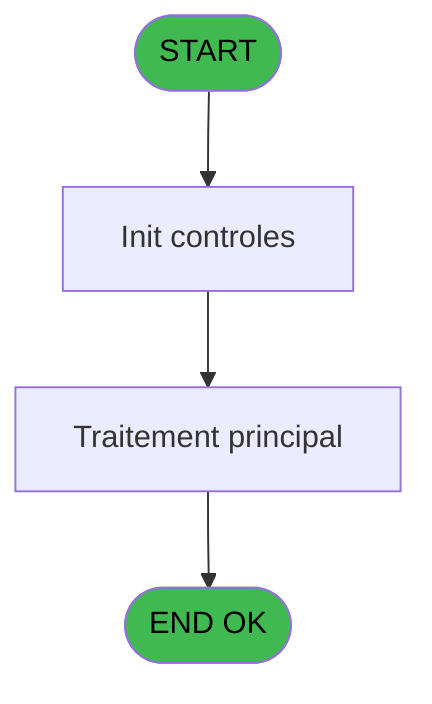

# PBP IDE 376 - Calcul tableau de remplissage

> **Analyse**: Phases 1-4 2026-02-03 16:40 -> 16:40 (14s) | Assemblage 16:40
> **Pipeline**: V7.2 Enrichi
> **Structure**: 4 onglets (Resume | Ecrans | Donnees | Connexions)

<!-- TAB:Resume -->

## 1. FICHE D'IDENTITE

| Attribut | Valeur |
|----------|--------|
| Projet | PBP |
| IDE Position | 376 |
| Nom Programme | Calcul tableau de remplissage |
| Fichier source | `Prg_376.xml` |
| Dossier IDE | Transfert |
| Taches | 21 (0 ecrans visibles) |
| Tables modifiees | 0 |
| Programmes appeles | 0 |

## 2. DESCRIPTION FONCTIONNELLE

**Calcul tableau de remplissage** assure la gestion complete de ce processus, accessible depuis [Edition Tableau Remplissage (IDE 375)](PBP-IDE-375.md).

Le flux de traitement s'organise en **2 blocs fonctionnels** :

- **Traitement** (16 taches) : traitements metier divers
- **Calcul** (5 taches) : calculs de montants, stocks ou compteurs

**Logique metier** : 1 regles identifiees couvrant conditions metier.

Detail : phases du traitement

#### Phase 1 : Calcul (5 taches)

- **376** - Calcul tableau de remplissage
- **376.2.1** - Compte pax
- **376.4.1** - Compte pax
- **376.10** - Compte chambre **[[ECRAN]](#ecran-t20)**
- **376.11** - Compte Chambre SQL

#### Phase 2 : Traitement (16 taches)

- **376.1** - Hebergement
- **376.2** - Hebergement
- **376.3** - Hebergement
- **376.4** - Hebergement
- **376.5** - Hebergement
- **376.6** - Hebergement
- **376.7** - Hebergement **[[ECRAN]](#ecran-t10)**
- **376.8** - Tarif Chambre
- **376.9** - Meteo
- **376.9.1** - qualite
- **376.9.1.1** - Hebergement **[[ECRAN]](#ecran-t14)**
- **376.9.1.2** - Hebergement
- **376.9.2** - Cumul Plafond Lit **[[ECRAN]](#ecran-t21)**
- **376.9.3** - Cumul Lit Table Import
- **376.12** - Hebergement
- **376.13** - Hebergement

## 3. BLOCS FONCTIONNELS

### 3.1 Calcul (5 taches)

Calculs metier : montants, stocks, compteurs.

---

#### 376 - Calcul tableau de remplissage

**Role** : Calcul : Calcul tableau de remplissage.

4 sous-taches directes

| Tache | Nom | Bloc |
|-------|-----|------|
| [376.2.1](#t4) | Compte pax | Calcul |
| [376.4.1](#t7) | Compte pax | Calcul |
| [376.10](#t20) | Compte chambre **[[ECRAN]](#ecran-t20)** | Calcul |
| [376.11](#t23) | Compte Chambre SQL | Calcul |

---

#### 376.2.1 - Compte pax

**Role** : Traitement : Compte pax.

---

#### 376.4.1 - Compte pax

**Role** : Traitement : Compte pax.

---

#### 376.10 - Compte chambre [[ECRAN]](#ecran-t20)

**Role** : Traitement : Compte chambre.
**Ecran** : 601 x 548 DLU | [Voir mockup](#ecran-t20)
**Variables liees** : I (V.Plafond chambre)

---

#### 376.11 - Compte Chambre SQL

**Role** : Traitement : Compte Chambre SQL.
**Variables liees** : I (V.Plafond chambre)

### 3.2 Traitement (16 taches)

Traitements internes.

---

#### 376.1 - Hebergement

**Role** : Traitement : Hebergement.

---

#### 376.2 - Hebergement

**Role** : Traitement : Hebergement.

---

#### 376.3 - Hebergement

**Role** : Traitement : Hebergement.

---

#### 376.4 - Hebergement

**Role** : Traitement : Hebergement.

---

#### 376.5 - Hebergement

**Role** : Traitement : Hebergement.

---

#### 376.6 - Hebergement

**Role** : Traitement : Hebergement.

---

#### 376.7 - Hebergement [[ECRAN]](#ecran-t10)

**Role** : Traitement : Hebergement.
**Ecran** : 598 x 527 DLU | [Voir mockup](#ecran-t10)

---

#### 376.8 - Tarif Chambre

**Role** : Traitement : Tarif Chambre.
**Variables liees** : I (V.Plafond chambre)

---

#### 376.9 - Meteo

**Role** : Traitement : Meteo.

---

#### 376.9.1 - qualite

**Role** : Traitement : qualite.

---

#### 376.9.1.1 - Hebergement [[ECRAN]](#ecran-t14)

**Role** : Traitement : Hebergement.
**Ecran** : 673 x 462 DLU | [Voir mockup](#ecran-t14)

---

#### 376.9.1.2 - Hebergement

**Role** : Traitement : Hebergement.

---

#### 376.9.2 - Cumul Plafond Lit [[ECRAN]](#ecran-t21)

**Role** : Traitement : Cumul Plafond Lit.
**Ecran** : 488 x 0 DLU | [Voir mockup](#ecran-t21)
**Variables liees** : G (P Cumul ?), I (V.Plafond chambre)

---

#### 376.9.3 - Cumul Lit Table Import

**Role** : Traitement : Cumul Lit Table Import.
**Variables liees** : G (P Cumul ?)

---

#### 376.12 - Hebergement

**Role** : Traitement : Hebergement.

---

#### 376.13 - Hebergement

**Role** : Traitement : Hebergement.

## 5. REGLES METIER

1 regles identifiees:

### Autres (1 regles)

#### [RM-001] Traitement si V.Code html global [K] est renseigne

| Element | Detail |
|---------|--------|
| **Condition** | `V.Code html global [K]<>''` |
| **Si vrai** | 'c:\temp\'&Trim(P.Libellé lieu de séjour [D])&'_'&'tableau_remplissage.htm' |
| **Si faux** | 'C:\temp\tableau_remplissage.htm') |
| **Variables** | D (P.Libellé lieu de séjour), K (V.Code html global) |
| **Expression source** | Expression 1 : `IF(V.Code html global [K]<>'','c:\temp\'&Trim(P.Libellé lieu` |
| **Exemple** | Si V.Code html global [K]<>'' → 'c:\temp\'&Trim(P.Libellé lieu de séjour [D])&'_'&'tableau_remplissage.htm'. Sinon → 'C:\temp\tableau_remplissage.htm') |

## 6. CONTEXTE

- **Appele par**: [Edition Tableau Remplissage (IDE 375)](PBP-IDE-375.md)
- **Appelle**: 0 programmes | **Tables**: 13 (W:0 R:9 L:9) | **Taches**: 21 | **Expressions**: 5

<!-- TAB:Ecrans -->

## 8. ECRANS

*(Programme sans ecran visible)*

## 9. NAVIGATION

### 9.3 Structure hierarchique (21 taches)

| Position | Tache | Type | Dimensions | Bloc |
|----------|-------|------|------------|------|
| **376.1** | [**Calcul tableau de remplissage** (376)](#t1) | - | - | Calcul |
| 376.1.1 | [Compte pax (376.2.1)](#t4) | - | - | |
| 376.1.2 | [Compte pax (376.4.1)](#t7) | - | - | |
| 376.1.3 | [Compte chambre (376.10)](#t20) [mockup](#ecran-t20) | - | 601x548 | |
| 376.1.4 | [Compte Chambre SQL (376.11)](#t23) | - | - | |
| **376.2** | [**Hebergement** (376.1)](#t2) | - | - | Traitement |
| 376.2.1 | [Hebergement (376.2)](#t3) | - | - | |
| 376.2.2 | [Hebergement (376.3)](#t5) | - | - | |
| 376.2.3 | [Hebergement (376.4)](#t6) | - | - | |
| 376.2.4 | [Hebergement (376.5)](#t8) | - | - | |
| 376.2.5 | [Hebergement (376.6)](#t9) | - | - | |
| 376.2.6 | [Hebergement (376.7)](#t10) [mockup](#ecran-t10) | - | 598x527 | |
| 376.2.7 | [Tarif Chambre (376.8)](#t11) | - | - | |
| 376.2.8 | [Meteo (376.9)](#t12) | - | - | |
| 376.2.9 | [qualite (376.9.1)](#t13) | - | - | |
| 376.2.10 | [Hebergement (376.9.1.1)](#t14) [mockup](#ecran-t14) | - | 673x462 | |
| 376.2.11 | [Hebergement (376.9.1.2)](#t15) | - | - | |
| 376.2.12 | [Cumul Plafond Lit (376.9.2)](#t21) [mockup](#ecran-t21) | - | 488x0 | |
| 376.2.13 | [Cumul Lit Table Import (376.9.3)](#t22) | - | - | |
| 376.2.14 | [Hebergement (376.12)](#t27) | - | - | |
| 376.2.15 | [Hebergement (376.13)](#t30) | - | - | |

### 9.4 Algorigramme

> **Legende**: Vert = START/END OK | Rouge = END KO | Bleu = Decisions
> *Algorigramme auto-genere. Utiliser `/algorigramme` pour une synthese metier detaillee.*

<!-- TAB:Donnees -->

## 10. TABLES

### Tables utilisees (13)

| ID | Nom | Description | Type | R | W | L | Usages |
|----|-----|-------------|------|---|---|---|--------|
| 30 | gm-recherche_____gmr | Index de recherche | DB | R |   |   | 6 |
| 31 | gm-complet_______gmc |  | DB | R |   | L | 7 |
| 34 | hebergement______heb | Hebergement (chambres) | DB | R |   | L | 10 |
| 35 | personnel_go______go |  | DB |   |   | L | 1 |
| 36 | client_gm |  | DB | R |   | L | 4 |
| 81 | societe__________soc |  | DB | R |   |   | 1 |
| 103 | logement_client__loc |  | DB | R |   | L | 2 |
| 108 | code_logement____clo |  | DB | R |   |   | 1 |
| 118 | tables_imports |  | DB | R |   |   | 3 |
| 119 | tables_pays_tel_ |  | DB |   |   | L | 1 |
| 120 | tables_qualites__qua |  | DB | R |   | L | 8 |
| 358 | import_mod |  | DB |   |   | L | 3 |
| 851 | correspittivi |  | DB |   |   | L | 2 |

### Colonnes par table (6 / 9 tables avec colonnes identifiees)

Table 30 - gm-recherche_____gmr (R) - 6 usages

| Lettre | Variable | Acces | Type |
|--------|----------|-------|------|
| A | V.Nb pax | R | Numeric |
| B | V.Platinum_New | R | Numeric |
| C | V.Gold_Old | R | Numeric |
| D | V.Gold_New | R | Numeric |
| E | V.Silver_Old | R | Numeric |
| F | V.Silver_New | R | Numeric |
| G | V.Turquoise_Old | R | Numeric |
| H | V.Turquoise_New | R | Numeric |
| I | V.New | R | Numeric |

Table 31 - gm-complet_______gmc (R/L) - 7 usages

*Table utilisee uniquement en Link ou aucune colonne Real identifiee dans le DataView.*

Table 34 - hebergement______heb (R/L) - 10 usages

| Lettre | Variable | Acces | Type |
|--------|----------|-------|------|
| A | V.occupee | R | Logical |
| B | V.date heure debut | R | Numeric |
| C | V.Date heure fin | R | Numeric |

Table 36 - client_gm (R/L) - 4 usages

*Table utilisee uniquement en Link ou aucune colonne Real identifiee dans le DataView.*

Table 81 - societe__________soc (R) - 1 usages

*Table utilisee uniquement en Link ou aucune colonne Real identifiee dans le DataView.*

Table 103 - logement_client__loc (R/L) - 2 usages

*Table utilisee uniquement en Link ou aucune colonne Real identifiee dans le DataView.*

Table 108 - code_logement____clo (R) - 1 usages

| Lettre | Variable | Acces | Type |
|--------|----------|-------|------|
| A | V.Code_fidelisation | R | Unicode |
| F | P Code Lieu séjour | R | Alpha |
| G | V.Code html généré pour la lign | R | Blob |
| K | V.Code html global | R | Blob |

Table 118 - tables_imports (R) - 3 usages

| Lettre | Variable | Acces | Type |
|--------|----------|-------|------|
| A | V.Nb lit vendus | R | Numeric |
| B | V.Nb chambre vendues | R | Numeric |
| C | v.existe lit (plafont_lit) | R | Logical |
| D | v Existe lit (Import) | R | Logical |
| E | V.Plafond lit | R | Numeric |
| F | V Cumul lit tous lieux sejour | R | Numeric |
| G | V Lien Lit /  Date | R | Logical |

Table 120 - tables_qualites__qua (R/L) - 8 usages

| Lettre | Variable | Acces | Type |
|--------|----------|-------|------|
| A | In qualites | R | Alpha |

## 11. VARIABLES

### 11.1 Parametres entrants (7)

Variables recues du programme appelant ([Edition Tableau Remplissage (IDE 375)](PBP-IDE-375.md)).

| Lettre | Nom | Type | Usage dans |
|--------|-----|------|-----------|
| A | P.Date debut | Date | 1x parametre entrant |
| B | P.Date fin | Date | - |
| C | P Premier lieu de sejour | Alpha | - |
| D | P.Libellé lieu de séjour | Alpha | 2x parametre entrant |
| E | P Premier ou Deuxieme | Alpha | - |
| F | P Code Lieu séjour | Alpha | - |
| G | P Cumul ? | Logical | - |

### 11.2 Variables de session (4)

Variables persistantes pendant toute la session.

| Lettre | Nom | Type | Usage dans |
|--------|-----|------|-----------|
| H | V.jour en cours | Date | - |
| I | V.Plafond chambre | Numeric | - |
| J | V.Total general nationalite | Numeric | - |
| K | V.Code html global | Blob | 2x session |

## 12. EXPRESSIONS

**5 / 5 expressions decodees (100%)**

### 12.1 Repartition par type

| Type | Expressions | Regles |
|------|-------------|--------|
| CONCATENATION | 1 | 0 |
| CONDITION | 1 | 5 |
| OTHER | 2 | 0 |
| REFERENCE_VG | 1 | 0 |

### 12.2 Expressions cles par type

#### CONCATENATION (1 expressions)

| Type | IDE | Expression | Regle |
|------|-----|------------|-------|
| CONCATENATION | 2 | `Trim(GetParam('VILLAGE'))&IF(V.Code html global [K]<>'',' / LIEU DE SEJOUR : '&Trim(P.Libellé lieu de séjour [D]),'')` | - |

#### CONDITION (1 expressions)

| Type | IDE | Expression | Regle |
|------|-----|------------|-------|
| CONDITION | 1 | `IF(V.Code html global [K]<>'','c:\temp\'&Trim(P.Libellé lieu de séjour [D])&'_'&'tableau_remplissage.htm','C:\temp\tableau_remplissage.htm')` | [RM-001](#rm-RM-001) |

#### OTHER (2 expressions)

| Type | IDE | Expression | Regle |
|------|-----|------------|-------|
| OTHER | 4 | `GetParam('SOCIETE')` | - |
| OTHER | 3 | `P.Date debut [A]` | - |

#### REFERENCE_VG (1 expressions)

| Type | IDE | Expression | Regle |
|------|-----|------------|-------|
| REFERENCE_VG | 5 | `VG42` | - |

<!-- TAB:Connexions -->

## 13. GRAPHE D'APPELS

### 13.1 Chaine depuis Main (Callers)

Main -> ... -> [Edition Tableau Remplissage (IDE 375)](PBP-IDE-375.md) -> **Calcul tableau de remplissage (IDE 376)**

### 13.2 Callers

| IDE | Nom Programme | Nb Appels |
|-----|---------------|-----------|
| [375](PBP-IDE-375.md) | Edition Tableau Remplissage | 3 |

### 13.3 Callees (programmes appeles)

### 13.4 Detail Callees avec contexte

| IDE | Nom Programme | Appels | Contexte |
|-----|---------------|--------|----------|
| - | (aucun) | - | - |

## 14. RECOMMANDATIONS MIGRATION

### 14.1 Profil du programme

| Metrique | Valeur | Impact migration |
|----------|--------|-----------------|
| Lignes de logique | 554 | Programme volumineux |
| Expressions | 5 | Peu de logique |
| Tables WRITE | 0 | Impact faible |
| Sous-programmes | 0 | Peu de dependances |
| Ecrans visibles | 0 | Ecran unique ou traitement batch |
| Code desactive | 0% (0 / 554) | Code sain |
| Regles metier | 1 | Quelques regles a preserver |

### 14.2 Plan de migration par bloc

#### Calcul (5 taches: 1 ecran, 4 traitements)

- **Strategie** : Services de calcul purs (Domain Services).
- Migrer la logique de calcul (stock, compteurs, montants)

#### Traitement (16 taches: 3 ecrans, 13 traitements)

- **Strategie** : Orchestrateur avec 3 ecrans (Razor/React) et 13 traitements backend (services).
- Les ecrans deviennent des composants UI, les traitements invisibles deviennent des services injectables.
- Decomposer les taches en services unitaires testables.

### 14.3 Dependances critiques

| Dependance | Type | Appels | Impact |
|------------|------|--------|--------|

---
*Spec DETAILED generee par Pipeline V7.2 - 2026-02-03 16:40*
