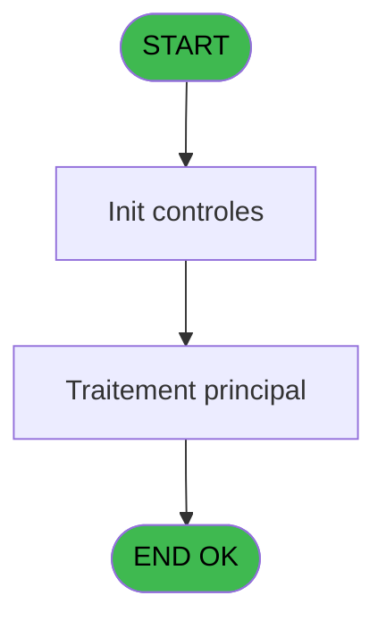
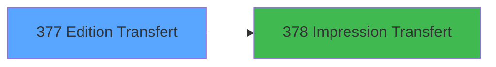

# PBP IDE 377 - Edition Transfert

> **Analyse**: Phases 1-4 2026-02-03 16:40 -> 16:40 (14s) | Assemblage 16:40
> **Pipeline**: V7.2 Enrichi
> **Structure**: 4 onglets (Resume | Ecrans | Donnees | Connexions)

<!-- TAB:Resume -->

## 1. FICHE D'IDENTITE

| Attribut | Valeur |
|----------|--------|
| Projet | PBP |
| IDE Position | 377 |
| Nom Programme | Edition Transfert |
| Fichier source | `Prg_377.xml` |
| Dossier IDE | Transfert |
| Taches | 1 (1 ecrans visibles) |
| Tables modifiees | 0 |
| Programmes appeles | 1 |
| :warning: Statut | **ORPHELIN_POTENTIEL** |

## 2. DESCRIPTION FONCTIONNELLE

**Edition Transfert** assure la gestion complete de ce processus.

Le flux de traitement s'organise en **1 blocs fonctionnels** :

- **Impression** (1 tache) : generation de tickets et documents

## 3. BLOCS FONCTIONNELS

### 3.1 Impression (1 tache)

Generation des documents et tickets.

---

#### 377 - Edition Transferts [[ECRAN]](#ecran-t1)

**Role** : Generation du document : Edition Transferts.
**Ecran** : 706 x 146 DLU | [Voir mockup](#ecran-t1)

## 5. REGLES METIER

*(Aucune regle metier identifiee)*

## 6. CONTEXTE

- **Appele par**: (aucun)
- **Appelle**: 1 programmes | **Tables**: 0 (W:0 R:0 L:0) | **Taches**: 1 | **Expressions**: 9

<!-- TAB:Ecrans -->

## 8. ECRANS

### 8.1 Forms visibles (1 / 1)

| # | Position | Tache | Nom | Type | Largeur | Hauteur | Bloc |
|---|----------|-------|-----|------|---------|---------|------|
| 1 | 377 | 377 | Edition Transferts | Type0 | 706 | 146 | Impression |

### 8.2 Mockups Ecrans

---

#### 377 - Edition Transferts
**Tache** : [377](#t1) | **Type** : Type0 | **Dimensions** : 706 x 146 DLU
**Bloc** : Impression | **Titre IDE** : Edition Transferts

<!-- FORM-DATA:
{
    "width":  706,
    "vFactor":  8,
    "type":  "Type0",
    "hFactor":  8,
    "controls":  [
                     {
                         "x":  40,
                         "type":  "label",
                         "var":  "",
                         "y":  84,
                         "w":  116,
                         "fmt":  "",
                         "name":  "",
                         "h":  12,
                         "color":  "",
                         "text":  "Lieu de vente",
                         "parent":  15
                     },
                     {
                         "x":  6,
                         "type":  "label",
                         "var":  "",
                         "y":  3,
                         "w":  683,
                         "fmt":  "",
                         "name":  "",
                         "h":  20,
                         "color":  "1",
                         "text":  "",
                         "parent":  null
                     },
                     {
                         "x":  14,
                         "type":  "label",
                         "var":  "",
                         "y":  120,
                         "w":  683,
                         "fmt":  "",
                         "name":  "",
                         "h":  24,
                         "color":  "1",
                         "text":  "",
                         "parent":  null
                     },
                     {
                         "x":  13,
                         "type":  "label",
                         "var":  "",
                         "y":  27,
                         "w":  467,
                         "fmt":  "",
                         "name":  "",
                         "h":  88,
                         "color":  "195",
                         "text":  "Paramètres",
                         "parent":  null
                     },
                     {
                         "x":  40,
                         "type":  "label",
                         "var":  "",
                         "y":  48,
                         "w":  97,
                         "fmt":  "",
                         "name":  "",
                         "h":  12,
                         "color":  "",
                         "text":  "Date début",
                         "parent":  15
                     },
                     {
                         "x":  40,
                         "type":  "label",
                         "var":  "",
                         "y":  65,
                         "w":  97,
                         "fmt":  "",
                         "name":  "",
                         "h":  12,
                         "color":  "",
                         "text":  "Date fin",
                         "parent":  15
                     },
                     {
                         "x":  502,
                         "type":  "label",
                         "var":  "",
                         "y":  27,
                         "w":  186,
                         "fmt":  "",
                         "name":  "",
                         "h":  87,
                         "color":  "",
                         "text":  "",
                         "parent":  null
                     },
                     {
                         "x":  11,
                         "type":  "edit",
                         "var":  "",
                         "y":  5,
                         "w":  267,
                         "fmt":  "20",
                         "name":  "",
                         "h":  8,
                         "color":  "",
                         "text":  "",
                         "parent":  null
                     },
                     {
                         "x":  409,
                         "type":  "edit",
                         "var":  "",
                         "y":  10,
                         "w":  267,
                         "fmt":  "WWW DD MMM YYYYT",
                         "name":  "",
                         "h":  8,
                         "color":  "",
                         "text":  "",
                         "parent":  null
                     },
                     {
                         "x":  11,
                         "type":  "edit",
                         "var":  "",
                         "y":  14,
                         "w":  326,
                         "fmt":  "25",
                         "name":  "",
                         "h":  8,
                         "color":  "",
                         "text":  "",
                         "parent":  null
                     },
                     {
                         "x":  512,
                         "type":  "image",
                         "var":  "",
                         "y":  35,
                         "w":  162,
                         "fmt":  "",
                         "name":  "",
                         "h":  53,
                         "color":  "",
                         "text":  "",
                         "parent":  35
                     },
                     {
                         "x":  170,
                         "type":  "edit",
                         "var":  "",
                         "y":  48,
                         "w":  126,
                         "fmt":  "",
                         "name":  "w0_Date_debut",
                         "h":  10,
                         "color":  "110",
                         "text":  "",
                         "parent":  15
                     },
                     {
                         "x":  306,
                         "type":  "button",
                         "var":  "",
                         "y":  48,
                         "w":  25,
                         "fmt":  "...",
                         "name":  "b_Date_debut",
                         "h":  10,
                         "color":  "",
                         "text":  "",
                         "parent":  15
                     },
                     {
                         "x":  170,
                         "type":  "edit",
                         "var":  "",
                         "y":  65,
                         "w":  126,
                         "fmt":  "",
                         "name":  "w0_Date_fin",
                         "h":  10,
                         "color":  "110",
                         "text":  "",
                         "parent":  15
                     },
                     {
                         "x":  307,
                         "type":  "button",
                         "var":  "",
                         "y":  65,
                         "w":  25,
                         "fmt":  "...",
                         "name":  "b_Date_fin",
                         "h":  10,
                         "color":  "",
                         "text":  "",
                         "parent":  15
                     },
                     {
                         "x":  170,
                         "type":  "combobox",
                         "var":  "",
                         "y":  84,
                         "w":  124,
                         "fmt":  "",
                         "name":  "V Type Vente",
                         "h":  12,
                         "color":  "110",
                         "text":  "0,1,2",
                         "parent":  15
                     },
                     {
                         "x":  518,
                         "type":  "button",
                         "var":  "",
                         "y":  89,
                         "w":  154,
                         "fmt":  "\u0026Impression",
                         "name":  "b_Edition",
                         "h":  18,
                         "color":  "",
                         "text":  "",
                         "parent":  35
                     },
                     {
                         "x":  22,
                         "type":  "button",
                         "var":  "",
                         "y":  123,
                         "w":  154,
                         "fmt":  "\u0026Quitter",
                         "name":  "",
                         "h":  18,
                         "color":  "",
                         "text":  "",
                         "parent":  13
                     }
                 ],
    "taskId":  "377",
    "height":  146
}
-->

<strong>Champs : 6 champs</strong>

| Pos (x,y) | Nom | Variable | Type |
|-----------|-----|----------|------|
| 11,5 | 20 | - | edit |
| 409,10 | WWW DD MMM YYYYT | - | edit |
| 11,14 | 25 | - | edit |
| 170,48 | w0_Date_debut | - | edit |
| 170,65 | w0_Date_fin | - | edit |
| 170,84 | V Type Vente | - | combobox |

<strong>Boutons : 4 boutons</strong>

| Bouton | Pos (x,y) | Action |
|--------|-----------|--------|
| ... | 306,48 | Bouton fonctionnel |
| ... | 307,65 | Bouton fonctionnel |
| Impression | 518,89 | Appel [  Impression Transfert (IDE 378)](PBP-IDE-378.md) |
| Quitter | 22,123 | Quitte le programme |

## 9. NAVIGATION

Ecran unique: **Edition Transferts**

### 9.3 Structure hierarchique (1 tache)

| Position | Tache | Type | Dimensions | Bloc |
|----------|-------|------|------------|------|
| **377.1** | [**Edition Transferts** (377)](#t1) [mockup](#ecran-t1) | - | 706x146 | Impression |

### 9.4 Algorigramme

> **Legende**: Vert = START/END OK | Rouge = END KO | Bleu = Decisions
> *Algorigramme auto-genere. Utiliser `/algorigramme` pour une synthese metier detaillee.*

<!-- TAB:Donnees -->

## 10. TABLES

### Tables utilisees (0)

| ID | Nom | Description | Type | R | W | L | Usages |
|----|-----|-------------|------|---|---|---|--------|

### Colonnes par table (0 / 0 tables avec colonnes identifiees)

## 11. VARIABLES

### 11.1 Variables de session (3)

Variables persistantes pendant toute la session.

| Lettre | Nom | Type | Usage dans |
|--------|-----|------|-----------|
| A | V Date Début | Date | - |
| B | V Date Fin | Date | - |
| C | V Lieu de vente | Alpha | - |

### 11.2 Autres (3)

Variables diverses.

| Lettre | Nom | Type | Usage dans |
|--------|-----|------|-----------|
| D | b_Date_debut | Alpha | - |
| E | b_Date_fin | Alpha | - |
| F | PE_Date1 | Date | - |

## 12. EXPRESSIONS

**9 / 9 expressions decodees (100%)**

### 12.1 Repartition par type

| Type | Expressions | Regles |
|------|-------------|--------|
| CONSTANTE | 2 | 0 |
| DATE | 3 | 0 |
| OTHER | 3 | 0 |
| STRING | 1 | 0 |

### 12.2 Expressions cles par type

#### CONSTANTE (2 expressions)

| Type | IDE | Expression | Regle |
|------|-----|------------|-------|
| CONSTANTE | 9 | `'Transfer List'` | - |
| CONSTANTE | 1 | `'0'` | - |

#### DATE (3 expressions)

| Type | IDE | Expression | Regle |
|------|-----|------------|-------|
| DATE | 6 | `EOM(AddDate(Date(),0,-1,0))` | - |
| DATE | 5 | `BOM(AddDate(Date(),0,-1,0))` | - |
| DATE | 4 | `Date()` | - |

#### OTHER (3 expressions)

| Type | IDE | Expression | Regle |
|------|-----|------------|-------|
| OTHER | 8 | `SetCrsr (1)` | - |
| OTHER | 7 | `SetCrsr (2)` | - |
| OTHER | 2 | `GetParam('VILLAGE')` | - |

#### STRING (1 expressions)

| Type | IDE | Expression | Regle |
|------|-----|------------|-------|
| STRING | 3 | `Trim(VG2)` | - |

<!-- TAB:Connexions -->

## 13. GRAPHE D'APPELS

### 13.1 Chaine depuis Main (Callers)

**Chemin**: (pas de callers directs)

### 13.2 Callers

| IDE | Nom Programme | Nb Appels |
|-----|---------------|-----------|
| - | (aucun) | - |

### 13.3 Callees (programmes appeles)

### 13.4 Detail Callees avec contexte

| IDE | Nom Programme | Appels | Contexte |
|-----|---------------|--------|----------|
| [378](PBP-IDE-378.md) |   Impression Transfert | 1 | Transfert donnees |

## 14. RECOMMANDATIONS MIGRATION

### 14.1 Profil du programme

| Metrique | Valeur | Impact migration |
|----------|--------|-----------------|
| Lignes de logique | 17 | Programme compact |
| Expressions | 9 | Peu de logique |
| Tables WRITE | 0 | Impact faible |
| Sous-programmes | 1 | Peu de dependances |
| Ecrans visibles | 1 | Ecran unique ou traitement batch |
| Code desactive | 0% (0 / 17) | Code sain |
| Regles metier | 0 | Pas de regle identifiee |

### 14.2 Plan de migration par bloc

#### Impression (1 tache: 1 ecran, 0 traitement)

- **Strategie** : Templates HTML -> PDF via wkhtmltopdf ou Puppeteer.
- `PrintService` injectable avec choix imprimante

### 14.3 Dependances critiques

| Dependance | Type | Appels | Impact |
|------------|------|--------|--------|
| [  Impression Transfert (IDE 378)](PBP-IDE-378.md) | Sous-programme | 1x | Normale - Transfert donnees |

---
*Spec DETAILED generee par Pipeline V7.2 - 2026-02-03 16:40*
