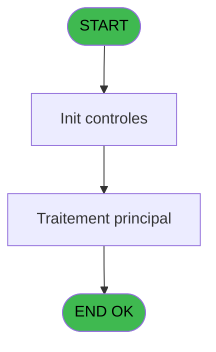
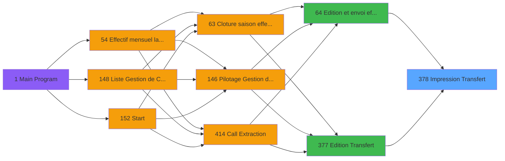

# PBP IDE 378 - Impression Transfert

> **Analyse**: Phases 1-4 2026-02-03 16:40 -> 16:41 (12s) | Assemblage 16:41
> **Pipeline**: V7.2 Enrichi
> **Structure**: 4 onglets (Resume | Ecrans | Donnees | Connexions)

<!-- TAB:Resume -->

## 1. FICHE D'IDENTITE

| Attribut | Valeur |
|----------|--------|
| Projet | PBP |
| IDE Position | 378 |
| Nom Programme | Impression Transfert |
| Fichier source | `Prg_378.xml` |
| Dossier IDE | Utilitaires |
| Taches | 2 (0 ecrans visibles) |
| Tables modifiees | 0 |
| Programmes appeles | 0 |

## 2. DESCRIPTION FONCTIONNELLE

**Impression Transfert** assure la gestion complete de ce processus, accessible depuis [Edition et envoi effectif (IDE 64)](PBP-IDE-64.md), [Edition Transfert (IDE 377)](PBP-IDE-377.md).

Le flux de traitement s'organise en **2 blocs fonctionnels** :

- **Traitement** (1 tache) : traitements metier divers
- **Impression** (1 tache) : generation de tickets et documents

Detail : phases du traitement

#### Phase 1 : Impression (1 tache)

- **378.1** - Edition Transfert **[[ECRAN]](#ecran-t1)**

#### Phase 2 : Traitement (1 tache)

- **378** - (sans nom) **[[ECRAN]](#ecran-t2)**

## 3. BLOCS FONCTIONNELS

### 3.1 Impression (1 tache)

Generation des documents et tickets.

---

#### 378.1 - Edition Transfert [[ECRAN]](#ecran-t1)

**Role** : Generation du document : Edition Transfert.
**Ecran** : 160 x 26 DLU | [Voir mockup](#ecran-t1)
**Variables liees** : D (P.Type de Transfert)

### 3.2 Traitement (1 tache)

Traitements internes.

---

#### 378 - (sans nom) [[ECRAN]](#ecran-t2)

**Role** : Traitement interne.
**Ecran** : 1178 x 81 DLU | [Voir mockup](#ecran-t2)

## 5. REGLES METIER

*(Aucune regle metier identifiee)*

## 6. CONTEXTE

- **Appele par**: [Edition et envoi effectif (IDE 64)](PBP-IDE-64.md), [Edition Transfert (IDE 377)](PBP-IDE-377.md)
- **Appelle**: 0 programmes | **Tables**: 3 (W:0 R:2 L:2) | **Taches**: 2 | **Expressions**: 7

<!-- TAB:Ecrans -->

## 8. ECRANS

*(Programme sans ecran visible)*

## 9. NAVIGATION

### 9.3 Structure hierarchique (2 taches)

| Position | Tache | Type | Dimensions | Bloc |
|----------|-------|------|------------|------|
| **378.1** | [**Edition Transfert** (378.1)](#t1) [mockup](#ecran-t1) | - | 160x26 | Impression |
| **378.2** | [**(sans nom)** (378)](#t2) [mockup](#ecran-t2) | - | 1178x81 | Traitement |

### 9.4 Algorigramme

> **Legende**: Vert = START/END OK | Rouge = END KO | Bleu = Decisions
> *Algorigramme auto-genere. Utiliser `/algorigramme` pour une synthese metier detaillee.*

<!-- TAB:Donnees -->

## 10. TABLES

### Tables utilisees (3)

| ID | Nom | Description | Type | R | W | L | Usages |
|----|-----|-------------|------|---|---|---|--------|
| 31 | gm-complet_______gmc |  | DB | R |   |   | 1 |
| 69 | initialisation___ini |  | DB | R |   | L | 2 |
| 473 | comptage_caisse | Sessions de caisse | TMP |   |   | L | 1 |

### Colonnes par table (2 / 2 tables avec colonnes identifiees)

Table 31 - gm-complet_______gmc (R) - 1 usages

| Lettre | Variable | Acces | Type |
|--------|----------|-------|------|
| A | v Montant / Lieu | R | Numeric |
| B | v Montant / date | R | Numeric |

Table 69 - initialisation___ini (R/L) - 2 usages

| Lettre | Variable | Acces | Type |
|--------|----------|-------|------|
| A | P.Appelé par gestion Crise ? | R | Logical |
| B | P.Date Début | R | Date |
| C | P.Date Fin | R | Date |
| D | P.Type de Transfert | R | Alpha |

## 11. VARIABLES

### 11.1 Parametres entrants (2)

Variables recues du programme appelant ([Edition et envoi effectif (IDE 64)](PBP-IDE-64.md)).

| Lettre | Nom | Type | Usage dans |
|--------|-----|------|-----------|
| C | P.Date Fin | Date | - |
| D | P.Type de Transfert | Alpha | - |

### 11.2 Variables de session (2)

Variables persistantes pendant toute la session.

| Lettre | Nom | Type | Usage dans |
|--------|-----|------|-----------|
| A | v Montant / Lieu | Numeric | 1x session |
| B | v Montant / date | Numeric | - |

## 12. EXPRESSIONS

**7 / 7 expressions decodees (100%)**

### 12.1 Repartition par type

| Type | Expressions | Regles |
|------|-------------|--------|
| DATE | 3 | 0 |
| FORMAT | 2 | 0 |
| OTHER | 2 | 0 |

### 12.2 Expressions cles par type

#### DATE (3 expressions)

| Type | IDE | Expression | Regle |
|------|-----|------------|-------|
| DATE | 5 | `Date()` | - |
| DATE | 2 | `EOM(AddDate(Date(),0,-1,0))` | - |
| DATE | 1 | `BOM(AddDate(Date(),0,-1,0))` | - |

#### FORMAT (2 expressions)

| Type | IDE | Expression | Regle |
|------|-----|------------|-------|
| FORMAT | 6 | `Trim(Translate('%club_exportdata%'))&'trsft\'&Trim({1,6})&'_EFF_Transfert_'&IF({1,1},Trim(DStr(Date()-2,'YYYYMM')),Trim(DStr(Date(),'YYYYMM')))&'.pdf'` | - |
| FORMAT | 4 | `Trim(DStr({1,2},'MMMMMMMMMM'))&' '&Trim(Str(Year({1,2}),'4'))` | - |

#### OTHER (2 expressions)

| Type | IDE | Expression | Regle |
|------|-----|------------|-------|
| OTHER | 7 | `[E]` | - |
| OTHER | 3 | `v Montant / Lieu [A]` | - |

<!-- TAB:Connexions -->

## 13. GRAPHE D'APPELS

### 13.1 Chaine depuis Main (Callers)

Main -> ... -> [Edition et envoi effectif (IDE 64)](PBP-IDE-64.md) -> **Impression Transfert (IDE 378)**

Main -> ... -> [Edition Transfert (IDE 377)](PBP-IDE-377.md) -> **Impression Transfert (IDE 378)**

### 13.2 Callers

| IDE | Nom Programme | Nb Appels |
|-----|---------------|-----------|
| [64](PBP-IDE-64.md) | Edition et envoi effectif | 1 |
| [377](PBP-IDE-377.md) | Edition Transfert | 1 |

### 13.3 Callees (programmes appeles)

### 13.4 Detail Callees avec contexte

| IDE | Nom Programme | Appels | Contexte |
|-----|---------------|--------|----------|
| - | (aucun) | - | - |

## 14. RECOMMANDATIONS MIGRATION

### 14.1 Profil du programme

| Metrique | Valeur | Impact migration |
|----------|--------|-----------------|
| Lignes de logique | 58 | Programme compact |
| Expressions | 7 | Peu de logique |
| Tables WRITE | 0 | Impact faible |
| Sous-programmes | 0 | Peu de dependances |
| Ecrans visibles | 0 | Ecran unique ou traitement batch |
| Code desactive | 0% (0 / 58) | Code sain |
| Regles metier | 0 | Pas de regle identifiee |

### 14.2 Plan de migration par bloc

#### Impression (1 tache: 1 ecran, 0 traitement)

- **Strategie** : Templates HTML -> PDF via wkhtmltopdf ou Puppeteer.
- `PrintService` injectable avec choix imprimante

#### Traitement (1 tache: 1 ecran, 0 traitement)

- **Strategie** : 1 composant(s) UI (Razor/React) avec formulaires et validation.
- Decomposer les taches en services unitaires testables.

### 14.3 Dependances critiques

| Dependance | Type | Appels | Impact |
|------------|------|--------|--------|

---
*Spec DETAILED generee par Pipeline V7.2 - 2026-02-03 16:41*
