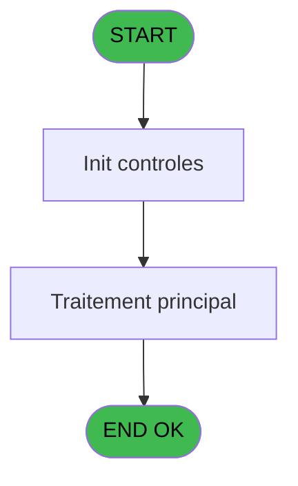

# PBP IDE 380 - Impression Anniversaires

> **Analyse**: Phases 1-4 2026-02-03 16:41 -> 16:41 (14s) | Assemblage 16:41
> **Pipeline**: V7.2 Enrichi
> **Structure**: 4 onglets (Resume | Ecrans | Donnees | Connexions)

<!-- TAB:Resume -->

## 1. FICHE D'IDENTITE

| Attribut | Valeur |
|----------|--------|
| Projet | PBP |
| IDE Position | 380 |
| Nom Programme | Impression Anniversaires |
| Fichier source | `Prg_380.xml` |
| Dossier IDE | Utilitaires |
| Taches | 2 (0 ecrans visibles) |
| Tables modifiees | 0 |
| Programmes appeles | 1 |

## 2. DESCRIPTION FONCTIONNELLE

**Impression Anniversaires** assure la gestion complete de ce processus, accessible depuis [Liste anniversaires (IDE 379)](PBP-IDE-379.md).

Le flux de traitement s'organise en **1 blocs fonctionnels** :

- **Traitement** (2 taches) : traitements metier divers

**Logique metier** : 3 regles identifiees couvrant conditions metier.

## 3. BLOCS FONCTIONNELS

### 3.1 Traitement (2 taches)

Traitements internes.

---

#### 380 - Veuillez patienter ... [[ECRAN]](#ecran-t1)

**Role** : Traitement : Veuillez patienter ....
**Ecran** : 424 x 56 DLU (MDI) | [Voir mockup](#ecran-t1)

---

#### 380.1 - (sans nom)

**Role** : Traitement interne.

## 5. REGLES METIER

3 regles identifiees:

### Autres (3 regles)

#### [RM-001] Si w0_Age [F]<=[AM] alors 'B' sinon '')

| Element | Detail |
|---------|--------|
| **Condition** | `w0_Age [F]<=[AM]` |
| **Si vrai** | 'B' |
| **Si faux** | '') |
| **Variables** | F (w0_Age) |
| **Expression source** | Expression 43 : `IF (w0_Age [F]<=[AM],'B','')` |
| **Exemple** | Si w0_Age [F]<=[AM] → 'B'. Sinon → '') |

#### [RM-002] Traitement si VG42,IF ([CC] est renseigne

| Element | Detail |
|---------|--------|
| **Condition** | `VG42` |
| **Si vrai** | IF ([CC]<>'' |
| **Si faux** | [CC],IF([CN]='M','M','')),IF ([AL]<>'',[AL],IF([CN]='M','M',''))) |
| **Expression source** | Expression 46 : `IF(VG42,IF ([CC]<>'',[CC],IF([CN]='M','M','')),IF ([AL]<>'',` |
| **Exemple** | Si VG42 → IF ([CC]<>'' |

#### [RM-003] Si [CO]='O' alors 'Oui' sinon IF ([CO]='1','Vip1',IF ([CO]='2','Vip2',IF ([CO]='3','Vip3',IF ([CO]='4','Vip4',IF ([CO]='5','Vip5',''))))))

| Element | Detail |
|---------|--------|
| **Condition** | `[CO]='O'` |
| **Si vrai** | 'Oui' |
| **Si faux** | IF ([CO]='1','Vip1',IF ([CO]='2','Vip2',IF ([CO]='3','Vip3',IF ([CO]='4','Vip4',IF ([CO]='5','Vip5','')))))) |
| **Expression source** | Expression 48 : `IF ([CO]='O','Oui',IF ([CO]='1','Vip1',IF ([CO]='2','Vip2',I` |
| **Exemple** | Si [CO]='O' → 'Oui' |

## 6. CONTEXTE

- **Appele par**: [Liste anniversaires (IDE 379)](PBP-IDE-379.md)
- **Appelle**: 1 programmes | **Tables**: 3 (W:0 R:1 L:2) | **Taches**: 2 | **Expressions**: 52

<!-- TAB:Ecrans -->

## 8. ECRANS

*(Programme sans ecran visible)*

## 9. NAVIGATION

### 9.3 Structure hierarchique (2 taches)

| Position | Tache | Type | Dimensions | Bloc |
|----------|-------|------|------------|------|
| **380.1** | [**Veuillez patienter ...** (380)](#t1) [mockup](#ecran-t1) | MDI | 424x56 | Traitement |
| 380.1.1 | [(sans nom) (380.1)](#t2) | - | - | |

### 9.4 Algorigramme

> **Legende**: Vert = START/END OK | Rouge = END KO | Bleu = Decisions
> *Algorigramme auto-genere. Utiliser `/algorigramme` pour une synthese metier detaillee.*

<!-- TAB:Donnees -->

## 10. TABLES

### Tables utilisees (3)

| ID | Nom | Description | Type | R | W | L | Usages |
|----|-----|-------------|------|---|---|---|--------|
| 104 | fichier_menage |  | DB |   |   | L | 1 |
| 119 | tables_pays_tel_ |  | DB | R |   |   | 1 |
| 358 | import_mod |  | DB |   |   | L | 1 |

### Colonnes par table (1 / 1 tables avec colonnes identifiees)

Table 119 - tables_pays_tel_ (R) - 1 usages

| Lettre | Variable | Acces | Type |
|--------|----------|-------|------|
| A | >DateDebut | R | Date |
| B | >DateFin | R | Date |
| C | <NbSansDate | R | Numeric |
| D | w0_Astro | R | Alpha |
| E | w0_Transfert | R | Numeric |
| F | w0_Age | R | Numeric |
| G | v.gmc_date_naissance alpha | R | Unicode |
| H | v.gmc_nom_complet | R | Unicode |
| I | v.gmc_prenom_complet | R | Unicode |
| J | v.gmc_titre | R | Unicode |
| K | v.gmc_compte | R | Numeric |
| L | v.gmc_filiation_compte | R | Numeric |
| M | v.gmc_code_fidelite | R | Unicode |
| N | v.gmc_liste_blanche | R | Unicode |
| O | v.heb_type_hebergement | R | Unicode |
| P | v.heb_complement_type | R | Unicode |
| Q | v.heb_nom_logement | R | Unicode |
| R | v.heb_nationalite | R | Unicode |
| S | w0_AgeBebe | R | Numeric |
| T | w0_Total | R | Numeric |

## 11. VARIABLES

### 11.1 Variables de session (12)

Variables persistantes pendant toute la session.

| Lettre | Nom | Type | Usage dans |
|--------|-----|------|-----------|
| G | v.gmc_date_naissance alpha | Unicode | - |
| H | v.gmc_nom_complet | Unicode | - |
| I | v.gmc_prenom_complet | Unicode | - |
| J | v.gmc_titre | Unicode | - |
| K | v.gmc_compte | Numeric | - |
| L | v.gmc_filiation_compte | Numeric | - |
| M | v.gmc_code_fidelite | Unicode | - |
| N | v.gmc_liste_blanche | Unicode | - |
| O | v.heb_type_hebergement | Unicode | - |
| P | v.heb_complement_type | Unicode | - |
| Q | v.heb_nom_logement | Unicode | - |
| R | v.heb_nationalite | Unicode | - |

### 11.2 Autres (8)

Variables diverses.

| Lettre | Nom | Type | Usage dans |
|--------|-----|------|-----------|
| A | >DateDebut | Date | 3x refs |
| B | >DateFin | Date | 3x refs |
| C | <NbSansDate | Numeric | - |
| D | w0_Astro | Alpha | - |
| E | w0_Transfert | Numeric | 12x refs |
| F | w0_Age | Numeric | 2x refs |
| S | w0_AgeBebe | Numeric | - |
| T | w0_Total | Numeric | - |

Toutes les 20 variables (liste complete)

| Cat | Lettre | Nom Variable | Type |
|-----|--------|--------------|------|
| V. | **G** | v.gmc_date_naissance alpha | Unicode |
| V. | **H** | v.gmc_nom_complet | Unicode |
| V. | **I** | v.gmc_prenom_complet | Unicode |
| V. | **J** | v.gmc_titre | Unicode |
| V. | **K** | v.gmc_compte | Numeric |
| V. | **L** | v.gmc_filiation_compte | Numeric |
| V. | **M** | v.gmc_code_fidelite | Unicode |
| V. | **N** | v.gmc_liste_blanche | Unicode |
| V. | **O** | v.heb_type_hebergement | Unicode |
| V. | **P** | v.heb_complement_type | Unicode |
| V. | **Q** | v.heb_nom_logement | Unicode |
| V. | **R** | v.heb_nationalite | Unicode |
| Autre | **A** | >DateDebut | Date |
| Autre | **B** | >DateFin | Date |
| Autre | **C** | <NbSansDate | Numeric |
| Autre | **D** | w0_Astro | Alpha |
| Autre | **E** | w0_Transfert | Numeric |
| Autre | **F** | w0_Age | Numeric |
| Autre | **S** | w0_AgeBebe | Numeric |
| Autre | **T** | w0_Total | Numeric |

## 12. EXPRESSIONS

**52 / 52 expressions decodees (100%)**

### 12.1 Repartition par type

| Type | Expressions | Regles |
|------|-------------|--------|
| CALCULATION | 2 | 0 |
| CONCATENATION | 4 | 0 |
| CONDITION | 19 | 3 |
| CONSTANTE | 2 | 0 |
| DATE | 3 | 0 |
| FORMAT | 2 | 0 |
| OTHER | 20 | 0 |

### 12.2 Expressions cles par type

#### CALCULATION (2 expressions)

| Type | IDE | Expression | Regle |
|------|-----|------------|-------|
| CALCULATION | 35 | `[AN]+1` | - |
| CALCULATION | 33 | `w0_Age [F]+1` | - |

#### CONCATENATION (4 expressions)

| Type | IDE | Expression | Regle |
|------|-----|------------|-------|
| CONCATENATION | 40 | `MlsTrans ('Edition du')&' '&DStr (Date (),'DD/MM/YYYY')&' '&MlsTrans ('à')&' '&TStr (Time (),'HH:MM:SS')` | - |
| CONCATENATION | 41 | `MlsTrans ('Edition anniversaires du')&' '&DStr (>DateDebut [A],'DD/MM/YYYY')&' '&MlsTrans ('au')&' '&DStr (>DateFin [B],'DD/MM/YYYY')` | - |
| CONCATENATION | 42 | `[CD]&'- '&[CE]` | - |
| CONCATENATION | 44 | `'- '&Str (Page (0,1),'3P0Z0')&' -'` | - |

#### CONDITION (19 expressions)

| Type | IDE | Expression | Regle |
|------|-----|------------|-------|
| CONDITION | 48 | `IF ([CO]='O','Oui',IF ([CO]='1','Vip1',IF ([CO]='2','Vip2',IF ([CO]='3','Vip3',IF ([CO]='4','Vip4',IF ([CO]='5','Vip5',''))))))` | [RM-003](#rm-RM-003) |
| CONDITION | 46 | `IF(VG42,IF ([CC]<>'',[CC],IF([CN]='M','M','')),IF ([AL]<>'',[AL],IF([CN]='M','M','')))` | [RM-002](#rm-RM-002) |
| CONDITION | 43 | `IF (w0_Age [F]<=[AM],'B','')` | [RM-001](#rm-RM-001) |
| CONDITION | 29 | `w0_Transfert [E]>=1221 AND w0_Transfert [E]<=1231 OR w0_Transfert [E]>=101 AND w0_Transfert [E]<=119` | - |
| CONDITION | 30 | `w0_Transfert [E]>=120 AND w0_Transfert [E]<=219` | - |
| ... | | *+14 autres* | |

#### CONSTANTE (2 expressions)

| Type | IDE | Expression | Regle |
|------|-----|------------|-------|
| CONSTANTE | 47 | `0` | - |
| CONSTANTE | 38 | `'VBEBE'` | - |

#### DATE (3 expressions)

| Type | IDE | Expression | Regle |
|------|-----|------------|-------|
| DATE | 51 | `DVal([CI],'YYYYMMDD')` | - |
| DATE | 32 | `Year (Date ())-Year (DVal([CI],'YYYYMMDD'))` | - |
| DATE | 7 | `Month (DVal([CI],'YYYYMMDD'))*100+Day (DVal([CI],'YYYYMMDD'))` | - |

#### FORMAT (2 expressions)

| Type | IDE | Expression | Regle |
|------|-----|------------|-------|
| FORMAT | 50 | `DStr(>DateFin [B],'YYYYMMDD')` | - |
| FORMAT | 49 | `DStr(>DateDebut [A],'YYYYMMDD')` | - |

#### OTHER (20 expressions)

| Type | IDE | Expression | Regle |
|------|-----|------------|-------|
| OTHER | 15 | `MlsTrans ('SCORPION')` | - |
| OTHER | 16 | `MlsTrans ('SAGITTAIRE')` | - |
| OTHER | 14 | `MlsTrans ('BALANCE')` | - |
| OTHER | 12 | `MlsTrans ('LION')` | - |
| OTHER | 13 | `MlsTrans ('VIERGE')` | - |
| ... | | *+15 autres* | |

### 12.3 Toutes les expressions (52)

Voir les 52 expressions

#### CALCULATION (2)

| IDE | Expression Decodee |
|-----|-------------------|
| 33 | `w0_Age [F]+1` |
| 35 | `[AN]+1` |

#### CONCATENATION (4)

| IDE | Expression Decodee |
|-----|-------------------|
| 42 | `[CD]&'- '&[CE]` |
| 44 | `'- '&Str (Page (0,1),'3P0Z0')&' -'` |
| 40 | `MlsTrans ('Edition du')&' '&DStr (Date (),'DD/MM/YYYY')&' '&MlsTrans ('à')&' '&TStr (Time (),'HH:MM:SS')` |
| 41 | `MlsTrans ('Edition anniversaires du')&' '&DStr (>DateDebut [A],'DD/MM/YYYY')&' '&MlsTrans ('au')&' '&DStr (>DateFin [B],'DD/MM/YYYY')` |

#### CONDITION (19)

| IDE | Expression Decodee |
|-----|-------------------|
| 43 | `IF (w0_Age [F]<=[AM],'B','')` |
| 46 | `IF(VG42,IF ([CC]<>'',[CC],IF([CN]='M','M','')),IF ([AL]<>'',[AL],IF([CN]='M','M','')))` |
| 48 | `IF ([CO]='O','Oui',IF ([CO]='1','Vip1',IF ([CO]='2','Vip2',IF ([CO]='3','Vip3',IF ([CO]='4','Vip4',IF ([CO]='5','Vip5',''))))))` |
| 34 | `Year (>DateDebut [A])<Year (>DateFin [B]) AND Year (DVal([CI],'YYYYMMDD'))=Year (>DateFin [B])` |
| 20 | `w0_Transfert [E]>=321 AND w0_Transfert [E]<=420` |
| 21 | `w0_Transfert [E]>=421 AND w0_Transfert [E]<=520` |
| 22 | `w0_Transfert [E]>=521 AND w0_Transfert [E]<=620` |
| 23 | `w0_Transfert [E]>=621 AND w0_Transfert [E]<=721` |
| 24 | `w0_Transfert [E]>=722 AND w0_Transfert [E]<=821` |
| 25 | `w0_Transfert [E]>=822 AND w0_Transfert [E]<=922` |
| 26 | `w0_Transfert [E]>=923 AND w0_Transfert [E]<=1022` |
| 27 | `w0_Transfert [E]>=1023 AND w0_Transfert [E]<=1122` |
| 28 | `w0_Transfert [E]>=1123 AND w0_Transfert [E]<=1220` |
| 29 | `w0_Transfert [E]>=1221 AND w0_Transfert [E]<=1231 OR w0_Transfert [E]>=101 AND w0_Transfert [E]<=119` |
| 30 | `w0_Transfert [E]>=120 AND w0_Transfert [E]<=219` |
| 31 | `w0_Transfert [E]>=220 AND w0_Transfert [E]<=320` |
| 36 | `[AN]>0` |
| 37 | `[AN]=0` |
| 45 | `INIGet ('[MAGIC_LOGICAL_NAMES]preview')='O'` |

#### CONSTANTE (2)

| IDE | Expression Decodee |
|-----|-------------------|
| 38 | `'VBEBE'` |
| 47 | `0` |

#### DATE (3)

| IDE | Expression Decodee |
|-----|-------------------|
| 7 | `Month (DVal([CI],'YYYYMMDD'))*100+Day (DVal([CI],'YYYYMMDD'))` |
| 32 | `Year (Date ())-Year (DVal([CI],'YYYYMMDD'))` |
| 51 | `DVal([CI],'YYYYMMDD')` |

#### FORMAT (2)

| IDE | Expression Decodee |
|-----|-------------------|
| 49 | `DStr(>DateDebut [A],'YYYYMMDD')` |
| 50 | `DStr(>DateFin [B],'YYYYMMDD')` |

#### OTHER (20)

| IDE | Expression Decodee |
|-----|-------------------|
| 1 | `GetParam ('SOCIETE')` |
| 2 | `[CL]` |
| 3 | `[CM]` |
| 4 | `[CF]` |
| 5 | `[CG]` |
| 6 | `GetParam ('LANGUE')` |
| 8 | `MlsTrans ('BELIER')` |
| 9 | `MlsTrans ('TAUREAU')` |
| 10 | `MlsTrans ('GEMEAUX')` |
| 11 | `MlsTrans ('CANCER')` |
| 12 | `MlsTrans ('LION')` |
| 13 | `MlsTrans ('VIERGE')` |
| 14 | `MlsTrans ('BALANCE')` |
| 15 | `MlsTrans ('SCORPION')` |
| 16 | `MlsTrans ('SAGITTAIRE')` |
| 17 | `MlsTrans ('CAPRICORNE')` |
| 18 | `MlsTrans ('VERSEAU')` |
| 19 | `MlsTrans ('POISSONS')` |
| 39 | `'Village '&GetParam ('VILLAGE')` |
| 52 | `GetParam ('SOCIETE')` |

<!-- TAB:Connexions -->

## 13. GRAPHE D'APPELS

### 13.1 Chaine depuis Main (Callers)

Main -> ... -> [Liste anniversaires (IDE 379)](PBP-IDE-379.md) -> **Impression Anniversaires (IDE 380)**

### 13.2 Callers

| IDE | Nom Programme | Nb Appels |
|-----|---------------|-----------|
| [379](PBP-IDE-379.md) | Liste anniversaires | 1 |

### 13.3 Callees (programmes appeles)

### 13.4 Detail Callees avec contexte

| IDE | Nom Programme | Appels | Contexte |
|-----|---------------|--------|----------|
| [307](PBP-IDE-307.md) | Recherche age Bebe_Enfant | 1 | Sous-programme |

## 14. RECOMMANDATIONS MIGRATION

### 14.1 Profil du programme

| Metrique | Valeur | Impact migration |
|----------|--------|-----------------|
| Lignes de logique | 77 | Programme compact |
| Expressions | 52 | Logique moderee |
| Tables WRITE | 0 | Impact faible |
| Sous-programmes | 1 | Peu de dependances |
| Ecrans visibles | 0 | Ecran unique ou traitement batch |
| Code desactive | 0% (0 / 77) | Code sain |
| Regles metier | 3 | Quelques regles a preserver |

### 14.2 Plan de migration par bloc

#### Traitement (2 taches: 1 ecran, 1 traitement)

- **Strategie** : Orchestrateur avec 1 ecrans (Razor/React) et 1 traitements backend (services).
- Les ecrans deviennent des composants UI, les traitements invisibles deviennent des services injectables.
- 1 sous-programme(s) a migrer ou a reutiliser depuis les services existants.
- Decomposer les taches en services unitaires testables.

### 14.3 Dependances critiques

| Dependance | Type | Appels | Impact |
|------------|------|--------|--------|
| [Recherche age Bebe_Enfant (IDE 307)](PBP-IDE-307.md) | Sous-programme | 1x | Normale - Sous-programme |

---
*Spec DETAILED generee par Pipeline V7.2 - 2026-02-03 16:41*
