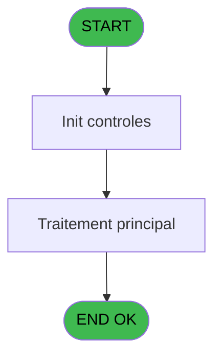

# PBP IDE 385 - Impression Anniversaires GO

> **Analyse**: Phases 1-4 2026-02-03 16:43 -> 16:43 (16s) | Assemblage 16:43
> **Pipeline**: V7.2 Enrichi
> **Structure**: 4 onglets (Resume | Ecrans | Donnees | Connexions)

<!-- TAB:Resume -->

## 1. FICHE D'IDENTITE

| Attribut | Valeur |
|----------|--------|
| Projet | PBP |
| IDE Position | 385 |
| Nom Programme | Impression Anniversaires GO |
| Fichier source | `Prg_385.xml` |
| Dossier IDE | Utilitaires |
| Taches | 2 (0 ecrans visibles) |
| Tables modifiees | 0 |
| Programmes appeles | 1 |

## 2. DESCRIPTION FONCTIONNELLE

**Impression Anniversaires GO** assure la gestion complete de ce processus, accessible depuis [Liste anniversaires GO (IDE 384)](PBP-IDE-384.md).

Le flux de traitement s'organise en **2 blocs fonctionnels** :

- **Calcul** (1 tache) : calculs de montants, stocks ou compteurs
- **Traitement** (1 tache) : traitements metier divers

Detail : phases du traitement

#### Phase 1 : Traitement (1 tache)

- **385** - Veuillez patienter ... **[[ECRAN]](#ecran-t1)**

#### Phase 2 : Calcul (1 tache)

- **385.1** - compte les sans date de naiss

## 3. BLOCS FONCTIONNELS

### 3.1 Traitement (1 tache)

Traitements internes.

---

#### 385 - Veuillez patienter ... [[ECRAN]](#ecran-t1)

**Role** : Traitement : Veuillez patienter ....
**Ecran** : 424 x 56 DLU (MDI) | [Voir mockup](#ecran-t1)

### 3.2 Calcul (1 tache)

Calculs metier : montants, stocks, compteurs.

---

#### 385.1 - compte les sans date de naiss

**Role** : Traitement : compte les sans date de naiss.
**Variables liees** : G (v.go_date_naissance), A (>DateDebut), B (>DateFin), C (<NbSansDate)

## 5. REGLES METIER

*(Aucune regle metier identifiee)*

## 6. CONTEXTE

- **Appele par**: [Liste anniversaires GO (IDE 384)](PBP-IDE-384.md)
- **Appelle**: 1 programmes | **Tables**: 1 (W:0 R:1 L:0) | **Taches**: 2 | **Expressions**: 45

<!-- TAB:Ecrans -->

## 8. ECRANS

*(Programme sans ecran visible)*

## 9. NAVIGATION

### 9.3 Structure hierarchique (2 taches)

| Position | Tache | Type | Dimensions | Bloc |
|----------|-------|------|------------|------|
| **385.1** | [**Veuillez patienter ...** (385)](#t1) [mockup](#ecran-t1) | MDI | 424x56 | Traitement |
| **385.2** | [**compte les sans date de naiss** (385.1)](#t2) | - | - | Calcul |

### 9.4 Algorigramme

> **Legende**: Vert = START/END OK | Rouge = END KO | Bleu = Decisions
> *Algorigramme auto-genere. Utiliser `/algorigramme` pour une synthese metier detaillee.*

<!-- TAB:Donnees -->

## 10. TABLES

### Tables utilisees (1)

| ID | Nom | Description | Type | R | W | L | Usages |
|----|-----|-------------|------|---|---|---|--------|
| 119 | tables_pays_tel_ |  | DB | R |   |   | 1 |

### Colonnes par table (1 / 1 tables avec colonnes identifiees)

Table 119 - tables_pays_tel_ (R) - 1 usages

| Lettre | Variable | Acces | Type |
|--------|----------|-------|------|
| A | >DateDebut | R | Date |
| B | >DateFin | R | Date |
| C | <NbSansDate | R | Numeric |
| D | w0_Astro | R | Alpha |
| E | w0_Transfert | R | Numeric |
| F | w0_Age | R | Numeric |
| G | v.go_date_naissance | R | Unicode |
| H | v.go_nom | R | Unicode |
| I | v.go_prenom | R | Unicode |
| J | v.heb_nationalite | R | Unicode |
| K | w0_AgeBebe | R | Numeric |
| L | w0_Total | R | Numeric |

## 11. VARIABLES

### 11.1 Variables de session (4)

Variables persistantes pendant toute la session.

| Lettre | Nom | Type | Usage dans |
|--------|-----|------|-----------|
| G | v.go_date_naissance | Unicode | - |
| H | v.go_nom | Unicode | - |
| I | v.go_prenom | Unicode | 4x session |
| J | v.heb_nationalite | Unicode | - |

### 11.2 Autres (8)

Variables diverses.

| Lettre | Nom | Type | Usage dans |
|--------|-----|------|-----------|
| A | >DateDebut | Date | 4x refs |
| B | >DateFin | Date | 3x refs |
| C | <NbSansDate | Numeric | - |
| D | w0_Astro | Alpha | - |
| E | w0_Transfert | Numeric | 12x refs |
| F | w0_Age | Numeric | 1x refs |
| K | w0_AgeBebe | Numeric | - |
| L | w0_Total | Numeric | - |

## 12. EXPRESSIONS

**45 / 45 expressions decodees (100%)**

### 12.1 Repartition par type

| Type | Expressions | Regles |
|------|-------------|--------|
| CALCULATION | 2 | 0 |
| CONCATENATION | 3 | 0 |
| CONSTANTE | 1 | 0 |
| DATE | 3 | 0 |
| CONDITION | 17 | 0 |
| FORMAT | 2 | 0 |
| OTHER | 17 | 0 |

### 12.2 Expressions cles par type

#### CALCULATION (2 expressions)

| Type | IDE | Expression | Regle |
|------|-----|------------|-------|
| CALCULATION | 31 | `[AJ]+1` | - |
| CALCULATION | 29 | `w0_Age [F]+1` | - |

#### CONCATENATION (3 expressions)

| Type | IDE | Expression | Regle |
|------|-----|------------|-------|
| CONCATENATION | 37 | `MlsTrans ('Edition anniversaires du')&' '&DStr (>DateDebut [A],'DD/MM/YYYY')&' '&MlsTrans ('au')&' '&DStr (>DateFin [B],'DD/MM/YYYY')&' GO'` | - |
| CONCATENATION | 36 | `MlsTrans ('Edition du')&' '&DStr (Date (),'DD/MM/YYYY')&' '&MlsTrans ('à')&' '&TStr (Time (),'HH:MM:SS')` | - |
| CONCATENATION | 38 | `'- '&Str (Page (0,1),'3P0Z0')&' -'` | - |

#### CONSTANTE (1 expressions)

| Type | IDE | Expression | Regle |
|------|-----|------------|-------|
| CONSTANTE | 34 | `'VBEBE'` | - |

#### DATE (3 expressions)

| Type | IDE | Expression | Regle |
|------|-----|------------|-------|
| DATE | 43 | `DVal(v.go_prenom [I],'YYYYMMDD')` | - |
| DATE | 28 | `Year (Date ())-Year (DVal(v.go_prenom [I],'YYYYMMDD'))` | - |
| DATE | 3 | `Month (DVal(v.go_prenom [I],'YYYYMMDD'))*100+Day (DVal(v.go_prenom [I],'YYYYMMDD'))` | - |

#### CONDITION (17 expressions)

| Type | IDE | Expression | Regle |
|------|-----|------------|-------|
| CONDITION | 26 | `w0_Transfert [E]>=120 AND w0_Transfert [E]<=219` | - |
| CONDITION | 27 | `w0_Transfert [E]>=220 AND w0_Transfert [E]<=320` | - |
| CONDITION | 24 | `w0_Transfert [E]>=1123 AND w0_Transfert [E]<=1220` | - |
| CONDITION | 25 | `w0_Transfert [E]>=1221 AND w0_Transfert [E]<=1231 OR w0_Transfert [E]>=101 AND w0_Transfert [E]<=119` | - |
| CONDITION | 39 | `INIGet ('[MAGIC_LOGICAL_NAMES]preview')='O'` | - |
| ... | | *+12 autres* | |

#### FORMAT (2 expressions)

| Type | IDE | Expression | Regle |
|------|-----|------------|-------|
| FORMAT | 41 | `DStr(>DateFin [B],'YYYYMMDD')` | - |
| FORMAT | 40 | `DStr(>DateDebut [A],'YYYYMMDD')` | - |

#### OTHER (17 expressions)

| Type | IDE | Expression | Regle |
|------|-----|------------|-------|
| OTHER | 13 | `MlsTrans ('CAPRICORNE')` | - |
| OTHER | 14 | `MlsTrans ('VERSEAU')` | - |
| OTHER | 11 | `MlsTrans ('SCORPION')` | - |
| OTHER | 12 | `MlsTrans ('SAGITTAIRE')` | - |
| OTHER | 42 | `GetParam('SOCIETE')` | - |
| ... | | *+12 autres* | |

### 12.3 Toutes les expressions (45)

Voir les 45 expressions

#### CALCULATION (2)

| IDE | Expression Decodee |
|-----|-------------------|
| 29 | `w0_Age [F]+1` |
| 31 | `[AJ]+1` |

#### CONCATENATION (3)

| IDE | Expression Decodee |
|-----|-------------------|
| 38 | `'- '&Str (Page (0,1),'3P0Z0')&' -'` |
| 36 | `MlsTrans ('Edition du')&' '&DStr (Date (),'DD/MM/YYYY')&' '&MlsTrans ('à')&' '&TStr (Time (),'HH:MM:SS')` |
| 37 | `MlsTrans ('Edition anniversaires du')&' '&DStr (>DateDebut [A],'DD/MM/YYYY')&' '&MlsTrans ('au')&' '&DStr (>DateFin [B],'DD/MM/YYYY')&' GO'` |

#### CONSTANTE (1)

| IDE | Expression Decodee |
|-----|-------------------|
| 34 | `'VBEBE'` |

#### DATE (3)

| IDE | Expression Decodee |
|-----|-------------------|
| 3 | `Month (DVal(v.go_prenom [I],'YYYYMMDD'))*100+Day (DVal(v.go_prenom [I],'YYYYMMDD'))` |
| 28 | `Year (Date ())-Year (DVal(v.go_prenom [I],'YYYYMMDD'))` |
| 43 | `DVal(v.go_prenom [I],'YYYYMMDD')` |

#### CONDITION (17)

| IDE | Expression Decodee |
|-----|-------------------|
| 30 | `Year (>DateDebut [A])<Year (>DateFin [B]) AND Year (DVal(v.go_prenom [I],'YYYYMMDD'))=Year (>DateFin [B])` |
| 16 | `w0_Transfert [E]>=321 AND w0_Transfert [E]<=420` |
| 17 | `w0_Transfert [E]>=421 AND w0_Transfert [E]<=520` |
| 18 | `w0_Transfert [E]>=521 AND w0_Transfert [E]<=620` |
| 19 | `w0_Transfert [E]>=621 AND w0_Transfert [E]<=721` |
| 20 | `w0_Transfert [E]>=722 AND w0_Transfert [E]<=821` |
| 21 | `w0_Transfert [E]>=822 AND w0_Transfert [E]<=922` |
| 22 | `w0_Transfert [E]>=923 AND w0_Transfert [E]<=1022` |
| 23 | `w0_Transfert [E]>=1023 AND w0_Transfert [E]<=1122` |
| 24 | `w0_Transfert [E]>=1123 AND w0_Transfert [E]<=1220` |
| 25 | `w0_Transfert [E]>=1221 AND w0_Transfert [E]<=1231 OR w0_Transfert [E]>=101 AND w0_Transfert [E]<=119` |
| 26 | `w0_Transfert [E]>=120 AND w0_Transfert [E]<=219` |
| 27 | `w0_Transfert [E]>=220 AND w0_Transfert [E]<=320` |
| 32 | `[AJ]>0` |
| 33 | `[AJ]=0` |
| 39 | `INIGet ('[MAGIC_LOGICAL_NAMES]preview')='O'` |
| 45 | `>DateDebut [A]` |

#### FORMAT (2)

| IDE | Expression Decodee |
|-----|-------------------|
| 40 | `DStr(>DateDebut [A],'YYYYMMDD')` |
| 41 | `DStr(>DateFin [B],'YYYYMMDD')` |

#### OTHER (17)

| IDE | Expression Decodee |
|-----|-------------------|
| 1 | `[BU]` |
| 2 | `GetParam ('LANGUE')` |
| 4 | `MlsTrans ('BELIER')` |
| 5 | `MlsTrans ('TAUREAU')` |
| 6 | `MlsTrans ('GEMEAUX')` |
| 7 | `MlsTrans ('CANCER')` |
| 8 | `MlsTrans ('LION')` |
| 9 | `MlsTrans ('VIERGE')` |
| 10 | `MlsTrans ('BALANCE')` |
| 11 | `MlsTrans ('SCORPION')` |
| 12 | `MlsTrans ('SAGITTAIRE')` |
| 13 | `MlsTrans ('CAPRICORNE')` |
| 14 | `MlsTrans ('VERSEAU')` |
| 15 | `MlsTrans ('POISSONS')` |
| 35 | `'Village '&GetParam ('VILLAGE')` |
| 42 | `GetParam('SOCIETE')` |
| 44 | `GetParam('SOCIETE')` |

<!-- TAB:Connexions -->

## 13. GRAPHE D'APPELS

### 13.1 Chaine depuis Main (Callers)

Main -> ... -> [Liste anniversaires GO (IDE 384)](PBP-IDE-384.md) -> **Impression Anniversaires GO (IDE 385)**

### 13.2 Callers

| IDE | Nom Programme | Nb Appels |
|-----|---------------|-----------|
| [384](PBP-IDE-384.md) | Liste anniversaires GO | 1 |

### 13.3 Callees (programmes appeles)

### 13.4 Detail Callees avec contexte

| IDE | Nom Programme | Appels | Contexte |
|-----|---------------|--------|----------|
| [307](PBP-IDE-307.md) | Recherche age Bebe_Enfant | 1 | Sous-programme |

## 14. RECOMMANDATIONS MIGRATION

### 14.1 Profil du programme

| Metrique | Valeur | Impact migration |
|----------|--------|-----------------|
| Lignes de logique | 51 | Programme compact |
| Expressions | 45 | Peu de logique |
| Tables WRITE | 0 | Impact faible |
| Sous-programmes | 1 | Peu de dependances |
| Ecrans visibles | 0 | Ecran unique ou traitement batch |
| Code desactive | 0% (0 / 51) | Code sain |
| Regles metier | 0 | Pas de regle identifiee |

### 14.2 Plan de migration par bloc

#### Traitement (1 tache: 1 ecran, 0 traitement)

- **Strategie** : 1 composant(s) UI (Razor/React) avec formulaires et validation.
- 1 sous-programme(s) a migrer ou a reutiliser depuis les services existants.
- Decomposer les taches en services unitaires testables.

#### Calcul (1 tache: 0 ecran, 1 traitement)

- **Strategie** : Services de calcul purs (Domain Services).
- Migrer la logique de calcul (stock, compteurs, montants)

### 14.3 Dependances critiques

| Dependance | Type | Appels | Impact |
|------------|------|--------|--------|
| [Recherche age Bebe_Enfant (IDE 307)](PBP-IDE-307.md) | Sous-programme | 1x | Normale - Sous-programme |

---
*Spec DETAILED generee par Pipeline V7.2 - 2026-02-03 16:43*
