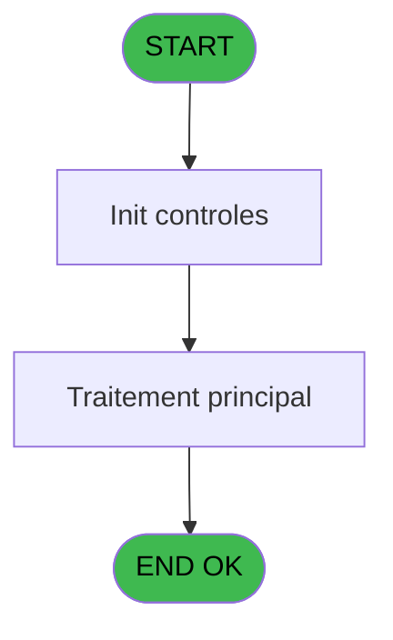
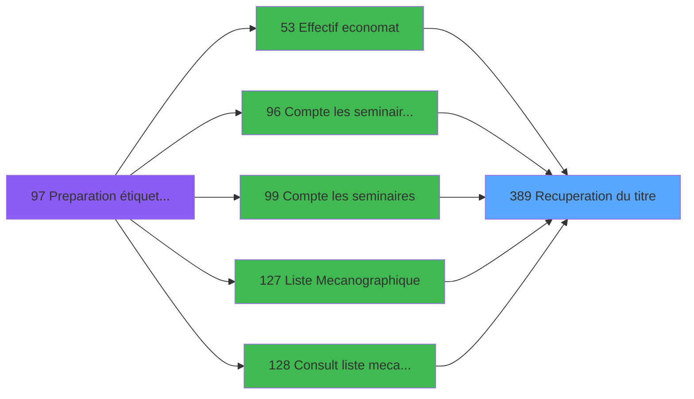

# PBP IDE 389 - Recuperation du titre

> **Analyse**: Phases 1-4 2026-02-03 16:45 -> 16:45 (17s) | Assemblage 16:45
> **Pipeline**: V7.2 Enrichi
> **Structure**: 4 onglets (Resume | Ecrans | Donnees | Connexions)

<!-- TAB:Resume -->

## 1. FICHE D'IDENTITE

| Attribut | Valeur |
|----------|--------|
| Projet | PBP |
| IDE Position | 389 |
| Nom Programme | Recuperation du titre |
| Fichier source | `Prg_389.xml` |
| Dossier IDE | Utilitaires |
| Taches | 1 (0 ecrans visibles) |
| Tables modifiees | 0 |
| Programmes appeles | 0 |

## 2. DESCRIPTION FONCTIONNELLE

**Recuperation du titre** assure la gestion complete de ce processus, accessible depuis [Compte les seminaires(Chambre) (IDE 96)](PBP-IDE-96.md), [Compte les seminaires (IDE 99)](PBP-IDE-99.md), [  Consult liste mecano ecran (IDE 128)](PBP-IDE-128.md), [  Visu plan GO (IDE 131)](PBP-IDE-131.md), [Service GO (IDE 133)](PBP-IDE-133.md), [  Visu service GO (IDE 134)](PBP-IDE-134.md), [  Affich arrivant planning GM (IDE 158)](PBP-IDE-158.md), [  Affich present planning GM (IDE 164)](PBP-IDE-164.md), [  Affich depart comptage GM (IDE 170)](PBP-IDE-170.md), [  Affichage AVPBDR toutes GM (IDE 175)](PBP-IDE-175.md), [  Affichage AVPBDR Standard (IDE 177)](PBP-IDE-177.md), [  Affichage AVPBDR secretaire (IDE 179)](PBP-IDE-179.md), [  Affichage bat/fiche police (IDE 181)](PBP-IDE-181.md), [  Affichage depart circuit (IDE 183)](PBP-IDE-183.md), [Affich present planning GM CL (IDE 250)](PBP-IDE-250.md), [  Affiche liste logement (IDE 259)](PBP-IDE-259.md), [Effectif economat (IDE 53)](PBP-IDE-53.md), [Liste Mecanographique (IDE 127)](PBP-IDE-127.md), [Planning GO (IDE 130)](PBP-IDE-130.md), [Liste occupation (IDE 136)](PBP-IDE-136.md).

Le flux de traitement s'organise en **1 blocs fonctionnels** :

- **Traitement** (1 tache) : traitements metier divers

## 3. BLOCS FONCTIONNELS

### 3.1 Traitement (1 tache)

Traitements internes.

---

#### 389 - Recuperation du titre

**Role** : Consultation/chargement : Recuperation du titre.

## 5. REGLES METIER

*(Aucune regle metier identifiee)*

## 6. CONTEXTE

- **Appele par**: [Compte les seminaires(Chambre) (IDE 96)](PBP-IDE-96.md), [Compte les seminaires (IDE 99)](PBP-IDE-99.md), [  Consult liste mecano ecran (IDE 128)](PBP-IDE-128.md), [  Visu plan GO (IDE 131)](PBP-IDE-131.md), [Service GO (IDE 133)](PBP-IDE-133.md), [  Visu service GO (IDE 134)](PBP-IDE-134.md), [  Affich arrivant planning GM (IDE 158)](PBP-IDE-158.md), [  Affich present planning GM (IDE 164)](PBP-IDE-164.md), [  Affich depart comptage GM (IDE 170)](PBP-IDE-170.md), [  Affichage AVPBDR toutes GM (IDE 175)](PBP-IDE-175.md), [  Affichage AVPBDR Standard (IDE 177)](PBP-IDE-177.md), [  Affichage AVPBDR secretaire (IDE 179)](PBP-IDE-179.md), [  Affichage bat/fiche police (IDE 181)](PBP-IDE-181.md), [  Affichage depart circuit (IDE 183)](PBP-IDE-183.md), [Affich present planning GM CL (IDE 250)](PBP-IDE-250.md), [  Affiche liste logement (IDE 259)](PBP-IDE-259.md), [Effectif economat (IDE 53)](PBP-IDE-53.md), [Liste Mecanographique (IDE 127)](PBP-IDE-127.md), [Planning GO (IDE 130)](PBP-IDE-130.md), [Liste occupation (IDE 136)](PBP-IDE-136.md)
- **Appelle**: 0 programmes | **Tables**: 1 (W:0 R:1 L:0) | **Taches**: 1 | **Expressions**: 4

<!-- TAB:Ecrans -->

## 8. ECRANS

*(Programme sans ecran visible)*

## 9. NAVIGATION

### 9.3 Structure hierarchique (1 tache)

| Position | Tache | Type | Dimensions | Bloc |
|----------|-------|------|------------|------|
| **389.1** | [**Recuperation du titre** (389)](#t1) | MDI | - | Traitement |

### 9.4 Algorigramme

> **Legende**: Vert = START/END OK | Rouge = END KO | Bleu = Decisions
> *Algorigramme auto-genere. Utiliser `/algorigramme` pour une synthese metier detaillee.*

<!-- TAB:Donnees -->

## 10. TABLES

### Tables utilisees (1)

| ID | Nom | Description | Type | R | W | L | Usages |
|----|-----|-------------|------|---|---|---|--------|
| 719 | arc_transac_detail_bar |  | DB | R |   |   | 1 |

### Colonnes par table (1 / 1 tables avec colonnes identifiees)

Table 719 - arc_transac_detail_bar (R) - 1 usages

| Lettre | Variable | Acces | Type |
|--------|----------|-------|------|
| A | > code ecran | R | Numeric |
| B | < nom ecran | R | Alpha |

## 11. VARIABLES

### 11.1 Autres (2)

Variables diverses.

| Lettre | Nom | Type | Usage dans |
|--------|-----|------|-----------|
| A | > code ecran | Numeric | 1x refs |
| B | < nom ecran | Alpha | - |

## 12. EXPRESSIONS

**4 / 4 expressions decodees (100%)**

### 12.1 Repartition par type

| Type | Expressions | Regles |
|------|-------------|--------|
| CONCATENATION | 1 | 0 |
| CONSTANTE | 1 | 0 |
| OTHER | 1 | 0 |
| CONDITION | 1 | 0 |

### 12.2 Expressions cles par type

#### CONCATENATION (1 expressions)

| Type | IDE | Expression | Regle |
|------|-----|------------|-------|
| CONCATENATION | 4 | `Trim ([F])&' - '&Trim ([G])` | - |

#### CONSTANTE (1 expressions)

| Type | IDE | Expression | Regle |
|------|-----|------------|-------|
| CONSTANTE | 3 | `'PP'` | - |

#### OTHER (1 expressions)

| Type | IDE | Expression | Regle |
|------|-----|------------|-------|
| OTHER | 1 | `GetParam ('CODELANGUE')` | - |

#### CONDITION (1 expressions)

| Type | IDE | Expression | Regle |
|------|-----|------------|-------|
| CONDITION | 2 | `> code ecran [A]` | - |

<!-- TAB:Connexions -->

## 13. GRAPHE D'APPELS

### 13.1 Chaine depuis Main (Callers)

Main -> ... -> [Compte les seminaires(Chambre) (IDE 96)](PBP-IDE-96.md) -> **Recuperation du titre (IDE 389)**

Main -> ... -> [Compte les seminaires (IDE 99)](PBP-IDE-99.md) -> **Recuperation du titre (IDE 389)**

Main -> ... -> [  Consult liste mecano ecran (IDE 128)](PBP-IDE-128.md) -> **Recuperation du titre (IDE 389)**

Main -> ... -> [  Visu plan GO (IDE 131)](PBP-IDE-131.md) -> **Recuperation du titre (IDE 389)**

Main -> ... -> [Service GO (IDE 133)](PBP-IDE-133.md) -> **Recuperation du titre (IDE 389)**

Main -> ... -> [  Visu service GO (IDE 134)](PBP-IDE-134.md) -> **Recuperation du titre (IDE 389)**

Main -> ... -> [  Affich arrivant planning GM (IDE 158)](PBP-IDE-158.md) -> **Recuperation du titre (IDE 389)**

Main -> ... -> [  Affich present planning GM (IDE 164)](PBP-IDE-164.md) -> **Recuperation du titre (IDE 389)**

Main -> ... -> [  Affich depart comptage GM (IDE 170)](PBP-IDE-170.md) -> **Recuperation du titre (IDE 389)**

Main -> ... -> [  Affichage AVPBDR toutes GM (IDE 175)](PBP-IDE-175.md) -> **Recuperation du titre (IDE 389)**

Main -> ... -> [  Affichage AVPBDR Standard (IDE 177)](PBP-IDE-177.md) -> **Recuperation du titre (IDE 389)**

Main -> ... -> [  Affichage AVPBDR secretaire (IDE 179)](PBP-IDE-179.md) -> **Recuperation du titre (IDE 389)**

Main -> ... -> [  Affichage bat/fiche police (IDE 181)](PBP-IDE-181.md) -> **Recuperation du titre (IDE 389)**

Main -> ... -> [  Affichage depart circuit (IDE 183)](PBP-IDE-183.md) -> **Recuperation du titre (IDE 389)**

Main -> ... -> [Affich present planning GM CL (IDE 250)](PBP-IDE-250.md) -> **Recuperation du titre (IDE 389)**

Main -> ... -> [  Affiche liste logement (IDE 259)](PBP-IDE-259.md) -> **Recuperation du titre (IDE 389)**

Main -> ... -> [Effectif economat (IDE 53)](PBP-IDE-53.md) -> **Recuperation du titre (IDE 389)**

Main -> ... -> [Liste Mecanographique (IDE 127)](PBP-IDE-127.md) -> **Recuperation du titre (IDE 389)**

Main -> ... -> [Planning GO (IDE 130)](PBP-IDE-130.md) -> **Recuperation du titre (IDE 389)**

Main -> ... -> [Liste occupation (IDE 136)](PBP-IDE-136.md) -> **Recuperation du titre (IDE 389)**

### 13.2 Callers

| IDE | Nom Programme | Nb Appels |
|-----|---------------|-----------|
| [96](PBP-IDE-96.md) | Compte les seminaires(Chambre) | 2 |
| [99](PBP-IDE-99.md) | Compte les seminaires | 2 |
| [128](PBP-IDE-128.md) |   Consult liste mecano ecran | 2 |
| [131](PBP-IDE-131.md) |   Visu plan GO | 2 |
| [133](PBP-IDE-133.md) | Service GO | 2 |
| [134](PBP-IDE-134.md) |   Visu service GO | 2 |
| [158](PBP-IDE-158.md) |   Affich arrivant planning GM | 2 |
| [164](PBP-IDE-164.md) |   Affich present planning GM | 2 |
| [170](PBP-IDE-170.md) |   Affich depart comptage GM | 2 |
| [175](PBP-IDE-175.md) |   Affichage AVPBDR toutes GM | 2 |
| [177](PBP-IDE-177.md) |   Affichage AVPBDR Standard | 2 |
| [179](PBP-IDE-179.md) |   Affichage AVPBDR secretaire | 2 |
| [181](PBP-IDE-181.md) |   Affichage bat/fiche police | 2 |
| [183](PBP-IDE-183.md) |   Affichage depart circuit | 2 |
| [250](PBP-IDE-250.md) | Affich present planning GM CL | 2 |
| [259](PBP-IDE-259.md) |   Affiche liste logement | 2 |
| [53](PBP-IDE-53.md) | Effectif economat | 1 |
| [127](PBP-IDE-127.md) | Liste Mecanographique | 1 |
| [130](PBP-IDE-130.md) | Planning GO | 1 |
| [136](PBP-IDE-136.md) | Liste occupation | 1 |

### 13.3 Callees (programmes appeles)

### 13.4 Detail Callees avec contexte

| IDE | Nom Programme | Appels | Contexte |
|-----|---------------|--------|----------|
| - | (aucun) | - | - |

## 14. RECOMMANDATIONS MIGRATION

### 14.1 Profil du programme

| Metrique | Valeur | Impact migration |
|----------|--------|-----------------|
| Lignes de logique | 12 | Programme compact |
| Expressions | 4 | Peu de logique |
| Tables WRITE | 0 | Impact faible |
| Sous-programmes | 0 | Peu de dependances |
| Ecrans visibles | 0 | Ecran unique ou traitement batch |
| Code desactive | 0% (0 / 12) | Code sain |
| Regles metier | 0 | Pas de regle identifiee |

### 14.2 Plan de migration par bloc

#### Traitement (1 tache: 0 ecran, 1 traitement)

- **Strategie** : 1 service(s) backend injectable(s) (Domain Services).
- Decomposer les taches en services unitaires testables.

### 14.3 Dependances critiques

| Dependance | Type | Appels | Impact |
|------------|------|--------|--------|

---
*Spec DETAILED generee par Pipeline V7.2 - 2026-02-03 16:45*
