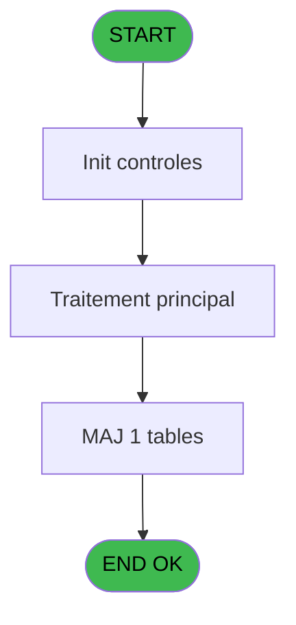
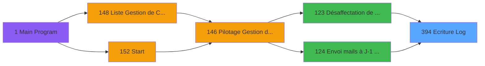

# PBP IDE 394 - Ecriture Log

> **Analyse**: Phases 1-4 2026-02-03 16:47 -> 16:47 (17s) | Assemblage 16:47
> **Pipeline**: V7.2 Enrichi
> **Structure**: 4 onglets (Resume | Ecrans | Donnees | Connexions)

<!-- TAB:Resume -->

## 1. FICHE D'IDENTITE

| Attribut | Valeur |
|----------|--------|
| Projet | PBP |
| IDE Position | 394 |
| Nom Programme | Ecriture Log |
| Fichier source | `Prg_394.xml` |
| Dossier IDE | Utilitaires |
| Taches | 1 (0 ecrans visibles) |
| Tables modifiees | 1 |
| Programmes appeles | 0 |

## 2. DESCRIPTION FONCTIONNELLE

**Ecriture Log** assure la gestion complete de ce processus, accessible depuis [Désaffectation de Garantie (IDE 123)](PBP-IDE-123.md), [Envoi mails à J-1 avant desact (IDE 124)](PBP-IDE-124.md).

Le flux de traitement s'organise en **1 blocs fonctionnels** :

- **Traitement** (1 tache) : traitements metier divers

**Donnees modifiees** : 1 tables en ecriture (Table_988).

## 3. BLOCS FONCTIONNELS

### 3.1 Traitement (1 tache)

Traitements internes.

---

#### 394 - Ecriture Log

**Role** : Traitement : Ecriture Log.

## 5. REGLES METIER

*(Aucune regle metier identifiee)*

## 6. CONTEXTE

- **Appele par**: [Désaffectation de Garantie (IDE 123)](PBP-IDE-123.md), [Envoi mails à J-1 avant desact (IDE 124)](PBP-IDE-124.md)
- **Appelle**: 0 programmes | **Tables**: 1 (W:1 R:0 L:0) | **Taches**: 1 | **Expressions**: 12

<!-- TAB:Ecrans -->

## 8. ECRANS

*(Programme sans ecran visible)*

## 9. NAVIGATION

### 9.3 Structure hierarchique (1 tache)

| Position | Tache | Type | Dimensions | Bloc |
|----------|-------|------|------------|------|
| **394.1** | [**Ecriture Log** (394)](#t1) | - | - | Traitement |

### 9.4 Algorigramme

> **Legende**: Vert = START/END OK | Rouge = END KO | Bleu = Decisions
> *Algorigramme auto-genere. Utiliser `/algorigramme` pour une synthese metier detaillee.*

<!-- TAB:Donnees -->

## 10. TABLES

### Tables utilisees (1)

| ID | Nom | Description | Type | R | W | L | Usages |
|----|-----|-------------|------|---|---|---|--------|
| 988 | Table_988 |  | MEM |   | **W** |   | 1 |

### Colonnes par table (1 / 1 tables avec colonnes identifiees)

Table 988 - Table_988 (**W**) - 1 usages

| Lettre | Variable | Acces | Type |
|--------|----------|-------|------|
| A | P.Code Traitement | W | Unicode |
| B | P.Date Debut | W | Date |
| C | P.Heure Debut | W | Time |
| D | P.Date Fin | W | Date |
| E | P.Heure Fin | W | Time |
| F | P.Statut Traitement | W | Logical |
| G | P.Num 01 | W | Numeric |
| H | P.Num 02 | W | Numeric |
| I | P.Num 03 | W | Numeric |
| J | P.Num 04 | W | Numeric |
| K | P.Num 05 | W | Numeric |
| L | P.Commentaire | W | Unicode |

## 11. VARIABLES

### 11.1 Parametres entrants (12)

Variables recues du programme appelant ([Désaffectation de Garantie (IDE 123)](PBP-IDE-123.md)).

| Lettre | Nom | Type | Usage dans |
|--------|-----|------|-----------|
| A | P.Code Traitement | Unicode | 1x parametre entrant |
| B | P.Date Debut | Date | 1x parametre entrant |
| C | P.Heure Debut | Time | 1x parametre entrant |
| D | P.Date Fin | Date | 1x parametre entrant |
| E | P.Heure Fin | Time | 1x parametre entrant |
| F | P.Statut Traitement | Logical | 1x parametre entrant |
| G | P.Num 01 | Numeric | 1x parametre entrant |
| H | P.Num 02 | Numeric | 1x parametre entrant |
| I | P.Num 03 | Numeric | - |
| J | P.Num 04 | Numeric | 1x parametre entrant |
| K | P.Num 05 | Numeric | 1x parametre entrant |
| L | P.Commentaire | Unicode | 1x parametre entrant |

## 12. EXPRESSIONS

**12 / 12 expressions decodees (100%)**

### 12.1 Repartition par type

| Type | Expressions | Regles |
|------|-------------|--------|
| OTHER | 12 | 0 |

### 12.2 Expressions cles par type

#### OTHER (12 expressions)

| Type | IDE | Expression | Regle |
|------|-----|------------|-------|
| OTHER | 9 | `P.Num 05 [K]` | - |
| OTHER | 8 | `P.Num 04 [J]` | - |
| OTHER | 7 | `P.Num 01 [G]` | - |
| OTHER | 12 | `[M]` | - |
| OTHER | 11 | `P.Num 02 [H]` | - |
| ... | | *+7 autres* | |

<!-- TAB:Connexions -->

## 13. GRAPHE D'APPELS

### 13.1 Chaine depuis Main (Callers)

Main -> ... -> [Désaffectation de Garantie (IDE 123)](PBP-IDE-123.md) -> **Ecriture Log (IDE 394)**

Main -> ... -> [Envoi mails à J-1 avant desact (IDE 124)](PBP-IDE-124.md) -> **Ecriture Log (IDE 394)**

### 13.2 Callers

| IDE | Nom Programme | Nb Appels |
|-----|---------------|-----------|
| [123](PBP-IDE-123.md) | Désaffectation de Garantie | 1 |
| [124](PBP-IDE-124.md) | Envoi mails à J-1 avant desact | 1 |

### 13.3 Callees (programmes appeles)

### 13.4 Detail Callees avec contexte

| IDE | Nom Programme | Appels | Contexte |
|-----|---------------|--------|----------|
| - | (aucun) | - | - |

## 14. RECOMMANDATIONS MIGRATION

### 14.1 Profil du programme

| Metrique | Valeur | Impact migration |
|----------|--------|-----------------|
| Lignes de logique | 37 | Programme compact |
| Expressions | 12 | Peu de logique |
| Tables WRITE | 1 | Impact faible |
| Sous-programmes | 0 | Peu de dependances |
| Ecrans visibles | 0 | Ecran unique ou traitement batch |
| Code desactive | 0% (0 / 37) | Code sain |
| Regles metier | 0 | Pas de regle identifiee |

### 14.2 Plan de migration par bloc

#### Traitement (1 tache: 0 ecran, 1 traitement)

- **Strategie** : 1 service(s) backend injectable(s) (Domain Services).
- Decomposer les taches en services unitaires testables.

### 14.3 Dependances critiques

| Dependance | Type | Appels | Impact |
|------------|------|--------|--------|
| Table_988 | Table WRITE (Memory) | 1x | Schema + repository |

---
*Spec DETAILED generee par Pipeline V7.2 - 2026-02-03 16:47*
