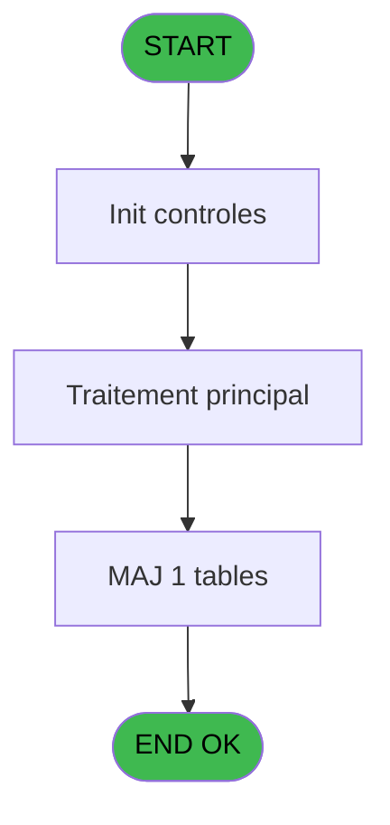

# PBP IDE 395 - Extraction pour DGSN

> **Analyse**: Phases 1-4 2026-02-03 16:47 -> 16:47 (18s) | Assemblage 16:47
> **Pipeline**: V7.2 Enrichi
> **Structure**: 4 onglets (Resume | Ecrans | Donnees | Connexions)

<!-- TAB:Resume -->

## 1. FICHE D'IDENTITE

| Attribut | Valeur |
|----------|--------|
| Projet | PBP |
| IDE Position | 395 |
| Nom Programme | Extraction pour DGSN |
| Fichier source | `Prg_395.xml` |
| Dossier IDE | Utilitaires |
| Taches | 2 (1 ecrans visibles) |
| Tables modifiees | 1 |
| Programmes appeles | 0 |
| :warning: Statut | **ORPHELIN_POTENTIEL** |

## 2. DESCRIPTION FONCTIONNELLE

**Extraction pour DGSN** assure la gestion complete de ce processus.

Le flux de traitement s'organise en **1 blocs fonctionnels** :

- **Traitement** (2 taches) : traitements metier divers

**Donnees modifiees** : 1 tables en ecriture (table_utilisateurs).

**Logique metier** : 2 regles identifiees couvrant conditions metier, valeurs par defaut.

## 3. BLOCS FONCTIONNELS

### 3.1 Traitement (2 taches)

Traitements internes.

---

#### 395 - Extraction DGSN [[ECRAN]](#ecran-t1)

**Role** : Traitement : Extraction DGSN.
**Ecran** : 928 x 160 DLU (MDI) | [Voir mockup](#ecran-t1)
**Variables liees** : K (v.Liste Pays DGSN)

---

#### 395.1 - Count

**Role** : Traitement : Count.

## 5. REGLES METIER

2 regles identifiees:

### Autres (2 regles)

#### [RM-001] Valeur par defaut si [AI] est vide

| Element | Detail |
|---------|--------|
| **Condition** | `[AI]=''` |
| **Si vrai** | '' |
| **Si faux** | RTrim([AI]) & ASCIIChr (13) & ASCIIChr (10)) & ExpCalc('43'EXP) |
| **Expression source** | Expression 19 : `IF([AI]='', '', RTrim([AI]) & ASCIIChr (13) & ASCIIChr (10))` |
| **Exemple** | Si [AI]='' → '' |

#### [RM-002] Si [AE]>0 alors MlsTrans('Fichiers') sinon '')

| Element | Detail |
|---------|--------|
| **Condition** | `[AE]>0` |
| **Si vrai** | MlsTrans('Fichiers') |
| **Si faux** | '') |
| **Expression source** | Expression 41 : `IF([AE]>0, MlsTrans('Fichiers'),'')` |
| **Exemple** | Si [AE]>0 → MlsTrans('Fichiers'). Sinon → '') |

## 6. CONTEXTE

- **Appele par**: (aucun)
- **Appelle**: 0 programmes | **Tables**: 5 (W:1 R:1 L:3) | **Taches**: 2 | **Expressions**: 51

<!-- TAB:Ecrans -->

## 8. ECRANS

### 8.1 Forms visibles (1 / 2)

| # | Position | Tache | Nom | Type | Largeur | Hauteur | Bloc |
|---|----------|-------|-----|------|---------|---------|------|
| 1 | 395 | 395 | Extraction DGSN | MDI | 928 | 160 | Traitement |

### 8.2 Mockups Ecrans

---

#### 395 - Extraction DGSN
**Tache** : [395](#t1) | **Type** : MDI | **Dimensions** : 928 x 160 DLU
**Bloc** : Traitement | **Titre IDE** : Extraction DGSN

<!-- FORM-DATA:
{
    "width":  928,
    "vFactor":  8,
    "type":  "MDI",
    "hFactor":  8,
    "controls":  [
                     {
                         "x":  0,
                         "type":  "label",
                         "var":  "",
                         "y":  0,
                         "w":  922,
                         "fmt":  "",
                         "name":  "",
                         "h":  24,
                         "color":  "",
                         "text":  "",
                         "parent":  null
                     },
                     {
                         "x":  52,
                         "type":  "label",
                         "var":  "",
                         "y":  24,
                         "w":  662,
                         "fmt":  "",
                         "name":  "",
                         "h":  103,
                         "color":  "",
                         "text":  "",
                         "parent":  null
                     },
                     {
                         "x":  727,
                         "type":  "label",
                         "var":  "",
                         "y":  24,
                         "w":  186,
                         "fmt":  "",
                         "name":  "",
                         "h":  103,
                         "color":  "",
                         "text":  "",
                         "parent":  null
                     },
                     {
                         "x":  62,
                         "type":  "label",
                         "var":  "",
                         "y":  67,
                         "w":  46,
                         "fmt":  "",
                         "name":  "",
                         "h":  10,
                         "color":  "",
                         "text":  "Du",
                         "parent":  5
                     },
                     {
                         "x":  62,
                         "type":  "label",
                         "var":  "",
                         "y":  113,
                         "w":  45,
                         "fmt":  "",
                         "name":  "",
                         "h":  8,
                         "color":  "",
                         "text":  "Time",
                         "parent":  5
                     },
                     {
                         "x":  0,
                         "type":  "label",
                         "var":  "",
                         "y":  134,
                         "w":  922,
                         "fmt":  "",
                         "name":  "",
                         "h":  24,
                         "color":  "",
                         "text":  "",
                         "parent":  null
                     },
                     {
                         "x":  324,
                         "type":  "label",
                         "var":  "",
                         "y":  67,
                         "w":  45,
                         "fmt":  "",
                         "name":  "",
                         "h":  10,
                         "color":  "",
                         "text":  "Au",
                         "parent":  5
                     },
                     {
                         "x":  62,
                         "type":  "label",
                         "var":  "",
                         "y":  33,
                         "w":  215,
                         "fmt":  "",
                         "name":  "",
                         "h":  10,
                         "color":  "",
                         "text":  "Répertoire de destination",
                         "parent":  5
                     },
                     {
                         "x":  62,
                         "type":  "label",
                         "var":  "",
                         "y":  49,
                         "w":  114,
                         "fmt":  "",
                         "name":  "",
                         "h":  10,
                         "color":  "",
                         "text":  "Extractions",
                         "parent":  5
                     },
                     {
                         "x":  286,
                         "type":  "edit",
                         "var":  "",
                         "y":  33,
                         "w":  360,
                         "fmt":  "",
                         "name":  "tut_repertoire_export",
                         "h":  10,
                         "color":  "",
                         "text":  "",
                         "parent":  5
                     },
                     {
                         "x":  659,
                         "type":  "button",
                         "var":  "",
                         "y":  34,
                         "w":  33,
                         "fmt":  "...",
                         "name":  "b_Choix répertoire_0001",
                         "h":  10,
                         "color":  "",
                         "text":  "",
                         "parent":  5
                     },
                     {
                         "x":  131,
                         "type":  "edit",
                         "var":  "",
                         "y":  67,
                         "w":  126,
                         "fmt":  "DD/MM/YYYY",
                         "name":  "w0_DateMin",
                         "h":  10,
                         "color":  "110",
                         "text":  "",
                         "parent":  5
                     },
                     {
                         "x":  267,
                         "type":  "button",
                         "var":  "",
                         "y":  67,
                         "w":  33,
                         "fmt":  "...",
                         "name":  "b_DateMin",
                         "h":  10,
                         "color":  "",
                         "text":  "",
                         "parent":  5
                     },
                     {
                         "x":  393,
                         "type":  "edit",
                         "var":  "",
                         "y":  67,
                         "w":  126,
                         "fmt":  "DD/MM/YYYY",
                         "name":  "w0_DateMax",
                         "h":  10,
                         "color":  "110",
                         "text":  "",
                         "parent":  5
                     },
                     {
                         "x":  529,
                         "type":  "button",
                         "var":  "",
                         "y":  67,
                         "w":  33,
                         "fmt":  "...",
                         "name":  "b_DateMax",
                         "h":  10,
                         "color":  "",
                         "text":  "",
                         "parent":  null
                     },
                     {
                         "x":  131,
                         "type":  "checkbox",
                         "var":  "",
                         "y":  92,
                         "w":  247,
                         "fmt":  "",
                         "name":  "v.Exporter sans CNI",
                         "h":  12,
                         "color":  "",
                         "text":  "Pièce d\u0027identité obligatoire",
                         "parent":  5
                     },
                     {
                         "x":  743,
                         "type":  "button",
                         "var":  "",
                         "y":  105,
                         "w":  154,
                         "fmt":  "\u0026Extraction",
                         "name":  "b_Extraire",
                         "h":  18,
                         "color":  "",
                         "text":  "",
                         "parent":  6
                     },
                     {
                         "x":  131,
                         "type":  "edit",
                         "var":  "",
                         "y":  113,
                         "w":  84,
                         "fmt":  "HH:MMZ",
                         "name":  "w0_DateMax",
                         "h":  10,
                         "color":  "2",
                         "text":  "",
                         "parent":  5
                     },
                     {
                         "x":  8,
                         "type":  "edit",
                         "var":  "",
                         "y":  2,
                         "w":  267,
                         "fmt":  "20",
                         "name":  "",
                         "h":  8,
                         "color":  "",
                         "text":  "",
                         "parent":  1
                     },
                     {
                         "x":  707,
                         "type":  "edit",
                         "var":  "",
                         "y":  8,
                         "w":  203,
                         "fmt":  "WWW DD MMM YYYYT",
                         "name":  "",
                         "h":  8,
                         "color":  "",
                         "text":  "",
                         "parent":  1
                     },
                     {
                         "x":  8,
                         "type":  "edit",
                         "var":  "",
                         "y":  12,
                         "w":  331,
                         "fmt":  "25",
                         "name":  "",
                         "h":  8,
                         "color":  "",
                         "text":  "",
                         "parent":  1
                     },
                     {
                         "x":  763,
                         "type":  "image",
                         "var":  "",
                         "y":  29,
                         "w":  128,
                         "fmt":  "",
                         "name":  "",
                         "h":  56,
                         "color":  "",
                         "text":  "",
                         "parent":  6
                     },
                     {
                         "x":  9,
                         "type":  "button",
                         "var":  "",
                         "y":  137,
                         "w":  154,
                         "fmt":  "\u0026Quitter",
                         "name":  "",
                         "h":  18,
                         "color":  "",
                         "text":  "",
                         "parent":  14
                     },
                     {
                         "x":  176,
                         "type":  "edit",
                         "var":  "",
                         "y":  137,
                         "w":  742,
                         "fmt":  "",
                         "name":  "v.Complément message d\u0027erreur",
                         "h":  10,
                         "color":  "",
                         "text":  "",
                         "parent":  null
                     },
                     {
                         "x":  176,
                         "type":  "edit",
                         "var":  "",
                         "y":  147,
                         "w":  742,
                         "fmt":  "50",
                         "name":  "",
                         "h":  10,
                         "color":  "",
                         "text":  "",
                         "parent":  null
                     },
                     {
                         "x":  286,
                         "type":  "combobox",
                         "var":  "",
                         "y":  49,
                         "w":  112,
                         "fmt":  "",
                         "name":  "v.Sélection date sur présents/a",
                         "h":  12,
                         "color":  "",
                         "text":  "",
                         "parent":  5
                     }
                 ],
    "taskId":  "395",
    "height":  160
}
-->

<strong>Champs : 11 champs</strong>

| Pos (x,y) | Nom | Variable | Type |
|-----------|-----|----------|------|
| 286,33 | tut_repertoire_export | - | edit |
| 131,67 | w0_DateMin | - | edit |
| 393,67 | w0_DateMax | - | edit |
| 131,92 | v.Exporter sans CNI | - | checkbox |
| 131,113 | w0_DateMax | - | edit |
| 8,2 | 20 | - | edit |
| 707,8 | WWW DD MMM YYYYT | - | edit |
| 8,12 | 25 | - | edit |
| 176,137 | v.Complément message d'erreur | - | edit |
| 176,147 | 50 | - | edit |
| 286,49 | v.Sélection date sur présents/a | - | combobox |

<strong>Boutons : 5 boutons</strong>

| Bouton | Pos (x,y) | Action |
|--------|-----------|--------|
| ... | 659,34 | Bouton fonctionnel |
| ... | 267,67 | Bouton fonctionnel |
| ... | 529,67 | Bouton fonctionnel |
| Extraction | 743,105 | Bouton fonctionnel |
| Quitter | 9,137 | Quitte le programme |

## 9. NAVIGATION

Ecran unique: **Extraction DGSN**

### 9.3 Structure hierarchique (2 taches)

| Position | Tache | Type | Dimensions | Bloc |
|----------|-------|------|------------|------|
| **395.1** | [**Extraction DGSN** (395)](#t1) [mockup](#ecran-t1) | MDI | 928x160 | Traitement |
| 395.1.1 | [Count (395.1)](#t5) | MDI | - | |

### 9.4 Algorigramme

> **Legende**: Vert = START/END OK | Rouge = END KO | Bleu = Decisions
> *Algorigramme auto-genere. Utiliser `/algorigramme` pour une synthese metier detaillee.*

<!-- TAB:Donnees -->

## 10. TABLES

### Tables utilisees (5)

| ID | Nom | Description | Type | R | W | L | Usages |
|----|-----|-------------|------|---|---|---|--------|
| 30 | gm-recherche_____gmr | Index de recherche | DB | R |   |   | 1 |
| 31 | gm-complet_______gmc |  | DB |   |   | L | 1 |
| 34 | hebergement______heb | Hebergement (chambres) | DB |   |   | L | 1 |
| 109 | table_utilisateurs |  | DB |   | **W** |   | 1 |
| 837 | ##_pv_customer_dat |  | DB |   |   | L | 1 |

### Colonnes par table (2 / 2 tables avec colonnes identifiees)

Table 30 - gm-recherche_____gmr (R) - 1 usages

| Lettre | Variable | Acces | Type |
|--------|----------|-------|------|
| A | v.Nationnalité convertie | R | Unicode |
| B | v.Nationalité | R | Unicode |
| C | Entete Export | R | Alpha |
| D | Ligne Export | R | Alpha |
| E | v.Compteur lignes | R | Numeric |
| F | v.Nb sans identité | R | Numeric |
| G | v.Format excel OK ? | R | Logical |

Table 109 - table_utilisateurs (**W**) - 1 usages

| Lettre | Variable | Acces | Type |
|--------|----------|-------|------|
| A | b.Choix répertoire | W | Alpha |
| B | v.Sélection date sur présents/a | W | Alpha |
| C | v.DateMin | W | Date |
| D | b.DateMin | W | Alpha |
| E | v.DateMax | W | Date |
| F | b.DateMax | W | Alpha |
| G | v.Pièce d'identité obligatoire | W | Logical |
| H | v.Nb lignes | W | Numeric |
| I | b.Extraire | W | Alpha |
| J | v.Liste Pays PMS | W | Alpha |
| K | v.Liste Pays DGSN | W | Alpha |
| L | v.Nb lignes max export | W | Numeric |
| M | v.Répertoire export | W | Unicode |
| N | v.Heure export | W | Time |
| O | v.Fichier export | W | Unicode |
| P | v.Fichier horodaté | W | Unicode |
| Q | v.Csv | W | Unicode |
| R | v.Xlsx | W | Unicode |
| S | v.Csv final | W | Unicode |
| T | v.Xlsx final | W | Unicode |
| U | v.Premier export | W | Unicode |
| V | v.Buffer export | W | Unicode |
| W | v.No ordre export | W | Numeric |
| X | v.Complément message d'erreur | W | Unicode |
| Y | v.Batch id père | W | Numeric |
| Z | v.Retour DirDlg | W | Unicode |
| BA | CHG_REASON_tut_repertoire_expo | W | Numeric |
| BB | CHG_PRV_tut_repertoire_export | W | Unicode |

## 11. VARIABLES

### 11.1 Variables de session (22)

Variables persistantes pendant toute la session.

| Lettre | Nom | Type | Usage dans |
|--------|-----|------|-----------|
| B | v.Sélection date sur présents/a | Alpha | - |
| C | v.DateMin | Date | - |
| E | v.DateMax | Date | - |
| G | v.Pièce d'identité obligatoire | Logical | - |
| H | v.Nb lignes | Numeric | - |
| J | v.Liste Pays PMS | Alpha | - |
| K | v.Liste Pays DGSN | Alpha | - |
| L | v.Nb lignes max export | Numeric | - |
| M | v.Répertoire export | Unicode | - |
| N | v.Heure export | Time | - |
| O | v.Fichier export | Unicode | - |
| P | v.Fichier horodaté | Unicode | - |
| Q | v.Csv | Unicode | - |
| R | v.Xlsx | Unicode | - |
| S | v.Csv final | Unicode | - |
| T | v.Xlsx final | Unicode | - |
| U | v.Premier export | Unicode | - |
| V | v.Buffer export | Unicode | - |
| W | v.No ordre export | Numeric | - |
| X | v.Complément message d'erreur | Unicode | - |
| Y | v.Batch id père | Numeric | - |
| Z | v.Retour DirDlg | Unicode | - |

### 11.2 Autres (6)

Variables diverses.

| Lettre | Nom | Type | Usage dans |
|--------|-----|------|-----------|
| A | b.Choix répertoire | Alpha | - |
| D | b.DateMin | Alpha | 2x refs |
| F | b.DateMax | Alpha | - |
| I | b.Extraire | Alpha | - |
| BA | CHG_REASON_tut_repertoire_expo | Numeric | - |
| BB | CHG_PRV_tut_repertoire_export | Unicode | - |

Toutes les 28 variables (liste complete)

| Cat | Lettre | Nom Variable | Type |
|-----|--------|--------------|------|
| V. | **B** | v.Sélection date sur présents/a | Alpha |
| V. | **C** | v.DateMin | Date |
| V. | **E** | v.DateMax | Date |
| V. | **G** | v.Pièce d'identité obligatoire | Logical |
| V. | **H** | v.Nb lignes | Numeric |
| V. | **J** | v.Liste Pays PMS | Alpha |
| V. | **K** | v.Liste Pays DGSN | Alpha |
| V. | **L** | v.Nb lignes max export | Numeric |
| V. | **M** | v.Répertoire export | Unicode |
| V. | **N** | v.Heure export | Time |
| V. | **O** | v.Fichier export | Unicode |
| V. | **P** | v.Fichier horodaté | Unicode |
| V. | **Q** | v.Csv | Unicode |
| V. | **R** | v.Xlsx | Unicode |
| V. | **S** | v.Csv final | Unicode |
| V. | **T** | v.Xlsx final | Unicode |
| V. | **U** | v.Premier export | Unicode |
| V. | **V** | v.Buffer export | Unicode |
| V. | **W** | v.No ordre export | Numeric |
| V. | **X** | v.Complément message d'erreur | Unicode |
| V. | **Y** | v.Batch id père | Numeric |
| V. | **Z** | v.Retour DirDlg | Unicode |
| Autre | **A** | b.Choix répertoire | Alpha |
| Autre | **D** | b.DateMin | Alpha |
| Autre | **F** | b.DateMax | Alpha |
| Autre | **I** | b.Extraire | Alpha |
| Autre | **BA** | CHG_REASON_tut_repertoire_expo | Numeric |
| Autre | **BB** | CHG_PRV_tut_repertoire_export | Unicode |

## 12. EXPRESSIONS

**51 / 51 expressions decodees (100%)**

### 12.1 Repartition par type

| Type | Expressions | Regles |
|------|-------------|--------|
| CONCATENATION | 7 | 0 |
| CONDITION | 15 | 2 |
| CONSTANTE | 9 | 0 |
| DATE | 1 | 0 |
| FORMAT | 5 | 0 |
| OTHER | 10 | 0 |
| REFERENCE_VG | 2 | 0 |
| CAST_LOGIQUE | 2 | 0 |

### 12.2 Expressions cles par type

#### CONCATENATION (7 expressions)

| Type | IDE | Expression | Regle |
|------|-----|------------|-------|
| CONCATENATION | 30 | `RTrim([AO]) & RTrim([BC]) & 'xlsx'` | - |
| CONCATENATION | 31 | `RTrim([AZ]) & RTrim([BC]) & 'csv'` | - |
| CONCATENATION | 32 | `RTrim([AZ]) & RTrim([BC]) & 'xlsx'` | - |
| CONCATENATION | 29 | `RTrim([AO]) & RTrim([BC]) & 'csv'` | - |
| CONCATENATION | 45 | `'explorer.exe /select,"' & Trim([BT]) & '"'` | - |
| ... | | *+2 autres* | |

#### CONDITION (15 expressions)

| Type | IDE | Expression | Regle |
|------|-----|------------|-------|
| CONDITION | 41 | `IF([AE]>0, MlsTrans('Fichiers'),'')` | [RM-002](#rm-RM-002) |
| CONDITION | 19 | `IF([AI]='', '', RTrim([AI]) & ASCIIChr (13) & ASCIIChr (10)) & ExpCalc('43'EXP)` | [RM-001](#rm-RM-001) |
| CONDITION | 49 | `CndRange({1,71}<>'A', {1,4})` | - |
| CONDITION | 48 | `CndRange({1,71}<>'A', {1,2})` | - |
| CONDITION | 46 | `[BT]<>''` | - |
| ... | | *+10 autres* | |

#### CONSTANTE (9 expressions)

| Type | IDE | Expression | Regle |
|------|-----|------------|-------|
| CONSTANTE | 39 | `'DEB'` | - |
| CONSTANTE | 35 | `'DGSN Maroc'` | - |
| CONSTANTE | 47 | `'H'` | - |
| CONSTANTE | 44 | `'A'` | - |
| CONSTANTE | 17 | `''` | - |
| ... | | *+4 autres* | |

#### DATE (1 expressions)

| Type | IDE | Expression | Regle |
|------|-----|------------|-------|
| DATE | 1 | `Date ()` | - |

#### FORMAT (5 expressions)

| Type | IDE | Expression | Regle |
|------|-----|------------|-------|
| FORMAT | 18 | `StrBuild(MlsTrans('@1@ fichier(s) généré(s)'), Str([AE], '3'))` | - |
| FORMAT | 28 | `RepStr([AA], '~~~~' , TStr([AB],'HHMM'))` | - |
| FORMAT | 10 | `TVal(TStr(Time(), 'HH:MM'), 'HH:MM')` | - |
| FORMAT | 13 | `DStr(Date(),'DDMMYYYY')&'~~~~.'` | - |
| FORMAT | 37 | `StrBuild(MlsTrans('Export des @1@ du @2@ au @3@, @4@'), IF([BS] ='A', MlsTrans('arrivés'), MlsTrans('présents')), DStr(v.Sélection date sur p... [B], '##/##/####'), DStr(b.DateMin [D], '##/##/####'), IF([AM], MlsTrans('avec pièce d''identité uniquement'), MlsTrans('y compris sans pièce d''identité')))` | - |

#### OTHER (10 expressions)

| Type | IDE | Expression | Regle |
|------|-----|------------|-------|
| OTHER | 36 | `MlsTrans('Export DGSN')` | - |
| OTHER | 33 | `[BN]` | - |
| OTHER | 38 | `[AZ]` | - |
| OTHER | 43 | `[AI]` | - |
| OTHER | 40 | `[AE]` | - |
| ... | | *+5 autres* | |

#### REFERENCE_VG (2 expressions)

| Type | IDE | Expression | Regle |
|------|-----|------------|-------|
| REFERENCE_VG | 22 | `VG1` | - |
| REFERENCE_VG | 4 | `VG2` | - |

#### CAST_LOGIQUE (2 expressions)

| Type | IDE | Expression | Regle |
|------|-----|------------|-------|
| CAST_LOGIQUE | 23 | `DirDlg('Destination', RTrim([AO]), 'TRUE'LOG)` | - |
| CAST_LOGIQUE | 21 | `'TRUE'LOG` | - |

### 12.3 Toutes les expressions (51)

Voir les 51 expressions

#### CONCATENATION (7)

| IDE | Expression Decodee |
|-----|-------------------|
| 45 | `'explorer.exe /select,"' & Trim([BT]) & '"'` |
| 15 | `'Aucune sélection n''a été réalisée selon ces critères' & IF([AI]='', '', ', ' & [AI])` |
| 26 | `RTrim([AZ])& '\'` |
| 29 | `RTrim([AO]) & RTrim([BC]) & 'csv'` |
| 30 | `RTrim([AO]) & RTrim([BC]) & 'xlsx'` |
| 31 | `RTrim([AZ]) & RTrim([BC]) & 'csv'` |
| 32 | `RTrim([AZ]) & RTrim([BC]) & 'xlsx'` |

#### CONDITION (15)

| IDE | Expression Decodee |
|-----|-------------------|
| 19 | `IF([AI]='', '', RTrim([AI]) & ASCIIChr (13) & ASCIIChr (10)) & ExpCalc('43'EXP)` |
| 41 | `IF([AE]>0, MlsTrans('Fichiers'),'')` |
| 42 | `IF([AE]>0,'OK',  'ERR')` |
| 6 | `[AE]>0` |
| 8 | `v.Sélection date sur p... [B]>b.DateMin [D]` |
| 16 | `[AI]<>''` |
| 20 | `[AE]>0` |
| 25 | `[AZ]=''` |
| 34 | `[BN]<>''` |
| 46 | `[BT]<>''` |
| 48 | `CndRange({1,71}<>'A', {1,2})` |
| 49 | `CndRange({1,71}<>'A', {1,4})` |
| 50 | `CndRange({1,71}='A', {1,2})` |
| 51 | `CndRange({1,71}='A', {1,4})` |
| 27 | `Right(RTrim([AZ]), 1) <>'\'` |

#### CONSTANTE (9)

| IDE | Expression Decodee |
|-----|-------------------|
| 7 | `0` |
| 11 | `'PI,PO,SU,BQ,PY,TC,TU,UK,VZ,AL,CD,CH,UR,HG,ID,IO,IR'` |
| 12 | `'PH,PT,CH,BE,PF,CZ,TN,UA,VE,DE,CA,CN,PY,HU,IN,ID,IE'` |
| 14 | `250` |
| 17 | `''` |
| 35 | `'DGSN Maroc'` |
| 39 | `'DEB'` |
| 44 | `'A'` |
| 47 | `'H'` |

#### DATE (1)

| IDE | Expression Decodee |
|-----|-------------------|
| 1 | `Date ()` |

#### FORMAT (5)

| IDE | Expression Decodee |
|-----|-------------------|
| 13 | `DStr(Date(),'DDMMYYYY')&'~~~~.'` |
| 37 | `StrBuild(MlsTrans('Export des @1@ du @2@ au @3@, @4@'), IF([BS] ='A', MlsTrans('arrivés'), MlsTrans('présents')), DStr(v.Sélection date sur p... [B], '##/##/####'), DStr(b.DateMin [D], '##/##/####'), IF([AM], MlsTrans('avec pièce d''identité uniquement'), MlsTrans('y compris sans pièce d''identité')))` |
| 10 | `TVal(TStr(Time(), 'HH:MM'), 'HH:MM')` |
| 18 | `StrBuild(MlsTrans('@1@ fichier(s) généré(s)'), Str([AE], '3'))` |
| 28 | `RepStr([AA], '~~~~' , TStr([AB],'HHMM'))` |

#### OTHER (10)

| IDE | Expression Decodee |
|-----|-------------------|
| 2 | `SetCrsr (2)` |
| 3 | `SetCrsr (1)` |
| 5 | `GetParam ('VILLAGE')` |
| 9 | `[AB]` |
| 24 | `Translate('%club_exportdata%')` |
| 33 | `[BN]` |
| 36 | `MlsTrans('Export DGSN')` |
| 38 | `[AZ]` |
| 40 | `[AE]` |
| 43 | `[AI]` |

#### REFERENCE_VG (2)

| IDE | Expression Decodee |
|-----|-------------------|
| 4 | `VG2` |
| 22 | `VG1` |

#### CAST_LOGIQUE (2)

| IDE | Expression Decodee |
|-----|-------------------|
| 21 | `'TRUE'LOG` |
| 23 | `DirDlg('Destination', RTrim([AO]), 'TRUE'LOG)` |

<!-- TAB:Connexions -->

## 13. GRAPHE D'APPELS

### 13.1 Chaine depuis Main (Callers)

**Chemin**: (pas de callers directs)

### 13.2 Callers

| IDE | Nom Programme | Nb Appels |
|-----|---------------|-----------|
| - | (aucun) | - |

### 13.3 Callees (programmes appeles)

### 13.4 Detail Callees avec contexte

| IDE | Nom Programme | Appels | Contexte |
|-----|---------------|--------|----------|
| - | (aucun) | - | - |

## 14. RECOMMANDATIONS MIGRATION

### 14.1 Profil du programme

| Metrique | Valeur | Impact migration |
|----------|--------|-----------------|
| Lignes de logique | 278 | Taille moyenne |
| Expressions | 51 | Logique moderee |
| Tables WRITE | 1 | Impact faible |
| Sous-programmes | 0 | Peu de dependances |
| Ecrans visibles | 1 | Ecran unique ou traitement batch |
| Code desactive | 0% (0 / 278) | Code sain |
| Regles metier | 2 | Quelques regles a preserver |

### 14.2 Plan de migration par bloc

#### Traitement (2 taches: 1 ecran, 1 traitement)

- **Strategie** : Orchestrateur avec 1 ecrans (Razor/React) et 1 traitements backend (services).
- Les ecrans deviennent des composants UI, les traitements invisibles deviennent des services injectables.
- Decomposer les taches en services unitaires testables.

### 14.3 Dependances critiques

| Dependance | Type | Appels | Impact |
|------------|------|--------|--------|
| table_utilisateurs | Table WRITE (Database) | 1x | Schema + repository |

---
*Spec DETAILED generee par Pipeline V7.2 - 2026-02-03 16:47*
