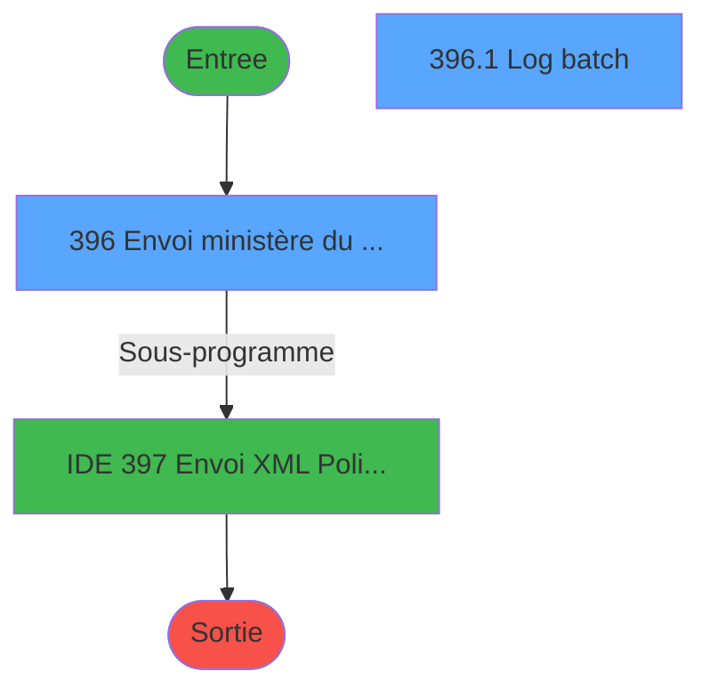
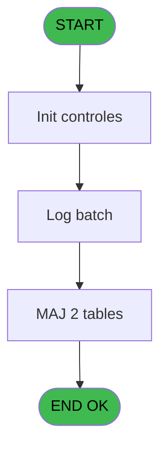

# PBP IDE 396 - Lancement fdp Brésil

> **Analyse**: Phases 1-4 2026-02-03 16:47 -> 16:48 (33s) | Assemblage 16:48
> **Pipeline**: V7.2 Enrichi
> **Structure**: 4 onglets (Resume | Ecrans | Donnees | Connexions)

<!-- TAB:Resume -->

## 1. FICHE D'IDENTITE

| Attribut | Valeur |
|----------|--------|
| Projet | PBP |
| IDE Position | 396 |
| Nom Programme | Lancement fdp Brésil |
| Fichier source | `Prg_396.xml` |
| Dossier IDE | Utilitaires |
| Taches | 4 (2 ecrans visibles) |
| Tables modifiees | 2 |
| Programmes appeles | 1 |
| :warning: Statut | **ORPHELIN_POTENTIEL** |

## 2. DESCRIPTION FONCTIONNELLE

**Lancement fdp Brésil** assure la gestion complete de ce processus.

Le flux de traitement s'organise en **1 blocs fonctionnels** :

- **Traitement** (4 taches) : traitements metier divers

**Donnees modifiees** : 2 tables en ecriture (tables_paris, Table_1017).

Detail : phases du traitement

#### Phase 1 : Traitement (4 taches)

- **396** - Envoi ministère du tourisme **[[ECRAN]](#ecran-t1)**
- **396.1** - Log batch **[[ECRAN]](#ecran-t6)**
- **396.1.1** - Libellé plus cair
- **396.1.1.1** - Libellé plus cair

Delegue a : [Envoi XML Police Brésil (IDE 397)](PBP-IDE-397.md)

#### Tables impactees

| Table | Operations | Role metier |
|-------|-----------|-------------|
| tables_paris | **W** (2 usages) |  |
| Table_1017 | **W** (1 usages) |  |

## 3. BLOCS FONCTIONNELS

### 3.1 Traitement (4 taches)

Traitements internes.

---

#### 396 - Envoi ministère du tourisme [[ECRAN]](#ecran-t1)

**Role** : Traitement : Envoi ministère du tourisme.
**Ecran** : 928 x 160 DLU (MDI) | [Voir mockup](#ecran-t1)

3 sous-taches directes

| Tache | Nom | Bloc |
|-------|-----|------|
| [396.1](#t6) | Log batch **[[ECRAN]](#ecran-t6)** | Traitement |
| [396.1.1](#t7) | Libellé plus cair | Traitement |
| [396.1.1.1](#t10) | Libellé plus cair | Traitement |

**Delegue a** : [Envoi XML Police Brésil (IDE 397)](PBP-IDE-397.md)

---

#### 396.1 - Log batch [[ECRAN]](#ecran-t6)

**Role** : Traitement : Log batch.
**Ecran** : 820 x 345 DLU | [Voir mockup](#ecran-t6)
**Variables liees** : D (v.Id log batch)
**Delegue a** : [Envoi XML Police Brésil (IDE 397)](PBP-IDE-397.md)

---

#### 396.1.1 - Libellé plus cair

**Role** : Traitement : Libellé plus cair.
**Delegue a** : [Envoi XML Police Brésil (IDE 397)](PBP-IDE-397.md)

---

#### 396.1.1.1 - Libellé plus cair

**Role** : Traitement : Libellé plus cair.
**Delegue a** : [Envoi XML Police Brésil (IDE 397)](PBP-IDE-397.md)

## 5. REGLES METIER

*(Aucune regle metier identifiee)*

## 6. CONTEXTE

- **Appele par**: (aucun)
- **Appelle**: 1 programmes | **Tables**: 3 (W:2 R:1 L:0) | **Taches**: 4 | **Expressions**: 12

<!-- TAB:Ecrans -->

## 8. ECRANS

### 8.1 Forms visibles (2 / 4)

| # | Position | Tache | Nom | Type | Largeur | Hauteur | Bloc |
|---|----------|-------|-----|------|---------|---------|------|
| 1 | 396 | 396 | Envoi ministère du tourisme | MDI | 928 | 160 | Traitement |
| 2 | 396.1 | 396.1 | Log batch | Type0 | 820 | 345 | Traitement |

### 8.2 Mockups Ecrans

---

#### 396 - Envoi ministère du tourisme
**Tache** : [396](#t1) | **Type** : MDI | **Dimensions** : 928 x 160 DLU
**Bloc** : Traitement | **Titre IDE** : Envoi ministère du tourisme

<!-- FORM-DATA:
{
    "width":  928,
    "vFactor":  8,
    "type":  "MDI",
    "hFactor":  8,
    "controls":  [
                     {
                         "x":  0,
                         "type":  "label",
                         "var":  "",
                         "y":  0,
                         "w":  922,
                         "fmt":  "",
                         "name":  "",
                         "h":  24,
                         "color":  "",
                         "text":  "",
                         "parent":  null
                     },
                     {
                         "x":  52,
                         "type":  "label",
                         "var":  "",
                         "y":  24,
                         "w":  662,
                         "fmt":  "",
                         "name":  "",
                         "h":  103,
                         "color":  "",
                         "text":  "",
                         "parent":  null
                     },
                     {
                         "x":  727,
                         "type":  "label",
                         "var":  "",
                         "y":  24,
                         "w":  186,
                         "fmt":  "",
                         "name":  "",
                         "h":  103,
                         "color":  "",
                         "text":  "",
                         "parent":  null
                     },
                     {
                         "x":  62,
                         "type":  "label",
                         "var":  "",
                         "y":  78,
                         "w":  46,
                         "fmt":  "",
                         "name":  "",
                         "h":  10,
                         "color":  "",
                         "text":  "Date",
                         "parent":  5
                     },
                     {
                         "x":  0,
                         "type":  "label",
                         "var":  "",
                         "y":  134,
                         "w":  922,
                         "fmt":  "",
                         "name":  "",
                         "h":  24,
                         "color":  "",
                         "text":  "",
                         "parent":  null
                     },
                     {
                         "x":  62,
                         "type":  "label",
                         "var":  "",
                         "y":  33,
                         "w":  215,
                         "fmt":  "",
                         "name":  "",
                         "h":  10,
                         "color":  "",
                         "text":  "Code d\u0027accès",
                         "parent":  5
                     },
                     {
                         "x":  62,
                         "type":  "label",
                         "var":  "",
                         "y":  47,
                         "w":  215,
                         "fmt":  "",
                         "name":  "",
                         "h":  9,
                         "color":  "",
                         "text":  "URL",
                         "parent":  5
                     },
                     {
                         "x":  286,
                         "type":  "edit",
                         "var":  "",
                         "y":  33,
                         "w":  416,
                         "fmt":  "",
                         "name":  "tut_repertoire_export",
                         "h":  10,
                         "color":  "",
                         "text":  "",
                         "parent":  5
                     },
                     {
                         "x":  131,
                         "type":  "edit",
                         "var":  "",
                         "y":  78,
                         "w":  126,
                         "fmt":  "DD/MM/YYYY",
                         "name":  "w0_DateMax",
                         "h":  10,
                         "color":  "110",
                         "text":  "",
                         "parent":  5
                     },
                     {
                         "x":  267,
                         "type":  "button",
                         "var":  "",
                         "y":  78,
                         "w":  33,
                         "fmt":  "...",
                         "name":  "b_DateMax",
                         "h":  10,
                         "color":  "",
                         "text":  "",
                         "parent":  5
                     },
                     {
                         "x":  743,
                         "type":  "button",
                         "var":  "",
                         "y":  105,
                         "w":  154,
                         "fmt":  "\u0026Envoyer",
                         "name":  "b_Extraire",
                         "h":  18,
                         "color":  "",
                         "text":  "",
                         "parent":  6
                     },
                     {
                         "x":  8,
                         "type":  "edit",
                         "var":  "",
                         "y":  2,
                         "w":  267,
                         "fmt":  "20",
                         "name":  "",
                         "h":  8,
                         "color":  "",
                         "text":  "",
                         "parent":  1
                     },
                     {
                         "x":  707,
                         "type":  "edit",
                         "var":  "",
                         "y":  8,
                         "w":  203,
                         "fmt":  "WWW DD MMM YYYYT",
                         "name":  "",
                         "h":  8,
                         "color":  "",
                         "text":  "",
                         "parent":  1
                     },
                     {
                         "x":  8,
                         "type":  "edit",
                         "var":  "",
                         "y":  12,
                         "w":  331,
                         "fmt":  "25",
                         "name":  "",
                         "h":  8,
                         "color":  "",
                         "text":  "",
                         "parent":  1
                     },
                     {
                         "x":  763,
                         "type":  "image",
                         "var":  "",
                         "y":  29,
                         "w":  128,
                         "fmt":  "",
                         "name":  "",
                         "h":  56,
                         "color":  "",
                         "text":  "",
                         "parent":  6
                     },
                     {
                         "x":  9,
                         "type":  "button",
                         "var":  "",
                         "y":  137,
                         "w":  154,
                         "fmt":  "\u0026Quitter",
                         "name":  "",
                         "h":  18,
                         "color":  "",
                         "text":  "",
                         "parent":  14
                     },
                     {
                         "x":  286,
                         "type":  "edit",
                         "var":  "",
                         "y":  47,
                         "w":  416,
                         "fmt":  "",
                         "name":  "endpoint_ws_police_bresil",
                         "h":  10,
                         "color":  "",
                         "text":  "",
                         "parent":  5
                     }
                 ],
    "taskId":  "396",
    "height":  160
}
-->

<strong>Champs : 6 champs</strong>

| Pos (x,y) | Nom | Variable | Type |
|-----------|-----|----------|------|
| 286,33 | tut_repertoire_export | - | edit |
| 131,78 | w0_DateMax | - | edit |
| 8,2 | 20 | - | edit |
| 707,8 | WWW DD MMM YYYYT | - | edit |
| 8,12 | 25 | - | edit |
| 286,47 | endpoint_ws_police_bresil | - | edit |

<strong>Boutons : 3 boutons</strong>

| Bouton | Pos (x,y) | Action |
|--------|-----------|--------|
| ... | 267,78 | Bouton fonctionnel |
| Envoyer | 743,105 | Bouton fonctionnel |
| Quitter | 9,137 | Quitte le programme |

---

#### 396.1 - Log batch
**Tache** : [396.1](#t6) | **Type** : Type0 | **Dimensions** : 820 x 345 DLU
**Bloc** : Traitement | **Titre IDE** : Log batch

<!-- FORM-DATA:
{
    "width":  820,
    "vFactor":  8,
    "type":  "Type0",
    "hFactor":  4,
    "controls":  [
                     {
                         "x":  4,
                         "type":  "table",
                         "var":  "",
                         "name":  "",
                         "titleH":  10,
                         "color":  "1",
                         "w":  813,
                         "y":  8,
                         "fmt":  "",
                         "parent":  null,
                         "text":  "",
                         "rowH":  13,
                         "h":  224,
                         "cols":  [
                                      {
                                          "title":  "Nom",
                                          "layer":  1,
                                          "w":  254
                                      },
                                      {
                                          "title":  "Opération",
                                          "layer":  2,
                                          "w":  136
                                      },
                                      {
                                          "title":  "Statut",
                                          "layer":  3,
                                          "w":  31
                                      },
                                      {
                                          "title":  "Détail",
                                          "layer":  4,
                                          "w":  375
                                      }
                                  ],
                         "rows":  4
                     },
                     {
                         "x":  8,
                         "type":  "edit",
                         "var":  "",
                         "y":  19,
                         "w":  250,
                         "fmt":  "",
                         "name":  "log_libelle_variable",
                         "h":  10,
                         "color":  "",
                         "text":  "",
                         "parent":  1
                     },
                     {
                         "x":  262,
                         "type":  "edit",
                         "var":  "",
                         "y":  21,
                         "w":  130,
                         "fmt":  "",
                         "name":  "log_libelle_fixe",
                         "h":  10,
                         "color":  "",
                         "text":  "",
                         "parent":  1
                     },
                     {
                         "x":  396,
                         "type":  "edit",
                         "var":  "",
                         "y":  21,
                         "w":  26,
                         "fmt":  "",
                         "name":  "log_statut",
                         "h":  10,
                         "color":  "108",
                         "text":  "",
                         "parent":  1
                     },
                     {
                         "x":  429,
                         "type":  "edit",
                         "var":  "",
                         "y":  21,
                         "w":  370,
                         "fmt":  "",
                         "name":  "log_statut_detail",
                         "h":  10,
                         "color":  "",
                         "text":  "",
                         "parent":  1
                     },
                     {
                         "x":  4,
                         "type":  "edit",
                         "var":  "",
                         "y":  236,
                         "w":  813,
                         "fmt":  "",
                         "name":  "v.Statut détail traduit",
                         "h":  100,
                         "color":  "",
                         "text":  "",
                         "parent":  null
                     }
                 ],
    "taskId":  "396.1",
    "height":  345
}
-->

<strong>Champs : 5 champs</strong>

| Pos (x,y) | Nom | Variable | Type |
|-----------|-----|----------|------|
| 8,19 | log_libelle_variable | - | edit |
| 262,21 | log_libelle_fixe | - | edit |
| 396,21 | log_statut | - | edit |
| 429,21 | log_statut_detail | - | edit |
| 4,236 | v.Statut détail traduit | - | edit |

## 9. NAVIGATION

### 9.1 Enchainement des ecrans

**Detail par enchainement :**

| Depuis | Action | Vers | Retour |
|--------|--------|------|--------|
| Envoi ministère du tourisme | Sous-programme | [Envoi XML Police Brésil (IDE 397)](PBP-IDE-397.md) | Retour ecran |

### 9.3 Structure hierarchique (4 taches)

| Position | Tache | Type | Dimensions | Bloc |
|----------|-------|------|------------|------|
| **396.1** | [**Envoi ministère du tourisme** (396)](#t1) [mockup](#ecran-t1) | MDI | 928x160 | Traitement |
| 396.1.1 | [Log batch (396.1)](#t6) [mockup](#ecran-t6) | - | 820x345 | |
| 396.1.2 | [Libellé plus cair (396.1.1)](#t7) | - | - | |
| 396.1.3 | [Libellé plus cair (396.1.1.1)](#t10) | - | - | |

### 9.4 Algorigramme

> **Legende**: Vert = START/END OK | Rouge = END KO | Bleu = Decisions
> *Algorigramme auto-genere. Utiliser `/algorigramme` pour une synthese metier detaillee.*

<!-- TAB:Donnees -->

## 10. TABLES

### Tables utilisees (3)

| ID | Nom | Description | Type | R | W | L | Usages |
|----|-----|-------------|------|---|---|---|--------|
| 112 | tables_paris |  | DB |   | **W** |   | 2 |
| 372 | pv_budget |  | DB | R |   |   | 1 |
| 1017 | Table_1017 |  | MEM |   | **W** |   | 1 |

### Colonnes par table (1 / 3 tables avec colonnes identifiees)

Table 112 - tables_paris (**W**) - 2 usages

*Table utilisee uniquement en Link ou aucune colonne Real identifiee dans le DataView.*

Table 372 - pv_budget (R) - 1 usages

| Lettre | Variable | Acces | Type |
|--------|----------|-------|------|
| A | v.DateMax | R | Date |
| B | b.DateMax | R | Alpha |
| C | b.Go | R | Alpha |
| D | v.Id log batch | R | Numeric |

Table 1017 - Table_1017 (**W**) - 1 usages

*Table utilisee uniquement en Link ou aucune colonne Real identifiee dans le DataView.*

## 11. VARIABLES

### 11.1 Variables de session (2)

Variables persistantes pendant toute la session.

| Lettre | Nom | Type | Usage dans |
|--------|-----|------|-----------|
| A | v.DateMax | Date | - |
| D | v.Id log batch | Numeric | - |

### 11.2 Autres (2)

Variables diverses.

| Lettre | Nom | Type | Usage dans |
|--------|-----|------|-----------|
| B | b.DateMax | Alpha | 1x refs |
| C | b.Go | Alpha | - |

## 12. EXPRESSIONS

**12 / 12 expressions decodees (100%)**

### 12.1 Repartition par type

| Type | Expressions | Regles |
|------|-------------|--------|
| CONSTANTE | 1 | 0 |
| DATE | 1 | 0 |
| OTHER | 9 | 0 |
| REFERENCE_VG | 1 | 0 |

### 12.2 Expressions cles par type

#### CONSTANTE (1 expressions)

| Type | IDE | Expression | Regle |
|------|-----|------------|-------|
| CONSTANTE | 11 | `'SNRHos'` | - |

#### DATE (1 expressions)

| Type | IDE | Expression | Regle |
|------|-----|------------|-------|
| DATE | 1 | `Date ()` | - |

#### OTHER (9 expressions)

| Type | IDE | Expression | Regle |
|------|-----|------------|-------|
| OTHER | 9 | `MlsTrans('Envoi ministère du tourisme Brésil')` | - |
| OTHER | 8 | `[BO]` | - |
| OTHER | 12 | `Blb2File ([I],'c:\temp\blob.xml')` | - |
| OTHER | 10 | `{1,70}` | - |
| OTHER | 7 | `[AZ]` | - |
| ... | | *+4 autres* | |

#### REFERENCE_VG (1 expressions)

| Type | IDE | Expression | Regle |
|------|-----|------------|-------|
| REFERENCE_VG | 4 | `VG2` | - |

<!-- TAB:Connexions -->

## 13. GRAPHE D'APPELS

### 13.1 Chaine depuis Main (Callers)

**Chemin**: (pas de callers directs)

### 13.2 Callers

| IDE | Nom Programme | Nb Appels |
|-----|---------------|-----------|
| - | (aucun) | - |

### 13.3 Callees (programmes appeles)

### 13.4 Detail Callees avec contexte

| IDE | Nom Programme | Appels | Contexte |
|-----|---------------|--------|----------|
| [397](PBP-IDE-397.md) | Envoi XML Police Brésil | 1 | Sous-programme |

## 14. RECOMMANDATIONS MIGRATION

### 14.1 Profil du programme

| Metrique | Valeur | Impact migration |
|----------|--------|-----------------|
| Lignes de logique | 74 | Programme compact |
| Expressions | 12 | Peu de logique |
| Tables WRITE | 2 | Impact faible |
| Sous-programmes | 1 | Peu de dependances |
| Ecrans visibles | 2 | Quelques ecrans |
| Code desactive | 0% (0 / 74) | Code sain |
| Regles metier | 0 | Pas de regle identifiee |

### 14.2 Plan de migration par bloc

#### Traitement (4 taches: 2 ecrans, 2 traitements)

- **Strategie** : Orchestrateur avec 2 ecrans (Razor/React) et 2 traitements backend (services).
- Les ecrans deviennent des composants UI, les traitements invisibles deviennent des services injectables.
- 1 sous-programme(s) a migrer ou a reutiliser depuis les services existants.
- Decomposer les taches en services unitaires testables.

### 14.3 Dependances critiques

| Dependance | Type | Appels | Impact |
|------------|------|--------|--------|
| tables_paris | Table WRITE (Database) | 2x | Schema + repository |
| Table_1017 | Table WRITE (Memory) | 1x | Schema + repository |
| [Envoi XML Police Brésil (IDE 397)](PBP-IDE-397.md) | Sous-programme | 1x | Normale - Sous-programme |

---
*Spec DETAILED generee par Pipeline V7.2 - 2026-02-03 16:48*
