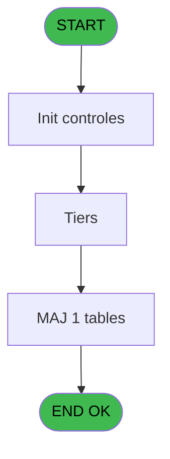

# PBP IDE 397 - Envoi XML Police Brésil

> **Analyse**: Phases 1-4 2026-02-03 16:48 -> 16:48 (17s) | Assemblage 16:48
> **Pipeline**: V7.2 Enrichi
> **Structure**: 4 onglets (Resume | Ecrans | Donnees | Connexions)

<!-- TAB:Resume -->

## 1. FICHE D'IDENTITE

| Attribut | Valeur |
|----------|--------|
| Projet | PBP |
| IDE Position | 397 |
| Nom Programme | Envoi XML Police Brésil |
| Fichier source | `Prg_397.xml` |
| Dossier IDE | Utilitaires |
| Taches | 9 (1 ecrans visibles) |
| Tables modifiees | 1 |
| Programmes appeles | 0 |

## 2. DESCRIPTION FONCTIONNELLE

**Envoi XML Police Brésil** assure la gestion complete de ce processus, accessible depuis [Lancement fdp Brésil (IDE 396)](PBP-IDE-396.md).

Le flux de traitement s'organise en **2 blocs fonctionnels** :

- **Traitement** (6 taches) : traitements metier divers
- **Initialisation** (3 taches) : reinitialisation d'etats et de variables de travail

**Donnees modifiees** : 1 tables en ecriture (Table_1017).

**Logique metier** : 1 regles identifiees couvrant conditions metier.

Detail : phases du traitement

#### Phase 1 : Initialisation (3 taches)

- **397** - XML Brazil **[[ECRAN]](#ecran-t1)**
- **397.3.2** - XML Initial
- **397.3.5** - XML Initial

#### Phase 2 : Traitement (6 taches)

- **397.1** - Count
- **397.2** - Lecture dernier lancement
- **397.3** - Clients **[[ECRAN]](#ecran-t25)**
- **397.3.1** - Nb occupants chambre
- **397.3.3** - Fill XML
- **397.3.4** - Lecture log batch avant

#### Tables impactees

| Table | Operations | Role metier |
|-------|-----------|-------------|
| Table_1017 | R/**W** (2 usages) |  |

## 3. BLOCS FONCTIONNELS

### 3.1 Initialisation (3 taches)

Reinitialisation d'etats et variables de travail.

---

#### 397 - XML Brazil [[ECRAN]](#ecran-t1)

**Role** : Reinitialisation : XML Brazil.
**Ecran** : 683 x 160 DLU (MDI) | [Voir mockup](#ecran-t1)

---

#### 397.3.2 - XML Initial

**Role** : Reinitialisation : XML Initial.

---

#### 397.3.5 - XML Initial

**Role** : Reinitialisation : XML Initial.

### 3.2 Traitement (6 taches)

Traitements internes.

---

#### 397.1 - Count

**Role** : Traitement : Count.
**Variables liees** : Z (v.Cellular country code), BD (v.Landline country code), BH (v.Guest home country), BL (v.Last country departed from), BP (v.Next country is departing to)

---

#### 397.2 - Lecture dernier lancement

**Role** : Traitement : Lecture dernier lancement.
**Variables liees** : H (v.Libellé batch lancement)

---

#### 397.3 - Clients [[ECRAN]](#ecran-t25)

**Role** : Traitement : Clients.
**Ecran** : 463 x 30 DLU (Type6) | [Voir mockup](#ecran-t25)

---

#### 397.3.1 - Nb occupants chambre

**Role** : Traitement : Nb occupants chambre.
**Variables liees** : BV (v.Occupants in the room)

---

#### 397.3.3 - Fill XML

**Role** : Traitement : Fill XML.

---

#### 397.3.4 - Lecture log batch avant

**Role** : Traitement : Lecture log batch avant.
**Variables liees** : CH (p.i.Libellé batch), CI (p.o.Id batch), CK (p.i.Id batch), H (v.Libellé batch lancement), I (v.Libellé batch création)

## 5. REGLES METIER

1 regles identifiees:

### Autres (1 regles)

#### [RM-001] Si v.Landline phone IDD [BF]>0 alors 'ERR' sinon 'OK')

| Element | Detail |
|---------|--------|
| **Condition** | `v.Landline phone IDD [BF]>0` |
| **Si vrai** | 'ERR' |
| **Si faux** | 'OK') |
| **Variables** | BF (v.Landline phone IDD) |
| **Expression source** | Expression 6 : `IF(v.Landline phone IDD [BF]>0, 'ERR', 'OK')` |
| **Exemple** | Si v.Landline phone IDD [BF]>0 → 'ERR'. Sinon → 'OK') |

## 6. CONTEXTE

- **Appele par**: [Lancement fdp Brésil (IDE 396)](PBP-IDE-396.md)
- **Appelle**: 0 programmes | **Tables**: 7 (W:1 R:3 L:5) | **Taches**: 9 | **Expressions**: 20

<!-- TAB:Ecrans -->

## 8. ECRANS

### 8.1 Forms visibles (1 / 9)

| # | Position | Tache | Nom | Type | Largeur | Hauteur | Bloc |
|---|----------|-------|-----|------|---------|---------|------|
| 1 | 397.3 | 397.3 | Clients | Type6 | 463 | 30 | Traitement |

### 8.2 Mockups Ecrans

---

#### 397.3 - Clients
**Tache** : [397.3](#t25) | **Type** : Type6 | **Dimensions** : 463 x 30 DLU
**Bloc** : Traitement | **Titre IDE** : Clients

<!-- FORM-DATA:
{
    "width":  463,
    "vFactor":  8,
    "type":  "Type6",
    "hFactor":  4,
    "controls":  [
                     {
                         "x":  8,
                         "type":  "label",
                         "var":  "",
                         "y":  8,
                         "w":  444,
                         "fmt":  "",
                         "name":  "",
                         "h":  16,
                         "color":  "156",
                         "text":  "",
                         "parent":  null
                     }
                 ],
    "taskId":  "397.3",
    "height":  30
}
-->

## 9. NAVIGATION

Ecran unique: **Clients**

### 9.3 Structure hierarchique (9 taches)

| Position | Tache | Type | Dimensions | Bloc |
|----------|-------|------|------------|------|
| **397.1** | [**XML Brazil** (397)](#t1) [mockup](#ecran-t1) | MDI | 683x160 | Initialisation |
| 397.1.1 | [XML Initial (397.3.2)](#t27) | - | - | |
| 397.1.2 | [XML Initial (397.3.5)](#t30) | - | - | |
| **397.2** | [**Count** (397.1)](#t11) | MDI | - | Traitement |
| 397.2.1 | [Lecture dernier lancement (397.2)](#t22) | - | - | |
| 397.2.2 | [Clients (397.3)](#t25) [mockup](#ecran-t25) | Type6 | 463x30 | |
| 397.2.3 | [Nb occupants chambre (397.3.1)](#t26) | - | - | |
| 397.2.4 | [Fill XML (397.3.3)](#t28) | - | - | |
| 397.2.5 | [Lecture log batch avant (397.3.4)](#t29) | - | - | |

### 9.4 Algorigramme

> **Legende**: Vert = START/END OK | Rouge = END KO | Bleu = Decisions
> *Algorigramme auto-genere. Utiliser `/algorigramme` pour une synthese metier detaillee.*

<!-- TAB:Donnees -->

## 10. TABLES

### Tables utilisees (7)

| ID | Nom | Description | Type | R | W | L | Usages |
|----|-----|-------------|------|---|---|---|--------|
| 30 | gm-recherche_____gmr | Index de recherche | DB | R |   |   | 2 |
| 31 | gm-complet_______gmc |  | DB |   |   | L | 1 |
| 34 | hebergement______heb | Hebergement (chambres) | DB | R |   | L | 2 |
| 112 | tables_paris |  | DB |   |   | L | 1 |
| 285 | email |  | DB |   |   | L | 1 |
| 364 | pms_footer_comment |  | DB |   |   | L | 1 |
| 1017 | Table_1017 |  | MEM | R | **W** |   | 2 |

### Colonnes par table (1 / 3 tables avec colonnes identifiees)

Table 30 - gm-recherche_____gmr (R) - 2 usages

| Lettre | Variable | Acces | Type |
|--------|----------|-------|------|
| D | v.XML fnrhInserir in | R | Blob |
| E | v.XML fnrhInserirResponse | R | Blob |
| F | v.XML  fnrhAtualizar in | R | Blob |
| G | v.XML  fnrhAtualizarResponse | R | Blob |
| H | v.XML fnrhCheckin in | R | Blob |
| I | v.XML fnrhCheckinResponse | R | Blob |
| J | v.XML fnrhCheckout in | R | Blob |
| K | v.XML fnrhCheckoutResponse | R | Blob |
| L | v.XML fnrhInserir in prev | R | Blob |
| M | v.XML  fnrhAtualizar in prev | R | Blob |
| N | v.XML fnrhCheckin in prev | R | Blob |
| O | v.XML fnrhCheckout in prev | R | Blob |
| CJ | p.i.Xml in | R | Blob |
| CL | p.i.Xml out | R | Blob |

Table 34 - hebergement______heb (R/L) - 2 usages

*Table utilisee uniquement en Link ou aucune colonne Real identifiee dans le DataView.*

Table 1017 - Table_1017 (R/**W**) - 2 usages

*Table utilisee uniquement en Link ou aucune colonne Real identifiee dans le DataView.*

## 11. VARIABLES

### 11.1 Parametres entrants (7)

Variables recues du programme appelant ([Lancement fdp Brésil (IDE 396)](PBP-IDE-396.md)).

| Lettre | Nom | Type | Usage dans |
|--------|-----|------|-----------|
| CH | p.i.Libellé batch | Unicode | - |
| CI | p.o.Id batch | Numeric | - |
| CJ | p.i.Xml in | Blob | - |
| CK | p.i.Id batch | Numeric | - |
| CL | p.i.Xml out | Blob | - |
| CM | p.i.Statut | Unicode | - |
| CN | p.Statut détail | Unicode | - |

### 11.2 Variables de session (55)

Variables persistantes pendant toute la session.

| Lettre | Nom | Type | Usage dans |
|--------|-----|------|-----------|
| E | v.DateMin | Date | - |
| F | v.Nb appel WS | Numeric | - |
| G | v.Nb appels WS not OK | Numeric | - |
| H | v.Libellé batch lancement | Unicode | - |
| I | v.Libellé batch création | Unicode | - |
| J | v.Libellé batch modification | Unicode | - |
| K | v.Libellé batch arrivée | Unicode | - |
| L | v.Libellé batch départ | Unicode | - |
| M | v.Debut alpha | Unicode | - |
| N | v.Fin alpha | Unicode | - |
| O | v.Compte tiers à traiter | Numeric | - |
| P | v.XML path | Alpha | - |
| Q | v.FNRH number | Alpha | - |
| R | v.Type of guest document | Alpha | - |
| S | v.CPF Number | Alpha | - |
| T | v.Guest document number | Alpha | - |
| U | v.Guest document issuer | Alpha | - |
| V | v.Guest full name | Alpha | - |
| W | v.Guest nationality | Numeric | - |
| X | v.Guest birthdate | Date | - |
| Y | v.Guest gender | Alpha | - |
| Z | v.Cellular country code | Alpha | - |
| BA | v.Cellular phone DDD | Alpha | - |
| BB | v.Cellular phone IDD | Alpha | - |
| BC | v.Cellular phone number | Unicode | - |
| BD | v.Landline country code | Alpha | - |
| BE | v.Landline phone DDD | Alpha | - |
| BF | v.Landline phone IDD | Alpha | 1x session |
| BG | v.Landline phone number | Unicode | - |
| BH | v.Guest home country | Numeric | - |
| BI | v.IBGE code of guest home town | Unicode | - |
| BJ | v.Guest home city | Unicode | - |
| BK | v.Guest home state | Unicode | - |
| BL | v.Last country departed from | Numeric | - |
| BM | v.IBGE code of the last city | Unicode | - |
| BN | v.Last city guest departed from | Unicode | - |
| BO | v.Last state guest departed frm | Unicode | - |
| BP | v.Next country is departing to | Numeric | - |
| BQ | v.IBGE code of the next city | Unicode | - |
| BR | v.Next city guest is departing | Unicode | - |
| BS | v.Next state guest is departing | Unicode | - |
| BT | v.Purpose of visit | Numeric | - |
| BU | v.Transportation | Numeric | - |
| BV | v.Occupants in the room | Numeric | - |
| BW | v.Room number | Alpha | - |
| BX | v.Checkin date | Date | - |
| BY | v.Checkin time | Time | - |
| BZ | v.Checkout date | Date | - |
| CA | v.Checkout time | Time | - |
| CB | v.Id batch création | Numeric | - |
| CC | v.Id batch modif | Numeric | - |
| CD | v.Id batch arrivée | Numeric | - |
| CE | v.Id batch départ | Numeric | - |
| CF | v.Statut | Unicode | - |
| CG | v.Statut detail | Unicode | - |

### 11.3 Autres (4)

Variables diverses.

| Lettre | Nom | Type | Usage dans |
|--------|-----|------|-----------|
| A | i.DateMax | Date | - |
| B | i.Hotel access Key | Unicode | 2x refs |
| C | i.URL endpoint | Unicode | 1x refs |
| D | o.Log batch | Numeric | [397.3.4](#t29) |

Toutes les 66 variables (liste complete)

| Cat | Lettre | Nom Variable | Type |
|-----|--------|--------------|------|
| P0 | **CH** | p.i.Libellé batch | Unicode |
| P0 | **CI** | p.o.Id batch | Numeric |
| P0 | **CJ** | p.i.Xml in | Blob |
| P0 | **CK** | p.i.Id batch | Numeric |
| P0 | **CL** | p.i.Xml out | Blob |
| P0 | **CM** | p.i.Statut | Unicode |
| P0 | **CN** | p.Statut détail | Unicode |
| V. | **E** | v.DateMin | Date |
| V. | **F** | v.Nb appel WS | Numeric |
| V. | **G** | v.Nb appels WS not OK | Numeric |
| V. | **H** | v.Libellé batch lancement | Unicode |
| V. | **I** | v.Libellé batch création | Unicode |
| V. | **J** | v.Libellé batch modification | Unicode |
| V. | **K** | v.Libellé batch arrivée | Unicode |
| V. | **L** | v.Libellé batch départ | Unicode |
| V. | **M** | v.Debut alpha | Unicode |
| V. | **N** | v.Fin alpha | Unicode |
| V. | **O** | v.Compte tiers à traiter | Numeric |
| V. | **P** | v.XML path | Alpha |
| V. | **Q** | v.FNRH number | Alpha |
| V. | **R** | v.Type of guest document | Alpha |
| V. | **S** | v.CPF Number | Alpha |
| V. | **T** | v.Guest document number | Alpha |
| V. | **U** | v.Guest document issuer | Alpha |
| V. | **V** | v.Guest full name | Alpha |
| V. | **W** | v.Guest nationality | Numeric |
| V. | **X** | v.Guest birthdate | Date |
| V. | **Y** | v.Guest gender | Alpha |
| V. | **Z** | v.Cellular country code | Alpha |
| V. | **BA** | v.Cellular phone DDD | Alpha |
| V. | **BB** | v.Cellular phone IDD | Alpha |
| V. | **BC** | v.Cellular phone number | Unicode |
| V. | **BD** | v.Landline country code | Alpha |
| V. | **BE** | v.Landline phone DDD | Alpha |
| V. | **BF** | v.Landline phone IDD | Alpha |
| V. | **BG** | v.Landline phone number | Unicode |
| V. | **BH** | v.Guest home country | Numeric |
| V. | **BI** | v.IBGE code of guest home town | Unicode |
| V. | **BJ** | v.Guest home city | Unicode |
| V. | **BK** | v.Guest home state | Unicode |
| V. | **BL** | v.Last country departed from | Numeric |
| V. | **BM** | v.IBGE code of the last city | Unicode |
| V. | **BN** | v.Last city guest departed from | Unicode |
| V. | **BO** | v.Last state guest departed frm | Unicode |
| V. | **BP** | v.Next country is departing to | Numeric |
| V. | **BQ** | v.IBGE code of the next city | Unicode |
| V. | **BR** | v.Next city guest is departing | Unicode |
| V. | **BS** | v.Next state guest is departing | Unicode |
| V. | **BT** | v.Purpose of visit | Numeric |
| V. | **BU** | v.Transportation | Numeric |
| V. | **BV** | v.Occupants in the room | Numeric |
| V. | **BW** | v.Room number | Alpha |
| V. | **BX** | v.Checkin date | Date |
| V. | **BY** | v.Checkin time | Time |
| V. | **BZ** | v.Checkout date | Date |
| V. | **CA** | v.Checkout time | Time |
| V. | **CB** | v.Id batch création | Numeric |
| V. | **CC** | v.Id batch modif | Numeric |
| V. | **CD** | v.Id batch arrivée | Numeric |
| V. | **CE** | v.Id batch départ | Numeric |
| V. | **CF** | v.Statut | Unicode |
| V. | **CG** | v.Statut detail | Unicode |
| Autre | **A** | i.DateMax | Date |
| Autre | **B** | i.Hotel access Key | Unicode |
| Autre | **C** | i.URL endpoint | Unicode |
| Autre | **D** | o.Log batch | Numeric |

## 12. EXPRESSIONS

**20 / 20 expressions decodees (100%)**

### 12.1 Repartition par type

| Type | Expressions | Regles |
|------|-------------|--------|
| CONDITION | 1 | 5 |
| CONSTANTE | 4 | 0 |
| FORMAT | 5 | 0 |
| DATE | 1 | 0 |
| OTHER | 9 | 0 |

### 12.2 Expressions cles par type

#### CONDITION (1 expressions)

| Type | IDE | Expression | Regle |
|------|-----|------------|-------|
| CONDITION | 6 | `IF(v.Landline phone IDD [BF]>0, 'ERR', 'OK')` | [RM-001](#rm-RM-001) |

#### CONSTANTE (4 expressions)

| Type | IDE | Expression | Regle |
|------|-----|------------|-------|
| CONSTANTE | 15 | `0` | - |
| CONSTANTE | 16 | `'SNRHos'` | - |
| CONSTANTE | 1 | `'SNRHos'` | - |
| CONSTANTE | 4 | `'DEB'` | - |

#### FORMAT (5 expressions)

| Type | IDE | Expression | Regle |
|------|-----|------------|-------|
| FORMAT | 14 | `DStr(o.Log batch [D], 'YYYYMMDD')` | - |
| FORMAT | 20 | `DStr({1,4}, 'YYYY-MM-DD')` | - |
| FORMAT | 13 | `DStr(i.Hotel access Key [B], 'YYYYMMDD')` | - |
| FORMAT | 2 | `StrBuild(MlsTrans('Lancement du @1@, à partir du @2@'), DStr(o.Log batch [D], '##/##/####'), DStr(i.Hotel access Key [B], '##/##/####'))` | - |
| FORMAT | 12 | `DStr(o.Log batch [D], 'YYYY-MM-DD')` | - |

#### DATE (1 expressions)

| Type | IDE | Expression | Regle |
|------|-----|------------|-------|
| DATE | 18 | `DVal(i.URL endpoint [C], 'YYYY-MM-DD')` | - |

#### OTHER (9 expressions)

| Type | IDE | Expression | Regle |
|------|-----|------------|-------|
| OTHER | 11 | `MlsTrans('WS Départ')` | - |
| OTHER | 10 | `MlsTrans('WS Arrivée')` | - |
| OTHER | 19 | `{1,4}` | - |
| OTHER | 17 | `{1,53}` | - |
| OTHER | 9 | `MlsTrans('WS Modification')` | - |
| ... | | *+4 autres* | |

<!-- TAB:Connexions -->

## 13. GRAPHE D'APPELS

### 13.1 Chaine depuis Main (Callers)

Main -> ... -> [Lancement fdp Brésil (IDE 396)](PBP-IDE-396.md) -> **Envoi XML Police Brésil (IDE 397)**

### 13.2 Callers

| IDE | Nom Programme | Nb Appels |
|-----|---------------|-----------|
| [396](PBP-IDE-396.md) | Lancement fdp Brésil | 1 |

### 13.3 Callees (programmes appeles)

### 13.4 Detail Callees avec contexte

| IDE | Nom Programme | Appels | Contexte |
|-----|---------------|--------|----------|
| - | (aucun) | - | - |

## 14. RECOMMANDATIONS MIGRATION

### 14.1 Profil du programme

| Metrique | Valeur | Impact migration |
|----------|--------|-----------------|
| Lignes de logique | 541 | Programme volumineux |
| Expressions | 20 | Peu de logique |
| Tables WRITE | 1 | Impact faible |
| Sous-programmes | 0 | Peu de dependances |
| Ecrans visibles | 1 | Ecran unique ou traitement batch |
| Code desactive | 0% (0 / 541) | Code sain |
| Regles metier | 1 | Quelques regles a preserver |

### 14.2 Plan de migration par bloc

#### Initialisation (3 taches: 1 ecran, 2 traitements)

- **Strategie** : Constructeur/methode `InitAsync()` dans l'orchestrateur.

#### Traitement (6 taches: 1 ecran, 5 traitements)

- **Strategie** : Orchestrateur avec 1 ecrans (Razor/React) et 5 traitements backend (services).
- Les ecrans deviennent des composants UI, les traitements invisibles deviennent des services injectables.
- Decomposer les taches en services unitaires testables.

### 14.3 Dependances critiques

| Dependance | Type | Appels | Impact |
|------------|------|--------|--------|
| Table_1017 | Table WRITE (Memory) | 1x | Schema + repository |

---
*Spec DETAILED generee par Pipeline V7.2 - 2026-02-03 16:48*
