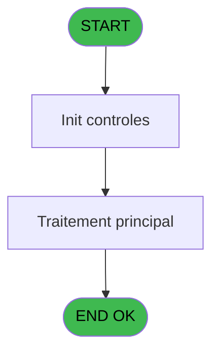
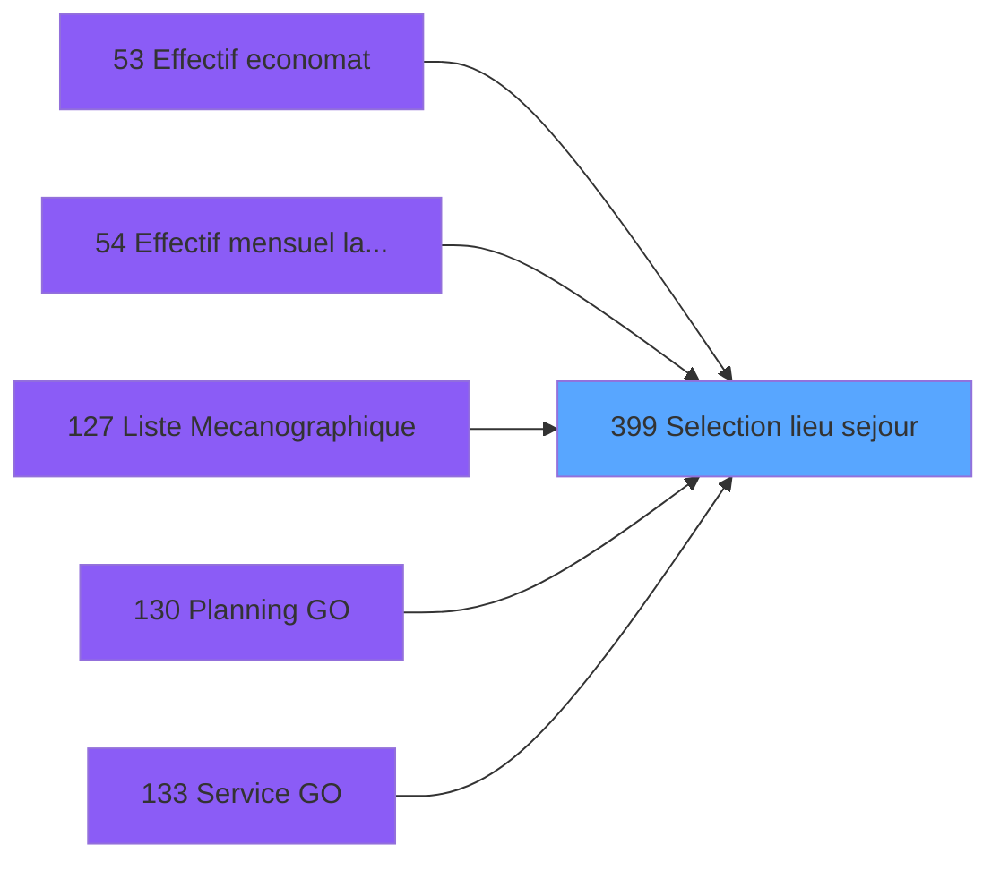
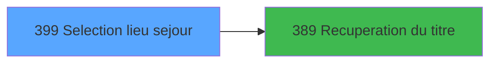

# PBP IDE 399 - Selection lieu sejour

> **Analyse**: Phases 1-4 2026-02-03 16:49 -> 16:49 (15s) | Assemblage 16:49
> **Pipeline**: V7.2 Enrichi
> **Structure**: 4 onglets (Resume | Ecrans | Donnees | Connexions)

<!-- TAB:Resume -->

## 1. FICHE D'IDENTITE

| Attribut | Valeur |
|----------|--------|
| Projet | PBP |
| IDE Position | 399 |
| Nom Programme | Selection lieu sejour |
| Fichier source | `Prg_399.xml` |
| Dossier IDE | Zoom |
| Taches | 1 (1 ecrans visibles) |
| Tables modifiees | 0 |
| Programmes appeles | 1 |

## 2. DESCRIPTION FONCTIONNELLE

**Selection lieu sejour** assure la gestion complete de ce processus, accessible depuis [Service GO (IDE 133)](PBP-IDE-133.md), [Effectif mensuel lancement (IDE 54)](PBP-IDE-54.md), [Liste Mecanographique (IDE 127)](PBP-IDE-127.md), [Planning GO (IDE 130)](PBP-IDE-130.md), [  Liste CLients arrivant (IDE 156)](PBP-IDE-156.md), [  Liste Clients present (IDE 162)](PBP-IDE-162.md), [  Liste CLients depart (IDE 168)](PBP-IDE-168.md), [Liste CLients AVPBDR (IDE 174)](PBP-IDE-174.md), [  Liste present personnel plan (IDE 227)](PBP-IDE-227.md), [  Liste personnels AVPBDR (IDE 234)](PBP-IDE-234.md), [  Liste logement PASDL (IDE 258)](PBP-IDE-258.md), [Extraction chambres dispos (IDE 266)](PBP-IDE-266.md), [Extraction chambres dispos (IDE 415)](PBP-IDE-415.md), [Effectif economat (IDE 53)](PBP-IDE-53.md), [Liste des absences (IDE 237)](PBP-IDE-237.md), [Lancement Edition statistiques (IDE 353)](PBP-IDE-353.md), [Log statistiques (IDE 359)](PBP-IDE-359.md).

Le flux de traitement s'organise en **1 blocs fonctionnels** :

- **Consultation** (1 tache) : ecrans de recherche, selection et consultation

## 3. BLOCS FONCTIONNELS

### 3.1 Consultation (1 tache)

Ecrans de recherche et consultation.

---

#### 399 - selection lieu sejour [[ECRAN]](#ecran-t1)

**Role** : Selection par l'operateur : selection lieu sejour.
**Ecran** : 397 x 165 DLU (MDI) | [Voir mockup](#ecran-t1)
**Variables liees** : C (> lieu sejour), E (bouton selectionner)

## 5. REGLES METIER

*(Aucune regle metier identifiee)*

## 6. CONTEXTE

- **Appele par**: [Service GO (IDE 133)](PBP-IDE-133.md), [Effectif mensuel lancement (IDE 54)](PBP-IDE-54.md), [Liste Mecanographique (IDE 127)](PBP-IDE-127.md), [Planning GO (IDE 130)](PBP-IDE-130.md), [  Liste CLients arrivant (IDE 156)](PBP-IDE-156.md), [  Liste Clients present (IDE 162)](PBP-IDE-162.md), [  Liste CLients depart (IDE 168)](PBP-IDE-168.md), [Liste CLients AVPBDR (IDE 174)](PBP-IDE-174.md), [  Liste present personnel plan (IDE 227)](PBP-IDE-227.md), [  Liste personnels AVPBDR (IDE 234)](PBP-IDE-234.md), [  Liste logement PASDL (IDE 258)](PBP-IDE-258.md), [Extraction chambres dispos (IDE 266)](PBP-IDE-266.md), [Extraction chambres dispos (IDE 415)](PBP-IDE-415.md), [Effectif economat (IDE 53)](PBP-IDE-53.md), [Liste des absences (IDE 237)](PBP-IDE-237.md), [Lancement Edition statistiques (IDE 353)](PBP-IDE-353.md), [Log statistiques (IDE 359)](PBP-IDE-359.md)
- **Appelle**: 1 programmes | **Tables**: 1 (W:0 R:1 L:0) | **Taches**: 1 | **Expressions**: 8

<!-- TAB:Ecrans -->

## 8. ECRANS

### 8.1 Forms visibles (1 / 1)

| # | Position | Tache | Nom | Type | Largeur | Hauteur | Bloc |
|---|----------|-------|-----|------|---------|---------|------|
| 1 | 399 | 399 | selection lieu sejour | MDI | 397 | 165 | Consultation |

### 8.2 Mockups Ecrans

---

#### 399 - selection lieu sejour
**Tache** : [399](#t1) | **Type** : MDI | **Dimensions** : 397 x 165 DLU
**Bloc** : Consultation | **Titre IDE** : selection lieu sejour

<!-- FORM-DATA:
{
    "width":  397,
    "vFactor":  8,
    "type":  "MDI",
    "hFactor":  8,
    "controls":  [
                     {
                         "x":  33,
                         "type":  "table",
                         "var":  "",
                         "name":  "",
                         "titleH":  12,
                         "color":  "196",
                         "w":  338,
                         "y":  5,
                         "fmt":  "",
                         "parent":  null,
                         "text":  "",
                         "rowH":  12,
                         "h":  113,
                         "cols":  [
                                      {
                                          "title":  "Code",
                                          "layer":  1,
                                          "w":  50
                                      },
                                      {
                                          "title":  "Nom",
                                          "layer":  2,
                                          "w":  251
                                      }
                                  ],
                         "rows":  2
                     },
                     {
                         "x":  0,
                         "type":  "label",
                         "var":  "",
                         "y":  143,
                         "w":  393,
                         "fmt":  "",
                         "name":  "",
                         "h":  20,
                         "color":  "",
                         "text":  "",
                         "parent":  null
                     },
                     {
                         "x":  39,
                         "type":  "edit",
                         "var":  "",
                         "y":  19,
                         "w":  26,
                         "fmt":  "",
                         "name":  "IMP CODE LIEU SEJOUR",
                         "h":  10,
                         "color":  "196",
                         "text":  "",
                         "parent":  1
                     },
                     {
                         "x":  91,
                         "type":  "edit",
                         "var":  "",
                         "y":  19,
                         "w":  238,
                         "fmt":  "",
                         "name":  "IMP NOM IMPORT",
                         "h":  10,
                         "color":  "196",
                         "text":  "",
                         "parent":  1
                     },
                     {
                         "x":  10,
                         "type":  "button",
                         "var":  "",
                         "y":  146,
                         "w":  144,
                         "fmt":  "\u0026Sélectionner",
                         "name":  "bouton selectionner",
                         "h":  14,
                         "color":  "",
                         "text":  "",
                         "parent":  7
                     },
                     {
                         "x":  240,
                         "type":  "button",
                         "var":  "",
                         "y":  146,
                         "w":  144,
                         "fmt":  "\u0026Quitter",
                         "name":  "bouton quitter",
                         "h":  14,
                         "color":  "",
                         "text":  "",
                         "parent":  7
                     },
                     {
                         "x":  168,
                         "type":  "image",
                         "var":  "",
                         "y":  120,
                         "w":  58,
                         "fmt":  "",
                         "name":  "",
                         "h":  18,
                         "color":  "",
                         "text":  "",
                         "parent":  null
                     }
                 ],
    "taskId":  "399",
    "height":  165
}
-->

<strong>Champs : 2 champs</strong>

| Pos (x,y) | Nom | Variable | Type |
|-----------|-----|----------|------|
| 39,19 | IMP CODE LIEU SEJOUR | - | edit |
| 91,19 | IMP NOM IMPORT | - | edit |

<strong>Boutons : 2 boutons</strong>

| Bouton | Pos (x,y) | Action |
|--------|-----------|--------|
| Sélectionner | 10,146 | Bouton fonctionnel |
| Quitter | 240,146 | Quitte le programme |

## 9. NAVIGATION

Ecran unique: **selection lieu sejour**

### 9.3 Structure hierarchique (1 tache)

| Position | Tache | Type | Dimensions | Bloc |
|----------|-------|------|------------|------|
| **399.1** | [**selection lieu sejour** (399)](#t1) [mockup](#ecran-t1) | MDI | 397x165 | Consultation |

### 9.4 Algorigramme

> **Legende**: Vert = START/END OK | Rouge = END KO | Bleu = Decisions
> *Algorigramme auto-genere. Utiliser `/algorigramme` pour une synthese metier detaillee.*

<!-- TAB:Donnees -->

## 10. TABLES

### Tables utilisees (1)

| ID | Nom | Description | Type | R | W | L | Usages |
|----|-----|-------------|------|---|---|---|--------|
| 118 | tables_imports |  | DB | R |   |   | 1 |

### Colonnes par table (1 / 1 tables avec colonnes identifiees)

Table 118 - tables_imports (R) - 1 usages

| Lettre | Variable | Acces | Type |
|--------|----------|-------|------|
| A | > liste | R | Alpha |
| B | > top liste | R | Alpha |
| C | > lieu sejour | R | Alpha |
| D | w0_AutorisQuitter | R | Logical |
| E | bouton selectionner | R | Alpha |
| F | bouton quitter | R | Alpha |
| G | v. titre | R | Alpha |

## 11. VARIABLES

### 11.1 Variables de session (1)

Variables persistantes pendant toute la session.

| Lettre | Nom | Type | Usage dans |
|--------|-----|------|-----------|
| G | v. titre | Alpha | 1x session |

### 11.2 Autres (6)

Variables diverses.

| Lettre | Nom | Type | Usage dans |
|--------|-----|------|-----------|
| A | > liste | Alpha | - |
| B | > top liste | Alpha | - |
| C | > lieu sejour | Alpha | [399](#t1) |
| D | w0_AutorisQuitter | Logical | 1x refs |
| E | bouton selectionner | Alpha | 2x refs |
| F | bouton quitter | Alpha | - |

## 12. EXPRESSIONS

**8 / 8 expressions decodees (100%)**

### 12.1 Repartition par type

| Type | Expressions | Regles |
|------|-------------|--------|
| CONSTANTE | 1 | 0 |
| CONDITION | 2 | 0 |
| OTHER | 3 | 0 |
| CAST_LOGIQUE | 1 | 0 |
| STRING | 1 | 0 |

### 12.2 Expressions cles par type

#### CONSTANTE (1 expressions)

| Type | IDE | Expression | Regle |
|------|-----|------------|-------|
| CONSTANTE | 3 | `4` | - |

#### CONDITION (2 expressions)

| Type | IDE | Expression | Regle |
|------|-----|------------|-------|
| CONDITION | 6 | `> lieu sejour [C]` | - |
| CONDITION | 1 | `w0_AutorisQuitter [D]=GetParam ('SOCIETE') AND bouton selectionner [E]<>'N' AND bouton selectionner [E]<>'G'` | - |

#### OTHER (3 expressions)

| Type | IDE | Expression | Regle |
|------|-----|------------|-------|
| OTHER | 8 | `v. titre [G]` | - |
| OTHER | 5 | `GetParam ('SOCIETE')` | - |
| OTHER | 4 | `bouton selectionner [E]` | - |

#### CAST_LOGIQUE (1 expressions)

| Type | IDE | Expression | Regle |
|------|-----|------------|-------|
| CAST_LOGIQUE | 7 | `'TRUE'LOG` | - |

#### STRING (1 expressions)

| Type | IDE | Expression | Regle |
|------|-----|------------|-------|
| STRING | 2 | `Trim ([J])` | - |

<!-- TAB:Connexions -->

## 13. GRAPHE D'APPELS

### 13.1 Chaine depuis Main (Callers)

Main -> ... -> [Service GO (IDE 133)](PBP-IDE-133.md) -> **Selection lieu sejour (IDE 399)**

Main -> ... -> [Effectif mensuel lancement (IDE 54)](PBP-IDE-54.md) -> **Selection lieu sejour (IDE 399)**

Main -> ... -> [Liste Mecanographique (IDE 127)](PBP-IDE-127.md) -> **Selection lieu sejour (IDE 399)**

Main -> ... -> [Planning GO (IDE 130)](PBP-IDE-130.md) -> **Selection lieu sejour (IDE 399)**

Main -> ... -> [  Liste CLients arrivant (IDE 156)](PBP-IDE-156.md) -> **Selection lieu sejour (IDE 399)**

Main -> ... -> [  Liste Clients present (IDE 162)](PBP-IDE-162.md) -> **Selection lieu sejour (IDE 399)**

Main -> ... -> [  Liste CLients depart (IDE 168)](PBP-IDE-168.md) -> **Selection lieu sejour (IDE 399)**

Main -> ... -> [Liste CLients AVPBDR (IDE 174)](PBP-IDE-174.md) -> **Selection lieu sejour (IDE 399)**

Main -> ... -> [  Liste present personnel plan (IDE 227)](PBP-IDE-227.md) -> **Selection lieu sejour (IDE 399)**

Main -> ... -> [  Liste personnels AVPBDR (IDE 234)](PBP-IDE-234.md) -> **Selection lieu sejour (IDE 399)**

Main -> ... -> [  Liste logement PASDL (IDE 258)](PBP-IDE-258.md) -> **Selection lieu sejour (IDE 399)**

Main -> ... -> [Extraction chambres dispos (IDE 266)](PBP-IDE-266.md) -> **Selection lieu sejour (IDE 399)**

Main -> ... -> [Extraction chambres dispos (IDE 415)](PBP-IDE-415.md) -> **Selection lieu sejour (IDE 399)**

Main -> ... -> [Effectif economat (IDE 53)](PBP-IDE-53.md) -> **Selection lieu sejour (IDE 399)**

Main -> ... -> [Liste des absences (IDE 237)](PBP-IDE-237.md) -> **Selection lieu sejour (IDE 399)**

Main -> ... -> [Lancement Edition statistiques (IDE 353)](PBP-IDE-353.md) -> **Selection lieu sejour (IDE 399)**

Main -> ... -> [Log statistiques (IDE 359)](PBP-IDE-359.md) -> **Selection lieu sejour (IDE 399)**

### 13.2 Callers

| IDE | Nom Programme | Nb Appels |
|-----|---------------|-----------|
| [133](PBP-IDE-133.md) | Service GO | 4 |
| [54](PBP-IDE-54.md) | Effectif mensuel lancement | 2 |
| [127](PBP-IDE-127.md) | Liste Mecanographique | 2 |
| [130](PBP-IDE-130.md) | Planning GO | 2 |
| [156](PBP-IDE-156.md) |   Liste CLients arrivant | 2 |
| [162](PBP-IDE-162.md) |   Liste Clients present | 2 |
| [168](PBP-IDE-168.md) |   Liste CLients depart | 2 |
| [174](PBP-IDE-174.md) | Liste CLients AVPBDR | 2 |
| [227](PBP-IDE-227.md) |   Liste present personnel plan | 2 |
| [234](PBP-IDE-234.md) |   Liste personnels AVPBDR | 2 |
| [258](PBP-IDE-258.md) |   Liste logement PASDL | 2 |
| [266](PBP-IDE-266.md) | Extraction chambres dispos | 2 |
| [415](PBP-IDE-415.md) | Extraction chambres dispos | 2 |
| [53](PBP-IDE-53.md) | Effectif economat | 1 |
| [237](PBP-IDE-237.md) | Liste des absences | 1 |
| [353](PBP-IDE-353.md) | Lancement Edition statistiques | 1 |
| [359](PBP-IDE-359.md) | Log statistiques | 1 |

### 13.3 Callees (programmes appeles)

### 13.4 Detail Callees avec contexte

| IDE | Nom Programme | Appels | Contexte |
|-----|---------------|--------|----------|
| [389](PBP-IDE-389.md) | Recuperation du titre | 1 | Recuperation donnees |

## 14. RECOMMANDATIONS MIGRATION

### 14.1 Profil du programme

| Metrique | Valeur | Impact migration |
|----------|--------|-----------------|
| Lignes de logique | 23 | Programme compact |
| Expressions | 8 | Peu de logique |
| Tables WRITE | 0 | Impact faible |
| Sous-programmes | 1 | Peu de dependances |
| Ecrans visibles | 1 | Ecran unique ou traitement batch |
| Code desactive | 0% (0 / 23) | Code sain |
| Regles metier | 0 | Pas de regle identifiee |

### 14.2 Plan de migration par bloc

#### Consultation (1 tache: 1 ecran, 0 traitement)

- **Strategie** : Composants de recherche/selection en modales.
- 1 ecran : selection lieu sejour

### 14.3 Dependances critiques

| Dependance | Type | Appels | Impact |
|------------|------|--------|--------|
| [Recuperation du titre (IDE 389)](PBP-IDE-389.md) | Sous-programme | 1x | Normale - Recuperation donnees |

---
*Spec DETAILED generee par Pipeline V7.2 - 2026-02-03 16:49*
